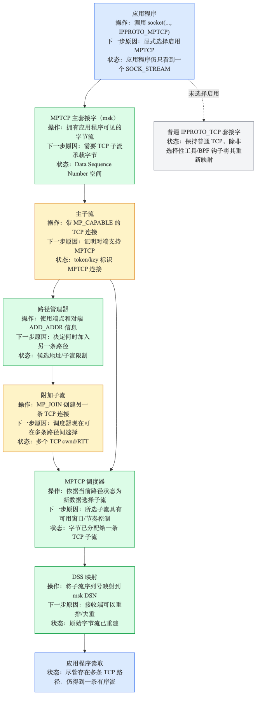
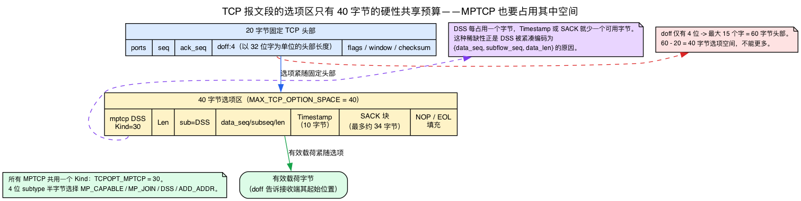
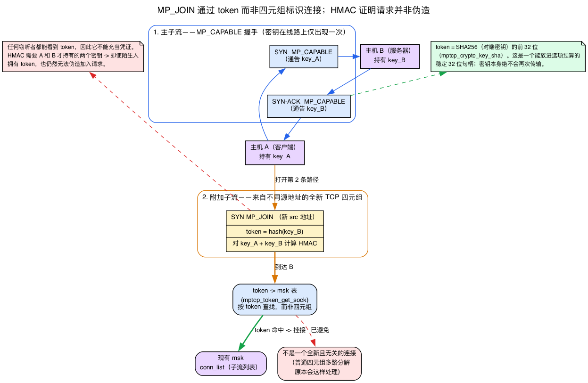
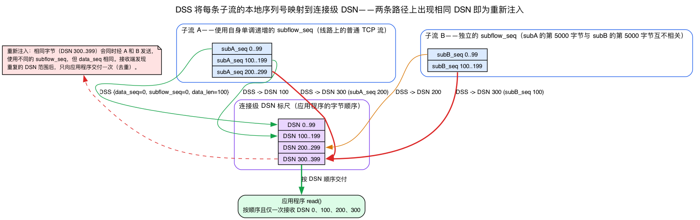
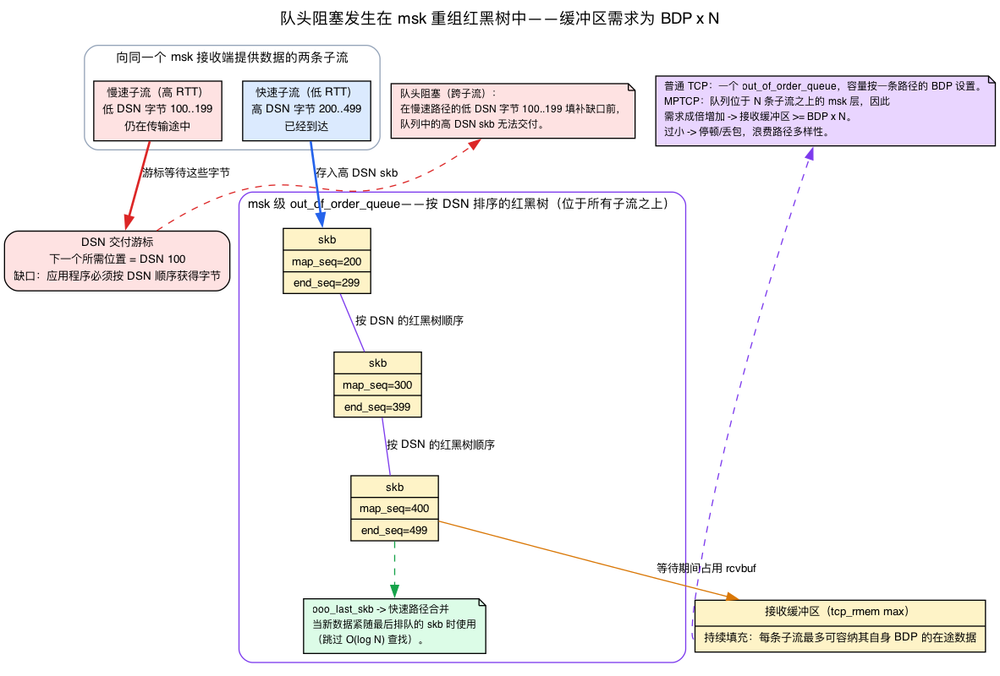

# 第26天 — MPTCP：多路径 TCP

> **今日任务：** 理解单个 TCP 连接如何能够同时使用多条路径，以及 Linux 如何通过持有多个子流（subflow）的“msk”套接字来实现 MPTCP。在这个过程中，我们会讲清楚 MPTCP 所依赖、但此前章节都未曾涵盖的四种机制——TCP 选项如何在仅 40 字节的紧张预算内承载协议、一个 token 加上一个 HMAC 如何把新子流绑定到正确的连接上、让接收方能够重新拼接数据流的两层序列号方案，以及队头阻塞所在的 msk 级别重组队列——这样实验中的一切都不再是黑盒。总时长：约 120 分钟。第 4 阶段结束。

## MPTCP 是什么

一个 TCP 连接通常是一个套接字对：一个客户端 IP、一个服务器 IP、一条 TCP 数据流。**MPTCP（RFC 8684）** 让一条逻辑连接能够同时通过多条 TCP“子流”承载数据。

其动机在于：移动设备同时拥有 WiFi 和蜂窝网络。批量传输的主机拥有多块网卡。如今，切换网络需要建立一条新的 TCP 连接——这会丢失在途数据，有时还会丢失上层状态。MPTCP 让连接在网络切换后继续保持，*并且* 能同时并发使用多条路径以获得更高的吞吐量。



## 协议模型

一个 MPTCP 连接具有：

- **一个“msk”（主套接字，master socket）**——这是应用程序看到的东西。从应用程序的角度看，它就是一个普通的 `SOCK_STREAM` 套接字。
- **一个或多个子流**——每个子流都是一条真实的、跑在某条路径上的 TCP 连接。第一个子流是“主”子流；额外的子流（`MP_JOIN`）在之后加入。

每个子流都是双向的。MPTCP 调度器决定每个报文段交给哪个子流（或者，为了冗余，同时发往两个子流）。序列号分为两层：每个子流一层（普通 TCP）以及每个 msk 一层（MPTCP 级别），这样接收方无论每个数据块来自哪个子流，都能重建出原始的字节流。

其中三句一行的论断 ——“MPTCP 搭载在 TCP 选项之内”“加入时用 token 来指名连接”以及“序列号分为两层”—— 都在默默地做着大量工作，接下来的四个背景部分会在我们接触内核之前，把每一点讲具体。

## 背景 1：TCP 选项是一份稀缺的 TLV 预算——MPTCP 正承载其中

今天你将看到的每一个 MP_CAPABLE、MP_JOIN 和 DSS 都是一个 **TCP 选项**。所以，在“线路上的信令”能够表达任何含义之前，你需要确切知道 TCP 选项是什么，以及为什么它的空间如此之少。

**复习（第15天），不再重讲：** 一个 TCP 报文段是固定的 **20 字节头部**，后面跟着可选的 *选项*，再后面是负载。头部中一个称为 **`doff`（数据偏移，data offset）** 的 4 位字段以 32 位字为单位计量头部长度，因此它告诉接收方选项在哪里结束、负载从哪里开始（`day15.md:52`、`day15.md:23`）。这就是我们要构建于其上的全部基础——我们不会重新推导头部。

**新内容——每个选项都是一个 TLV。** 选项区域不是自由格式的。它是一串 **TLV** 记录：1 字节的 **Kind**、1 字节的 **Length**（涵盖 Kind + Length + Value），然后是 **Value** 字节。接收方通过读取 Kind、然后 Length、然后跳过 Length 个字节到下一个选项来遍历它们。（有几个单字节选项——End-of-options 和 No-op 填充——是例外，但每一个携带数据的选项都是完整的 Kind/Length/Value 三元组。）

**新内容——MPTCP 是单个 Kind，内部带有一个子类型半字节（nibble）。** MPTCP **并不** 为每种消息类型各占一个选项 Kind。它只占用恰好一个：

```c
/* include/net/tcp.h:216 */
#define TCPOPT_MPTCP    30   /* Multipath TCP (RFC6824) */
```

具体属于 *哪种* MPTCP 消息——MP_CAPABLE、MP_JOIN、DSS、ADD_ADDR——被编码为选项 Value 第一个字节中的一个 4 位 **子类型** 半字节：

```c
/* net/mptcp/protocol.h:42-45 — the subtype nibbles */
#define MPTCPOPT_MP_CAPABLE  0
#define MPTCPOPT_MP_JOIN     1
#define MPTCPOPT_DSS         2
#define MPTCPOPT_ADD_ADDR    3
```

这正是为什么 tcpdump 会打印出像 `mptcp 26 dss` 这样的行：`30` 这个 Kind 被解码为单词 `mptcp`，`26` 是以**字节**为单位的选项 **Length**，而 `dss` 是解码出来的子类型半字节。当你读到 `mptcp 8 dss ack` 时，你读到的是“一个 8 字节的选项，Kind 为 30，子类型为 DSS，仅携带一个 Data-ACK”。`mptcp_write_options()`（`net/mptcp/options.c:1403`）就是在发送侧把这些子类型写入选项区域的函数。

**新内容——40 字节的上限，以及它为何让 DSS 如此简短。** 因为 `doff` 只有 4 位，它最多能计量 15 个字 = 60 字节的头部。减去固定的 20 字节，整个选项区域最多只能有 **40 字节**：

```c
/* include/net/tcp.h:71 */
#define MAX_TCP_OPTION_SPACE 40
```

那 40 字节是一份硬性的、共享的预算。MPTCP 选项必须与 TCP 本身已经想放进那里的一切东西共存——时间戳选项（10 字节）、SACK 块（最多约 34 字节）、窗口缩放、SYN 上的 MSS。没有空间容纳冗长的编码格式。这种稀缺正是 DSS 被打包成一个紧凑的 `{data_seq, subflow_seq, data_len}` 三元组的全部原因（见背景 3），也是“性能特性”一节警告 MPTCP 每个报文段开销的原因：每花掉一个 DSS 字节，就是一个无法留给时间戳或 SACK 的字节。



**新内容——为什么中间盒（middlebox）可以悄无声息地把它剥掉。** 一个 TCP 选项是 *可选的，某些中间盒会剥掉它们不认识的选项*：一个符合规范的路由器会原样转发 Kind 30，但一个不符合规范、不理解它的 NAT 可能会在转发报文段其余部分的同时把它丢弃。对端的 TCP 仍然看到一条有效的数据流——只是没有了 MP_CAPABLE 握手。这就是“优雅回退（graceful fallback）”背后的机制：因为 MPTCP 信令完全承载在一个可被剥离的可选头部字段中，一条会破坏它的路径会导致连接 **降级为普通的单路径 TCP**，而不是彻底断掉。你如果不先看到协议在线上的整个存在都是可选的，就无法理解下面那段关于回退的文字。

## 线路上的信令

MPTCP 使用 **TCP 选项**（即背景 1 介绍的变长头部字段）来承载它的协议——全部归于单个 Kind 30 之下，通过子类型加以区分：

- **MP_CAPABLE**，出现在主子流的 SYN 中：“我支持 MPTCP；你支持吗？”
- **MP_JOIN**，出现在额外子流的 SYN 中：“我想加入由 token X 标识的 MPTCP 连接。”（背景 2 将解释这个 token *是什么*，以及它如何把请求导向正确的连接。）
- **DSS（Data Sequence Signal，数据序列信号）**：每个报文段的元数据，把子流的本地序列号映射到 msk 级别的序列号（见背景 3）。
- **ADD_ADDR / REMOVE_ADDR**：宣告对端可用于通过 MP_JOIN 加入的额外端点。

如果某个中间盒剥掉了 MP_* 选项（某些老式 NAT 会这么做），MPTCP 会优雅地回退到普通 TCP——原因正如背景 1 所述：这些选项是可选的，所以一个剥掉未识别的 Kind 30 的 NAT，留下的是一条有效的普通 TCP 数据流。

## 背景 2：token——把新子流绑定到正确的 msk 上

上面的 MP_JOIN 说“加入由 token X 标识的连接”。这句话引出了本章原本没有回答的三个问题：token 从哪里来，接收方主机如何把一个 token 变回正确的连接，以及是什么阻止陌生人猜出一个 token 就劫持连接。这三个答案都在这里。

**新内容——token 是对端密钥的一个哈希。** 在 MP_CAPABLE 握手期间，每一方都交换一个 **64 位密钥**。之后在 MP_JOIN 中宣告的 32 位 **token** 是对端密钥的一个密码学哈希（SHA-256）—— 一个稳定的、连接唯一的句柄，它在不把密钥重新放回线上的前提下适配了紧张的选项预算：

```c
/* net/mptcp/crypto.c:30 — token = first 32 bits of SHA256(key) */
void mptcp_crypto_key_sha(u64 key, u32 *token, u64 *idsn)
```

msk 存储它自己的 token，以便查找表能找到它：

```c
/* net/mptcp/protocol.h:309 */
u32  token;
```

**新内容——接收方按 token 而不是按 4 元组做解复用（demux）。** 回想第13天：普通 TCP 通过对到来报文段的 **4 元组**（源 IP、源端口、目的 IP、目的端口）做哈希来找到拥有它的 `struct sock`。但一个 MP_JOIN SYN 到达时用的是一个 *全新的* TCP 4 元组——一个从未见过的地址对——所以 4 元组解复用会创建一个全新的、无关的连接。MPTCP 增加了一个 **第二解复用键**：内核维护一张全局的 token→msk 表，直接查这个 token。

```c
/* net/mptcp/token.c:246 — retrieve the owning msk from the token */
struct mptcp_sock *mptcp_token_get_sock(struct net *net, u32 token)
```

当查找成功时，新子流会挂到已有 msk 的子流链表上，而不是开启一条新连接——这就是“msk 拥有一个子流列表”的具体实现机制。下面这个片段展示的是在 msk 创建时加入的 *主* 子流；之后一个 `MP_JOIN` 会从子流接收路径把新子流追加到 **同一个** `conn_list` 上（`net/mptcp/protocol.c:3609`）：

```c
/* net/mptcp/protocol.c:103-117 — __mptcp_socket_create() adds the FIRST subflow */
err = mptcp_subflow_create_socket(sk, sk->sk_family, &ssock);
...
list_add(&subflow->node, &msk->conn_list);   /* the conn_list the msk owns; a join appends here too, from protocol.c:3609 */
```

**新内容——HMAC 阻止陌生人 *伪造或重放* 一次 join。** token 对任何看过握手的人都是可见的，所以单凭 token 不能作为凭证。MP_JOIN 还携带一个 **HMAC**，它是 *以两个 64 位密钥为密钥（key）* 的——只有两个端点才拥有这两个密钥（这两个密钥只在最初的 MP_CAPABLE 握手期间出现在线上）—— 并且是在两端于 MP_JOIN 握手本身中交换的 *两个随机 nonce* 之上计算的（每个方向一个 nonce）。密钥用于认证；nonce 让每一次 join 的挑战-应答都保持新鲜：

```c
/* net/mptcp/subflow.c:50 — keys are the HMAC *key*; the *message* is the two nonces */
static void subflow_generate_hmac(u64 key1, u64 key2, u32 nonce1, u32 nonce2,
                                  void *hmac)
/* net/mptcp/crypto.c:43 — the underlying keyed HMAC (msg is supplied by the caller above) */
void mptcp_crypto_hmac_sha(u64 key1, u64 key2, u8 *msg, int len, void *hmac)
```

所以对“难道拥有 token 的人不能注入一个子流吗？”的回答是否定的，理由有两点：伪造者需要 *两个* 密钥来作为 HMAC 的密钥（而这两个密钥在 MP_CAPABLE 之后就再也不会被重传），并且即使一个攻击者捕获了一个有效的 MP_JOIN 也无法重放它，因为新鲜的、每次 join 独有的 nonce 让每个 HMAC 都是唯一的。



## 背景 3：两层序列号，以及连接二者的 DSS 映射

“序列号分为两层”这句话让重注入（reinjection）、去重（dedup）和重组（reassembly）成为可能——但本章从未展示第二层携带了什么，也没说明为什么一层不够。这里就是。

**复习（第15天），不再重讲：** 在普通 TCP 中，`seq` 为我发送的字节编号，而 `ack_seq` 是我期望的下一个字节（`day15.md:48`、`day15.md:67`）。记住这一点；我们在它之上构建。

**新内容——为什么两层不可避免。** 每个子流都必须在线上放上 **普通的、连续的 TCP 序列号**，因为对端的 TCP 协议栈以及该路径上的每一个中间盒都期望一条正常、无空洞的 TCP 数据流——任何别的东西看起来都像损坏，会被丢弃。但那些每个子流各自的计数器 **在子流之间是相互独立的**：子流 A 的第 5000 字节和子流 B 的第 5000 字节彼此毫无关系。它们自己无法告诉接收方如何把两条数据流拼接回应用程序发送的那一条字节顺序。于是 MPTCP 增加了第二个计数器：**数据序列号（Data Sequence Number，DSN）**，一个覆盖 *应用程序* 字节的、单一的、连接范围内的序列空间。

**新内容——DSS 是这两者之间的映射。** DSS 选项是连接两层序列号的纽带。它携带一个映射三元组外加一个独立的 Data-ACK：

```c
/* net/mptcp/protocol.h:149-151 — the DSS mapping triple */
u64  data_seq;     /* msk-level DSN where this mapping starts */
u32  subflow_seq;  /* offset into THIS subflow's stream where it starts */
u16  data_len;     /* how many bytes the mapping covers */
```

接收方把它读作：“那 `data_len` 个到达于子流偏移 `subflow_seq` 处的字节，实际上属于应用程序数据流中 DSN 为 `data_seq` 的位置。”正是这个转换让走了不同路径的字节能被重新排序成一条数据流。DSS 还携带一个单独的 **Data-ACK**，因此 msk 可以在连接级别释放发送缓冲区中的数据，而独立于每个子流自己的 ACK。子类型是 `MPTCPOPT_DSS = 2`（`net/mptcp/protocol.h:44`），而在发送侧，每一个等待发出的应用程序数据块都被作为一个记住其 DSN 的数据级别分片来跟踪：

```c
/* net/mptcp/protocol.h:261-263 */
struct mptcp_data_frag {
    struct list_head list;
    u64 data_seq;      /* the DSN this fragment occupies */
```

`mptcp_write_options()`（`net/mptcp/options.c:1403`）把 DSS 映射写入选项区域。

**新内容——这就是让重注入变得廉价的原因。** 因为 DSN 独立于任何子流的序列空间，**相同的应用程序字节** 可以在两个不同的子流上发送，用两个不同的 `subflow_seq` 值，但用 **相同的 `data_seq`**。接收方看到重复的 DSN 范围，只向应用程序交付一次。这就是你将在“可靠性与恢复”中遇到的收益：一个停滞子流的数据可以在一个健康的子流上被 *重注入*，而应用程序永远不会看到重复。



## 常见疑问

**问：token 只不过是任何人都可能嗅探到的、密钥的一个公开哈希。如果我知道了 token，我不就能把我自己的子流注入到别人的连接里吗？**

答：不能。token 只 *路由* 一个 MP_JOIN 到正确的 msk；它不是凭证。这次 join 还必须携带一个 **以两个端点各自的 64 位密钥为密钥** 的 HMAC，而那两个密钥只在最初的 MP_CAPABLE 握手中出现在线上一次。没有这两个密钥，你就无法产生一个有效的 HMAC，所以单凭 token 你什么也做不到。而且因为 HMAC 是在每次 join 新鲜的 nonce 之上计算的，你甚至无法重放一个你早先捕获的有效 join——每一个都是唯一的。

**问：为什么每个字节要有两个序列号？为什么不干脆用一个大的、连接范围的计数器，把每个子流的 seq 省掉？**

答：因为每个子流都是一条 *真实的* TCP 连接，会被真实的中间盒检查。对端的 TCP 协议栈以及那条路径上的每一个 NAT/防火墙都期望一条普通、无空洞的 TCP 序列流——喂给它们一个带空洞的连接范围 DSN（空洞是因为其他字节走了另一个子流），它看起来就像损坏，会被丢弃。所以每个子流都必须携带普通、连续的 TCP seq 号来 *看起来正常*，而 MPTCP 通过 DSS 在其之上叠加 DSN，把这些数据流重新拼合起来。


## API

```c
int sk = socket(AF_INET, SOCK_STREAM, IPPROTO_MPTCP);
```

就这样。应用程序看到的是一个普通套接字。内核处理所有子流管理。（`IPPROTO_MPTCP = 262`。）

`net.mptcp.enabled=1` 控制是否可以创建 MPTCP 套接字；它 **不会** 把普通的 `IPPROTO_TCP` 套接字重映射为 MPTCP。应用程序通过 `IPPROTO_MPTCP` 主动选择加入，或者运维人员可以使用某种选择性机制，例如 `mptcpize`/LD_PRELOAD，或者一个 BPF socket-create 钩子，在创建之前改变特定套接字。

## 端点配置

子流不会自动创建——你要告诉 MPTCP 哪些地址可以使用。

```bash
# Mark an address as an MPTCP endpoint
sudo ip mptcp endpoint add 192.168.2.10 dev eth1 signal
# 'signal' = announce this address to peers via ADD_ADDR

# Or 'subflow' = automatically initiate a subflow from this address
sudo ip mptcp endpoint add 192.168.99.5 dev eth0 subflow

# Inspect
sudo ip mptcp endpoint show
sudo ip mptcp limits show     # how many subflows max
```

端点标志：
- **`signal`**：向对端宣告（对端可以从这个地址加入）。
- **`subflow`**：从这个地址发起一个子流。
- **`backup`**：低优先级子流（仅在其他子流不可用时使用）。
- **`fullmesh`**：从这个地址向每一个对端端点创建子流。

（`ip mptcp` 是一个 netlink 客户端——关于这些命令实际如何到达内核，见下面关于路径管理器的说明。）

## 调度器

`net/mptcp/sched.c`。调度器决定哪个子流获得下一个报文段：

- **default**（`mptcp_sched_default`）：使用内核内部的发送时间估算、排队数据、pacing 速率、窗口空间和 backup 状态来选择一个可用子流。

调度器框架是可插拔的（`struct mptcp_sched_ops`），但你系统上可用的集合恰恰就是内核已注册的那些。配置前先检查：

```bash
cat /proc/sys/net/mptcp/available_schedulers
cat /proc/sys/net/mptcp/scheduler
sudo sysctl -w net.mptcp.scheduler=default
```

不要假设 `redundant`、`round-robin` 或 `bpf` 存在，除非它出现在你正在运行的内核的 `available_schedulers` 中。

## 路径管理器

`net/mptcp/pm_*.c`——决定 *何时* 添加/移除子流。有两种形式：

- **内核内（In-kernel）**：内核的路径管理器使用已配置的端点，自行添加子流。
- **用户空间（Userspace）**：一个应用程序通过 Netlink API（netlink 套接字）驱动子流的生命周期。被诸如 `mptcpd` 之类的工具使用。

**配置如何到达内核（回顾，第8天）。** 回想第8天背景 4（`day08.md:257`）：`ip route` 只是一个 netlink 客户端——它打开一个 `AF_NETLINK` 套接字并发送结构化消息，由各类型的处理程序把它们转换为 FIB 变更。`ip mptcp` 以及像 `mptcpd` 这样的守护进程用 *同样* 的方式给内核的 MPTCP 状态编程——只不过 MPTCP 注册了它 **自己的通用 netlink（generic-netlink）族**（即 `pm_netlink` / `pm_userspace` 路径），而不是复用 rtnetlink。你在下面运行的每一个 `ip mptcp endpoint add` 和 `ip mptcp limits set` 都是发往那个族的一条通用 netlink 消息。我们在这里不重讲 netlink 套接字模型——见第8天。

## 可靠性与恢复

每个子流都是一条真实的 TCP 连接——它有自己的 RTT、cwnd 和重传逻辑。msk 层还提供：

- **失败时重注入（Reinjection on failure）**：如果一个子流的 RTO 触发且它无法交付，msk 会把数据在另一个子流上重注入（这样对端就通过另一条路径收到它）。这正是背景 3 所解释的重注入：相同 DSN，不同 subflow_seq。
- **基于 DSN 的去重**：接收方看到 msk 级别的序列号；即使数据到达两次（每个子流一次），接收方也只向应用程序交付一次。
- **连接迁移（Connection migration）**：如果当前所有子流都失败了（例如 WiFi + 蜂窝网络都短暂失去信号），msk 会等待；当连通性恢复时新的子流可以加入。应用程序的连接得以保留。

## 背景 4：msk 重组队列与队头阻塞

“性能特性”中的警告（“接收缓冲区 ≥ BDP × N”“慢路径上的队头阻塞”）以及整道检查问题的答案都取决于一个结构：msk 在等待期间保存乱序数据的队列。这里说明它是什么，以及为什么它的大小随子流数量而缩放。

**复习（第17–18天），不再重新推导：** 第18天讲了 **带宽时延积（BDP）**——一条满载管道上的在途字节数 = 带宽 × RTT——以及在 `tcp_rmem[min, default, max]` 三元组之内的接收缓冲区 **自动调优**，外加让你退出自动调优的 `SOCK_RCVBUF_LOCK` 用户锁（`day18.md:116-130`）。第17天讲了在途计量（`day17.md:138`）。记住那些；检查题答案里“把 tcp_rmem 提升到各 BDP 之和”只有在它们之上才讲得通。

**新内容——队头（HoL）阻塞是什么。** 这个术语在本书更早处都不曾出现，所以要精确定义它。应用程序必须按 **DSN 顺序** 接收字节——字节 N 在字节 N+1 之前，没有空洞。假设一个快子流已经交付了一个 *高* DSN 处的数据块，但排在它前面的 *低* DSN 字节仍在一个慢子流上在途。那些高 DSN 字节还不能交给应用程序——它们必须在 *队头* 等待那些缺失的低 DSN 字节。快路径停滞在慢路径上。这就是队头阻塞，而在 MPTCP 上它发生在 **跨** 子流之间，而不是在单个子流内。

**新内容——保存等待数据的结构。** 那些早到的高 DSN skb 进入 msk 的 **乱序重组队列**，一棵按 DSN 键控的红黑树（rbtree）：

```c
/* net/mptcp/protocol.c:266-271 — insert an out-of-order skb into the msk's DSN rbtree */
p = &msk->out_of_order_queue.rb_node;
...
rb_insert_color(&skb->rbnode, &msk->out_of_order_queue);
msk->ooo_last_skb = skb;
```

一个快路径合并检查使用 `ooo_last_skb`，当数据恰好在最后一个排队的 skb 之后到达时，避免一次 O(log N) 的查找（`net/mptcp/protocol.c:278-285`）。每一个排队的 skb 在它的控制块中记住自己的 DSN 范围：

```c
/* net/mptcp/protocol.h:128-136 */
struct mptcp_skb_cb {
    u64 map_seq;   /* first DSN this skb covers   */
    u64 end_seq;   /* one past the last DSN        */
    ...
};
```

当慢子流的队头字节还在途时，那棵红黑树正是**占用接收缓冲区**的结构。如果缓冲区容纳不下大约 *每个子流一份 BDP* 的数据，内核就必须停滞或丢弃，而 MPTCP 原本要利用的路径多样性也就无从发挥。这就是“BDP × N”论断的具体依据：这个要求随 **子流数量** 缩放，因为每个子流都可以有自己一份 BDP 在途，而接收方可能不得不同时缓冲全部这些数据。

**新内容——与单路径 TCP 的对比。** 普通 TCP 有一个单一的、每套接字的 `out_of_order_queue`，大小按一条路径的 BDP 设定。MPTCP 的重组队列位于**所有子流之上的 msk 层**，这正是为什么它的缓冲区要求乘以 N，而不是固定在一条路径那份。



## 性能特性

MPTCP 在以下情况表现最佳：
- **存在多条路径**，且 RTT 和带宽相近。
- **单路径失败率不可忽略**（移动、有损路径）。
- **批量传输足够大**，以致每个子流的建立成本被摊薄。

在以下情况它比普通 TCP 更差：
- 只有一条路径可用（MPTCP 选项的开销、较慢的握手）。
- 各条路径的 RTT 差异很大（慢路径上的队头阻塞——背景 4）。
- 缓冲区太小，无法协调各子流（msk 级别的重排序需要接收缓冲区 ≥ BDP × N——背景 4）。

## 实验

```bash
# Verify MPTCP support; save the current value if you change it.
old_mptcp_enabled=$(cat /proc/sys/net/mptcp/enabled)
sudo sysctl net.mptcp.enabled
sudo sysctl -w net.mptcp.enabled=1
trap 'sudo sysctl -w net.mptcp.enabled=$old_mptcp_enabled; pkill -f /tmp/mptcp_demo 2>/dev/null; rm -f /tmp/mptcp_demo /tmp/mptcp_demo.c' EXIT

# Use ip mptcp tooling
sudo ip mptcp endpoint show
cat /proc/sys/net/mptcp/available_schedulers
# 'endpoint show' is normally empty on a single-host test until you add
# endpoints — that's expected, not a failure. 'available_schedulers' prints
# at least 'default'.

# Quick test over loopback. Stock `nc` has no `--mptcp` flag and the `mptcpize`
# LD_PRELOAD wrapper needs the mptcpd package — neither is guaranteed present —
# so we use ONE self-contained binary that is both the MPTCP server and client.
# It holds the connection open for a few seconds so `ss -M` and tcpdump can
# observe the live msk and its subflow instead of catching nothing after exit.
cat << 'EOF' > /tmp/mptcp_demo.c
#include <stdio.h>
#include <stdlib.h>
#include <string.h>
#include <unistd.h>
#include <sys/socket.h>
#include <sys/wait.h>
#include <netinet/in.h>
#include <arpa/inet.h>
#ifndef IPPROTO_MPTCP
#define IPPROTO_MPTCP 262
#endif
int main(void) {
    struct sockaddr_in a = { .sin_family = AF_INET, .sin_port = htons(9999) };
    inet_aton("127.0.0.1", &a.sin_addr);

    int srv = socket(AF_INET, SOCK_STREAM, IPPROTO_MPTCP);
    if (srv < 0) { perror("socket(server)"); return 1; }
    int one = 1; setsockopt(srv, SOL_SOCKET, SO_REUSEADDR, &one, sizeof one);
    if (bind(srv, (struct sockaddr*)&a, sizeof a) < 0) { perror("bind"); return 1; }
    if (listen(srv, 1) < 0) { perror("listen"); return 1; }

    if (fork() == 0) {                      // child = client
        int c = socket(AF_INET, SOCK_STREAM, IPPROTO_MPTCP);
        if (c < 0) { perror("socket(client)"); _exit(1); }
        if (connect(c, (struct sockaddr*)&a, sizeof a) < 0) { perror("connect"); _exit(1); }
        write(c, "hello\n", 6);
        sleep(6);                           // hold the connection open to observe
        close(c); _exit(0);
    }

    int cs = accept(srv, NULL, NULL);       // parent = server
    if (cs < 0) { perror("accept"); return 1; }
    char buf[64]; int n = read(cs, buf, sizeof buf);
    if (n > 0) write(1, buf, n);            // prints "hello"
    sleep(6);
    close(cs); close(srv);
    wait(NULL);
    return 0;
}
EOF
cc /tmp/mptcp_demo.c -o /tmp/mptcp_demo

# Run it in the background so we can watch the connection while it is still up.
/tmp/mptcp_demo &
sleep 1

# 'M' = MPTCP. Shows the msk and its subflow while the connection is live.
ss -M | head
```

在环回接口（loopback）上，你会看到单个子流表现为一对 `ESTAB` 行（分别对应这条唯一路径的客户端和服务器端；你的临时端口会不同）：

```
State Recv-Q Send-Q Local Address:Port  Peer Address:Port
ESTAB 0      0          127.0.0.1:48902    127.0.0.1:9999
ESTAB 0      0          127.0.0.1:9999     127.0.0.1:48902
```

如果 `ss -M` 只打印出表头，说明在你查看之前连接已经关闭了——两端的 `sleep(6)` 就是用来让它保持足够长时间以供观察的，所以要重新运行 `ss -M`，并确保此时 `/tmp/mptcp_demo` 仍在后台运行。

用 tcpdump 验证。**先** 启动捕获（用 `-l` 行缓冲，用 `timeout` 自终止），然后再把流量驱动进去。tcpdump 以 **小写** 解码 MPTCP 的 TCP 选项（`mptcp ... capable`、`mptcp ... dss`），所以要匹配那些——大写的 `MP_CAPABLE`/`DSS` 记号永远不会出现在它的输出里，而 `-X` 只转储负载字节，那里的二进制选项字段并不是字面字符串。

```bash
sudo timeout 8 tcpdump -l -i lo -nn 'tcp port 9999' 2>/dev/null | grep -i mptcp &
sleep 1
/tmp/mptcp_demo
```

你应该会在 SYN/SYN-ACK 上看到 `mptcp ... capable`（MP_CAPABLE 握手），并在数据和 ACK 报文段上看到 `mptcp ... dss`：

```
IP 127.0.0.1.9999 > 127.0.0.1.48902: Flags [.], ..., options [...,mptcp 26 dss fin ack ... seq ... subseq 0 len 1,...], length 0
IP 127.0.0.1.48902 > 127.0.0.1.9999: Flags [F.], ..., options [...,mptcp 8 dss ack ...], length 0
```

（现在你能读懂那些行了：`mptcp` 是 Kind 30，它后面的数字是以字节为单位的选项 **Length**，`dss` 是子类型，而 `seq`/`subseq`/`len` 是背景 3 介绍的 DSS 映射三元组。）

### 观察真正的多路径（可选）

上面的环回测试始终只有 **一条** 路径——同一对地址——所以连接在恰好 **一个** 子流上完成了 MP_CAPABLE 握手外加 DSS。`ss -M` 列出这一个子流，并且 **`MP_JOIN` 永远不出现**：没有第二条路径可加入。要在单台主机上观察真正的多路径，就给内核一个它可以从中开启额外子流的第二个地址。这会 **改变持久的内核 MPTCP 状态**，所以之后要撤销它（在你的内核上核实确切的 `ip mptcp` 语法——它在各版本之间已经变化过）：

```bash
# Announce a second loopback address and allow one extra subflow.
sudo ip addr add 127.0.0.2/8 dev lo
sudo ip mptcp limits set subflow 2 add_addr_accepted 2
sudo ip mptcp endpoint add 127.0.0.2 dev lo signal subflow  # ADD_ADDR so the peer can join + initiate a subflow from it

# Re-run the transfer, then look for the second subflow and the MP_JOIN exchange:
/tmp/mptcp_demo & sleep 1; ss -M | head
sudo timeout 8 tcpdump -l -i lo -nn 'tcp port 9999' 2>/dev/null | grep -iE 'join|add'

# Cleanup
sudo ip mptcp endpoint flush
sudo ip mptcp limits set subflow 2 add_addr_accepted 0
sudo ip addr del 127.0.0.2/8 dev lo
```

配置了第二个端点后，你应该会在捕获中看到 `mptcp ... join`，并在 `ss -M` 中看到一个额外的子流——这正是 MPTCP 要实现的多路径行为。（你看到的这个 `join` 携带着背景 2 介绍的 token 和 HMAC；token 负责把这个全新的 4 元组导向已有的 msk。）

## 在内核中阅读什么

- **`net/mptcp/protocol.c`**——主文件。读 `__mptcp_socket_create` 看一个 msk 是如何构建的。msk 拥有一个子流列表。

- **`net/mptcp/subflow.c`**——子流生命周期。`subflow_finish_connect`、`mptcp_subflow_create_socket`。一条 TCP 子流如何成为一个 MPTCP 连接的一部分。

- **`net/mptcp/sched.c:130`**——`mptcp_init_sched`。调度器入口。读默认调度器路径，看内核如何为每次发送挑选“最佳”子流。

- **`net/mptcp/pm_kernel.c`**——内核内路径管理器。读取 MPTCP 端点配置，在有宣告时开启新子流。

- **`net/mptcp/pm_userspace.c`**——通过 netlink 的用户空间路径管理器钩子。

- **`net/mptcp/options.c`**——MPTCP 的 TCP 选项编码/解码。读 `mptcp_write_options` 看 MP_CAPABLE、MP_JOIN、DSS 是如何被写出的。

- **`Documentation/networking/mptcp.rst`**——官方指南。有示例和一个兼容性矩阵。

- **`mptcpd`**（用户空间守护进程）—— 一个参考路径管理器实现；对研究真实世界的配置模式很有用。

## 要点回顾

- **MPTCP** = 一条 TCP 连接，多条跑在不同路径上的 TCP 子流。
- API：`socket(AF_INET, SOCK_STREAM, IPPROTO_MPTCP)`。应用代码很少需要改动。
- **子流** 是真实的 TCP 连接；**msk**（主套接字）协调它们。
- 所有 MPTCP 信令都搭载在 **归于单个 Kind、`TCPOPT_MPTCP = 30` 之下的 TCP 选项** 中，共享硬性的 **`MAX_TCP_OPTION_SPACE = 40`** 字节预算；消息类型是一个 4 位 **子类型** 半字节（MP_CAPABLE/MP_JOIN/DSS/ADD_ADDR）。因为选项是可选的，且某些 NAT 会剥掉它们不认识的选项，所以一个丢弃 Kind 30 的中间盒会强制优雅回退到普通 TCP。
- 关键 TCP 选项：**MP_CAPABLE**（握手，交换 64 位密钥）、**MP_JOIN**（添加子流，携带 token = SHA256(对端密钥) + 以两个密钥为密钥、在两个每次 join 的 nonce 之上计算的 HMAC）、**DSS**（把 subflow_seq→msk DSN 映射 + Data-ACK）、**ADD_ADDR**（宣告端点）。
- 一个新的 MP_JOIN 通过 **token→msk 查找**（`mptcp_token_get_sock`）来解复用，而不是通过 4 元组，因此来自一个从未见过的地址的数据包仍能找到它的连接；HMAC 阻止伪造的 join。
- **两个序列层：** 每个子流的 TCP seq（让每条路径看起来正常）和连接范围的 **DSN**；DSS 是黏合剂，而一个共享的 DSN 配上不同的 subflow_seq 就是使能重注入和去重的东西。
- 接收方在 **msk 级别的 `out_of_order_queue` 红黑树（按 DSN 键控）** 中缓冲乱序数据；跨子流的 **队头阻塞** 意味着接收缓冲区的要求大约是 **BDP × N**。
- **端点** 通过 `ip mptcp endpoint` 配置（一个通用 netlink 客户端，就像 `ip route` 之于 rtnetlink——第8天）。标志：`signal`、`subflow`、`backup`、`fullmesh`。
- **调度器** 是可插拔的，但当前的选择就是 `net.mptcp.available_schedulers` 中出现的任何东西；树内默认是 `default`。
- **移动 / 多网卡** 工作负载受益；单路径低时延工作负载会承受 MPTCP 的开销。
- 自 5.6（2020）起进入内核树；一路到 7.x 每个版本都有可观的改进。

## 检查问题

如果一个子流的 RTT 严重飙升（例如传输过程中蜂窝网络劣化），MPTCP 会做什么，它能优雅恢复到什么程度的极限在哪里？

<details>
<summary>点击查看答案</summary>

**答案：** 默认调度器会使用它的发送时间估算、排队数据、pacing 速率、窗口空间和 backup 状态，把新报文段引导到一个更好的可用子流上。一条 RTT 明显更差或没有可用窗口的路径自然会得到更少的流量。已经在慢子流上在途的报文段会留在那里，直到被 ACK 或重传；如果慢子流的 RTO 触发，MPTCP 级别的重传也可以把它们在更好的子流上重注入（相同 DSN，不同 subflow_seq——背景 3）。

**极限在于缓冲。** msk 在接收方按顺序重组数据，数据存放在按 DSN 键控的 `out_of_order_queue` 红黑树中（见背景 4）。如果子流 A 快（低 RTT、当前数据）而子流 B 慢（高 RTT、更早的数据），接收方就得在等待 B 那些更早的低 DSN 数据到达的同时缓冲 A 的高 DSN 数据。如果接收缓冲区太小（`tcp_rmem`），MPTCP 就无法利用路径多样性——慢路径上的队头阻塞会让应用程序停滞。调优：把 `tcp_rmem` 提升到至少各子流 BDP 之和。

**对于突然的完全失败**（一个子流的 RTO 中断）：MPTCP 可以把它标记为 `backup` 并重注入；应用程序会看到一次短暂停滞，但没有错误。

</details>

---

## 第 4 阶段结束

你已经覆盖了内核的各网络子系统：用于数据包过滤的 netfilter、作为现代过滤 API 的 nftables、用于状态跟踪的 conntrack、用于排队的流量控制（traffic control）、用于套接字扩展的 SO_REUSEPORT、用于传输层加密的 kTLS、用于多路径的 MPTCP。这些内容涵盖了“基础协议栈之外的内核网络基础设施”的绝大部分。

第 5 阶段（第27–30天）覆盖现代特性以及综合项目（capstone）。
