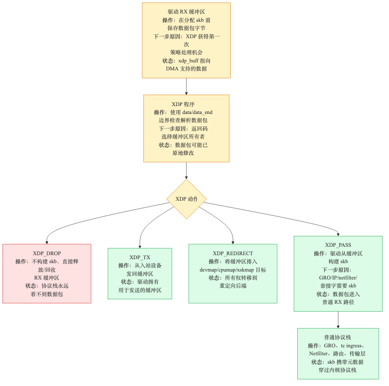
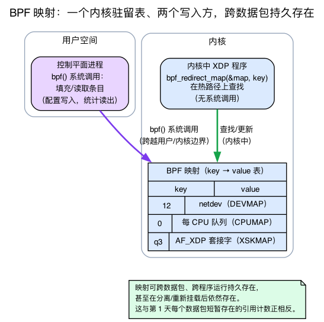
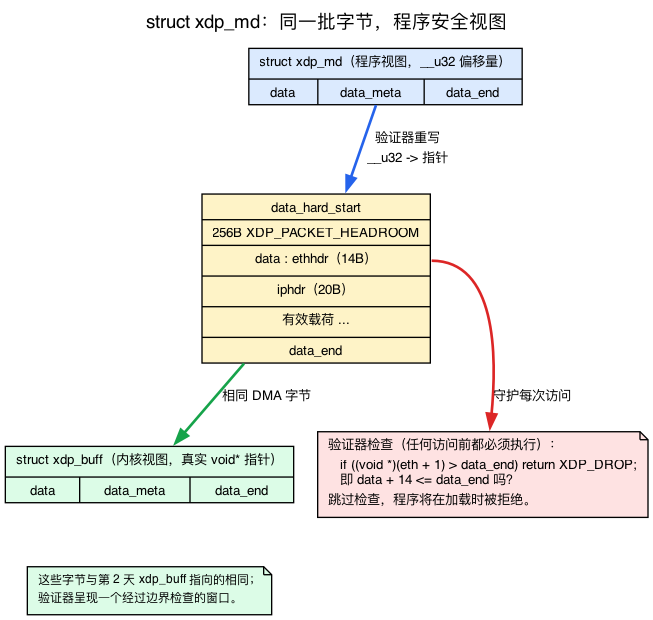
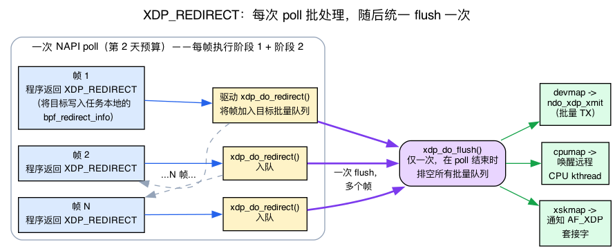
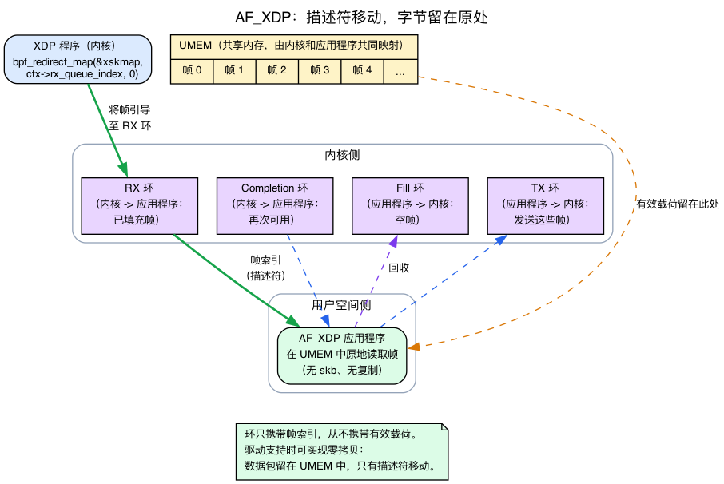

# 第27天 — XDP 与协议栈的其余部分

> **今日任务：** 精确看清 XDP 钩子在接收路径中的位置、它为何能比 tc-bpf 更快地完成某些工作，以及 XDP 如何与常规 Linux 网络协议栈协作（而非取代它）。一路上我们会补齐本书其余部分从未讲过的四块背景：**BPF 映射**到底是什么、`struct xdp_md` 在你的程序看来长什么样、`XDP_REDIRECT` *真正*是怎么触发的，以及 AF_XDP 套接字是什么。总时长：约 110 分钟。

> **第 5 阶段从这里开始。** 最后四天讲述叠加在你已学到的一切之上的现代钩子，外加一个收官日——届时你将端到端地追踪一个真实数据包。

## XDP 在内核侧是什么

你在 **第2天** 已经见过 XDP，所以我们不会从头重新推导。一句话回顾：

> **回顾第2天：** *原生（native）* XDP 是一段 eBPF 程序，驱动在 **任何 `sk_buff` 存在之前** 就对原始 RX 帧运行它——这是内核中最早的软件钩子。它处理一个 `xdp_buff`（覆盖在 DMA 页上的四个栈指针，没有 slab 分配，没有 `users`/`dataref` 引用计数）并返回五个动作码之一。`XDP_PASS` 是*唯一*会继续去构建 skb 的动作；其余四个都在驱动内终止该帧的后续处理。*通用（generic）* XDP（`do_xdp_generic` → `netif_receive_generic_xdp`，`net/core/dev.c:5656`/`:5576`）是较慢的回退方案，它在 skb 已经存在之后才运行。

于是这五个动作，按内核定义它们的顺序（`enum xdp_action`，`include/uapi/linux/bpf.h:6548`——注意 `XDP_ABORTED` 是 **0**，不是最后一个）：

- **`XDP_ABORTED` (0)**——效果与 DROP 相同，另外还会触发一个跟踪点（调试信号）。
- **`XDP_DROP`**——数据包在驱动内被释放，内核不做任何工作。
- **`XDP_PASS`**——内核分配 skb 并继续正常的 RX 流程（第2天）。
- **`XDP_TX`**——把它从同一块网卡发回去，在完全不接触 skb 的情况下反射数据包。
- **`XDP_REDIRECT`**——把它送往另一个 netdev、一个 CPU 映射（cpumap），或一个 AF_XDP 套接字。



这是 **内核中处理入向数据包的最早钩子**。在 XDP 之前只有网卡，以及刚刚接收该帧的驱动代码。

## 为什么这很重要

> **回顾第1天：** 分配一个 `sk_buff` 并非免费——它包括描述符的一次 slab 分配、外加一次独立的数据缓冲区分配、引用计数的设置以及写脏缓存行（约 500 ns 的固定开销）。路由、conntrack（第20–22天）和 netfilter 各自还会在此之上再加开销。

对于高速率的数据包过滤或负载均衡，对于那些你反正要丢弃或重定向的数据包，你不想为它们付出上述任何开销。XDP 的固定开销约为 10 ns，再加上你程序自身的逻辑。在 XDP 中丢包是 Linux 能做的最廉价的数据包操作。Cilium 的负载均衡器、Cloudflare 的 DDoS 清洗、Facebook 的 Katran——它们全都用 XDP 在内核正式处理数据包前的几百纳秒内决定“丢弃 / 放行 / 重定向 / 篡改”。

## 三种模式

XDP 有三种执行模式，在挂载时选定：

### 原生 XDP（默认，最快）

驱动实现了 XDP 支持：它在自己的 NAPI 轮询中、在分配 skb 之前，直接调用 `bpf_prog_run_xdp`。数据包位于驱动的 RX 缓冲区中；XDP 拿到指向它的指针和数据长度。对于空程序，开销约 10 ns。

支持原生 XDP 的主要驱动：ixgbe、i40e、mlx5、mlx4、virtio_net、veth（是的，veth 支持 XDP——便于测试）。

### 通用 XDP（`XDP_FLAGS_SKB_MODE`）

在任何驱动上都能工作。内核把 XDP 实现为一个钩子，位于驱动已经完成了一些与 skb 相关的设置*之后*。比原生慢（约为其一半速度），因为它重复了一些工作。

当你的网卡不支持原生 XDP 时使用通用模式。或者用于在较老的 VM 环境中基于 virtio 做开发。

### 硬件卸载 XDP（`XDP_FLAGS_HW_MODE`）

BPF 程序被 JIT 编译进网卡固件（Netronome NFP、某些 Mellanox 型号）。它运行*在网卡上*，而不是在主机 CPU 上。对简单程序而言速度极快，但非常受限——卸载目标只支持映射与辅助函数的一个*子集*（例如 NFP 卸载数组/哈希映射外加 `map_lookup/update/delete_elem` 和 `xdp_adjust_head/tail`，但拒绝该子集之外的任何东西）。具体能用什么取决于网卡。

实际中很少见；大多数生产环境的 XDP 运行在原生模式下。

---

## 背景 1：BPF 映射到底是什么

XDP 做的每一件有意思的事——重定向到某个设备、引导到某个 CPU、交给某个用户空间套接字、导出一个丢包计数器——都依赖于本书此前一直默认读者已经了解的机制：一个 **BPF 映射**。下文整个“`XDP_REDIRECT` — 最适合的场景”一节都建立在三种映射类型之上，而关于 tc-bpf 协作的说明中提到 XDP 和 tc“通过共享映射通信”。下面把映射的具体机制讲清楚。

### 映射解决的问题：BPF 程序是无状态的，会遗忘一切

一个 XDP 程序运行、返回一个动作码，然后就*结束了*——没有 skb 可以藏状态（它在 skb 存在之前运行），没有套接字可以挂数据。每次调用都从空白状态开始。那么一个负载均衡器如何在数百万个数据包之间记住它的后端列表？一个 DDoS 过滤器如何把“我丢了 40 亿个数据包”导出到仪表盘？程序甚至怎么知道该把一个帧重定向到*哪个*设备？

答案就是 **BPF 映射**：一张有类型的键→值表，它驻留**在内核中**，位于任何单次程序调用之外。它为原本无状态的逐包程序提供可读写的持久状态。

- 映射是**从用户空间创建的**，通过 `bpf()` 系统调用，该调用返回一个文件描述符。只要有人持有对它的引用（一个 fd，或在 bpffs 文件系统中的一个 pin），映射就会持续存在——它可以跨越数据包和程序调用持续存在，甚至在程序卸载后重新挂载时仍然保留。
- BPF 程序通过 fd/id 引用一个映射，并在内核内做查找/更新，无需系统调用。
- **两端操作的是同一张表。** 一个用户空间“控制平面”进程填充并读取条目（配置进、统计出）；内核内的程序在热路径上读取它们。对于 XDP——它既没有 skb 也没有套接字——这个共享映射是保存配置并导出统计信息的*唯一*途径。这也正是 XDP 和 tc-bpf“通信”的方式：它们各自持有指向同一映射的一个 fd。

> **与你已知内容的对比。** 第1天的两个 `sk_buff` 引用计数和第2天被丢弃的 `xdp_buff` 恰恰是映射的*反面*：它们是逐包的、短暂的，数据包一离开就消失。映射则是与之相对的持久状态——在数据包之间*幸存下来*的状态。



### 重定向映射：值是一个*转发目标*，而不是普通数据

映射有很多种类型——v7.1 的枚举 `bpf_map_type`（`include/uapi/linux/bpf.h`）列出了数十种。本章用到的三种是**重定向映射**，其中每个值不是一个你去读取的数字或结构体，而是一个*数据包的发送目标*：

| 映射类型（枚举位于 `include/uapi/linux/bpf.h`） | 键 | 值是…… |
|---|---|---|
| `BPF_MAP_TYPE_DEVMAP`（第 1014 行） | 数组槽位（0..max_entries-1） | 一个 **netdev**（真正的 ifindex 存在于*值*中，外加可选的出向 XDP 程序） |
| `BPF_MAP_TYPE_CPUMAP`（第 1016 行） | CPU id | 一个 **每 CPU 队列** |
| `BPF_MAP_TYPE_XSKMAP`（第 1017 行） | 队列 id | 一个 **AF_XDP 套接字** |

DEVMAP 的值布局值得一看，因为它证明了一个映射值可以是“一个设备加上一个可选的程序”（`struct bpf_devmap_val`，`include/uapi/linux/bpf.h:6575`，紧跟在 `struct xdp_md` 之后）：

```c
struct bpf_devmap_val {
    __u32 ifindex;             /* device index */
    union {
        int   fd;             /* prog fd on map write */
        __u32 id;             /* prog id on map read  */
    } bpf_prog;               /* optional egress XDP program */
};
```

它在*内核内*所变成的条目是 `struct bpf_dtab_netdev`（`kernel/bpf/devmap.c:67`）；CPUMAP 的对应物是 `struct bpf_cpu_map_entry`（`kernel/bpf/cpumap.c:60`）。用户空间把一个 `bpf_devmap_val` 写入映射；内核把它变成一个 `bpf_dtab_netdev`，其中持有真正的 `net_device *`。

程序通过一个辅助函数暂存重定向意图：

```c
long bpf_redirect_map(struct bpf_map *map, __u64 key, __u64 flags);
```

它查找 `map[key]` 并暂存该重定向（我们会在背景 3 中说明“暂存”的具体含义）。该辅助函数通过 `BPF_FUNC_redirect_map`（`net/core/filter.c:8528`）被允许用于 XDP 程序，其后端为 `bpf_xdp_redirect_map_proto`（`net/core/filter.c:4674`）。

---

## 背景 2：`struct xdp_md` 与强制性的边界检查

今天的实验会交给你一个 `int xdp_drop(struct xdp_md *ctx)`。第2天教的是*内核侧*的 `struct xdp_buff`（指入 DMA 页的四个指针）——但 **BPF 程序永远不会看到 `xdp_buff`。** 它看到的是 `struct xdp_md`，即验证器（verifier）对外暴露的上下文。不理解它，你就写不出任何非平凡的 XDP 程序——解析以太网、查看 IP 头，这正是 XDP 过滤的全部*要点*。

### 程序看到的内容

`struct xdp_md` 是验证器呈现给一个 XDP 程序的上下文（`include/uapi/linux/bpf.h:6559`）：

```c
struct xdp_md {
    __u32 data;            /* start of packet bytes      */
    __u32 data_end;        /* one past the last byte      */
    __u32 data_meta;       /* custom metadata region      */
    /* Below access go through struct xdp_rxq_info */
    __u32 ingress_ifindex; /* rxq->dev->ifindex           */
    __u32 rx_queue_index;  /* rxq->queue_index            */
    __u32 egress_ifindex;  /* txq->dev->ifindex           */
};
```

窍门在于：`data` 和 `data_end` 声明为 `__u32`，但验证器**在加载时把它们重写为真正的指针**。重写之后，数据包字节位于 `[data, data_end)`。就是第2天的 `xdp_buff` 所指向的那些 DMA 字节——验证器只是把它们呈现为一个受边界约束、可供程序安全访问的窗口。

> **与第2天关联：** 内核在 DMA 页之上构建一个 `xdp_buff`；对于你的程序，验证器把这同一个窗口呈现为 `xdp_md`，其中带有受界的 `data`/`data_end`。同样的字节，对程序安全的视图。

其余字段告诉重定向程序*帧从哪里来*：`ingress_ifindex`（= `rxq->dev->ifindex`）和 `rx_queue_index`（= `rxq->queue_index`）是引导程序据以决策的依据；`egress_ifindex` 是为 devmap 出向程序设置的。`data_meta` 是用于 XDP→XDP 或 XDP→tc 交接的一块暂存区。

### 首要规则：证明每一次访问都在界内，否则验证器拒绝你

这是初次编写 XDP 程序时最常见的问题。在你解引用位于 `data` 处的*任何*头部之前，你必须向验证器证明这些字节确实在那里：

```c
SEC("xdp")
int xdp_parse(struct xdp_md *ctx)
{
    void *data     = (void *)(long)ctx->data;
    void *data_end = (void *)(long)ctx->data_end;
    struct ethhdr *eth = data;

    if ((void *)(eth + 1) > data_end)   /* MANDATORY: data + 14 <= data_end? */
        return XDP_DROP;                /* not enough bytes — bail */

    if (eth->h_proto == bpf_htons(ETH_P_IP))
        return XDP_PASS;
    return XDP_DROP;
}
```

省略这个 `if`，验证器就会在加载时拒绝该程序——它无法证明访问是安全的，于是拒绝加载它。这就是下文所提“有限的改写 / 不能任意访问数据包内部”这一限制的具体含义：*每一次*数据包访问都以针对 `data_end` 的一次边界检查为前提。

`data` 之前预留了头部空间（headroom）以使前置推入变廉价：`XDP_PACKET_HEADROOM` 为 **256** 字节（`include/uapi/linux/bpf.h:6541`），预留出来是为了让 `bpf_xdp_adjust_head`（在数据包头部添加或移除字节）很少需要做什么昂贵的事。



---

## XDP 与协议栈的其余部分

XDP 并不*取代*网络协议栈——它坐在协议栈前面。对于返回 `XDP_PASS` 的流量：

1. XDP 返回 PASS。
2. 驱动分配 skb（`build_skb` / `napi_build_skb`——回顾第1天的零拷贝包装）。
3. 正常的 RX 路径（第2天）：GRO、`__netif_receive_skb_core`、tc-bpf 入向、IP、conntrack、套接字。

XDP 是“处理简单情况的快速路径”。其余一切仍然流经常规协议栈。

### 与 tc-bpf 协作

许多生产环境两者都用。**XDP 负责高速率的快速路径丢弃/重定向**，**tc-bpf 负责一切需要感知 skb 的事情**。以 Cilium 为例：

- XDP 用于 L3 服务负载均衡（少数几个每秒数百万包的热点服务）。
- tc-bpf 用于 L4 连接跟踪、NetworkPolicy 强制执行、加密协商。
- 两者按序工作：XDP 先运行，对 tc-bpf 需要看到的流量返回 PASS。

你可以把两者都挂载到同一个接口上。它们不会互相干扰——XDP 在原始数据包阶段运行，tc-bpf 在 skb 阶段运行；唯一的共享资源是**背景 1 中的 BPF 映射机制**，它们可以借此通过共享映射通信（每一方都持有指向同一张键→值表的一个 fd）。

---

## XDP_REDIRECT — 最适合的场景

`bpf_redirect_map()` 是 XDP 所暴露的吞吐量最高的机制。三种目标映射类型（背景 1 介绍的重定向映射）：

### `BPF_MAP_TYPE_DEVMAP`

`{ array slot → netdev *, optional egress XDP program }`——键只是你在映射更新时选定的槽位索引；目标 netdev 真正的 ifindex 存在值中（`bpf_devmap_val.ifindex`）。对这个映射做 `XDP_REDIRECT` 会把数据包送往指定的 netdev。用于 L3 转发、容器网络（从物理网卡重定向进一个 veth）、网关主机。

### `BPF_MAP_TYPE_CPUMAP`

`{ cpu_id → cpu queue }`。把数据包重定向到另一个 CPU 的专属队列，随后由那个 CPU 运行*内核* RX 路径。对引导有用：“RSS 把这个包分配到了 CPU 0，但目标套接字固定在 CPU 4——重定向。”

### `BPF_MAP_TYPE_XSKMAP`

`{ queue_id → AF_XDP socket }`。经由 AF_XDP 把数据包直接送往用户空间——如果网卡支持，则为零拷贝。这是高吞吐用户空间数据包处理的基础（“无需 DPDK 的 Linux 数据面”）。背景 4 将解释另一端是什么。

---

## 背景 3：`XDP_REDIRECT` 实际是怎么触发的

这里就是通常只给出结论、没有解释机制的部分：重定向是“吞吐量最高的路径”。为什么？其机制是一个**两阶段、批处理的模型**——而批处理正是它之所以快的全部原因。`bpf_redirect_map()` 并**不**发送数据包。

### 第一阶段 — 辅助函数记录意图，程序只是返回一个动作码

当你的程序调用 `bpf_redirect_map(&map, key, flags)` 时，该辅助函数查找目标，并**把它保存在 `struct bpf_redirect_info` 中**（`include/linux/filter.h:774`）。在 v7.1 中，这个结构保存在 `struct bpf_net_context` 中，后者挂在 `current->bpf_net_context` 上——是软中断栈上的任务局部（task-local）暂存区，通过 `bpf_net_ctx_get_ri()`（`include/linux/filter.h:815`）取得。（它过去是一个字面意义上的每 CPU 变量；由于 NAPI 运行在禁用下半部（BH-disabled）的软中断上下文中而无法迁移，它实际上仍然是每 CPU 一份，但数据结构本身已不再是 `DEFINE_PER_CPU`。）然后它返回 `XDP_REDIRECT`。你的程序不做别的——它只是返回那个动作码。没有任何数据包移动过。

### 第二阶段 — 驱动入队，然后每次轮询刷新（flush）一次

看到 `XDP_REDIRECT`，驱动调用 **`xdp_do_redirect()`**（`net/core/filter.c:4519`）。它读取 `bpf_redirect_info` 并**把帧入队到目标的批量队列上**——对 AF_XDP 套接字分派到 `__xdp_do_redirect_xsk`（`:4424`），对 devmap/cpumap 目标分派到 `__xdp_do_redirect_frame`（`:4449`）。此时仍未发送：帧只是进入了批量队列（devmap 批量队列 / cpumap ptr_ring / xsk 环）。

然后，**每次 NAPI 轮询一次**——在驱动的 `->poll()` 调用末尾，在该调用已经排空了至多其每次轮询的 `weight`（第2天的内层预算，默认 64；*不是*外层的 `netdev_budget` 300，后者是分摊到软中断中所有 NAPI 实例上的）之后——驱动调用 **`xdp_do_flush()`**（`net/core/filter.c:4358`），它一次性刷新*所有*批量队列：

- devmap → `ndo_xdp_xmit`（对许多帧的批量 TX），
- cpumap → 唤醒远端 CPU 的内核线程（kthread），
- xskmap → 通知 AF_XDP 套接字。

**跨整个轮询做批处理正是吞吐量优势所在。** 在一次轮询中重定向的 N 个帧只需*一次*刷新，而不是 N 次发送。这正是为什么 `XDP_REDIRECT` 在转发到*其他*设备时胜过 `XDP_TX`，也是为什么它搭上了使 NAPI 高效的那套每 CPU、每轮询的批处理（第2天）。内核甚至检查驱动是否遗漏刷新：`WARN_ONCE(missed, "Missing xdp_do_flush() invocation after NAPI by %ps\n", ...)` 位于 `net/core/filter.c:4392`。

下文将阅读的 ixgbe 驱动调用点印证了整个模式：`ixgbe_run_xdp` 的 `case XDP_REDIRECT:` 调用 `xdp_do_redirect(adapter->netdev, xdp, xdp_prog)`（`drivers/net/ethernet/intel/ixgbe/ixgbe_main.c:2435`，位于第 2400 行的函数内部）。



---

## 背景 4：AF_XDP 套接字与 UMEM

前文对 XSKMAP 的介绍提到“零拷贝……不用 DPDK 的 Linux 上 DPDK 的基础”。本书前面没有任何地方讲过 AF_XDP（第25天的“零拷贝”是 kTLS 的 sendfile；第28天是 io_uring）——所以这里给出 XSKMAP 所交付之物背后的模型。

### 使用共享内存缓冲区的套接字

**AF_XDP** 是一个套接字家族：`socket(AF_XDP, SOCK_RAW, 0)`。它的接收端点不是内核 skb 队列——而是一个 **UMEM**：一个由用户空间分配的、大小相等的帧组成的数组，内核和应用程序*双方*都把它映射进各自的地址空间。数据包字节直接落在这个共享区域里。

### 四个环搬运描述符，而非字节

围绕 UMEM 有四个单生产者/单使用者的环，它们携带**帧描述符**（本质上是 UMEM 帧索引），从不携带载荷：

| 方向 | 环 |
|---|---|
| 接收 | **Fill**（应用 → 内核：“这里有空帧供填充”）和 **RX**（内核 → 应用：“这些帧现在装着数据包了”） |
| 发送 | **TX**（应用 → 内核：“发送这些帧”）和 **Completion**（内核 → 应用：“这些又空闲了”） |

因为在内核与应用之间移动的是一个*帧索引*，所以当驱动支持零拷贝时字节从不被拷贝。数据包待在 UMEM 里不动；只有描述符在移动。

### XSKMAP 在其中的位置

一个 XSKMAP 值是一个**绑定到特定 `(netdev, queue_id)`** 的 AF_XDP 套接字。在 XDP 中你写：

```c
return bpf_redirect_map(&xskmap, ctx->rx_queue_index, 0);
```

这会把帧引导至该套接字的 RX 环（`__xdp_do_redirect_xsk`，即背景 3 介绍的分派路径）。用户空间随后直接在 UMEM 中就地读取数据包。这就是 DPDK 级别的用户空间快速路径——同时完全留在内核的常规驱动模型之内。

> **与第1天的 sk_buff 路径对比：** AF_XDP 完全绕过 skb 分配*以及*套接字缓冲区拷贝。这与XDP 本身所依据的“别构建 skb”动机相同，只是把它一路延伸到了一个用户空间应用程序。

官方模型见 `Documentation/networking/af_xdp.rst`（UMEM + 四个环）；环的实现位于 `net/xdp/`（`xsk.c`、`xsk_queue.h`）。



---

## 局限

- **不处理分片。** XDP 看到的是网卡交付的原始帧；它无法重组 IP 分片（那需要缓冲）。
- **没有 GRO。** GRO 发生在 XDP 之后（第2天）。如果你想要合并后的超级包，请在 tc-bpf 中看它们，而不要在 XDP 中寻找。
- **有限的改写。** 你可以用 `bpf_xdp_adjust_head` 在前端增删字节（256 字节的 `XDP_PACKET_HEADROOM` 就是为此而设），用 `bpf_xdp_adjust_tail` 处理尾部。但如果不做背景 2 所述的 `data_end` 边界检查，你就不能任意访问数据包内部。
- **没有 skb 元数据。** 没有 conntrack 信息，没有 netfilter mark，没有套接字查找（直到内核 5.0 才向 XDP 钩子添加了 `bpf_sk_lookup_tcp/udp`）。

---

## 实验

```bash
# See if your driver supports native XDP. Find your NIC first — on most modern
# distros and cloud VMs the primary NIC is enp0s3/ens5/eno1, not eth0.
ip -br link                       # list interfaces, pick your NIC
ethtool -i <iface> | grep driver  # e.g. virtio_net, mlx5_core, ixgbe
# virtio_net and veth support native XDP; many cloud NICs only do generic mode.

# Quick test on veth (always supports XDP). Put the peer in its OWN netns so the
# frame is forced across the wire and is actually *received* on veth0's RX path.
# If both ends share the root namespace, the kernel short-circuits via the
# loopback fast-path, the frame never crosses the link, and the XDP program on
# veth0 never runs (the ping would simply succeed and teach you nothing).
sudo ip link add veth0 type veth peer name veth1
sudo ip netns add ns1
sudo ip link set veth1 netns ns1
sudo ip addr add 10.99.0.1/24 dev veth0
sudo ip link set veth0 up
sudo ip netns exec ns1 ip addr add 10.99.0.2/24 dev veth1
sudo ip netns exec ns1 ip link set veth1 up
sudo ip netns exec ns1 ip link set lo up

# Tiny XDP program: drop everything
cat << 'EOF' > /tmp/xdp_drop.bpf.c
#include <linux/bpf.h>
#include <bpf/bpf_helpers.h>
SEC("xdp")
int xdp_drop(struct xdp_md *ctx) { return XDP_DROP; }
char _license[] SEC("license") = "GPL";
EOF
clang -O2 -target bpf -c /tmp/xdp_drop.bpf.c -o /tmp/xdp_drop.o
# If clang errors with "'asm/types.h' file not found", add your arch include
# path, e.g.: clang -O2 -target bpf -I/usr/include/x86_64-linux-gnu -c ...

# Attach to veth0
sudo ip link set veth0 xdp obj /tmp/xdp_drop.o sec xdp

# Send traffic FROM ns1 so it is received on veth0's RX/XDP path. XDP_DROP kills
# every frame — even the ARP request — so the echo requests never reach the
# stack and get no replies. Expect 100% packet loss. Without -W 1, ping would
# hang ~10 s on each unanswered probe before reporting the loss.
sudo ip netns exec ns1 ping -c 3 -W 1 10.99.0.1
#   3 packets transmitted, 0 received, 100% packet loss

# Inspect while the program is STILL attached — before the detach/cleanup below.
# Once you detach and delete veth0 there is nothing left for bpftool to show.
sudo bpftool net show
sudo bpftool prog show

# Detach and ping again to confirm the contrast: now it succeeds.
sudo ip link set veth0 xdp off
sudo ip netns exec ns1 ping -c 3 -W 1 10.99.0.1
#   3 packets transmitted, 3 received, 0% packet loss

# Cleanup
sudo ip link del veth0
sudo ip netns del ns1
```

`xdp_drop` 程序就是背景 2 中最简单的 `struct xdp_md` 使用者——它从不访问 `ctx->data`，所以不需要边界检查；它无条件返回 `XDP_DROP`。一旦需要它*解析*任何内容，背景 2 所述的 `data + sizeof(hdr) <= data_end` 检查就成为强制性的。

那两个 `bpftool` 命令（在上面运行，趁程序仍挂载着）确认了挂载。`bpftool net show` 列出每个接口的 BPF 挂载——在 veth0 下找一个 `xdp` 条目，它确认该程序绑定在 **驱动 RX 钩子** 上（而非 tc/ingress）：

```
xdp:
veth0(N) driver id M
```

`bpftool prog show` 列出每一个已加载的程序；找到类型为 `xdp`、名为 `xdp_drop` 且 `id` 与 `M` 相符的程序；`net show` 会显示这个编号：

```
M: xdp  name xdp_drop  tag <hex>  gpl
	loaded_at ...  uid 0
	xlated ...B  jited ...B  memlock 4096B
```

你的 `N` 和 `M` 会有所不同——要点在于**同一个 id 同时出现在两处输出中**，这证明已加载的程序正是绑定到 veth0 RX 路径的程序。请在 `xdp off` / `ip link del` 这一步*之前*运行这些命令：一旦 veth0 没了，`net show` 就不会为它列出任何 XDP 挂载。

---

## 常见疑问

> **问：一个 BPF 程序在数据包之间遗忘一切——那么负载均衡器把它的后端列表存在哪儿？**
>
> 答：存在一个 **BPF 映射**里（背景 1）。映射驻留在内核中，位于任何单次程序运行之外，并跨越数据包乃至卸载和重新挂载持续存在。一个用户空间控制平面填充它（后端 IP、权重）；XDP 程序在热路径上查找条目。映射也是程序向外导出统计信息的方式，以及 XDP 和 tc-bpf 共享状态的方式——两者都持有指向同一张表的一个 fd。

> **问：我在程序里看到 `struct xdp_md`，但第2天讲的是 `struct xdp_buff`。到底是哪个？**
>
> 答：两个都是，只是在不同的层次上。内核构建一个 `xdp_buff`（指入 DMA 页的真正指针）。验证器把这同一个窗口暴露给*你的程序*，作为 `struct xdp_md`，其 `data`/`data_end` 声明为 `__u32` 但在加载时被重写为指针。同样的字节；`xdp_md` 则是受边界约束、可供程序安全访问的视图。

> **问：`bpf_redirect_map()` 会发送数据包吗？**
>
> 答：不会。它只是把目标记录进一个 `bpf_redirect_info`（在 v7.1 中是挂在 `current->bpf_net_context` 上的任务局部暂存区）并返回 `XDP_REDIRECT`（背景 3）。随后驱动调用 `xdp_do_redirect()` 把帧*入队*到一个批量队列上，而每次 NAPI 轮询一次的 `xdp_do_flush()` 才真正把所有帧分发到目标。批处理正是重定向成为吞吐量最高路径的原因。

> **问：一次 XSKMAP 重定向的另一端实际上是什么？**
>
> 答：是一个绑定到某一个 `(netdev, queue_id)` 的 **AF_XDP 套接字**，其后端是一块共享内存 **UMEM** 和四个描述符环（背景 4）。帧落在 UMEM 里，用户空间就地读取它——无需 skb，也无需拷贝。这就是所谓“无需 DPDK 的 DPDK 级数据面”。

---

## 在内核中阅读什么

- **`net/core/dev.c`**——搜索 `bpf_prog_run_xdp`（从驱动到 BPF 的通用 XDP 分派）。关于 `XDP_REDIRECT` 的实现（`xdp_do_redirect`），见 **`net/core/filter.c`**。

- **`include/net/xdp.h`**——`struct xdp_buff`（第 86 行），内核侧视图。程序侧的 `struct xdp_md` 和动作常量位于 **`include/uapi/linux/bpf.h`**（`xdp_md` 在第 6559 行，`enum xdp_action` 在第 6548 行）。快速阅读。

- **`include/uapi/linux/bpf.h`**——`enum bpf_map_type`（DEVMAP 在第 1014 行，CPUMAP 1016，XSKMAP 1017）、`struct bpf_devmap_val`（第 6575 行）。这个映射值布局证明了一个值可以是“一个设备加上一个出向程序”。

- **`net/core/filter.c`**——`xdp_do_redirect`（第 4519 行）、`xdp_do_flush`（第 4358 行）、检测遗漏刷新的 `WARN_ONCE`（第 4392 行）、`bpf_xdp_redirect_map_proto`（第 4674 行）、`BPF_FUNC_redirect_map` 的允许（第 8528 行）。也搜索 `xdp_func_proto` 查看 XDP 程序完整的辅助函数允许表。

- **`include/linux/filter.h`**——`struct bpf_redirect_info`（第 774 行），持有于 `struct bpf_net_context` 中，通过 `bpf_net_ctx_get_ri()`（第 815 行）从 `current->bpf_net_context` 取得。这是重定向第一阶段写入的任务局部暂存区。

- **`kernel/bpf/devmap.c`**——`BPF_MAP_TYPE_DEVMAP` 的实现；内核内条目 `struct bpf_dtab_netdev`（第 67 行）。对 devmap 条目调用 `bpf_redirect_map` 后，数据包如何发送到对应的 netdev。

- **`kernel/bpf/cpumap.c`**——`BPF_MAP_TYPE_CPUMAP`；条目 `struct bpf_cpu_map_entry`（第 60 行）。数据包 → CPU 队列 → 目标 CPU 上的内核 RX 路径如何运行。

- **`drivers/net/ethernet/intel/ixgbe/ixgbe_main.c`**——具体的原生 XDP 实现。看 `ixgbe_run_xdp`（第 2400 行）以了解一个驱动如何在其 NAPI 轮询中调入 BPF，以及它的 `XDP_REDIRECT` case 调用 `xdp_do_redirect`（第 2435 行）。

- **`drivers/net/veth.c`**——搜索 `veth_xdp`。veth 的 XDP 支持；有用是因为它比网卡驱动更简单。

- **`Documentation/networking/af_xdp.rst`**——官方的 UMEM + 四环描述（背景 4）。环的结构体位于 `net/xdp/`（`xsk.c`、`xsk_queue.h`）。

- **`tools/testing/selftests/bpf/progs/test_xdp_*.c`**——示例程序。

---

## 要点回顾

- **XDP** 运行在网卡驱动的 NAPI 轮询中，在 skb 分配之前。是内核中处理 RX 的最早钩子。五个动作：**ABORTED (0)、DROP、PASS、TX、REDIRECT**——只有 `XDP_PASS` 会构建 skb（回顾第2天）。
- 一个 **BPF 映射**是一张内核常驻的键→值表，从用户空间通过 `bpf()` 创建，它**比任何单次程序运行都活得久**。它是无状态逐包程序读取的持久状态、它导出统计信息的方式，以及 XDP 和 tc-bpf“通信”的方式（对同一张表持有共享的 fd）。
- 程序看到的是 **`struct xdp_md`**，而非 `xdp_buff`：`data`/`data_end` 是 `__u32`，由验证器重写为指针。**在每次访问之前你必须证明 `data + sizeof(hdr) <= data_end`**，否则程序无法加载。
- 三种模式：**原生**（驱动支持，最快）、**通用**（任何驱动，较慢）、**硬件卸载**（网卡固件，最罕见）。
- **`XDP_REDIRECT` 是一个两阶段、批处理的模型：** `bpf_redirect_map()` 只把目标记录进一个 `bpf_redirect_info`（挂在 `current->bpf_net_context` 上的任务局部暂存区）并返回动作码；驱动的 `xdp_do_redirect()` 把帧入队到一个批量队列上；每次 NAPI 轮询一次的 **`xdp_do_flush()`** 把它扇出（devmap 发送 / cpumap 唤醒内核线程 / xsk 通知）。每轮询的批处理正是吞吐量优势所在。
- 三种重定向映射：**DEVMAP**（→ netdev）、**CPUMAP**（→ 每 CPU 队列）、**XSKMAP**（→ AF_XDP 套接字）。
- **AF_XDP** = 一个套接字家族，其缓冲区是一块带四个 SPSC 环（Fill/RX、TX/Completion）的共享内存 **UMEM**。移动的是描述符（帧索引）；字节留在原处。XSKMAP 把一个帧引导进某个套接字的 RX 环，以进行零拷贝的用户空间处理。
- 与协议栈的其余部分**协作**：PASS 经由正常的 RX 路由。XDP 不取代任何东西。Cilium / Katran / Cloudflare 用 XDP 处理热路径；用 tc-bpf 处理需要感知 skb 的逻辑。
- 局限：不重组 IP 分片、没有 GRO、有限的改写（经过边界检查）。

---

## 检查问题

你挂载了一个 XDP 程序，它对某些数据包返回 `XDP_DROP`，对另一些返回 `XDP_PASS`。iptables/nftables 会看到那些被丢弃的数据包吗？

<details>
<summary>点击查看答案</summary>

**答案：** **不会。** XDP 运行*在* skb 分配之前；被丢弃的数据包永远到不了 netfilter——它们甚至到不了 `__netif_receive_skb_core`。iptables/nftables 只看到 XDP 放行过去的东西。这正是为什么 XDP 被优先用于高速率 DDoS 缓解：在这一层的丢弃从不付出 skb 分配 + netfilter 规则遍历 + conntrack 查找的代价。对于每秒 1000 万包的 DDoS 流量，这个代价差别就是服务维持在线与被流量压垮之间的差别。

如果你想同时拥有 XDP 过滤*和* netfilter 对被丢弃数据包的可见性（例如为了取证），你需要在 XDP 处记录/采样，并通过一个 perf 或 ringbuf 映射把元数据发往用户空间——这恰好印证了背景 1 的要点：没有 skb 的 XDP 程序只能通过 BPF 映射向用户空间传递信息。netfilter 看不到 XDP 丢弃了什么，因为该数据包从未以 skb 形式存在。

</details>

---

## 明天

第28天：io_uring 网络。把基于完成（completion）的 I/O 模型应用到套接字，带零拷贝发送。
