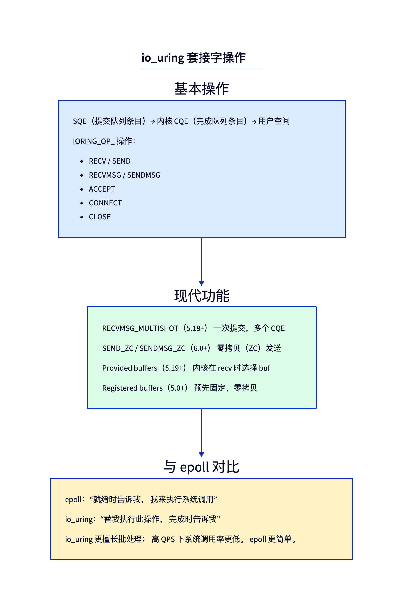
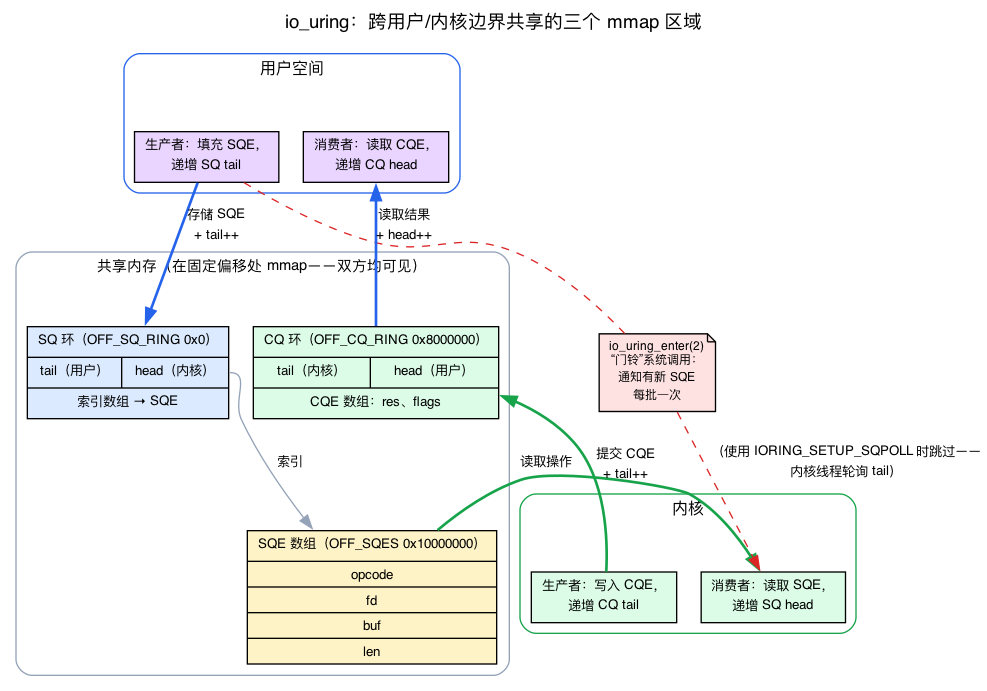
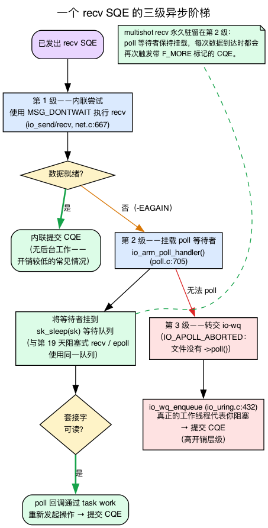
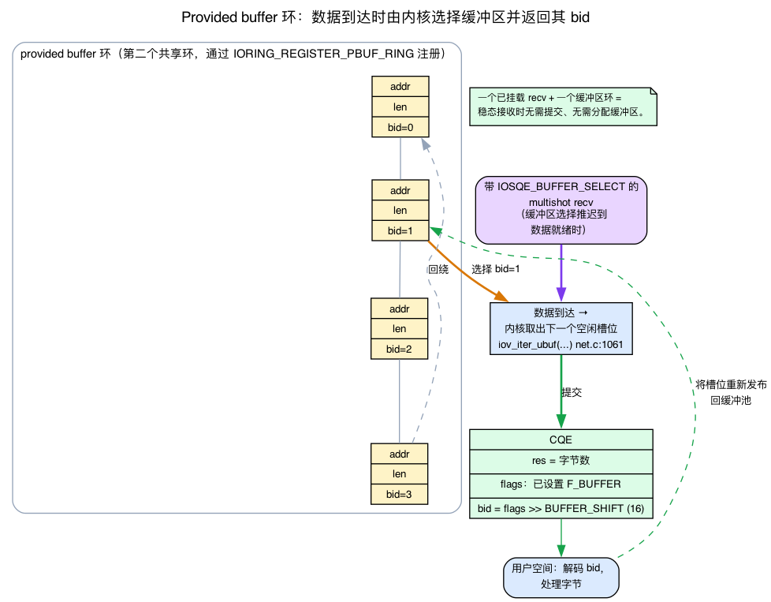
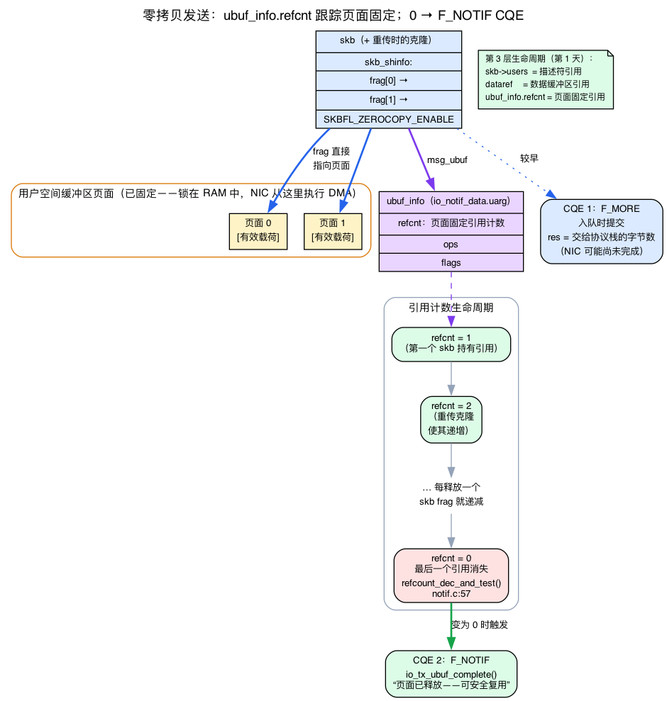

# 第28天 — io_uring 网络编程：零拷贝发送/接收

> **今日任务：** 看看 io_uring 如何从根本上反转套接字的系统调用模型——并理解让这种颠覆得以实现的*机制*：一个无锁的共享内存环、一个三级异步执行路径，以及一套采用引用计数的页面固定（page-pin）机制，它能精确地告诉你一块零拷贝缓冲区何时重新可用。然后看看为什么零拷贝发送对高吞吐服务器意义重大，以及多发（multishot）接收如何让你只提交一次就能接收多次。总时长：约 120 分钟。

## 两种 I/O 范式

第19天介绍了 epoll（就绪模型）和 io_uring（完成模型）。今天我们深入探讨 io_uring 特定于网络的能力。



回顾一下：

- **epoll**：“告诉我这个 FD 什么时候就绪；我自己来发系统调用。”每次 I/O = `epoll_wait`（1 次系统调用）+ `recv`/`send`（1 次系统调用）。每次 I/O 两次系统调用。
- **io_uring**：“替我做这件事；做完了告诉我。”每批 I/O = 1 次系统调用（`io_uring_enter`）覆盖许多操作。或者在稳定状态下配合 `IORING_SETUP_SQPOLL`（内核线程轮询）达到零系统调用。

对于每线程每秒执行 > 100k 次操作的工作负载，仅系统调用的节省就已相当可观。而对于零拷贝发送，收益会随负载大小而放大。

但整个卖点——“每批一次系统调用”“稳定状态下零系统调用”——都建立在宣传材料通常不会展示的一种机制之上：*用户空间和内核如何在不为每项工作发起系统调用的前提下共享同一个工作队列？* 这是我们必须首先讲清楚的东西，因为今天其余的一切都建立在它之上。

## 环到底是如何工作的：无锁共享内存队列

问题是这样的。系统调用是用户空间请求内核做事的常规方式——而系统调用恰恰正是我们试图避免的东西。那么用户空间怎么可能在完全不进入内核的情况下“提交”一个操作呢？答案是**共享内存**：用户空间和内核实际读写*同一批物理页*，因此交出一项工作只是一次内存存储，而不是一次用户态与内核态切换。

### 初始化：一个 fd，三个 mmap 区域

`io_uring_setup(2)` 是引导这一切的那一个系统调用。它返回一个文件描述符，然后用户空间在几个**固定的魔数偏移量**处对该 fd 执行 `mmap`，把共享区域映射进自己的地址空间（`include/uapi/linux/io_uring.h`）：

```c
#define IORING_OFF_SQ_RING   0ULL          /* :551 — the SQ ring header + index array */
#define IORING_OFF_CQ_RING   0x8000000ULL  /* :552 — the CQ ring + CQE array          */
#define IORING_OFF_SQES      0x10000000ULL /* :553 — the SQE array itself              */
```

三个区域，每个都是一个共享映射：

1. **SQ 环**——一个小的头部，加上一个指向 SQE 数组的索引数组。
2. **CQE 数组**——完成事件落地的地方（CQ 环）。
3. **SQE 数组**——实际的提交队列条目（Submission Queue Entry，即操作描述：opcode、fd、缓冲区、长度……）。

mmap 之后，这些页对*双方*都可见。当用户空间填好一个 SQE，内核无需拷贝就能看到这些字节。当内核写入一个 CQE，用户空间无需拷贝就能看到它。liburing 的 `io_uring_queue_init` 替你完成了 `io_uring_setup` + 三次 `mmap`，因此下面的基础 API 看起来十分简洁。

用户空间如何知道 head/tail 字段位于这些被映射页中的什么位置？`io_uring_setup` 会填好一个 `struct io_uring_params`（`:614`）并将其拷贝回用户空间。两个子结构体携带了环内每个字段的字节偏移量：

```c
struct io_sqring_offsets {   /* :561 — head, tail, ring_mask, ring_entries, ... */ };
struct io_cqring_offsets {   /* :580 — head, tail, ring_mask, ring_entries, ... */ };
/* and inside io_uring_params: */
struct io_sqring_offsets sq_off;   /* :623 */
struct io_cqring_offsets cq_off;   /* :624 */
```

因此用户空间先映射这些区域，然后使用 `sq_off.head`、`sq_off.tail` 等来在共享页*内部*找到这些索引。这一切的内核侧是 `io_uring_setup`（`io_uring/io_uring.c:3111`）及其系统调用入口 `SYSCALL_DEFINE2(io_uring_setup)`（`:3150`），它们分配这些环并填充那些偏移量。

### 环形缓冲区：head、tail，以及为什么不需要锁

每个环都是一个**单生产者/单消费者（SPSC）的环形缓冲区**，由两个持续递增的 32 位计数器管理：

- 一个 **tail**，由*生产者*在添加条目时推进；以及
- 一个 **head**，由*消费者*在移除条目时推进。

用 `counter & ring_mask` 对数组进行索引（掩码是 `ring_entries - 1`，因此大小始终是 2 的幂，回绕（wrap）只需一次廉价的按位与运算）。**head 与 tail 之间的间隙就是待处理的工作**。当 `head == tail` 时为空；当间隙等于环的大小时为满。

关键性质是：**每个计数器永远只有一方写入。** 对于 SQ，用户空间拥有 tail，内核拥有 head。对于 CQ，内核拥有 tail，用户空间拥有 head。因为没有任何计数器有两个写入方，所以你永远不需要锁——只需要一道内存屏障，以便*另一方*在看到你写入的条目之后才看到你的索引更新。那道屏障是唯一的微妙之处，而 liburing 把它藏在了 `io_uring_get_sqe` / `io_uring_cqe_seen` 里面。核心机制是共享的 SPSC 环；库只是在它之上提供了一层轻量且正确的封装。

把两个环放在一起，你就得到了完整的生产者/消费者图景：

| 环 | 生产者（写入条目，推进 **tail**） | 消费者（读取条目，推进 **head**） |
|------|-------------------------------------------|------------------------------------------|
| **SQ**（提交） | **用户空间**——填写 SQE，推进 SQ tail | **内核**——读取 SQE，推进 SQ head |
| **CQ**（完成） | **内核**——写入 CQE，推进 CQ tail | **用户空间**——读取 CQE，推进 CQ head |

最后那一格正是 `io_uring_cqe_seen()` 所做的事：它推进 CQ head，以告诉内核“我已经消费了这个完成事件；这个槽位又空闲了。”



### 系统调用如何被省掉

至此，从机制上就能理解这一结论。当你“提交”时，你已经把 SQE 写入共享内存并推进了 SQ tail——**没有发生任何系统调用。** 内核唯一还需要的，是一个*通知*，告知有新的 SQE，随后由它取出处理。那个通知就是那一次 `io_uring_enter` 系统调用（`SYSCALL_DEFINE6(io_uring_enter)`，`io_uring/io_uring.c:2600`），其提交路径调用 `io_submit_sqes(ctx, to_submit)`（`:2651`，定义在 `:2026`）来遍历 SQ 并运行每个操作。一次 `io_uring_enter` 就能一次性宣告*数百个* SQE——这就是“每批一次系统调用”。

而 `IORING_SETUP_SQPOLL`（`include/uapi/linux/io_uring.h:175`）连那一次都省去了。开启 SQPOLL 后，内核会派生一个轮询线程，它自己盯着 SQ tail；当它看到 tail 移动时，就在无人调用 `io_uring_enter` 的情况下把队列取空。*那* 就是“稳定状态下零系统调用”的字面来源——内核线程自行发现了新任务。

所以，当今天后面部分说某个操作被“提交”了，请记住这个过程：一次对共享页的存储，加一次 tail 推进。昂贵的部分——模式切换——每批最多发生一次，而在 SQPOLL 下则完全不发生。

## 基础 API

```c
#include <liburing.h>

struct io_uring ring;
io_uring_queue_init(256, &ring, 0);

/* Submit a recv */
struct io_uring_sqe *sqe = io_uring_get_sqe(&ring);
io_uring_prep_recv(sqe, sock_fd, buf, sizeof(buf), 0);
io_uring_sqe_set_data(sqe, /* user pointer */);
io_uring_submit(&ring);

/* Wait for completion */
struct io_uring_cqe *cqe;
io_uring_wait_cqe(&ring, &cqe);
/* cqe->res = number of bytes received (or -errno) */
io_uring_cqe_seen(&ring, cqe);
```

带着环的图景来读这段代码：

- **`io_uring_get_sqe`** 返回共享 SQE 数组中的下一个空闲槽位（它推进 liburing 为你追踪的一个内部“sqe tail”）。
- **`io_uring_prep_recv`** 填写该 SQE：opcode `IORING_OP_RECV`、fd、缓冲区、长度。
- **`io_uring_submit()`** 发布该 SQE（推进 SQ tail）并通知内核——一次 `io_uring_enter`，*而不是*每个操作一次系统调用。它**并不**把 SQE 拷贝进内核；SQE 早已在共享内存中了。
- **`io_uring_wait_cqe`** 等待内核把一个 CQE 推到 CQ 环上。
- **`io_uring_cqe_seen`** 推进 CQ head，以便内核可以复用该完成槽位。

记住：`io_uring_submit()` 发布 SQE 并通知内核（整批一次 `io_uring_enter`，在 SQPOLL 下则一次都没有）——它**不会**每个操作发起一次系统调用。

## “异步”究竟意味着什么：三级执行路径

下面操作表格的每一行都说“每个操作都是异步的：提交 → 内核在后台完成工作 → 完成后投递 CQE。”这没错，但“在后台”掩盖了一个值得理解的、分为三级的执行路径，因为它解释了*为什么 io_uring 在数据就绪时很廉价、只有在数据未就绪时才昂贵*——而且它复用了你在第19天已经见过的机制。

想想“替我做这个 recv”到底涉及什么。数据可能已经躺在套接字缓冲区里，也可能还没到达。一种朴素的设计会为每个操作起一个线程并让它阻塞——但线程很昂贵，而且大多数时候数据*就在那儿*。所以 io_uring 会先尝试成本最低的方式，只在被迫时才升级。

**第 1 级——内联、非阻塞尝试。** 当 io_uring 发起一个网络操作时，如果允许不阻塞，它会按位或上 `MSG_DONTWAIT`（每次调用的“不要阻塞”标志）。你可以在 `io_send`（`io_uring/net.c:667`）和 sendmsg 路径（`:568`）中看到它：

```c
if (issue_flags & IO_URING_F_NONBLOCK)
    flags |= MSG_DONTWAIT;
```

如果数据已经可用，操作会*立即、内联地*完成，CQE 就地投递——**完全没有后台工作。** 这是繁忙服务器的常见情形，几乎没有任何代价。

**第 2 级——注册一个轮询等待者。** 如果非阻塞尝试返回 `-EAGAIN`（套接字未就绪），io_uring **不会**立刻占用一个线程。发送路径会这样退出：

```c
if (ret == -EAGAIN && (issue_flags & IO_URING_F_NONBLOCK))
    return -EAGAIN;   /* io_uring/net.c:578 */
```

随后核心调用 `io_arm_poll_handler(req, issue_flags)`（`io_uring/poll.c:705`）。这会在套接字上注册一个内部轮询等待者，位置正是**完全相同的 `sk_sleep(sk)` 等待队列**上，第19天展示的阻塞 `recv()` 和 epoll 也把等待者挂在这里。当套接字变为可读时，轮询回调通过 task work 重新发起该操作并投递 CQE。这个决策位于发起路径中：

```c
if (io_arm_poll_handler(req, issue_flags) == IO_APOLL_OK)   /* io_uring/io_uring.c:1563 */
```

这就是为什么 io_uring 不必发明一条新的唤醒路径：它倚靠内核既有的 `->poll()` + 等待队列基础设施。这个“本会阻塞”的 recv 只是变成了套接字上的一个等待者，代价是一次小小的注册，无需占用线程。

**第 3 级——交给 io-wq 工作线程。** 只有当无法挂轮询时（文件类型不支持 `->poll()`，报告为 `IO_APOLL_ABORTED`），io_uring 才会回退到重量级路径：把请求交给一个*被允许*阻塞的内核工作线程池。回退逻辑在 `io_queue_async`（`io_uring/io_uring.c:1621`）中：

```c
switch (io_arm_poll_handler(req, 0)) {   /* :1634 */
...
case IO_APOLL_ABORTED:                    /* :1638 */
    ...                                   /* punt: */
}
io_wq_enqueue(tctx->io_wq, &req->work);   /* :432 */
```

`io_wq`（`io_uring/io-wq.c:116`）是一个有界/无界工作线程池，它在一个可以放心阻塞的上下文中运行操作。这是最昂贵的一级——由一个真实线程代为阻塞——这也是为什么 io_uring 能逐级回退，避免性能突然断崖式下降：只有当操作确实无法以任何更廉价的方式完成时，你才为一个线程付费。



在阅读下文时，请为两件事记住这套执行路径：**多发接收**只是第 2 级被*永久化*了（轮询等待者保持挂着并反复触发），而末尾的检查题会请你把这条路径与朴素的阻塞 `recv()` 做比较。

## 特定于网络的操作

在 `io_uring/net.c` 中，实际的 `io_send`、`io_recv` 等函数就住在这里。

### 基础操作

| 操作 | 用户空间 prep | 等价的系统调用 |
|----|----------------|---------------------|
| `IORING_OP_RECV` | `io_uring_prep_recv` | `recv()` |
| `IORING_OP_SEND` | `io_uring_prep_send` | `send()` |
| `IORING_OP_RECVMSG` | `io_uring_prep_recvmsg` | `recvmsg()`（msghdr——支持 cmsg、分散-聚集） |
| `IORING_OP_SENDMSG` | `io_uring_prep_sendmsg` | `sendmsg()` |
| `IORING_OP_ACCEPT` | `io_uring_prep_accept` | `accept4()` |
| `IORING_OP_CONNECT` | `io_uring_prep_connect` | `connect()` |
| `IORING_OP_CLOSE` | `io_uring_prep_close` | `close()` |
| `IORING_OP_SHUTDOWN` | `io_uring_prep_shutdown` | `shutdown()` |

每个都是异步的：提交 → 内核在后台完成工作（通过上面的三级阶梯）→ 完成后投递 CQE。

### 多发接收（Multishot recv，6.0+）

使用 `IORING_RECV_MULTISHOT` 标志调用 `io_uring_prep_recv`：一次提交，*多个* CQE。内核让这个 recv 保持“就绪”——每当数据到达，就投递一个 CQE。该 recv 一直保持未完成状态，直到套接字关闭或你取消它。

```c
io_uring_prep_recv(sqe, sock, buf, sizeof(buf), 0);
sqe->ioprio |= IORING_RECV_MULTISHOT;
io_uring_submit(&ring);

/* Now process CQEs as they come — no more submit per recv */
for (;;) {
    struct io_uring_cqe *cqe;
    io_uring_wait_cqe(&ring, &cqe);
    /* cqe->res = bytes received this time */
    io_uring_cqe_seen(&ring, cqe);
}
```

从机制上看，多发就是**第 2 级异步阶梯被永久化了。** 普通 recv 在一次完成后就撤销它的轮询等待者；而多发 recv 则让请求继续注册在套接字的 `sk_sleep(sk)` 等待队列上，并在*每次*数据到达时重新触发一个 CQE——标记为 `IORING_CQE_F_MORE`——直到你取消它或套接字关闭。（`IORING_CQE_F_MORE` 是内核在说“这个 SQE 还会产生更多完成事件；先别退休它。”）

对于高速率的接收方，这完全消除了每次 recv 的提交开销：一个挂好的 recv，一串 CQE。

### 提供缓冲区（Provided buffers，5.19+）

到目前为止描述的多发接收里有一处微妙的浪费：每个 recv 仍然需要一块*缓冲区*来落地数据。如果你为每次 recv 递给内核一块固定缓冲区，那你又回到了每次 recv 的簿记工作。**提供缓冲区环（provided buffer ring）**通过预先把一整*池*缓冲区交给内核、并让内核只在数据真正到达时才挑一块，解决了这个问题。

#### 注册的是什么

一个提供缓冲区环是一个**第二个共享内存环**，与 SQ/CQ 完全分离。用户空间用描述符填充它，每个描述符指明一块缓冲区的地址、长度，以及一个**缓冲区 id（`bid`）**（`include/uapi/linux/io_uring.h:857`）：

```c
struct io_uring_buf {
    __u64 addr;   /* where the buffer is */
    __u32 len;    /* how big                 */
    __u16 bid;    /* :860 — the buffer id you'll get back */
    __u16 resv;
};

struct io_uring_buf_ring { /* :864 — the ring of the above */ };
```

你用 `IORING_REGISTER_PBUF_RING` opcode（`:685`，值为 22）注册这个环——这正是 liburing 的 `io_uring_register_buf_ring` 所包装的：

```c
io_uring_register_buf_ring(&ring, &reg, 0);   /* IORING_REGISTER_PBUF_RING */
```

你交给内核的是一个*池*，而不是一个每操作的指针。

#### 内核如何告诉你它用了哪块缓冲区

当你提交一个带 `IOSQE_BUFFER_SELECT` 标志（`:167`，对应位在 `:149`）的 recv 时，内核会**把缓冲区的选择推迟到数据就绪之时**，然后从池环中消费一个描述符。recv 路径把这块选中的缓冲区导入到消息迭代器中——`iov_iter_ubuf(&kmsg->msg.msg_iter, ITER_DEST, sel.addr, len)`（`io_uring/net.c:1061`），更长的映射路径在 `:1158`/`:1170`。选中的 `bid` 被存进请求的 `buf_index` 槽位（`include/linux/io_uring_types.h:726`，其注释直白地写着“它指向选中的缓冲区 ID”）。

但让这套 API *可用*的关键，是你如何得知用了哪块缓冲区。完成事件把 `bid` 编码在 `cqe->flags` 的**高位**中，按 `IORING_CQE_BUFFER_SHIFT`（`:546`，值为 16）移位，并设置 `IORING_CQE_F_BUFFER` 标志以便你知道它在那里。用户空间对其解码：

```c
if (cqe->flags & IORING_CQE_F_BUFFER) {
    unsigned bid = cqe->flags >> IORING_CQE_BUFFER_SHIFT;
    /* the bytes landed in the buffer you registered with this bid */
    /* ...process them, then re-publish that descriptor to the ring */
}
```

处理这些字节，然后重新发布该描述符，好让内核可以复用它。如果不解码 `bid`，你就会有数据却不知道它*落在哪里*——这正是本节的全部要点。



它与多发接收天然适配：**一个挂好的 recv + 一个缓冲区环**意味着每个到达的数据报都落在下一块空闲的池缓冲区里，而 CQE 携带它的 `bid`——一个完全免提交、免缓冲区分配的稳定状态接收。

### 零拷贝发送（Zero-copy send，6.0+）

`IORING_OP_SEND_ZC` / `IORING_OP_SENDMSG_ZC`。这是今天的核心操作，所以它值得完整的机制讲解，而不是一带而过。

#### 为什么会存在缓冲区生命周期问题

普通的 `send()` 会把你的字节从用户空间**拷贝**到内核的 skb 内存里。正是那次拷贝，才使得 `send()` 可以立即返回、随后便可以立即覆写缓冲区——因为内核已经有了自己的一份拷贝。零拷贝发送**跳过了那次拷贝**：外发 skb 的页分片（page fragment）*直接指向你的用户空间页*（回想一下第1天讲的线性头部 + 页片段的拆分）。内核把这些页钉住（pin）——将它们锁定在内存中，使其不能被换出或移动——然后 NIC 直接从中进行 DMA。

这更快，但它带来了一个新义务：**在 NIC 完成对这些页的 DMA 之前，你的页必须保持有效且不被修改。** 如果你过早复用缓冲区，就会发出损坏的数据。所以零拷贝发送需要一种方式来告诉你“硬件已经处理完毕；你的页又空闲了”——而这正是需要延迟投递第二个 CQE 的原因。

#### 内核如何知道页已空闲：`ubuf_info` 及其引用计数

skb 携带一个共享信息标志 `SKBFL_ZEROCOPY_ENABLE`（`include/linux/skbuff.h:505`），以及一个指向一个轻量的引用计数内核对象 `struct ubuf_info`（`:546`）的指针：

```c
struct ubuf_info {
    const struct ubuf_info_ops *ops;
    refcount_t refcnt;   /* the page-pin reference count */
    u8 flags;
};
struct ubuf_info_msgzc { struct ubuf_info ubuf; ... };   /* :552 */
```

每个引用了这些被钉住的页的 skb 都持有对这个 `ubuf_info` 的**一个引用**。这一点很重要，因为 TCP 协议栈会不断地*克隆* skb——一次重传会保留一份拷贝，分段（segmentation）会把一个 skb 拆成多个——而每个仍指向你的页的克隆都会给引用计数加一。（其中一些路径使用 `SKBFL_MANAGED_FRAG_REFS`，`:524`，由 `skb_zcopy_managed()` 在 `:1804` 检测。）

io_uring 通过以下方式把它们连接起来：分配一个**通知请求**，其内嵌的 `ubuf_info` *就是* skb 的 `uarg`。io_uring 一侧是 `struct io_notif_data { struct file *file; struct ubuf_info uarg; ... }`（`io_uring/notif.h:13`），通过 `io_notif_to_data`（`:30`）访问。在 prep 时它分配这个 notif——`notif = zc->notif = io_alloc_notif(ctx)` 位于 `io_send_zc_prep`（`io_uring/net.c:1353`，prep 在 `:1336`）内部——然后发送路径把那个 `uarg` 交给 skb：

```c
kmsg->msg.msg_ubuf = &io_notif_to_data(sr->notif)->uarg;   /* io_uring/net.c:1518 */
```

下面沿着引用计数继续分析。当协议栈处理完每个 skb 片段时，它会对 `ubuf_info` 减一个引用。当**最后一个**引用消失时，完成回调触发（`io_uring/notif.c:43`）：

```c
void io_tx_ubuf_complete(struct sk_buff *skb, struct ubuf_info *uarg, ...)
{
    ...
    if (!refcount_dec_and_test(&uarg->refcnt))   /* :57 */
        return;
    /* refcount hit zero → post the F_NOTIF CQE */
}
```

因此，`IORING_CQE_F_NOTIF` CQE **既不是定时器也不是猜测。** 它精确地意味着“引用你的页的最后一个 skb 已被释放。”这套 `ubuf_info` 机制也正是 TCP 协议栈已经用于普通 `SO_ZEROCOPY` 套接字的机制（即 `SO_ZEROCOPY`/`MSG_ZEROCOPY` 路径）——io_uring 只是把完成事件路由到一个 CQE，而不是套接字的错误队列。而且它是叠加在第1天所教内容之上的*第三个*生命周期层：`skb->users` 计数描述符引用，`dataref` 计数数据缓冲区引用，而现在 `ubuf_info.refcnt` 计数页面固定引用。



#### 两个 CQE

**每次发送两个 CQE：**

1. **发送结果**（`IORING_CQE_F_MORE`）：携带实际的发送结果——已发送字节数（`cqe->res`）。数据已经交给了协议栈，但 NIC 可能还没有 DMA 完它。这是该请求*自身*的最终完成：`io_sendmsg_zc` 以 `io_req_set_res(req, ret, IORING_CQE_F_MORE); return IOU_COMPLETE;`（`io_uring/net.c:1556`）结束，所以核心投递它时 `res` = 已发送字节数并设置 `F_MORE` 标志（定义在 `include/uapi/linux/io_uring.h:539`）。它不是一个 `io_req_post_cqe()` 辅助（aux）CQE。
2. **完成通知**（`IORING_CQE_F_NOTIF`，`:541`）：用户空间页不再被使用；缓冲区可以安全地释放或复用了。这就是上文所述引用计数归零的时刻。

```c
sqe = io_uring_get_sqe(&ring);
io_uring_prep_send_zc(sqe, sock, buf, len, 0, 0);
io_uring_submit(&ring);

/* CQE 1: send started */
io_uring_wait_cqe(&ring, &cqe);

/* CQE 2: buffer no longer in use (e.g., NIC DMA done) */
io_uring_wait_cqe(&ring, &cqe);
```

为什么把它们拆开？因为这两个事实是在非常不同的时刻变为真的。**字节数 / errno** 在数据被排入协议栈那一刻就已知晓——你希望尽快拿到它。而**复用安全性**必须等到 DMA 完成，这可能晚得多。把 CQE 解耦，让你可以立即得知结果，同时又被*精确地*告知页何时空闲。在 CQE 1 和 CQE 2 之间复用缓冲区会破坏正在飞行中的传输。

> **常见疑问**
>
> **问：为什么不干脆在 DMA 完成后只投递一个 CQE？**
>
> **答：** 因为你关心的这两个事实是在非常不同的时刻变为已知的。字节数（或 errno）在数据被排入协议栈那一瞬间就已确定——你想立即据此行动。但 DMA 完成的那一刻，也就是你的页终于空闲的时刻，可能要晚得多。把它们折叠成一个 CQE 会迫使你为了得知较早确定的结果而去等待较晚确定的结果。拆开它们，让你可以立即处理结果，同时又被*精确地*告知缓冲区何时能安全复用。

对于大传输（> ~4 KB），零拷贝发送逼近 NIC 和 PCIe 总线所允许的极限。用户空间进程（数据库、提供大文件的 HTTP 服务器）会看到显著的吞吐提升。

### 零拷贝接收（实验性，6.x）

第29天会提到 **net_iov** 和**页池内存提供者（page pool memory provider）**——把零拷贝语义扩展到 RX 的基础设施。它不如 ZC 发送成熟；请查阅内核说明。

## 何时选用哪个

对大多数服务器而言，**epoll 就够了**。经过实战检验、API 简单、在典型 Web 工作负载下能一路跑到每秒数百万查询（QPS）。

**io_uring 最具优势**的场景：

1. 每线程持续 > 100k ops/sec，*而且*你能够承受额外的开发复杂度。
2. 你本来就在跨多种 I/O 类型做批量 I/O（文件 I/O 与网络并行）。
3. 你想为大传输使用零拷贝发送（CDN 边缘、大文件服务）。
4. 你想用 `IORING_SETUP_SQPOLL` 完全跳过系统调用路径（在重负载下减少上下文切换）。

**io_uring 的复杂度成本**：
- 更大的 API 表面（约 50 个操作，大量标志）。
- 微妙的顺序规则（何时 SQE 顺序重要；何时保证 CQE 投递）。
- 更多失败模式（环大小设置不当 → 操作丢失；ZC 缓冲区误用 → 崩溃）。

实际采用正在推进，但比工程收益所暗示的要慢。知名用户：**ScyllaDB**、**QEMU** 中用于存储 I/O 的部分、实验性的 **nginx** 分支、以及一些用于高流量 pod 摄取的 **Kubernetes** 运行时。

## 实验

```bash
# Verify io_uring support (grep the file directly — /proc/kallsyms is a
# regular file, so `ls | grep` would only ever match the path string).
# The syscall wrappers show up as __x64_sys_io_uring_enter / __do_sys_io_uring_enter.
grep -q io_uring_enter /proc/kallsyms && echo "io_uring: supported" || cat /proc/version

# Install liburing if not present
sudo apt install liburing-dev liburing2

# Look at the examples (the -dev package installs them under liburing-dev/)
ls /usr/share/doc/liburing-dev/examples/

# A trivial async-accept loop
cat << 'EOF' > /tmp/iour_accept.c
#include <stdio.h>
#include <string.h>
#include <unistd.h>
#include <netinet/in.h>
#include <sys/socket.h>
#include <liburing.h>

int main() {
    int s = socket(AF_INET, SOCK_STREAM, 0);
    int one = 1;
    setsockopt(s, SOL_SOCKET, SO_REUSEADDR, &one, sizeof one);
    struct sockaddr_in a = { AF_INET, htons(7777) };
    bind(s, (struct sockaddr*)&a, sizeof a);
    listen(s, 64);

    struct io_uring ring;
    io_uring_queue_init(8, &ring, 0);

    struct io_uring_sqe *sqe = io_uring_get_sqe(&ring);
    io_uring_prep_accept(sqe, s, NULL, NULL, 0);
    io_uring_submit(&ring);

    struct io_uring_cqe *cqe;
    io_uring_wait_cqe(&ring, &cqe);   /* CQE for the accept */
    int conn = cqe->res;
    io_uring_cqe_seen(&ring, cqe);

    if (conn >= 0) {
        /* Reply through io_uring with a ZERO-COPY send so this experiment
         * actually exercises the day's headline op (IORING_OP_SEND_ZC).
         * io_uring_prep_send_zc(sqe, sockfd, buf, len, msg_flags, zc_flags). */
        const char msg[] = "hi via io_uring\n";
        sqe = io_uring_get_sqe(&ring);
        io_uring_prep_send_zc(sqe, conn, msg, sizeof msg - 1, 0, 0);
        io_uring_submit(&ring);

        /* CQE 1: send result, carries IORING_CQE_F_MORE (more to come) */
        io_uring_wait_cqe(&ring, &cqe);
        printf("send  res=%d more=%d\n", cqe->res,
               !!(cqe->flags & IORING_CQE_F_MORE));
        io_uring_cqe_seen(&ring, cqe);

        /* CQE 2: notification, carries IORING_CQE_F_NOTIF — buffer is now
         * free to reuse (the NIC is done with the pinned pages). */
        io_uring_wait_cqe(&ring, &cqe);
        printf("notif flag=%d\n", !!(cqe->flags & IORING_CQE_F_NOTIF));
        io_uring_cqe_seen(&ring, cqe);

        close(conn);
    }

    io_uring_queue_exit(&ring);
    close(s);
    return 0;
}
EOF
cc /tmp/iour_accept.c -o /tmp/iour_accept -luring && /tmp/iour_accept &

# Connect:
nc localhost 7777
```

服务器恰好处理一次 accept（一次 `io_uring_prep_accept` + 一个 CQE），然后退出。你应当看到那一行问候语，之后 `nc` 会退出，因为服务器关闭了连接：

```
hi via io_uring
```

如果什么都没打印出来，那说明这个 accept 操作从未完成。服务器自身的标准输出会显示正文介绍的双 CQE 零拷贝模式——先是发送结果（带 `F_MORE`），然后是缓冲区空闲通知（带 `F_NOTIF`，也就是 `ubuf_info.refcnt` 归零的那一刻）：

```
send  res=16 more=1
notif flag=1
```

**清理：** 服务器在处理一个连接后会自行退出。如果你先启动 bpftrace 监视、而跳过（或没能完成）`nc` 那一步，被放到后台的服务器会一直阻塞在 `io_uring_wait_cqe` 里、占着 7777 端口——用 `pkill -f iour_accept` 停掉它。

观察内核一侧。跟踪这个程序实际提交的操作——异步 accept 和零拷贝发送——并用一个 `exit()` 给它设界限，让它不会永远运行下去（原来的探针跟踪的是 `io_send`/`io_recvmsg`，而这个工作负载从不发起这些操作，所以它们会永远保持空白）：

```bash
sudo bpftrace -e 'fentry:io_accept  { @accept = count(); }
fentry:io_sendmsg_zc { @zc = count(); }
interval:s:5 { print(@accept); print(@zc); exit(); }'
```

在运行 `/tmp/iour_accept` 并用 `nc localhost 7777` 连接一次之后，预期各得到一个（再连接可得到更高计数）：

```
@accept: 1
@zc: 1
```

探针名称必须与提交的操作相匹配：一个普通的 `recv` 走 `io_recv`，`recvmsg` 走 `io_recvmsg`，`send` 走 `io_send`，而 ZC 发送走 `io_sendmsg_zc`（`IORING_OP_SEND_ZC` 和 `SENDMSG_ZC` 都通过同一个函数发起）。

## 在内核中阅读什么

- **`io_uring/net.c`**——网络操作。约 1900 行。关键入口：
  - `io_send_setup`（第 350 行）、`io_send` 及其相关函数——发送路径。
  - `io_sendmsg_setup`（第 396 行）、`io_recvmsg`。
  - `io_send_zc_prep` / `io_sendmsg_zc`——零拷贝路径（`IORING_OP_SEND_ZC` 和 `SENDMSG_ZC` 都通过 `io_sendmsg_zc` 发起）。
  - `io_kiocb` 结构体持有每操作的状态——包括 `buf_index` 槽位，它携带选中的提供缓冲区 `bid`。

- **`io_uring/io_uring.c`**——主入口点：`io_uring_setup`（第 3111 行）、`io_uring_register`、`io_uring_enter`（第 2600 行）。读 `io_submit_sqes`（第 2026 行）了解提交遍历，读 `io_iopoll_check` 了解轮询 IO 的完成路径（通用的完成等待是 `io_cqring_wait`，现在位于 `io_uring/wait.c`）。异步阶梯也住在这里：`io_arm_poll_handler` 决策（第 1563 行）、`io_queue_async`（第 1621 行），以及 交给 io-wq `io_wq_enqueue`（第 432 行）。

- **`io_uring/poll.c`**——多发基础设施。`io_arm_poll_handler`（第 705 行）在套接字的等待队列上注册内部轮询等待者；多发 recv 让请求保持在“就绪”状态并反复触发 CQE。

- **`io_uring/notif.c`** / **`io_uring/notif.h`**——零拷贝通知对象。`struct io_notif_data`（notif.h 第 13 行）内嵌 `ubuf_info uarg`；`io_tx_ubuf_complete`（notif.c 第 43 行）是页面固定引用计数归零、`F_NOTIF` CQE 诞生的地方。

- **`include/uapi/linux/io_uring.h`**——UAPI。操作 ID（`IORING_OP_*`）、标志（`IOSQE_*`）、mmap 偏移量（第 551 行）、`io_uring_params` + 环偏移量（第 614 行）、提供缓冲区结构体（`io_uring_buf` 第 857 行），以及 CQE 标志（`F_MORE` 第 539 行、`F_NOTIF` 第 541 行、`IORING_CQE_BUFFER_SHIFT` 第 546 行）。

- **`include/linux/skbuff.h`**——`struct ubuf_info`（第 546 行）以及那些把 io_uring notif 连到 skb 页面固定生命周期的 `SKBFL_*` 零拷贝标志（第 505 行）。

- **liburing 仓库** (https://github.com/axboe/liburing)——用户空间 API。`examples/` 目录里有针对每种常见模式的带注释代码。

- **io_uring man 手册页**（`io_uring_setup(2)`、`io_uring_enter(2)`，以及 liburing 的 `man/` 手册页）—— 主要的参考文档；内核树里没有网络方面的 io_uring.rst。

- **外部资料**：Jens Axboe 的“io_uring: efficient io”论文/演讲；libuv 问题追踪器里关于行为对比的细致讨论。

## 要点回顾

- **环是共享内存，而不是一个系统调用队列。** `io_uring_setup` 返回一个 fd；用户空间在固定偏移量处 `mmap` 三个区域（SQ 环、SQE 数组、CQ 环）。提交 = 把一个 SQE 写进共享页 + 推进一个 tail 索引。没有拷贝，没有每操作的系统调用。
- **每个环都是一个无锁的 SPSC 环形缓冲区。** 生产者推进 tail，消费者推进 head；每个索引只有一个写入者 ⇒ 无需锁。SQ：用户空间生产，内核消费。CQ：内核生产，用户空间消费（`io_uring_cqe_seen` 推进 CQ head）。
- **每批一次系统调用**（`io_uring_enter`）只是一个宣告有新 SQE 的*门铃*。配合 `IORING_SETUP_SQPOLL` 可在**稳定状态下零系统调用**（一个内核线程自己盯着 SQ tail）。
- **异步 = 一个三级阶梯：**（1）内联 `MSG_DONTWAIT` 尝试——数据就绪 ⇒ 立即 CQE；（2）`-EAGAIN` ⇒ `io_arm_poll_handler` 把一个等待者挂到第19天所用的同一个 `sk_sleep(sk)` 队列上；（3）无法轮询 ⇒ 交给一个允许阻塞的 io-wq 工作线程。
- **多发接收**（6.0+）：第 2 级被永久化——一次提交，随数据到达产生多个 CQE（每个标记 `F_MORE`）。
- **提供缓冲区**（5.19+）：注册一个 `{addr,len,bid}` 的池环；配合 `IOSQE_BUFFER_SELECT`，内核在数据到达时挑一块缓冲区，并把 `bid` 打包进 `cqe->flags >> IORING_CQE_BUFFER_SHIFT` 返回。与多发搭配可实现完全免提交的接收。
- **零拷贝发送**（6.0+）：`IORING_OP_SEND_ZC`。钉住你的页，让 NIC 直接对它们做 DMA。两个 CQE：`F_MORE`（发送结果，在入队时投递）和 `F_NOTIF`（页空闲——在 skb 的 `ubuf_info.refcnt` 于 `io_tx_ubuf_complete` 中归零那一刻精确触发）。
- 对大多数服务器而言，**epoll 就够用**。io_uring 是给持续 > 100k ops/sec 或批量工作负载用的。
- 复杂度成本是真实存在的；采用速度虽慢但在增长。

## 检查问题

如果你提交一个 `IORING_OP_RECV` 并立即 `io_uring_wait_cqe`，与一个阻塞的 `recv()` 相比有什么区别？

<details>
<summary>点击查看答案</summary>

**答案：** 功能上相似——两者都会阻塞直到数据到达。机制则不同。

对于阻塞的 `recv()`：系统调用进入内核并阻塞在套接字的 `sk_sleep(sk)` 等待队列上；当数据到达时，`sk->sk_data_ready()`（`sock_def_readable`）被调用并唤醒该队列，然后 `recv` 返回，数据被拷贝到用户空间。

对于 `IORING_OP_RECV` + 立即等待：这个操作走三级阶梯。内核首先带着 `MSG_DONTWAIT` 内联尝试这个 recv；如果数据已经在那儿，CQE 立即投递。如果没有（`-EAGAIN`），`io_arm_poll_handler` 会在阻塞 `recv()` 本会使用的*同一个*套接字等待队列上注册一个轮询等待者，而你在 `io_uring_wait_cqe` 处等待。当数据到达时，轮询回调重新发起这个 recv 并投递一个 CQE，把你唤醒。

对于单个 recv 而言，这比阻塞 recv *开销更大*——你付了 io_uring 框架的成本（环、挂接轮询等待者），却没得到批量化的好处。真正的赢面是当你有**数百个操作同时在飞行中**时：一次 `io_uring_enter` 系统调用把它们全部提交，一次去等待其中任意一个完成。epoll 则每个 `recv()` 需要一次系统调用、外加每次 `epoll_wait()` 一次。规模上去后，io_uring 摊销后的系统调用成本要低得多。

对于每秒仅执行 1 次操作的服务器，阻塞 recv 胜过 io_uring。对于每秒执行 100k 次操作的服务器，io_uring 胜出。临界点取决于工作负载。

</details>

---

## 明天

第29天：近期新增内容——PSP 加密、drop_monitor 改进、devlink、NETLINK YAML。
