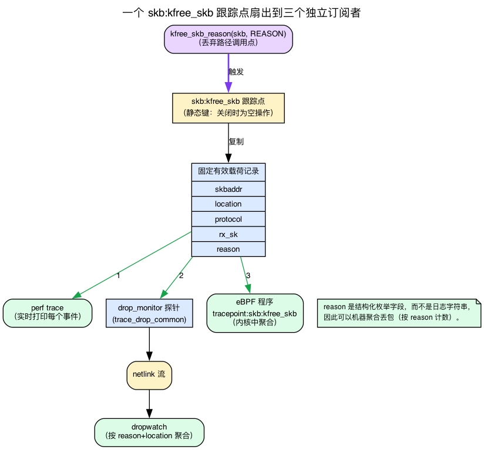
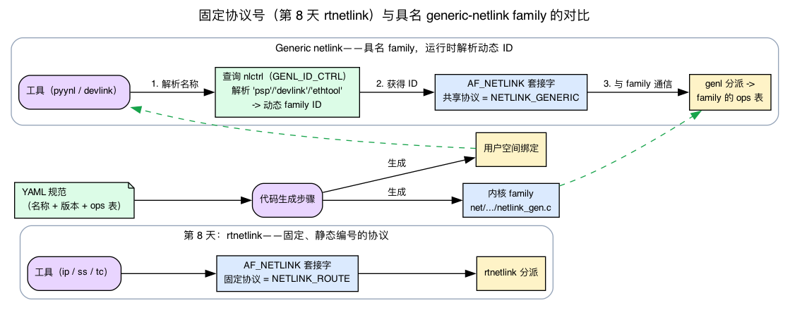
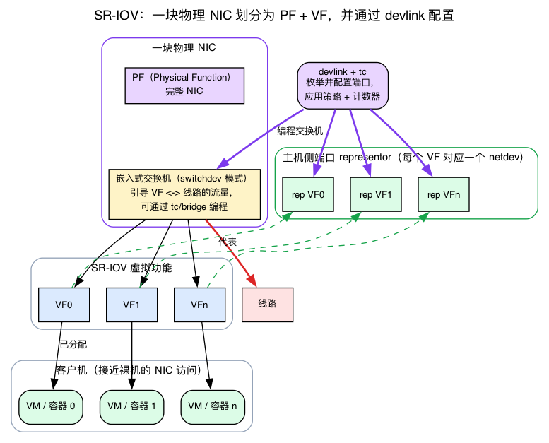

# 第29天 — 近期新增内容：PSP、drop_monitor、devlink、NETLINK YAML

> **今日任务：** 了解截至内核 7.1 网络协议栈中的新内容——PSP 加密、分类丢包归因、通用设备控制，以及 YAML 驱动的 netlink 工具链——弄清每个子系统各自的*用途*，以及它们在你已经学过的一切当中处于什么位置。在这个过程中，我们还会讲清整章都依赖、但前面各天都没有涉及的两个底层机制：**跟踪点**（让 `kfree_skb` 变得可观测的静态插桩钩子）与 **通用 netlink**（PSP、devlink 和 ethtool 都共同使用的 族这一层）。总时长：约 110 分钟。

这是一个概览日。这一天不会围绕某个结构体逐字段剖析，而是概览四个近期出现的子系统，并为每个子系统补充恰到好处的底层机制，确保它们不再是黑盒。其中两个机制——跟踪点与通用 netlink——支撑着整章内容，所以我们会认真讲解它们，先讲直觉，再讲依赖它们的那个子系统。

---

## 背景 1：跟踪点究竟是什么

今天的整个可观测性故事——`perf trace`、`dropwatch`、用 eBPF 监视丢包——都建立在一个本书用过但从未解释过的机制之上：**跟踪点**。在我们说“drop_monitor 监听 `skb:kfree_skb` 跟踪点”之前，你需要知道这个钩子的具体机制。

### 问题：给内核插桩，但没人看时不用付出代价

你想要能够提问“每当内核释放一个数据包时，告诉我在哪里、为什么”。最朴素的做法——在释放点放一个 `printk`——是一场灾难：不管有没有人在监听，它都会对每一个被释放的 skb 触发，产生海量输出并拖垮系统。你想要的是这样一个钩子：**当没有人挂接时它完全免费**，只有在某个消费者把它打开时才做工作。

那就是**跟踪点**：一个具名的、静态放置的钩子，编译进内核的固定源码位置，关闭时几乎没有成本（调用点通过一个*静态键*（static key，一个在运行时打补丁的分支）被改成空操作），打开时把负载分发给每一个已注册的监听者。

### `TRACE_EVENT`：声明钩子及其负载

跟踪点用 **`TRACE_EVENT`** 宏声明，它定义了两样东西：钩子的**参数列表**（`TP_PROTO`）以及拷贝给每个监听者的**固定负载记录**（`TP_STRUCT__entry`）。下面是本章所关注跟踪点的真实声明（`include/trace/events/skb.h:24`）：

```c
TRACE_EVENT(kfree_skb,

    TP_PROTO(struct sk_buff *skb, void *location,
             enum skb_drop_reason reason, struct sock *rx_sk),   /* skb.h:26 */

    TP_STRUCT__entry(
        __field(void *,            skbaddr)     /* skb.h:32 */
        __field(void *,            location)
        __field(void *,            rx_sk)
        __field(unsigned short,    protocol)
        __field(enum skb_drop_reason, reason)
    ),

    TP_printk("skbaddr=%p rx_sk=%p protocol=%u location=%pS reason: %s",
              __entry->skbaddr, __entry->rx_sk, __entry->protocol,
              __entry->location,
              __print_symbolic(__entry->reason,
                               DEFINE_DROP_REASON(FN, FNe)))     /* skb.h:47 */
);
```

请仔细看这份负载，因为它正是本章存在的全部理由：

- **`skbaddr`**——被释放的是哪个 skb。
- **`location`**——释放它的内核调用点，以符号形式打印（`%pS` 把原始地址变成 `tcp_v4_rcv+0x2a`）。
- **`protocol`**——EtherType（回想第2天分用中的 `skb->protocol`）。
- **`rx_sk`**——接收方套接字（如果有的话）。
- **`reason`**——丢弃原因枚举，由 `__print_symbolic` 基于 `DEFINE_DROP_REASON` 渲染成人类可读的字符串。

**`reason` 是负载中的一个结构化字段，而不是一段自由文本日志字符串。** 这一事实正是本章的主旨：因为原因是一个随记录一起传递的枚举，“这个数据包为什么被丢弃？”就变得*可被机器聚合*——你可以按原因统计丢包数量，就像你在今天的实验里将要做的那样。

### 谁触发它：`kfree_skb_reason`

你在第1天见过它。每当内核在丢弃路径上释放一个数据包时，它都会调用 **`kfree_skb_reason(skb, reason)`**（`include/linux/skbuff.h:1322`），这个调用会触发 `kfree_skb` 跟踪点。而常见的 `kfree_skb(skb)`，现在实际上只是带原因版本的调用，只不过原因留空（`skbuff.h:1333`）：

```c
static inline void kfree_skb(struct sk_buff *skb)
{
    kfree_skb_reason(skb, SKB_DROP_REASON_NOT_SPECIFIED);   /* skbuff.h:1333 */
}
```

所以一个仍然使用裸 `kfree_skb` 的调用点*确实*会触发跟踪点——但它的 `reason` 字段是无法提供诊断价值的 `NOT_SPECIFIED`。把它转换成 `kfree_skb_reason(skb, SKB_DROP_REASON_X)` 只需要多一个参数，就能把一个“这里丢弃了某个数据包”的事件变成一个已分类的事件（背景 1 中的结构化枚举属性）。（记住这一点——它正是今天的检查问题。）

### 多个消费者，一个钩子

本章反复提到的收益 ——“perf、dropwatch 和 BPF 都看到同一批丢包”—— 直接源自跟踪点如何分发。**多个消费者各自独立地挂接到同一个钩子上**，内核把负载分发给所有消费者：

- **`perf trace`** 订阅并实时打印每个事件。
- **内核内的 `drop_monitor`** 用 `register_trace_kfree_skb(ops->kfree_skb_probe, NULL)`（`net/core/drop_monitor.c:1164`）注册一个探针；注册的探针是 `trace_kfree_skb_hit`（`drop_monitor.c:485`），它分发到共享的聚合器 `trace_drop_common`（`drop_monitor.c:216`），并**通过 netlink** 把事件转发到用户空间——这正是 `dropwatch` 工具所读取的。
- **eBPF 程序**可以挂接到 `tracepoint:skb:kfree_skb` 并在内核内运行任意聚合。

一个 `kfree_skb_reason` 调用点，三个独立的订阅者，无人挂接时零成本。*这*就是为什么本章的可观测性全都回到同一个钩子上。



---

## 背景 2：通用 netlink——PSP、devlink 和 ethtool 共享的 族这一层

今天的三个子系统（PSP 配置、devlink，以及 YAML 工具链所对话的 ethtool）都使用**通用 netlink**。第8天已经教过你 netlink 这个底层；这里我们只教它上面新增的那一层。

> **回想第8天（背景 4，rtnetlink 路径）：** netlink 是一个基于套接字的控制平面协议——用户空间打开一个 `AF_NETLINK` 套接字，交换由 TLV（type-length-value，类型-长度-值）属性构建的结构化消息，具有 *dump* 形式（列出一切）和 *do* 形式（一个操作）。第8天的 `ip`/`ss`/`tc` 流量全都跑在 `NETLINK_ROUTE` 上，一个**固定的、静态编号的协议**。我们**不会**重讲这些内容。

这里是新问题。一个 netlink 套接字是针对一小组固定的 **`NETLINK_*` 协议号**中的某一个打开的——`NETLINK_ROUTE`、`NETLINK_NETFILTER` 等等。这样的槽位只有 32 个，而且它们是稀缺的静态资源。如果每个新子系统——PSP、devlink、ethtool、DPLL、conntrack-over-netlink——都要声明自己的 `NETLINK_*` 号，这个空间几年前就耗尽了。

所以现代子系统**不会**各自抢一个协议号。相反，它们注册一个**通用 netlink 族**：一个具名的多路复用通道，建立在唯一共享的协议 `NETLINK_GENERIC` 之下。这个 family 由一个**字符串名称**标识——`"psp"`、`"devlink"`、`"ethtool"`——而不是一个编译进内核的数字：

```c
/* net/psp/psp-nl-gen.c:129 */
struct genl_family psp_nl_family __ro_after_init = {
    .name = PSP_FAMILY_NAME,          /* "psp"  — include/uapi/linux/psp.h:10 */
    /* .version, .ops table, ... */
};

/* net/devlink/netlink.c:398 */
struct genl_family devlink_nl_family __ro_after_init = {
    .name = DEVLINK_GENL_NAME,        /* "devlink" — include/uapi/linux/devlink.h:18 */
    /* ... */
};
```

（ethtool 的 族名称是 `ETHTOOL_GENL_NAME` `"ethtool"`，`include/uapi/linux/ethtool_netlink_generated.h:10`——那就是本章末尾可运行的 `pyynl rings-get` dump 所对话的 family。）

### 名称 → ID 在运行时解析

family 的**数字 ID 在注册时动态分配**。`genl_register_family(struct genl_family *family)`（`net/netlink/genetlink.c:775`，`EXPORT_SYMBOL` 在 `:840`）在启动/模块加载时发放一个 ID——PSP 正是通过这个调用注册的（`net/psp/psp_main.c:377`：`return genl_register_family(&psp_nl_family);`）。

那么用户空间工具怎么找到那个运行时 ID 呢？它去询问那个唯一拥有*固定* ID 的族——**控制器族 `nlctrl`**（`.id = GENL_ID_CTRL, .name = "nlctrl"`，`genetlink.c:1805-1806`）。工具向 `nlctrl` 发送一个“解析这个名称”的请求，拿回动态的 族 ID，然后再与子系统通信。这种运行时名称解析正是为什么 `pyynl/cli.py` 接受一个 `--spec` 和一个 族名称后就能“直接工作”，无需任何手工分配的协议号。

### 为什么这让 YAML 代码生成成为可能

再看一眼这个结构体：一个 genl 族 *仅仅*是一个名称、一个版本，以及一个**ops 表**。正是这种规整性让 YAML 的故事（倒数第二节）成立——一个 YAML 规范恰好描述那些字段，所以一个生成器可以根据同一个文件同时生成**内核侧**的 family（`net/.../netlink_gen.c`）**和**用户空间绑定。静态编号且需要手写消息解析的协议（第8天的 rtnetlink）无法被这样机械地生成；而一个 genl 族 可以。



---

## PSP——Packet Security Protocol（数据包安全协议）

一个数据中心规模的 L4 加密协议，由 Google 开发，于 2025 年贡献给 Linux（7.x 时进入主线）。

- **是什么：** 应用于 UDP 封装（`PSP_DEFAULT_UDP_PORT` 1000）内部 L4 负载的对称认证加密；Linux 内的套接字集成会升级 TCP 连接。逐流密钥，为硬件卸载设计（带 PSP 感知加密的 NIC）。
- **为什么：** 数据中心运营者想在内部流量上获得机密性与完整性，而不必承受 IPsec 的复杂性（IKE、SA 数据库、内核 SADB），也不必承受 TLS 的逐连接握手。PSP 很轻量：逐流共享密钥在带外协商好，然后在每个数据包上做纯粹的对称加密。
- **何时：** 运行兼容 PSP 协议栈、彼此信任的主机之间的数据中心东西向流量。不适用于面向互联网。
- **在哪：** **`net/psp/`**——`psp_main.c`（注册）、`psp_sock.c`（套接字集成）、`psp_nl.c`（netlink 配置接口）、`psp.h`（UAPI）。
- **状态：** 已在主线内但很新；工具链（通过 iproute2 的 `ip psp ...`）仍在建立中。目前实际使用主要在 Google 内部；更广泛的采用尚待时日。

你从前面各天已经拥有 PSP 的所有前置知识——PSP 大体上是你已经搭建过的东西的一次*重新组合*：

> **UDP 封装（回想第12天）。** PSP 使用 UDP 目的端口 1000——与你在第12天为 VXLAN 搭建的那个“先封装再按端口分用”的模式相同。在 TX 上，`psp_dev_encapsulate`（`net/psp/psp_main.c:224`）调用 `psp_write_headers`，后者设置 `uh->dest = htons(PSP_DEFAULT_UDP_PORT)`（`psp_main.c:171`）；在 RX 上，`psp_dev_rcv` 基于 `uh->dest == htons(PSP_DEFAULT_UDP_PORT)`（`psp_main.c:313`）分用。没有新的隧道机制——复用第12天的心智模型即可。

> **加密（回想第25天）。**“对称认证加密”以及“逐流共享密钥带外协商、然后在每个数据包上做纯粹对称加密”，就是你在第25天的 kTLS 中见过的那个**带外握手之后做 AEAD**的拆分——稳态下做批量对称加密，密钥协商在别处完成。值得用一句话说清的对比：kTLS 密钥是逐 TCP 连接的（一个 ULP），瞄准的是软件/卸载边界，而 **PSP 密钥是逐流的，专门为 NIC 中的硬件加密卸载设计。** 逐流密钥材料生存在一个由 `psp_assoc_create`（`net/psp/psp_sock.c:47`）创建的 *PSP 关联（association）* 里；为卸载安装它的是 `psp_dev_tx_key_add` → `psd->ops->tx_key_add`（`psp_sock.c:80`），它把密钥交给 NIC。`psp_key_size(version)`（`psp_main.c:149`）返回给定 PSP 版本需要多少密钥材料。

所以 PSP *作为一个协议*确实是全新的，但对于做过第12天和第25天的读者来说，没有新的背景要学——只是把这两种机制组合在了新的协议中，被注册为一个通用 netlink 族（`psp`，见背景 2），并由 `genl_register_family(&psp_nl_family)` 完成注册，该调用位于 `psp_main.c:377`。

## drop_monitor + `kfree_skb_reason`

用于回答“数据包在哪里被丢弃？”的可观测性基础设施——而现在（背景 1）你确切地知道它建立在什么之上。

`net/core/drop_monitor.c`。它在 `skb:kfree_skb` 跟踪点上注册一个探针（`register_trace_kfree_skb`，`drop_monitor.c:1164`），并且在其默认的汇总模式下，按内核内的**调用点位置**聚合事件（`trace_drop_common`，`drop_monitor.c:216`——汇总记录 `struct net_dm_drop_point` 只携带 `pc` + `count`，没有 reason 字段，所以 `trace_kfree_skb_hit` 把 `reason` 参数直接透传给 `trace_drop_common` 而不以它为键），把聚合结果通过 netlink 转发到用户空间。丢弃*原因*只在 drop_monitor 的可选**包模式（packet mode）**下才逐事件携带（`net_dm_packet_trace_kfree_skb_hit` 保存 `cb->reason` 并发出 `NET_DM_ATTR_REASON`）；你稍后构建的实时直方图是在*用户空间*按原因聚合的（`perf trace | awk | sort | uniq`），而不是在 drop_monitor 的汇总路径里。结合 `kfree_skb_reason`（第1天），这就构成了具备分类能力的 dropwatch。

**`kfree_skb_reason` API：**

```c
kfree_skb_reason(skb, SKB_DROP_REASON_TCP_INVALID_SEQUENCE);
```

替代较老的 `kfree_skb(skb)`（回想背景 1，它现在只是这个的 `NOT_SPECIFIED` 版本）。原因是约 125 个类别之一——`include/net/dropreason-core.h` 中的**核心**枚举一直到 `SKB_DROP_REASON_MAX`（`dropreason-core.h:613`），各子系统在其之上添加自己的：

```c
enum skb_drop_reason {     /* include/net/dropreason-core.h:138; values/order abridged */
    SKB_DROP_REASON_NOT_SPECIFIED,        // :146  legacy callers (what plain kfree_skb emits)
    SKB_DROP_REASON_NO_SOCKET,            // :154  no listener
    SKB_DROP_REASON_PKT_TOO_SMALL,        // :173  truncated
    SKB_DROP_REASON_TCP_CSUM,             //       bad TCP checksum
    SKB_DROP_REASON_SOCKET_FILTER,        //       BPF socket filter dropped
    SKB_DROP_REASON_UDP_CSUM,
    SKB_DROP_REASON_NETFILTER_DROP,       //       iptables/nftables rule
    SKB_DROP_REASON_TC_INGRESS,
    /* ... up to SKB_DROP_REASON_MAX at :613, plus per-subsystem reasons ... */
};
```

这些名字是真实的；顺序/取值为示例做了删节。这个列表由 `DEFINE_DROP_REASON` 表生成——`TP_printk` 用来把 `reason` 渲染成字符串（背景 1）的正是同一张表。

**为什么改：** 旧的 `kfree_skb` 只能表明“一个数据包在这里被丢弃”。有了原因，dropwatch 会告诉你 `SOCKET_FILTER`（BPF 过滤器丢弃）、`NETFILTER_DROP`（防火墙规则丢弃）和 `IP_INHDR`（数据包畸形）。区分这些，可以据此判断应当修正规则还是排查异常发送方——而背景 1 中的结构化枚举属性正是让这些类别能在接下来的直方图中统计。

**检查丢包：**

一台空闲的机器几乎不丢包，所以先制造一些 `NO_SOCKET` 丢包。在另一个终端里，反复访问一个未监听的端口——每次尝试都因为没有监听者而被丢弃：

```bash
for i in $(seq 1 50); do curl -s --max-time 1 http://localhost:1 >/dev/null; done
```

在它运行的同时，观察实时事件流。`perf trace` 是背景 1 中的跟踪点订阅者之一——它挂接到 `skb:kfree_skb`，并在每条负载记录触发时把它打印出来：

```bash
# Live event stream with reasons (timeout so it terminates cleanly)
sudo timeout 10 perf trace --no-syscalls -e skb:kfree_skb 2>&1 | head -50
```

每一行都会给出释放该 skb 的调用点和原因类别——这些就是我们在背景 1 中读到的负载记录的 `location` 和 `reason` 字段：

```
0.104 curl/506057 skb:kfree_skb(skbaddr: 0xffff..., location: 0xffff..., rx_sk: 0xffff..., protocol: 2048, reason: SKB_DROP_REASON_NO_SOCKET)
```

`dropwatch` 是背景 1 中的第二个订阅者——它读取 drop_monitor 的 netlink 流，按调用点位置聚合同一个跟踪点（在包模式下，还会呈现逐事件的原因）。它随自己的 `dropwatch` 软件包一起发行（`apt install dropwatch` / `dnf install dropwatch`）—— 如果没安装就跳过这一段：

```bash
sudo dropwatch -l kw       # 'kw' = kallsyms based
```

那会把你带到 dropwatch 的交互式提示符（`dropwatch>`）；输入 `start`、制造丢包、然后 `stop`。下面括号里的原因只在 dropwatch 以**包模式**运行时才出现——这里展示的 `-l kw` 汇总模式只发出调用点位置 + 计数（背景 1 介绍的 `net_dm_drop_point`），所以真实的汇总行不带原因字符串：

```
dropwatch> start
1 drops at tcp_v4_rcv+0x2a (SKB_DROP_REASON_NO_SOCKET)   # reason shown only in packet mode
dropwatch> stop
```

要在一个时间窗内聚合原因，需约束 `perf trace`：在管道*之前*放置 `timeout`——`perf trace` 会永远流式输出，而 `sort`/`uniq` 只有在输入流结束后才打印，所以它们需要一个干净的 EOF：

```bash
# Aggregate by reason
sudo timeout 10 perf trace --no-syscalls -e skb:kfree_skb 2>&1 | awk '{print $NF}' | sort | uniq -c | sort -rn | head
```

在关闭端口的循环运行时，直方图里会有一个类别占据主导。*具体哪一个*取决于路径和环境：loopback 的 RST 路径可能产出 `SKB_DROP_REASON_NO_SOCKET`，但你也常会看到 `SKB_DROP_REASON_QUEUE_PURGE` 或 `SKB_DROP_REASON_NOT_SPECIFIED`，这取决于关闭端口的重置是如何被处理的：

```
    160 SKB_DROP_REASON_NO_SOCKET)
```

之所以能生成这张直方图，是因为 `reason` 是一个结构化枚举字段，而不是一条日志消息——就是背景 1 讲明的机制。

**采用 `kfree_skb_reason`** 是一个持续进行中的内核工程。许多调用点仍在用普通的 `kfree_skb`；新代码应当使用 `_reason` 版本。

## devlink——通用设备控制

`net/devlink/`。一个基于 netlink 的通用接口，用于管理不适合纳入 ethtool 的设备级配置。具体地说（背景 2），它就是名为 `"devlink"` 的通用 netlink 族（`net/devlink/netlink.c:398`）——这就是为什么一个全新的设备配置项不需要自己的 `NETLINK_*` 号。

ethtool 做什么：逐 NIC 的计数器、环大小、卸载标志。它已经增长了很多年，部分接口已显得杂乱。

devlink 做什么：更抽象的设备配置项。
- **SR-IOV 管理**：配置虚拟功能、switchdev 模式、端口代表（port representor）。
- **健康报告**：硬件/固件遥测、恢复动作。
- **资源控制**：设备内部表大小（网桥 FDB、IPv4 路由、ACL）。
- **DPLL**（Digital PLL，数字锁相环）：用于 5G 和高频交易应用的时间同步。
- **逐端口拥塞控制配置文件**：配置 NIC 级别的 CC 行为。

第一条包含四个此前没有介绍过的术语。下面用一段话解释清楚，避免它们成为新的黑盒：

> ### 复习：SR-IOV、PF/VF、switchdev、端口代表
>
> **SR-IOV**（Single-Root I/O Virtualization，单根 I/O 虚拟化）让一块物理 NIC 把自己呈现为许多轻量级 PCIe 设备：一个 **Physical Function（PF，物理功能）**——完整的 NIC——加上 N 个 **Virtual Function（VF，虚拟功能）**，每个都可指派给一个 VM 或容器，使其获得近乎裸机的 NIC 访问，*而不必*让主机的软件交换机位于它的数据路径上。**switchdev 模式**意味着 NIC 内建的硬件交换机——负责在这些 VF 与线路之间引导流量的部件——被暴露给 Linux，于是你可以用普通的 `tc`/`bridge` 工具去编程它，而不是使用厂商私有的配置接口。**端口代表（port representor）**是一个主机侧的 netdev，它*代表*一个 VF（或一个物理端口），使得主机可以对一个 VF 的流量挂上它本来看不见的计数器、`tc` 规则和策略。**devlink 就是枚举并配置这一切的通道**——这就是为什么 SR-IOV 归入 devlink 管理，而不是 ethtool 之下。（内核侧：`net/devlink/port.c` 持有 `devlink port show` 背后的端口对象，包括 port-flavour/代表处理；“逐端口拥塞控制”和“资源控制”两条背后的逐端口速率与共享缓冲区配置项位于 `net/devlink/rate.c` 和 `net/devlink/sb.c`。）



工具：`devlink dev show`、`devlink port show`、`devlink dev info`、`devlink resource show`。`iproute2` 软件包提供 `devlink` 二进制文件。

先运行 `devlink dev show`，把列出的某个句柄拷进接下来的两条命令——下面的 `pci/0000:01:00.0` 是一个占位符，通常不会匹配你的 NIC：

```bash
devlink dev show
# Substitute a handle from the line above, e.g.:
devlink dev info pci/0000:01:00.0
devlink resource show pci/0000:01:00.0
```

在 virtio-net / `hv_netvsc` / 大多数云 VM NIC 上，`devlink dev show` 什么也**不**打印——那些驱动不注册 devlink 实例，所以没有句柄可供检查。你需要一块 mlx5 / ice / nfp 设备（有些云 VM 会暴露一个 mlx5 SR-IOV VF）才能看到真实输出。即便如此，`resource show` 也常常返回 `Operation not supported`——它是取决于驱动的（见下文）。

devlink 是**取决于驱动**的——每个驱动通过注册它的能力来选择加入。mlx5、ice（Intel）、nfp（Netronome）有丰富的 devlink 支持；许多较老的驱动没有。

## NETLINK YAML 与 libynl

netlink 是内核首选的控制平面协议——`ip`、`ss`、`nft`、`tc`、devlink 的全部功能，以及大多数现代子系统都使用它（并且，如背景 2 所示，较新的那些通过通用 netlink 族）。历史上，添加新的 netlink 操作需要：

1. 定义协议的 UAPI 结构体/枚举。
2. 实现内核侧的处理程序。
3. 编写用户空间的解析/格式化代码（通常在 libnl、iproute2，或某个自定义绑定里）。

第三步是瓶颈——每个绑定都得为每个新的 netlink 子系统手写。所以内核社区现在把 netlink 协议写成 **YAML 规范**，由工具自动生成绑定。这正是背景 2 所指向的那种规整性：一个 genl 族 只是一个名称 + 版本 + ops 表，所以一个 YAML 文件可以完整地描述它，而一个生成器可以生成两端。

这些 YAML 规范位于 `Documentation/netlink/specs/`：

```
Documentation/netlink/specs/
├── conntrack.yaml
├── devlink.yaml
├── dpll.yaml
├── ethtool.yaml
├── handshake.yaml
├── nlctrl.yaml       # the controller family from Background 2
├── psp.yaml          # PSP's spec
└── ...
```

每个规范描述该协议的消息、属性、类型。工具从这些规范生成：

- 内核侧的 C 绑定（在 `net/.../netlink_gen.c` 中——例如 devlink 的 `net/devlink/netlink_gen.c`）。
- Python 绑定（`tools/net/ynl/pyynl/`）。
- C 库代码（`tools/net/ynl/lib/`）。
- 测试脚手架。

生成器是 `tools/net/ynl/`。添加一个新的 netlink 协议现在变成：写 YAML、运行生成器、只实现真正的逻辑。

**实际影响：** 新特性在第一天就带着绑定落地。内核 UAPI 与用户空间工具之间的漂移更少。

## 其他 2024–2026 亮点

下面汇总一些虽未单独成章、但仍然重要的特性：

### 弹性下一跳组（第9天）

下一跳发生变化时，无需重新哈希所有流的 ECMP。

### tcx 和 netkit（eBPF 书第17天 / 网络书第23天）

带 `bpf_link` 生命周期和基于 link 的多程序排序的现代 tc-bpf 挂接方式。在新代码中替代经典的 `tc filter add bpf`。

### bigtcp

在本地协议栈上支持大于 64 KB 的 TCP 报文段（最高约 512 KB，`GSO_MAX_SIZE`）。对于非常快的 NIC（200/400 Gbps）有用，因为在那里逐段开销会成为瓶颈。可通过 `ip link set <dev> gso_max_size <bytes>` 以及匹配的 `gro_max_size` 配置。

### Page Pool 内存提供器

改进的零拷贝接收（进行中）。让接收方获得数据包负载而无需从内核 page-cache 页拷贝。与 io_uring 的零拷贝 recv 工作集成。

### net_iov 与 skb 分片

把“skb 分片持有页”模型与 io_uring 的 iovec 模型统一起来。给出一个内核网络和 io_uring 的 I/O 批处理都能用的单一表示。减少转换开销。（你在第1天已经见过 `net_iov`——它是一个分片的 `netmem_ref` 可以编码的非页内存。）

### 智能 NIC 卸载进展

逐流 TLS 卸载（第25天）已经成熟确立。内联 IPsec 卸载在 2024 年落地。逐流 QoS 卸载（有些 NIC 支持任意分类规则）仍在持续完善。

## 常见疑问

> **问：如果一个跟踪点“关闭时零成本”，那么把它打开怎么会不需要重新编译内核？**
>
> 答：调用点在运行时被打补丁。一个跟踪点编译成一个*静态键*——一个内核就地改写的分支（没有消费者挂接时是空操作，有一个挂接时是真正的调用）。注册一个探针（`register_trace_kfree_skb`、`perf`，或一个 BPF 挂接）会启用这个键；最后一个消费者脱离时再次关闭它。所以“关”在指令流里真的是空操作，“开”不需要重新构建——只需在运行时修改代码。

> **问：为什么 PSP 得到一个通用 netlink 族，而不是像 rtnetlink 那样有自己的 `NETLINK_*` 号？**
>
> 答：因为那 32 个 `NETLINK_*` 协议槽位是稀缺的静态资源（背景 2）。每个现代子系统——PSP、devlink、ethtool、DPLL——都在唯一共享的 `NETLINK_GENERIC` 协议之下注册一个*具名的*通用 netlink 族，获得一个动态分配的 ID，用户空间在运行时通过 `nlctrl` 按名称解析它。这也正是让 YAML 代码生成成为可能的东西：一个 family 是一条生成器能够描述的统一的“名称 + 版本 + ops”记录。

> **问：`perf trace`、`dropwatch` 和一个 BPF 程序同时都在监视丢包。它们会互相干扰吗？**
>
> 答：不会——它们是同一个 `skb:kfree_skb` 跟踪点的独立订阅者（背景 1）。内核把每条触发的负载记录分发给所有已注册的监听者。`perf` 打印，`dropwatch`（经由 drop_monitor 探针和 netlink）聚合，BPF 运行它自己的程序——它们谁都不会消耗掉事件以致其他人错过它。

## 实验

drop_monitor 那一节已经带你走过了完整的 `perf trace` 直方图（用关闭端口的 curl 循环制造 `NO_SOCKET` 丢包，然后按原因聚合）—— 如果你跳过了，**现在重新运行那个直方图**，然后转向正文只描述过、但从未动手运行过的两项实践：devlink 枚举，以及一个 YAML 生成的 python 工具。

```bash
# Probe devlink
which devlink && devlink dev show
```

每个已注册设备打印一个设备句柄——或者在不注册 devlink 实例的 virtio/云 NIC 上什么都不打印。

```bash
# Look at the YAML netlink specs
cd ~/code/linux                    # your kernel source tree
ls Documentation/netlink/specs/
```

列出各协议的 `.yaml` 规范文件，包括 `devlink.yaml`、`ethtool.yaml` 和 `psp.yaml`。

```bash
# Try a YAML-generated python tool. Install the ynl deps first:
pip install -r tools/net/ynl/requirements.txt   # or: pip install jsonschema pyyaml
cd tools/net/ynl
# ethtool's spec decodes cleanly against a stock NIC — dump the ring sizes:
python3 ./pyynl/cli.py --spec ../../../Documentation/netlink/specs/ethtool.yaml \
    --dump rings-get 2>&1 | head     # may need root
```

这会为每个接口打印一个 JSON 对象——内核的 ethtool 环配置，通过 netlink 获取，零手写 C（背景 2 中的 `nlctrl` 名称解析负责建立连接）：

```
[{'header': {'dev-index': 2, 'dev-name': 'eth0'}, 'rx': 9362, 'rx-max': 18139, ...}]
```

这里真正的新教训是**正文的 YAML 一节没有涉及的两个坑。** **操作命名：** 操作是 `get`/`rings-get`，而不是 `dev-get`——`--do dev-get` 会抛出 `KeyError: 'dev-get'`。用 `--dump <op>`（列出每个实例，像 `devlink dev show` 那样），因为 `--do` 形式需要一个具体的 id。**规范与内核的偏差：** YAML 规范跟踪主线，所以 dump 一个属性比你正在运行的驱动更新或更旧的规范，可能抛出 `YnlException: Space '...' has no attribute with value 'N'`——例如在这个内核上对一块 mlx5 设备运行 `devlink.yaml --dump get`。那是规范/内核版本不匹配，而不是你调用方式的 bug；较稳定的规范如 `ethtool.yaml` 能干净地解码。没有这些依赖时，你会转而看到 `ModuleNotFoundError: No module named 'jsonschema'`。

## 在内核中阅读什么

- **`include/trace/events/skb.h`**——`TRACE_EVENT(kfree_skb)` 声明（第 24 行）。读 `TP_PROTO`（第 26 行）、`TP_STRUCT__entry`（第 31 行）和 `TP_printk`（第 47 行），看清每个订阅者收到的确切负载。

- **`net/psp/`**——PSP。先读 `psp_main.c`（约 380 行——已确认 380）看注册模型（`genl_register_family(&psp_nl_family)` 在第 377 行），然后读 `psp_sock.c` 看套接字侧集成（`psp_assoc_create` 在第 47 行，`psp_dev_tx_key_add` 在第 80 行）。

- **`include/net/dropreason-core.h`**——`enum skb_drop_reason` 列表（第 138 行，直到第 613 行的 `SKB_DROP_REASON_MAX`）。略读。告诉你 dropwatch 能报告哪些类别的丢包。

- **`net/core/drop_monitor.c`**——drop-monitor 实现。读 `trace_drop_common`（第 216 行）看跟踪点如何经由 netlink 分发到用户空间，读 `register_trace_kfree_skb`（第 1164 行）看探针挂接。

- **`net/netlink/genetlink.c`**——通用 netlink 核心。`genl_register_family`（第 775 行）看动态 ID 分配，以及控制器族 `nlctrl`（`.id = GENL_ID_CTRL`，第 1805-1806 行），用户空间查询它来解析 族名称。

- **`net/devlink/`**——devlink 核心。跨多个文件约 15000 行。读 `core.c` 看注册模型，`dev.c` 看设备生命周期，`health.c` 看健康报告器框架，以及 `port.c`/`rate.c`/`sb.c` 看 SR-IOV 端口和逐端口资源配置项。

- **`Documentation/netlink/specs/`**——YAML 协议规范。打开 `devlink.yaml` 或 `ethtool.yaml`；其结构是自描述的。

- **`tools/net/ynl/`**——YAML 处理工具链。`pyynl/cli.py` 是一个可运行的例子。

- **`Documentation/networking/devlink/`**——devlink 面向用户的文档。子系统特定的写作。

- **外部：** netdev 邮件列表（`netdev@vger.kernel.org`）是这些东西落地的地方。如果你想实时跟踪未来的特性，就订阅它。

## 要点回顾

- **跟踪点**是一个具名的、静态的、关闭时零成本的钩子，用 `TRACE_EVENT` 声明；`kfree_skb_reason` 触发 `skb:kfree_skb`，其负载携带 `skbaddr/location/protocol/rx_sk/reason`。`reason` 是一个结构化枚举（而不是日志字符串）这一点，正是让丢包可被机器聚合的东西。
- **通用 netlink** 让 PSP/devlink/ethtool 在唯一的 `NETLINK_GENERIC` 协议之下注册*具名的* family（对比第8天固定的 `NETLINK_ROUTE`）；ID 在 `genl_register_family` 时分配，在运行时经由 `nlctrl` 按名称解析。这种规整性正是让 YAML 代码生成成为可能的东西。
- **PSP**——Google 的轻量级数据中心 L4 加密。UDP 封装（端口 1000，回想第12天），带用于 NIC 卸载的逐流 AEAD 密钥（回想第25天）。7.x 进入主线；`net/psp/`。
- **`kfree_skb_reason` + drop_monitor**——在 `skb:kfree_skb` 跟踪点上做分类丢包归因。在新代码中替换 `kfree_skb`。
- **devlink**——基于 netlink 的通用设备控制。替代针对 SR-IOV（PF/VF/switchdev/代表）、DPLL、健康报告、资源控制的临时 ethtool 扩展。
- **NETLINK YAML** + **libynl**（`tools/net/ynl/`）—— YAML 驱动的绑定生成。新协议随绑定一起发行。
- **bigtcp**——为非常快的 NIC 在本地做大于 64 KB 的报文段。
- **弹性下一跳组**——在下一跳变化时无需重新哈希的 ECMP（第9天）。
- **tcx + netkit**——带基于 link 生命周期的现代 tc-bpf。

## 检查问题

为什么在新代码中 `kfree_skb_reason` 严格优于 `kfree_skb`，又有哪些基础设施依赖它？

<details>
<summary>点击查看答案</summary>

**答：** 它向丢包监视器提供一个*类别*枚举，从而能够回答“我的丢包来自哪里？”普通的 `kfree_skb` 只负责释放 skb；`kfree_skb_reason(skb, SKB_DROP_REASON_X)` 做同样的事，外加发出一个 `skb:kfree_skb` 跟踪点，其负载包含原因（背景 1）。依赖这一点的工具：

- **`dropwatch`** 按类别和来源位置聚合丢包，随时间报告贡献最大的来源（经由 drop_monitor 探针 → netlink）。
- **`perf trace --no-syscalls -e skb:kfree_skb`** 实时打印每次丢包及其类别。
- **eBPF 程序**可以挂接到该跟踪点（例如 `tracepoint:skb:kfree_skb`）并应用自定义聚合。

这三者都是*同一个*钩子的独立订阅者——这就是背景 1 中的跟踪点扇出。

没有 `_reason`，你仍然能看到*发生了*一次丢包（跟踪点对普通 `kfree_skb` 也会触发，因为 `kfree_skb` 字面上就是 `kfree_skb_reason(skb, NOT_SPECIFIED)`），但你无法分辨*为什么*——而最常见的原因反倒成了 `SKB_DROP_REASON_NOT_SPECIFIED`，这对诊断毫无用处。

在一个完整采用了 `_reason` 的内核里，你可以做有意义的“我的数据包为什么被丢弃？”分析，而无需 strace、ftrace 或猜测。把每一个遗留的 `kfree_skb` 调用点都转换过来是一个持续进行的工程；新代码被要求使用带原因的变体。

</details>

---

## 明天

第30天：压轴——挑一个真实的数据包，把它端到端地追踪穿过你学过的每一个内核层。
