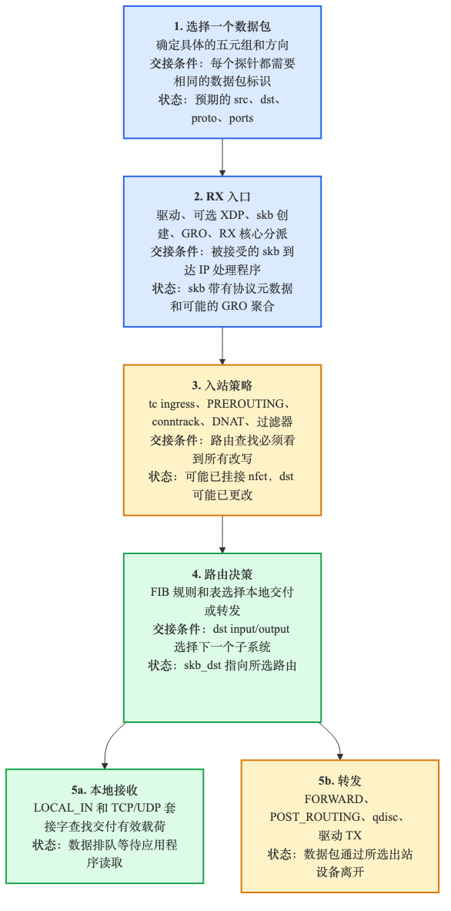
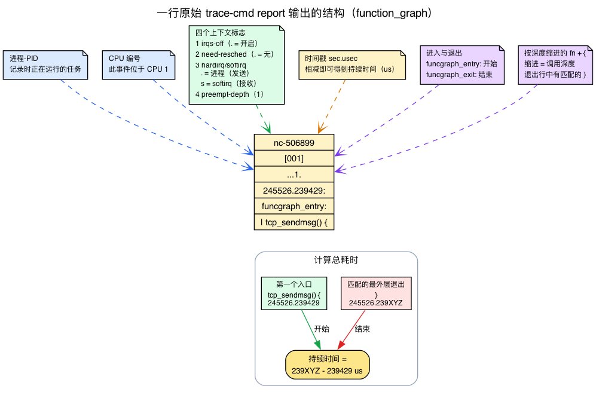
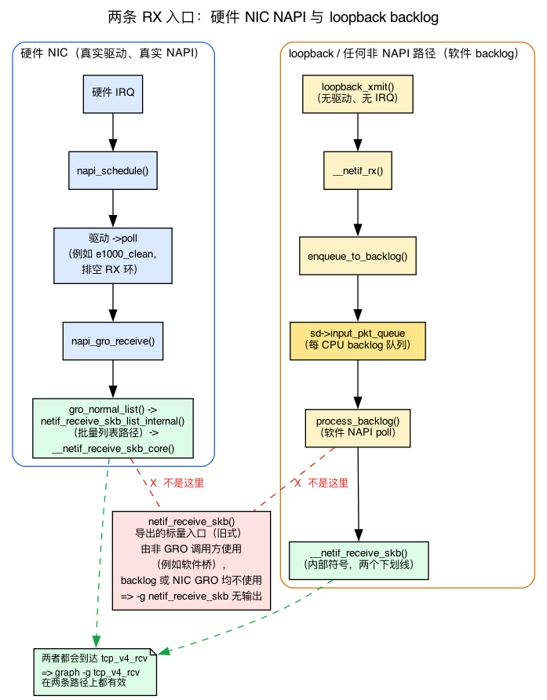

# 第30天 — 综合项目：端到端追踪一个数据包

> **今日任务：** 从你的系统里挑一个真实的数据包。追踪它经过过去 29 天里学到的每一个内核层。用内核函数名和大致时间记录观察结果。在这个过程中，你还会学到综合项目所依赖的最后两块背景知识——如何阅读原始的 `trace-cmd` 输出，以及环回（loopback）接收侧所运行的那个每 CPU 的“backlog”（积压）设备。约 4–5 小时。

## 为什么做这个练习

29 天给了你一套词汇：sk_buff、NAPI、qdisc、fib_lookup、conntrack、netfilter 钩子、sk_prot、拥塞控制、重传定时器、MPTCP、kTLS。每一个都是孤立的。综合项目要做的，是看它们如何在一个真实、可观测的数据包上*协同工作*。

当你能把一次 ping 或一次 HTTP 请求描述为一连串带名字的内核操作时，你就已经把这个模型内化了。这就是目标。

有两小块机制，你一直在不知不觉中依赖，却从未不得不*直接*去读它们，而综合项目是你第一次近距离盯着它们看的地方：

1. **原始的 `trace-cmd report` 输出。** 第2天和第3天给你看的是*符号化的*调用链（`netif_receive_skb → __netif_receive_skb_one_core → ip_rcv`）。今天你要粘贴字面上的多列跟踪行，并从中抽出一棵调用树和一个耗时。我们在下面把这个格式解码一次。
2. **每 CPU 的 backlog（软件 NAPI）设备。** 第2天教的是*硬件* NAPI 路径——驱动的 `->poll` 排空一个 RX 环。环回没有环、也没有驱动；它的接收侧运行在第二个、每 CPU 一份的*软件* NAPI 实例上，叫做 backlog。这就是为什么实验用 `-g tcp_v4_rcv` 而不是 `-g netif_receive_skb` 来画图，我们在下面会讲清楚具体原因。

这两块都很短。然后你就去追踪你的数据包。

## 实验

挑一个数据包——你可以从以下几种里选：

- **一次真实网络上的 TCP 请求/响应**：`curl https://example.com`，看着 SYN 发出去、响应回来。
- **一次简单的 ICMP 交换**：`ping -c 1 8.8.8.8`。
- **一次 UDP 服务交互**：`dig @8.8.8.8 example.com`。
- **一个经过网桥的数据包**：两个命名空间之间经由一个 Linux 网桥的流量。
- **一个经过 NAT 的数据包**：经由一条 masquerade 规则出去的流量，跟踪 conntrack 状态。

把它追踪一遍，识别出它经过的每一个内核层，并把这趟旅程写下来。



## 你会用到的工具

- **`trace-cmd record -p function_graph`**：完整的函数调用树。
- **`perf trace`**：跨系统调用和跟踪点的事件级可见性。
- **`bpftrace` 单行命令**：针对特定函数的定向测量。
- **`tcpdump`**：线缆层视角（实际发出的内容与内核状态记录的内容）。如果装了 `tshark` 也行（`apt install tshark`），但这里单用 `tcpdump` 就够了。
- **`ss -tipsm`**：任意时刻的套接字级状态。
- **`/proc/net/*`** 和 `/proc/sys/net/*`：内核状态和可调参数。
- **`bpftool`**：如果你挂了任何 BPF 程序，用它来检查。

## 阅读原始的 `function_graph` 输出

29 天里你读的都是*符号化的*调用链——`netif_receive_skb → __netif_receive_skb_one_core → ip_rcv`——用箭头替你画好。综合项目的交付物要求你自己从一份字面上的 `trace-cmd report` 里产出那条链，外加一个总耗时。所以在做任何事之前，先解码一行真实的输出。

### 为什么 `function_graph` 能画出一棵树

有两种相关的 ftrace 跟踪器。朴素的 **`function`** 跟踪器只在每个函数*进入*时探测——它能告诉你某个函数运行了，但不能告诉你它何时返回、耗时多久。**`function_graph`**“在函数的进入和退出两处都跟踪”，“从而提供了绘制类似 C 源代码的函数调用图的能力”（`Documentation/trace/ftrace.rst` 约第 828 行）。因为它同时看到两端，它就能“在内部计算函数开始和返回的时间”。

这就是第2天的实验（以及今天的实验）使用 `-p function_graph` 的全部原因：既有进入*又*有退出，意味着跟踪器可以在函数被调用时写下一个左花括号 `{`、在它返回时写下与之匹配的右花括号 `}`，而**缩进深度等于调用栈深度**。一个嵌套的 `{ ... }` 直接表示“外层函数调用了内层函数”。正是这种嵌套，是你要转写成 `tcp_sendmsg → tcp_sendmsg_locked → ...` 箭头链的东西。

### 逐列解读一行

这是发送侧的一行真实输出（下面我们还会再遇到整段）：

```
nc-506899 [001] ...1. 245526.239429: funcgraph_entry: |  tcp_sendmsg() {
```

从左到右读——列的图例就在内核文档里（`Documentation/trace/ftrace.rst:961-964`）：

- **`nc-506899`**——记录这一行时正在运行的进程名和 PID。这里是我们的 `nc` 生成器，PID 506899。
- **`[001]`**——方括号里的 **CPU 编号**。这个事件发生在 CPU 1 上。
- **`...1.`**——**四个上下文标志位**（`ftrace.rst:1063-1083`）。一个一个解码：
  - **位 1——irqs-off：** 如果中断被禁用则为 `d`，否则为 `.`。
  - **位 2——need-resched：** `N`/`n`/`.` 等——表示调度器是否想切换任务。
  - **位 3——hardirq/softirq：** `h` = 有一个硬 IRQ 正在运行，`s` = 有一个软 IRQ 正在运行，`.` = 普通（进程）上下文。
  - **位 4——preempt-depth：** 这个数字是 `preempt_disable` 嵌套的层级（这里是 `1`）。
  - 末尾的 `.` 是延迟标记列。
- **`245526.239429`**——自启动以来以秒.微秒表示的**时间戳**（六位小数，正如 `trace-cmd report` 渲染的那样；ftrace 底层的时钟是纳秒分辨率，但报告把它舍入到了微秒）。这就是你要相减来得出耗时的东西。
- **`funcgraph_entry:`**——这一行是一次函数*进入*（另一种是 `funcgraph_exit:`）。
- **`|  tcp_sendmsg() {`**——带缩进深度的函数，用 **`{`** 打开一个栈帧。匹配的 **`}`** 稍后会出现在同一缩进层级的某个 `funcgraph_exit:` 行上。

数据包跟踪最需要关注的是第 3 位标志。**`.`（普通上下文）意味着该函数运行在进程上下文中**——即*发送*侧，由 `send()` 等系统调用触发。**`s`（软 irq 运行中）意味着软中断上下文**——即*接收*侧，由 NAPI / `net_rx_action` 触发。所以只要瞥一眼第三个标志列，你就能分辨自己看的是你这个流的发送半程还是接收半程。这就是整个这一章要画出的发送与接收的区别，只用一个字符就能辨认。



### 计算交付物要求的“总耗时”

这份走查交付物要求“总耗时（显示的时间戳是秒.微秒；你可以计算出来）”。下面是结合上面的示例说明计算方法。每个栈帧的耗时是**它闭合的 `funcgraph_exit:` 的时间戳减去它打开的 `funcgraph_entry:` 的时间戳**。对整棵 `tcp_sendmsg()` 子树，找到第一个 `tcp_sendmsg() {` 进入的时间戳和匹配的外层 `}` 退出的时间戳：

```
funcgraph_entry:  245526.239429   tcp_sendmsg() {     <- first entry
...
funcgraph_exit:   245526.239XYZ   }                   <- matching outer exit
```

相减：`239XYZ − 239429` **微秒**就是你的总耗时（显示的时间戳是秒.微秒，所以差值单位是微秒——别把它误标成纳秒）。你甚至都不用手算——当 `funcgraph-tail`/`duration` 启用时（第2天和第3天都用 `-O funcgraph-tail` 记录），`trace-cmd report` 会在每个 `funcgraph_exit` 行上打印一个**耗时列**（同样是 `us` 单位），所以你可以直接从外层的 `}` 上读出耗时。

### 一个要预料到的陷阱（别以为你的跟踪坏了）

有些你“期待”看到的栈帧不会出现，原因有两个，你在第2天已经遇到过：

- **内联的包装函数消失了。** `ip_rcv_finish` 被内联了，所以跟踪显示的是 `ip_rcv_finish_core`；`deliver_skb` 被内联进了 `__netif_receive_skb_core`，从来不作为它自己的节点出现。
- **编译器后缀重命名了符号。** 你会看到 `__netif_receive_skb_core.constprop.0`，或者带 `.isra.N` 的名字——同一个函数，被编译器装饰过了。

这跟第2天讲过的告诫是一样的——我们不再重新解释，只是*记住它*，这样缺失或改名的栈帧就不会让你以为你的 `trace.dat` 出错了。

## backlog 设备：环回的接收侧是怎么工作的

第2天完整地教了**硬件** RX 路径：一个 NIC 拉起一个 IRQ，驱动的上半部调用 `napi_schedule`，`net_rx_action` 遍历每 CPU 的 `poll_list`，然后每个 NIC 队列的 `->poll`（比如 `e1000_clean`，权重 64）排空 RX 环，构造 skb 并把它们喂给 GRO。现代 GRO 接着通过**批量列表路径**将它们提交给后续路径：`gro_normal_list()`（`include/net/gro.h:519`）→ **`netif_receive_skb_list_internal()`**（`net/core/dev.c:6406`）→ `__netif_receive_skb_list()` → `__netif_receive_skb_list_core()`，后者调用每 skb 的核心函数。（回想第1天的 RX 描述符环 + DMA。）

环回路径则一概没有这些机制。没有 NIC、没有 IRQ、没有 DMA 环、没有驱动的 poll 例程。那么你 `nc localhost` 的一个数据包到底是怎么“到达”的？通过**每 CPU 一份、存在于每个 CPU 上的第二个软件 NAPI 实例——backlog。**

### 每 CPU 一个 backlog NAPI，挂在 softnet_data 上

每个 CPU 的 `struct softnet_data` 都带着它自己内嵌的 backlog NAPI，外加喂给它的那两个队列（`include/linux/netdevice.h:3551`）：

```c
struct softnet_data {
    struct sk_buff_head  process_queue;   /* :3553  drained by the poll */
    /* ... */
    struct sk_buff_head  input_pkt_queue; /* :3597  where new skbs land */
    struct napi_struct   backlog;         /* :3599  the software NAPI    */
};
```

在启动时，每个 CPU 的 backlog 都被接到一个叫 **`process_backlog`** 的 poll 例程上（`net/core/dev.c:13256`）：

```c
sd->backlog.poll = process_backlog;
```

所以 backlog *就是*一个 NAPI 设备——它坐在同一个每 CPU 的 `poll_list` 上，被同一个 `net_rx_action` 轮询，处在同样的预算之下——但它是一个**退化的** NAPI：没有硬件环可排空，只有一个软件的 skb 队列，里面装着由某处通过 `netif_rx` 送入的 skb。

### 具体跟踪环回的 TX→RX 跳转

当你发送到 `localhost` 时，环回设备的发送例程运行，并立即把 skb 交给**同一个** CPU 的*接收*侧。跟踪它：

1. **`loopback_xmit()`**（`drivers/net/loopback.c:70`）做 `skb->protocol = eth_type_trans(skb, dev)`，然后在约第 89 行，`if (likely(__netif_rx(skb) == NET_RX_SUCCESS))`。跳转就在这里：TX 直接调进了 RX 入口点。
2. **`__netif_rx()`**（`net/core/dev.c:5732`）→ `netif_rx_internal()`（`:5692`）→ **`enqueue_to_backlog()`**（`:5373`）。
3. `enqueue_to_backlog` 做 **`__skb_queue_tail(&sd->input_pkt_queue, skb)`**（`net/core/dev.c:5405`）——把 skb 停在这个 CPU 的 backlog 输入队列上——并且，如果队列原来是空的，就置位 `NAPI_STATE_SCHED`；该状态位属于 `sd->backlog`，随后再调用 `napi_schedule_rps(sd)`，把 backlog 放到 poll 列表上并拉起 `NET_RX_SOFTIRQ`。
4. 稍后，`net_rx_action` 轮询这个 backlog：**`process_backlog()`**（`net/core/dev.c:6644`）把 `input_pkt_queue` 拼接进 `process_queue`，并对每个 skb 调用 **`__netif_receive_skb(skb)`**。

这就是环回接收路径的全部：`loopback_xmit → __netif_rx → enqueue_to_backlog → sd->input_pkt_queue → process_backlog → __netif_receive_skb`。任何非 NAPI 或软件路径——环回、veth/tun 慢速路径、传统的非 NAPI 驱动——都喂给这同一个 backlog。



### 为什么在环回上 `-g netif_receive_skb` 不会产生结果

仔细看第 4 步。`process_backlog` 调用的是**内部的** `__netif_receive_skb`（两个下划线），**而不是**那个**导出的** `netif_receive_skb`（一个下划线）。而这里有个更微妙、需要准确理解的一点：一个真实的 NIC 也不会到达那个导出的标量 `netif_receive_skb`。现代 NAPI GRO 通过**批量列表路径**提交（`netif_receive_skb_list_internal` → `__netif_receive_skb_list` → `__netif_receive_skb_core`），而那个导出的单 skb 的 `netif_receive_skb()`（`net/core/dev.c:6454`）是一个*遗留*入口点，被少数几个非 GRO 的调用者使用——尤其是软件网桥经由 `br_handle_frame_finish`——而不是被 NIC GRO 使用。

所以 `-g netif_receive_skb` 在**两条**路径上都是一个不可靠的入口：环回经由 `__netif_receive_skb` 进入，而一个真实的 NIC 经由列表路径进入。这正是为什么实验改用 **`-g tcp_v4_rcv`**：它位于列表接收、标量接收和 backlog 三条路径*之下*，所以它能被环回的 `nc`、真实的 `curl` 和 `ping` 流量可靠地到达。无论哪条路径，都能可靠捕获同一个数据包。

### 回到“环回跳过了什么”

因为环回的 RX 就是 backlog，它没有驱动、没有硬件 IRQ、没有真正的 NAPI 环排空、也没有 GRO 合并——`process_backlog` 只是出队并投递。这就是为什么追踪示例中的 NIC 各层在 `lo` 上完全不会出现。

## 一个追踪示例：`curl http://example.com`

下面先演示一次跟踪结果可能呈现的样子。

### 第 1 步：DNS 查询（UDP）

`curl` 调用 `getaddrinfo("example.com")` → glibc → DNS 查询。

- 用户空间：`socket(AF_INET, SOCK_DGRAM, 0)` → `sendto(...)` 到你的 DNS 服务器的 53 端口。
- 内核：**`udp_sendmsg`**（`net/ipv4/udp.c:1233`）构造一个 skb，交给 IP。
- 出站：`ip_send_skb` → 路由 → `dev_queue_xmit` → qdisc（`fq_codel`）→ 驱动 → 线缆。
- 等待响应。
- 入站：NIC RX → NAPI poll → 驱动分配 skb → GRO → `__netif_receive_skb_core` → `ip_rcv` → 路由 → `udp_rcv`（`net/ipv4/udp.c:2588`）→ 四元组查找 → 入队到 `sk_receive_queue` → 唤醒 `recvfrom`。
- 用户空间：`recvfrom` 返回 DNS 响应。

### 第 2 步：TCP 连接（SYN）

`curl` 调用 `socket(AF_INET, SOCK_STREAM)` → `connect(example.com:80)`。

- 用户空间：connect 系统调用。
- 内核：`tcp_v4_connect`（`net/ipv4/tcp_ipv4.c:221`）。
  - 路由查找 → fib_lookup → `fib_table_lookup`（`net/ipv4/fib_trie.c`）。
  - 选源端口 → `inet_csk_get_port` → ehash 插入。
  - 构造 SYN 报文段 → `tcp_transmit_skb`（`net/ipv4/tcp_output.c`）。
- IP 层：`ip_queue_xmit` → `ip_local_out` → `NF_INET_LOCAL_OUT` netfilter 钩子 → conntrack 创建 NEW 条目 → `dst_output` → `ip_output` → `NF_INET_POST_ROUTING` 钩子 → conntrack 可能做 NAT → `ip_finish_output2` → 邻居解析（如果未缓存则 ARP）→ `dev_queue_xmit` → qdisc → 驱动。
- 套接字状态：`TCP_SYN_SENT`。

### 第 3 步：TCP 握手完成（SYN-ACK + ACK）

入站 SYN-ACK：
- NIC → NAPI → 驱动 → skb → GRO（一个包大概不会合并）→ `ip_rcv` → `NF_INET_PRE_ROUTING` → conntrack 匹配 → `ip_rcv_finish` → 路由 → `ip_local_deliver` → `NF_INET_LOCAL_IN` 钩子 → `tcp_v4_rcv`（`net/ipv4/tcp_ipv4.c:2068`）→ ehash 查找找到我们处于 SYN_SENT 的套接字 → `tcp_rcv_state_process`（`net/ipv4/tcp_input.c:7119`）看到 SYN+ACK → 调用 `tcp_set_state(sk, TCP_ESTABLISHED)` 并排队一个出站 ACK。

出站 ACK：和 SYN 走同样的路径，只是更小、并且穿过一个现在已 EST 的套接字。

### 第 4 步：HTTP 请求（TCP 发送）

`curl` 调用 `send(fd, "GET / HTTP/1.1\r\n...", n, 0)`。

- `tcp_sendmsg`（`net/ipv4/tcp.c:1447`）→ `tcp_sendmsg_locked` → 拷贝到 skb → 追加到 `sk_write_queue` → `tcp_push` → `tcp_write_xmit` 决定发送（cwnd 打开、snd_wnd 打开、Nagle 满足）→ `tcp_transmit_skb` → IP → ... → 线缆。

### 第 5 步：HTTP 响应（TCP 接收）

入站数据包到达：NIC → NAPI → 驱动 → skb → GRO（合并至多 64 KB！）→ `ip_rcv` → `tcp_v4_rcv` → TCP 状态机：
- ACK 推进 `snd_una`，从 `sk_write_queue` 释放 skb，可能经由拥塞控制算法的 `cong_avoid` 增长 cwnd。
- DATA 报文段追加到 `sk_receive_queue`，唤醒 `recvmsg`。

`curl` 调用 `recv(fd, buf, n, 0)` → `tcp_recvmsg` → 从 `sk_receive_queue` 拷贝到用户缓冲区。

### 第 6 步：TCP 关闭

`curl` 结束了，调用 `close(fd)`。`tcp_close`（`net/ipv4/tcp.c:3310`）构造 FIN、发送它、转换到 `TCP_FIN_WAIT_1`、等待对端的 ACK、转换到 `TCP_FIN_WAIT_2`、等待对端的 FIN、转换到 `TCP_TIME_WAIT`。约 60 秒后：状态变为 CLOSED，套接字被释放。

### 这次过程包含什么

一次单独的网页抓取涉及：2 个 DNS 数据包（UDP），至少 7 个 TCP 数据包（SYN、SYN-ACK、ACK、请求、响应、FIN、FIN-ACK），若干次路由查找、邻居解析、GRO 合并、拥塞控制、netfilter 的 PREROUTING/LOCAL_IN/LOCAL_OUT/POSTROUTING 钩子 ×N、conntrack 状态、qdisc 调度。这就是运转中的 Linux 内核网络协议栈。

## 建议的实验步骤

```bash
# 0. Remove any stale trace.dat. trace-cmd writes it as root, and a leftover
#    file from a prior run makes `report` silently read OLD data instead of
#    erroring.
sudo rm -f trace.dat

# 1. Set up tracing — records for 8s as a background job in THIS shell
sudo trace-cmd record -p function_graph \
    -g tcp_sendmsg \
    -g tcp_v4_rcv \
    -e net:* \
    -e tcp:* \
    -e skb:kfree_skb \
    sleep 8 &

# 2. Generate one packet exchange in this same shell
nc -l 9999 >/dev/null &
sleep 0.5
echo "test" | nc -q 1 localhost 9999

# 3. Wait for the background trace-cmd recorder (sleep 8) to exit, so
#    trace.dat is fully finalized before we read it. `wait` (no args) blocks
#    on the recorder; it also reaps the nc listener, which has already exited
#    once the client closed the connection.
wait

# 4. Generate the report
sudo trace-cmd report > /tmp/packet_trace.txt

# 5. Walk through the report
less /tmp/packet_trace.txt

# 6. Clean up — trace-cmd dropped a (potentially large) trace.dat here
rm -f trace.dat
pkill -f 'nc -l 9999' 2>/dev/null  # usually already gone after the single connection
```

> **为什么用环回，以及它跳过了什么。** 这个实验用 `nc localhost` 是为了可复现——不需要外部网络。要意识到环回是一条退化的路径：它使用 `noqueue` qdisc（没有 `fq_codel`），没有驱动/NAPI，没有 GRO 合并，没有 ARP/邻居解析，也没有到网关的路由——也就是上面走查例子所强调的大多数层。环回的 RX 就是 backlog（见上面的 backlog 一节），所以 `-g netif_receive_skb` 在这里不会得到结果；我们改用 `-g tcp_v4_rcv`。要看到完整的协议栈——qdisc、GRO、邻居、路由、驱动——就在驱动真实的出机流量时重跑，例如在一个真实接口上 `curl -s http://example.com >/dev/null` 或 `ping -c1 8.8.8.8`。

发送侧的输出如下（function_graph 嵌套；为了宽度裁掉了 CPU/时间戳列）：

```
  nc-506899 [001] ...1. 245526.239429: funcgraph_entry: |  tcp_sendmsg() {
  nc-506899 [001] ...1. 245526.239432: funcgraph_entry: |    tcp_sendmsg_locked() {
  nc-506899 [001] ...1. 245526.239452: funcgraph_entry: |      tcp_push() {
  nc-506899 [001] ...1. 245526.239453: funcgraph_entry: |        tcp_write_xmit() {
  nc-506899 [001] ...1. 245526.239456: funcgraph_entry: |          __tcp_transmit_skb() {
  nc-506899 [001] ...1. 245526.239498: funcgraph_entry: |            ip_queue_xmit() {
  nc-506899 [001] ...2. 245526.239500: funcgraph_entry: |              ip_local_out() {
  nc-506899 [001] ...2. 245526.239512: funcgraph_entry: |                ip_output() {
  nc-506899 [001] ...3. 245526.239515: funcgraph_entry: |                  ip_finish_output2() {
```

现在你能读懂那一段的每一列了。**`...1.`** 标志说的是：irqs 开、没有待处理的 resched、**普通/进程上下文**（位 3 是 `.`）、preempt-depth 为 1——确认了这是跑在 `send()` 系统调用之后的*发送*侧，恰如上下文标志一节所预言的。（注意 preempt-depth 数字会随锁的嵌套加深而从 `1`→`2`→`3` 逐步爬升，最终逼近 `ip_finish_output2`。）**缩进/花括号嵌套**就是调用树：`tcp_sendmsg` *调用* `tcp_sendmsg_locked` *调用* `tcp_push` ...——这正是你要在交付物里写下的箭头链。而**时间戳**（到目前为止 `239429` → `239515` µs）就是你要相减来得出耗时的东西。

接收侧以 `tcp_v4_rcv() { → tcp_inbound_hash()` 开始。在接收行上，预期标志的位 3 读作 **`s`**（软 irq 运行中），因为 `tcp_v4_rcv` 运行在 `net_rx_action` 的 backlog 轮询过程中，处于软中断上下文中——是发送侧那个 `.` 的可见对应物。上面那种*带缩进的嵌套*就是原始的 `trace-cmd report` 格式——它映射到你下面要写的箭头链。在投入 1–2 小时撰写报告之前，先确认你的 `trace.dat` 里确实包含这棵 `tcp_sendmsg`/`tcp_v4_rcv` 子树。

报告会很长——几百到几千行。挑**一个 TCP 报文段**（发出的 SYN 或收到的响应），跟踪它经过内核：

- 找到入口点（例如，出站报文段用 `tcp_sendmsg`，入站用 `tcp_v4_rcv`）。
- 记下按顺序调用的每一个函数（把花括号嵌套读作调用深度）。
- 对每一个，查一下它在哪个文件/行（点击任何 `path:N` 引用，就能在固定版本的内核标签上于 GitHub 打开那个文件/行）。
- 把这个序列写成：“tcp_sendmsg → tcp_sendmsg_locked → ip_queue_xmit → ip_local_out → ...”。

## 带注释的追踪报告

最终报告应约为 1–2 页，涵盖：

- 所追踪的数据包及其用途。
- 它触及的每一个内核函数，按顺序。
- 对每个函数：它的文件/行，它做了什么，它触及了什么数据结构。
- 总耗时（显示的时间戳是秒.微秒，所以差值单位是微秒；你可以计算出来——用匹配的外层 `funcgraph_exit` 时间戳减去第一个 `funcgraph_entry` 时间戳，或者当 `-O funcgraph-tail` 开启时读那个耗时列）。
- 你发现的一个惊讶之处（“我没想到 netfilter 对转发流量竟然运行了*两次*”）。

这份文档就是你理解该系统的证明。把它存下来；把它当作参考资料。

## 常见疑问

> **问：我的 `trace.dat` 有 50,000 行。我怎么把我这个流单独拎出来？**
>
> 答：几个快速的过滤办法。`trace-cmd report -F 'sched:*'` 在这里帮不上忙，但 `trace-cmd report | grep -A40 'tcp_sendmsg() {'` 会直接跳到你的发送子树。要按任务切分，用 `-P <pid>` 记录，或者按报告里的 `nc-<pid>` 列过滤。要按 CPU 切分，grep `[001]` 这一 CPU 标记。最简单的办法：只跟踪范围很窄的 `-g tcp_sendmsg -g tcp_v4_rcv`（就像实验里那样），这样一开始捕获里就只包含那两棵子树。

> **问：`perf trace` 与 `trace-cmd`——我什么时候该用哪个？**
>
> 答：`trace-cmd record -p function_graph` 给你带时间的内核内*调用树*——是“这个数据包按顺序经过了哪些函数、每个耗时多久”的合适工具。`perf trace` 更接近于跨系统调用和跟踪点的 `strace`——是“整个系统上有哪些系统调用和网络事件触发了、带着参数”的合适工具。综合项目要求的逐函数报告用 `trace-cmd`；当你想要的是系统调用和跟踪点的事件流时，就去拿 `perf trace`。

> **问：为什么 `tcp_v4_rcv` 出现在 `net_rx_action` 下面，而不是在我的 `nc` PID 下面？**
>
> 答：接收运行在软中断上下文中，与进程解耦。skb 是由 `net_rx_action`（`NET_RX_SOFTIRQ` 处理程序）排空 backlog/NAPI 轮询时投递的——那就是软中断触发时恰好在该 CPU 上运行的任何任务，而不是你的 `nc`。这也是为什么接收行在标志的第三位上带着 `s`。你的 `nc` 只有稍后才重新进入画面，那时 `recvmsg` 在进程上下文中把排队的数据拷出来。

> **问：走查例子里的一些函数没在我的跟踪里出现。它是不完整的吗？**
>
> 答：多半不是。`ip_rcv_finish` 被内联了（你会看到 `ip_rcv_finish_core`），`deliver_skb` 被内联进了 `__netif_receive_skb_core`，而编译器用 `.constprop.N`/`.isra.N` 后缀重命名了另一些。跟第2天讲的告诫一样——缺失或改名的栈帧是编译器的产物，不是丢了一个数据包。

## 在内核中阅读什么

- **`Documentation/trace/ftrace.rst`**——`function_graph` 跟踪器的描述（约第 828 行：在进入**和**退出两处都跟踪，画出调用图，在内部计算时间）、列的图例（`:961-964`），以及各个标志位的含义（`:1063-1083`：irqs-off、need-resched、hardirq/softirq `h`/`s`/`.`、preempt-depth）。
- **`drivers/net/loopback.c`**——`loopback_xmit`（第 70 行）；注意 `eth_type_trans` 然后是第 89 行附近的 `__netif_rx(skb)`——中间没有驱动的 TX→RX 跳转。
- **`net/core/dev.c`**——backlog 机制：`__netif_rx`（第 5732 行）→ `netif_rx_internal`（第 5692 行）→ `enqueue_to_backlog`（第 5373 行），后者做 `__skb_queue_tail(&sd->input_pkt_queue, skb)`（第 5405 行）；`process_backlog`（第 6644 行），即调用内部 `__netif_receive_skb` 的 backlog 轮询；以及 `sd->backlog.poll = process_backlog`（第 13256 行）。
- **`include/linux/netdevice.h`**——`struct softnet_data`（第 3551 行）：`process_queue`（3553）、`input_pkt_queue`（3597），以及内嵌的 `struct napi_struct backlog`（3599）——每 CPU 的软件 NAPI 状态。
- 走查例子引用的七个协议入口点：`udp_sendmsg`（`net/ipv4/udp.c:1233`）、`udp_rcv`（`net/ipv4/udp.c:2588`）、`tcp_v4_connect`（`net/ipv4/tcp_ipv4.c:221`）、`tcp_v4_rcv`（`net/ipv4/tcp_ipv4.c:2068`）、`tcp_rcv_state_process`（`net/ipv4/tcp_input.c:7119`）、`tcp_sendmsg`（`net/ipv4/tcp.c:1447`）、`tcp_close`（`net/ipv4/tcp.c:3310`）。

## 尚未涵盖的内容

在这 30 天里你跳过了：

- **rxrpc**（AFS 风格的传输——`net/rxrpc/`）。
- **SCTP**——有意思的替代传输（`net/sctp/`）。
- **DCCP**——大体上是历史遗留；在 6.16 中它的树内实现被移除了，所以已经不再有 `net/dccp/`。
- **RDS、TIPC、Sun RPC**——小众传输。
- **Bluetooth**（`net/bluetooth/`）—— 完全不同的一套栈，有它自己的协议。
- **CAN bus**（`net/can/`）—— 汽车网络。
- **NFC**（`net/nfc/`）。
- **L2TP、PPP、X.25**——遗留/专用协议。
- **Phonet、QRTR** 等等——单应用栈。

如果你的工作触及其中之一，就应用同样的方法论——读源码、用工具跟踪、观察——来学它。这些模式会重复出现。

## 要点回顾

- **`function_graph` 在进入和退出两处都跟踪**，所以它能画出调用树（`{`/`}` 花括号，缩进 = 调用深度）并在内部计算每函数的耗时。朴素的 `function` 只探测进入。
- 一行原始的 `trace-cmd report` 是：**进程-PID**、**CPU `[NNN]`**、**四个上下文标志位**（irqs-off / need-resched / hardirq-softirq / preempt-depth）、**秒.微秒时间戳**、`funcgraph_entry:`/`funcgraph_exit:`，然后是带缩进深度的函数。
- **第三个标志**是发送/接收的判别信号：`.` = 进程上下文（发送，跑在系统调用之后），`s` = 软中断（接收，跑在 NAPI/backlog 之后），`h` = 硬中断。
- **总耗时** = 外层 `funcgraph_exit` 时间戳 − 第一个 `funcgraph_entry` 时间戳（显示为秒.微秒，所以结果单位是微秒）；或者读 `-O funcgraph-tail` 开启时打印的耗时列。
- 内联的包装函数（`ip_rcv_finish`、`deliver_skb`）和编译器后缀（`.constprop.N`/`.isra.N`）会让某些栈帧消失或改名——这不是坏掉的跟踪。
- **backlog** 是一个每 CPU 的**软件 NAPI**（`sd->backlog`，poll = `process_backlog`），被环回和任何非 NAPI 路径使用。环回 RX：`loopback_xmit → __netif_rx → enqueue_to_backlog → sd->input_pkt_queue → process_backlog → __netif_receive_skb`。
- `process_backlog` 调用的是**内部的** `__netif_receive_skb`，**而不是**导出的 `netif_receive_skb`——所以 `-g netif_receive_skb` 在环回上是**空的**。改用 **`-g tcp_v4_rcv`**（在两条路径上都管用）。
- 环回是退化的（`noqueue` qdisc，没有驱动/IRQ/NAPI 环，没有 GRO，没有 ARP，没有路由），正是因为它的 RX 是 backlog。驱动真实的出机流量才能锻炼到完整的协议栈。
- 综合项目的交付物——数据包 + 目的，每个函数按顺序附文件/行和数据结构，以微秒为单位的总耗时，一个惊讶之处——就是证明你理解了这个系统的产物。

## 学完第30天之后

真正的流畅来自在这个栈上*工作*，而不只是读它。挑一个：

- **提交一个修复。** 看看 netdev 邮件列表，找一个你能验证的 `Reported-by`，提出一个修复。
- **写一个工具。** 为你想知道的东西构建一个跟踪器——一个内核侧的每流延迟直方图、一个自定义的丢包分类器、一个 cgroup 感知的带宽跟踪器。
- **优化一个工作负载。** 拿一个你面对的实际性能问题——高延迟、丢包、数据包乱序——用你学到的东西去诊断并修复它。
- **读那本 eBPF 书**（本书的姊妹篇）。它建立在这里打下的内核网络基础之上，向你展示如何*编写*那些挂到所有这些地方的 BPF 程序。

你现在已经从第一性原理理解了 Linux 内核网络协议栈。这是一项持久的技能。欢迎加入 Linux 内核网络社区。
