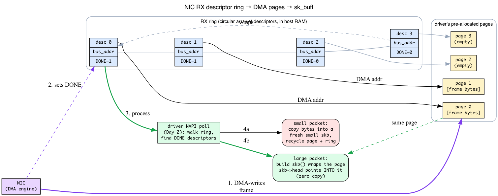
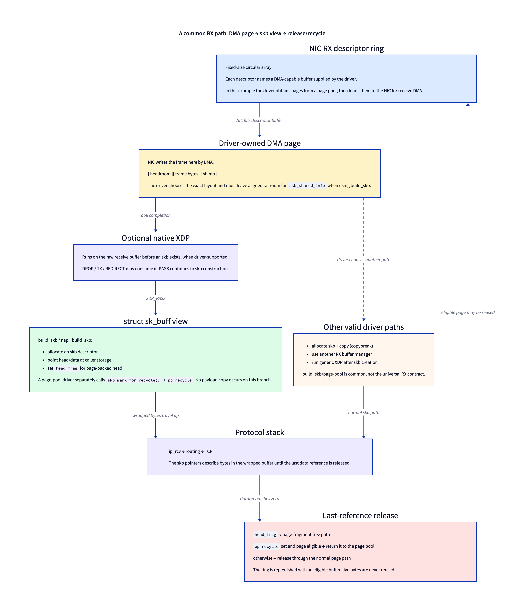
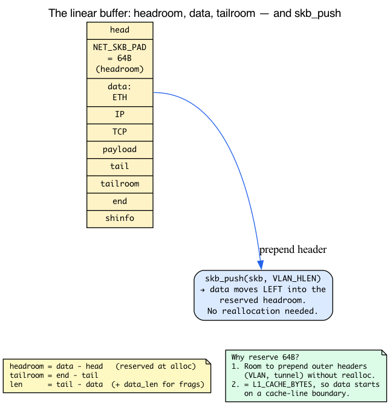
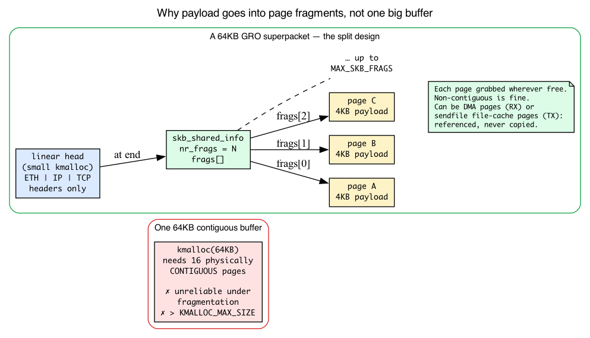
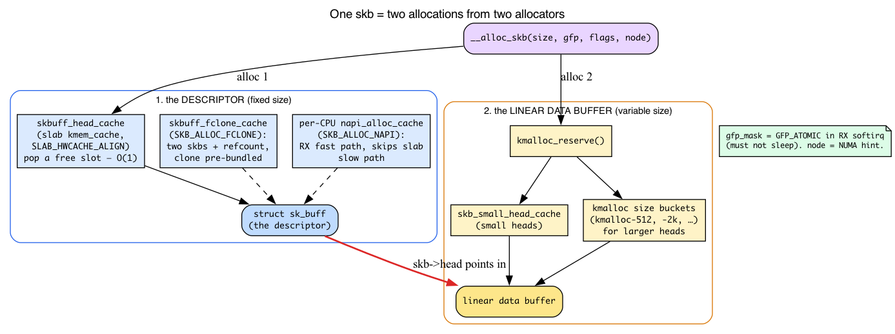
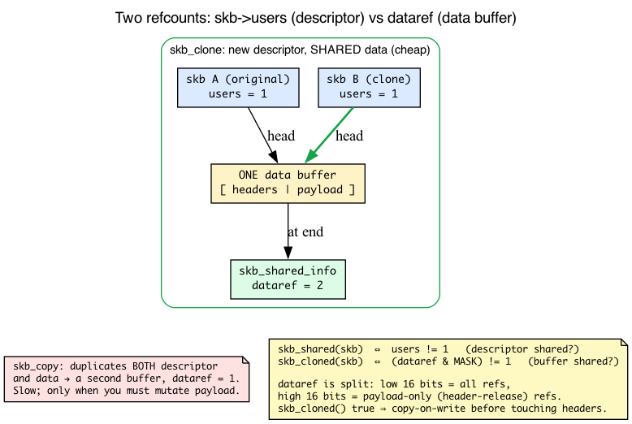
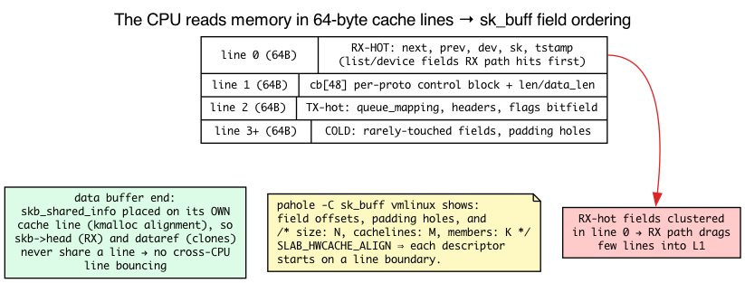

# Day 1 — `struct sk_buff`: the universal packet container

> **Today's mission:** understand the most-touched data structure in Linux networking. Learn its anatomy, lifecycle, and the layout games it plays — and the hardware and memory machinery underneath that make those games necessary. Total time: ~75 minutes.

> **Phase 1 starts here.** Days 1–5 cover the foundations: sk_buff, the RX/TX paths, NAPI, segmentation offloads, network namespaces. By Day 5, you'll be able to read the kernel's RX path top-to-bottom without losing the thread.

## Why sk_buff matters more than any other structure

Every packet that crosses any layer of the kernel network stack rides in an `sk_buff`. RX from the NIC, TX to the wire, packet filtering, routing, encapsulation, segmentation — all operate on this structure. Knowing how it works is the difference between reading kernel networking code fluently and getting lost two function calls deep.

The structure lives at **`include/linux/skbuff.h`** (line 886 in 7.1) and the implementation at **`net/core/skbuff.c`** (~7500 lines as of 7.1 — about 80% of the file is utility functions).

Here's the thing, though: the `sk_buff` doesn't exist in a vacuum. It is the kernel's answer to a very physical problem — *a network card just dumped some bytes into your RAM, and now several different subsystems each want to look at those bytes without copying them around.* To really understand why `sk_buff` is shaped the way it is, you need four pieces of background that most tutorials skip:

1. How a NIC actually delivers a packet into memory (descriptor rings + DMA).
2. How the kernel hands out memory in fixed-size pools (the slab allocator).
3. How physical memory is chopped into pages, and why you can't always get a big contiguous chunk.
4. How the CPU reads memory in 64-byte lines, which dictates field ordering.

We'll teach each of these *as we hit the part of `sk_buff` that depends on it*. By the end you'll be able to read `__alloc_skb` and `build_skb` and know exactly what every line is fighting against.


## Where packets come from: the NIC, descriptor rings, and DMA

Before we open the struct, let's follow the bytes. When a frame arrives on the wire, **the CPU is not involved in copying it into memory.** That job belongs to the NIC itself, working through a mechanism called *DMA*.

**DMA (Direct Memory Access)** means the device reads and writes host RAM on its own, without the CPU moving bytes one load/store at a time. The CPU just tells the device *where* in RAM to put things; the device's DMA engine does the transfer and signals when it's done. For this to be safe, the buffer must be **`dma_map`'d** first: the kernel gives the device a *bus address* it can use, and the mapping makes sure CPU caches and device view of memory stay coherent.

So how does the NIC know where to put incoming frames? Through a **RX descriptor ring**:

- A **ring** is a fixed-size circular array of **descriptors**, living in host memory, that the driver sets up at init time.
- Each **descriptor** is a small record holding a **DMA (bus) address** plus **status bits**.
- At startup the driver **pre-allocates a buffer** (typically one page, or a slice of a page) for each descriptor and writes that buffer's bus address into the descriptor. These are the "driver's preallocated pages" you'll see referenced everywhere.
- When a frame arrives, the NIC's DMA engine writes the frame bytes **directly into the buffer** named by the next free descriptor, then **flips a DONE bit** in that descriptor and (eventually) raises an interrupt.

The crucial consequence: **by the time the CPU runs, the packet bytes are already sitting in a page in RAM.** The driver didn't copy them there — the hardware did. The driver's job in its receive routine (which on Linux runs inside *NAPI poll* — Day 2's whole topic) is to walk the ring, find descriptors with the DONE bit set, and turn each already-populated DMA page into an `sk_buff` the stack can process.

That last step is where `sk_buff` enters, and it has two strategies:

- **Small packets (e.g. a 64-byte ACK):** copy the few bytes out of the DMA page into a fresh, small skb buffer, and immediately recycle the DMA page back into the ring. Cheap, because the copy is tiny.
- **Large packets:** *don't copy at all.* Wrap the existing DMA page in an skb so that the skb's `data` pointer points **into the page the NIC already filled.** This is the **zero-copy receive path**, and it's exactly what `build_skb()` exists to do. We'll meet it below.

**TX is the mirror image.** To transmit, the driver takes an outgoing skb, `dma_map`s its linear buffer and each page fragment, writes those bus addresses into **TX-ring descriptors**, and kicks the NIC. The NIC's DMA engine reads the bytes straight out of those pages and onto the wire, then raises a *completion* so the driver knows it can unmap and free the skb.

Hold onto one idea: **a packet's payload often lives in independent pages that the kernel wants to reference, not copy** — DMA pages on RX, file-cache pages on `sendfile()` TX. That single fact is why `sk_buff` is split into a small "descriptor + headers" part and a list of "page fragments," which we'll see in a moment.



> Connect forward: **Day 2's RX path starts in the driver's NAPI poll draining this exact ring.** Today we only need to know the ring exists and that it leaves packet bytes pre-positioned in pages.

## A common zero-copy RX path: DMA page → skb window

Here's the part most treatments skip, and it's the part that makes everything else click. On a common high-performance receive path, the driver gives the NIC a kernel-owned buffer for DMA, then wraps that same storage in an skb instead of copying the frame. This is an important path — **not a contract every driver must follow**.



A modern NIC and its driver commonly communicate through a **descriptor ring**: a fixed-size circular array where each receive descriptor names a DMA-capable buffer. In a page-pool-based driver, the handshake looks like this:

1. **Before a packet arrives**, the driver obtains a page (often from a page pool), maps it for DMA, and writes its DMA address into a free receive descriptor. The kernel owns the memory; the descriptor lends it to the NIC.
2. **A frame lands.** The NIC DMA-engines the bytes into that buffer, marks the descriptor done, and eventually causes NAPI polling to run.
3. **The driver processes the completion.** Native XDP, when supported and attached, can inspect the raw buffer here. After `XDP_PASS`, many drivers call **`build_skb`** or `napi_build_skb`: the helper allocates an skb descriptor and points `skb->head` at the caller-provided storage. That branch avoids a payload copy.
4. **The skb travels up the stack** — `ip_rcv`, routing, TCP — with its pointers describing bytes in that buffer.
5. **The last data reference releases the head.** `head_frag` tells `skb_free_head()` that the head came from a page or page fragment. Separately, a page-pool-aware driver calls `skb_mark_for_recycle()`, setting `pp_recycle`; only then does the free path try to return the page to its page pool. Without that marker, the page-fragment free path releases it normally.

The alternatives matter. Some drivers allocate an skb with `napi_alloc_skb()` and copy a small frame into it (a receive **copybreak**); others use different buffer managers. Generic XDP also runs later, after an skb already exists. So `build_skb` means "wrap caller-provided storage," not "all RX is page-pool zero-copy."

This is why `build_skb` exists alongside `__alloc_skb`. `__alloc_skb` allocates a descriptor plus fresh linear storage. `build_skb` allocates the descriptor around storage supplied by its caller; that storage may be a DMA-filled page, but the helper itself neither knows about a NIC ring nor opts the skb into page-pool recycling.

Three consequences fall out of the common page-backed path:

- **`head_frag` and `pp_recycle` answer different questions.** `head_frag` selects page-fragment release rather than `kfree`; `pp_recycle` asks the page-pool path to reclaim eligible storage.
- **Native XDP can run before skb construction.** A drop or redirect can therefore avoid allocating the skb descriptor at all. (Day 27.)
- **The driver reserves headroom and tailroom deliberately.** `NET_SKB_PAD`-style headroom permits later `skb_push`; tailroom must include aligned `skb_shared_info`. The exact layout is driver-specific.

The transmit side uses a related ring but not a perfect ownership mirror (Day 3). TCP may retain its original skb in the retransmit tree while a charged clone travels through IP, the qdisc, and the driver. The driver maps that downstream skb for a TX descriptor, and completion releases the downstream reference.

Hold onto the qualified picture: **RX descriptor → driver-owned DMA buffer → optional native XDP → skb view (or copy) → stack → release/recycle.** Days 2 and 3 walk it function by function.

## The descriptor and the data

The `sk_buff` itself is a *descriptor*. The packet bytes live elsewhere — in a separately-allocated linear buffer plus, optionally, a tail of page fragments.


Four pointers in `sk_buff` define the linear region:

- `head` — start of the allocation. Doesn't move after creation.
- `data` — first valid byte of the current header view. Moves as you push/pull headers.
- `tail` — one past the last valid byte.
- `end` — the boundary; the `skb_shared_info` trailer (fragment list + buffer refcounts, defined below) lives here.

The invariants:
- `head ≤ data ≤ tail ≤ end`
- `headroom = data - head`, `tailroom = end - tail`
- For linear-only skbs, `len == tail - data` and `data_len == 0`.

When the kernel pushes an outer header (e.g., adding an IP header to encapsulate), it does `skb_push(skb, header_len)` — which decrements `data`. Headroom shrinks; the prepended bytes are now part of the packet. The opposite is `skb_pull` — increment `data`, used when stripping a header you've already processed.

### Why reserve headroom at all? `NET_SKB_PAD` explained

Notice that `skb_push` only works if there's empty space *before* `data` to push into. That empty space is the **headroom**, and on the receive path the driver deliberately reserves some up front. Why?

Because as a received packet climbs the stack, layers frequently need to **prepend** bytes: re-insert a hardware-stripped VLAN tag, wrap the packet in an outer IP/UDP header for a tunnel, and so on. If there's no headroom, each `skb_push` would have to **reallocate** the whole buffer (via `pskb_expand_head`) just to make room — expensive. Reserving a little headroom at allocation time means those pushes are nearly free.

The amount reserved by the RX allocators is **`NET_SKB_PAD`**, and it is *not* a magic constant — it's defined relative to the cache line:

```c
#define NET_SKB_PAD     max(32, L1_CACHE_BYTES)   /* include/linux/skbuff.h:3319 */
```

On x86_64, `L1_CACHE_BYTES` is 64 (`CONFIG_X86_L1_CACHE_SHIFT=6` → `1 << 6 = 64`), so **`NET_SKB_PAD = 64`**. Two things are happening with that value:

1. **Enough room for outer headers.** 64 bytes comfortably covers a VLAN tag, a tunnel header, etc., so the common prepends never reallocate.
2. **Cache alignment.** Because the pad equals the cache-line size, the packet's first byte (`data`, where the Ethernet header begins) starts on a cache-line boundary — which the receive path and `memcpy`s benefit from. (We'll explain cache lines fully later; for now: aligned data is faster to touch.)

A separate, smaller pad you'll see is **`NET_IP_ALIGN`**. Some architectures want the **IP header** 4-byte aligned. Since the Ethernet header is 14 bytes, a 2-byte pad before `data` makes byte 14 (the start of the IP header) land on a 4-byte boundary. But `NET_IP_ALIGN = 2` (`skbuff.h:3295`) is only the **generic fallback** — it's defined under `#ifndef NET_IP_ALIGN`. On **x86 the arch overrides it to `0`** (`arch/x86/include/asm/processor.h:46`: `#define NET_IP_ALIGN 0`), so no IP-alignment pad is inserted there at all — it's not a per-driver choice to "skip" a 2-byte pad, the constant is simply zero. That's why `napi_alloc_skb` reserving `NET_SKB_PAD + NET_IP_ALIGN` (`skbuff.c:886`) comes out to 64 + 0 = 64 on x86, matching the "~64 bytes" the headroom experiment promises. The 2-byte pad is honored only on alignment-sensitive architectures, where it costs nothing extra.

Keep `NET_SKB_PAD = 64` in mind — it shows up again in the headroom experiment and in today's Check question.



## Page fragments — for big packets and zero-copy

Many real packets — especially large outbound ones from `sendfile()` or large GRO inbounds — don't fit in one allocation. The kernel uses `skb_shared_info` (placed right after the linear buffer's `end`) to chain page fragments:

```c
struct skb_shared_info {
    __u8 nr_frags;
    skb_frag_t frags[MAX_SKB_FRAGS];   /* (netmem, offset, len) tuples; see below */
    struct sk_buff *frag_list;         /* chain of skbs (TSO) */
    /* ... */
};
```

`data_len` holds the byte count in fragments. `len = (tail - data) + data_len`. Most code uses helpers (`skb_frag_size`, `skb_frag_page`) rather than touching the fields directly.

### What a "page" is, and why payload goes into frags

To see *why* the kernel bothers with a separate fragment list instead of one big buffer, you need the kernel's unit of physical memory: the **page**.

- Physical RAM is managed in fixed **page frames** of `PAGE_SIZE` (4 KB on x86_64). Every allocation of physical memory is ultimately some number of these frames.
- The **buddy allocator** hands out runs of **2^order contiguous pages**: order 0 = 4 KB, order 1 = 8 KB, order 3 = 32 KB, and so on. Higher orders require more *physically contiguous* memory.
- **`kmalloc` returns physically contiguous memory** and is therefore capped at a maximum size (`KMALLOC_MAX_SIZE`, `slab.h:591`). Above `KMALLOC_MAX_CACHE_SIZE` (`slab.h:593`) `kmalloc` stops using the size-bucketed slab caches and goes straight to the buddy/page allocator (still physically contiguous); the hard upper bound on one allocation is `KMALLOC_MAX_SIZE`. Asking for, say, one **64 KB physically contiguous** block is unreliable on a busy system: there may be plenty of *free* pages, but not 16 of them *in a row*. That condition — free memory that isn't contiguous — is **fragmentation pressure.**

Now the design makes sense. Think of a `skb_frag_t` as a **(page, offset, size)** reference — some bytes inside a page — which is the right first approximation. The literal struct in 7.1 is a `(netmem, offset, len)` tuple: `struct skb_frag { netmem_ref netmem; unsigned int len; unsigned int offset; }` (`skbuff.h:361`). The `netmem_ref` (`include/net/netmem.h:140`) is an *opaque* reference that encodes **either** a `struct page` **or** a `net_iov` (non-page memory, e.g. devmem-TCP), which is why a frag isn't guaranteed to be backed by a `struct page` at all — `skb_frag_page()` first checks `skb_frag_is_net_iov(frag)` and returns `NULL` for the non-page case. Always touch a frag via the helpers `skb_frag_page()` / `skb_frag_off()` / `skb_frag_size()`, never the fields directly. The memory referenced by different frags **need not be contiguous with each other or with the linear head.** So a 64 KB GRO superpacket becomes:

- a **tiny linear head** holding just the Ethernet/IP/TCP headers (a small `kmalloc`, easy to satisfy), plus
- up to **`MAX_SKB_FRAGS`** page fragments holding the payload — each an ordinary 4 KB page grabbed from wherever it was free.

No 64 KB contiguous allocation needed, ever. And it's exactly this structure that makes **zero-copy** possible: the frag pages can be the NIC's DMA pages on RX, or `sendfile()`'d file-cache pages on TX — *referenced*, never copied.

`MAX_SKB_FRAGS` bounds how many frags one `skb_shared_info` holds. In v7.1 it's configurable:

```c
/* include/linux/skbuff.h */
#ifndef CONFIG_MAX_SKB_FRAGS
# define CONFIG_MAX_SKB_FRAGS 17
#endif
#define MAX_SKB_FRAGS CONFIG_MAX_SKB_FRAGS
```

and `net/Kconfig` declares `config MAX_SKB_FRAGS` with `range 17 45` and `default 17` — raising it helps GRO/BIG TCP pack more payload per skb.



> ### There are no Dumb Questions
>
> **Q: Why isn't the linear buffer just always big enough?**
>
> A: Because each skb potentially allocates its linear buffer at packet receive. For 64-byte ACKs that don't carry payload, a 1500-byte allocation would waste memory. For 64KB GRO superpackets, a 64KB linear buffer is impractical (kmalloc max-order limits, fragmentation pressure). The split design lets the kernel allocate just enough for headers linearly and use page fragments for payload.
>
> **Q: What's the cb[48] for?**
>
> A: It's a per-packet scratchpad. Each protocol layer can stash state there. TCP uses `TCP_SKB_CB(skb)` to keep sequence numbers, flags, and SACK info. Across `skb_clone` the `cb` contents are *copied* verbatim into the clone — `__copy_skb_header` (`net/core/skbuff.c:1552`) does `memcpy(new->cb, old->cb, sizeof(old->cb))` — so the clone starts with the same control data. Layers that need clone-independent state must reset `cb` themselves. 48 bytes is generous — most layers use a fraction.
>
> **Q: How big is a fresh sk_buff descriptor?**
>
> A: Around 230 bytes on x86_64 (verify: `pahole sk_buff` in your build directory after compiling — exact size is config-dependent). The structure has been carefully cache-line-aligned and the fields ordered for hot/cold separation. Read the comments around the field declarations to see what's "RX hot" vs "TX hot."

## How the kernel hands out memory: the slab allocator

We're about to read the allocation path, and it names several "caches." Before that pays off, you need the **slab allocator** (Linux's is called **SLUB**).

A general-purpose `malloc` is flexible but has overhead: it tracks variable-sized blocks, searches free lists, and fragments over time. The kernel allocates *the same few object types over and over* — millions of `sk_buff`s, for instance — so it uses a specialized scheme:

- The slab allocator carves whole **pages into fixed-size object slots.**
- A **`kmem_cache`** is a pool specialized for **one object size/type.** Allocation is essentially "pop a free slot," free is "push it back" — **O(1)**, with excellent cache behavior because objects of the same type cluster together.
- General-purpose `kmalloc(n)` is built on top of a set of **size-bucketed** caches (`kmalloc-512`, `kmalloc-2k`, …). `kmalloc(n)` rounds `n` up to the next bucket and pulls from that cache.

Now here's the key structural insight about `sk_buff`: **the descriptor and the data come from two different allocators.**

- The **descriptor** (`struct sk_buff` itself) comes from a **dedicated, fixed-size cache** so every skb is the same size and stays hot in cache. In v7.1 this cache is named **`"skbuff_head_cache"`** and reached via `net_hotdata.skbuff_cache`:

  ```c
  /* net/core/skbuff.c:5189, in skb_init() */
  net_hotdata.skbuff_cache = kmem_cache_create_usercopy("skbuff_head_cache",
                          sizeof(struct sk_buff), 0,
                          SLAB_HWCACHE_ALIGN | SLAB_PANIC | FLAG_SKB_NO_MERGE, ...);
  ```

- The **linear data buffer** is a **separate** allocation, sized to the packet. That's why `__alloc_skb` allocates *twice*.

There are three skb-related caches created in `skb_init()`:

| Cache (v7.1 name) | What it holds | Created at |
|---|---|---|
| `skbuff_head_cache` | the `struct sk_buff` descriptor (fixed size) | `skbuff.c:5189` |
| `skbuff_fclone_cache` | a `struct sk_buff_fclones` = **two** skbs + a refcount | `skbuff.c:5199` |
| `skb_small_head_cache` (slab name `"skbuff_small_head"`) | small linear data buffers (`SKB_SMALL_HEAD_CACHE_SIZE`) | `skbuff.c:5208` |

**Fclones.** When code knows it will *clone* an skb soon (TCP does this constantly — it keeps a copy for retransmission while sending a clone down the stack), it sets `SKB_ALLOC_FCLONE`. That allocates from `skbuff_fclone_cache`, whose object is a `struct sk_buff_fclones { struct sk_buff skb1; struct sk_buff skb2; refcount_t fclone_ref; }` (`skbuff.h:1396`). The anticipated clone (`skb2`) is **right there** in the same allocation — no second descriptor allocation needed when the clone happens.

**Per-CPU fast path.** RX is hot, so there's a per-CPU stash of recycled descriptors called the **`napi_alloc_cache`** (a per-CPU `skb_cache[]` array, `skbuff.c:231`). `napi_skb_cache_get()` (`skbuff.c:284`) pops from it; when empty it refills in bulk via `kmem_cache_alloc_bulk(net_hotdata.skbuff_cache, ...)`. Allocating an skb with `SKB_ALLOC_NAPI` (or simply allocating in softirq context) pulls a descriptor from this per-CPU cache and **skips the slab allocator's slow path entirely.** That's the "per-CPU caching" the NAPI allocator advertises.

**GFP flags.** Every allocation takes a `gfp_mask` (e.g. `GFP_KERNEL`, `GFP_ATOMIC`). It tells the allocator what it's *allowed* to do — most importantly, **whether it may sleep.** The RX path runs in softirq/IRQ (atomic) context where sleeping is forbidden, so it uses **`GFP_ATOMIC`**. That's why the allocation functions thread a `gfp_mask` (and a NUMA `node`) through everything.



## sk_buff lifecycle: cradle to grave


Now the allocation paths read cleanly, because you know what every cache and flag means.

**Allocation paths** (all in `net/core/skbuff.c`):

- `__alloc_skb(size, gfp_mask, flags, node)` — the workhorse. Allocates the **descriptor** from `net_hotdata.skbuff_fclone_cache` (when `SKB_ALLOC_FCLONE` is set, useful for skbs you'll clone) or the default `skbuff_head_cache` — or, with `SKB_ALLOC_NAPI`, from the per-CPU `napi_alloc_cache`. Then allocates the **linear buffer separately** via `kmalloc_reserve` (`skbuff.c:604`), which pulls from `skb_small_head_cache` for small heads or falls back to the size-bucketed `kmalloc` caches for larger ones. Two allocations, two allocators — exactly as the slab section predicted. (`__alloc_skb` is at `skbuff.c:672`.)
- `__netdev_alloc_skb(dev, len, gfp_mask)` — drivers' RX-side allocator. Its buffer "has `NET_SKB_PAD` headroom built in" (the kernel doc comment says so verbatim at `skbuff.c:753`) for cheap header insertion.
- `napi_alloc_skb(napi, len)` — NAPI fast-path allocator with the per-CPU descriptor caching described above; also reserves `NET_SKB_PAD`.
- `build_skb(data, frag_size)` / `slab_build_skb(data)` — wrap a *pre-existing* buffer (the driver's preallocated DMA page) into an skb. **This is the zero-copy receive path from the NIC section.** Instead of allocating a data buffer and copying the frame in, it allocates only a descriptor (`kmem_cache_alloc(net_hotdata.skbuff_cache, ...)`) and points the skb at the page the NIC already filled. `__build_skb` is at `skbuff.c:488`; `build_skb` at `skbuff.c:506` then sets `skb->head_frag = 1` (the skb's head *is* a page fragment, `skbuff.h:828`) and calls `skb_propagate_pfmemalloc(...)`. `napi_build_skb()` (`skbuff.c:574`) is the NAPI-context variant that also sources its descriptor from the per-CPU cache. The doc comment on `__build_skb` spells out the RX model we taught: *"Before IO, driver allocates only data buffer where NIC put incoming frame… RX rings only contain data buffers, not full skbs."*

**Cloning paths** — and to read these you need the refcount model, so let's build it first.

### Two refcounts, not one: `skb->users` vs `dataref`

`skb_clone` makes a cheap copy of an skb. To understand *why it's cheap* and *what it's safe to do afterward*, you must know that an skb tracks **two completely separate reference counts.**

**1. `skb->users` — references to the descriptor.**
```c
refcount_t users;   /* include/linux/skbuff.h:1099 */
```
This counts how many places hold *this `sk_buff` pointer.* `skb_get()` bumps it; `kfree_skb()` decrements it and **only actually frees when it hits zero.** `skb_shared(skb)` is literally `refcount_read(&skb->users) != 1` (`skbuff.h:2112`). Two subsystems queuing the same skb use this.

**2. `skb_shared_info.dataref` — references to the data buffer.**
```c
atomic_t dataref;   /* include/linux/skbuff.h:612 */
```
This counts how many `sk_buff` **descriptors point at the same data buffer.** This is the one `skb_clone` touches: a clone gets a **brand-new descriptor** but, instead of copying the bytes, **increments `dataref`.** *That* is why cloning is cheap — no payload copy.

Because clones share the buffer, you must not blindly write to a cloned skb's headers — you'd corrupt the other holder's view. So `dataref` is cleverly **split into two halves** (`SKB_DATAREF_SHIFT = 16`, `skbuff.h:658`):

- the **low 16 bits** count the *overall* number of references to the buffer;
- the **high 16 bits** count how many of those are **payload-only** (header-release) references.

The kernel's own doc block (`skbuff.h`, "DOC: dataref and headerless skbs") explains it: TCP marks an skb `nohdr` via `__skb_header_release()`, which sets `dataref = 1 + (1 << SKB_DATAREF_SHIFT)` (`skbuff.h:2101`) so lower layers know they may prepend headers into the shared buffer safely. `skb_header_cloned()` (`skbuff.h:2070`) computes `(dataref & MASK) - (dataref >> SHIFT)` to decide whether the **headers** are safe to modify in place.

This gives you the precise meaning of two helpers you'll see everywhere:

- **`skb_cloned(skb)`** (`skbuff.h:2031`) is true when the data buffer is shared (`(dataref & SKB_DATAREF_MASK) != 1`). If it's true, you must **not** write headers without first doing a copy-on-write via `pskb_expand_head`.
- **`skb_shared(skb)`** tests the *descriptor* count (`users != 1`), a different question entirely.

With that, the cloning paths are obvious:

- `skb_clone(skb, gfp)` (`skbuff.c:2088`) — new descriptor, **shares** the data buffer (bumps `dataref`). Cheap. Used heavily in packet sockets (`tcpdump`) and netfilter LOG. (If an fclone is available it reuses the pre-allocated `skb2` — no descriptor allocation at all.)
- `skb_copy(skb, gfp)` — full copy of **both** descriptor **and** data (fresh buffer, `dataref = 1`). Slow; only when you must mutate the payload.
- `pskb_copy(skb, gfp)` — copies the linear head but **shares the frag pages** (bumps the pages' refcounts).

This two-level scheme is why `tcpdump`, which clones *every* packet, stays cheap per packet yet still shows up measurably at high rates — today's clone-tracing experiment makes that visible.



**Free paths**:

- `kfree_skb(skb)` — the standard release. Decrements refcounts (both `users` and, when `users` hits zero, `dataref` on the buffer); frees the data only if it's the last reference.
- `kfree_skb_reason(skb, reason)` — newer; takes a `enum skb_drop_reason` so the kernel's drop monitor can attribute the drop. **Always prefer this** in new code. The reason enum is in `include/net/dropreason-core.h`.
- `consume_skb(skb)` — same as `kfree_skb` but doesn't trigger drop tracepoints (used for "successful" disposals).

## The CPU's view of memory: cache lines and field ordering

One last piece of background, and it explains the comments you'll read in the struct and the whole point of today's `pahole` lab.

**The CPU does not read memory one byte at a time.** It moves memory in fixed **cache-line** units — `L1_CACHE_BYTES`, **64 bytes on x86_64.** Touch a single field and the CPU pulls that field's entire 64-byte line into L1 cache. Touch a field in a different line, that's a second line fetched.

This has a direct performance consequence for a struct touched as often as `sk_buff`:

- **Hot/cold separation.** If the fields a given code path uses are scattered across many cache lines, the path drags many lines into cache. If they're **grouped into the same line(s)**, the path touches few lines and runs faster. So `sk_buff` is laid out so that **RX-hot fields cluster, TX-hot fields cluster, and rarely-used (cold) fields sit apart** so they don't pollute hot lines. That's why the very first fields are `next`, `prev`, and the `dev`/`sk` area (`skbuff.h:886`) — the list-and-device fields the RX path hits first.

- **Bit-packed flags.** Boolean state like `cloned:1, nohdr:1, fclone:2, head_frag:1, pfmemalloc:1, …` is packed into shared `__u8` bitfields (`skbuff.h:956`) partly to keep the hot section dense — many flags in one byte instead of one byte each.

- **Descriptor alignment.** Remember `skbuff_head_cache` was created with **`SLAB_HWCACHE_ALIGN`**? That makes **every descriptor start on a cache-line boundary**, so a given field's offset maps predictably to a line.

- **Separating head from `skb_shared_info`.** Look again at the comment inside `__alloc_skb` (right before `kmalloc_reserve`):
  ```c
  /* We do our best to align skb_shared_info on a separate cache line.
   * It usually works because kmalloc(X > SMP_CACHE_BYTES) gives aligned
   * memory blocks ... Both skb->head and skb_shared_info are cache line aligned.
   */
  ```
  The kernel places `skb_shared_info` at a cache-line boundary at the **end** of the data buffer so that `skb->head` (written on RX) and `skb_shared_info` (refcount fields touched by clones) **don't share a line** — otherwise the line would bounce between CPUs.

Tie it back to `NET_SKB_PAD = max(32, L1_CACHE_BYTES)`: that's the same `L1_CACHE_BYTES`, used so the data start lands on a line boundary. The cache line is the hidden constant behind half the layout decisions in this file.

This is precisely what **`pahole` reveals**: it prints each field's offset, the **padding holes**, and a `/* size: N, cachelines: M, members: K */` footer showing how the struct fills its lines. Today's lab teaches you to read that.



## Today's experiment

You don't write code today. You inspect what's already running.

### See sk_buff allocations live

```bash
sudo bpftrace -e 'kprobe:__alloc_skb { @[comm, kstack] = count(); } interval:s:5 { exit(); }' | head -50
```

5 seconds of skb allocations grouped by caller. You'll see drivers and protocol layers calling in.

### Watch drops with reasons

```bash
sudo perf trace --no-syscalls -e skb:kfree_skb -- sleep 5
```

Output shows where in the kernel each dropped skb was disposed of, plus the drop reason if `kfree_skb_reason` was used.

### Inspect skb size on your build

```bash
cd ~/code/linux
# After building vmlinux once (needs CONFIG_DEBUG_INFO_BTF=y or DWARF):
pahole -C sk_buff vmlinux
```

`pahole` reads the struct layout from the compiled `vmlinux`'s debug info, not from the header source — a `.h` has no offsets or padding until the compiler lays the type out. `-C sk_buff` selects just that struct (no `grep` needed); it prints the field-by-field layout with a `/* size: N, ... */` footer. Reveals the size, padding, and field-by-field layout. Note how `next, prev, dev, sk` are at the top — that's the cache-hot section that the RX path touches first. Now that you know what a cache line is, read the padding holes and the `cachelines:` count as a map of the hot/cold separation we just discussed.

### Trace a packet's headroom journey

```bash
sudo bpftrace -e '
fentry:ip_rcv { @h[comm] = lhist((uint64)args->skb->data - (uint64)args->skb->head, 0, 256, 16); }
interval:s:5 { exit(); }'
```

Histogram of headroom on packets entering `ip_rcv`. You'll see most packets have ~64 bytes of headroom (NET_SKB_PAD). That `0` vs `64` split is the whole point of the headroom section: the RX allocators (`__netdev_alloc_skb`, `napi_alloc_skb`) pre-reserve `NET_SKB_PAD` so later `skb_push`es of outer headers don't reallocate, while plain `__alloc_skb` reserves nothing (some drivers reserve *more* on top for crypto offload or XDP).

### Watch clones share-count under tcpdump

A packet socket capture clones every packet. Start a capture (`-w /dev/null` discards packets so `tcpdump` doesn't spam your terminal):

```bash
sudo tcpdump -i any -w /dev/null &
```

Then trace `skb_clone`:

```bash
sudo bpftrace -e 'fentry:skb_clone { @[kstack] = count(); } interval:s:5 { exit(); }' | head -30
```

`skb_clone` fires on every packet because the capture path clones each one. Each clone is a fresh descriptor that merely bumps the buffer's `dataref` (not a payload copy), which keeps per-packet cost low — yet at high packet rates even that cheap clone is measurable, which is why `tcpdump` adds overhead. Stop the capture when done:

```bash
sudo pkill tcpdump
```

---

## What to read in the kernel

- **`include/linux/skbuff.h`** — `struct sk_buff` definition (line 886). Read the field comments. Then look at the helpers (`skb_push`, `skb_pull`, `skb_reserve`, `skb_put`). Also skim the bitfield block (~line 955) and the "DOC: dataref and headerless skbs" comment.
- **`net/core/skbuff.c`** — `__alloc_skb` (line 672), `__build_skb` (line 488), `kfree_skb_reason`, `skb_clone` (line 2088). Note the three caches created in `skb_init` (lines 5189–5208). ~7500 lines total, but the allocation path is < 100 lines.
- **`include/linux/skbuff_ref.h`** — refcount helpers; quick read.
- **`include/net/dropreason-core.h`** — the `enum skb_drop_reason` list (~124 reasons in 7.1). Skim. This is what you'll see in `perf trace`.
- **`Documentation/networking/skbuff.rst`** — the official reference. One-time read.

---

## Bullet Points

- A NIC delivers packets by **DMA into pre-allocated pages named by RX-ring descriptors** — bytes are in RAM before the CPU runs. The driver turns each done descriptor into an skb.
- **`sk_buff`** is the descriptor; data lives in a linear buffer + optional page fragments. A **frag** is a `(netmem, offset, len)` tuple — `netmem` references a page *or* a net_iov (use `skb_frag_page()`/`skb_frag_off()`/`skb_frag_size()`) — so payload can be non-contiguous pages — DMA pages or `sendfile` pages — and need never be copied.
- Pointer invariant: `head ≤ data ≤ tail ≤ end`. `headroom`, `tailroom`, `len`, `data_len`. RX allocators pre-reserve **`NET_SKB_PAD = max(32, L1_CACHE_BYTES) = 64`** so `skb_push` of outer headers doesn't reallocate.
- A 64KB linear buffer is impractical because **`kmalloc` returns physically-contiguous memory** capped at `KMALLOC_MAX_SIZE`, and **fragmentation** makes big contiguous runs scarce — hence the linear-head + page-frags split.
- The **slab allocator** gives O(1) fixed-size pools. The skb **descriptor** comes from `skbuff_head_cache`; the **linear buffer** from `skb_small_head_cache`/`kmalloc` buckets — **two allocations**. `skbuff_fclone_cache` pre-bundles a clone; the **per-CPU `napi_alloc_cache`** feeds the RX fast path. **`GFP_ATOMIC`** is used in atomic RX context.
- **`cb[48]`** is the per-packet scratchpad each protocol layer uses.
- Allocate via **`__alloc_skb`** / **`napi_alloc_skb`** / **`build_skb`** (zero-copy wrap of a DMA page); free via **`kfree_skb_reason`**.
- **Two refcounts:** `skb->users` counts descriptor references (`skb_shared`); `skb_shared_info.dataref` counts how many descriptors share the data buffer (split into all-refs / payload-only halves). **`skb_clone`** bumps `dataref` and shares data; **`skb_copy`** duplicates everything (`dataref = 1`). `skb_cloned()` ⇒ copy-on-write before touching headers.
- **`enum skb_drop_reason`** is the new-and-required way to attribute drops.
- The structure is large (~230 bytes; verify with pahole, config-dependent); **the CPU reads memory in 64-byte cache lines**, so fields are **cache-line ordered** for RX-hot/TX-hot/cold separation, the descriptor is `SLAB_HWCACHE_ALIGN`ed, and `skb_shared_info` is placed on its own line — read the comments, and read `pahole`'s `cachelines:` footer.

---

## Check question

You receive a packet at the NIC. The driver allocates an skb via `napi_alloc_skb(napi, 1500)`. The packet is 100 bytes of Ethernet + IP + TCP. Walk through what the four pointers (`head`, `data`, `tail`, `end`) look like just after the driver finishes setup but before `ip_rcv` runs.

<details>
<summary>Click to reveal answer</summary>

**Answer:** `head` points at the start of the linear allocation. `data` points at the start of the Ethernet header (driver placed bytes there after reserving NET_SKB_PAD = 64 bytes of headroom). `tail` points at byte 100 past `data` (the packet bytes). `end` is at the linear buffer's end (1500 + alignment). So: `headroom = 64`, `len = 100`, `data_len = 0`, `tailroom = ~1400`. By the time `ip_rcv` runs, `eth_type_trans` has advanced `data` past the Ethernet header (adjusting `mac_header` etc.), so `data` now points at the IP header. (In the zero-copy `build_skb` case the bytes were never copied — `head` would point into the NIC's DMA page and `skb->head_frag` would be set — but `napi_alloc_skb` here allocates a fresh linear buffer the driver copies the small frame into.)

</details>

---

## Tomorrow

Day 2: the RX path. NAPI poll → driver → `__netif_receive_skb` → `ip_rcv`. We trace a packet through every stage and see where each `skb_*` helper gets called — starting in the driver's NAPI poll, draining the very RX descriptor ring we met today.
