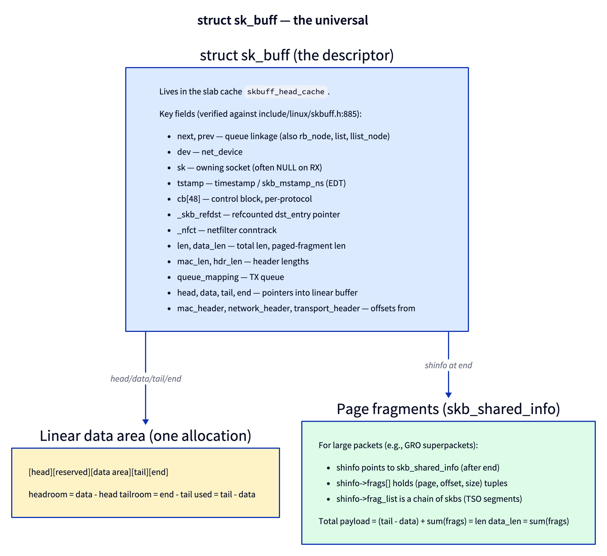
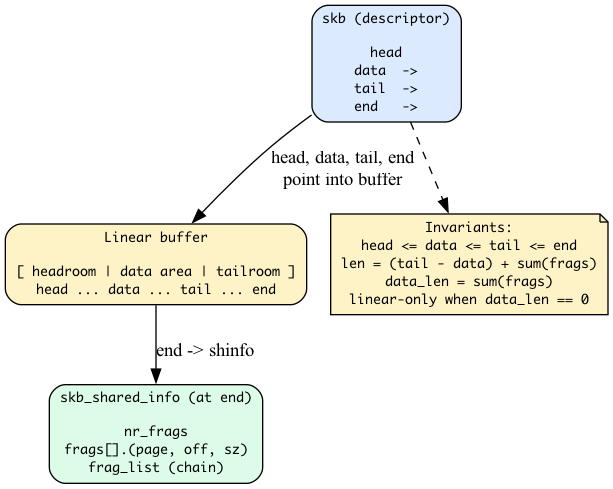
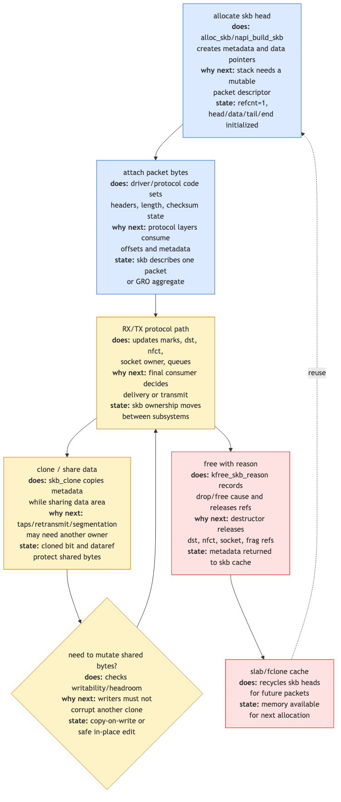

# Day 1 — `struct sk_buff`: the universal packet container

> **Today's mission:** understand the most-touched data structure in Linux networking. Learn its anatomy, lifecycle, and the layout games it plays. Total time: ~75 minutes.

> **Phase 1 starts here.** Days 1–5 cover the foundations: sk_buff, the RX/TX paths, NAPI, segmentation offloads, network namespaces. By Day 5, you'll be able to read the kernel's RX path top-to-bottom without losing the thread.

## Why sk_buff matters more than any other structure

Every packet that crosses any layer of the kernel network stack rides in an `sk_buff`. RX from the NIC, TX to the wire, packet filtering, routing, encapsulation, segmentation — all operate on this structure. Knowing how it works is the difference between reading kernel networking code fluently and getting lost two function calls deep.

The structure lives at **`include/linux/skbuff.h`** (line 885 in 7.x) and the implementation at **`net/core/skbuff.c`** (~7000 lines as of 7.x — about 80% of the file is utility functions).



## The descriptor and the data

The `sk_buff` itself is a *descriptor*. The packet bytes live elsewhere — in a separately-allocated linear buffer plus, optionally, a tail of page fragments.



Four pointers in `sk_buff` define the linear region:

- `head` — start of the allocation. Doesn't move after creation.
- `data` — first valid byte of the current header view. Moves as you push/pull headers.
- `tail` — one past the last valid byte.
- `end` — the boundary; `skb_shared_info` lives here.

The invariants:
- `head ≤ data ≤ tail ≤ end`
- `headroom = data - head`, `tailroom = end - tail`
- For linear-only skbs, `len == tail - data` and `data_len == 0`.

When the kernel pushes an outer header (e.g., adding an IP header to encapsulate), it does `skb_push(skb, header_len)` — which decrements `data`. Headroom shrinks; the prepended bytes are now part of the packet. The opposite is `skb_pull` — increment `data`, used when stripping a header you've already processed.

## Page fragments — for big packets and zero-copy

Many real packets — especially large outbound ones from `sendfile()` or large GRO inbounds — don't fit in one allocation. The kernel uses `skb_shared_info` (placed right after the linear buffer's `end`) to chain page fragments:

```c
struct skb_shared_info {
    __u8 nr_frags;
    skb_frag_t frags[MAX_SKB_FRAGS];   /* (page, offset, size) tuples */
    struct sk_buff *frag_list;         /* chain of skbs (TSO) */
    /* ... */
};
```

`data_len` holds the byte count in fragments. `len = (tail - data) + data_len`. Most code uses helpers (`skb_frag_size`, `skb_frag_page`) rather than touching the fields directly.

> ### There are no Dumb Questions
>
> **Q: Why isn't the linear buffer just always big enough?**
>
> A: Because each skb potentially allocates its linear buffer at packet receive. For 64-byte ACKs that don't carry payload, a 1500-byte allocation would waste memory. For 64KB GRO superpackets, a 64KB linear buffer is impractical (kmalloc max-order limits, fragmentation pressure). The split design lets the kernel allocate just enough for headers linearly and use page fragments for payload.
>
> **Q: What's the cb[48] for?**
>
> A: It's a per-packet scratchpad. Each protocol layer can stash state there. TCP uses `TCP_SKB_CB(skb)` to keep sequence numbers, flags, and SACK info. The kernel zeroes it across `skb_clone` if you don't explicitly preserve it. 48 bytes is generous — most layers use a fraction.
>
> **Q: How big is a fresh sk_buff descriptor?**
>
> A: Around 256 bytes on x86_64 (verify: `pahole sk_buff` in your build directory after compiling). The structure has been carefully cache-line-aligned and the fields ordered for hot/cold separation. Read the comments around the field declarations to see what's "RX hot" vs "TX hot."

## sk_buff lifecycle: cradle to grave



**Allocation paths** (all in `net/core/skbuff.c`):

- `__alloc_skb(size, gfp_mask, flags, node)` — the workhorse. Allocates from `net_hotdata.skbuff_fclone_cache` (when `SKB_ALLOC_FCLONE` is set, useful for skbs you'll clone) or the default `skbuff_head_cache`. Then allocates the linear buffer separately.
- `__netdev_alloc_skb(dev, len, gfp_mask)` — drivers' RX-side allocator. Adds `NET_SKB_PAD` headroom for cheap header insertion.
- `napi_alloc_skb(napi, len)` — NAPI fast-path allocator with per-CPU caching.
- `build_skb(data, frag_size)` / `slab_build_skb(data)` — wrap a *pre-existing* buffer (driver's preallocated page) into an skb. Zero-copy receive path.

**Cloning paths**:

- `skb_clone(skb, gfp)` — shares the linear buffer (refcount on shared_info), copies the descriptor. Used heavily in packet socket and netfilter LOG.
- `skb_copy(skb, gfp)` — full copy of both descriptor and data. Slower; only when you must mutate.
- `pskb_copy(skb, gfp)` — copies the linear part but shares fragments.

**Free paths**:

- `kfree_skb(skb)` — the standard release. Decrements refcounts; frees data if last reference.
- `kfree_skb_reason(skb, reason)` — newer; takes a `enum skb_drop_reason` so the kernel's drop monitor can attribute the drop. **Always prefer this** in new code. The reason enum is in `include/net/dropreason-core.h`.
- `consume_skb(skb)` — same as `kfree_skb` but doesn't trigger drop tracepoints (used for "successful" disposals).

## Today's experiment

You don't write code today. You inspect what's already running.

### See sk_buff allocations live

```bash
sudo bpftrace -e 'kprobe:__alloc_skb { @[comm, kstack] = count(); } interval:s:5 { exit(); }' | head -50
```

5 seconds of skb allocations grouped by caller. You'll see drivers and protocol layers calling in.

### Watch drops with reasons

```bash
sudo perf trace --no-syscalls -e skb:kfree_skb -- sleep 5
```

Output shows where in the kernel each dropped skb was disposed of, plus the drop reason if `kfree_skb_reason` was used.

### Inspect skb size on your build

```bash
cd ~/code/linux
# After building once:
pahole include/linux/skbuff.h | grep -A 50 "struct sk_buff "
```

Reveals the size, padding, and field-by-field layout. Note how `next, prev, dev, sk` are at the top — that's the cache-hot section that the RX path touches first.

### Trace a packet's headroom journey

```bash
sudo bpftrace -e '
fentry:ip_rcv { @h[comm] = lhist(skb->data - skb->head, 0, 256, 16); }
interval:s:5 { exit; }'
```

Histogram of headroom on packets entering `ip_rcv`. You'll see most packets have ~64 bytes of headroom (NET_SKB_PAD).

---

## What to read in the kernel

- **`include/linux/skbuff.h`** — `struct sk_buff` definition (line 885). Read the field comments. Then look at the helpers (`skb_push`, `skb_pull`, `skb_reserve`, `skb_put`).
- **`net/core/skbuff.c`** — `__alloc_skb` (line 672), `__build_skb` (line 454), `kfree_skb_reason`, `skb_clone`. ~7000 lines total, but the allocation path is < 100 lines.
- **`include/linux/skbuff_ref.h`** — refcount helpers; quick read.
- **`include/net/dropreason-core.h`** — the `enum skb_drop_reason` list (~150 reasons in 7.x). Skim. This is what you'll see in `perf trace`.
- **`Documentation/networking/skbuff.rst`** — the official reference. One-time read.

---

## What to break (or rather: what to observe)

### Observation 1 — Different headrooms by allocator

Compare allocator-default headroom values:

- `alloc_skb`: 0 (no implicit reservation)
- `netdev_alloc_skb`: `NET_SKB_PAD` (typically 64)
- `dev_alloc_skb`: same as above

Check `include/linux/skbuff.h` for `NET_SKB_PAD`. Some drivers reserve more for crypto offload.

### Observation 2 — Clone share-counting

Run something that takes a packet socket capture (`tcpdump`):

```bash
sudo tcpdump -i any -c 0 &
```

Then trace `skb_clone`:

```bash
sudo bpftrace -e 'fentry:skb_clone { @[kstack] = count(); } interval:s:5 { exit; }' | head -30
```

You'll see `skb_clone` fires on every packet because the packet capture path clones each one. This is why `tcpdump` adds measurable overhead at high rates.

### Observation 3 — Drop reason histogram

```bash
sudo perf trace --no-syscalls -e skb:kfree_skb 2>&1 | awk '{print $NF}' | sort | uniq -c | sort -rn | head
```

5 most common drop reasons on your idle system. Likely: `NOT_SPECIFIED` (legacy `kfree_skb` callers), `SOCKET_FILTER` (BPF socket filters dropping), `IP_INADDRERRORS` (ARP failures).

---

## Bullet Points

- **`sk_buff`** is the descriptor; data lives in a linear buffer + optional page fragments.
- Pointer invariant: `head ≤ data ≤ tail ≤ end`. `headroom`, `tailroom`, `len`, `data_len`.
- **`cb[48]`** is the per-packet scratchpad each protocol layer uses.
- Allocate via **`__alloc_skb`** / **`napi_alloc_skb`** / **`build_skb`**; free via **`kfree_skb_reason`**.
- **`skb_clone`** shares data; **`skb_copy`** duplicates everything.
- **`enum skb_drop_reason`** is the new-and-required way to attribute drops.
- The structure is large (~256 bytes); fields are cache-line ordered; read the comments.

---

## Check question

You receive a packet at the NIC. The driver allocates an skb via `napi_alloc_skb(napi, 1500)`. The packet is 100 bytes of Ethernet + IP + TCP. Walk through what the four pointers (`head`, `data`, `tail`, `end`) look like just after the driver finishes setup but before `ip_rcv` runs.

<details>
<summary>Click to reveal answer</summary>

**Answer:** `head` points at the start of the linear allocation. `data` points at the start of the Ethernet header (driver placed bytes there after reserving `NET_SKB_PAD = 64` bytes of headroom). `tail` points at byte 100 past `data` (the packet bytes). `end` is at the linear buffer's end (1500 + alignment). So: `headroom = 64`, `len = 100`, `data_len = 0`, `tailroom = ~1400`. By the time `ip_rcv` runs, `eth_type_trans` has advanced `data` past the Ethernet header (adjusting `mac_header` etc.), so `data` now points at the IP header.

</details>

---

## Tomorrow

Day 2: the RX path. NAPI poll → driver → `__netif_receive_skb` → `ip_rcv`. We trace a packet through every stage and see where each `skb_*` helper gets called.
