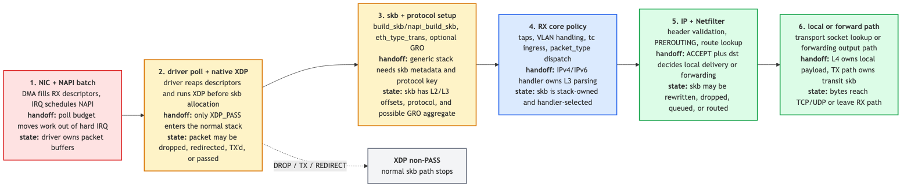
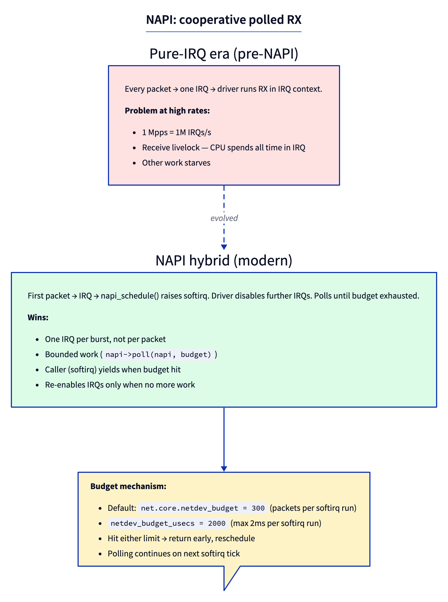
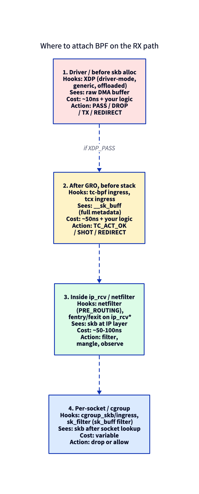

# Day 2 — The RX path: from wire to `ip_rcv`

> **Today's mission:** trace a packet from the moment it hits the NIC to the moment it enters `ip_rcv`. See every step. Total time: ~75 minutes.

## The journey at a glance



Every received packet on a typical Linux box traverses a sequence of handoffs. Hardware DMAs the frame into kernel-owned RX memory, the IRQ only schedules work, NAPI polls the driver under a budget, native XDP can decide before an skb exists, `XDP_PASS` becomes an `sk_buff`, GRO may coalesce related TCP segments, and the core stack dispatches the packet to the right L3 protocol handler.

We'll walk this in stages, each anchored to a specific file/function in your `~/code/linux` checkout (line numbers from kernel 7.1).

## Stage 1: NIC → IRQ → softirq

Modern NICs use **interrupt coalescing**: several packets per IRQ, configurable via `ethtool -c`. When the IRQ fires, the driver doesn't process packets in IRQ context. Instead it calls `napi_schedule()` (or `__napi_schedule_irqoff` on the hot path), which:

1. Disables further IRQs from this NIC.
2. Adds the napi to a per-CPU `poll_list`.
3. Raises `NET_RX_SOFTIRQ`.

The softirq runs `net_rx_action` (`net/core/dev.c`), which iterates the per-CPU poll list, calling each napi's `poll` function with a budget.



The softirq dispatch loop is `net_rx_action` in `net/core/dev.c:7914`; the per-NAPI dispatch call is at `dev.c:7953`:
```c
n = list_first_entry(&list, struct napi_struct, poll_list);
budget -= napi_poll(n, &repoll);
```

The core `napi_poll` wrapper (`net/core/dev.c`) invokes the driver's registered `->poll` (e.g. `e1000_clean`, `mlx5e_napi_poll`), which in turn call RX helpers like `e1000_clean_rx_irq` / `mlx5e_poll_rx_cq`. The budget caps how many packets one softirq run can process — default 300 from `net.core.netdev_budget`.

## Stage 2: Driver → native XDP → skb → GRO

Inside the driver's poll, for each completed RX descriptor:

1. **Build an `xdp_buff` view of the DMA buffer.** Native XDP runs while the packet is still just bytes in driver-owned RX memory — no `sk_buff` has been allocated yet.
2. **Call XDP** if attached. `XDP_DROP`, `XDP_TX`, and `XDP_REDIRECT` consume the packet at the driver/XDP layer. Only `XDP_PASS` says, "turn this into a normal kernel packet."
3. **Wrap the DMA buffer in an skb.** Modern drivers use `build_skb` or `napi_build_skb` after `XDP_PASS` (zero-copy of payload — the driver already DMAed bytes into a page; the skb's `head/data/tail` point at it). Generic XDP is the exception: it runs later on an already-created skb in `net/core/dev.c`.
4. **Set `skb->protocol`** via `eth_type_trans` (strips the Ethernet header from `data`, advances `mac_header`).
5. **Pass to GRO**: the driver calls `napi_gro_receive(napi, skb)`, a `static inline` in `include/linux/netdevice.h` that funnels into `gro_receive_skb` (and `dev_gro_receive`) on the `napi->gro` accumulator.

GRO (Generic Receive Offload) tries to merge consecutive segments of the same flow into one big skb before the stack sees it. A 64KB GRO superpacket means one trip up the stack instead of 40-something. Code: `net/core/gro.c`. Look at `dev_gro_receive` (the workhorse), the exported `gro_receive_skb`, and the per-protocol callbacks (`tcp4_gro_receive`). Note `napi_gro_receive` itself is a `static inline` in `include/linux/netdevice.h`, so it is not fentry-traceable — attach to `gro_receive_skb` instead.

## Stage 3: GRO → `netif_receive_skb` → `__netif_receive_skb_core`

When NAPI's poll budget is exhausted (or `gro_normal_one` is called), accumulated GRO superpackets are flushed via `netif_receive_skb`:

```c
int netif_receive_skb(struct sk_buff *skb)        // net/core/dev.c:6454
```

Which calls into:

```c
static int __netif_receive_skb_core(struct sk_buff **pskb, bool pfmemalloc,
                                    struct packet_type **ppt_prev)  // line 5972
```

This is the function that does most of the work:

- **VLAN/ingress hook handling** (`__skb_push` to re-add VLAN if hardware-stripped).
- **Calls each registered `packet_type`** (the linked list of protocol receivers — `tcpdump`'s AF_PACKET socket, AF_BRIDGE, etc.).
- **tc ingress hooks** run here (`tcx`/`tc-bpf` ingress).
- **`pt_prev->func()`** dispatches to the L3 protocol handler.

For IPv4 packets, `pt_prev->func` is `ip_rcv` — registered statically in `net/ipv4/af_inet.c` as `static struct packet_type ip_packet_type`.

## Stage 4: `ip_rcv` and netfilter

```c
int ip_rcv(struct sk_buff *skb, struct net_device *dev,
           struct packet_type *pt, struct net_device *orig_dev)  // net/ipv4/ip_input.c:603
{
    struct net *net = dev_net(dev);
    skb = ip_rcv_core(skb, net);
    if (skb == NULL)
        return NET_RX_DROP;
    return NF_HOOK(NFPROTO_IPV4, NF_INET_PRE_ROUTING,
                   net, NULL, skb, dev, NULL,
                   ip_rcv_finish);
}
```

`ip_rcv_core` does sanity checks (IP header length, version, checksum if not hw-validated) and trims the skb to the IP header's claimed `tot_len`. Then **`NF_HOOK(NFPROTO_IPV4, NF_INET_PRE_ROUTING, ...)`** runs all netfilter chains on PREROUTING (this is where iptables/nftables/conntrack get involved). Day 20 covers netfilter in detail.

If the hooks pass the skb, **`ip_rcv_finish`** is called. It does the route lookup (`ip_route_input_noref` → FIB lookup) and then either `dst_input(skb)` (which calls `ip_local_deliver` for local sockets, or `ip_forward` for routed traffic).

## Where BPF can attach



The kernel exposes BPF hook points at four positions along the RX path: XDP at the driver, tcx at `netif_receive_skb_core`, fentry on `ip_rcv` itself, cgroup_skb after socket lookup. We won't write any BPF today — this map is here so the attach points have a clear place in *this* path. Today's labs use one-liner BPF tools (`bpftrace`) only as an inspection mechanism, not for authoring.

## Today's experiment

Trace a real packet's path.

### Use ftrace to see the call chain

`trace-cmd` is not installed by default — `sudo apt-get install -y trace-cmd` (it needs
`CONFIG_FUNCTION_GRAPH_TRACER`, on by default in typical kernels). This needs **two terminals**: the
recorder blocks for 5 seconds, and you must fire the packet *during* that window.

In terminal 1, start recording:

```bash
sudo trace-cmd record -p function_graph \
    -g netif_receive_skb \
    -e net:netif_receive_skb \
    -O nofuncgraph-overhead \
    -O funcgraph-tail \
    sleep 5
```

In terminal 2, within those 5 seconds, generate one packet:

```bash
ping -c 1 8.8.8.8
```

After the recorder exits, render the trace:

```bash
sudo trace-cmd report | head -100
```

You'll see the function-call tree: `netif_receive_skb` → `__netif_receive_skb_one_core` → `__netif_receive_skb_core` → `deliver_skb` → `ip_rcv` → `ip_rcv_core` → `nf_hook_slow` → `ip_rcv_finish` → `ip_local_deliver` → `icmp_rcv`. The leaf is `icmp_rcv` because a `ping` echo reply is an ICMP packet — `icmp_rcv` then calls `icmp_echo`. (Trigger a TCP flow instead — e.g. `curl -s http://example.com >/dev/null` — and the leaf becomes `tcp_v4_rcv`.)

### Or use BPF for a custom view

```bash
sudo bpftrace -e '
fentry:ip_rcv { @ip[args->skb->dev->name] = count(); }
fentry:tcp_v4_rcv { @tcp[args->skb->dev->name] = count(); }
fentry:udp_rcv { @udp[args->skb->dev->name] = count(); }
interval:s:6 { exit(); }' &

# Generate receives during the window, then let it exit:
ping -c 5 -i 0.3 8.8.8.8 >/dev/null; curl -s http://example.com >/dev/null
wait
```

Per-protocol receive counts per interface. Typical output:

```
@ip[lo]: 4
@tcp[eth0]: 21
@udp[eth0]: 2
@udp[lo]: 4
```

`@tcp`/`@udp` are the reliable signal. **Note the `@ip` map:** on many virtual NICs (cloud/virtio)
`fentry:ip_rcv` attaches but never fires for the physical interface — you'll see only `@ip[lo]` (or
nothing) even with `eth0` traffic flowing. That's a tracing-environment quirk, not a missing-packet
problem; trust `@tcp[eth0]`/`@udp[eth0]` to confirm receives are happening.

### Inspect the per-CPU RX state

```bash
cat /proc/net/softnet_stat
```

One line per CPU. Every field is a 32-bit counter printed in **hexadecimal** (zero-padded `%08x`) with
**no header line** — don't read the values as decimal. In order the columns are: packets processed,
dropped, `time_squeeze` (budget exhaustions), then several zeros, with `cpu_collision`/`received_rps`
near the end (exact trailing columns are kernel-version-dependent). Convert one to decimal with
`printf '%d\n' 0x<value>`. High `time_squeeze` means your `netdev_budget` is too small.

Adjust the budget. **Set** it (in its own step, so you can observe the box running at the new value):

```bash
old_budget=$(cat /proc/sys/net/core/netdev_budget)
echo 600 | sudo tee /proc/sys/net/core/netdev_budget
cat /proc/sys/net/core/netdev_budget   # confirm it changed
```

Then, under **sustained RX load** (e.g. `iperf3 -c <host> -P 16` from another box, or a packet flood),
re-read `/proc/net/softnet_stat` repeatedly and watch the `time_squeeze` column. Be honest with
yourself about what you'll see: **on an idle host `time_squeeze` never moves** — it only increments when
a softirq actually exhausts its budget under heavy receive load, and even under load it can stay flat on
fast CPUs / multi-queue NICs. A non-moving counter is normal, not a sign the change failed (you already
confirmed the change with the `cat` above).

**Restore** the original budget so the host isn't left with changed RX scheduling behavior:

```bash
echo "$old_budget" | sudo tee /proc/sys/net/core/netdev_budget
```

---

## What to read in the kernel

- **`net/core/dev.c`** — the central RX dispatch.
  - `__napi_poll` (line 7719) — softirq's per-NAPI poll loop.
  - `__netif_receive_skb_core` (line 5972) — the workhorse.
  - `netif_receive_skb` (line 6454) — entry from drivers/GRO.
- **`net/core/gro.c`** — GRO machinery. Read `dev_gro_receive`, `gro_receive_skb`, `gro_list_prepare`, `gro_complete`. (`napi_gro_receive` is a `static inline` in `netdevice.h`, not here.)
- **`net/ipv4/ip_input.c`** — IPv4 receive.
  - `ip_rcv` (line 603), `ip_rcv_core` (line 499), `ip_rcv_finish` (line 478), `ip_local_deliver` (line 250).
- **`net/ipv4/af_inet.c`** — search `ip_packet_type`, see how `ip_rcv` is registered.
- **`include/linux/netdevice.h`** — `struct napi_struct`, `struct net_device`'s rx-related fields.

---

## Bullet Points

- **NAPI** turns IRQ floods into one IRQ per burst + softirq polling. Budget-capped to prevent CPU starvation.
- The softirq loop is in **`net_rx_action`**; per-NAPI dispatch via `napi->poll`.
- **Native XDP** runs before skb allocation; `XDP_PASS` is the handoff that lets the driver build an skb for the normal stack.
- **`build_skb`** wraps a pre-existing DMA buffer into an skb (zero-copy receive).
- **GRO** (`net/core/gro.c`) coalesces consecutive same-flow segments before the stack sees them.
- The single most-touched RX function is **`__netif_receive_skb_core`** at `net/core/dev.c:5972`.
- **`ip_rcv`** is registered as a `packet_type` in `net/ipv4/af_inet.c` and dispatched from `__netif_receive_skb_core`.
- After `ip_rcv` → netfilter PREROUTING → `ip_rcv_finish` → routing → `ip_local_deliver` or `ip_forward`.

---

## Check question

Why does the kernel run softirqs (and thus most of the RX path) outside of hardware IRQ context?

<details>
<summary>Click to reveal answer</summary>

**Answer:** Hardware IRQ context has strict constraints: it preempts the running task, runs with limited stack, blocks other IRQs at the same priority, and cannot sleep. Doing the full RX path (route lookup, BPF programs, conntrack, packet delivery) in IRQ context would (1) starve other CPU work — receive livelock under high traffic; (2) impose a tight time budget that complex paths can't meet; (3) force every helper called from the RX path to be IRQ-safe. Softirqs run at a slightly higher priority than user threads but lower than IRQs, with their own per-CPU stack, and can be preempted by IRQs. NAPI splits the RX work: IRQ just signals "more work"; softirq does the actual processing under a budget.

</details>

---

## Tomorrow

Day 3: the TX path. From `sendmsg` to the wire. Socket buffer accounting, queue disciplines, the driver's `ndo_start_xmit`.
