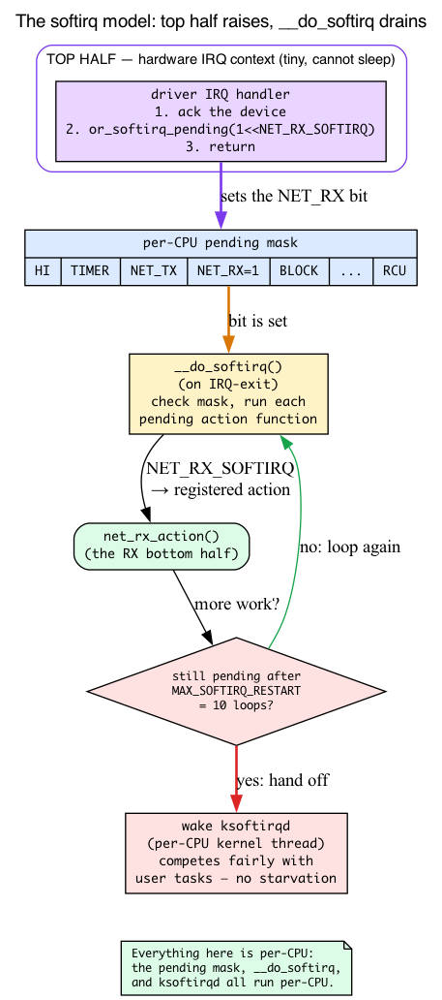
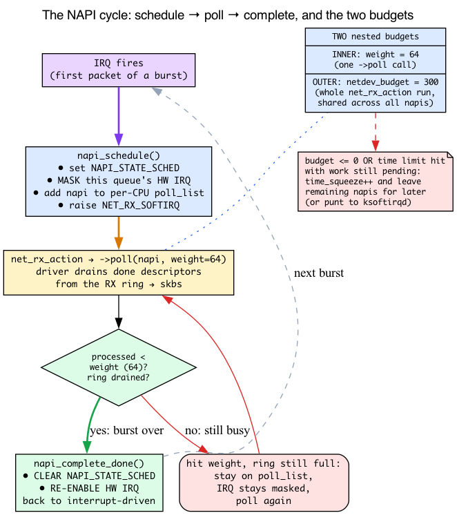
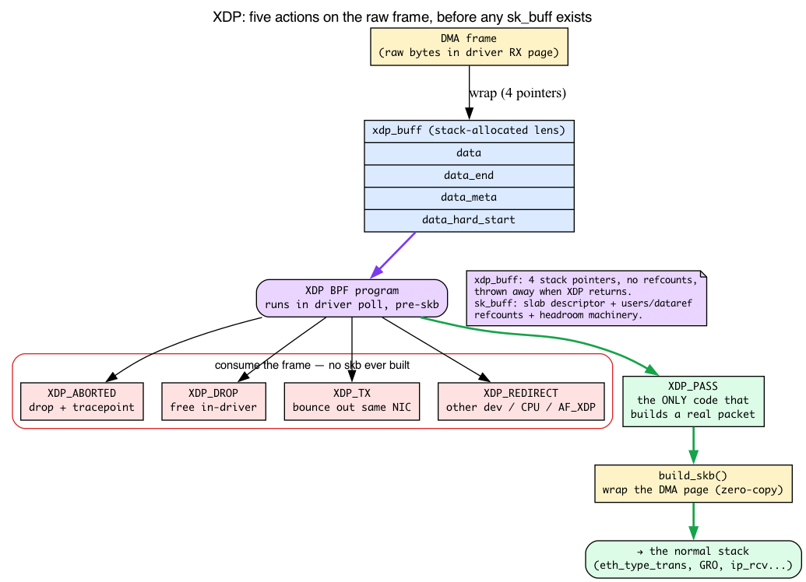
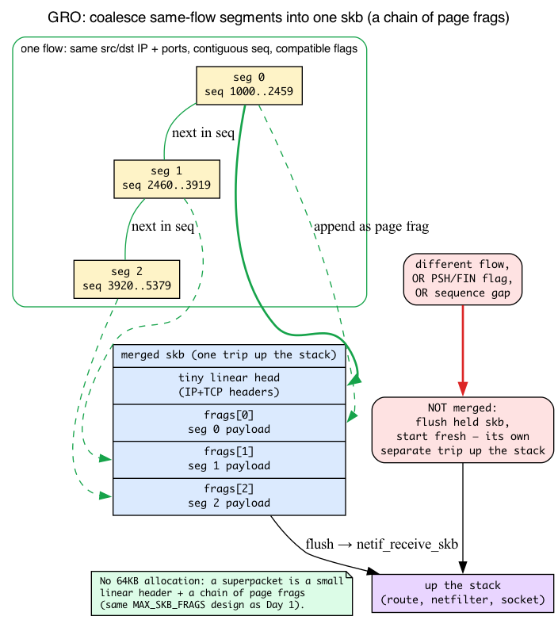
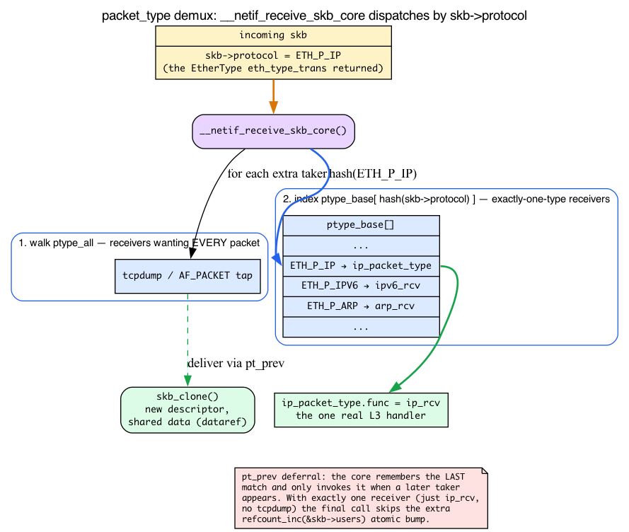
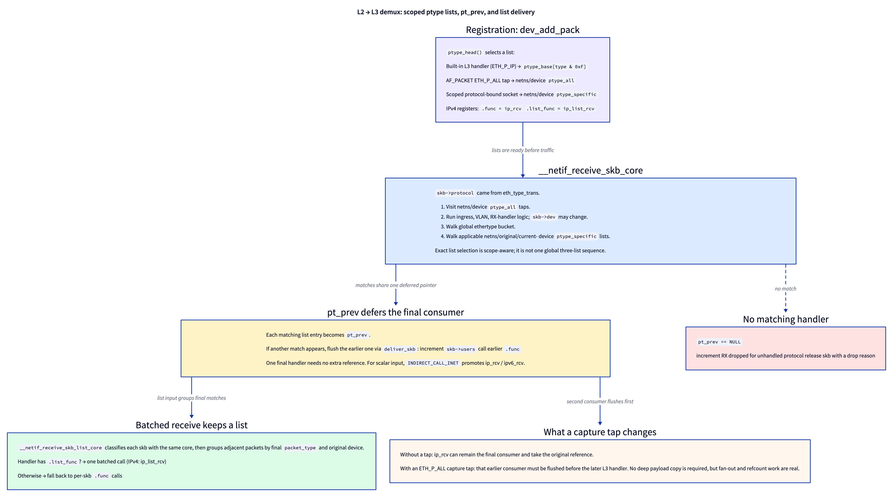

# Day 2 — The RX path: from wire to `ip_rcv`

> **Today's mission:** trace a packet from the moment it hits the NIC to the moment it enters `ip_rcv`. See every step — and learn the five mechanisms the path is built on (softirqs, NAPI, XDP, GRO, packet_type demux) so nothing along the way is a black box. Total time: ~110 minutes.

## The journey at a glance


Every received packet on a typical Linux box traverses a sequence of handoffs. Hardware DMAs the frame into kernel-owned RX memory, the IRQ only schedules work, NAPI polls the driver under a budget, native XDP can decide before an skb exists, `XDP_PASS` becomes an `sk_buff`, GRO may coalesce related TCP segments, and the core stack dispatches the packet to the right L3 protocol handler.

That sentence names five things that this whole chapter leans on but that you've never been formally taught: a *softirq*, the *NAPI* state machine, *XDP*, the *GRO* accumulator, and *packet_type* demultiplexing. Day 1 forward-referenced all of them but taught none. So before we walk the path, we'll teach each one — intuition first, then the concrete v7.1 struct or function — and only *then* trace the packet, with every stage resting on something you already understand.

We'll anchor everything to a specific file/function in your `~/code/linux` checkout (line numbers from kernel 7.1).

> Two things from Day 1 are load-bearing today and will **not** be re-taught:
> - **The RX descriptor ring + DMA.** Recall from Day 1 — the NIC's DMA engine writes each frame into a pre-allocated page named by an RX-ring descriptor and flips a DONE bit; the driver's NAPI poll drains those done descriptors. The bytes are in RAM before the CPU runs.
> - **`build_skb` zero-copy wrap.** `build_skb` wraps that already-filled DMA page (`head_frag = 1`) instead of copying it, giving zero-copy receive. We met it in Day 1's lifecycle section.

---

## Background 1: What a softirq actually is

The whole RX path runs in a *softirq*. Before we can say "the IRQ raises `NET_RX_SOFTIRQ` and the softirq runs `net_rx_action`," you need to know what that machinery *is*.

### The problem: a hardware IRQ handler must be tiny

When a NIC raises an interrupt, the CPU **drops whatever it was doing** and jumps to the driver's IRQ handler. That handler runs in a brutally constrained world:

- It **preempts** the currently-running task (which never agreed to be interrupted).
- It runs on a small, dedicated **IRQ stack**.
- It **cannot sleep** — no blocking allocations, no waiting on locks that might sleep.
- It runs with interrupts of the same priority **masked**, so while it runs, other devices at that level are stalled.

Doing the full receive path — route lookup, netfilter, BPF, delivering to a socket — inside that handler would be a disaster: it would stall the machine and starve everything else. So Linux splits interrupt work into two halves:

- The **top half** is the actual hardware IRQ handler. It does the absolute minimum: acknowledge the device and **schedule deferred work**. Then it returns.
- The **bottom half** is that deferred work, run later in a relaxed context where it's allowed to take its time.

A **softirq** is Linux's primary bottom-half mechanism.

### What "softirq" means concretely

A softirq is a **statically-defined, per-CPU bottom half.** "Statically defined" matters: there is a fixed, small enum of softirq vectors compiled into the kernel — you cannot create one at runtime. Here is the entire list (`include/linux/interrupt.h:550`):

```c
enum
{
    HI_SOFTIRQ=0,
    TIMER_SOFTIRQ,
    NET_TX_SOFTIRQ,
    NET_RX_SOFTIRQ,
    BLOCK_SOFTIRQ,
    IRQ_POLL_SOFTIRQ,
    TASKLET_SOFTIRQ,
    SCHED_SOFTIRQ,
    HRTIMER_SOFTIRQ,
    RCU_SOFTIRQ,    /* Preferable RCU should always be the last softirq */
    NR_SOFTIRQS
};
```

Networking owns two of them: **`NET_RX_SOFTIRQ`** (receive) and **`NET_TX_SOFTIRQ`** (transmit). Each vector has one **action function** registered at boot via `open_softirq()` (`kernel/softirq.c:806`). The networking subsystem registers its two in `net/core/dev.c`:

```c
open_softirq(NET_TX_SOFTIRQ, net_tx_action);   // net/core/dev.c:13288
open_softirq(NET_RX_SOFTIRQ, net_rx_action);   // net/core/dev.c:13289
```

So `net_rx_action` is *the* receive bottom half. The rest of today is mostly the story of what `net_rx_action` does.

### Raising vs. running — they are not the same

Here's the subtlety that trips people up. "Raising" a softirq does **not** run anything. It just sets a per-CPU **pending bit**. The hot-path raise is `raise_softirq_irqoff` (`kernel/softirq.c:773`) → `__raise_softirq_irqoff` (`:799`), which does exactly one meaningful thing:

```c
or_softirq_pending(1UL << nr);   // kernel/softirq.c:803
```

That's it — OR a bit into this CPU's pending mask. The actual *draining* happens elsewhere: `__do_softirq` (`kernel/softirq.c:654`) checks the pending mask and runs each pending vector's action function. It's invoked on IRQ-exit (right after the top half returns) and from a few other points. So the top half "raises" (sets the bit and returns); moments later, on the way out of interrupt context, `__do_softirq` notices the bit and calls `net_rx_action`.

### Why a packet flood can't freeze your shell: ksoftirqd

Softirqs run at higher priority than user threads — so what stops an endless packet flood from making `__do_softirq` loop forever and starving your login shell? A safety valve. `__do_softirq` will restart processing at most **`MAX_SOFTIRQ_RESTART` = 10** times (`kernel/softirq.c:544`). If softirqs are *still* pending after that, it gives up and **wakes a per-CPU kernel thread, `ksoftirqd`** (`run_ksoftirqd`, `kernel/softirq.c:1068`), to finish the work as a normal schedulable thread. That thread competes fairly with user tasks, so softirq work can be intense but can never *indefinitely* lock out user space. This hand-off is the concrete meaning of "softirqs are lower priority than hardware IRQs but a notch above user threads."

### Per-CPU is the through-line

Notice the recurring word: **per-CPU.** Each CPU has its own pending mask, runs its own `__do_softirq`, and has its own `ksoftirqd`. This is *why* everything downstream is per-CPU too — the `poll_list` NAPI uses, the `softnet_data` struct, the `/proc/net/softnet_stat` counters. When you see "per-CPU" later, it traces straight back to here.



---

## Background 2: NAPI and the two budgets

You'll constantly read "`napi_schedule`," "`poll_list`," and "the poll function processes packets under a budget." Time to make those real — and to kill a common confusion: there are **two different budgets**, not one.

### The NAPI idea: stop interrupting, start polling

A 10/40/100-Gbit NIC under load can raise *millions* of interrupts per second. Even with a tiny top half, that's death by a thousand cuts — the IRQ overhead alone melts a CPU ("receive livelock"). NAPI ("New API," though it's been the API for ~20 years) fixes this with a trade: at the first packet, **mask the device's RX interrupt and switch to polling.** The kernel then repeatedly asks the driver "got more?" until the ring drains, and only *then* re-enables the interrupt. One IRQ per *burst*, instead of one per packet.

### `struct napi_struct`: the per-queue polling context

Each NIC receive queue registers a `struct napi_struct` — the context that ties a driver's poll routine to the core's polling loop (`include/linux/netdevice.h:381`):

```c
struct napi_struct {
    unsigned long       state;       /* NAPI_STATE_SCHED bit lives here */
    struct list_head    poll_list;   /* links onto the per-CPU poll_list */
    int                 weight;      /* per-poll packet cap (default 64) */
    int                 (*poll)(struct napi_struct *, int);  /* driver callback */
    struct net_device   *dev;
    struct sk_buff      *skb;
    struct gro_node     gro;         /* the GRO accumulator (Background 4) */
    /* ... timers, ids, control-path fields ... */
};
```

The four fields that matter today: **`state`** (holds the `NAPI_STATE_SCHED` bit — "I'm scheduled to be polled"), **`poll_list`** (the list node that hangs this napi off the per-CPU poll list), **`weight`** (the per-poll budget — more below), and **`poll`** (the driver's drain routine, e.g. `e1000_clean`, `mlx5e_napi_poll`).

### The schedule → poll → complete cycle

Here is the full loop. Follow the `NAPI_STATE_SCHED` bit and the hardware IRQ as they flip:

1. **IRQ fires.** The driver's top half calls `napi_schedule` (or `__napi_schedule_irqoff` on the hot path). Its first step, `napi_schedule_prep` (`net/core/dev.c:6736`), atomically sets `NAPI_STATE_SCHED` (and sets `NAPI_STATE_MISSED` if `SCHED` was already set). Then `____napi_schedule` (`net/core/dev.c:4957`) adds the napi to this CPU's poll list —

   ```c
   list_add_tail(&napi->poll_list, &sd->poll_list);   // net/core/dev.c:4984
   ...
   raise_softirq_irqoff(NET_RX_SOFTIRQ);              // net/core/dev.c:4990
   ```

   — and raises `NET_RX_SOFTIRQ` (there's the Background-1 mechanism). The driver *also masks its own RX interrupt* at this point. From now until step 3, this queue generates no IRQs.

2. **Softirq runs `net_rx_action`**, which walks the poll list and calls each napi's `->poll(napi, weight)`. The driver drains done descriptors from the ring (the Day-1 ring), turning each into an skb.

3. **Ring drained below `weight`.** When the driver finds fewer packets than its weight, it knows the burst is over and calls `napi_complete_done` (`net/core/dev.c:6771`). That **clears `NAPI_STATE_SCHED`** and **returns `true` to tell the driver the burst is over**; the *driver* then **re-enables its hardware RX interrupt** (e.g. `if (napi_complete_done(napi, work)) <write the device's IRQ-enable register>`). Back to interrupt-driven mode until the next packet.

This is the exact mechanism behind "one IRQ per burst." If instead the driver hits its weight (ring still full), it does *not* complete — it returns the full weight, stays on the poll list, and gets polled again. The interrupt stays masked while traffic is heavy.

### Two budgets: `weight` (64) vs `netdev_budget` (300)

This is the part everyone conflates. There are two separate caps:

- **`weight`** — caps how many packets **one `->poll` call** may process. It's the value passed *into* `->poll`. Default is **`NAPI_POLL_WEIGHT` = 64** (`include/linux/netdevice.h:2839`). The per-NAPI poll wrapper reads it (`__napi_poll`, `net/core/dev.c:7719`): `weight = n->weight; work = n->poll(n, weight);`.

- **`netdev_budget`** — caps the **total packets across *all* napis** in a single `net_rx_action` softirq run. Default **300** (`net/core/hotdata.c:14`). There's also a time cap, `netdev_budget_usecs` (`net/core/hotdata.c:16`, = 2 jiffies).

So in one softirq run, `net_rx_action` starts with a budget of 300 and spends it across however many queues are pending, where each individual poll call can claim at most 64. The loop (`net/core/dev.c:7914`):

```c
int budget = READ_ONCE(net_hotdata.netdev_budget);   // 300, the OUTER budget
...
n = list_first_entry(&list, struct napi_struct, poll_list);
budget -= napi_poll(n, &repoll);                     // each poll capped at weight=64
```

Picture it as nested limits: the inner ring (one poll) holds 64; the outer ring (one softirq run) holds 300 spread across all queues.

### `time_squeeze` and `softnet_data`

When `net_rx_action` exits the loop because **budget went to zero or the time limit expired** while work was *still pending*, it bumps a counter called **`time_squeeze`** and leaves the remaining napis to be polled in a later softirq (or punted to `ksoftirqd`). That counter is exactly what today's softnet_stat lab watches: a rising `time_squeeze` means receive work is outrunning a single softirq window.

All of this per-CPU bookkeeping lives in **`struct softnet_data`** (`DEFINE_PER_CPU_ALIGNED(struct softnet_data, softnet_data)`, `net/core/dev.c:462`): the `poll_list`, the `processed`/`drop`/`time_squeeze` counters. `/proc/net/softnet_stat` prints one line per CPU straight from these fields (`net/core/net-procfs.c:145`).



---

## Stage 1: NIC → IRQ → softirq

Now Stage 1 reads as plain English. Modern NICs use **interrupt coalescing**: several packets per IRQ, configurable via `ethtool -c`. When the IRQ fires, the driver doesn't process packets in IRQ context (Background 1 told you why it *can't*). Instead its top half calls `napi_schedule()` (or `__napi_schedule_irqoff` on the hot path), which (Background 2):

1. Sets `NAPI_STATE_SCHED` (via `napi_schedule_prep`).
2. Adds the napi to the per-CPU `poll_list`.
3. Raises `NET_RX_SOFTIRQ`.

Separately, the driver masks its own RX interrupt in its IRQ handler (Background 2, step 1) — `napi_schedule` itself touches no hardware.

The softirq runs `net_rx_action` (`net/core/dev.c:7914`), which iterates the per-CPU poll list, calling each napi's `poll` function under the two budgets you just learned (Background 2): the inner `weight` (64) per `->poll` call, and the outer `netdev_budget` (300) across all napis in the run.


The core `napi_poll` wrapper invokes the driver's registered `->poll` (e.g. `e1000_clean`, `mlx5e_napi_poll`), which in turn call RX helpers like `e1000_clean_rx_irq` / `mlx5e_poll_rx_cq`.

---

## Background 3: What XDP is

Stage 2 is built around XDP, and Day 27 covers it in full. But the RX narrative is load-bearing on the basics, so here's just enough to follow the handoff.

**XDP (eXpress Data Path)** is an eBPF program the driver runs on the **raw RX frame, before any `sk_buff` exists** — the earliest possible software hook. Because it runs pre-skb, it can drop or redirect at line rate *without paying the cost of skb allocation* (the slab work and refcount machinery you learned in Day 1). That's the whole point: a DDoS-drop or load-balancer redirect that never even builds a packet object.

What does XDP look at? An **`xdp_buff`** — a lightweight, **stack-allocated** descriptor over the DMA region (`include/net/xdp.h:86`):

```c
struct xdp_buff {
    void *data;            /* first byte of the frame */
    void *data_end;        /* one past the last byte */
    void *data_meta;       /* scratch metadata area */
    void *data_hard_start; /* start of the buffer */
    /* ... */
};
```

Contrast that with the `sk_buff` you spent Day 1 on: no slab allocation, no `users`/`dataref` refcounts, no headroom-reservation machinery — just four pointers into the DMA page. The `xdp_buff` is **thrown away the moment XDP returns.** It's a temporary lens over bytes, not a packet object.

An XDP program returns one of five **action codes** (`enum xdp_action`, `include/uapi/linux/bpf.h:6548`):

```c
enum xdp_action {
    XDP_ABORTED = 0,   /* error path — drop + tracepoint */
    XDP_DROP,          /* free the frame in-driver, no skb ever built */
    XDP_PASS,          /* the ONLY code that proceeds to build an sk_buff */
    XDP_TX,            /* bounce the frame back out the same NIC */
    XDP_REDIRECT,      /* send to another device / CPU / AF_XDP socket */
};
```

`XDP_ABORTED`, `XDP_DROP`, `XDP_TX`, and `XDP_REDIRECT` all **consume the frame** right there — the normal stack never sees it. **`XDP_PASS` is the single code that says "turn this into a real packet"** — only then does the driver build an skb and enter the path the rest of this chapter describes. Stage 2's entire handoff hinges on that one return value.

**Native vs. generic.** *Native* XDP runs inside the driver's poll on the DMA buffer, pre-skb — fast, the design intent. *Generic* XDP (`do_xdp_generic` → `netif_receive_generic_xdp`, `net/core/dev.c:5656`/`:5576`) is a fallback for drivers without native support: it runs later, in the core stack, *after* an skb already exists. It's slower (you've already paid for the skb) — which is why the chapter notes generic XDP "runs later." Full XDP programming, maps, and AF_XDP are Day 27; this is just enough to read the RX handoff.



---

## Stage 2: Driver → native XDP → skb → GRO

Inside the driver's poll, for each completed RX descriptor (recall from Day 1 — the descriptor's DONE bit is set and the frame is already DMA'd into its page):

1. **Build an `xdp_buff` view of the DMA buffer.** Native XDP runs while the packet is still just bytes in driver-owned RX memory — no `sk_buff` has been allocated yet (Background 3).
2. **Call XDP** if attached. `XDP_DROP`, `XDP_TX`, and `XDP_REDIRECT` consume the packet at the driver/XDP layer. Only `XDP_PASS` says, "turn this into a normal kernel packet."
3. **Wrap the DMA buffer in an skb.** After `XDP_PASS`, modern drivers use `build_skb` / `napi_build_skb` (recall from Day 1: zero-copy — the driver already DMAed bytes into a page, so the skb's `head/data/tail` just point at it and `head_frag = 1`). Generic XDP is the exception: it runs later on an already-created skb (`net/core/dev.c:5576`).
4. **Set `skb->protocol`** via `eth_type_trans` (`net/ethernet/eth.c:155`) — it resets `mac_header` to point at the Ethernet header (`skb_reset_mac_header`), pulls the 14-byte Ethernet header off `data` so `data` now points at the L3 header (`eth_skb_pull_mac` → `skb_pull` `ETH_HLEN`), and **returns the EtherType.** Hold that thought: the value it returns becomes the **demux key** in Stage 3.
5. **Pass to GRO**: the driver calls `napi_gro_receive(napi, skb)`, a `static inline` in `include/linux/netdevice.h:4286` that funnels into `gro_receive_skb(&napi->gro, skb)` (and `dev_gro_receive`) on the napi's GRO accumulator. *What GRO merges is the next section (Background 4).*

## Background 4: what GRO merges, and where 64KB lives

GRO (Generic Receive Offload) tries to merge consecutive segments of the same flow into one big skb *before the stack sees it*. A 64KB GRO superpacket means one trip up the stack instead of 40-something — you pay the route lookup, netfilter, and socket delivery **once** instead of per-segment.

Two prerequisites the bare phrase "merge same-flow segments" hides:

- **What counts as "the same flow"?** For GRO it's the L3/L4 identity: matching **src/dst IP, protocol, and TCP ports**, with **in-order, contiguous sequence numbers** and compatible flags. `gro_list_prepare` (`net/core/gro.c:355`) builds the comparison key, and per-protocol callbacks (`tcp4_gro_receive`, `net/ipv4/tcp_offload.c:419`) make the final mergeability call. A packet with mismatched flags (PSH/FIN) or a sequence gap is **not** merged — it flushes the held skb and starts fresh. So GRO is comparing flow identity *and* sequence continuity, not just "two TCP packets."

- **How does 64KB fit without a 64KB allocation?** It doesn't grow a linear buffer — each merged segment's payload is appended as **page fragments** onto the held skb. (Refresher only — this is exactly the linear-head + `MAX_SKB_FRAGS` page-fragment design from Day 1; a 64KB superpacket is a tiny linear header plus a chain of page frags, no contiguous 64KB ever allocated.)

The accumulator is `napi->gro` (a `struct gro_node`, `include/linux/netdevice.h:358`). It **flushes** — handing the assembled skb onward via `netif_receive_skb` — when any of these happen: NAPI budget/weight is exhausted, `gro_normal_one` is called (`net/core/gro.c:299`), a non-mergeable packet arrives, or the GRO flush timeout fires (`__gro_flush`, `net/core/gro.c:324`).

Code to read: `net/core/gro.c` — `dev_gro_receive` (the workhorse, `:474`), the exported `gro_receive_skb`, `gro_list_prepare`, `gro_complete`. **Tracing caveat:** `napi_gro_receive` itself is a `static inline` in `include/linux/netdevice.h` (`:4286`), so it is **not** fentry-traceable — attach to `gro_receive_skb` instead.



---

## Background 5: packet_type demultiplexing

Stage 3 says `__netif_receive_skb_core` "calls each registered `packet_type`" and "`pt_prev->func` dispatches to the L3 handler." To read that you need to know what a `packet_type` is, how the kernel picks `ip_rcv` out of a list, and what the `pt_prev` trick buys.

### A `packet_type` is a registration record

When a protocol wants to receive packets, it registers a `struct packet_type` (`include/linux/netdevice.h:2968`):

```c
struct packet_type {
    __be16  type;        /* EtherType, e.g. htons(ETH_P_IP) — the demux key */
    /* ... */
    int     (*func)(struct sk_buff *, struct net_device *,
                    struct packet_type *, struct net_device *);  /* the callback */
    /* ... */
    struct list_head list;
};
```

It pairs an **EtherType** (`type`) with a **callback** (`func`). IPv4 registers one in `net/ipv4/af_inet.c:1881`:

```c
static struct packet_type ip_packet_type __read_mostly = {
    .type = cpu_to_be16(ETH_P_IP),
    .func = ip_rcv,                  // af_inet.c:1883
};
...
dev_add_pack(&ip_packet_type);       // af_inet.c:2006
```

So `ip_rcv` isn't called by name from the core — it's *looked up* by EtherType. Where does that EtherType come from? **`eth_type_trans` in Stage 2.** It returned the frame's EtherType into `skb->protocol`, and that value is the key the core hashes on now. That's the connection Stage 2 set up.

### Two lists: `ptype_all` and `ptype_base`

The kernel keeps protocol receivers in two structures:

- **`ptype_all`** — receivers that want **every** packet regardless of type. This is how `AF_PACKET` sockets and `tcpdump` tap the path.
- **`ptype_base[]`** — a hash table keyed by EtherType (`net/core/dev.c:172`), where exactly-one-type receivers live: `ip_rcv` (ETH_P_IP), the IPv6 handler, ARP. The bucket is `ptype_base[ntohs(pt->type) & PTYPE_HASH_MASK]` (`net/core/dev.c:608`).

`__netif_receive_skb_core` walks `ptype_all` first (taps), then indexes `ptype_base` by `skb->protocol` to find the one real L3 handler.

### The `pt_prev` deferral trick

Watch how the core dispatches. Instead of calling each matching handler immediately, it remembers the **last** match in a pointer `pt_prev`, and only actually invokes a handler when it discovers a *subsequent* taker exists. The invoke goes through `deliver_skb` (`net/core/dev.c:2485`):

```c
static int deliver_skb(struct sk_buff *skb, struct packet_type *pt_prev,
                       struct net_device *orig_dev)
{
    ...
    refcount_inc(&skb->users);                        // bump the descriptor refcount
    return pt_prev->func(skb, skb->dev, pt_prev, orig_dev);
}
```

Why the indirection? Because `deliver_skb` does a `refcount_inc(&skb->users)` (the **descriptor** refcount from Day 1) for each receiver. In the overwhelmingly common case of **exactly one receiver** (just `ip_rcv`, no tcpdump running), the deferral lets the core call that single handler **without** the extra atomic bump — it knows there's no other taker. This is precisely why Stage 3 dispatches via `pt_prev->func()` rather than calling `ip_rcv` directly.

**Cross-link to Day 1:** when there *are* multiple takers (e.g. tcpdump's `ptype_all` socket **and** `ip_rcv`), `deliver_skb` gives each earlier taker another reference to the **same skb descriptor** by incrementing `skb->users`; it does not call `skb_clone`. The final taker consumes the original reference without that extra atomic increment.



### Scope and batching beyond the global bucket



The two global structures are only the first layer. AF_PACKET adds scoped lists rather than making every socket another global protocol handler. `ETH_P_ALL` capture taps live in the receive network namespace's `ptype_all` list or a device's `ptype_all`; protocol-bound packet sockets can live in namespace/device `ptype_specific` lists. `__netif_receive_skb_core` visits all-protocol taps early, before ingress processing may redirect or change `skb->dev`. After ingress, VLAN, and any RX handler, it walks the global ethertype bucket and then the applicable namespace/original/current-device protocol-specific lists. `ip_rcv` is normally the final match from the global bucket.

The **`pt_prev` deferral spans all of those walks**. `deliver_ptype_list_skb` flushes the previous match with `deliver_skb` only when it discovers a subsequent one; `deliver_skb` increments `skb->users` before invoking that earlier callback. With one matching L3 handler and no tap, the final `pt_prev` reaches `__netif_receive_skb_one_core`, which dispatches it with `INDIRECT_CALL_INET(..., ipv6_rcv, ip_rcv, ...)` and avoids the extra reference operation entirely. Adding an `ETH_P_ALL` capture tap means the tap must be flushed before the later L3 consumer, which is one reason packet capture has measurable cost.

There is also a **list receive path**. IPv4 registers `.list_func = ip_list_rcv` alongside `.func = ip_rcv`. `__netif_receive_skb_list_core` classifies each skb through the same core, groups adjacent packets with the same final `packet_type` and original device, then calls that list callback. Handlers without one fall back to per-skb `.func` calls. The scalar deferral and list batching are two layers of the same optimization: avoid unnecessary references for one consumer, then preserve batches for a consumer that can process them together.

If no handler matches, `pt_prev` remains `NULL`, `dev_core_stats_rx_dropped_inc` records the unhandled protocol, and `kfree_skb_reason` releases the packet.

---

## Stage 3: GRO → `netif_receive_skb` → `__netif_receive_skb_core`

When NAPI's poll budget is exhausted (or `gro_normal_one` is called), accumulated GRO superpackets are flushed via `netif_receive_skb`:

```c
int netif_receive_skb(struct sk_buff *skb)        // net/core/dev.c:6454
```

Which calls into:

```c
static int __netif_receive_skb_core(struct sk_buff **pskb, bool pfmemalloc,
                                    struct packet_type **ppt_prev)  // line 5972
```

This is the function that does most of the work, and with Background 5 in hand every line of it makes sense:

- **VLAN/ingress hook handling** (`__skb_push` to re-add VLAN if hardware-stripped).
- **Calls each registered `packet_type`** — walk `ptype_all` (tcpdump's AF_PACKET socket, AF_BRIDGE, etc.) then the `ptype_base` bucket for `skb->protocol`.
- **tc ingress hooks** run here (`tcx`/`tc-bpf` ingress).
- **`pt_prev->func()`** dispatches to the L3 protocol handler via the deferral trick.

For IPv4 packets, `pt_prev->func` is `ip_rcv` — registered statically in `net/ipv4/af_inet.c` as `static struct packet_type ip_packet_type` (Background 5).

---

## Stage 4: `ip_rcv` and netfilter

```c
int ip_rcv(struct sk_buff *skb, struct net_device *dev,
           struct packet_type *pt, struct net_device *orig_dev)  // net/ipv4/ip_input.c:603
{
    struct net *net = dev_net(dev);
    skb = ip_rcv_core(skb, net);
    if (skb == NULL)
        return NET_RX_DROP;
    return NF_HOOK(NFPROTO_IPV4, NF_INET_PRE_ROUTING,
                   net, NULL, skb, dev, NULL,
                   ip_rcv_finish);
}
```

`ip_rcv_core` (`net/ipv4/ip_input.c:499`) does sanity checks (IP header length, version, checksum if not hw-validated) and trims the skb to the IP header's claimed `tot_len`. Then **`NF_HOOK(NFPROTO_IPV4, NF_INET_PRE_ROUTING, ...)`** runs all netfilter chains on PREROUTING (this is where iptables/nftables/conntrack get involved). Day 20 covers netfilter in detail.

If the hooks pass the skb, **`ip_rcv_finish`** (`net/ipv4/ip_input.c:478`) is called. It does the route lookup (`ip_route_input_noref` → FIB lookup) and then `dst_input(skb)`, which calls `ip_local_deliver` (`net/ipv4/ip_input.c:250`) for local sockets, or `ip_forward` for routed traffic.

---

## Where BPF can attach


The kernel exposes BPF hook points at four positions along the RX path: **XDP** at the driver (Background 3 — pre-skb), **tcx** at `__netif_receive_skb_core`, **fentry** on `ip_rcv` itself, **cgroup_skb** after socket lookup. We won't write any BPF today — this map is here so the attach points have a clear place in *this* path. Today's labs use one-liner BPF tools (`bpftrace`) only as an inspection mechanism, not for authoring.

---

## There are no Dumb Questions

> **Q: If raising a softirq just sets a bit, what actually runs `net_rx_action`?**
>
> A: `__do_softirq` (`kernel/softirq.c:654`). It's invoked on the way out of interrupt context (and a few other points), checks the per-CPU pending mask, and calls each pending vector's action function. The top half only set the `NET_RX_SOFTIRQ` bit and returned; `__do_softirq` does the draining moments later. If it has to restart more than `MAX_SOFTIRQ_RESTART` (10) times, the rest is handed to `ksoftirqd`.

> **Q: I keep seeing "budget." Which budget — 64 or 300?**
>
> A: Both, at different scopes. **`weight` (64)** is per single `->poll` call — the cap passed into the driver. **`netdev_budget` (300)** is per `net_rx_action` softirq run, shared across *all* napis polled in that run. One softirq run can poll several queues; each individual poll claims at most 64, and the run stops once the cumulative 300 (or the time limit) is hit — bumping `time_squeeze` if work remains.

> **Q: Why does `__netif_receive_skb_core` dispatch through `pt_prev->func()` instead of just calling `ip_rcv`?**
>
> A: The `pt_prev` deferral (Background 5). It defers each delivery so it can skip an atomic `skb->users` bump in the common single-receiver case. `ip_rcv` is reached by EtherType lookup in `ptype_base`, not by name — the EtherType being the value `eth_type_trans` stored in `skb->protocol` back in the driver.

> **Q: An XDP program returned `XDP_PASS`. What changed?**
>
> A: Nothing yet — `XDP_PASS` is the *only* action that lets the driver proceed to build an `sk_buff` and enter the normal stack. The other four (`ABORTED`/`DROP`/`TX`/`REDIRECT`) consumed the frame while it was still just an `xdp_buff` over the DMA page, with no skb ever allocated.

---

## Today's experiment

Trace a real packet's path.

### Use ftrace to see the call chain

`trace-cmd` is not installed by default — `sudo apt-get install -y trace-cmd` (it needs
`CONFIG_FUNCTION_GRAPH_TRACER`, on by default in typical kernels). This needs **two terminals**: the
recorder blocks for 5 seconds, and you must fire the packet *during* that window.

In terminal 1, start recording:

```bash
sudo trace-cmd record -p function_graph \
    -g netif_receive_skb \
    -e net:netif_receive_skb \
    -O nofuncgraph-overhead \
    -O funcgraph-tail \
    sleep 5
```

In terminal 2, within those 5 seconds, generate one packet:

```bash
ping -c 1 8.8.8.8
```

After the recorder exits, render the trace:

```bash
sudo trace-cmd report | head -100
```

You'll see the function-call tree: `netif_receive_skb` → `__netif_receive_skb_one_core` → `__netif_receive_skb_core.constprop.0` → `ip_rcv` → `ip_rcv_core` → `nf_hook_slow` → `ip_rcv_finish_core` → `ip_local_deliver` → `icmp_rcv`. (The compiler appends a `.constprop.N`/`.isra.N` suffix to some of these symbols, and the outer `ip_rcv_finish` wrapper is inlined so what you actually see in the trace is `ip_rcv_finish_core`.) The leaf is `icmp_rcv` because a `ping` echo reply is an ICMP packet — `icmp_rcv` then calls `icmp_echo`. (Trigger a TCP flow instead — e.g. `curl -s http://example.com >/dev/null` — and the leaf becomes `tcp_v4_rcv`.) The `pt_prev->func()` dispatch (Background 5) goes through `deliver_skb`, but on this kernel `deliver_skb` is **inlined** into `__netif_receive_skb_core` so it does **not** show up as its own node in `function_graph` — don't go hunting for it. To observe the dispatch directly, attach a kprobe instead: `sudo bpftrace -e 'kprobe:deliver_skb { @[comm]=count(); }'`.

### Or use BPF for a custom view

```bash
sudo bpftrace -e '
fentry:ip_rcv { @ip[args->skb->dev->name] = count(); }
fentry:tcp_v4_rcv { @tcp[args->skb->dev->name] = count(); }
fentry:udp_rcv { @udp[args->skb->dev->name] = count(); }
interval:s:6 { exit(); }' &

# Generate receives during the window, then let it exit:
ping -c 5 -i 0.3 8.8.8.8 >/dev/null; curl -s http://example.com >/dev/null
wait
```

Per-protocol receive counts per interface. Typical output:

```
@ip[lo]: 4
@tcp[eth0]: 21
@udp[eth0]: 2
@udp[lo]: 4
```

`@tcp`/`@udp` are the reliable signal. **Note the `@ip` map:** on some virtual NICs (cloud/virtio)
`fentry:ip_rcv` attaches but may not fire for the physical interface — you may see only `@ip[lo]` (or
nothing) even with `eth0` traffic flowing. On other boxes `@ip[eth0]` populates normally. Either way it's a
tracing-environment quirk, not a missing-packet problem; trust `@tcp[eth0]`/`@udp[eth0]` to confirm receives
are happening.

### Inspect the per-CPU RX state

```bash
cat /proc/net/softnet_stat
```

One line per CPU — these are the per-CPU `softnet_data` counters from Background 2. Every field is a 32-bit counter printed in **hexadecimal** (zero-padded `%08x`) with
**no header line** — don't read the values as decimal. In order the columns are: packets processed,
dropped, `time_squeeze` (budget exhaustions), then several zeros, with `received_rps` near the end (exact
trailing columns are kernel-version-dependent — see `net/core/net-procfs.c:145`). Convert one to decimal with
`printf '%d\n' 0x<value>`. High `time_squeeze` means a softirq run kept hitting `budget <= 0` (or the time
limit) with work still pending — i.e. your `netdev_budget` is too small for the load.

Adjust the budget. **Set** it (in its own step, so you can observe the box running at the new value):

```bash
old_budget=$(cat /proc/sys/net/core/netdev_budget)
echo 600 | sudo tee /proc/sys/net/core/netdev_budget
cat /proc/sys/net/core/netdev_budget   # confirm it changed
```

Then, under **sustained RX load** (e.g. `iperf3 -c <host> -P 16` from another box, or a packet flood),
re-read `/proc/net/softnet_stat` repeatedly and watch the `time_squeeze` column. Be honest with
yourself about what you'll see: **on an idle host `time_squeeze` never moves** — it only increments when
a softirq actually exhausts its budget under heavy receive load, and even under load it can stay flat on
fast CPUs / multi-queue NICs. A non-moving counter is normal, not a sign the change failed (you already
confirmed the change with the `cat` above).

**Restore** the original budget so the host isn't left with changed RX scheduling behavior:

```bash
echo "$old_budget" | sudo tee /proc/sys/net/core/netdev_budget
```

---

## What to read in the kernel

- **`kernel/softirq.c`** — the softirq engine. `__do_softirq` (line 654), `raise_softirq_irqoff` (line 773) → `__raise_softirq_irqoff` (line 799), `open_softirq` (line 806), `run_ksoftirqd` (line 1068), and `#define MAX_SOFTIRQ_RESTART 10` (line 544).
- **`net/core/dev.c`** — the central RX dispatch.
  - `____napi_schedule` (line 4957) — adds to `poll_list` (line 4984), raises `NET_RX_SOFTIRQ` (line 4990). (The `NAPI_STATE_SCHED` bit is set earlier, by `napi_schedule_prep` at line 6736.)
  - `net_rx_action` (line 7914) — the softirq loop; reads the 300 budget (line 7920).
  - `__napi_poll` (line 7719) — per-NAPI poll; reads `weight` and calls `->poll`.
  - `__netif_receive_skb_core` (line 5972) — the workhorse; the packet_type walk.
  - `netif_receive_skb` (line 6454) — entry from drivers/GRO.
  - `deliver_skb` (line 2485) — the `pt_prev->func()` dispatch + `users` bump.
  - `napi_complete_done` (line 6771) — clears SCHED, returns `true` so the driver can re-arm its IRQ.
- **`net/core/hotdata.c`** — `netdev_budget = 300` (line 14), `netdev_budget_usecs` (line 16).
- **`net/core/gro.c`** — GRO machinery. Read `dev_gro_receive` (line 474), `gro_receive_skb`, `gro_list_prepare` (line 355), `gro_complete`, `__gro_flush` (line 324). (`napi_gro_receive` is a `static inline` in `netdevice.h:4286`, not here — not fentry-traceable.)
- **`net/ipv4/ip_input.c`** — IPv4 receive. `ip_rcv` (line 603), `ip_rcv_core` (line 499), `ip_rcv_finish` (line 478), `ip_local_deliver` (line 250).
- **`net/ipv4/af_inet.c`** — search `ip_packet_type` (line 1881), see how `ip_rcv` is registered via `dev_add_pack` (line 2006).
- **`include/linux/netdevice.h`** — `struct napi_struct` (line 381), `NAPI_POLL_WEIGHT 64` (line 2839), `struct packet_type` (line 2968), `struct gro_node` (line 358).
- **`include/linux/interrupt.h`** — the softirq vector enum (line 550).
- **`include/net/xdp.h`** — `struct xdp_buff` (line 86); **`include/uapi/linux/bpf.h`** — `enum xdp_action` (line 6548).

---

## Bullet Points

- A **softirq** is a statically-defined, per-CPU bottom half. The top half (hardware IRQ) only acks the device and *raises* a pending bit; `__do_softirq` later *runs* the action. Networking's RX vector is **`NET_RX_SOFTIRQ` → `net_rx_action`**. Overflow (>10 restarts) is punted to **`ksoftirqd`** so user space can't starve.
- **NAPI** turns IRQ floods into one IRQ per burst: `napi_schedule` sets `NAPI_STATE_SCHED` + queues the napi (the driver masks the IRQ in its handler); `napi_complete_done` clears `SCHED` and returns `true` so the driver re-enables the IRQ when the ring drains. State machine driven by the `NAPI_STATE_SCHED` bit.
- **Two budgets, not one:** `weight` (`NAPI_POLL_WEIGHT` = 64) caps *one* `->poll` call; `netdev_budget` (300) caps the *total* across all napis in one `net_rx_action` run. `time_squeeze` counts budget/time exhaustions with work still pending.
- **Native XDP** runs on an `xdp_buff` (4 stack pointers, no refcounts) before any skb exists; only **`XDP_PASS`** proceeds to build an skb. `DROP`/`TX`/`REDIRECT`/`ABORTED` consume the frame in-driver.
- **`build_skb`** wraps a pre-existing DMA buffer into an skb (zero-copy receive — recall Day 1).
- **GRO** (`net/core/gro.c`) coalesces consecutive **same-flow** segments (matching IP/proto/ports + contiguous sequence) into one skb whose payload is a chain of **page frags** (recall Day 1) — one trip up the stack instead of dozens.
- A **`packet_type`** pairs an EtherType with a callback; `ip_rcv` is registered as `ip_packet_type` and reached by hashing `skb->protocol` (the value `eth_type_trans` returned). `ptype_all` = taps (tcpdump); `ptype_base[]` = the L3 hash table. The **`pt_prev` deferral** skips an atomic `users` bump in the single-receiver case.
- The single most-touched RX function is **`__netif_receive_skb_core`** at `net/core/dev.c:5972`.
- After `ip_rcv` → netfilter PREROUTING → `ip_rcv_finish` → routing → `ip_local_deliver` or `ip_forward`.

---

## Check question

Why does the kernel run softirqs (and thus most of the RX path) outside of hardware IRQ context?

<details>
<summary>Click to reveal answer</summary>

**Answer:** Hardware IRQ context has strict constraints: it preempts the running task, runs with limited stack, blocks other IRQs at the same priority, and cannot sleep. Doing the full RX path (route lookup, BPF programs, conntrack, packet delivery) in IRQ context would (1) starve other CPU work — receive livelock under high traffic; (2) impose a tight time budget that complex paths can't meet; (3) force every helper called from the RX path to be IRQ-safe. Softirqs run at a slightly higher priority than user threads but lower than IRQs, with their own per-CPU stack, and can be preempted by IRQs. If softirq work itself becomes excessive, `__do_softirq` caps its restarts at `MAX_SOFTIRQ_RESTART` (10) and hands the rest to the `ksoftirqd` kernel thread, which competes fairly with user tasks — so RX processing can be intense but can't indefinitely lock out user space. NAPI splits the RX work along this seam: the IRQ just signals "more work" (sets `NAPI_STATE_SCHED`, raises `NET_RX_SOFTIRQ`); the softirq does the actual processing under a budget.

</details>

---

## Tomorrow

Day 3: the TX path. From `sendmsg` to the wire. Socket buffer accounting, queue disciplines, the driver's `ndo_start_xmit`.
