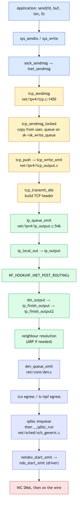
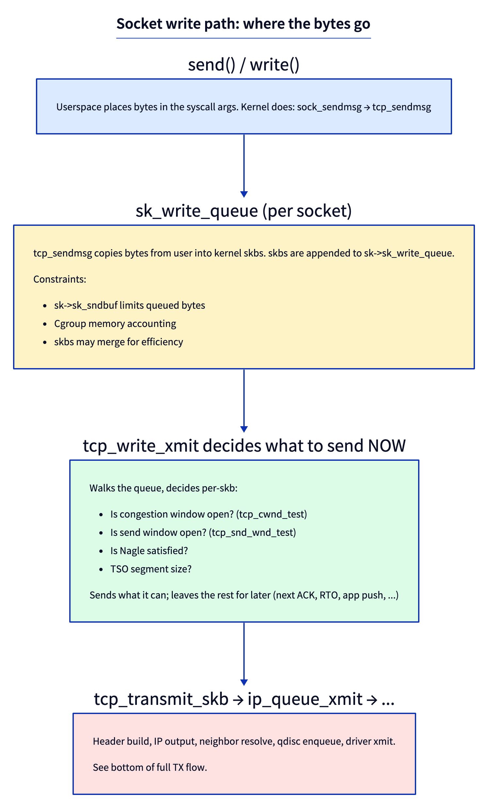
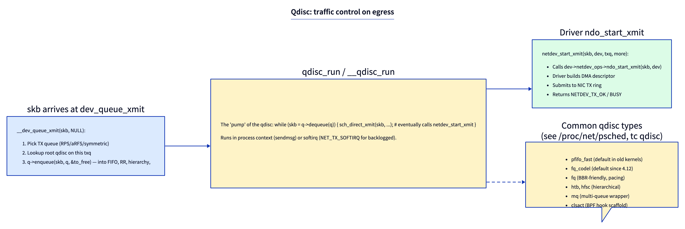

# Day 3 — The TX path: from `sendmsg` to the wire

> **Today's mission:** trace a TCP packet from a userspace `send()` to the moment it leaves the NIC. Total time: ~75 minutes.

## The journey, mirrored

Yesterday's RX path went wire → driver → IP → socket. Today's TX path goes the other direction:



Six layers of work between your `send()` syscall and the bytes hitting the wire. Each one has a job and a place to fail.

## Stage 1: syscall to socket

When userspace calls `send(fd, buf, len, 0)` (or `write(fd, ...)` on a socket), the kernel walks:

```
sys_sendto / sys_write
  → sock_sendmsg
    → inet_sendmsg
      → sk->sk_prot->sendmsg     // dispatch by protocol
```

For TCP that's **`tcp_sendmsg`** at `net/ipv4/tcp.c:1450`. The function locks the socket, then calls `tcp_sendmsg_locked` (line 1120) which is where the real work happens.

## Stage 2: copy and queue



`tcp_sendmsg_locked` does **two distinct things**:

1. **Copy bytes from userspace into kernel skbs.** Allocate skbs via `sk_stream_alloc_skb`, copy data via `copy_from_iter` or zero-copy if MSG_ZEROCOPY. Append to `sk->sk_write_queue`.

2. **Maybe trigger transmission.** Calls `tcp_push` which eventually invokes `tcp_write_xmit` (line 2962 in `tcp_output.c`).

The split matters: queueing is cheap. Actually sending requires the congestion window to be open, the receive window to permit it, Nagle constraints to be satisfied, etc. So one `send()` may queue 1MB of bytes but only transmit 64KB right now.

The socket has a **send buffer** (`sk->sk_sndbuf`); if `sk_wmem_queued >= sk_sndbuf`, the socket goes to sleep until ACKs free up space (or returns `EAGAIN` for non-blocking sockets). Tunable: `net.ipv4.tcp_wmem` (min, default, max).

## Stage 3: TCP header and IP layer

`tcp_transmit_skb` builds the TCP header (sequence number, ACK, flags, window, checksum if not offloaded). Then calls into IP via:

```c
icsk->icsk_af_ops->queue_xmit(...)
  → ip_queue_xmit                  // net/ipv4/ip_output.c:546
```

`ip_queue_xmit` builds the IP header (after route lookup if needed), sets TTL/DSCP, then:

```c
ip_local_out
  → __ip_local_out
    → NF_HOOK(NFPROTO_IPV4, NF_INET_LOCAL_OUT, ...)
  → dst_output
    → ip_output
      → NF_HOOK(NFPROTO_IPV4, NF_INET_POST_ROUTING, ...)
      → ip_finish_output
        → ip_finish_output2
```

That's where **two netfilter hooks** fire: `NF_INET_LOCAL_OUT` (just after IP header is set, before routing decision is final) and `NF_INET_POST_ROUTING` (after routing, just before the device).

`ip_finish_output2` does **neighbour resolution** — if the next-hop's MAC isn't cached, queues the skb and triggers ARP. If cached, calls `neigh_output` which builds the Ethernet header and continues.

## Stage 4: device queue

`dev_queue_xmit` (a wrapper for **`__dev_queue_xmit` at `net/core/dev.c:4766`**) is the boundary between L3 and the device layer.



Steps inside `__dev_queue_xmit`:

1. **Pick a TX queue.** `netdev_pick_tx` uses `skb->queue_mapping`, RFS hints, or hash. Modern NICs have many TX queues for parallelism.
2. **Find the root qdisc** on that queue (`txq->qdisc`).
3. **tcx/tc-bpf egress hook** runs here (after the qdisc lookup, before enqueue).
4. **Enqueue**: `q->enqueue(skb, q, &to_free)`.
5. **Pump**: `qdisc_run` → `__qdisc_run` → `q->dequeue` → `sch_direct_xmit` → `netdev_start_xmit` → driver's `ndo_start_xmit`.

Default qdisc on most modern systems is `fq_codel` (set in `/sys/class/net/<dev>/queues/tx-N/`). Day 23 covers qdiscs in detail.

## Stage 5: driver and hardware

`netdev_start_xmit(skb, dev, txq, more)` calls `dev->netdev_ops->ndo_start_xmit(skb, dev)`. Each driver implements this differently — fundamentally: build a DMA descriptor, write it to the TX ring, ring the doorbell. The NIC then DMAs and puts bytes on the wire.

Return value:
- `NETDEV_TX_OK` — submitted to NIC.
- `NETDEV_TX_BUSY` — TX ring full; reschedule. The qdisc holds the skb and tries again.

> ### There are no Dumb Questions
>
> **Q: Where does TSO/GSO fit into this?**
>
> A: Day 4. Briefly: TSO (TCP Segmentation Offload) lets the kernel hand a 64KB skb to the NIC, and the NIC chops it into MSS-sized packets. GSO (Generic Segmentation Offload) does the same in software when the NIC doesn't support TSO. Both happen *late* — at the qdisc/driver boundary, not during `tcp_sendmsg`.
>
> **Q: Why does the kernel sometimes block sendmsg vs return EAGAIN?**
>
> A: Socket flag. Default sockets block (sleep until space). Non-blocking sockets (`O_NONBLOCK`) return `EAGAIN`. `epoll`-based servers use non-blocking + `EPOLLOUT` notifications to know when to retry.
>
> **Q: What about MSG_ZEROCOPY?**
>
> A: A flag for `send()`. The kernel pins the user pages, points skb fragments at them directly (no copy), and notifies userspace via the error queue when transmission completes. Useful for very large transfers; userspace must hold the buffers until the notification.

## Today's experiment

### Trace a TCP send all the way through

```bash
sudo trace-cmd record -p function_graph \
    -g tcp_sendmsg \
    -O nofuncgraph-overhead \
    -O funcgraph-tail \
    sleep 5

# In another terminal:
echo "hello" | nc -q 1 8.8.8.8 80

sudo trace-cmd report | head -200
```

You'll see the call tree from `tcp_sendmsg` down through `tcp_write_xmit`, `tcp_transmit_skb`, `ip_queue_xmit`, eventually `dev_hard_start_xmit`, then the driver's xmit.

### Watch socket buffer accounting

```bash
ss -tim
```

Per-socket: send buffer used, congestion window, RTO, retransmits. Look at `wmem_*` fields.

### Inspect qdisc statistics

```bash
tc -s qdisc show dev eth0
```

Drops, requeues, current backlog.

### Force a backlog and watch

```bash
sudo tc qdisc replace dev eth0 root tbf rate 1mbit burst 32kbit latency 50ms
# now egress is rate-limited; large transfers back up at the qdisc
iperf3 -c some-target &
tc -s qdisc show dev eth0    # backlog grows
```

Restore default:
```bash
sudo tc qdisc replace dev eth0 root fq_codel
```

---

## What to read in the kernel

- **`net/ipv4/tcp.c`** — `tcp_sendmsg` (line 1450), `tcp_sendmsg_locked` (line 1120). The core of TCP user-side semantics.
- **`net/ipv4/tcp_output.c`** — `tcp_write_xmit` (line 2962), `tcp_transmit_skb`. Decides what to send when.
- **`net/ipv4/ip_output.c`** — `ip_queue_xmit` (line 546), `ip_local_out` (line 125), `ip_finish_output2`, `ip_finish_output_neigh`.
- **`net/core/dev.c`** — `__dev_queue_xmit` (line 4766), the qdisc dance.
- **`net/sched/sch_generic.c`** — `__qdisc_run`, `sch_direct_xmit`, the qdisc pump.
- **`include/linux/netdevice.h`** — `struct net_device_ops` with `ndo_start_xmit` (line 1441).
- **`Documentation/networking/scaling.rst`** — how multi-queue TX works.

---

## Bullet Points

- TX path: `sendmsg → tcp_sendmsg → tcp_write_xmit → tcp_transmit_skb → ip_queue_xmit → dev_queue_xmit → qdisc → driver → wire`.
- **`sk_write_queue`** holds queued-but-not-yet-transmitted skbs; `sk_sndbuf` caps it.
- **`tcp_write_xmit`** decides what to send *now* based on cwnd, snd_wnd, Nagle, TSO size.
- **Two netfilter hooks** on TX: `NF_INET_LOCAL_OUT` and `NF_INET_POST_ROUTING`.
- **Neighbour resolution** (ARP/NDP) happens in `ip_finish_output2`.
- **`__dev_queue_xmit`** picks a TX queue, runs tcx/tc-bpf egress, enqueues to qdisc.
- Default qdisc on modern Linux is **`fq_codel`**.
- Driver's **`ndo_start_xmit`** is the final hand-off to hardware.

---

## Check question

You call `send(fd, buf, 1MB, 0)` on a TCP socket whose RTT is 100ms and BDP is much smaller than 1MB. The send returns immediately with the full 1MB written. Where are those bytes physically right now?

.  
.  
.

**Answer:** In the kernel's `sk_write_queue` — copied from userspace into a chain of skbs hanging off the socket. The send returned because `sk_sndbuf` was big enough to accept the queueing; it doesn't mean the bytes left the box. They'll trickle out as the receiver ACKs and the congestion window opens. If you read `/proc/<pid>/status` you'd see them counted against the kernel's TCP memory accounting, not against your process's RSS. To know how much is actually on the wire vs queued, run `ss -tim` and look at `unacked` (sent but not ACKed) vs `wmem_queued` (queued).

---

## Tomorrow

Day 4: GRO, GSO, TSO. Why a 64KB packet enters `ip_rcv` even though Ethernet's MTU is 1500.
