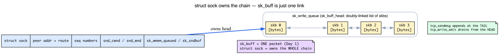
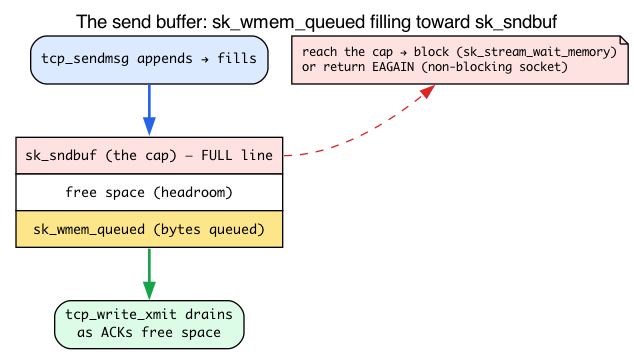
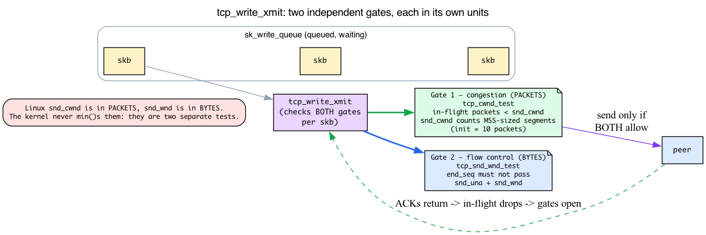
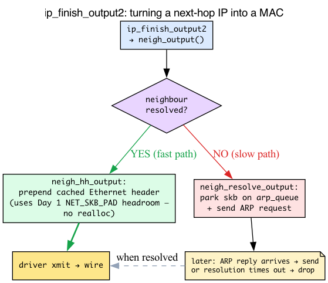
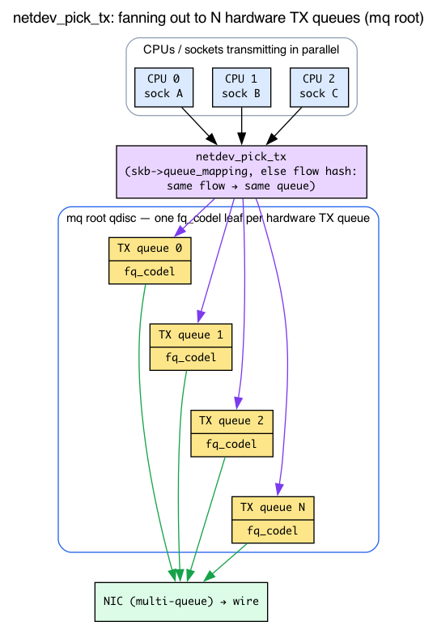

# Day 3 — The TX path: from `sendmsg` to the wire

> **Today's mission:** trace a TCP packet from a userspace `send()` to the moment it leaves the NIC — and meet the four structures that gate it on the way out: the socket and its send buffer, the windows that decide what may go *now*, the qdisc that schedules it, and the neighbour entry that finally stamps on a MAC address. Total time: ~110 minutes.

## The journey, mirrored

Yesterday's RX path went wire → driver → IP → socket. Today's TX path goes the other direction:


Six layers of work between your `send()` syscall and the bytes hitting the wire. Each one has a job and a place to fail.

But there's a deeper asymmetry, and it's worth naming up front because it reshapes how you read the code. **The RX path is skb-centric. The TX path is sock-centric.**

On RX, a packet arrived out of nowhere — the NIC DMA'd some bytes into a page, the driver wrapped them in an `sk_buff` (Day 1), and that skb climbed the stack as a self-contained object. Nothing "owned" it until a socket claimed it at the very top.

On TX, the story starts the other way around. The bytes begin life inside a process that *already has an open connection* — a long-lived object that remembers the peer's address, the sequence numbers, how much the network can take, how much the receiver will accept. That object is **`struct sock`**, and on the way out, every skb is something the sock *produces and owns*. So before we can read a single line of `tcp_sendmsg`, we need to meet the sock.

## Stage 0: the connection object — `struct sock`

Day 1 taught you the `sk_buff`: **one packet.** Day 2 followed packets up the RX path. But neither ever introduced the thing that *owns* packets on a connection. That's the gap we close first, because the entire TX path hangs off it.

Here's the intuition. A TCP connection is not a packet — it's a *relationship* that lives for seconds, minutes, or hours and carries thousands of packets. Somebody has to remember, between one `send()` and the next:

- who the peer is, and the route to reach it,
- the next sequence number to use,
- how many bytes are out on the wire unacknowledged,
- how much buffer the kernel is still allowed to spend on this connection,
- a **chain of packets** that are queued up but not yet (fully) sent.

That somebody is `struct sock` — "the sock." Where an `sk_buff` is one envelope, **a sock is the whole mailbox**: a long-lived endpoint object that owns a *list* of skbs and all the bookkeeping around them.



The send-side fields we care about today all live in `include/net/sock.h`:

```c
struct sk_buff_head  sk_write_queue;   /* include/net/sock.h:491 — the chain of queued skbs */
int                  sk_wmem_queued;   /* include/net/sock.h:484 — memory charged for unfreed send-side skbs */
int                  sk_sndbuf;        /* include/net/sock.h:526 — the cap on those bytes */
```

`sk_write_queue` is an `sk_buff_head` — the same doubly-linked list of skbs you saw on RX queues — except here it hangs off the *socket* and holds packets that TCP has built but not yet handed to the wire. `tcp_sendmsg` appends to its tail; `tcp_write_xmit` drains from its head.

### How one sock reaches the right protocol code: the `proto` vtable

When userspace calls `send()`, the kernel has a generic `struct sock` in hand but needs to run **TCP's** send logic — not UDP's, not raw IP's. It avoids a giant `if (protocol == TCP)` ladder with a classic trick: a **vtable** of function pointers.

Every sock carries `sk->sk_prot`, a pointer to a `struct proto`:

```c
struct proto {                              /* include/net/sock.h:1291 */
        int  (*sendmsg)(struct sock *sk, struct msghdr *msg, ...);  /* :1321 */
        /* ...recvmsg, connect, close, ... */
};
```

For a TCP socket, `sk_prot` points at `tcp_prot`, whose `.sendmsg` slot is wired to `tcp_sendmsg`:

```c
/* net/ipv4/tcp_ipv4.c:3353 */
.sendmsg = tcp_sendmsg,
```

So `sock_sendmsg → inet_sendmsg → sk->sk_prot->sendmsg(...)` lands in `tcp_sendmsg` with no branching. The exact same indirection reappears one layer down at L3: the connection keeps an `icsk->icsk_af_ops->queue_xmit` pointer (`include/net/inet_connection_sock.h:36`) that, for AF_INET sockets, is `ip_queue_xmit`. Keep this vtable picture in mind — "dispatch by pointer, not by `if`" is how the whole stack stays protocol-agnostic.

## Stage 1: syscall to socket

When userspace calls `send(fd, buf, len, 0)` (or `write(fd, ...)` on a socket), the kernel walks:

```
sys_sendto / sys_write
  → sock_sendmsg
    → inet_sendmsg
      → sk->sk_prot->sendmsg     // dispatch by protocol (the vtable above)
```

For TCP that's **`tcp_sendmsg`** at `net/ipv4/tcp.c:1447`. The function locks the socket, then calls `tcp_sendmsg_locked` (line 1117) which is where the real work happens.

## Stage 2: copy and queue


`tcp_sendmsg_locked` does **two distinct things**:

1. **Copy bytes from userspace into kernel skbs.** Allocate skbs via `tcp_stream_alloc_skb`, copy data via `copy_from_iter` (or, with `MSG_ZEROCOPY`, pin the user pages and point skb *frags* at them — no copy; recall the page-fragment design from Day 1). Append each skb to `sk->sk_write_queue`.

2. **Maybe trigger transmission.** Calls `tcp_push` (`net/ipv4/tcp.c:741`) which eventually invokes `tcp_write_xmit` (line 2963 in `tcp_output.c`).

The split matters: **queueing is cheap; sending is gated.** Appending to `sk_write_queue` just costs a copy and a list insert. Actually putting bytes on the wire requires the congestion window to be open, the receive window to permit it, Nagle constraints to be satisfied (all three explained in the next stage). So one `send()` may queue 1 MB of bytes but only transmit 64 KB right now — the rest sits in `sk_write_queue` waiting for ACKs.

### The send buffer: `sk_wmem_queued` vs `sk_sndbuf`

If a socket could queue unbounded data, a fast writer talking to a slow network would balloon kernel memory without limit. So every sock has a **send-buffer cap**, and accounting to enforce it:

- `sk_wmem_queued` — total *memory* (the sum of `skb->truesize`) charged for every send-side skb the kernel hasn't freed yet. That spans two queues: skbs still unsent in `sk_write_queue` **and** skbs already transmitted but not yet ACKed, which in v7.1 have migrated to the separate retransmit queue `tcp_rtx_queue` (an rbtree). It's freed only when the data is finally ACKed. Note this is a *memory* figure — it includes headroom and per-skb overhead, not just payload bytes.
- `sk_sndbuf` — the cap on that memory.

The check is a one-liner in the header:

```c
static inline bool __sk_stream_memory_free(const struct sock *sk, int wake)
{                                                  /* include/net/sock.h:1413 */
        if (READ_ONCE(sk->sk_wmem_queued) >= READ_ONCE(sk->sk_sndbuf))
                return false;                      /* buffer full → not free */
        /* ... */
}
```

When the buffer is full, `tcp_sendmsg_locked` consults `sk_stream_memory_free` (`net/ipv4/tcp.c:1248`) and then either:

- **blocks** — `sk_stream_wait_memory` (`net/ipv4/tcp.c:1405`) sleeps the calling thread until ACKs free space (default, blocking socket); or
- **returns `EAGAIN`** — for a non-blocking socket, so an event loop can come back later.



`sk_sndbuf` isn't a fixed number — the kernel auto-tunes it per socket between the bounds of the `net.ipv4.tcp_wmem` (min, default, max) sysctl, growing it for connections that can productively use more. This is exactly the accounting `ss -tim` surfaces: the `w` value inside `skmem:(...)` *is* `sk_wmem_queued` (charged memory) and `tb` is `sk_sndbuf`. The `Send-Q` column is a *separate* quantity — `write_seq - snd_una`, the count of unacknowledged sequence (payload) bytes — closer in spirit to the in-flight/unsent backlog than to the memory counter. The two correlate but are measured in different units (payload sequence bytes vs charged memory, which includes per-skb overhead). Lab 2 makes them move.

## Stage 2.5: what actually gates transmission

Stage 2 said sending is "gated" by three things. Those three terms — congestion window, receive window, Nagle — get a full treatment later (congestion control is Days 16–17), but you can't read `tcp_write_xmit` today without a working picture, so here it is in one pass. The goal is narrow: understand **why one `send()` can queue 1 MB yet transmit far less right now.**

Think of the path to the peer as a pipe. Two separate limits decide how much may be "in the pipe" (sent but not yet acknowledged) at once — and, crucially, **Linux measures them in different units and enforces them with two separate tests, never a single `min()`:**

- **Congestion window — `snd_cwnd`** (`include/linux/tcp.h:225`), measured in **packets** (MSS-sized segments — initial value `TCP_INIT_CWND` = 10 packets, *not* a byte count like the textbook cwnd). The sender's *own estimate* of how many segments the **network path** can hold in flight without dropping. Nobody negotiates it; the sender grows it as ACKs arrive and shrinks it on loss. It's the sender protecting the network from itself. Enforced by `tcp_cwnd_test` (`net/ipv4/tcp_output.c:2323`): in-flight *packets* must be below `snd_cwnd`.

- **Receive window — `snd_wnd`** (`include/linux/tcp.h:223`, commented "The window we expect to receive"), measured in **bytes**. The amount of buffer the **peer advertised** it can accept. This is flow control — it stops a fast sender from overrunning a slow receiver. Enforced by `tcp_snd_wnd_test` (`net/ipv4/tcp_output.c:2380`): the segment's end sequence number must not pass `snd_una + snd_wnd` (`tcp_wnd_end`).

The rule that combines them:

> **A segment may go out only if it passes *both* independent gates: in-flight *packets* < `snd_cwnd` (the congestion test, in packets) *and* its end sequence ≤ `snd_una + snd_wnd` (the flow-control test, in bytes).**

New data may go out only while there's room under *both* tests. As ACKs return, in-flight drops, the gates open, and `tcp_write_xmit` releases more from `sk_write_queue`. The in-flight quantity the congestion test uses is `tcp_packets_in_flight(tp)` = `packets_out − (sacked + lost) + retrans` (`include/net/tcp.h:1502`). `ss -tim`'s `unacked` column (= `tp->packets_out`) *approximates* it; the two are equal only on a clean connection with no SACKed, lost, or retransmitted segments.

The third gate is **Nagle's algorithm**. Intuition: if an app does many tiny writes (think a character at a time over SSH), naively each becomes its own minimum-size segment and floods the wire with "tinygrams," mostly header. Nagle says: *don't send a new small segment while a previous small one is still unacknowledged* — coalesce instead. Whether it's disabled is recorded in `tp->nonagle` (`include/linux/tcp.h:291`); `TCP_NODELAY` sets it to "off" for latency-sensitive apps.

All three are applied in one loop:

```c
/* net/ipv4/tcp_output.c:2963 */
static bool tcp_write_xmit(struct sock *sk, unsigned int mss_now, int nonagle, ...)
```

`tcp_write_xmit` walks `sk_write_queue` from the head and, for each skb, asks: does cwnd allow it? does snd_wnd allow it? does Nagle allow it? (And how big a TSO chunk to cut — Day 4.) It stops at the first skb the gates reject; the rest stay queued. The connection even records whether it was the cwnd that stopped it, in `is_cwnd_limited` (`include/linux/tcp.h:234`).



> **Forward reference:** the *mechanics* of how cwnd grows and collapses (slow start, congestion avoidance, the CUBIC/BBR algorithms) are Phase 3, Days 13–19. Today you only need: queue is cheap, transmit is gated, and ACKs are what reopen the gate.

## Stage 3: TCP header and the IP layer

`tcp_transmit_skb` builds the TCP header (sequence number, ACK, flags, window, checksum if not offloaded) on the skb being sent. (`tcp_transmit_skb` is a thin wrapper inlined into `__tcp_transmit_skb`, so that's the name you'll actually see in ftrace output.) Then it calls into IP via the L3 vtable slot we met in Stage 0:

```c
icsk->icsk_af_ops->queue_xmit(...)
  → ip_queue_xmit                  // net/ipv4/ip_output.c:546
```

`ip_queue_xmit` builds the IP header (after a route lookup if the route isn't cached), sets TTL/DSCP, then:

```c
ip_local_out                       // net/ipv4/ip_output.c:125
  → __ip_local_out
    → NF_HOOK(NFPROTO_IPV4, NF_INET_LOCAL_OUT, ...)
  → dst_output
    → ip_output                    // net/ipv4/ip_output.c:428
      → NF_HOOK(NFPROTO_IPV4, NF_INET_POST_ROUTING, ...)
      → ip_finish_output
        → ip_finish_output2        // net/ipv4/ip_output.c:200
```

### Two netfilter hooks on the way out

You already met the `NF_HOOK` machinery on RX (Day 2, Stage 4, where `NF_INET_PRE_ROUTING` fires inside `ip_rcv`; full netfilter treatment is deferred to Day 20). The TX path has its own two hook points — same mechanism, different positions:

- **`NF_INET_LOCAL_OUT`** (`include/uapi/linux/netfilter.h:46`) fires in `__ip_local_out`, just **after the IP header is set** for locally-generated packets.
- **`NF_INET_POST_ROUTING`** (`:47`) fires in `ip_output`, **after routing, just before the device** — the last place iptables/nftables can touch the packet.

No need to re-learn what a hook is; just place these two on the path.

### The last L3 step: turning a next-hop IP into a MAC

`ip_finish_output2` is where the packet finally gets a link-layer destination — and this is a subsystem no earlier chapter has introduced, so here's the background you need.

Routing produced a **next-hop IP address** (the gateway, or the destination if it's on-link). But the NIC can't send to an IP — Ethernet frames are addressed by **MAC address**. Something must map *next-hop-IP → MAC*. That something is the **neighbour subsystem**: ARP for IPv4, NDP for IPv6. It resolves the mapping once and caches it in a `struct neighbour`, so the second packet to the same next hop doesn't pay for resolution again.

Two outcomes when `ip_finish_output2` calls `neigh_output` (`include/net/neighbour.h:547`):

- **Resolved (fast path).** If the neighbour is reachable and has a cached hardware header, `neigh_hh_output` (`include/net/neighbour.h:507`) just **prepends the precomputed Ethernet header** and sends. This is the moment the L2 header is finally pushed onto the skb — and it's *free* because `tcp_stream_alloc_skb` (`net/ipv4/tcp.c:927`) reserved `MAX_TCP_HEADER` headroom up front (`alloc_skb_fclone(MAX_TCP_HEADER)` then `skb_reserve`). `MAX_TCP_HEADER` bakes in `MAX_HEADER`/`LL_MAX_HEADER` — the link-layer header space — so there's already room in front of `data` to push the Ethernet header with no reallocation. (This is the same *principle* as Day 1's headroom reservation, but the TX-side constant is `MAX_TCP_HEADER`, not the RX allocators' much smaller `NET_SKB_PAD`.)

- **Unresolved (slow path).** `neigh_resolve_output` (`include/net/neighbour.h:364`) **parks the skb on the neighbour's `arp_queue`** and fires an ARP request. The packet is sent later, when the reply arrives — or dropped if resolution times out. This is why a brand-new flow to a fresh next hop can briefly *stall* right here.



> **Forward reference:** the neighbour subsystem in full — ARP/NDP state machine, `NUD_*` states, garbage collection — is a Phase 2 topic (Days 6–12). Today you only need: this is where the MAC is resolved and the Ethernet header is built, and where a packet can stall.

## Stage 4: the device queue and the qdisc

`dev_queue_xmit` (a wrapper for **`__dev_queue_xmit` at `net/core/dev.c:4766`**) is the boundary between L3 and the device layer. Three new ideas live here: an egress BPF hook, TX-queue selection, and the **qdisc** — the software packet scheduler. Let's build them in the order the code hits them.


### Step 1 — the egress BPF hook (one line)

First, `__dev_queue_xmit` runs `sch_handle_egress` (`net/core/dev.c:4524`, called at `dev.c:4807`), which runs any attached **tcx / tc-bpf egress** programs via `tcx_run` (`dev.c:4439`). This is simply the egress sibling of the tcx *ingress* attach point you saw on the RX path (Day 2, "Where BPF can attach"). It runs *before* queue selection and the qdisc. No new BPF to learn here.

### Step 2 — pick a TX queue (multi-queue NICs)

A modern NIC doesn't have one transmit path — it exposes **many hardware TX queues** so different CPUs can transmit in parallel without fighting over a single lock. Before touching any qdisc, `__dev_queue_xmit` must decide *which* TX queue (and therefore which root qdisc) this skb uses:

```c
queue_index = netdev_pick_tx(dev, skb, sb_dev);   /* net/core/dev.c:4736 */
```

`netdev_pick_tx` (`net/core/dev.c:4691`) chooses in priority order:

1. an explicit `skb->queue_mapping` if something upstream set one (e.g. XPS or socket steering) — that wins;
2. otherwise a **flow hash**, so every packet of one connection lands on the *same* queue and TCP's ordering is preserved.



This is exactly why the Lab 3 output shows an **`mq` root with one `fq_codel` leaf per hardware queue**: one qdisc per TX queue.

### Step 3 — the qdisc: what it is and why it exists

Here's the new structure. Between the IP/device layer and the driver sits a **queueing discipline (qdisc)** — a per-TX-queue software FIFO-plus-scheduler. It exists because the driver/NIC can't always take a packet *this instant* (the ring may be full, or you may want to rate-limit or fairly interleave flows). The qdisc is the kernel's buffer-and-scheduling stage in front of the hardware: it can hold packets, reorder them, rate-limit them, and pick which flow goes next.

The whole qdisc abstraction comes down to **two function pointers** in `struct Qdisc_ops`:

```c
int             (*enqueue)(struct sk_buff *skb, struct Qdisc *q,   /* include/net/sch_generic.h:314 */
                           struct sk_buff **to_free);
struct sk_buff *(*dequeue)(struct Qdisc *q);                       /* include/net/sch_generic.h:317 */
```

- **`enqueue`** — the stack hands a packet *in*. `__dev_queue_xmit` calls `q->enqueue(skb, q, &to_free)` on the chosen queue's root qdisc.
- **`dequeue`** — the *pump* pulls the next packet *out* to give the driver.

The pump is `qdisc_run → __qdisc_run` (`net/sched/sch_generic.c:440`), a loop that calls `q->dequeue`, then `sch_direct_xmit` (`net/sched/sch_generic.c:344`), then `netdev_start_xmit`, then the driver — draining the queue as fast as the device will accept.

So the per-queue stats `tc -s qdisc` prints map directly onto this machinery:

- **backlog** — packets currently sitting in the qdisc, enqueued but not yet dequeued.
- **drops** — packets the qdisc threw away (queue full, or an active-queue-management algorithm like CoDel decided to).
- **requeues** — packets handed *back* because the driver returned `NETDEV_TX_BUSY` (ring full); the qdisc holds them to retry.

On an idle box all three read 0. That's not a bug — it means nothing is backing up. Lab 4 forces backlog non-zero on purpose so you can watch it move.

### Default qdisc: built-in vs configured

There's a subtlety worth getting right. The kernel's **compiled-in** default qdisc is `pfifo_fast` — a simple 3-band priority FIFO:

```c
/* net/sched/sch_generic.c:37 */
const struct Qdisc_ops *default_qdisc_ops = &pfifo_fast_ops;
```

But most distributions change the **runtime** default to `fq_codel` (fair-queuing with CoDel AQM) via the `net.core.default_qdisc` sysctl, handled by `set_default_qdisc` (`net/core/sysctl_net_core.c:595`). So:

> Default qdisc on most modern systems is `fq_codel` (selected via the `net.core.default_qdisc` sysctl; the kernel's built-in default is still `pfifo_fast`).

Day 23 covers qdiscs in detail.

### The steps inside `__dev_queue_xmit`, summarized

1. **tcx/tc-bpf egress hook** runs first (before TX queue selection and the qdisc lookup).
2. **Pick a TX queue.** `netdev_pick_tx` uses the socket's cached TX queue (`sk_tx_queue_get`), then XPS (`get_xps_queue`), then a flow hash (`skb_tx_hash`). Modern NICs have many TX queues for parallelism.
3. **Find the root qdisc** on that queue (`txq->qdisc`).
4. **Enqueue**: `q->enqueue(skb, q, &to_free)`.
5. **Pump**: `qdisc_run` → `__qdisc_run` → `q->dequeue` → `sch_direct_xmit` → `netdev_start_xmit` → driver's `ndo_start_xmit`.

## Stage 5: driver and hardware

`netdev_start_xmit(skb, dev, txq, more)` (`include/linux/netdevice.h:5371`) calls `dev->netdev_ops->ndo_start_xmit(skb, dev)` (`include/linux/netdevice.h:1441`). Each driver implements this differently — but fundamentally it's the **mirror of Day 1's RX descriptor ring, run in reverse**: build a DMA descriptor, write it into the **TX ring**, ring the NIC's doorbell register. The NIC's DMA engine then reads the bytes straight out of the skb's pages and puts them on the wire (recall: zero-copy, the payload pages are *referenced*, not copied).

Return value:

- **`NETDEV_TX_OK`** (`include/linux/netdevice.h:135`) — submitted to the NIC.
- **`NETDEV_TX_BUSY`** (`include/linux/netdevice.h:136`) — the TX ring is full, so the driver refuses the skb; the qdisc holds it and retries (this is the *requeues* counter from Stage 4).

> ### There are no Dumb Questions
>
> **Q: Where does TSO/GSO fit into this?**
>
> A: Day 4. Briefly: TSO (TCP Segmentation Offload) lets the kernel hand a 64KB skb to the NIC, and the NIC chops it into MSS-sized packets. GSO (Generic Segmentation Offload) does the same in software when the NIC doesn't support TSO. Both happen *late* — at the qdisc/driver boundary, not during `tcp_sendmsg`.
>
> **Q: Why does the kernel sometimes block sendmsg vs return EAGAIN?**
>
> A: Socket flag. Default sockets block (sleep until space) — that's `sk_stream_wait_memory` from Stage 2. Non-blocking sockets (`O_NONBLOCK`) return `EAGAIN` instead. `epoll`-based servers use non-blocking + `EPOLLOUT` notifications to know when the send buffer has drained enough to retry.
>
> **Q: What about MSG_ZEROCOPY?**
>
> A: A flag for `send()`. The kernel pins the user pages, points skb fragments at them directly (no copy into `sk_write_queue` — the frags reference the user pages), and notifies userspace via the socket's error queue when transmission completes. Useful for very large transfers; userspace must hold the buffers until the notification.

## Today's experiment

### Lab 1 — Trace a TCP send all the way through

Run the trigger **inside** the recorded command so the send is guaranteed to fire during the capture window — no second terminal, no race against `sleep`:

```bash
sudo trace-cmd record -p function_graph \
    -g tcp_sendmsg \
    -O nofuncgraph-overhead \
    -O funcgraph-tail \
    bash -c 'echo hello | nc -q 1 example.com 80; sleep 1'

sudo trace-cmd report | head -200
```

> **Prerequisite:** this needs outbound TCP reachability and a completed handshake during the capture — any host you can actually reach works. `example.com:80` reliably accepts the connection; `8.8.8.8:80` is filtered on many networks, so the handshake never completes and the payload `tcp_sendmsg` never fires. `-q 1` is a BSD/traditional `nc` flag — on nmap's `ncat`, drop it (use `nc example.com 80`).

You'll see the call tree from `tcp_sendmsg` down through `tcp_write_xmit`, `tcp_transmit_skb`, `ip_queue_xmit`, eventually `dev_hard_start_xmit`, then the driver's xmit. `trace-cmd` is global, so unrelated sends (e.g. background sshd) may appear too — your `nc` send is the one that ends in the full `ip_queue_xmit → ... → dev_hard_start_xmit` chain.

### Lab 2 — Watch socket buffer accounting

On an idle box `ss -tim` shows only your SSH session, with the buffer/window counters static and near zero — the send-buffer accounting from Stage 2 is invisible until something is actively transmitting. So generate a sustained send first, then snapshot:

```bash
# Sustained upload so the send buffer actually has bytes in flight:
curl -s -o /dev/null -T /dev/zero --max-time 4 https://speed.cloudflare.com/__up &
ss -tim                      # watch the uploading socket while curl runs
```

Per-socket you get: send buffer used, congestion window, RTO, retransmits. `ss` does not print a field literally named `wmem_queued`; it surfaces the charged send-side memory (the `sk_wmem_queued` from Stage 2) as the `w` value inside `skmem:(...)`. The `Send-Q` column is a *different* quantity — `write_seq - snd_una`, unacknowledged payload sequence bytes — which tracks the same backlog but in payload bytes rather than charged memory. While `curl` runs, the **uploading** socket (to `:https`, not your idle SSH session) shows a large `Send-Q` and `skmem` `w`, plus `cwnd`, `unacked`, and `pacing_rate`:

```
ESTAB  0  2765014  10.0.0.4:36872  162.159.140.220:https
  skmem:(r0,rb131072,t0,tb4194304,f2858,w2811094,o0,bl0,d0) cubic wscale:13,10
  ... cwnd:1950 ... unacked:266 ... pacing_rate 1.42Gbps delivery_rate 120Mbps
```

`unacked` (= `tp->packets_out`) is segments sent but not yet ACKed — it *approximates* the in-flight quantity from Stage 2.5 that the congestion test bounds (the exact figure is `tcp_packets_in_flight()`; the two diverge under loss/SACK). The `skmem` `w` value is the memory charged for not-yet-freed send-side skbs (`sk_wmem_queued`). Those are exactly the Stage 2 / Stage 2.5 quantities the check question asks you to compare. (Your `cc` may read `bbr` instead of `cubic` depending on `net.ipv4.tcp_congestion_control`.) If you have no internet egress, a local sink works but won't fully exercise the buffer cap (loopback has no bottleneck, so it drains as fast as it fills).

### Lab 3 — Inspect qdisc statistics

```bash
tc -s qdisc show dev eth0
```

Drops, requeues, current backlog — the three counters from Stage 4. On an idle box every one of these reads 0 — that is expected, not a failure:

```
qdisc mq 0: root
 Sent 1279377437 bytes 1467116 pkt (dropped 0, overlimits 0 requeues 0)
 backlog 0b 0p requeues 0
qdisc fq_codel 0: parent :1 limit 10240p flows 1024 quantum 1514 ...
 Sent 895133146 bytes 775553 pkt (dropped 0, overlimits 0 requeues 0)
 backlog 0b 0p requeues 0
```

(On a multi-queue NIC the root is `mq` with one `fq_codel` leaf per hardware TX queue — exactly the `netdev_pick_tx` fan-out from Stage 4, step 2 — so you'll see several stanzas.) The next experiment forces `backlog` non-zero so you can actually watch it move.

### Lab 4 — Force a backlog and watch

> **Warning:** this throttles **all** egress on `eth0`. If you are connected over that interface, your SSH/management traffic competes with the test transfer for the same 1mbit and the session may stall — run this on a throwaway VM or a non-management NIC.

First capture the qdisc that is actually there so you can restore it exactly (the live default here is `mq`, not `fq_codel`), then apply the rate limit:

```bash
ORIG=$(tc qdisc show dev eth0 | awk 'NR==1{print $2}')   # remember the real default
sudo tc qdisc replace dev eth0 root tbf rate 1mbit burst 32kbit latency 50ms
# now egress is rate-limited; large transfers back up at the qdisc
```

Drive traffic that actually leaves `eth0`. The backlog only grows for traffic egressing this device — a `127.0.0.1` transfer goes through the `lo` qdisc and shows backlog `0b 0p`, so loopback is *not* a substitute. On a second machine run `iperf3 -s`, then here:

```bash
iperf3 -c <that-host-IP> -t 30 &
watch -n1 'tc -s qdisc show dev eth0'   # the `backlog ...b ...p` line climbs
```

No second machine or `iperf3`? Any sustained upload over `eth0` backs up the qdisc the same way:

```bash
curl -s -o /dev/null -T /dev/zero --max-time 20 https://speed.cloudflare.com/__up &
watch -n1 'tc -s qdisc show dev eth0'
```

Restore (drop back to whatever was really there, and stop the transfer):
```bash
kill %1 2>/dev/null                       # stop the backgrounded transfer
sudo tc qdisc del dev eth0 root           # restores the kernel/runtime default
# or, to put back exactly what you captured: sudo tc qdisc replace dev eth0 root "$ORIG"
```

---

## What to read in the kernel

- **`include/net/sock.h`** — `struct sock` send-side fields: `sk_write_queue` (491), `sk_wmem_queued` (484), `sk_sndbuf` (526); the `struct proto` vtable (1291) and its `sendmsg` slot (1321); `__sk_stream_memory_free` (1413).
- **`net/ipv4/tcp.c`** — `tcp_sendmsg` (line 1447), `tcp_sendmsg_locked` (line 1117), `tcp_push` (741), the send-buffer wait at 1248/1405. The core of TCP user-side semantics.
- **`net/ipv4/tcp_output.c`** — `tcp_write_xmit` (line 2963), `tcp_transmit_skb`. Decides what to send when, applying cwnd/snd_wnd/Nagle.
- **`include/linux/tcp.h`** — `snd_wnd` (223), `snd_cwnd` (225), `is_cwnd_limited` (234), `nonagle` (291).
- **`net/ipv4/ip_output.c`** — `ip_queue_xmit` (line 546), `ip_local_out` (line 125), `ip_output` (428), `ip_finish_output2` (200) and its `neigh_output` call (237).
- **`include/net/neighbour.h`** — `neigh_output` (547), `neigh_hh_output` (507), `neigh_resolve_output` (364).
- **`net/core/dev.c`** — `__dev_queue_xmit` (line 4766), `sch_handle_egress` (4524), `netdev_pick_tx` (4691), the qdisc dance.
- **`net/sched/sch_generic.c`** — `__qdisc_run` (440), `sch_direct_xmit` (344), `pfifo_fast_ops` (942), the qdisc pump; the `default_qdisc_ops = &pfifo_fast_ops` line (37).
- **`include/net/sch_generic.h`** — `Qdisc_ops.enqueue` (314) / `dequeue` (317).
- **`include/linux/netdevice.h`** — `ndo_start_xmit` (line 1441), `netdev_start_xmit` (5371), `NETDEV_TX_OK`/`NETDEV_TX_BUSY` (135–136).
- **`Documentation/networking/scaling.rst`** — how multi-queue TX works.

---

## Bullet Points

- TX is **sock-centric** where RX was skb-centric: a **`struct sock`** is the long-lived connection that *owns* a chain of skbs; an `sk_buff` is just one packet.
- TX path: `sendmsg → tcp_sendmsg → tcp_write_xmit → tcp_transmit_skb → ip_queue_xmit → dev_queue_xmit → qdisc → driver → wire`.
- Protocol dispatch is a **vtable**: `sk->sk_prot->sendmsg` is `tcp_sendmsg`; `icsk->icsk_af_ops->queue_xmit` is `ip_queue_xmit`. No `if`-ladder.
- **`sk_write_queue`** holds queued-but-not-yet-transmitted skbs; **`sk_wmem_queued`** counts their bytes against the **`sk_sndbuf`** cap. Full buffer ⇒ block (`sk_stream_wait_memory`) or `EAGAIN`. Auto-tuned by `tcp_wmem`.
- **`tcp_write_xmit`** decides what to send *now* based on cwnd, snd_wnd, Nagle, TSO size. A segment goes out only if it clears **two independent gates**: in-flight *packets* < `snd_cwnd` (congestion, in packets — `tcp_cwnd_test`) **and** its end sequence ≤ `snd_una + snd_wnd` (flow control, in bytes — `tcp_snd_wnd_test`). Linux's `snd_cwnd` is in MSS-sized packets, so the two can't be `min()`'d. ACKs reopen the gates. (Full congestion control: Days 16–17.)
- **Two netfilter hooks** on TX: `NF_INET_LOCAL_OUT` and `NF_INET_POST_ROUTING`.
- **Neighbour resolution** (ARP/NDP) happens in `ip_finish_output2`: resolved ⇒ `neigh_hh_output` prepends the cached Ethernet header (using Day 1's headroom); unresolved ⇒ skb parked on `arp_queue` + ARP sent. (Full neighbour subsystem: Phase 2.)
- **`__dev_queue_xmit`** runs tcx/tc-bpf egress, picks a TX queue (`netdev_pick_tx`), then enqueues to that queue's root qdisc.
- A **qdisc** is a per-TX-queue software FIFO+scheduler with `enqueue`/`dequeue`; `__qdisc_run` pumps it to the driver. **backlog/drops/requeues** are its counters. Multi-queue NICs show an `mq` root with an `fq_codel` leaf per queue.
- Default qdisc on modern Linux is **`fq_codel`** (via `net.core.default_qdisc`); the built-in default is still `pfifo_fast`.
- Driver's **`ndo_start_xmit`** is the final hand-off: write the TX-ring descriptor, ring the doorbell, NIC DMAs out. `NETDEV_TX_BUSY` = ring full ⇒ qdisc requeues.

---

## Check question

You call `send(fd, buf, 1MB, 0)` on a TCP socket whose RTT is 100ms and whose **BDP** — *bandwidth-delay product*, the bandwidth times the round-trip time, i.e. the most data that can usefully be in flight at once — is much smaller than 1MB. The send returns immediately with the full 1MB written. Where are those bytes physically right now?

<details>
<summary>Click to reveal answer</summary>

**Answer:** In the kernel's `sk_write_queue` — copied from userspace into a chain of skbs hanging off the socket. The send returned because `sk_sndbuf` was big enough to accept the queueing; it doesn't mean the bytes left the box. They'll trickle out as the receiver ACKs and the congestion window opens. If you read `/proc/<pid>/status` you'd see them counted against the kernel's TCP memory accounting, not against your process's RSS. To know how much is actually on the wire vs queued, run `ss -tim` and look at `unacked` (segments sent but not ACKed) vs the `skmem` `w` value (the `sk_wmem_queued` memory from Stage 2; `ss` has no field literally named `wmem_queued`, and `Send-Q` is the related-but-distinct `write_seq - snd_una` payload-byte count).

</details>

---

## Tomorrow

Day 4: GRO, GSO, TSO. Why a 64KB packet enters `ip_rcv` even though Ethernet's MTU is 1500.
