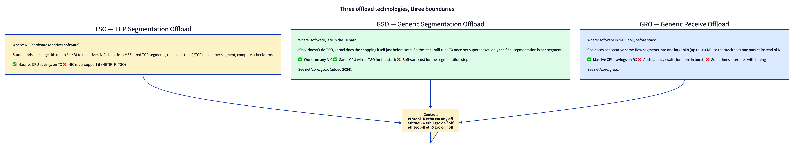
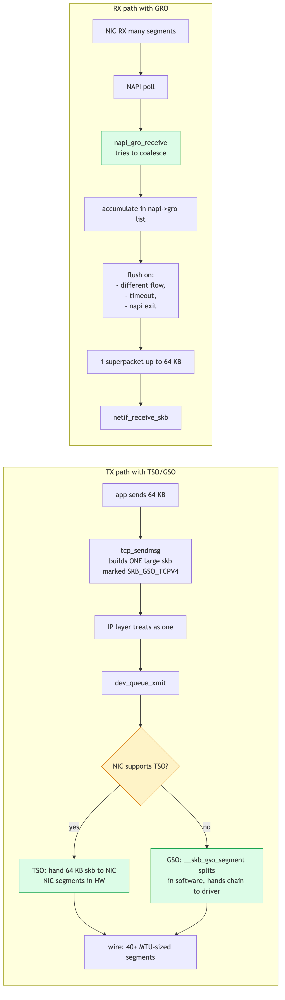
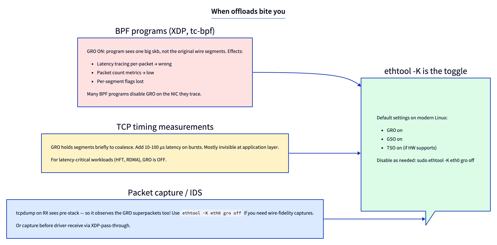

# Day 4 — GRO, GSO, TSO: segmentation offloads

> **Today's mission:** understand why a single skb that enters `ip_rcv` may represent 40+ wire packets, and why the kernel writes one 64 KB skb on TX. Total time: ~75 minutes.

## The problem

Ethernet has an MTU of 1500 bytes. Most NICs can handle up to ~9000 bytes (jumbo frames) but not more. So one TCP connection sending a gigabyte through the kernel produces ~700,000 wire packets.

If the kernel ran its **full TCP send code path** (queue, build header, route lookup, qdisc, driver) once per wire packet, the per-packet overhead would crush throughput. Same on RX: 700,000 calls to `ip_rcv` is too many.

Three offload technologies move this work to either hardware or batched software so the stack runs at *aggregate* rate, not *per-segment* rate.



## TSO — TCP Segmentation Offload

The kernel hands the NIC **one large skb** (up to 64 KB) marked with `SKB_GSO_TCPV4` (or `SKB_GSO_TCPV6`). The NIC's hardware:

1. Reads the skb's TCP header as a template.
2. Walks the payload in MSS-sized chunks.
3. For each chunk, builds an IP+TCP header (cloning the template, adjusting sequence number, IP id, TTL, checksum), prepends Ethernet header, transmits.

Result: ~40 wire packets, **one** kernel call to `ndo_start_xmit`. Per-packet stack overhead drops by 40x.

Enable/check:

```bash
ethtool -k eth0 | grep tso
# tcp-segmentation-offload: on
ethtool -K eth0 tso off
```

NIC must support it (most modern NICs do).

## GSO — Generic Segmentation Offload

Same idea, but the segmentation happens **in software** late in the TX path. If the NIC doesn't do TSO, the kernel still wants to avoid running the full TCP/IP code per segment. Instead:

1. TCP builds one big skb just like for TSO.
2. The skb travels down through `tcp_transmit_skb`, `ip_queue_xmit`, `dev_queue_xmit` as if it were a single packet.
3. Just before `ndo_start_xmit`, the qdisc/driver path detects the GSO marker and calls `__skb_gso_segment` (`net/core/gso.c:88`), which splits the skb into a chain of MTU-sized skbs.
4. The driver receives the chain and transmits each.

GSO is universal — works on any NIC. The CPU cost of segmentation is real but smaller than running the full stack per packet.

## GRO — Generic Receive Offload

The receive-side counterpart. Inside NAPI's poll function:

```c
napi_gro_receive(napi, skb);
```

The GRO engine (`net/core/gro.c`) compares the new skb against a list of "in flight" same-flow skbs. If it can merge (consecutive sequence numbers, same flow tuple, no flag changes), it appends payload to the existing one — extending the linear buffer or adding a page fragment. Result: one `ip_rcv` call for what was 40 wire packets.

Flush triggers:
- Different flow arrives.
- Timeout (`net.core.gro_flush_timeout`).
- NAPI poll exits.
- Special flag (FIN, RST, PSH).

## The full picture



> ### There are no Dumb Questions
>
> **Q: Why doesn't TSO break TCP correctness?**
>
> A: Because the segmenting NIC produces *correct wire packets* — same as if the kernel did it. From a peer's perspective, traffic is indistinguishable. Only the local stack saves work. Same for GRO: the merged skb has the same bytes as the original segments would; the local stack just sees them as one.
>
> **Q: When should I disable these?**
>
> A: For **latency-sensitive** measurements (HFT, microsecond timing, packet capture for forensics) — GRO can hold a packet briefly waiting for a possible merge buddy. Cost is usually <100 µs but visible. For **per-packet observability** (BPF programs that need to see wire packets) — GRO at the driver hides them.
>
> **Q: How does GSO interact with checksum offload?**
>
> A: Closely. GSO assumes the NIC will compute checksums (or computes them in software during segmentation). The skb has `ip_summed` flags (`CHECKSUM_PARTIAL` etc.) that the segmentation step uses. Look at `__skb_gso_segment` carefully if you ever debug a checksum-related issue.

## Pitfalls when offloads are on



The biggest gotcha is **observability**. If you trace `ip_rcv` and count packets, you're counting GRO superpackets, not wire packets. Multiply by `skb_shinfo(skb)->gso_segs` if you have it; or disable GRO during measurement.

For BPF programs that hook into the stack (XDP runs *before* GRO; tc-bpf runs *after*), this matters: XDP sees per-segment, tc sees coalesced.

## Today's experiment

### See offload state

```bash
ethtool -k eth0 | grep -E "tso|gso|gro"
```

Output (typical):
```
rx-checksumming: on
tx-checksumming: on
tx-checksum-ipv4: on
generic-receive-offload: on
generic-segmentation-offload: on
tcp-segmentation-offload: on
```

### Watch GRO in action

```bash
sudo bpftrace -e '
fentry:napi_gro_receive {
  @gro_lengths = lhist(skb->len, 0, 65536, 4096);
}
fentry:ip_rcv {
  @rcv_lengths = lhist(skb->len, 0, 65536, 4096);
}
interval:s:5 { exit }'

# In another terminal: do a big TCP transfer
iperf3 -c 8.8.8.8 -t 5
```

You'll see two histograms. `gro_lengths` shows what GRO received from the NIC (often 1500 each). `rcv_lengths` shows what entered `ip_rcv` (often much larger — coalesced).

### Disable GRO and re-measure

```bash
sudo ethtool -K eth0 gro off
# Re-run the experiment
sudo bpftrace -e 'fentry:ip_rcv { @lens = lhist(skb->len, 0, 65536, 1500); } interval:s:5 { exit }'
```

Now `ip_rcv` sees actual wire-sized packets. CPU usage during a high-rate transfer goes up — that's the cost GRO was hiding.

Restore:
```bash
sudo ethtool -K eth0 gro on
```

### Per-segment counter

For TX, check NIC stats:
```bash
ethtool -S eth0 | grep -i tx_pkts
```

The driver counts wire packets, not skb count. So a `wire_pkts >> tx_packets_kernel` ratio means TSO is doing real work.

---

## What to read in the kernel

- **`net/core/gso.c`** — segmentation engine. ~300 lines. `__skb_gso_segment` is the entry; `skb_mac_gso_segment` does the L2 split.
- **`net/core/gro.c`** — coalescing engine. ~800 lines. `napi_gro_receive` is the entry; per-protocol callbacks (`tcp4_gro_receive`) live in protocol files.
- **`net/ipv4/tcp_offload.c`** — TCP-specific GRO/GSO callbacks.
- **`include/linux/netdev_features.h`** — `NETIF_F_GSO_*`, `NETIF_F_TSO_*`, `NETIF_F_GRO_*` flags.
- **`include/linux/skbuff.h`** — search `gso_size`, `gso_segs`, `gso_type` in `skb_shared_info`.
- **`Documentation/networking/segmentation-offloads.rst`** — official guide.

---

## Bullet Points

- **TSO**: hardware segments large skbs into wire packets. Saves stack overhead 40x.
- **GSO**: software segmentation late in TX (`net/core/gso.c:__skb_gso_segment`). Same stack savings as TSO; works on any NIC.
- **GRO**: receive-side coalescing in NAPI poll (`net/core/gro.c:napi_gro_receive`). One stack pass per superpacket.
- All three controlled with `ethtool -K`.
- **Default ON** for all three on modern NICs.
- Side effects: **per-packet observability is wrong unless you disable GRO** or multiply by gso_segs.
- For latency-critical workloads, sometimes GRO is disabled (sub-100µs latency floor).

---

## Check question

You run `iperf3` and observe 30 Gbps throughput on a 25 Gbps NIC. Wait, that's higher than line rate. What's happening?

.  
.  
.

**Answer:** TSO is making the kernel see more "throughput" than wire actually carries. iperf3 measures bytes through the userspace socket. With TSO, those bytes leave the kernel in 64 KB skbs and the NIC chops them. iperf3's bytes-per-second is correct for the *application*, but it's measuring socket throughput, not wire throughput. Wire is bounded at 25 Gbps. The 30 Gbps reading means about 5 Gbps of "stack-level throughput" exists only briefly as the kernel hands a 64 KB chunk over and TSO segments it out. (Unlikely scenario in practice — typically iperf3 throughput tracks wire — but illustrative.)

---

## Tomorrow

Day 5: network namespaces. Why a single kernel can run dozens of independent network stacks at once, and how `struct net` makes it work.
