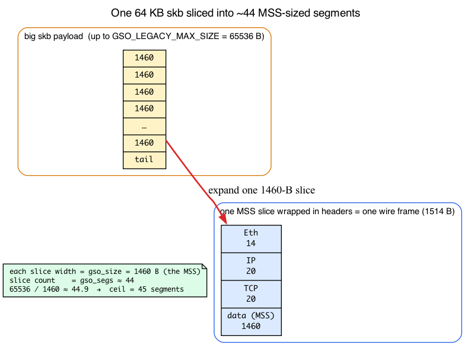
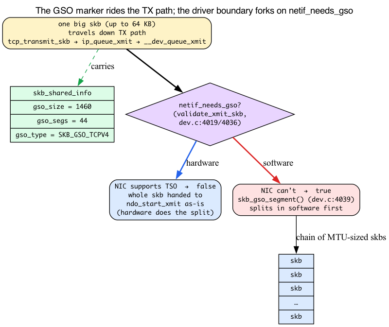
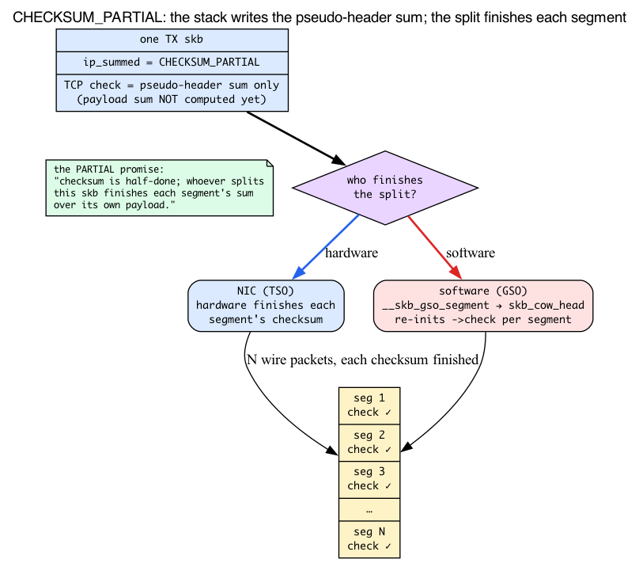

# Day 4 — GRO, GSO, TSO: segmentation offloads

> **Today's mission:** understand why a single skb that enters `ip_rcv` may represent 40+ wire packets, and why the kernel writes one 64 KB skb on TX. You'll meet the *segmentation unit* (MSS), the three-field GSO marker the kernel stamps into every big skb, and the checksum contract that lets hardware finish the job — then watch all of it move under bpftrace. Total time: ~110 minutes.

## The problem

Ethernet has an MTU of 1500 bytes. Most NICs can handle up to ~9000 bytes (jumbo frames) but not more. So one TCP connection sending a gigabyte through the kernel produces ~700,000 wire packets.

If the kernel ran its **full TCP send code path** (queue, build header, route lookup, qdisc, driver — the entire Day 3 journey) once per wire packet, the per-packet overhead would crush throughput. Same on RX: 700,000 calls up the Day 2 receive path is too many.

Three offload technologies move this work to either hardware or batched software so the stack runs at *aggregate* rate, not *per-segment* rate.


But before any of them make sense, you need to know the **size of the chunk** they all count in. The intro promised "40+ wire packets from one skb" — that number isn't magic, it's arithmetic, and the unit underneath it is the **MSS**.

## Background 1: MTU, MSS, and the segmentation unit

You already know **MTU** — Day 3's TX path ended at the wire, and the intro above names it: the **largest L2 payload the link will carry**, 1500 bytes on standard Ethernet. That's the cap on one *frame's* contents.

But TCP doesn't think in frames; it thinks in **segments**. So there's a second number, derived from the MTU, that every offload in this chapter actually counts in: the **MSS — Maximum Segment Size.** It's the largest *TCP payload* one segment may carry, and it's just the MTU with the headers subtracted:

```
MSS = MTU − IP header − TCP header
    = 1500 − 20 − 20
    = 1460 bytes        (no-options IPv4)
```

That's it. One Ethernet frame holds 1500 bytes of L2 payload; of those, 20 go to the IP header and 20 to the TCP header, leaving **1460 bytes of actual data**. So the wire packet a full segment becomes is 1460 (data) + 20 (TCP) + 20 (IP) + 14 (Ethernet) = **1514 bytes** on the wire.

Two things make MSS less of a constant than it looks:

- **It's per-connection, not global.** MSS is negotiated at SYN time (each side advertises what it can receive) and **recomputed when the path MTU changes** (PMTU discovery). A connection over a tunnel, or one that hit an ICMP "fragmentation needed," runs a *smaller* MSS. So there is no single system-wide MSS — each connection carries its own.
- **The kernel stores the value the segmenter must use, per-skb.** Because MSS is per-connection and can change mid-flight, the segmentation step does **not** recompute "MTU minus headers" on the fly. The TCP TX path writes the MSS that applies to *this* skb into the skb itself, and the segmenter reads it back out. (That stored field is `gso_size` — Background 2.)

### The arithmetic the whole chapter rests on

Now do the calculation once, because it's the multiplier behind every histogram in today's lab. The kernel builds **one big skb** carrying up to ~64 KB of payload (we'll pin down that bound in a moment). At MSS 1460:

```
65536 bytes / 1460 bytes-per-segment ≈ 44.9  →  ceil = 45 segments
```

So **one 64 KB skb becomes ~44 wire packets** — and the stack ran its TX path *once* to produce all of them. That is the "40+ wire packets from one skb" the intro promised, and the coalescing ratios you'll watch under bpftrace are this number running in reverse on RX.

Where does the per-skb MSS live, and where does the 64 KB ceiling come from? Two anchors:

- The segmenter reads the per-skb MSS via **`tcp_skb_mss()`** (`include/net/tcp.h:1214`), which simply returns `TCP_SKB_CB(skb)->tcp_gso_size` — the value TCP stashed in the skb's control block.
- The "one big skb" is bounded by **`GSO_LEGACY_MAX_SIZE = 65536u`** (`include/linux/netdevice.h:2446`) and **`GSO_MAX_SEGS = 65535u`** (`netdevice.h:2445`). That 65536 is the "64 KB" this chapter quotes everywhere.

> **Keep MTU and MSS straight.** This chapter switches between "MTU-sized skbs" (what GSO *outputs*) and "MSS-sized chunks" (how TSO is described) within a couple of paragraphs. They name the **same wire packet** from two ends: an MSS-sized *payload* (1460 B) wrapped in headers *is* an MTU-sized *frame* (1500 B of L2 payload). When you read "MSS-sized chunk," picture the 1460 bytes of data; when you read "MTU-sized skb," picture the same thing plus its IP/TCP headers.



## Background 2: the GSO marker — `gso_size`, `gso_segs`, `gso_type`

Here is the structure the whole chapter quietly depends on. When the kernel decides an skb should be segmented *later*, it doesn't change the skb's shape — it just leaves a **three-field note** in the one place every layer of the stack already carries: the **`skb_shared_info`** trailer you met on Day 1 (the thing that sits past the linear buffer's `end` and holds `nr_frags`, `frags[]`, `frag_list`).

Day 1 taught those fragment fields. It did **not** teach the three GSO fields living in the same struct. They are:

```c
struct skb_shared_info {
        /* ... nr_frags, frags[] from Day 1 ... */
        unsigned short  gso_size;   /* include/linux/skbuff.h:598 — MSS each segment carries */
        unsigned short  gso_segs;   /* skbuff.h:600 — how many segments this becomes */
        struct sk_buff  *frag_list; /* skbuff.h:601 — the Day 1 frag-list chain */
        unsigned int    gso_type;   /* skbuff.h:606 — bitmask naming the protocol */
};
```

Read them as a recipe:

- **`gso_size`** = the MSS each output segment should carry (1460 in our example). This is the per-skb MSS from Background 1 — the value the segmenter reads instead of recomputing MTU minus headers.
- **`gso_segs`** = how many segments this one skb will become (~44). This is the number today's "What to break/observe" bullets tell you to multiply by when you want true per-wire-packet counts.
- **`gso_type`** = a **bitmask** naming the protocol, so the right segmentation callback is chosen. The bits are defined in `skbuff.h`: **`SKB_GSO_TCPV4 = 1 << 0`** (`skbuff.h:669`), **`SKB_GSO_DODGY = 1 << 1`** (`skbuff.h:672`, "this came from an untrusted source, validate it"), **`SKB_GSO_TCPV6 = 1 << 4`** (`skbuff.h:679`).

So when the prose says an skb is "marked with `SKB_GSO_TCPV4`," it means **`gso_type` has that bit set**. And when later text says the path "detects the GSO marker," the literal test is `skb_is_gso(skb)` (`skbuff.h:5267`), which in v7.1 returns `skb_shinfo(skb)->gso_size` — a non-zero `gso_size` *is* "this skb wants segmenting."

### Who writes the marker

The TCP transmit path stamps it, right before handing the skb down the Day 3 path. In `tcp_transmit_skb`:

```c
skb_shinfo(skb)->gso_segs = tcp_skb_pcount(skb);   /* net/ipv4/tcp_output.c:1704 */
skb_shinfo(skb)->gso_size = tcp_skb_mss(skb);      /* tcp_output.c:1705 */
```

That's the key move. TCP fills in `gso_size = MSS` and `gso_segs = segment count`, and then the **same struct rides unchanged** through `ip_queue_xmit` → `__dev_queue_xmit` → qdisc → driver, exactly the journey Day 3 described. The skb carries its own segmentation recipe the whole way down; nothing in between has to understand it.

### Who reads the marker, and the TSO-vs-GSO switch

The decision happens at the very bottom of the Day 3 TX path, in **`validate_xmit_skb()`** (`net/core/dev.c:4019`), called from the qdisc dequeue / `sch_direct_xmit` path right before the driver. It asks one question — **`netif_needs_gso(skb, features)`** (`dev.c:4036`):

- **NIC can segment this `gso_type` in hardware (TSO).** The big skb is handed to the driver's `ndo_start_xmit` **as-is** — hardware does the split. `netif_needs_gso` returns false; nothing else happens.
- **NIC can't (GSO).** The kernel calls **`skb_gso_segment()`** (`dev.c:4039`) to split the skb in software *before* the driver sees it.

This is the single switch that unifies the three technologies this chapter presents as separate: **`gso_type` + NIC capability**. It's the *same big skb* either way — the only question is whether **hardware or software** does the split. Hold that idea; everything below is a special case of it.


Zoom in on that fork — the big skb's GSO marker is the only thing that decides hardware-vs-software:



## Background 3: `ip_summed` and checksum offload

There's one more contract a big skb carries, and the checksum Q&A at the end of this chapter leans on it entirely: **`skb->ip_summed`**, which records *who is responsible for the checksum* — the stack or the NIC. Day 2 mentioned "checksum if not hw-validated" inside `ip_rcv_core` but never defined the states, so here they are. There are exactly four (`include/linux/skbuff.h:248–251`):

```c
#define CHECKSUM_NONE         0   /* nobody has computed/verified it */
#define CHECKSUM_UNNECESSARY  1   /* RX: NIC already verified — stack may skip */
#define CHECKSUM_COMPLETE     2   /* RX: NIC handed up a raw sum for the stack to fold in */
#define CHECKSUM_PARTIAL      3   /* TX: stack wrote the pseudo-header sum; NIC finishes it */
```

The kernel's own header documents this contract in a long comment block (`skbuff.h:98–136`). Two of these states are RX-side (`UNNECESSARY`, `COMPLETE`) — the NIC telling the stack what it already checked. The one that matters for segmentation is the TX-side **`CHECKSUM_PARTIAL`**.

### Why offloads *require* `CHECKSUM_PARTIAL`

Think about it: a GSO/TSO skb has **no per-segment checksums yet** — they *can't* exist, because the segments themselves don't exist until the split happens. So what does the stack put in the checksum field of the one big skb?

It puts the **pseudo-header checksum** (the part computed over the IP addresses, protocol, and length — everything *except* the payload), and sets `ip_summed = CHECKSUM_PARTIAL`. That state is a **promise**: "the checksum is half-done; whoever splits this skb will finish each segment's checksum over its payload." For **TSO** the NIC finishes it; for **GSO** the software segmenter finishes it during the split. The header spells out this coupling directly: if `gso_type` is `SKB_GSO_TCPV4`/`V6`, TCP checksum offload is implied, and `ip_summed` is `CHECKSUM_PARTIAL` (`skbuff.h:239–242`).

This is exactly why the TSO-vs-GSO switch from Background 2 also reads `ip_summed`. Look again at `netif_needs_gso` (`include/linux/netdevice.h:5480`):

```c
return skb_is_gso(skb) && (!skb_gso_ok(skb, features) ||
        unlikely((skb->ip_summed != CHECKSUM_PARTIAL) &&
                 (skb->ip_summed != CHECKSUM_UNNECESSARY)));
```

A GSO skb whose checksum is **not** `PARTIAL` (or `UNNECESSARY`) can't be safely handed to hardware as-is, so it's forced down the **software** segmentation path. Hardware-capability *and* the checksum contract together pick TSO over GSO.

And it's why the segmenter re-initialises the checksum field per segment. **`__skb_gso_segment()`** (`net/core/gso.c:88`) calls `skb_cow_head()` precisely so it can write a fresh `->check` field into each new TCP/UDP header (`gso.c:97`, "We're going to init ->check field in TCP or UDP header"): the original skb carried only the *partial* (pseudo-header) sum, so every segment needs its real checksum finished. That's the concrete reason the Q&A below tells you to read `__skb_gso_segment` when you debug a checksum issue.

> One more parallel: checksum offload is itself an ethtool feature (`rx-checksumming` / `tx-checksumming`), sitting right next to the segmentation features today's lab toggles. They interact — disabling tx-checksumming can disturb segmentation, because a non-`PARTIAL` skb gets pushed off the TSO path.



## TSO — TCP Segmentation Offload

Now TSO reads as a special case of the switch. The kernel hands the NIC **one large skb** (up to 64 KB — `GSO_LEGACY_MAX_SIZE`) whose `gso_type` has `SKB_GSO_TCPV4` (or `SKB_GSO_TCPV6`) set and whose `ip_summed` is `CHECKSUM_PARTIAL`. Because the NIC's feature flags say it can segment that `gso_type`, `netif_needs_gso` returns false and the big skb goes straight to `ndo_start_xmit`. The NIC's hardware then:

1. Reads the skb's TCP header as a template.
2. Walks the payload in **MSS-sized chunks** (= `gso_size` bytes each — Background 1).
3. For each chunk, builds an IP+TCP header (cloning the template, advancing the TCP sequence number, incrementing the IP id, **finishing the checksum** the `CHECKSUM_PARTIAL` promise left half-done), prepends the Ethernet header, transmits. (Fields like TTL are copied straight from the template — every segment of one flow carries the *same* TTL; only seq, IP id, length, and checksum change per segment.)

Result: ~44 wire packets, **one** kernel call to `ndo_start_xmit`. Per-packet stack overhead drops ~44×.

Enable/check:

```bash
ethtool -k eth0 | grep tcp-segmentation-offload
# tcp-segmentation-offload: on
ethtool -K eth0 tso off
```

(The feature is named `tcp-segmentation-offload`, not `tso` — grepping for `tso` matches nothing.)

NIC must support it (most modern NICs do).

## GSO — Generic Segmentation Offload

Same big skb, same marker — but the NIC *can't* segment this `gso_type`, so the split happens **in software**, late in the TX path. Recall the qdisc → `ndo_start_xmit` boundary from Day 3: the big GSO skb rides that path unchanged, and segmentation is bolted onto the very end of it.

1. TCP builds one big skb just like for TSO, stamping `gso_size`/`gso_segs`/`gso_type` (Background 2).
2. The skb travels down through `tcp_transmit_skb`, `ip_queue_xmit`, `dev_queue_xmit` as if it were a single packet — exactly the Day 3 journey.
3. Just before `ndo_start_xmit`, in `validate_xmit_skb()` (`net/core/dev.c:4019`), `netif_needs_gso()` (`dev.c:4036`) sees the NIC can't do it and calls `skb_gso_segment()` (`dev.c:4039`) → **`__skb_gso_segment` (`net/core/gso.c:88`)**, which splits the skb into a chain of MTU-sized skbs (the L2 split runs through `skb_mac_gso_segment`, `gso.c:37`; the TCP-specific callback is `tcp_gso_segment`, `net/ipv4/tcp_offload.c:133`).
4. The driver receives the chain and transmits each.

GSO is universal — works on any NIC. The CPU cost of segmentation is real but smaller than running the full stack per packet.

## GRO — Generic Receive Offload

The receive-side counterpart. **Recall the NAPI poll loop and the `napi_gro_receive` → `gro_receive_skb` funnel from Day 2:** GRO runs *inside* the driver's NAPI poll, after `XDP_PASS` turns DMA bytes into an skb and before the stack entry. (Day 2 also established *why* you trace `gro_receive_skb` and not `napi_gro_receive` — the latter is a `static inline` in `include/linux/netdevice.h:4286`, not fentry-traceable; the exported entry is `gro_receive_skb` at `net/core/gro.c:636`, and the workhorse is `dev_gro_receive` at `gro.c:474`.)

The GRO engine compares each new skb against a list of "in flight" same-flow skbs. If it can merge (consecutive sequence numbers, same flow tuple, no flag changes), it appends payload to the existing one **as page fragments** (`skb_gro_receive`, `gro.c:92` — never by growing the linear data buffer). Recall the linear-head + page-frags model from Day 1: a 64 KB GRO superpacket is a tiny linear header plus a chain of page frags, *never* a 64 KB contiguous allocation. (There's a second assembly form — `skb_shared_info.frag_list` (`skbuff.h:601`, tested by `skb_has_frag_list()` at `skbuff.h:4206`) chains *whole skbs* rather than the `frags[]` page array; some GSO/frag-list paths use it. One line is enough — the `frags[]` model is the one you'll meet most.)

Result: one `ip_rcv` call for what was ~44 wire packets.

Flush triggers:
- Different flow arrives.
- Timeout (per-device `/sys/class/net/<dev>/gro_flush_timeout`, or per-NAPI via netlink).
- **NAPI poll exits** — the GRO accumulator lives per-NAPI (`napi->gro`), so it must drain before the softirq yields the CPU.
- Special flag (FIN, RST, PSH).

> ### There are no Dumb Questions
>
> **Q: Why doesn't TSO break TCP correctness?**
>
> A: Because the segmenting NIC produces *correct wire packets* — same as if the kernel did it. From a peer's perspective, traffic is indistinguishable. Only the local stack saves work. Same for GRO: the merged skb has the same bytes as the original segments would; the local stack just sees them as one.
>
> **Q: When should I disable these?**
>
> A: For **latency-sensitive** measurements (HFT, microsecond timing, packet capture for forensics) — GRO can hold a packet briefly waiting for a possible merge buddy. Cost is usually <100 µs but visible. For **per-packet observability** (BPF programs that need to see wire packets) — GRO at the driver hides them.
>
> **Q: How does GSO interact with checksum offload?**
>
> A: Closely — and Background 3 already gave you the machinery. The short version: no per-segment sums exist before the split, so the stack ships `CHECKSUM_PARTIAL` (pseudo-header sum only) and the splitter finishes each one — the NIC for TSO, `__skb_gso_segment` for GSO. It's also why `netif_needs_gso` forces a non-`PARTIAL` skb down the software path. Re-read Background 3 if a checksum bug bites.

## Pitfalls when offloads are on


The biggest gotcha is **observability**. If you trace `ip_rcv` and count packets, you're counting GRO superpackets, not wire packets. Multiply by `skb_shinfo(skb)->gso_segs` (Background 2 — the segment count the kernel stamped in) if you have it; or disable GRO during measurement.

For BPF programs that hook into the stack (XDP runs *before* GRO; tc-bpf runs *after*), this matters: XDP sees per-segment, tc sees coalesced.

## Today's experiment

### See offload state

```bash
ethtool -k eth0 | grep -E "segmentation-offload|receive-offload"
```

Output (typical):
```
tcp-segmentation-offload: on
generic-segmentation-offload: on
generic-receive-offload: on
large-receive-offload: on
```

The feature *names* are `tcp-segmentation-offload` / `generic-*-offload` — they don't contain the
substrings `tso`/`gso`/`gro`, so a `grep -E "tso|gso|gro"` would match only unrelated lines and never
print these. Match the real names. (`large-receive-offload` is the hardware LRO cousin of GRO; it may
read `off` or `off [fixed]` on NICs that don't support it.)

### Watch GRO in action

GRO coalesces many wire packets into one superpacket, so the *entry* probe (`gro_receive_skb`) fires
once per arriving segment, while the *post-GRO* probe fires far fewer times with much larger skbs. We
watch both the lengths and the call counts:

```bash
sudo bpftrace -e '
fentry:gro_receive_skb {
  @gro_lengths = lhist(args->skb->len, 0, 65536, 8192);
  @gro_calls = count();
}
tracepoint:net:netif_receive_skb {
  @postgro_lengths = lhist(args->len, 0, 65536, 8192);
  @postgro_calls = count();
}
interval:s:8 { exit(); }' &

# While that window is open, pull a real bulk download (server-less, follows redirects).
curl -sL -o /dev/null --max-time 6 \
  https://cloud-images.ubuntu.com/releases/24.04/release/ubuntu-24.04-server-cloudimg-amd64.img
wait
```

Run the download *inside* the bpftrace window, so background the tracer (`&`) and `wait`. Typical output
(numbers scale with the transfer):

```
@gro_calls: 237409          <- once per arriving segment, mostly small
@gro_lengths:
[0, 8K)           219020 |@@@@@@@@@@@@@@@@@@@@@@@@@@@@@@@@@@@@@@@@@@@@@@@@@@@@|
[8K, 16K)          11732 |@@                                                |
 ...
@postgro_calls: 30527       <- ~8x fewer: GRO merged ~8 segments per superpacket
@postgro_lengths:
[0, 8K)            11056 |@@@@@@@@@@@@@@@@@@@@@@@@@@@@@@@@@@@@@@@@@@@@@@@@@@@@|
[8K, 16K)           7203 |@@@@@@@@@@@@@@@@@@@@@@@@@@@@@@@@                  |
[56K, 64K)          3260 |@@@@@@@@@@@@@@@                                    |
```

The story is in the two `*_calls`: `gro_calls` ≫ `postgro_calls` (here ~8:1) is the coalescing ratio,
and `postgro_lengths` spreads into the big buckets — those are the merged superpackets the stack
processes once instead of eight times.

> **Why `netif_receive_skb` and not `ip_rcv`?** `tracepoint:net:netif_receive_skb` is the post-GRO entry
> into the stack and fires on every NIC. `fentry:ip_rcv` works on bare-metal NICs but on many virtual
> NICs (cloud/virtio) it attaches yet never fires — you'd see an empty histogram and wrongly conclude
> GRO is off. Use the tracepoint; add `fentry:ip_rcv { @ip = lhist(args->skb->len,0,65536,8192); }` too
> if you want to confirm it on bare metal.

### Disable GRO and re-measure

Now turn GRO off and run the *same* observation. The contrast is the whole point:

```bash
sudo ethtool -K eth0 gro off

sudo bpftrace -e '
tracepoint:net:netif_receive_skb {
  @postgro_lengths = lhist(args->len, 0, 65536, 8192);
  @postgro_calls = count();
} interval:s:8 { exit(); }' &
sleep 1
curl -sL -o /dev/null --max-time 6 \
  https://cloud-images.ubuntu.com/releases/24.04/release/ubuntu-24.04-server-cloudimg-amd64.img
wait

# Always restore — leaving GRO off slows every later experiment:
sudo ethtool -K eth0 gro on
```

With GRO off, `postgro_calls` jumps roughly back to the segment count (here ~233 000 vs ~30 000 with GRO
on — an ~8x increase), and `postgro_lengths` collapses almost entirely into the `[0, 8K)` bucket: the
stack now runs once per wire-sized packet instead of once per superpacket. That extra per-packet work is
the CPU cost GRO was hiding.

### Per-segment counter

TSO is a *transmit* offload: the stack hands the NIC large skbs and the NIC segments them onto the wire.
So you need an **upload** to see it (a download's TX side is just small ACKs). Watch the size of skbs
entering the device queue while pushing data out:

```bash
sudo bpftrace -e 'fentry:__dev_queue_xmit {
  @tx_skb_len = lhist(args->skb->len, 0, 65536, 8192);
} interval:s:6 { exit(); }' &

# Server-less upload sink; --max-time bounds it, the timeout exit is expected (|| true).
curl -s -o /dev/null -T /dev/zero --max-time 4 https://speed.cloudflare.com/__up || true
wait
```

Typical output — a strong spike in the top bucket, the 64 KB GSO/TSO skbs the stack handed down:

```
@tx_skb_len:
[0, 8K)              206 |@@@@@@                                            |
[8K, 16K)            120 |@@@                                               |
 ...
[56K, 64K)          1660 |@@@@@@@@@@@@@@@@@@@@@@@@@@@@@@@@@@@@@@@@@@@@@@@@@@@@|
```

Each of those ~64 KB skbs becomes ~40+ MTU-sized wire packets (that's `gso_segs` from Background 2), but
the stack ran its TX path **once** per skb. You can see the multiplication in the NIC counters too — the
wire-packet count climbs far faster than the skb count:

```bash
ethtool -S eth0 | grep -iE 'tx_packets|tx_queue.*packets'   # NIC's per-queue / aggregate wire packets
cat /sys/class/net/eth0/statistics/tx_packets               # kernel-level tx_packets
```

The field is named `tx_packets` / `tx_queue_N_packets` — **not** `tx_pkts`, which matches nothing on any
driver. Counter layout is driver-specific: on virtualized NICs (e.g. Azure/`mlx5` VF) the
`tx_queue_N_packets` lines may read `0` and the real counts live in `vf_tx_packets` / `cpuN_tx_packets`.

---

## What to read in the kernel

- **`net/core/gso.c`** — segmentation engine. ~300 lines. `__skb_gso_segment` is the entry (`gso.c:88`); `skb_mac_gso_segment` does the L2 split (`gso.c:37`); note the `skb_cow_head` call (`gso.c:97`) that re-inits each segment's checksum field.
- **`net/core/gro.c`** — coalescing engine. ~800 lines. `dev_gro_receive` is the workhorse (`gro.c:474`); `gro_receive_skb` is the exported entry (`gro.c:636`); `napi_gro_receive` itself is a `static inline` in `netdevice.h:4286`; per-protocol callbacks (`tcp4_gro_receive`) live in protocol files.
- **`net/ipv4/tcp_offload.c`** — TCP-specific GRO/GSO callbacks; `tcp_gso_segment` at `tcp_offload.c:133`.
- **`include/linux/netdev_features.h`** — `NETIF_F_GSO_*`, `NETIF_F_TSO_*`, `NETIF_F_GRO_*` flags.
- **`include/linux/skbuff.h`** — the GSO marker in `skb_shared_info`: `gso_size` (598), `gso_segs` (600), `gso_type` (606); the `SKB_GSO_*` bits (`SKB_GSO_TCPV4` at 669); the `ip_summed` contract (`CHECKSUM_*` at 248–251, documented 98–136).
- **`net/core/dev.c`** — the TX split site: `validate_xmit_skb` (4019), `netif_needs_gso` test (4036), `skb_gso_segment` (4039).
- **`Documentation/networking/segmentation-offloads.rst`** — official guide.

---

## Bullet Points

- **MSS** = MTU − IP − TCP = 1500 − 20 − 20 = **1460 B** (no-options IPv4) — the chunk size every offload counts in. It's **per-connection**, stored per-skb so the segmenter reads it (`tcp_skb_mss()`, `tcp.h:1214`) instead of recomputing. 64 KB / 1460 ≈ **44 segments** from one skb.
- **The GSO marker** lives in `skb_shared_info`: `gso_size` (MSS, `skbuff.h:598`), `gso_segs` (count, 600), `gso_type` (protocol bitmask, 606). TCP stamps it in `tcp_transmit_skb` (`tcp_output.c:1704–1705`); the same big skb then rides the Day 3 TX path unchanged.
- **One switch unifies all three:** `gso_type` + NIC capability. `validate_xmit_skb` → `netif_needs_gso` (`dev.c:4019/4036`) hands the whole skb to hardware (TSO) or calls `skb_gso_segment` (`dev.c:4039`) for a software split (GSO).
- **`ip_summed`** is the checksum contract (`CHECKSUM_NONE/UNNECESSARY/COMPLETE/PARTIAL`, `skbuff.h:248–251`). Offloads require **`CHECKSUM_PARTIAL`** on TX: the stack writes only the pseudo-header sum and each segment's real checksum is finished after the split (NIC for TSO, `__skb_gso_segment`→`skb_cow_head` for GSO).
- **TSO**: hardware segments large skbs into wire packets. Saves stack overhead ~44×.
- **GSO**: software segmentation late in TX (`net/core/gso.c:__skb_gso_segment`, `gso.c:88`). Same stack savings as TSO; works on any NIC.
- **GRO**: receive-side coalescing in the NAPI poll (`net/core/gro.c:dev_gro_receive`, `gro.c:474`) — recall the Day 2 funnel. One stack pass per superpacket; payload appended as page frags (Day 1) or, less commonly, chained via `frag_list`.
- All three controlled with `ethtool -K`. **Default ON** for all three on modern NICs.
- Side effects: **per-packet observability is wrong unless you disable GRO** or multiply by `skb_shinfo(skb)->gso_segs`.
- For latency-critical workloads, sometimes GRO is disabled (sub-100µs latency floor).

---

## Check question

You run `iperf3` and for the first instant of a transfer the reported throughput briefly reads *above* the NIC's line rate, then settles. What's happening?

<details>
<summary>Click to reveal answer</summary>

**Answer:** iperf3 measures bytes through the userspace socket, not bytes on the wire. At the very start of a transfer the kernel's socket send buffer absorbs a burst of writes faster than the NIC can drain them — the application's bytes-per-second momentarily reflects how fast data entered the socket buffer, not how fast it left the wire. Once the buffer fills and TCP is paced by ACKs, the reading settles to the true wire rate (bounded by the NIC). TSO contributes to the illusion: those buffered bytes leave the kernel in 64 KB skbs that the NIC segments, so the "stack-level throughput" spikes briefly before flow control clamps it. Steady-state iperf3 throughput tracks wire rate.

</details>

---

## Tomorrow

Day 5: network namespaces. Why a single kernel can run dozens of independent network stacks at once, and how `struct net` makes it work.
