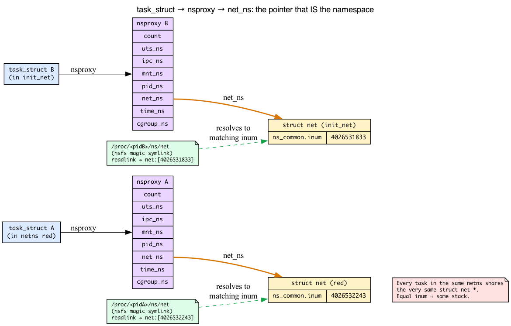
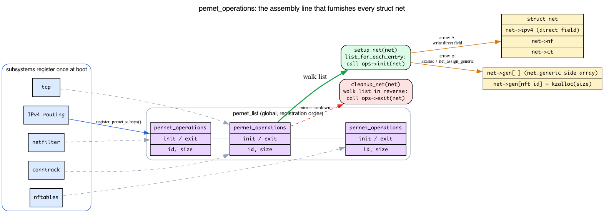
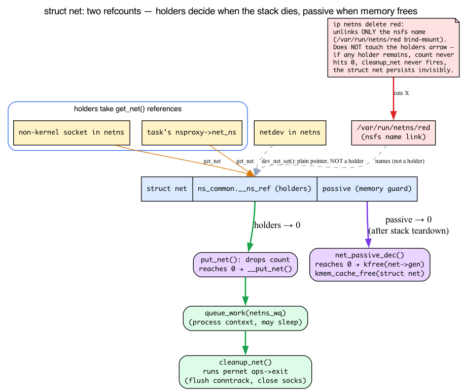

# Day 5 — Network namespaces and `struct net`

> **Today's mission:** understand what a *namespace* even is, how a process is bound to one, and how the kernel keeps multiple independent network stacks isolated. Then create a network namespace, give it a virtual interface, run a process inside it, and watch one get born and die under bpftrace. End of Phase 1. Total time: ~110 minutes.

## What a namespace IS (before we touch the network kind)

Days 1–4 never said the word *namespace*, so let's build the idea from scratch — it's the one piece of background everything today rests on.

A **namespace** is a kernel-wide *scoping* mechanism. Take one global resource — say, "the list of network interfaces," or "the set of mounted filesystems," or "the table of process IDs" — and make it appear as **N independent copies** instead of one shared thing. Two processes in different namespaces of the same kind look at the same global resource and each sees a private, isolated view. It's the same trick a hypervisor plays with whole machines, except the kernel does it per-resource, in software, with almost no overhead.

Linux has several **kinds** of namespace, each scoping a different resource:

| Namespace | Scopes |
|---|---|
| `mnt` | the mount table (which filesystems are visible where) |
| `pid` | process IDs (PID 1 inside ≠ PID 1 outside) |
| `net` | **the entire network stack** — today's topic |
| `uts` | hostname and domain name |
| `ipc` | System V IPC / POSIX message queues |
| `time` | clock offsets (boottime, monotonic) |
| `cgroup` | the cgroup root a process sees |

A container is, at bottom, just a process whose `mnt`, `pid`, `net`, … pointers have been swapped to fresh namespaces. There is no "container" object in the kernel — there's a process holding a bundle of namespace pointers. Today we care about exactly one of those pointers: **net**.

The **network namespace** scopes the whole stack. Each one has its own:

- list of network interfaces,
- routing tables,
- netfilter rules (the kernel's packet-filtering/firewall framework; nftables is its modern ruleset),
- sockets and bound ports,
- proc/sysctl views,
- conntrack table (connection tracking — the kernel's record of active flows, used by NAT and stateful firewalling).

This is what makes containers and VMs (with TAP/MACVTAP) practical. Every Docker/Podman/Kubernetes pod runs in its own netns. Linux can spin up tens of thousands of them at once.

### How a process is bound to its namespaces: `nsproxy`

So where does a process *keep* the pointer that says "this is my netns"? Not directly in `task_struct`. Every task points at a small shared bundle called **`struct nsproxy`**, which holds one pointer per namespace kind:

```c
/* include/linux/nsproxy.h:32 */
struct nsproxy {
	refcount_t count;
	struct uts_namespace *uts_ns;
	struct ipc_namespace *ipc_ns;
	struct mnt_namespace *mnt_ns;
	struct pid_namespace *pid_ns_for_children;
	struct net           *net_ns;        /* <-- the network namespace */
	struct time_namespace *time_ns;
	struct time_namespace *time_ns_for_children;
	struct cgroup_namespace *cgroup_ns;
};
```

The field that matters today is **`net_ns`**, a `struct net *`. **Every task in the same netns shares the very same `struct net *`** — that pointer *is* the namespace. The `nsproxy` itself is refcounted (`count`) and shared between tasks that happen to have identical namespace bundles, which is why fork without `CLONE_NEW*` is cheap: the child just bumps the parent's `nsproxy`.

So the chain you'll see in code is: `task_struct → nsproxy → net_ns → struct net`. When kernel code wants "the current task's network namespace" it walks exactly that path (the helper is `current->nsproxy->net_ns`, usually behind `sock_net(sk)` or `dev_net(dev)`).



### `struct net` — one per namespace


Each namespace is one **`struct net`** (defined at `include/net/net_namespace.h:62`). Kernel networking functions take `struct net *net` as a first-class parameter — anywhere a function needs a routing table, a netfilter chain, a port allocator, it's looked up via `net`. (We'll see *why* that one pointer is enough to reach every subsystem's per-ns state when we get to `pernet_operations` below.)

The "default" namespace at boot is **`init_net`** (`net/core/net_namespace.c:49`: `struct net init_net;`). The kernel's first netdev (loopback, then physical NICs) all start there. New namespaces are empty until you put devices in them.

### The inode that names a namespace: `ns_common` and nsfs

Here's the part that makes today's first lab make sense. Embedded inside `struct net` is a small common header shared by *all* namespace kinds:

```c
/* include/net/net_namespace.h:97 — inside struct net */
struct ns_common	ns;
```

And `ns_common` carries the namespace's **identity**, an inode number:

```c
/* include/linux/ns/ns_common_types.h:111 */
struct ns_common {
	struct { refcount_t __ns_ref; } ____cacheline_aligned_in_smp;
	u32 ns_type;
	struct dentry *stashed;
	const struct proc_ns_operations *ops;
	unsigned int inum;          /* <-- the unique identity */
	/* ... */
};
```

That `inum` is a unique inode number assigned when the namespace is created. Be careful about *which* identity it is, though. **Internally, the kernel identifies a namespace by its `struct net *` pointer, not by `inum`.** "Are these two in the same netns?" is answered by `net_eq(net1, net2)`, which is literally `return net1 == net2` (`include/net/net_namespace.h:302`) — a pointer compare — and same-netns checks throughout the stack (e.g. `inet_bind_bucket` matching) call `net_eq` on pointers. The `inum` is the **userspace-facing** name, surfaced through nsfs as `net:[<inum>]`. Because each live `struct net` is assigned a unique `inum`, userspace *can* compare two `net:[...]` strings to answer "same netns?" and get the right answer **for currently-live namespaces** — but that is a userspace convenience built on a 1:1 mapping, not the comparison the kernel itself performs. (Inums are also recycled once a namespace is freed — the `ns_common` comment notes inum is "quickly recycled for non-initial namespaces" — so an inum is a stable identity only among live namespaces, whereas the pointer is the authoritative live key.)

How do you *see* that number from userspace? Through **nsfs**, a tiny internal pseudo-filesystem whose only job is to expose namespaces as files. Each kind of namespace shows up as a **magic symlink** under `/proc/<pid>/ns/`. Reading the `net` one (`readlink /proc/<pid>/ns/net`) prints `net:[<inum>]`. Same `inum` ⇒ same namespace; different `inum` ⇒ different `struct net`. That's the entire mechanism behind the metadata lab later in this chapter.

The boot namespace `init_net` gets a **well-known, fixed** inode number rather than a freshly allocated one — `NET_NS_INIT_INO = 0xEFFFFFF9` (`include/uapi/linux/nsfs.h:54`), wired in through `ns_init_inum()` (`include/linux/ns/ns_common_types.h:144`). So on every Linux box, init_net's `net:[...]` ends in the same number; only the namespaces *you* create get fresh ones.

> ### There are no Dumb Questions
>
> **Q: Is the loopback per-ns?**
>
> A: Yes. Each ns gets its own `lo`. So `127.0.0.1` in ns A is unrelated to `127.0.0.1` in ns B. Two processes (one in each) can both `bind()` 127.0.0.1:80 without conflict.
>
> **Q: Can ns A see ns B's traffic?**
>
> A: Only via *connecting devices*. Common patterns: a `veth` pair (two virtual NICs that act as a wire — one in each ns), a Linux bridge that interconnects veths in init_net, or a physical NIC moved to one ns.
>
> **Q: Where does shared state live?**
>
> A: Hardware (NICs themselves), slab caches (sk_buff allocations are kernel-wide — recall the `skbuff_head_cache` and per-CPU `napi_alloc_cache` from Day 1), the scheduler. A NIC is per-ns in the sense that its `dev->nd_net` points to one ns — but the underlying hardware is one physical thing.

## Setting up a netns

Linux exposes ns operations via `iproute2`:

```bash
# Create namespace 'red'
sudo ip netns add red

# Run a shell in it
sudo ip netns exec red bash

# (in that shell) network is empty:
ip link
# 1: lo: <LOOPBACK> ... state DOWN
ip route
# (nothing)
```

You're inside a fully isolated network stack. Bring up loopback, you can localhost ping yourself, but nothing else is reachable.

### Connecting to the outside

Two veth ends, one in each ns:

```bash
# in init_net:
sudo ip link add veth_red type veth peer name veth_red_peer
sudo ip link set veth_red_peer netns red

# inside 'red' (or use ip netns exec):
sudo ip netns exec red ip link set veth_red_peer up
sudo ip netns exec red ip addr add 10.99.99.2/24 dev veth_red_peer

# back in init_net:
sudo ip link set veth_red up
sudo ip addr add 10.99.99.1/24 dev veth_red

# now:
sudo ip netns exec red ping 10.99.99.1     # works
ping 10.99.99.2                              # works (init→red)
```


*The figure shows the general pattern — substitute `red` for "netns A" and `veth_red`/`veth_red_peer` for vethA0/vethA1.*

## How `struct net` is assembled: `pernet_operations`

We keep saying `struct net` "aggregates all per-ns subsystem state." But who *fills it in*? When `ip netns add red` runs, the kernel allocates one bare `struct net` — how do routing tables, netfilter chains, conntrack counters, and TCP state all appear inside it? And later, who tears them all back down? The answer is one elegant registration mechanism, and once you see it the chapter's central claim ("most kernel net functions take `struct net *net` first") stops being a slogan and becomes obvious.

### Intuition: subsystems register init/exit callbacks

Picture every networking subsystem — IPv4 routing, netfilter, conntrack, TCP, nftables — as a tenant that wants a private room in *every* `struct net` that will ever exist. At boot, each tenant signs up once by handing the core a pair of callbacks: "when a new netns is born, call my **init** to furnish my room; when it dies, call my **exit** to clear it out." The core keeps these signups in a list and replays them for every namespace.

The signup form is **`struct pernet_operations`**:

```c
/* include/net/net_namespace.h:459 */
struct pernet_operations {
	struct list_head list;
	int  (*init)(struct net *net);   /* :483 — furnish my per-ns state   */
	void (*pre_exit)(struct net *net);
	void (*exit)(struct net *net);   /* :485 — tear it down               */
	void (*exit_batch)(struct list_head *net_exit_list);
	void (*exit_rtnl)(struct net *net, struct list_head *dev_kill_list);
	unsigned int * const id;         /* :490 — net_generic slot id        */
	const size_t size;               /* :491 — bytes to allocate for it   */
};
```

A subsystem registers it with **`register_pernet_subsys()`** (`include/net/net_namespace.h:513`), which just appends the node to a global list called `pernet_list`. That's the whole registration. For example, IPv4 routing's `/proc` plumbing:

```c
/* net/ipv4/route.c:379 */
static struct pernet_operations ip_rt_proc_ops __net_initdata = { ... };
/* and registered at route.c:386 (plus sysctl_route_ops / ip_rt_ops / rt_genid_ops at :3782+) */
register_pernet_subsys(&ip_rt_proc_ops);
```

### Dispatch: `setup_net` walks the list

When a namespace is created, **`setup_net()`** walks `pernet_list` front-to-back and calls every registered `init`:

```c
/* net/core/net_namespace.c:436 */
static __net_init int setup_net(struct net *net)
{
	const struct pernet_operations *ops;
	/* ... */
	list_for_each_entry(ops, &pernet_list, list) {
		error = ops_init(ops, net);          /* :446 */
		if (error < 0)
			goto out_undo;
	}
	/* ... */
}
```

**This loop is the assembly line.** Each subsystem's `init` fills in its slice of per-ns state, one after another, in registration order. That's why a fresh namespace already has a working (if empty) routing table, netfilter hooks, and so on the instant `ip netns add` returns.

### Two ways to store per-ns state: direct field vs `net_generic`

Where does a subsystem *put* its state? There are two strategies, and the chapter's "What's per-ns" list mixes both:

1. **A direct field of `struct net`** — for hot, core subsystems the state is embedded right in the struct: `net->ipv4` (`net_namespace.h:138`), `net->nf` (`:149`), `net->ct` (`:151`), `net->nft` (`:154`). Fast to reach, no indirection.

2. **`net_generic` — a side array** — for everything else, baking a field into `struct net` for every module would bloat it. Instead, if a `pernet_operations` sets `id` and `size`, the dispatcher allocates the room on demand. Look at `ops_init`:

   ```c
   /* net/core/net_namespace.c:120 */
   static int ops_init(const struct pernet_operations *ops, struct net *net)
   {
       void *data = NULL;
       if (ops->id) {
           data = kzalloc(ops->size, GFP_KERNEL);          /* allocate the room */
           err = net_assign_generic(net, *ops->id, data);  /* :131 — stash pointer in net->gen */
       }
       /* ... */
       if (ops->init)
           err = ops->init(net);                            /* then furnish it */
   }
   ```

   The pointer lands in **`net->gen`** (`net_namespace.h:163`), a resizable array indexed by the subsystem's `id`. Code fetches it back with `net_generic(net, id)`. This is exactly what `nft_pernet(net)` does under the hood — which is why the chapter calls nftables state "net_generic-backed": it isn't a direct field, it lives in `net->gen[nft_id]`.

Either way, **everything reachable from one `struct net *`.** Direct field or `net->gen[id]`, a subsystem starts from that single pointer and finds *its* per-ns slice. *That* is the real reason "most kernel net functions take `struct net *net` as the first parameter" — the pointer is the key to every per-ns room in the building.

### Teardown is the mirror image

On destruction, `cleanup_net` (covered next) walks the same registrations and runs each `exit` callback — the matching "clear out the room" step. Because every registered subsystem must run its exit (flush conntrack, close sockets, free routing tables) one at a time, **deleting a busy namespace is slow**: it's a serial walk over every tenant's move-out.



## What's per-ns


The state per ns includes (the `struct net` figure above already previewed this inventory; here we mark which are direct fields vs net_generic-backed, now that you know the difference):

- **Routing**: `net->ipv4.fib_main`, `ipv4.fib_default`, `ipv6.fib6_main_tbl` — direct fields off `net->ipv4`. `ip route` only shows the current ns's table.
- **Netfilter**: `net->nf.hooks_ipv4[]` (per-hook arrays, direct field), `nft_pernet(net)->tables` (**net_generic-backed**), per-ns conntrack stats in `net->ct`. nftables and conntrack state are independent.
- **Sockets**: the TCP bind hashtable (`tcp_hashinfo.bhash[]`) is itself **global/shared**, not per-ns — isolation comes from each bind bucket recording its owning netns. `struct inet_bind_bucket` carries `ib_net`, the bucket-match test is `net_eq(ib_net(tb), net) && tb->port == port`, and the `net` pointer is mixed into the hash via `inet_bhashfn(net, port, ...)`. So two namespaces that both `bind()` `0.0.0.0:80` land in **separate buckets keyed by their `struct net`** inside the one shared table — same port, no conflict. (Only the *ehash* can optionally be made per-net via `tcp_child_ehash_entries`; `net->ipv4.tcp_death_row.hashinfo` is the per-net hashinfo pointer but it still points at the shared bind table by default.)
- **Sysctls**: most `net.ipv4.*` are per-ns (`tcp_congestion_control`, `rp_filter`, `ip_forward`).
- **proc/net**: each ns sees its own `/proc/net`, `/proc/sys/net`.

## The life and death of a `struct net`

The chapter's lifecycle lab traces a namespace being born (`copy_net_ns`/`setup_net`) and dying (`cleanup_net`). To read what you're seeing — and to understand *why* deleting a netns sometimes doesn't actually free it — you need the refcount model. Good news: it's the same rule you already learned on Day 1.

### Recall: the free-at-zero refcount

On Day 1 you saw `sk_buff` use a `refcount_t` (`skb->users`) that's bumped by `skb_get()` and dropped by `kfree_skb()`, freeing only when it hits zero. **`struct net` uses the identical pattern** — only the structure being guarded differs. There's nothing new to learn about *how* a refcount works; we're just applying it to namespaces.

### Tier 1: holders (`get_net` / `put_net`)

The primary count lives in the embedded `ns_common.__ns_ref`. Anything that needs the namespace to **stay alive** takes a reference:

- a **non-kernel socket** in that netns (`sk_alloc` → `get_net_track`; kernel sockets with `sk_net_refcnt == 0` take only the passive count, not a holder),
- a task's **nsproxy → net_ns** pointing at it (`copy_net_ns` takes a `get_net` for the non-`CLONE_NEWNET` case; a freshly created net starts with one `__ns_ref`),
- an open **FD or bind-mount** of the ns (the nsfs name keeps it pinned).

A **netdev does NOT hold a reference to its netns.** Its `nd_net` is a plain pointer: `dev_net_set()` → `write_pnet(&dev->nd_net, net)` (`netdevice.h:2774`) is a bare pointer write with no refcount — `grep -cE 'get_net\b|get_net_track' net/core/dev.c` returns 0. The only count a netdev ever touches is the *separate* passive (memory-guard) count, and only transiently inside `rtnl_net_dev_lock/unlock`. In fact the design is the opposite of "a device pins its netns": because devices do **not** hold the namespace alive, the teardown machinery must actively evict them. `default_device_ops` (registered via `register_pernet_device`) runs `default_device_exit_net` at teardown, which moves migratable physical devices back to `init_net` and deletes virtual ones (veth). That eviction code exists *precisely because* a netdev cannot keep a netns alive — if it could, any netns containing a device would never be freed.

`get_net(net)` bumps the count; `put_net(net)` drops it:

```c
/* include/net/net_namespace.h:276, :295 */
static inline struct net *get_net(struct net *net)
{
	ns_ref_inc(net);          /* bump ns_common.__ns_ref */
	return net;
}
static inline void put_net(struct net *net)
{
	if (ns_ref_put(net))      /* drop; true when it hit zero */
		__put_net(net);
}
```

There's also `maybe_get_net()` (`:282`), the careful variant that fails (returns `NULL`) if the count is already zero — used when you have a pointer but aren't sure the namespace is still alive.

### Why the last `put_net` doesn't free inline — the workqueue

Here's the subtle part. When `put_net` drops the holder count to zero it calls `__put_net`, which does **not** free anything immediately:

```c
/* net/core/net_namespace.c:745 */
void __put_net(struct net *net)
{
	ref_tracker_dir_exit(&net->refcnt_tracker);
	/* Cleanup the network namespace in process context */
	if (llist_add(&net->cleanup_list, &cleanup_list))
		queue_work(netns_wq, &net_cleanup_work);   /* :750 — punt to a workqueue */
}
```

It appends the dead namespace to a `cleanup_list` and **queues work**. Destruction is deferred to a **workqueue**.

A **workqueue** is the kernel's mechanism for running deferred functions in a *kernel thread* — i.e. in **process context**, where the code is allowed to **sleep**. That's distinct from the softirq/NAPI context you met on Day 2, which is atomic and may *not* sleep. Why does namespace teardown need to sleep? Because tearing down subsystems (`synchronize_rcu()`, flushing conntrack, closing sockets) blocks — and `put_net` can be called from anywhere, including atomic contexts where blocking is forbidden. So the rule is: drop the refcount cheaply and atomically, then hand the heavy, sleepy teardown off to a kernel thread.

The work item and its function are wired up statically:

```c
/* net/core/net_namespace.c:743 */
static DECLARE_WORK(net_cleanup_work, cleanup_net);
```

`cleanup_net` (`net/core/net_namespace.c:662`) is the function that eventually runs on that workqueue thread. It walks the `pernet_operations` registrations in reverse and calls every subsystem's `exit` — the teardown half of the assembly line from the previous section.

This is also a handy tracing fact: because `cleanup_net` is a real, non-inlined function registered via `DECLARE_WORK`, **`fentry:cleanup_net` attaches reliably**. The birth-side `setup_net`, by contrast, is `static __net_init` and may be inlined — which is exactly the caveat in the lifecycle lab below.

### Tier 2: passive (the memory guard)

There's a *second*, separate refcount on `struct net`:

```c
/* include/net/net_namespace.h:66 */
refcount_t		passive;
```

Why two? The holders count answers "should this network stack stay *operational*?" The `passive` count answers a narrower question: "is anyone still touching this struct net's *memory*?" A transient lookup might need to pin the bytes of the struct for a moment without keeping the whole stack alive. `passive` is initialized to 1 (`net/core/net_namespace.c:410`: `refcount_set(&net->passive, 1)`), and `net_passive_dec()` (`:530`) does the final teardown — freeing `net->gen` and ultimately `kmem_cache_free`ing the struct — when it reaches zero, *after* the operational teardown has already run. Two tiers: holders decide *when the stack dies*, passive decides *when the memory is freed*.



### What `ip netns delete` actually does

Now the chapter's central puzzle resolves cleanly. **`ip netns delete red` only unlinks the *name*** — the nsfs bind-mount under `/var/run/netns/red`. It does **not** force the namespace to die. If any process, socket, or open FD still holds a `get_net` reference, the holder count stays above zero, `__put_net` is never called, `cleanup_net` never runs, and **the namespace persists invisibly** until the last holder exits. The name is gone from `ip netns list`, but the `struct net` lives on. That is precisely the "what if a process is still inside?" problem: Linux holds `struct net` until the last reference goes away — process exit, FD close, etc.

## Today's experiment

### See ns metadata

```bash
sudo ip netns add green
ls /var/run/netns/        # one entry per ns

# nsfs link to /proc/<pid>/ns/net:
readlink /proc/$$/ns/net           # current shell's netns (init_net)
sudo ip netns exec green readlink /proc/self/ns/net   # green's netns
```

```
net:[4026531833]    # init_net (your number differs)
net:[4026532243]    # green — a different inode
```

You're looking at two `ns_common.inum` values resolved through nsfs — the userspace-visible name for each namespace (the kernel itself keys on the `struct net *` pointer, but each live net maps 1:1 to an inum, so distinct strings here mean distinct namespaces). Note the use of `/proc/self` in the second command, not `/proc/$$`. `$$` is expanded by your *outer* interactive shell (which lives in init_net) *before* `ip netns exec` runs, so it would resolve the symlink for a process still in init_net and print the same inode twice. `/proc/self` is resolved by the `readlink` process that `ip netns exec` actually placed inside green, so the two inodes genuinely differ — that's how the kernel knows which ns a process is in.

### Per-ns sysctl

```bash
# In init_net — show YOUR actual value (don't assume a specific one):
cat /proc/sys/net/ipv4/tcp_congestion_control
# cubic (whatever your box uses — often cubic)

# What's even compiled in? (reno is always built in)
cat /proc/sys/net/ipv4/tcp_available_congestion_control
# reno cubic dctcp bbr htcp

# In green:
sudo ip netns exec green cat /proc/sys/net/ipv4/tcp_congestion_control
# cubic (a new ns inherits init_net's congestion control)

# Set green to reno — always built in, so guaranteed distinct from a default-cubic box:
sudo ip netns exec green sysctl -w net.ipv4.tcp_congestion_control=reno

# Confirm green changed but init_net did NOT:
sudo ip netns exec green cat /proc/sys/net/ipv4/tcp_congestion_control   # reno
cat /proc/sys/net/ipv4/tcp_congestion_control                            # unchanged (your original value)
```

Different values per ns — green now reads `reno` while init_net keeps its original value, proving the tables are independent. The per-ns sysctl table is at `net->sysctls`. (If your init_net somehow already runs `reno`, set green to `cubic` instead — the point is just to pick something different from init_net's current value.)

### Per-ns routing

```bash
# In red (with veth set up):
sudo ip netns exec red ip route
# 10.99.99.0/24 dev veth_red_peer scope link

# In init_net:
ip route
# (your normal routes, including 10.99.99.0/24 if the host added one)
```

Different tables, different views.

### Watch ns lifecycle

```bash
sudo bpftrace -e '
fentry:setup_net  { printf("setup_net %p\n", (void *)args->net); }
fentry:cleanup_net { printf("cleanup_net work %p\n", (void *)args->work); }
'

# In another terminal:
sudo ip netns add demo
sudo ip netns delete demo
```

> **Caveat:** `setup_net` is `static __net_init` (`net/core/net_namespace.c:436`), so it may be inlined or freed after boot and `fentry:setup_net` may not reliably attach. If it doesn't fire, trace its caller `copy_net_ns` (`net/core/net_namespace.c:549`) instead — but note that `copy_net_ns`'s `struct net *` argument (`args->old_net`) is the OLD/parent namespace, not the new one. The freshly created `struct net` is the function's RETURN value, so you must use `fexit` and `retval`:
>
> ```bash
> sudo bpftrace -e 'fexit:copy_net_ns { printf("new net %p\n", retval); }'
> ```
>
> (`copy_net_ns` also runs for `CLONE` without `CLONE_NEWNET`, in which case it just returns the old net pointer; the distinct heap addresses appear exactly when `ip netns add` runs.) `cleanup_net` is a work-queue function (registered via `DECLARE_WORK` at `net/core/net_namespace.c:743`) and attaches reliably — exactly as the lifecycle section explained.

You'll see the ns being created and torn down. Tie it back to the refcount model: the `cleanup_net` line only fires once the **holder count hit zero** and `__put_net` queued the work — for a freshly created, empty `demo` with no lingering processes or sockets, that's immediate.

## What happens when you delete a netns

You just watched `cleanup_net` fire — recall from the refcount section that it only ran because `demo` had no lingering holders. (If a process, socket, or FD had still held a `get_net` reference, `ip netns delete` would have unlinked only the nsfs name and the `struct net` would have survived invisibly until that last holder went away.)

---

## What to read in the kernel

- **`include/linux/nsproxy.h`** — `struct nsproxy` (line 32). See the one-pointer-per-namespace-kind layout; `net_ns` is the field today is about.
- **`include/net/net_namespace.h`** — `struct net` definition (line 62). Read all fields once. Note the embedded `ns_common ns` (line 97), the `passive` refcount (line 66), the `gen` pointer for net_generic (line 163), and the direct fields `ipv4`/`nf`/`ct` (lines 138/149/151). Also `struct pernet_operations` (line 459) and `register_pernet_subsys` (line 513).
- **`include/linux/ns/ns_common_types.h`** — `struct ns_common` (line 111); the `inum` field (line ~118) is the identity nsfs prints.
- **`net/core/net_namespace.c`** — the lifecycle: `setup_net` (line 436), `ops_init`/`net_assign_generic` (lines 120/83), `copy_net_ns` (line 549), `__put_net` (line 745), `cleanup_net` (line 662), `net_passive_dec` (line 530), and `struct net init_net` (line 49).
- **`include/linux/netdevice.h`** — search `dev_net(dev)`. Most code calls this to get the ns from a netdev.
- **Any `*_pernet_ops` registration** — for example `net/ipv4/route.c` `register_pernet_subsys(&ip_rt_proc_ops)` (line 386). Each subsystem registers init/exit callbacks here.
- **`Documentation/admin-guide/sysctl/net.rst`** — which sysctls are per-ns, which are global.

---

## What to break

### Try moving a physical NIC to a netns

First find your real interface name — many cloud/test VMs use predictable names like `ens5` or `enp0s3`, not `eth0`:
```bash
ip route get 1.1.1.1     # read the 'dev <name>' field; substitute it for eth0 below
```

```bash
sudo ip link set eth0 netns red    # **CAREFUL** — your SSH may go away
```

If you do this on the real interface you're using, your SSH session disconnects (init_net no longer has eth0). For real testing, do it with a non-essential interface or via a console. Under the hood, moving the NIC just reassigns its `dev->nd_net` to red's `struct net` — a plain pointer write, **not** a `get_net` reference. The device does not pin red: at red's destruction `default_device_exit_net` would push eth0 back to `init_net` automatically.

To recover from console — note the device comes back **down** with its addresses flushed, so you must bring it up and re-acquire an address:
```bash
sudo ip netns exec red ip link set eth0 netns 1   # back to init_net
sudo ip link set eth0 up
sudo dhclient eth0        # if your distro uses DHCP; otherwise re-add the static address you had before
```

### Watch conntrack count per ns

```bash
sudo ip netns exec red sysctl net.netfilter.nf_conntrack_count
# 0 (red has no traffic)

sysctl net.netfilter.nf_conntrack_count
# possibly thousands (init_net has all real traffic)
```

The two views are independent — `net->ct` is a per-ns slice furnished by conntrack's own `pernet_operations` init when red was created.

### Cleanup

These experiments leave persistent namespaces and a veth pair behind. Tear them down so you don't accumulate stale interfaces and ns mounts:

```bash
sudo ip link del veth_red 2>/dev/null     # removes both ends of the pair
sudo ip netns delete green 2>/dev/null
sudo ip netns delete red 2>/dev/null      # also reaps the peer living inside it
```

Remember: each `ip netns delete` only drops the *name*. The `struct net` is actually freed only once its last holder (the veth you just deleted, any `ip netns exec` shells you left open) is gone and `cleanup_net` has run.

---

## Bullet Points

- A **namespace** is a kernel scoping mechanism that turns one global resource into N isolated copies. Kinds: `uts`, `ipc`, `mnt`, `pid`, `net`, `time`, `cgroup`. A process points at all of them through `task_struct → nsproxy`; `nsproxy->net_ns` is the netns.
- **Network namespace** = `struct net` (`net_namespace.h:62`). One per ns; aggregates all per-ns subsystem state. The default ns is `init_net`.
- A namespace's **userspace identity** is `ns_common.inum`, an inode number exposed via **nsfs** as `/proc/<pid>/ns/net` → `net:[<inum>]`. The kernel itself compares the `struct net *` pointer (`net_eq` is `net1 == net2`); the inum is a 1:1 userspace name for live namespaces (and is recycled after free). init_net's is the fixed `NET_NS_INIT_INO`.
- Per-ns state is assembled by **`pernet_operations`**: each subsystem registers init/exit callbacks via `register_pernet_subsys`; `setup_net` walks the list calling each `init`, `cleanup_net` calls each `exit`. State lives either in a **direct field** (`net->ipv4`/`nf`/`ct`) or in **`net_generic`** (`net->gen[id]`, e.g. nftables).
- That single mechanism is why **most kernel net functions take `struct net *net` first** — the pointer reaches every per-ns slice.
- `struct net` uses the **same free-at-zero refcount rule as Day 1's sk_buff**: holders (`get_net`/`put_net` on `ns_common.__ns_ref`) keep the stack alive; a separate `passive` refcount guards the final memory free.
- The last `put_net` doesn't free inline — `__put_net` queues `cleanup_net` on the **`netns_wq` workqueue** (process context, may sleep), distinct from Day 2's softirq context.
- **`ip netns delete`** unlinks only the nsfs name; if any holder remains, the ns persists invisibly until the last one exits.
- **`veth`** pairs are the most common way to connect a ns to the outside world.
- Per-ns: routing, netfilter rules, conntrack, sockets, sysctls, /proc/net. NOT per-ns: hardware, slab caches, scheduler.
- `ip netns add/del/exec` for management; `unshare(CLONE_NEWNET)` to create programmatically.

---

## Check question

Two TCP servers run, one in init_net and one in netns "red", both bound to `0.0.0.0:80`. Both have full read/write to their socket. A client in init_net connects to `127.0.0.1:80`. Which server gets the connection?

<details>
<summary>Click to reveal answer</summary>

**Answer:** The init_net server. Socket bind tables are per-ns: `0.0.0.0:80` in init_net is one entry; `0.0.0.0:80` in red is a separate entry. The kernel routes the SYN by namespace: the client is in init_net, the SYN goes through init_net's stack, lookup in init_net's bind table finds the init_net listener. Red's listener never sees the packet. To reach red's listener, you'd need a process in red to connect (e.g., `ip netns exec red curl 127.0.0.1`), or a route + nftables setup that forwards traffic into red.

</details>

---

## End of Phase 1

You can now read the kernel network stack from sk_buff up. RX path, TX path, offloads, namespaces. The vocabulary is real — when you see `dev_net(skb->dev)`, `napi->poll`, `__qdisc_run`, `gso_segs`, `get_net(sock_net(sk))`, you know what they're doing.

Phase 2 (Days 6–12) walks the L2/L3 layers in detail: Ethernet, ARP, the FIB, IPv6, bridges, tunnels.
