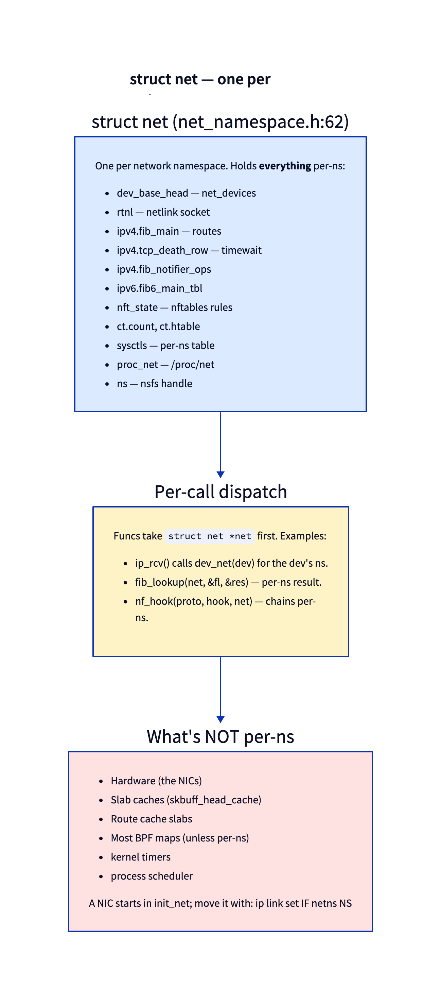
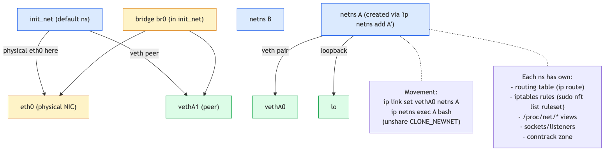
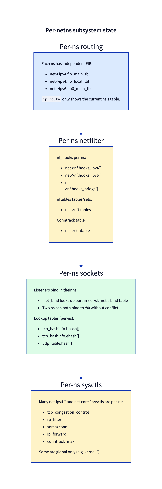

# Day 5 — Network namespaces and `struct net`

> **Today's mission:** create a network namespace, give it a virtual interface, run a process inside it. Understand how the kernel keeps multiple network stacks isolated. End of Phase 1. Total time: ~75 minutes.

## What a netns is

A **network namespace** is the kernel's mechanism for running multiple independent network stacks in one kernel. Each namespace has its own:

- list of network interfaces,
- routing tables,
- netfilter rules,
- sockets and bound ports,
- proc/sysctl views,
- conntrack table.

This is what makes containers and VMs (with TAP/MACVTAP) practical. Every Docker/Podman/Kubernetes pod runs in its own netns. Linux can spin up tens of thousands of them at once.

## `struct net` — one per namespace



Each namespace is one `struct net` (defined at `include/net/net_namespace.h:62`). Kernel networking functions take `struct net *net` as a first-class parameter — anywhere a function needs a routing table, a netfilter chain, a port allocator, it's looked up via `net`.

The "default" namespace at boot is `init_net`. The kernel's first netdev (loopback, then physical NICs) all start there. New namespaces are empty until you put devices in them.

> ### There are no Dumb Questions
>
> **Q: Is the loopback per-ns?**
>
> A: Yes. Each ns gets its own `lo`. So `127.0.0.1` in ns A is unrelated to `127.0.0.1` in ns B. Two processes (one in each) can both `bind()` 127.0.0.1:80 without conflict.
>
> **Q: Can ns A see ns B's traffic?**
>
> A: Only via *connecting devices*. Common patterns: a `veth` pair (two virtual NICs that act as a wire — one in each ns), a Linux bridge that interconnects veths in init_net, or a physical NIC moved to one ns.
>
> **Q: Where does shared state live?**
>
> A: Hardware (NICs themselves), slab caches (sk_buff allocations are kernel-wide), the scheduler. A NIC is per-ns in the sense that its `dev->nd_net` points to one ns — but the underlying hardware is one physical thing.

## Setting up a netns

Linux exposes ns operations via `iproute2`:

```bash
# Create namespace 'red'
sudo ip netns add red

# Run a shell in it
sudo ip netns exec red bash

# (in that shell) network is empty:
ip link
# 1: lo: <LOOPBACK> ... state DOWN
ip route
# (nothing)
```

You're inside a fully isolated network stack. Bring up loopback, you can localhost ping yourself, but nothing else is reachable.

### Connecting to the outside

Two veth ends, one in each ns:

```bash
# in init_net:
sudo ip link add veth_red type veth peer name veth_red_peer
sudo ip link set veth_red_peer netns red

# inside 'red' (or use ip netns exec):
sudo ip netns exec red ip link set veth_red_peer up
sudo ip netns exec red ip addr add 10.99.99.2/24 dev veth_red_peer

# back in init_net:
sudo ip link set veth_red up
sudo ip addr add 10.99.99.1/24 dev veth_red

# now:
sudo ip netns exec red ping 10.99.99.1     # works
ping 10.99.99.2                              # works (init→red)
```



## What's per-ns



The state per ns includes:

- **Routing**: `net->ipv4.fib_main`, `ipv4.fib_default`, `ipv6.fib6_main_tbl`. `ip route` only shows the current ns's table.
- **Netfilter**: `net->nf.hooks_ipv4[]` (per-hook arrays), `nft_pernet(net)->tables` (net_generic-backed), per-ns conntrack stats in `net->ct`. nftables and conntrack state are independent.
- **Sockets**: per-ns bind tables (`tcp_hashinfo.bhash[]`). Two ns can bind the same port simultaneously.
- **Sysctls**: most `net.ipv4.*` are per-ns (`tcp_congestion_control`, `rp_filter`, `ip_forward`).
- **proc/net**: each ns sees its own `/proc/net`, `/proc/sys/net`.

## Today's experiment

### See ns metadata

```bash
sudo ip netns add green
ls /var/run/netns/        # one entry per ns

# nsfs link to /proc/<pid>/ns/net:
readlink /proc/$$/ns/net           # current shell's netns (init_net)
sudo ip netns exec green readlink /proc/self/ns/net   # green's netns
```

```
net:[4026531833]    # init_net (your number differs)
net:[4026532243]    # green — a different inode
```

Note the use of `/proc/self` in the second command, not `/proc/$$`. `$$` is expanded by your *outer* interactive shell (which lives in init_net) *before* `ip netns exec` runs, so it would resolve the symlink for a process still in init_net and print the same inode twice. `/proc/self` is resolved by the `readlink` process that `ip netns exec` actually placed inside green, so the two inodes genuinely differ — that's how the kernel knows which ns a process is in.

### Per-ns sysctl

```bash
# In init_net — show YOUR actual value (don't assume a specific one):
cat /proc/sys/net/ipv4/tcp_congestion_control
# cubic (whatever your box uses — often cubic)

# What's even compiled in? (reno is always built in)
cat /proc/sys/net/ipv4/tcp_available_congestion_control
# reno cubic dctcp bbr htcp

# In green:
sudo ip netns exec green cat /proc/sys/net/ipv4/tcp_congestion_control
# cubic (a new ns inherits init_net's congestion control)

# Set green to reno — always built in, so guaranteed distinct from a default-cubic box:
sudo ip netns exec green sysctl -w net.ipv4.tcp_congestion_control=reno

# Confirm green changed but init_net did NOT:
sudo ip netns exec green cat /proc/sys/net/ipv4/tcp_congestion_control   # reno
cat /proc/sys/net/ipv4/tcp_congestion_control                            # unchanged (your original value)
```

Different values per ns — green now reads `reno` while init_net keeps its original value, proving the tables are independent. The per-ns sysctl table is at `net->sysctls`. (If your init_net somehow already runs `reno`, set green to `cubic` instead — the point is just to pick something different from init_net's current value.)

### Per-ns routing

```bash
# In red (with veth set up):
sudo ip netns exec red ip route
# 10.99.99.0/24 dev veth_red_peer scope link

# In init_net:
ip route
# (your normal routes, including 10.99.99.0/24 if the host added one)
```

Different tables, different views.

### Watch ns lifecycle

```bash
sudo bpftrace -e '
fentry:setup_net  { printf("setup_net %p\n", (void *)args->net); }
fentry:cleanup_net { printf("cleanup_net work %p\n", (void *)args->work); }
'

# In another terminal:
sudo ip netns add demo
sudo ip netns delete demo
```

> **Caveat:** `setup_net` is `static __net_init` (`net/core/net_namespace.c`), so it may be inlined or freed after boot and `fentry:setup_net` may not reliably attach. If it doesn't fire, trace its caller `copy_net_ns` instead — but note that `copy_net_ns`'s `struct net *` argument (`args->old_net`) is the OLD/parent namespace, not the new one. The freshly created `struct net` is the function's RETURN value, so you must use `fexit` and `retval`:
>
> ```bash
> sudo bpftrace -e 'fexit:copy_net_ns { printf("new net %p\n", retval); }'
> ```
>
> (`copy_net_ns` also runs for `CLONE` without `CLONE_NEWNET`, in which case it just returns the old net pointer; the distinct heap addresses appear exactly when `ip netns add` runs.) `cleanup_net` is a work-queue function and attaches reliably.

You'll see the ns being created and torn down.

## What happens when you delete a netns

Most challenging engineering problem in netns lifecycle: **what if a process is still inside?** Linux holds `struct net` until the last reference goes away — process exit, FD close, etc. `ip netns delete` removes the *name* (the symlink in `/var/run/netns`) but the underlying ns may persist.

The `net_namespace.c` cleanup walks `pernet_ops` (registered subsystem callbacks) to tear down per-ns state. Each subsystem (TCP, netfilter, conntrack, ...) has registered an exit callback that frees its per-ns data structures.

This is why deleting a netns can take a long time on a busy system — every subsystem must run its cleanup, conntrack table must be flushed, sockets must be closed.

---

## What to read in the kernel

- **`include/net/net_namespace.h`** — `struct net` definition (line 62). Read all fields once. Note how it's a giant aggregation of per-subsystem state.
- **`net/core/net_namespace.c`** — `setup_net`, `copy_net_ns`, `cleanup_net`. The lifecycle.
- **`include/linux/netdevice.h`** — search `dev_net(dev)`. Most code calls this to get the ns from a netdev.
- **Any `*_pernet_ops` registration** — for example `net/ipv4/route.c` `register_pernet_subsys(&ip_rt_proc_ops)`. Each subsystem registers init/exit callbacks here.
- **`Documentation/admin-guide/sysctl/net.rst`** — which sysctls are per-ns, which are global.

---

## What to break

### Try moving a physical NIC to a netns

First find your real interface name — many cloud/test VMs use predictable names like `ens5` or `enp0s3`, not `eth0`:
```bash
ip route get 1.1.1.1     # read the 'dev <name>' field; substitute it for eth0 below
```

```bash
sudo ip link set eth0 netns red    # **CAREFUL** — your SSH may go away
```

If you do this on the real interface you're using, your SSH session disconnects (init_net no longer has eth0). For real testing, do it with a non-essential interface or via a console.

To recover from console — note the device comes back **down** with its addresses flushed, so you must bring it up and re-acquire an address:
```bash
sudo ip netns exec red ip link set eth0 netns 1   # back to init_net
sudo ip link set eth0 up
sudo dhclient eth0        # or re-add the static address you had before
```

### Watch conntrack count per ns

```bash
sudo ip netns exec red sysctl net.netfilter.nf_conntrack_count
# 0 (red has no traffic)

sysctl net.netfilter.nf_conntrack_count
# possibly thousands (init_net has all real traffic)
```

The two views are independent.

### Cleanup

These experiments leave persistent namespaces and a veth pair behind. Tear them down so you don't accumulate stale interfaces and ns mounts:

```bash
sudo ip link del veth_red 2>/dev/null     # removes both ends of the pair
sudo ip netns delete green 2>/dev/null
sudo ip netns delete red 2>/dev/null      # also reaps the peer living inside it
```

---

## Bullet Points

- **Network namespace** = `struct net`. One per ns; aggregates all per-ns subsystem state.
- The default ns is `init_net`. New ns are empty until you add devices.
- **`veth`** pairs are the most common way to connect a ns to the outside world.
- Per-ns: routing, netfilter rules, conntrack, sockets, sysctls, /proc/net.
- NOT per-ns: hardware, slab caches, scheduler.
- Most kernel net functions take `struct net *net` as the first parameter.
- `ip netns add/del/exec` for management; `unshare(CLONE_NEWNET)` to create programmatically.
- Cleanup walks `pernet_ops` callbacks; large ns can take time to delete.

---

## Check question

Two TCP servers run, one in init_net and one in netns "red", both bound to `0.0.0.0:80`. Both have full read/write to their socket. A client in init_net connects to `127.0.0.1:80`. Which server gets the connection?

<details>
<summary>Click to reveal answer</summary>

**Answer:** The init_net server. Socket bind tables are per-ns: `0.0.0.0:80` in init_net is one entry; `0.0.0.0:80` in red is a separate entry. The kernel routes the SYN by namespace: the client is in init_net, the SYN goes through init_net's stack, lookup in init_net's bind table finds the init_net listener. Red's listener never sees the packet. To reach red's listener, you'd need a process in red to connect (e.g., `ip netns exec red curl 127.0.0.1`), or a route + nftables setup that forwards traffic into red.

</details>

---

## End of Phase 1

You can now read the kernel network stack from sk_buff up. RX path, TX path, offloads, namespaces. The vocabulary is real — when you see `dev_net(skb->dev)`, `napi->poll`, `__qdisc_run`, `gso_segs`, you know what they're doing.

Phase 2 (Days 6–12) walks the L2/L3 layers in detail: Ethernet, ARP, the FIB, IPv6, bridges, tunnels.
