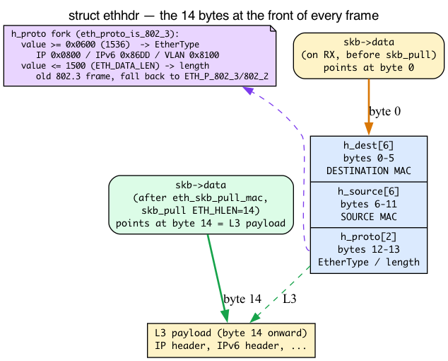
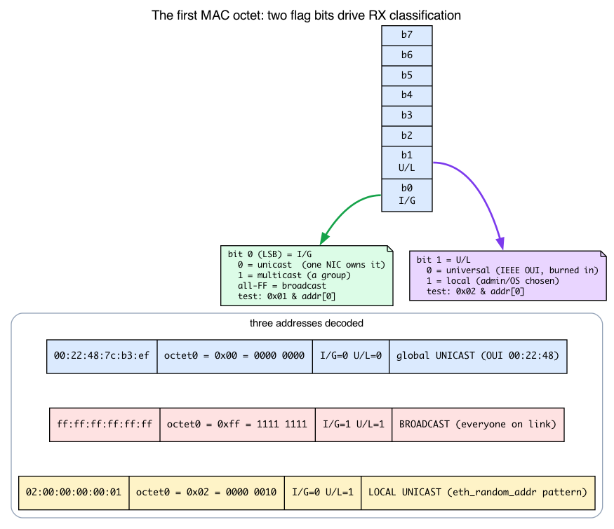
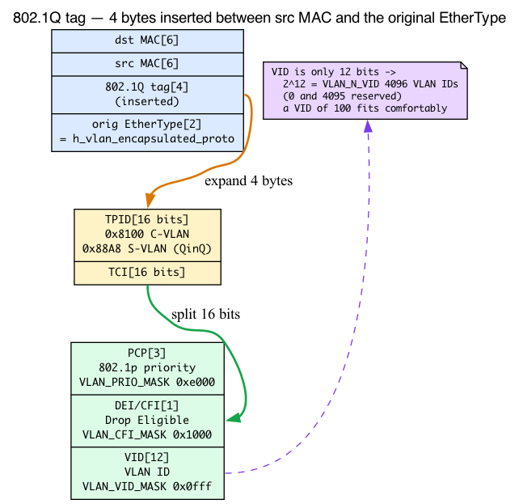

# Day 6 — Ethernet, VLAN, and the L2 layer

> **Today's mission:** see what `eth_type_trans` does to every received packet — and learn the four pieces of wire-format background it quietly leans on (the Ethernet header layout, MAC-address bit semantics, network byte order, and the 802.1Q tag internals) so nothing along the way is a magic constant. Then create a VLAN device and watch tags appear and disappear. Total time: ~110 minutes.

> **Phase 2 starts here.** Days 6–12 walk the L2/L3 layers in detail: Ethernet, ARP, IP routing, IPv6, bridges, tunnels.

## What L2 means in Linux

The "Layer 2" code in Linux is small but ubiquitous. Every received frame passes through it; every transmitted frame has its Ethernet header built there. The implementation lives mostly in **`net/ethernet/eth.c`** (~640 lines).

The single most important function in this layer is `eth_type_trans` — called by every Ethernet driver on RX, every time. By the end of Day 2 you watched the driver call it in Stage 2 of the RX path: it sets `skb->protocol`, and that value becomes the demux key the core stack hashes on to pick `ip_rcv`. Today we open it up.

But `eth_type_trans` parses raw bytes off the wire, and to read it without hand-waving you need to know what those bytes *are*. So before we walk the function, three short background sections — intuition first, then the concrete v7.1 struct — on the Ethernet header, MAC-address bits, and byte order. After that the function reads as plain English. The fourth piece of wire-format background — the 802.1Q VLAN tag (Background 4) — comes *after* the function, in the VLAN section, because that's where the function hands tagged frames off to the dedicated VLAN subsystem.

> One thing from Day 1 is load-bearing today and will **not** be re-taught:
> - **The skb's four pointers** (`head ≤ data ≤ tail ≤ end`) and **`skb_pull`/`skb_push`.** Recall from Day 1 — `skb->data` is the first valid byte of the current header view, and `skb_pull(skb, n)` advances `data` by `n` bytes (stripping a header you've finished with). `eth_type_trans` does exactly one `skb_pull` of 14 bytes; that's the whole "advance past the Ethernet header" trick.

---

## Background 1: the 14 bytes of an Ethernet header

Before `eth_type_trans` can do anything, it has to know what the first bytes of a received frame mean. On Ethernet, every frame starts with a fixed **14-byte header**, and it is gloriously simple — just three fields back to back, no options, no variable length.

`struct ethhdr` is exactly that (`include/uapi/linux/if_ether.h:177-181`):

```c
struct ethhdr {
    unsigned char   h_dest[ETH_ALEN];   /* destination eth addr  */
    unsigned char   h_source[ETH_ALEN]; /* source ether addr     */
    __be16          h_proto;            /* packet type ID field  */
} __attribute__((packed));
```

with `ETH_ALEN 6` (`if_ether.h:32`) and `ETH_HLEN 14` (`if_ether.h:34`). Lay it out as a byte ruler:



- **Bytes 0–5: `h_dest`** — the destination MAC (who the frame is *for*).
- **Bytes 6–11: `h_source`** — the source MAC (who *sent* it).
- **Bytes 12–13: `h_proto`** — the 2-byte EtherType (what's *inside*).

6 + 6 + 2 = **14 = `ETH_HLEN`**. That is the exact number `skb_pull` advances by. When a frame arrives, the driver has placed `skb->data` on byte 0 (the start of `h_dest`). After `eth_type_trans` does `skb_pull(skb, ETH_HLEN)`, `skb->data` lands precisely on byte 14 — the first byte of the L3 header (the IP header, usually). No parsing, no length math: the Ethernet header is a fixed size, so one fixed pull strips it. This is why the helper that does it, `eth_skb_pull_mac`, is so short (`etherdevice.h:640-645`):

```c
static inline struct ethhdr *eth_skb_pull_mac(struct sk_buff *skb)
{
    struct ethhdr *eth = (struct ethhdr *)skb->data;  /* read the 14 bytes */
    skb_pull_inline(skb, ETH_HLEN);                   /* then step past them */
    return eth;
}
```

### The EtherType is sometimes a length

Here's the one wrinkle. The 2-byte `h_proto` field is **overloaded**, for historical reasons:

- If the value is **≥ 0x0600 (1536)**, it's a real **protocol type** — "Ethernet II" framing. Examples: `ETH_P_IP` 0x0800 (`if_ether.h:52`), `ETH_P_IPV6` 0x86DD (`:74`), `ETH_P_ARP` 0x0806 (`:54`), `ETH_P_8021Q` 0x8100 (`:71`, VLAN), `ETH_P_8021AD` 0x88A8 (`:93`, QinQ).
- If the value is **≤ 1500**, it's a **frame length**, not a type — the original IEEE 802.3 framing, where the protocol was identified by an LLC header *inside* the payload instead.

The boundary between the two interpretations is the constant `ETH_P_802_3_MIN 0x0600` (`if_ether.h:127`), whose comment says it outright: *"If the value in the ethernet type is more than this value then the frame is Ethernet II. Else it is 802.3."* The kernel decides which case it's in with `eth_proto_is_802_3()` (`etherdevice.h:220`). That is exactly why, at the very end, `eth_type_trans` returns `eth->h_proto` only `if (eth_proto_is_802_3(...))` — and otherwise falls back to a dummy "this is really a length" protocol ID. So the "`h_proto` is a length field (< 1536)" aside later in this chapter is not magic: it's the < 1536 / ≥ 0x0600 split made concrete.

---

## Background 2: what a MAC address actually encodes

`eth_type_trans` classifies every frame by looking at the destination MAC (`h_dest`): is it *for us*, *for everyone*, *for a group*, or *for someone else*? To follow that — and to understand why the lab later invents the address `02:00:00:00:00:01` — you need to know that a MAC address isn't just six random bytes. Two bits of the **first octet** carry meaning.

A MAC address is **48 bits / 6 octets**. The two least-significant bits of the **first octet** are special:



- **bit 0 — I/G (Individual/Group):** `0` = unicast (this frame is addressed to *one* NIC); `1` = multicast/group (addressed to a *set* of NICs).
- **bit 1 — U/L (Universal/Local):** `0` = globally unique, burned in by the vendor (the top 3 octets are the vendor's OUI); `1` = locally administered, i.e. software-assigned.

The kernel reads "the multicast bit" with the simplest possible test — `is_multicast_ether_addr()` is literally `0x01 & addr[0]` (`etherdevice.h:130`). That single bit *is* the multicast bit this chapter keeps mentioning. And `is_local_ether_addr()` is `0x02 & addr[0]` (the U/L bit, `etherdevice.h:163`).

**Broadcast is a special case of multicast.** The broadcast address `ff:ff:ff:ff:ff:ff` has every bit set — including bit 0 — so it *is* a multicast address, just the all-ones one. `is_broadcast_ether_addr()` checks all six octets equal `0xff` (`etherdevice.h:176`). This is exactly why the classifier checks multicast *first*, then asks "is it the broadcast address specifically?" Watch `eth_skb_pkt_type()` do it (`etherdevice.h:623-638`):

```c
static inline void eth_skb_pkt_type(struct sk_buff *skb,
                                    const struct net_device *dev)
{
    const struct ethhdr *eth = eth_hdr(skb);

    if (unlikely(!ether_addr_equal_64bits(eth->h_dest, dev->dev_addr))) {  /* not us */
        if (unlikely(is_multicast_ether_addr_64bits(eth->h_dest))) {      /* group bit set? */
            if (ether_addr_equal_64bits(eth->h_dest, dev->broadcast))
                skb->pkt_type = PACKET_BROADCAST;   /* the all-ones one */
            else
                skb->pkt_type = PACKET_MULTICAST;   /* some other group */
        } else {
            skb->pkt_type = PACKET_OTHERHOST;       /* unicast, but not our MAC */
        }
    }
    /* else: leaves the default PACKET_HOST — dst == our dev_addr */
}
```

The four outcomes are the `pkt_type` constants (`include/uapi/linux/if_packet.h:26-29`): `PACKET_HOST 0`, `PACKET_BROADCAST 1`, `PACKET_MULTICAST 2`, `PACKET_OTHERHOST 3`. Note the function only *sets* a value when the dst is **not** our `dev_addr`; the skb's default `pkt_type` is already `PACKET_HOST`, so "addressed to us" needs no assignment.

### Why `02:00:00:00:00:01` is the canonical "safe to invent" MAC

Now the lab's magic constant decodes itself. Take the first octet `0x02` = binary `0000 0010`:

- **bit 0 = 0** → unicast. A NIC configured with this address treats frames sent to it as `PACKET_HOST` (us).
- **bit 1 = 1** → locally administered. By definition it can't collide with any vendor's globally-unique OUI.

So `02:00:...:01` is guaranteed (a) to be a normal unicast address and (b) never to clash with real hardware. That's why it's the textbook address to assign to a throwaway interface — which is exactly what the "Set a non-default MAC" lab does.

---

## Background 3: network byte order and the `__be16` type

There's one more thing you must know before reading `eth_type_trans`, and it's the gotcha that makes today's bpftrace experiment print a "wrong-looking" number. It's about **byte order**.

A 2-byte field like `h_proto` holds a 16-bit number, and there are two ways to lay those two bytes out in memory:

- **Big-endian** ("network byte order"): most-significant byte first. The value `0x0800` is stored as the bytes `08 00`.
- **Little-endian:** least-significant byte first. The same value `0x0800` is stored as `00 08`.

**The wire is always big-endian.** Every multi-byte protocol field — EtherType, IP addresses, port numbers — travels most-significant-byte-first. But **x86 and ARM hosts are little-endian.** So if you grab the two raw wire bytes `08 00` and read them back as a host `u16`, the CPU interprets them in *its* order and you get `0x0008`, not `0x0800`:

| On the wire (big-endian) | Read raw as host `u16` (little-endian x86) | After `ntohs()` |
|---|---|---|
| bytes `08 00` | `0x0008` | `0x0800` = `ETH_P_IP` |

That table is the *entire* explanation for today's experiment printing `type=0x0008` for an IP frame. The bytes are right; you're just reading them in the wrong order.

**`__be16` / `__be32`** are the kernel's annotations marking a value as big-endian (they're checked by the `sparse` static analyzer). When you see `__be16 h_proto`, it's a reminder: *don't do arithmetic or comparisons on this as a native integer until you convert it.* The conversion helpers are:

- `ntohs()` / `ntohl()` — **n**etwork-**to**-**h**ost, wire → host (16-bit / 32-bit).
- `htons()` / `htonl()` — **h**ost-**to**-**n**etwork, host → wire.

### The subtlety that ties Day 2 together

Here's the part worth holding onto. `eth_type_trans` returns `h_proto` **`__be16`, without swapping it** — `return eth->h_proto;` at `net/ethernet/eth.c:177`, and the signature returns `__be16` (`eth.c:155`). The driver stores that still-big-endian value straight into `skb->protocol`. So **`skb->protocol` stays in network byte order end-to-end.**

Where does the swap finally happen? At the L3 demux you met in Day 2. Handlers register their EtherType into a bucket with `htons(pt->type)` (the registration helper `ptype_head()` at `net/core/dev.c:608`), and at RX time `__netif_receive_skb_core` indexes that same hash table with `ntohs()` — `ptype_base[ntohs(type) & PTYPE_HASH_MASK]` where `type = skb->protocol` (`net/core/dev.c:6147`, with `type` assigned from `skb->protocol` at `:6142`). Registration and demux hash the same way. Recall from Day 2 — that's how `skb->protocol` (big-endian) gets matched against the registered handlers to reach `ip_rcv`. So nothing along the RX path ever byte-swaps `skb->protocol` itself; the comparison is done in network order. This is precisely why a raw `%04x` print in bpftrace shows the swapped value: you're seeing the honest, unswapped wire bytes.

The mental tool: when you print a wire field raw and it looks byte-swapped, **read the low two hex digits**, or wrap the field in `bswap()` in bpftrace.

---

## `eth_type_trans` — the universal RX header parser


Now the function reads cleanly. `eth_type_trans(skb, dev)` (`net/ethernet/eth.c:155`) does four things in tight succession:

1. **`skb_reset_mac_header(skb)`** — record where the Ethernet header is by storing the offset of `skb->data` within the buffer (`skb->data - skb->head`); it's at `skb->data` right now (Background 1: byte 0, the start of `h_dest`).
2. **Read *and* pull, in one helper — `eth_skb_pull_mac(skb)`.** This single call both reads `eth = (struct ethhdr *)skb->data` (the three-field header from Background 1) **and** does the `skb_pull(skb, ETH_HLEN)` that advances `skb->data` past the 14-byte header. So by the end of this one step `skb->data` already points at the L3 payload — the read and the pull are not two separate stages.
3. **Set `skb->pkt_type`** (via `eth_skb_pkt_type`, called *after* the pull) based on destination MAC — exactly the multicast-first / broadcast / otherhost logic from Background 2. This still works even though the header was just pulled: `eth_skb_pkt_type` finds the header via `eth_hdr(skb)`, which uses the `mac_header` offset recorded in step 1, not `skb->data`.
   - `PACKET_BROADCAST` if dst is `ff:ff:ff:ff:ff:ff`.
   - `PACKET_MULTICAST` if the multicast bit (`addr[0] & 1`) is set.
   - `PACKET_OTHERHOST` if dst is unicast but doesn't match `dev->dev_addr` (would be dropped on a normal NIC; promiscuous mode keeps these). Otherwise it leaves the default `PACKET_HOST` when dst matches `dev_addr` (us).
4. **Return the protocol ID** — typically `eth->h_proto` (`ETH_P_IP` 0x0800, `ETH_P_IPV6` 0x86DD, or `ETH_P_8021Q` 0x8100, VLAN), but only `if (eth_proto_is_802_3(...))` — the ≥ 0x0600 / < 1536 boundary from Background 1. There are two short-circuits before that: if the device uses DSA tagging (Distributed Switch Architecture, where an embedded switch prepends its own tag) it returns `ETH_P_XDSA` (0x00F8) without looking at the packet, and if `h_proto` is a length field (< 1536, i.e. below `ETH_P_802_3_MIN` 0x0600) it falls back to `ETH_P_802_3` (IPX magic) or `ETH_P_802_2` (802.2 LLC). The returned value is `__be16` and is **not** byte-swapped (Background 3).

The driver assigns the return value to `skb->protocol`, then passes the skb to GRO / `netif_receive_skb` (recall the Day 2 RX path). From here the L3 dispatcher uses `skb->protocol` to find the right handler (`ip_rcv` for IP) — hashing it via `ntohs()` as Background 3 described.

## Background 4: the 802.1Q VLAN tag

So far every frame has been 14 bytes of header then payload. A **VLAN tag** inserts 4 extra bytes into that header to label which virtual LAN the frame belongs to. Let's decompose those 4 bytes — they're the reason `skb->vlan_tci` and "VLAN ID 100" exist.


The full 802.1Q tag is **4 bytes** (`VLAN_HLEN 4`, `if_vlan.h:16`), inserted *between* the source MAC and the EtherType field. It's two halves:

- a 2-byte **TPID** (Tag Protocol IDentifier) — `0x8100` for 802.1Q, or `0x88A8` for the *outer* tag of stacked 802.1ad/QinQ. The TPID sits where the EtherType normally would, which is how the NIC knows a tag follows.
- a 2-byte **TCI** (Tag Control Information) — the actual label, decomposed below.

The original EtherType (e.g. `0x0800` for IP) moves to *after* the tag. The concrete struct makes this layout explicit (`if_vlan.h:48-55`):

```c
struct vlan_ethhdr {
    unsigned char   h_dest[ETH_ALEN];        /* bytes  0–5  */
    unsigned char   h_source[ETH_ALEN];      /* bytes  6–11 */
    __be16          h_vlan_proto;            /* bytes 12–13: TPID, 0x8100   */
    __be16          h_vlan_TCI;              /* bytes 14–15: TCI            */
    __be16          h_vlan_encapsulated_proto; /* bytes 16–17: inner type   */
};
```

(`struct vlan_hdr` at `if_vlan.h:35-38` is just the TCI plus the inner ethertype — the two `__be16`s that follow the TPID, not the full 4-byte tag.)

### Decomposing the 16-bit TCI

The TCI packs three subfields into 16 bits:



- **bits 15–13 (top 3): PCP** — Priority Code Point, the 802.1p class of service (0–7). Mask `VLAN_PRIO_MASK 0xe000`, shift `VLAN_PRIO_SHIFT 13`.
- **bit 12: DEI/CFI** — Drop Eligible Indicator (formerly Canonical Format Indicator). Mask `VLAN_CFI_MASK 0x1000`.
- **bits 11–0 (bottom 12): VID** — the VLAN ID. Mask `VLAN_VID_MASK 0x0fff`.

(All four constants at `if_vlan.h:73-77`.) Twelve bits give `VLAN_N_VID 4096` possible IDs (0 and 4095 are reserved, leaving **4094 usable** — which is why the labs cap out there). The VID is the "VLAN ID 100" the labs use.

When a modern NIC strips the tag in hardware (HW acceleration), it stashes the TCI in `skb->vlan_tci` and the TPID in `skb->vlan_proto`. These overlay a single `u32` for cheap presence-testing (`include/linux/skbuff.h:1052-1055`):

```c
union {
    u32       vlan_all;        /* test this for "any tag present?" */
    struct {
        __be16 vlan_proto;     /* the TPID  */
        __u16  vlan_tci;       /* the TCI   */
    };
};
```

That's why `skb_vlan_tag_present(skb)` is literally `!!skb->vlan_all` (`if_vlan.h:82`): if either half is non-zero, a tag is present. And the accessors mask the TCI apart exactly as the bit diagram shows — `skb_vlan_tag_get_id(skb)` is `vlan_tci & VLAN_VID_MASK` (`if_vlan.h:84`), `skb_vlan_tag_get_prio` shifts out the PCP, `skb_vlan_tag_get_cfi` tests the DEI bit.

The kernel handles VLANs in two ways:

1. **HW acceleration** — the `vlan_all` union path described above (NIC strips the tag on RX, stack sees an untagged frame plus metadata, tested with `skb_vlan_tag_present`). On TX the kernel hands the NIC a possibly-untagged skb and the NIC adds the tag if requested.

2. **Software path** — for NICs without HW VLAN, or for stacked VLANs (QinQ), `vlan_do_receive` in `net/8021q/vlan_core.c` parses the tag and dispatches.

A **VLAN device** (`eth0.100`) is a virtual netdev that filters frames by VLAN ID:

```bash
sudo ip link add link eth0 name eth0.100 type vlan id 100
sudo ip link set eth0.100 up
sudo ip addr add 192.168.100.5/24 dev eth0.100
```

Now `eth0.100` is a fully-featured interface with its own routes, MTU, and IP. Frames with VLAN ID 100 arriving on `eth0` get redirected to `eth0.100`'s RX path; transmits on `eth0.100` get tagged and sent through `eth0`. That redirection is `vlan_do_receive()` (`net/8021q/vlan_core.c:10`): it reads the VID with `skb_vlan_tag_get_id(skb)` (the `& VLAN_VID_MASK` from the bit diagram) and looks up the matching device with `vlan_find_dev(skb->dev, vlan_proto, vlan_id)`. If a device is registered for that (interface, VID) pair, the frame is steered to it; if not, the lookup returns `NULL` and `vlan_do_receive` returns false (the Check question hinges on this).


> ### There are no Dumb Questions
>
> **Q: What's the difference between `skb->protocol` and the type field?**
>
> A: They're set from the same source (`eth->h_proto`), but `skb->protocol` is what the stack uses for dispatch. For VLAN-tagged frames, the kernel processes the tag, then sets `skb->protocol` to the *inner* type (`h_vlan_encapsulated_proto`). So a TCP-over-VLAN frame ends up with `skb->protocol = ETH_P_IP` after VLAN handling. (Both are stored big-endian — Background 3.)
>
> **Q: Can I have a VLAN inside a VLAN?**
>
> A: Yes — and there are two flavors. The simplest is plain **802.1Q-in-802.1Q double tagging**, where both the outer and inner tags use TPID 0x8100: `ip link add link eth0.100 name eth0.100.200 type vlan id 200` stacks a second default-protocol (0x8100) tag on top of the first. True **QinQ (802.1ad)** instead uses an 0x88a8 *outer* S-tag with an 0x8100 inner tag — but you must ask for that protocol explicitly, because the VLAN netlink default is 802.1Q (0x8100). Create the outer device with `type vlan proto 802.1ad id 100`, then stack the inner with `type vlan proto 802.1q id 200`. The bare command above does **not** produce an 0x88a8 outer tag.
>
> **Q: How does the kernel pick the source MAC for outbound frames?**
>
> A: From `dev->dev_addr` of the egress device. Modern NICs allow random MACs at boot (privacy via `MACAddressPolicy=random` in systemd-networkd) — and a randomly-generated MAC always has the locally-administered bit set (Background 2), so it never collides with a vendor OUI. The Ethernet header build happens in `dev_hard_header` → `eth_header` (`net/ethernet/eth.c`).

## Today's experiment

### See `eth_type_trans` in action

```bash
sudo bpftrace -e '
fentry:eth_type_trans {
  $eth = (struct ethhdr *)args->skb->data;
  printf("dst=%02x:%02x:%02x:%02x:%02x:%02x type=0x%04x\n",
         $eth->h_dest[0], $eth->h_dest[1], $eth->h_dest[2],
         $eth->h_dest[3], $eth->h_dest[4], $eth->h_dest[5], $eth->h_proto);
}' &
sleep 3                 # let the fentry BTF probe attach before we trigger traffic
ping -c 5 8.8.8.8
sleep 1                 # let the last frames drain through the probe
sudo killall bpftrace
```

The `sleep 3` matters: a BTF `fentry` probe takes a second or two to attach, and a single `ping -c 1` completes in a few hundred milliseconds — without the delay the trigger (and the kill) happen before the probe is live and you see nothing. `eth_type_trans` fires on *every* received frame, so with the probe up for a few seconds you'll get output even apart from the ping:

```
dst=00:22:48:7c:ffffffb3:ffffffef type=0x0008
dst=00:22:48:7c:ffffffb3:ffffffef type=0x0008
dst=00:22:48:7c:ffffffb3:ffffffef type=0x0008
```

You'll see actual MAC addresses and EtherTypes flying through, and both gotchas from the background sections show up at once:

- **The MAC octets** print as signed bytes, so values ≥ 0x80 show sign-extended as `ffffffb3` — read the low two hex digits (`b3`). (This is a bpftrace printing quirk, not the bit semantics from Background 2.)
- **The type is byte-swapped.** `h_proto` is `__be16` (big-endian on the wire, Background 3), so on a little-endian host the raw `%04x` print shows IP as `0x0008` rather than `0x0800`. Mentally swap the bytes, or wrap the field in `bswap()`.

### Create a VLAN and watch traffic

```bash
sudo ip link add link eth0 name eth0.100 type vlan id 100
sudo ip link set eth0.100 up
sudo ip addr add 10.100.0.1/24 dev eth0.100

# verify
ip -d link show eth0.100   # see vlan_id 100, vlan_protocol 802.1Q

# capture both:
sudo tcpdump -i eth0 -e -n vlan 100 &
sudo tcpdump -i eth0.100 -n &
sleep 1

# trigger: no peer answers, but the ARP request for 10.100.0.2
# egresses eth0 tagged with VID 100 (and untagged on eth0.100)
ping -c 3 -W1 10.100.0.2
sleep 1
```

You should see the *same* frame twice — on `eth0` carrying the 802.1Q tag that `-e` exposes (`vlan 100, p 0, ethertype ARP ...`) and on `eth0.100` already stripped/untagged. The `vlan 100, p 0` is the TCI decoded for you: VID 100, PCP 0 (the TCI bitfields from Background 4). That side-by-side is the VLAN device doing tag insertion on egress and removal on ingress. The ping gets no replies (there's no host at 10.100.0.2) — that's fine; the tagged ARP requests are the point.

```bash
# cleanup
sudo pkill tcpdump            # stop both backgrounded captures (and drop promisc mode)
sudo ip link del eth0.100     # also removes the 10.100.0.1/24 address
```

### See pkt_type stats

```bash
sudo bpftrace -e '
fexit:eth_type_trans {
  @pkt_types[args->skb->pkt_type] = count();
}
interval:s:5 { exit(); }'
```

PACKET_HOST=0, BROADCAST=1, MULTICAST=2, OTHERHOST=3 (the constants from Background 2). We attach at `fexit` (function return), not `fentry`: `eth_type_trans` is the function that *sets* `pkt_type` (via `eth_skb_pkt_type`), so at entry the field still holds its prior value (usually 0). By the time the function returns, the assignment is complete. `fexit` exposes `args->` for the input arguments just like `fentry`.

## What to break

### Toggle promiscuous mode

```bash
sudo ip link set eth0 promisc on

# re-run the "See pkt_type stats" trace above while generating traffic

sudo ip link set eth0 promisc off   # restore
```

Now the kernel processes packets that aren't addressed to your MAC (where `pkt_type == PACKET_OTHERHOST` — unicast frames whose dst doesn't match `dev_addr`, Background 2). `tcpdump` enables this implicitly.

> **Caveat:** on a mirrored/SPAN port, a hub, or a shared segment you'll now see `@pkt_types[3]` (PACKET_OTHERHOST) appear. On an ordinary switched link or a cloud vNIC the switch never delivers other hosts' unicast to your port, so key 3 may stay 0 even with promisc on — that's expected, not a bug. Always `promisc off` afterward so you don't leave the NIC in promiscuous mode.

### Set a non-default MAC

> **WARNING:** do **not** change the MAC of the interface carrying your SSH session. `eth0` is usually the management interface on a cloud/test VM — changing its MAC (or bringing the link down to do so) drops your connection, and many drivers reject an address change while the link is up. Use a throwaway interface instead:

```bash
# Option A (safe): a dummy interface, so you never touch the SSH link.
sudo ip link add mac-test type dummy
sudo ip link set mac-test address 02:00:00:00:00:01
ip link show mac-test            # observe the new MAC
sudo ip link delete mac-test     # cleanup

# Option B: a real spare NIC (NOT the one carrying SSH).
IF=eth1                          # NOT your SSH interface; eth1 is illustrative —
                                 # substitute an actual spare NIC present on your box
orig=$(cat /sys/class/net/$IF/address)
sudo ip link set $IF down
sudo ip link set $IF address 02:00:00:00:00:01
sudo ip link set $IF up
ip link show $IF                 # confirm; re-run the eth_type_trans trace
sudo ip link set $IF down
sudo ip link set $IF address "$orig"   # restore the original MAC
sudo ip link set $IF up
```

We chose `02:00:00:00:00:01` deliberately (Background 2): first octet `0x02` has the unicast bit clear and the locally-administered bit set, so it's guaranteed to be treated as a normal unicast address and guaranteed not to collide with any vendor's burned-in OUI. Now `eth_type_trans` sees `02:00:00:00:00:01` as "us" — frames addressed there are PACKET_HOST. Useful for testing identity rules.

---

## What to read in the kernel

- **`net/ethernet/eth.c`** — `eth_type_trans` (line 155), `eth_header`, header_ops. The whole file is ~640 lines.
- **`include/uapi/linux/if_ether.h`** — `struct ethhdr` (line 177), `ETH_ALEN`/`ETH_HLEN`, the `ETH_P_*` EtherType constants, and `ETH_P_802_3_MIN` (line 127, the type-vs-length boundary).
- **`include/linux/etherdevice.h`** — `is_multicast_ether_addr` (line 130), `is_broadcast_ether_addr` (line 176), `eth_proto_is_802_3` (line 220), `eth_skb_pkt_type` (line 623), `eth_skb_pull_mac` (line 640).
- **`include/linux/if_vlan.h`** — `struct vlan_ethhdr` (line 48), the TCI masks (`VLAN_VID_MASK` etc., lines 73–77), `skb_vlan_tag_present`/`skb_vlan_tag_get_id` (lines 82–84).
- **`net/8021q/vlan_core.c`** — VLAN reception path (`vlan_do_receive`, line 10).
- **`net/8021q/vlan_dev.c`** — VLAN device implementation.
- **`include/linux/skbuff.h`** — search `vlan_tci`, `vlan_proto`, `vlan_all` (the union at line 1052).

---

## Bullet Points

- The **Ethernet header is 14 bytes** (`ETH_HLEN`): `h_dest[6]` + `h_source[6]` + `h_proto[2]` (`struct ethhdr`). That fixed size is why `skb_pull(skb, 14)` lands `skb->data` exactly on the L3 header.
- The **EtherType `h_proto` is overloaded**: ≥ 0x0600 = real type (IP 0x0800, IPv6 0x86DD, ARP 0x0806, VLAN 0x8100); ≤ 1500 = a frame length (802.3). The boundary is `ETH_P_802_3_MIN 0x0600`, decided by `eth_proto_is_802_3()`.
- A **MAC's first octet carries two flag bits**: bit 0 = I/G (0 unicast, 1 multicast); bit 1 = U/L (0 global/vendor, 1 locally-administered). "The multicast bit" is `addr[0] & 1`. Broadcast `ff:ff:ff:ff:ff:ff` is just the all-ones multicast. `02:00:..:01` = safe synthetic unicast (local + not multicast).
- **Network byte order is big-endian.** `__be16`/`__be32` mark wire values; convert with `ntohs`/`htons`. `eth_type_trans` returns `h_proto` **unswapped**, so `skb->protocol` stays big-endian end-to-end; the demux does the `ntohs()`. A raw print on little-endian x86 shows IP as `0x0008`.
- **`eth_type_trans`** is the universal RX header parser; called from every Ethernet driver. Sets `skb->dev`, `skb->mac_header` and `skb->pkt_type`, advances `skb->data` past the L2 header, and **returns** the L3 protocol id (which the driver assigns to `skb->protocol` — `eth_type_trans` never writes that field itself).
- `skb->pkt_type`: HOST / BROADCAST / MULTICAST / OTHERHOST.
- **VLAN** = a 4-byte tag (`VLAN_HLEN`) between src MAC and EtherType: 2-byte TPID (0x8100, or 0x88a8 for QinQ) + 2-byte TCI. The **TCI** splits into PCP[15:13] + DEI[12] + VID[11:0]; 12-bit VID → 4094 usable IDs.
- **HW VLAN acceleration**: NIC strips tag, kernel reads `skb->vlan_tci`/`vlan_proto` (the `vlan_all` union). `skb_vlan_tag_present` = `!!vlan_all`; `skb_vlan_tag_get_id` = `vlan_tci & VLAN_VID_MASK`. Otherwise software path in `net/8021q/`.
- **VLAN devices** are virtual netdevs that filter+strip by VLAN ID; `vlan_do_receive` looks them up with `vlan_find_dev`.
- TX side: `dev_hard_header` → `eth_header` builds the L2 frame, using `dev->dev_addr` as the source MAC.

---

## Check question

A frame arrives at eth0 with VLAN tag 100, but no `eth0.100` device exists. What happens?

<details>
<summary>Click to reveal answer</summary>

**Answer:** `vlan_do_receive()` reads the VID with `skb_vlan_tag_get_id(skb)` (= `vlan_tci & VLAN_VID_MASK` = 100) and looks up a registered VLAN device for (eth0, 100) via `vlan_find_dev`, finds none, and returns false (`net/8021q/vlan_core.c:10`, lookup fails at dev.c:6077). The frame isn't redirected to a VLAN netdev; `__netif_receive_skb_core` marks it `PACKET_OTHERHOST` (`net/core/dev.c:6111`) and it **is** delivered to the L3 receive handler `ip_rcv` via the normal ptype dispatch — but `ip_rcv` (in `ip_rcv_core`) drops it immediately because `pkt_type == PACKET_OTHERHOST`, bumping the `rx_otherhost_dropped` core stat (via `dev_core_stats_rx_otherhost_dropped_inc`, `net/ipv4/ip_input.c:509`). So it reaches L3 ingress but is never routed or processed. To accept untagged "unknown VLAN" traffic, you'd configure a VLAN-aware bridge with the relevant VID on the port.

</details>

---

## Tomorrow

Day 7: ARP and the neighbour subsystem. How the kernel learns its peers' MAC addresses and what happens when neighbour entries go stale.
