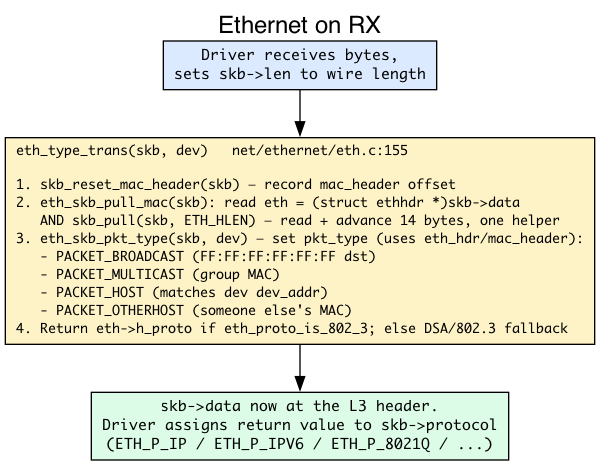
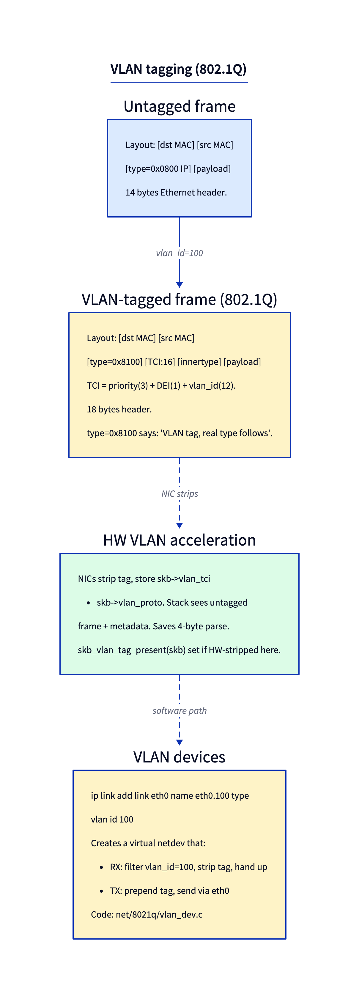
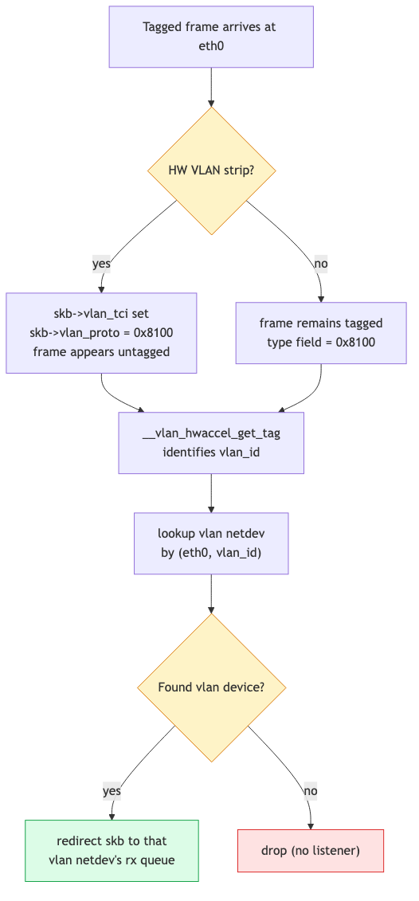

# Day 6 — Ethernet, VLAN, and the L2 layer

> **Today's mission:** see what `eth_type_trans` does to every received packet, understand 802.1Q tagging, create a VLAN device. Total time: ~75 minutes.

> **Phase 2 starts here.** Days 6–12 walk the L2/L3 layers in detail: Ethernet, ARP, IP routing, IPv6, bridges, tunnels.

## What L2 means in Linux

The "Layer 2" code in Linux is small but ubiquitous. Every received frame passes through it; every transmitted frame has its Ethernet header built there. The implementation lives mostly in **`net/ethernet/eth.c`** (~500 lines).

The single most important function in this layer is `eth_type_trans` — called by every Ethernet driver on RX, every time.

## `eth_type_trans` — the universal RX header parser



`eth_type_trans(skb, dev)` (`net/ethernet/eth.c:155`) does five things in tight succession:

1. **Set `skb->mac_header = 0`** — record where the Ethernet header is (it's at `skb->data` right now).
2. **Read `eth = (struct ethhdr *)skb->data`**.
3. **Set `skb->pkt_type`** based on destination MAC:
   - `PACKET_BROADCAST` if dst is `ff:ff:ff:ff:ff:ff`.
   - `PACKET_MULTICAST` if the multicast bit is set.
   - `PACKET_HOST` if dst matches `dev->dev_addr` (us).
   - `PACKET_OTHERHOST` if it doesn't (would be dropped on a normal NIC; promiscuous mode keeps these).
4. **`skb_pull(skb, ETH_HLEN)`** — advance `skb->data` past the 14-byte header. Now `skb->data` points at the L3 payload.
5. **Return `eth->h_proto`** — typically `ETH_P_IP` (0x0800), `ETH_P_IPV6` (0x86DD), or `ETH_P_8021Q` (0x8100, VLAN).

The driver assigns the return value to `skb->protocol`, then passes the skb to GRO / `netif_receive_skb`. From here the L3 dispatcher uses `skb->protocol` to find the right handler (`ip_rcv` for IP).

## VLAN tagging (802.1Q)

A VLAN tag is a 4-byte insert between the source MAC and the type field:



The kernel handles VLANs in two ways:

1. **HW acceleration** — most modern NICs strip the tag on RX and stash it in `skb->vlan_tci` + `skb->vlan_proto`. The stack sees an untagged frame plus metadata. Test with `skb_vlan_tag_present(skb)`. On TX, the kernel hands the NIC a tagged-or-not skb and the NIC adds the tag if requested.

2. **Software path** — for NICs without HW VLAN, or for stacked VLANs (QinQ), `vlan_skb_recv` in `net/8021q/vlan_core.c` parses the tag and dispatches.

A **VLAN device** (`eth0.100`) is a virtual netdev that filters frames by VLAN ID:

```bash
sudo ip link add link eth0 name eth0.100 type vlan id 100
sudo ip link set eth0.100 up
sudo ip addr add 192.168.100.5/24 dev eth0.100
```

Now `eth0.100` is a fully-featured interface with its own routes, MTU, and IP. Frames with VLAN ID 100 arriving on `eth0` get redirected to `eth0.100`'s RX path; transmits on `eth0.100` get tagged and sent through `eth0`.



> ### There are no Dumb Questions
>
> **Q: What's the difference between `skb->protocol` and the type field?**
>
> A: They're set from the same source (`eth->h_proto`), but `skb->protocol` is what the stack uses for dispatch. For VLAN-tagged frames, the kernel processes the tag, then sets `skb->protocol` to the *inner* type. So a TCP-over-VLAN frame ends up with `skb->protocol = ETH_P_IP` after VLAN handling.
>
> **Q: Can I have a VLAN inside a VLAN?**
>
> A: Yes — QinQ (802.1ad). Outer type is 0x88a8, inner remains 0x8100. Linux supports it via `ip link add link eth0.100 name eth0.100.200 type vlan id 200`.
>
> **Q: How does the kernel pick the source MAC for outbound frames?**
>
> A: From `dev->dev_addr` of the egress device. Modern NICs allow random MACs at boot (privacy via `MACAddressPolicy=random` in systemd-networkd). The Ethernet header build happens in `dev_hard_header` → `eth_header` (`net/ethernet/eth.c`).

## Today's experiment

### See `eth_type_trans` in action

```bash
sudo bpftrace -e '
fentry:eth_type_trans {
  $eth = (struct ethhdr *)args->skb->data;
  printf("dst=%02x:%02x... type=0x%04x\n",
         $eth->h_dest[0], $eth->h_dest[1], $eth->h_proto);
}' &

ping -c 1 8.8.8.8
sudo killall bpftrace
```

You'll see actual MAC addresses and EtherTypes flying through.

### Create a VLAN and watch traffic

```bash
sudo ip link add link eth0 name eth0.100 type vlan id 100
sudo ip link set eth0.100 up
sudo ip addr add 10.100.0.1/24 dev eth0.100

# verify
ip -d link show eth0.100   # see vlan_id 100, vlan_protocol 802.1Q

# capture both:
sudo tcpdump -i eth0 -e -n vlan 100 &
sudo tcpdump -i eth0.100 -n &
```

### See pkt_type stats

```bash
sudo bpftrace -e '
fentry:eth_type_trans {
  @pkt_types[args->skb->pkt_type] = count();
}
interval:s:5 { exit }'
```

PACKET_HOST=0, BROADCAST=1, MULTICAST=2, OTHERHOST=3.

## What to break

### Toggle promiscuous mode

```bash
sudo ip link set eth0 promisc on
```

Now the kernel processes packets that aren't addressed to your MAC (where `pkt_type == PACKET_OTHERHOST`). `tcpdump` enables this implicitly.

### Set a non-default MAC

```bash
sudo ip link set eth0 address 02:00:00:00:00:01
```

Now `eth_type_trans` sees this MAC as "us." Frames addressed here are PACKET_HOST. Useful for testing identity rules.

---

## What to read in the kernel

- **`net/ethernet/eth.c`** — `eth_type_trans` (line 155), `eth_header`, header_ops. The whole file is ~500 lines.
- **`include/linux/if_ether.h`** — `struct ethhdr`, EtherType constants.
- **`net/8021q/vlan_core.c`** — VLAN reception path.
- **`net/8021q/vlan_dev.c`** — VLAN device implementation.
- **`include/linux/skbuff.h`** — search `vlan_tci`, `vlan_proto`, `skb_vlan_tag_present`.

---

## Bullet Points

- **`eth_type_trans`** is the universal RX header parser; called from every Ethernet driver. Sets `skb->mac_header`, `skb->pkt_type`, `skb->protocol`, advances `skb->data` past the L2 header.
- `skb->pkt_type`: HOST / BROADCAST / MULTICAST / OTHERHOST.
- **VLAN** = 4 extra bytes between src MAC and EtherType. Type 0x8100 (or 0x88a8 for QinQ).
- **HW VLAN acceleration**: NIC strips tag, kernel reads from `skb->vlan_tci`. Otherwise software path in `net/8021q/`.
- **VLAN devices** are virtual netdevs that filter+strip by VLAN ID.
- TX side: `dev_hard_header` → `eth_header` builds the L2 frame.

---

## Check question

A frame arrives at eth0 with VLAN tag 100, but no `eth0.100` device exists. What happens?

<details>
<summary>Click to reveal answer</summary>

**Answer:** The kernel hits `vlan_skb_recv` (or its equivalent in HW-accelerated path), sees no registered VLAN device for (eth0, 100), and drops the frame — incrementing the `vlans_dropped` stat. The frame doesn't bubble up to L3. To accept untagged "unknown VLAN" traffic, you'd configure the bridge with VLAN-aware filtering, or use `ip link set eth0 type bridge_slave vlan_tunnel on`.

</details>

---

## Tomorrow

Day 7: ARP and the neighbour subsystem. How the kernel learns its peers' MAC addresses and what happens when neighbour entries go stale.
