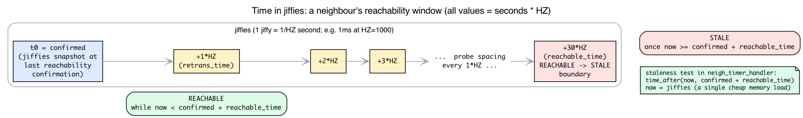
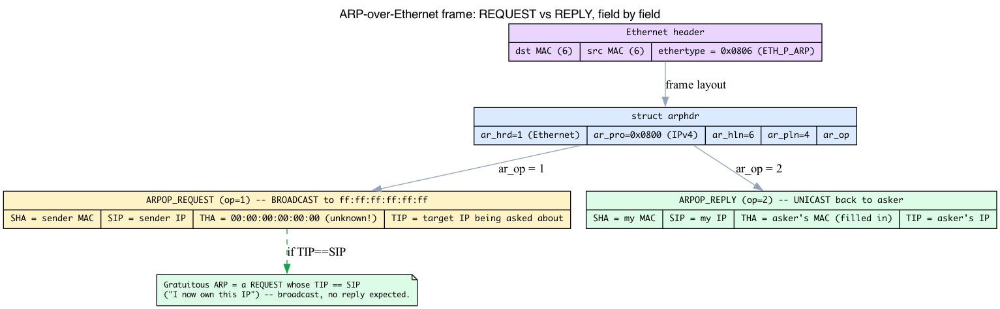
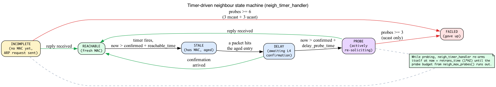

# Day 7 — ARP and the `neighbour` subsystem

> **Today's mission:** see how Linux learns its peers' MAC addresses, the state machine an ARP entry walks through, and what happens at scale — plus the four pieces of background that make the state machine make sense: the kernel's notion of *time*, the kernel *timer* that drives the states, the ARP packet *on the wire*, and how a flat-looking "table" is really a hashed, garbage-collected cache. Total time: ~110 minutes.

## ARP in one paragraph

When Linux wants to send an IP packet to some next-hop IP on a directly connected network, it needs the destination's MAC. The protocol is **ARP** (RFC 826): broadcast a query, receive a reply, cache the result. The cache is what `ip neigh` shows.

But "ARP" in Linux is a specific case of a more general **neighbour subsystem** at `net/core/neighbour.c`. The same code handles IPv6 NDP (Neighbour Discovery Protocol) and InfiniBand IPoIB. The L4-protocol-specific bits live in `net/ipv4/arp.c`.

How does an arriving ARP frame even reach this code? Recall `eth_type_trans` from Day 6: it reads the Ethernet frame's EtherType and stores it in `skb->protocol`, and the core stack uses that value to pick a handler. ARP frames carry **`ETH_P_ARP` = 0x0806** (`include/uapi/linux/if_ether.h:54`), so they're dispatched to `arp_rcv` rather than `ip_rcv` (0x0800). Same demux you saw on the RX path — just a different EtherType key.

Most of this chapter is about *time*: "REACHABLE for 30s," "probe every 1s," "stale after 60s." So before anything else, we need to know what the kernel means by a second.

## Background: jiffies and HZ — the kernel's notion of time

The kernel can't call `gettimeofday()` on every packet — that's far too expensive for the hot path. Instead it keeps a single, dirt-cheap counter that a periodic timer interrupt bumps on a fixed schedule:

- A **jiffy** is one tick of the kernel's periodic timer interrupt.
- The global counter **`jiffies`** increments by one on every tick. Reading it is a single memory load — this is the kernel's cheap monotonic clock.
- **`HZ`** is the tick *rate* (ticks per second). It's a compile-time constant — `# define HZ CONFIG_HZ` (`include/asm-generic/param.h:8`) — and common values are 100, 250, or 1000. On a `HZ=1000` kernel, one jiffy is 1 ms; on `HZ=250`, one jiffy is 4 ms.

The key consequence: **a duration in seconds is `seconds * HZ` jiffies.** That's why the kernel source writes `30 * HZ`, `1 * HZ`, `5 * HZ` instead of literal millisecond counts — the same expression yields the right tick count whatever `HZ` the kernel was built with. Look at the ARP defaults (`net/ipv4/arp.c:152`):

```c
struct neigh_table arp_tbl = {
    .parms = {
        .reachable_time = 30 * HZ,          /* REACHABLE lasts ~30s   */
        .data = {
            [NEIGH_VAR_MCAST_PROBES]   = 3,
            [NEIGH_VAR_UCAST_PROBES]   = 3,
            [NEIGH_VAR_RETRANS_TIME]   = 1 * HZ,   /* probe spacing ~1s */
            [NEIGH_VAR_DELAY_PROBE_TIME] = 5 * HZ, /* DELAY window ~5s  */
            [NEIGH_VAR_GC_STALETIME]   = 60 * HZ,  /* GC after ~60s     */
            /* ... */
        },
    },
    .gc_thresh1 = 128, .gc_thresh2 = 512, .gc_thresh3 = 1024,
};
```

So when this chapter says "REACHABLE for 30s" or "retrans 1s," the struct literally holds `30 * HZ` and `1 * HZ` *jiffies* — not seconds, not milliseconds.

The neighbour's timestamp fields are jiffies snapshots too. In `struct neighbour` (`include/net/neighbour.h:140`):

```c
unsigned long confirmed;   /* neighbour.h:145 — jiffies at last reachability confirmation */
unsigned long updated;     /* neighbour.h:146 — jiffies at last state change            */
```

"Is this entry stale?" is therefore never wall-clock arithmetic; it's a jiffy comparison like `time_after(now, confirmed + reachable_time)`, where `now = jiffies`. You'll see that exact pattern in the timer handler in a moment.

> **One footnote so the sysctls make sense.** Because the unit is jiffies, the same `.data[]` slot is exposed to userspace under *two* names — a ticks form and a `*_MS` milliseconds alias (e.g. `NEIGH_VAR_RETRANS_TIME` vs `RETRANS_TIME_MS`). That's why `ip-sysctl.rst` lets you read or write `retrans_time` (jiffies) or `retrans_time_ms` (milliseconds) for the same underlying value.



## The ARP wire format

Before we cache MACs, let's see what's actually *in* an ARP packet — otherwise "request is broadcast, reply is unicast" and "gratuitous ARP" are just assertions. An ARP message is a tiny fixed header followed by four variable-length address fields. The fixed header is `struct arphdr` (`include/uapi/linux/if_arp.h:145`):

```c
struct arphdr {
    __be16        ar_hrd;   /* hardware type (1 = Ethernet)        */
    __be16        ar_pro;   /* protocol type (0x0800 = IPv4)       */
    unsigned char ar_hln;   /* hardware address length (6 for MAC) */
    unsigned char ar_pln;   /* protocol address length (4 for IPv4)*/
    __be16        ar_op;    /* opcode: request or reply            */
};
/* then, for ARP-over-Ethernet (commented in the header at if_arp.h:156-159): */
/*   ar_sha[6]  sender hardware address (SHA)  */
/*   ar_sip[4]  sender IP address       (SIP)  */
/*   ar_tha[6]  target hardware address (THA)  */
/*   ar_tip[4]  target IP address       (TIP)  */
```

The **opcode** (`ar_op`) is what distinguishes the two messages (`include/uapi/linux/if_arp.h:107-108`):

- **`ARPOP_REQUEST` = 1** — "who has TIP? tell SIP." Sent to the Ethernet **broadcast** MAC `ff:ff:ff:ff:ff:ff` so every host on the segment sees it. The sender fills in SHA + SIP + TIP and leaves **THA = 00:00:00:00:00:00** (it doesn't know the target's MAC yet — that's the whole question).
- **`ARPOP_REPLY` = 2** — "TIP is at THA." The host that owns TIP fills in its own MAC as THA and sends it **unicast** straight back to the asker.

That's exactly what a `tcpdump -e` capture shows in the lab below: one broadcast request with an empty target MAC, one unicast reply with it filled in. The parsing happens in `arp_process` (`net/ipv4/arp.c:702`), reached from `arp_rcv` (`net/ipv4/arp.c:967`); outgoing requests/replies are built and sent by `arp_send` (`net/ipv4/arp.c:323`).

**Gratuitous ARP** falls right out of this layout: it's just a *request* whose **TIP equals its SIP**. Re-read that with the fields in hand — the node is announcing "I (SIP) now own this IP," and because it's a broadcast request, everyone updates their cache unsolicited. No reply is expected; the point is the announcement.



## The neighbour table


`struct neigh_table arp_tbl` (`net/ipv4/arp.c:152`) holds all IPv4 neighbour entries. Each entry is a `struct neighbour` (`include/net/neighbour.h:140`) with:

- `primary_key` (`neighbour.h:169`): the next-hop IP address — the lookup key.
- `ha[MAX_ADDR_LEN]`: hardware address (MAC).
- `dev`: which netdev this neighbour is reachable through.
- `nud_state`: state machine (REACHABLE, STALE, INCOMPLETE, ...).
- `confirmed`/`updated`: jiffies snapshots (the timestamps from the jiffies section).
- `arp_queue`: skbs waiting for resolution.

### It's a hash table, not a list

We keep saying "the table," but it isn't a flat list. `arp_tbl.nht` (`include/net/neighbour.h:244`) points at a **`struct neigh_hash_table`** (`include/net/neighbour.h:201`):

```c
struct neigh_hash_table {
    struct hlist_head *hash_heads;   /* array of hash buckets        */
    unsigned int       hash_shift;   /* current size = 1 << shift     */
    __u32              hash_rnd[NEIGH_NUM_HASH_RND]; /* random seeds (=4, anti-collision) */
    struct rcu_head    rcu;
};
```

An entry lives in the bucket chosen by hashing its key (next-hop IP) plus `dev`. Each `struct neighbour` is linked into its bucket through `struct hlist_node hash;` (`neighbour.h:141`). A lookup — `neigh_lookup` (`net/core/neighbour.c:625`), or the fast inline `__neigh_lookup` — hashes the key, then walks just **that one bucket's** hlist. As the population grows the table is **rehashed** to a bigger size, keeping chains short. That's why a gateway with thousands of peers still resolves each next hop in roughly O(1).

Two details make the hot path safe and cheap:

- **RCU read side.** The bucket walk happens under RCU read-side protection — *no lock* on the per-packet lookup path. (RCU, in one sentence: readers proceed lock-free, and a removed object isn't actually freed until all concurrent readers have finished, so a lookup can safely hold a pointer that another CPU is deleting.)
- **Refcounts, freed via RCU.** Each entry carries `refcount_t refcnt;` (`neighbour.h:148`) and a `struct rcu_head rcu;` (`neighbour.h:166`). This is the same *free-at-zero* refcount discipline you learned for `sk_buff->users` on Day 1, applied to neighbours: hold a reference while you use the entry, drop it when done, and the object is reclaimed only when the count hits zero and RCU says no reader can still see it.

## Background: the timer that *drives* the state machine

Here's the thing the state diagram never shows: states don't change on their own. The engine that advances a neighbour from REACHABLE to STALE, or from INCOMPLETE to FAILED, is a **per-entry kernel timer**.

Each `struct neighbour` embeds one (`include/net/neighbour.h:151`):

```c
struct timer_list timer;
```

A **`timer_list`** is the kernel's basic one-shot timer: you arm it with a future expiry expressed in **jiffies**, and when `jiffies` reaches that value the kernel's timer machinery calls the callback you registered. The neighbour subsystem wires the callback at construction time (`net/core/neighbour.c:534`):

```c
timer_setup(&n->timer, neigh_timer_handler, 0);
```

> Day 5 introduced *workqueues* — deferred work that runs in process context and may sleep — when tearing down a netns. A `timer_list` is a different mechanism Day 5 did not cover: its callback runs **atomically** (softirq context, cannot sleep) and fires at a **scheduled jiffy**, not "whenever a worker thread gets around to it." The neighbour subsystem uses a *timer* for each entry's per-entry state, and (separately) a `delayed_work` for table-wide garbage collection — we'll meet the GC one later.

When the timer fires, `neigh_timer_handler` (`net/core/neighbour.c:1103`) runs. It reads `now = jiffies` (`neighbour.c:1114`), looks at `nud_state` and the timing constants, and either **re-arms itself** (still probing) or **transitions the entry**. The real transitions, straight from the source:

- **REACHABLE** → if `now` is past `confirmed + reachable_time`, demote to **STALE** (or **DELAY** if the entry was recently used). (`neighbour.c:1120-1139`)
- **DELAY** → if confirmation came in, promote back to **REACHABLE**; otherwise go to **PROBE** and start actively soliciting. (`neighbour.c:1140-1162`)
- **PROBE / INCOMPLETE** → re-arm at `now + retrans_time` to send the next probe — *until the probe budget is exhausted.*

That budget is the missing piece behind "6 probes / 3 probes." It's computed by `neigh_max_probes` (`net/core/neighbour.c:1054`):

```c
static __inline__ int neigh_max_probes(struct neighbour *n)
{
    struct neigh_parms *p = n->parms;
    return NEIGH_VAR(p, UCAST_PROBES) + NEIGH_VAR(p, APP_PROBES) +
           (n->nud_state & NUD_PROBE ? NEIGH_VAR(p, MCAST_REPROBES)
                                     : NEIGH_VAR(p, MCAST_PROBES));
}
```

With ARP defaults (`UCAST_PROBES = 3`, `MCAST_PROBES = 3`, `MCAST_REPROBES = 0`, `APP_PROBES = 0`):

- **INCOMPLETE** (not yet in PROBE): `3 + 0 + 3 = 6` is the threshold.
- **PROBE** (already had a MAC, re-confirming): `3 + 0 + 0 = 3` is the threshold.

But the *threshold* and the *number of packets actually sent* differ for INCOMPLETE. When `__neigh_event_send` first drives an entry into INCOMPLETE it **pre-seeds** the probe counter to `UCAST_PROBES` = 3 (`neighbour.c:1224`, `atomic_set(&neigh->probes, UCAST_PROBES)`). The timer then increments the counter once per multicast solicitation, climbing 3 → 4 → 5 → 6; at 6 it equals the threshold and the entry fails. So only **3 multicast ARP requests** are actually emitted in INCOMPLETE — and they are *all* multicast, because `arp_solicit` computes `probes -= UCAST_PROBES` (`arp.c:376`) which is always ≥ 0 here, forcing the multicast branch every time. No unicast probe is possible while INCOMPLETE: there is no MAC to unicast to. (Those `UCAST_PROBES` unicast probes belong to PROBE-state revalidation, where the entry already has a stale MAC.)

Once `probes >= neigh_max_probes(neigh)` for an INCOMPLETE or PROBE entry, the handler gives up (`neighbour.c:1164-1169`): INCOMPLETE → **NUD_FAILED**, PROBE → STALE/FAILED. *That* is the timer-driven mechanism behind "first ping takes ~1ms longer" (one resolution round-trip before the entry is REACHABLE) and "INCOMPLETE → FAILED after the probes."



## The state machine


A neighbour entry walks through states — and now you know the timer is what moves it:

- **NONE** — newly created, no resolution attempted yet.
- **INCOMPLETE** — ARP request sent, waiting for reply. Skbs going to this neighbour queue here.
- **REACHABLE** — fresh, recent confirmation (default `reachable_time = 30s`, i.e. `30 * HZ` jiffies).
- **STALE** — has MAC but old. Next packet triggers a confirmation probe.
- **DELAY** — sent a packet expecting the L4 to confirm reachability quickly.
- **PROBE** — actively probing via ARP.
- **FAILED** — ARP timed out. Probe limits are state-dependent. INCOMPLETE resolution sends up to `mcast_solicit` (default 3) **multicast** ARP requests, spaced by `retrans_time` (1s), then → FAILED; no unicast is possible here because the MAC is still unknown. (`neigh_max_probes()` returns `ucast + mcast = 6` for INCOMPLETE, but `__neigh_event_send` seeds the probe counter to `UCAST_PROBES` = 3 on entry — `neighbour.c:1224` — so `arp_solicit`'s `probes -= UCAST_PROBES` is always ≥ 0 and it always takes the *multicast* branch. Net result: 3 multicast requests, then FAILED.) PROBE-state revalidation — when an entry already **has** an old MAC — sends up to `ucast_solicit` (default 3) **unicast** probes instead.

The state machine is the canonical answer to "why does my first ping take 1ms longer than subsequent ones?" — first packet goes through INCOMPLETE → REACHABLE; later packets hit a cached entry directly.

## Lookup on TX


When `ip_finish_output2` (`net/ipv4/ip_output.c:231`) needs the next-hop's MAC, it calls `ip_neigh_for_gw` → `ip_neigh_gw4` → **`__ipv4_neigh_lookup_noref`** (`include/net/route.h:400-425`) — a **lockless RCU** hash lookup, *not* the read-locked `neigh_lookup()` slow path. Only on a miss does it fall back to `__neigh_create` (`net/core/neighbour.c:646`). If the entry is INCOMPLETE, the skb is queued on `arp_queue` and the kernel sends an ARP request. When the reply arrives, the queue flushes and the queued skbs are sent.

If the lookup hits FAILED, the skb is dropped and the kernel may send an ICMP "Destination Host Unreachable" back to the source.

> ### Which IPs actually get ARP'd? on-link vs via-gateway
>
> The FAILED lab below hinges on a routing fact, so here's the rule (the full FIB is Day 8). **The kernel only ARPs for the *next hop*, and the next hop depends on routing:**
>
> - A destination on a **directly-connected** subnet (on-link) is *its own next hop* — the kernel ARPs for it directly.
> - A destination **outside every local subnet** is reached *via the gateway* — so the kernel ARPs for the **gateway**, and never for the remote IP at all.
>
> "Directly connected" just means the destination matches one of the interface's configured subnet prefixes (e.g. `192.168.1.0/24` on `eth0`). This is the same next-hop IP that Day 3 said `ip_finish_output2` hands to the neighbour subsystem: routing chooses the next-hop IP, neighbour resolves it to a MAC. And it's confirmed by the table itself — `arp_tbl` has `key_len = 4` and is keyed by `primary_key` (`neighbour.h:169`), i.e. one entry **per next-hop IPv4 address**.
>
> This is *why* the "Watch FAILED state" lab must target an unused address **inside your own subnet**: only then is the destination its own next hop, so your packet triggers a real ARP that can time out to FAILED. An off-subnet address like `10.99.99.99` would just resolve the gateway (already cached) and never produce a FAILED entry for the address you typed.

> ### There are no Dumb Questions
>
> **Q: What is "gratuitous ARP"?**
>
> A: A node announcing its MAC unsolicited (e.g., on interface up, or after a failover). Linux sends one as an `arp_send(ARPOP_REQUEST, ETH_P_ARP, ...)` with target IP == source IP, from `inetdev_send_gratuitous_arp` in `net/ipv4/devinet.c`. It updates other nodes' caches without them having to ask. (With the wire format in hand: it's a request whose TIP == SIP — see the ARP wire-format section.)
>
> **Q: What's `arp_announce` for?**
>
> A: Sysctl that controls *which* IP the kernel uses as source for ARP requests. Default 0 (any local IP); 1 prefers same-subnet; 2 always uses the primary IP of the egress interface. Important for multi-homed servers.
>
> **Q: Why are there gc_thresh1/2/3?**
>
> A: gc_thresh3 is a hard cap; new ARP attempts beyond it fail. Heavy-traffic gateways routinely hit the default 1024 — symptom: `neighbor table overflow!` in dmesg. Bump via sysctl. (The exact mechanism is the next section.)

## How garbage collection enforces gc_thresh1/2/3

The table can't grow forever, so a per-table atomic counter, **`gc_entries`**, is bumped every time an entry is created — and creation consults the three thresholds *before* allocating. The check, in the create path (`net/core/neighbour.c:507`):

```c
entries = atomic_inc_return(&tbl->gc_entries) - 1;
gc_thresh3 = READ_ONCE(tbl->gc_thresh3);
if (entries >= gc_thresh3 ||
    (entries >= READ_ONCE(tbl->gc_thresh2) &&
     time_after(now, READ_ONCE(tbl->last_flush) + 5 * HZ))) {
    if (!neigh_forced_gc(tbl) && entries >= gc_thresh3) {
        net_info_ratelimited("%s: neighbor table overflow!\n", tbl->id);
        NEIGH_CACHE_STAT_INC(tbl, table_fulls);
        goto out_entries;          /* returns -ENOBUFS */
    }
}
```

That's the whole three-tier behaviour, grounded:

- **Below `gc_thresh1` (128):** the periodic GC doesn't even bother — `neigh_periodic_work` early-outs with `if (atomic_read(&tbl->entries) < gc_thresh1) return;` (`net/core/neighbour.c:1000`). (That periodic GC is a `delayed_work` running in the process context Day 5 introduced for netns teardown — no need to re-teach it.)
- **At/above `gc_thresh2` (512)** *and* more than 5 s (`5 * HZ`) since the last flush: a **forced synchronous GC** runs, `neigh_forced_gc` (`net/core/neighbour.c:253`), reclaiming stale entries back down toward `gc_thresh2`.
- **At/above `gc_thresh3` (1024):** if even forced GC can't get back under the cap, creation **fails with `-ENOBUFS`** and emits the rate-limited **`"%s: neighbor table overflow!"`** — the exact dmesg symptom this chapter and the Check question describe.

Two things to keep straight:

- **The data packet isn't dropped *because of* this.** The kernel just couldn't *create the neighbour entry*; that surfaces as a resolution failure / brief hang, not a thrown-away packet at the GC layer. (That's the grounding for the Check answer's "it just refuses to create new entries.")
- **Reclamation targets STALE/old entries; `NUD_PERMANENT` entries are exempt** and never GC'd. That's why the static `nud permanent` pins in the labs survive GC pressure.

## Today's experiment

> **Before you start:** the commands below use `eth0` and the gateway `192.168.1.1` as examples. Replace them with *your* interface and default gateway — derive both from `ip route show default`:
>
> ```bash
> IFACE=$(ip route show default | awk '{print $5; exit}')
> GW=$(ip route show default | awk '{print $3; exit}')
> echo "iface=$IFACE gateway=$GW"
> # iface=eth0 gateway=10.0.0.1
> ```
>
> Run verbatim against a machine whose interface is `ens3`/`enp0s3` or whose gateway is different, and `ip neigh flush dev eth0` fails with "Cannot find device" and `ping 192.168.1.1` goes nowhere. Substitute `$IFACE`/`$GW` (or your real values) wherever you see `eth0`/`192.168.1.1` below.

### See your ARP table

```bash
ip neigh show
# 192.168.1.1 dev eth0 lladdr aa:bb:cc:11:22:33 REACHABLE
# 192.168.1.20 dev eth0 lladdr aa:bb:cc:44:55:66 STALE
```

### Force an ARP from scratch

```bash
sudo ip neigh flush dev eth0
ping -c 1 192.168.1.1
ip neigh show
# entry now REACHABLE
```

### Watch ARP packets

```bash
sudo tcpdump -i eth0 -n arp -e &
sudo ip neigh flush dev eth0
ping -c 1 192.168.1.1
sudo pkill tcpdump   # stop the background capture
```

You'll see the ARP request (broadcast) and reply (unicast) — and now you can read them field-by-field: the request goes to `ff:ff:ff:ff:ff:ff` with `ARPOP_REQUEST` (op 1) and an empty target MAC; the reply comes back unicast with `ARPOP_REPLY` (op 2) and the target MAC filled in. The `pkill` is essential: a backgrounded `tcpdump` with no count/timeout otherwise runs forever, spamming your terminal with every later ARP on the link.

### Trace neighbour state changes

```bash
sudo bpftrace -e '
fentry:neigh_update {
  printf("update: state=%d new_state=%d\n",
         args->neigh->nud_state, args->new);
}'
```

The numbers are NUD bitmask values (`include/uapi/linux/neighbour.h`): `1`=INCOMPLETE, `2`=REACHABLE, `4`=STALE, `8`=DELAY, `16`=PROBE, `32`=FAILED. In another terminal, flush and re-ping the gateway to drive a resolution. `neigh_update()` is the **packet/netlink-driven** path — it's only ever called with `NUD_STALE`, `NUD_REACHABLE`, `NUD_FAILED`, or a user/ndisc-supplied state, so this hook catches transitions like INCOMPLETE→REACHABLE on an arriving reply:

```
# update: state=1 new_state=2   (INCOMPLETE -> REACHABLE, ARP reply received)
```

What this hook will **never** show is the internal `STALE→DELAY`, `DELAY→PROBE`, or timeout-driven `INCOMPLETE→FAILED` transitions: those are `WRITE_ONCE(neigh->nud_state, ...)` stores inside `__neigh_event_send` (`neighbour.c:1249`) and `neigh_timer_handler` — they don't flow through `neigh_update()` at all. To watch *those*, attach an fentry on `neigh_timer_handler` instead, or trace the `nud_state` field directly.

These tie directly back to the state machine at the top of the chapter. (Swap `%d` for `%x` in the `printf` if you'd rather see the raw hex `#define` values.)

### Probe gc thresholds

```bash
sysctl net.ipv4.neigh.default.gc_thresh1   # default 128
sysctl net.ipv4.neigh.default.gc_thresh2   # default 512
sysctl net.ipv4.neigh.default.gc_thresh3   # default 1024

# bump for high-fanout servers:
sudo sysctl -w net.ipv4.neigh.default.gc_thresh3=8192

# restore the default when you're done (this change is non-persistent —
# it's lost on reboot and not written to sysctl.conf):
sudo sysctl -w net.ipv4.neigh.default.gc_thresh3=1024
```

These are the very `gc_thresh1/2/3` fields from `arp_tbl` (`net/ipv4/arp.c:152`) whose create-time check produces `neighbor table overflow!`.

## What to break

### Statically pin a wrong MAC

> **Warning:** do **not** pin a wrong MAC for the gateway on the interface you're SSH-ing in over — it drops your session before you can run the undo, locking you out. Pin a non-gateway LAN peer instead, or run this from the local console.

```bash
sudo ip neigh add 192.168.1.1 lladdr aa:bb:cc:00:00:00 dev eth0 nud permanent
ping -c 3 -W 1 192.168.1.1   # no replies — packets sent to a MAC nobody owns

# undo:
sudo ip neigh del 192.168.1.1 dev eth0
```

This shows the cache is authoritative until the kernel re-resolves. The `-c 3 -W 1` is important: a bare `ping` runs until you Ctrl-C, and until you do, the `del` line never executes and the entry stays poisoned. (The `nud permanent` entry is also GC-exempt — it survives table pressure until you delete it.)

### Watch FAILED state

To actually watch INCOMPLETE → FAILED you must (a) target an address that is *directly connected* — pick an **unused** IP inside your `eth0` subnet, not an off-subnet one like `10.99.99.99` (those route via the gateway, so the kernel never ARPs for them — see the on-link vs via-gateway box) — and (b) send real traffic to kick off resolution. Note too that a bare `ip neigh add IP dev eth0` with no `lladdr`/`nud` is rejected by modern iproute2 ("No link layer address given") and creates no entry at all.

```bash
# pick an unused IP in your eth0 subnet, e.g. 192.168.1.250
sudo ip neigh flush 192.168.1.250 dev eth0 2>/dev/null
ping -c1 -W1 192.168.1.250 || true   # queues a packet -> kernel starts ARPing
sleep 8                              # past the INCOMPLETE probe budget: counter climbs from its UCAST_PROBES seed (3) to neigh_max_probes()=6, sending 3 multicast probes ~1s apart
ip neigh show 192.168.1.250
# 192.168.1.250 dev eth0  FAILED     (briefly INCOMPLETE first)
sudo ip neigh del 192.168.1.250 dev eth0   # cleanup
```

The 8-second wait is no accident: it's past the INCOMPLETE probe budget. The counter is seeded at `UCAST_PROBES` (3) and increments once per multicast solicitation, so it sends 3 multicast probes spaced `retrans_time` (`1 * HZ`) apart (~3s of probing) before `neigh_max_probes()` = 6 trips and the timer flips the entry to FAILED. Eight seconds leaves a comfortable margin.

---

## What to read in the kernel

- **`net/core/neighbour.c`** — the generic subsystem. Read `neigh_lookup` (line 625), `___neigh_create` (line 646), `neigh_update`, `neigh_timer_handler` (line 1103 — the state machine engine), `neigh_max_probes` (line 1054 — the probe budget), and the GC create-time check (lines 507–516).
- **`net/ipv4/arp.c`** — ARP-specific protocol. `arp_rcv` (line 967), `arp_send` (line 323), `arp_process` (line 702), `arp_solicit`, and `arp_tbl` (line 152). ~1500 lines.
- **`include/net/neighbour.h`** — `struct neighbour` (line 140), `struct neigh_hash_table` (line 201), the `nht` field (line 244), the NUD_* state constants.
- **`include/uapi/linux/if_arp.h`** — `struct arphdr` (line 145), `ARPOP_REQUEST`/`ARPOP_REPLY` (lines 107–108).
- **`Documentation/networking/ip-sysctl.rst`** — the `neigh.*` sysctls (gc thresholds, probe counts, timers, and the jiffies-vs-`*_ms` aliases); pair it with the source itself.

---

## Bullet Points

- The kernel measures time in **jiffies** (`jiffies` increments once per timer tick; `HZ` ticks/second). A duration is `seconds * HZ` jiffies — hence `30 * HZ`, `1 * HZ` in the source. `neighbour.confirmed`/`updated` are jiffies snapshots; staleness is a `time_after(now, confirmed + reachable_time)` comparison.
- An **ARP packet** is `struct arphdr` (hw/proto type, lengths, opcode) + SHA/SIP/THA/TIP. `ARPOP_REQUEST` (1) is broadcast with an empty THA; `ARPOP_REPLY` (2) is unicast with THA filled in. **Gratuitous ARP** = a request with TIP == SIP.
- The neighbour subsystem (ARP for IPv4, NDP for IPv6) lives at `net/core/neighbour.c`. The "table" is a **resizable, RCU-protected hash table** (`neigh_hash_table`) keyed per next-hop IP; lookups walk one bucket lock-free; entries are refcounted and RCU-freed (same free-at-zero model as Day 1's sk_buff).
- A **per-entry `timer_list`** drives the state machine: `neigh_timer_handler` re-arms or transitions entries. `neigh_max_probes()` = 6 for INCOMPLETE, 3 for PROBE (ARP defaults), but because the counter is pre-seeded to `UCAST_PROBES` (3), an INCOMPLETE entry actually emits **3 multicast** ARP requests before FAILED; the 3 unicast probes belong to PROBE-state revalidation of an entry that already has a (stale) MAC.
- Entries cycle through **NONE → INCOMPLETE → REACHABLE → STALE → DELAY → PROBE → REACHABLE/FAILED**.
- The kernel only ARPs the **next hop**: on-link destinations are their own next hop; off-subnet ones resolve the **gateway** (full FIB is Day 8).
- TX-side lookup is a **lockless RCU** hash lookup — `ip_neigh_for_gw` → `__ipv4_neigh_lookup_noref` in `ip_finish_output2`, falling back to `__neigh_create` on a miss (the exported `neigh_lookup` is for netlink/proc callers, not the per-packet path). Skbs queue on `arp_queue` while a neighbour is INCOMPLETE.
- **GC thresholds** (`gc_thresh1/2/3`, default 128/512/1024) cap entry count via a `gc_entries` counter checked at create time; exceeding `gc_thresh3` after forced GC returns `-ENOBUFS` and logs `neighbor table overflow!`. `NUD_PERMANENT` entries are GC-exempt.
- Inspect: `ip neigh show`. Manipulate: `ip neigh add/del/replace`.

---

## Check question

You set `net.ipv4.neigh.default.gc_thresh3=128` on a server with 500 active client peers. What symptoms appear?

<details>
<summary>Click to reveal answer</summary>

**Answer:** `neighbor table overflow!` messages in `dmesg`. New connections to peers whose ARP entries got evicted will hang briefly while ARP re-resolves; if entries are evicted faster than they're re-resolved, traffic stalls. The fix is to raise `gc_thresh3` (and `gc_thresh1/2` proportionally — typically 4096/8192/16384 for a busy server). The kernel doesn't drop packets directly because of this; it just refuses to create new entries, which manifests as resolution failures.

</details>

---

## Tomorrow

Day 8: IP routing — the FIB. How the kernel decides where to send a packet (and therefore *which* next-hop IP the neighbour subsystem resolves), and why route lookups are so cheap on modern hardware.
