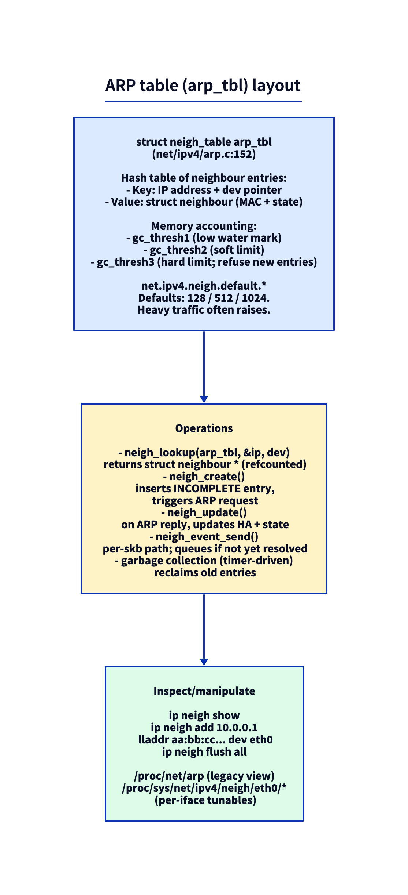
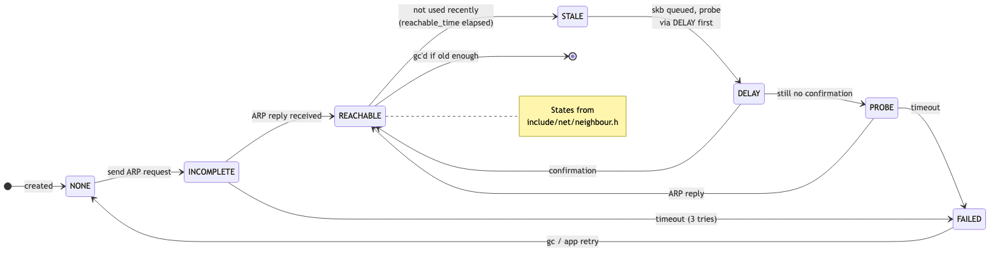
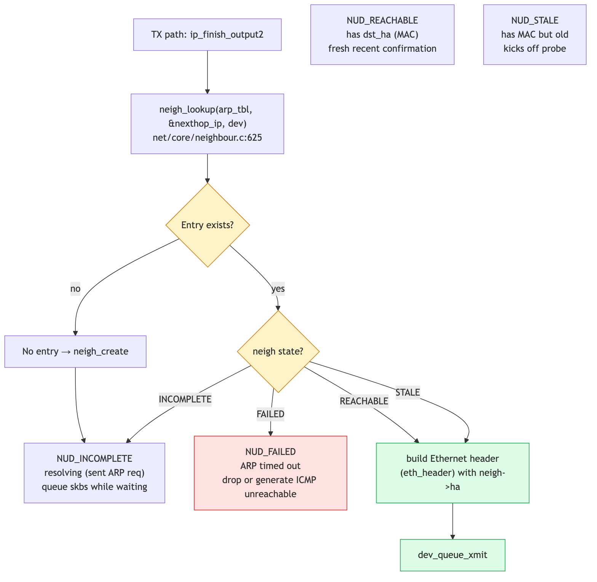

# Day 7 — ARP and the `neighbour` subsystem

> **Today's mission:** see how Linux learns its peers' MAC addresses, the state machine an ARP entry walks through, and what happens at scale. Total time: ~75 minutes.

## ARP in one paragraph

When Linux wants to send an IP packet to some next-hop IP on a directly connected network, it needs the destination's MAC. The protocol is **ARP** (RFC 826): broadcast a query, receive a reply, cache the result. The cache is what `ip neigh` shows.

But "ARP" in Linux is a specific case of a more general **neighbour subsystem** at `net/core/neighbour.c`. The same code handles IPv6 NDP (Neighbour Discovery Protocol) and InfiniBand IPoIB. The L4-protocol-specific bits live in `net/ipv4/arp.c`.

## The neighbour table



`struct neigh_table arp_tbl` (`net/ipv4/arp.c:152`) holds all IPv4 neighbour entries. Each entry is a `struct neighbour` (`include/net/neighbour.h:140`) with:

- `primary_key`: the IP address.
- `ha[MAX_ADDR_LEN]`: hardware address (MAC).
- `dev`: which netdev this neighbour is reachable through.
- `nud_state`: state machine (REACHABLE, STALE, INCOMPLETE, ...).
- `confirmed`: jiffies of last confirmed reachability.
- `arp_queue`: skbs waiting for resolution.

## The state machine



A neighbour entry walks through states:

- **NONE** — newly created, no resolution attempted yet.
- **INCOMPLETE** — ARP request sent, waiting for reply. Skbs going to this neighbour queue here.
- **REACHABLE** — fresh, recent confirmation (default `reachable_time = 30s`).
- **STALE** — has MAC but old. Next packet triggers a confirmation probe.
- **DELAY** — sent a packet expecting the L4 to confirm reachability quickly.
- **PROBE** — actively probing via ARP.
- **FAILED** — ARP timed out. Probe limits are state-dependent: INCOMPLETE resolution allows up to 6 probes (3 multicast + 3 unicast), PROBE state up to 3 (unicast only), each spaced by `retrans_time` (1s default).

The state machine is the canonical answer to "why does my first ping take 1ms longer than subsequent ones?" — first packet goes through INCOMPLETE → REACHABLE; later packets hit a cached entry directly.

## Lookup on TX



When `ip_finish_output2` needs the next-hop's MAC, it calls into `neigh_lookup` → `__neigh_create` if not found. If the entry is INCOMPLETE, the skb is queued on `arp_queue` and the kernel sends an ARP request. When the reply arrives, the queue flushes and the queued skbs are sent.

If the lookup hits FAILED, the skb is dropped and the kernel may send an ICMP "Destination Host Unreachable" back to the source.

> ### There are no Dumb Questions
>
> **Q: What is "gratuitous ARP"?**
>
> A: A node announcing its MAC unsolicited (e.g., on interface up, or after a failover). Linux sends one as an `arp_send(ARPOP_REQUEST, ETH_P_ARP, ...)` with target IP == source IP, from `inetdev_send_gratuitous_arp` in `net/ipv4/devinet.c`. It updates other nodes' caches without them having to ask.
>
> **Q: What's `arp_announce` for?**
>
> A: Sysctl that controls *which* IP the kernel uses as source for ARP requests. Default 0 (any local IP); 1 prefers same-subnet; 2 always uses the primary IP of the egress interface. Important for multi-homed servers.
>
> **Q: Why are there gc_thresh1/2/3?**
>
> A: gc_thresh3 is a hard cap; new ARP attempts beyond it fail. Heavy-traffic gateways routinely hit the default 1024 — symptom: `neighbor table overflow!` in dmesg. Bump via sysctl.

## Today's experiment

### See your ARP table

```bash
ip neigh show
# 192.168.1.1 dev eth0 lladdr aa:bb:cc:11:22:33 REACHABLE
# 192.168.1.20 dev eth0 lladdr aa:bb:cc:44:55:66 STALE
```

### Force an ARP from scratch

```bash
sudo ip neigh flush dev eth0
ping -c 1 192.168.1.1
ip neigh show
# entry now REACHABLE
```

### Watch ARP packets

```bash
sudo tcpdump -i eth0 -n arp -e &
sudo ip neigh flush dev eth0
ping -c 1 192.168.1.1
```

You'll see the ARP request (broadcast) and reply (unicast).

### Trace neighbour state changes

```bash
sudo bpftrace -e '
fentry:neigh_update {
  printf("update: state=%d new_state=%d\n",
         args->neigh->nud_state, args->new);
}'
```

### Probe gc thresholds

```bash
sysctl net.ipv4.neigh.default.gc_thresh1
sysctl net.ipv4.neigh.default.gc_thresh2
sysctl net.ipv4.neigh.default.gc_thresh3

# bump for high-fanout servers:
sudo sysctl -w net.ipv4.neigh.default.gc_thresh3=8192
```

## What to break

### Statically pin a wrong MAC

```bash
sudo ip neigh add 192.168.1.1 lladdr aa:bb:cc:00:00:00 dev eth0 nud permanent
ping 192.168.1.1   # times out — packets sent to wrong MAC

# undo:
sudo ip neigh del 192.168.1.1 dev eth0
```

This shows the cache is authoritative until the kernel re-resolves.

### Watch FAILED state

```bash
sudo ip neigh add 10.99.99.99 dev eth0   # nonexistent host
sleep 5
ip neigh show 10.99.99.99
# 10.99.99.99 dev eth0 INCOMPLETE / FAILED after retries
```

---

## What to read in the kernel

- **`net/core/neighbour.c`** — the generic subsystem. Read `neigh_lookup` (line 625), `___neigh_create` (line 646), `neigh_update`, `neigh_timer_handler` (the state machine).
- **`net/ipv4/arp.c`** — ARP-specific protocol. `arp_rcv`, `arp_send`, `arp_solicit`. ~1500 lines.
- **`include/net/neighbour.h`** — `struct neighbour` (line 140), the NUD_* state constants.
- **`Documentation/networking/ip-sysctl.rst`** — the `neigh.*` sysctls (gc thresholds, probe counts, timers); pair it with the source itself.

---

## Bullet Points

- The neighbour subsystem (ARP for IPv4, NDP for IPv6) lives at `net/core/neighbour.c`.
- Entries cycle through **NONE → INCOMPLETE → REACHABLE → STALE → DELAY → PROBE → REACHABLE/FAILED**.
- TX-side lookup is via **`neigh_lookup`** in `ip_finish_output2`.
- Skbs queue on `arp_queue` while a neighbour is INCOMPLETE.
- **GC thresholds** (`gc_thresh1/2/3`) cap entry count; default 128/512/1024.
- Inspect: `ip neigh show`. Manipulate: `ip neigh add/del/replace`.
- **Gratuitous ARP** announces MAC changes (e.g., failover).

---

## Check question

You set `net.ipv4.neigh.default.gc_thresh3=128` on a server with 500 active client peers. What symptoms appear?

<details>
<summary>Click to reveal answer</summary>

**Answer:** `neighbor table overflow!` messages in `dmesg`. New connections to peers whose ARP entries got evicted will hang briefly while ARP re-resolves; if entries are evicted faster than they're re-resolved, traffic stalls. The fix is to raise `gc_thresh3` (and `gc_thresh1/2` proportionally — typically 4096/8192/16384 for a busy server). The kernel doesn't drop packets directly because of this; it just refuses to create new entries, which manifests as resolution failures.

</details>

---

## Tomorrow

Day 8: IP routing — the FIB. How the kernel decides where to send a packet, and why route lookups are so cheap on modern hardware.
