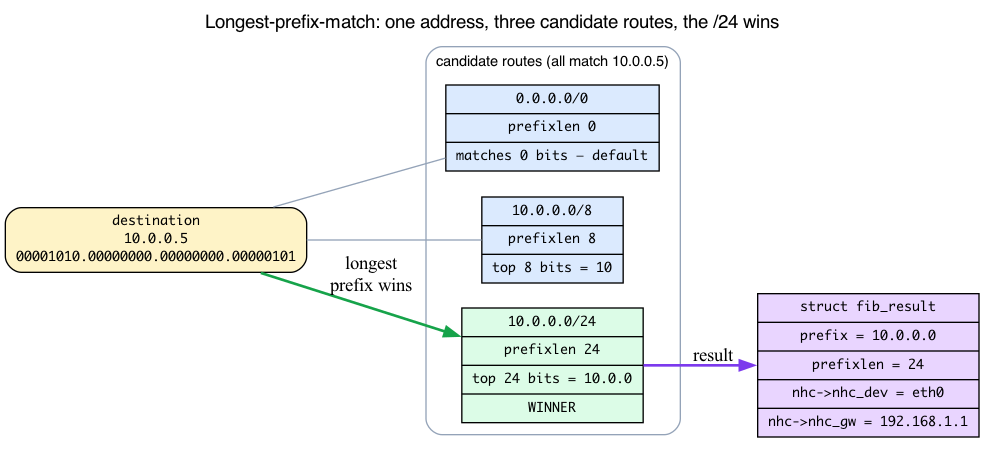
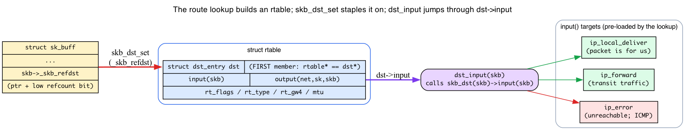
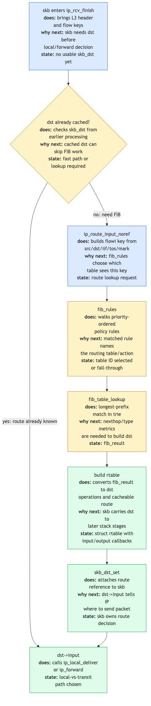
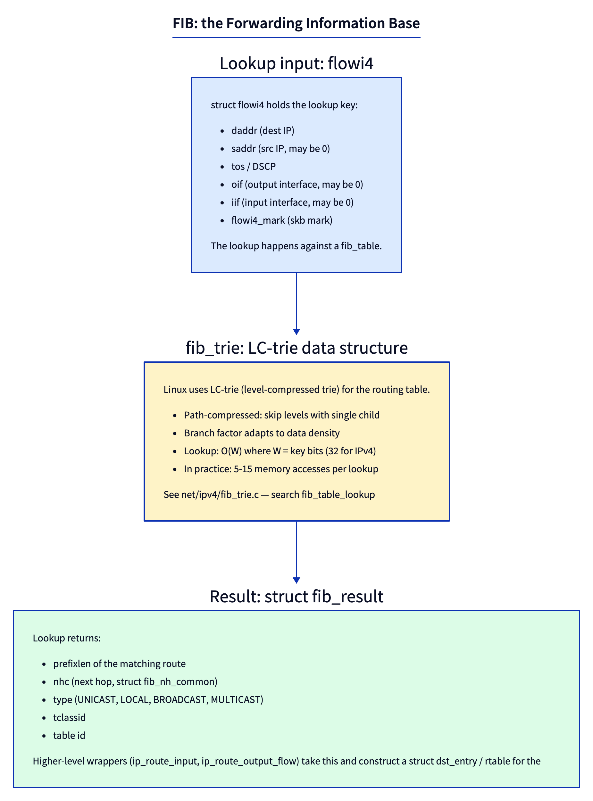
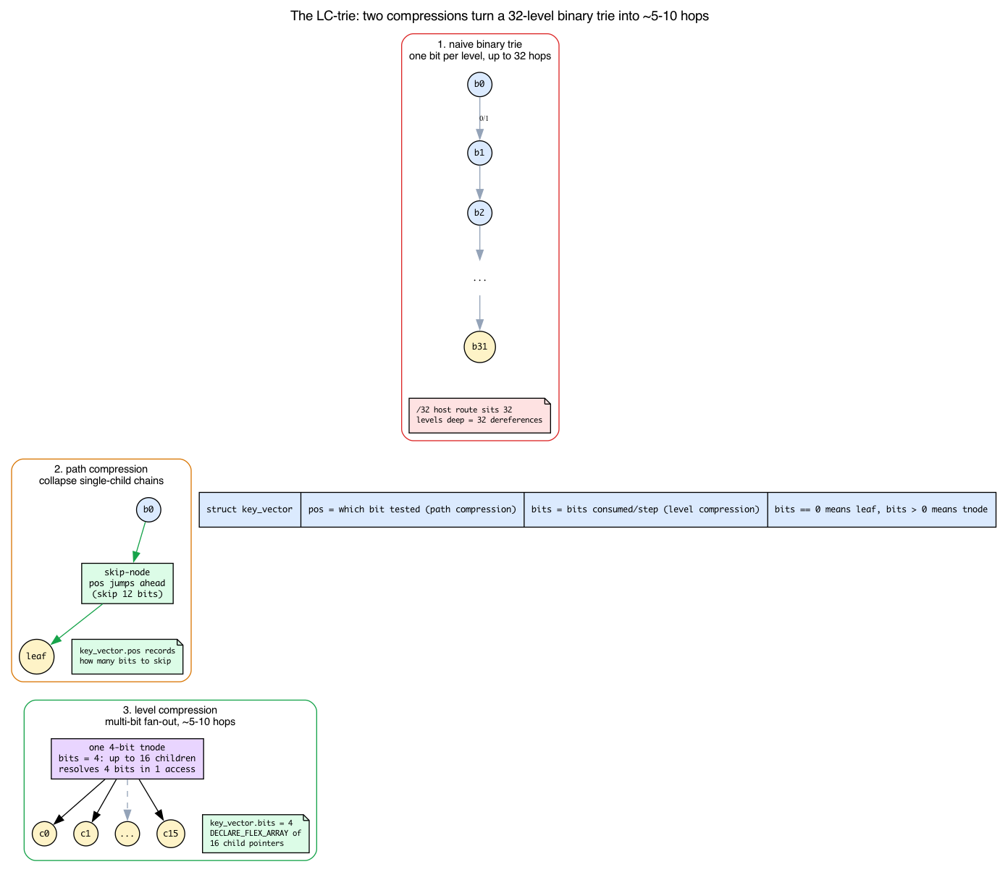
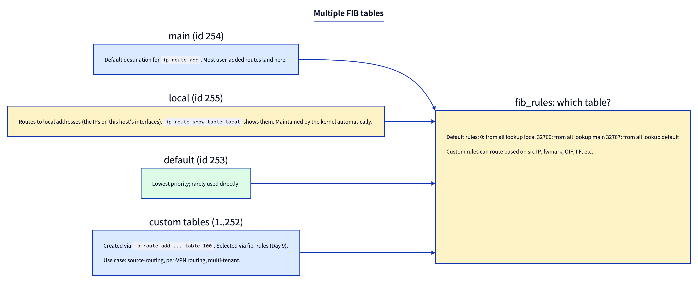
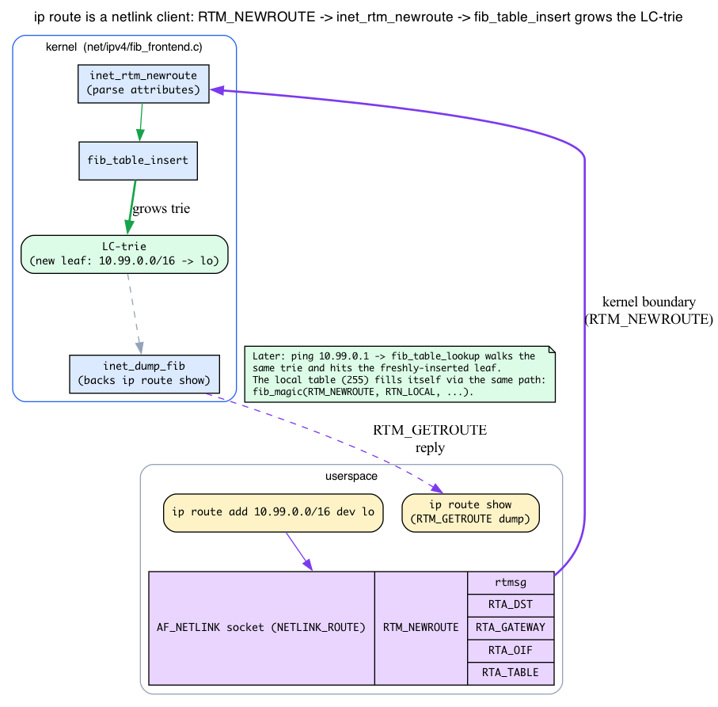

# Day 8 — IP routing: the FIB

> **Today's mission:** see how Linux decides where to send a packet, learn the data structure that powers route lookups, and understand how the result gets stapled onto the packet — and how `ip route` programs the table in the first place. We'll teach four mechanisms the routing path leans on (the `dst_entry` handle, longest-prefix-match semantics, the LC-trie, and the rtnetlink config channel) so nothing in the path is a black box. Total time: ~110 minutes.

## What "routing" means in Linux

Every packet that needs to go *somewhere not-here* requires a routing decision: which next-hop, which output interface, which source IP. The decision is fast — sub-microsecond on modern hardware, even against tables with hundreds of thousands of routes.

That speed comes from the **FIB** (Forwarding Information Base) and the **LC-trie** (level-compressed trie) data structure backing it. But before we touch the trie, we have to be honest about some things the rest of this chapter quietly assumes you already know: *what it means for a route to "match,"* *what handle the lookup result is delivered through,* *how the trie itself works,* and *how a route got into the table at all.* Days 1–7 never taught any of these. Two of them we teach up front (what "match" means, and the handle the result rides on); the trie itself and the write-side config channel we build up as we reach them — intuition first, then the concrete v7.1 struct.

## Background 1: longest-prefix-match — what "the route matches" actually means

Picture your routing table as a stack of rules, each one saying "addresses that *start with these bits* go this way." That "starts with these bits" idea is a **prefix**, and a route is a **prefix plus a prefix length**:

- `10.0.0.0/24` means "addresses whose top **24** bits equal `10.0.0.0`."
- `10.0.0.0/8` means "addresses whose top **8** bits equal `10`."
- `0.0.0.0/0` — the **default route** — has prefix length **0**, so *zero* bits have to match. It matches **everything**.

Here's the catch that makes routing interesting: a single destination address can match **several** routes at once. A packet to `10.0.0.5` matches all three of the routes above simultaneously. So which one wins?

**The rule: the most specific match wins — the longest prefix length.** `10.0.0.0/24` (24 bits) beats `10.0.0.0/8` (8 bits) beats `0.0.0.0/0` (0 bits). This is **longest-prefix-match (LPM)**, and it's what makes routing deterministic. It's also *why* the default route is the last resort: `0.0.0.0/0` only wins when nothing more specific matched. (That's exactly why the "break a default route" lab later in this chapter works — strip away the specific routes and the `/0` catches the packet.)



The lookup result records *which* prefix won. That result is a `struct fib_result` (`include/net/ip_fib.h:173`):

```c
struct fib_result {
    __be32          prefix;     /* the matched prefix, e.g. 10.0.0.0 */
    unsigned char   prefixlen;  /* its length, e.g. 24 — how the winner was chosen */
    unsigned char   nh_sel;
    unsigned char   type;       /* RTN_UNICAST, RTN_LOCAL, RTN_BROADCAST, ... */
    unsigned char   scope;
    struct fib_nh_common *nhc;  /* next-hop info */
    struct fib_info *fi;
    struct fib_table *table;
    /* ...tclassid, dscp, fa_head in v7.1... */
};
```

`prefix` and `prefixlen` are the matched prefix and its length — the winner of the LPM contest. The interesting field is **`nhc`**, the next-hop, a `struct fib_nh_common` (`include/net/ip_fib.h:83`):

```c
struct fib_nh_common {
    struct net_device   *nhc_dev;     /* egress interface */
    int                  nhc_oif;
    u8                   nhc_gw_family;
    union {
        __be32          ipv4;         /* gateway IP, if any */
        struct in6_addr ipv6;
    } nhc_gw;
    /* ... */
};
```

It tells you the egress device (`nhc_dev`/`nhc_oif`) and the gateway IP (if any) (`nhc_gw_family` + `nhc_gw`). (The preferred source IP and the route MTU are *not* in `fib_nh_common` — they come from the enclosing `fib_nh`'s `nh_saddr` and from the route's metrics on the `dst`, respectively.)

The **`type`** field is why the same machinery answers both "forward this" and "this is for us." `RTN_UNICAST` (`include/uapi/linux/rtnetlink.h:263`) is a gateway or direct route; `RTN_LOCAL` (`:264`) means "accept locally"; `RTN_BROADCAST` (`:265`). The kernel keeps its own host IPs as `RTN_LOCAL` entries in a separate table — more on that below.

One more connection: LPM is *why* the FIB is a **trie keyed on address bits** and not a hash. A hash gives you exact-match — great for "is this exact key present?" But routing needs "what's the longest prefix that is a *leading substring* of this address?" A bitwise trie answers that naturally: descend as far as the address bits keep agreeing, and the deepest matching prefix is the answer. That's the structure we build up in Background 3.

## Background 2: the `dst_entry` — how a route result rides on the packet

The lookup found a winner. Now what? The kernel doesn't return a raw "go out eth0 via 192.168.1.1" answer and leave the caller to interpret it. Instead it builds a small object, **staples it onto the skb**, and lets the packet carry its own "what happens next" instructions. That object is the **`dst_entry`** ("destination entry"), and it's the single most important handle in the forwarding path.

### Intuition: a per-packet "next step" with two function pointers

Think of `dst_entry` as a tiny instruction card pinned to the packet. The card has two slots:

- **`input(skb)`** — what to do with the packet on the **receive/forward** side.
- **`output(net, sk, skb)`** — what to do on the **transmit** side.

This is the same function-pointer-as-vtable idea Day 3 used for `proto_ops` and `Qdisc_ops`: instead of a giant `if/else` over packet types, you store a function pointer and call through it. The `dst_entry` struct itself is new, but the *dispatch pattern* is one you already know.

Here's the struct (`include/net/dst.h:26`):

```c
struct dst_entry {
    union {
        struct net_device       *dev;
        struct net_device __rcu *dev_rcu;
    };
    struct dst_ops          *ops;                               /* :31 */
    /* ...metrics, expires, xfrm... */
    int  (*input)(struct sk_buff *);                            /* :39 */
    int  (*output)(struct net *net, struct sock *sk, struct sk_buff *skb); /* :40 */
    unsigned short flags;
    /* ... */
};
```

### The route lookup doesn't return a `dst` — it returns an `rtable` that *embeds* one

When the IPv4 route lookup finishes, it produces a `struct rtable` (route table entry, `include/net/route.h:57`):

```c
struct rtable {
    struct dst_entry    dst;     /* <-- the very FIRST member */
    int                 rt_genid;
    unsigned int        rt_flags;
    __u16               rt_type;
    /* ...rt_gw4/rt_gw6, rt_iif, mtu... */
};
```

Look at the first member: `struct dst_entry dst`. Because it's first, **an `rtable *` and a `dst_entry *` point at the same address** — an `rtable` *is* a `dst` with extra fields hanging off the end. To go the other way (recover the full `rtable` from a bare `dst`), the kernel uses a `container_of` helper (`include/net/route.h:80`):

```c
#define dst_rtable(_ptr) container_of_const(_ptr, struct rtable, dst)
```

This is the classic Linux "embed the generic struct as the first member, recover the concrete one with `container_of`" trick. The routing code fills in `rt->dst.input` and `rt->dst.output` depending on what the lookup decided (`net/ipv4/route.c`):

- `rt->dst.input = ip_local_deliver` — packet is for us (`:1668`).
- `rth->dst.input = ip_forward` — transit traffic (`:1894`).
- `rth->dst.input = ip_error` — unreachable; rate-limits and sends ICMP (`:2442`).
- `rt->dst.output = ip_output` — the TX direction (`:1666`).

(`ip_local_deliver` lives at `net/ipv4/ip_input.c:250`; `ip_forward` at `net/ipv4/ip_forward.c:83` — the same two handlers Day 2 mentioned without explaining.)

### Stapling it on: `skb_dst_set` and `dst_input`

Two skb helpers connect the `dst` to the packet:

- **`skb_dst_set(skb, &rt->dst)`** (`include/linux/skbuff.h:1217`) staples the dst onto the skb. It's stored in `skb->_skb_refdst` (`skbuff.h:923`) — a single `unsigned long` that holds the pointer plus a low "is-it-refcounted?" bit.
- **`skb_dst(skb)`** (`skbuff.h:1159`) reads it back.

And the entire "dispatch the next step" mechanism is one inline function, **`dst_input`** (`include/net/dst.h:478`):

```c
static inline int dst_input(struct sk_buff *skb)
{
    return INDIRECT_CALL_INET(READ_ONCE(skb_dst(skb)->input),
                              ip6_input, ip_local_deliver, skb);
}
```

Strip the `INDIRECT_CALL_INET` wrapper (it's a retpoline/speculation optimization that hints the two likely targets) and it reads: **call `skb_dst(skb)->input(skb)`.** That's it. The whole "the skb's `dst->input` dispatches the next step" claim is this single jump through a function pointer that the route lookup pre-loaded.



### The fast path: skip the lookup if a dst is already attached

The RX code first checks whether the skb *already* has a usable dst attached, and if so, skips the whole lookup. That check is **`skb_valid_dst`** (`include/net/dst_metadata.h:93`):

```c
static inline bool skb_valid_dst(const struct sk_buff *skb)
{
    struct dst_entry *dst = skb_dst(skb);
    return dst && !(dst->flags & DST_METADATA);
}
```

"Has a dst, and it's a *real* route (not a metadata placeholder used by tunnels)." If that's true, the packet already knows where it's going and the kernel jumps straight to `dst_input`.

## The lookup pipeline



For an incoming packet, `ip_rcv_finish` (via `ip_rcv_finish_core`) first checks whether the skb already has a dst attached (`skb_valid_dst` → fast path, Background 2). If not, it calls `ip_route_input_noref` (`net/ipv4/route.c:2546`) which:

1. Calls `fib_lookup` → walks `fib_rules` to pick a table.
2. Calls `fib_table_lookup` (`net/ipv4/fib_trie.c:1420`) on that table — the LC-trie walk (Background 3).
3. Builds an `rtable` from the result, attaches it to the skb via `skb_dst_set` — loading `rt->dst.input` per Background 2.

The skb's `dst->input` function pointer then dispatches the next step via `dst_input`:
- `ip_local_deliver` if the packet is for us.
- `ip_forward` if it's transit.
- `ip_error` for unreachable destinations (route type `RTN_UNREACHABLE`); it rate-limits and sends an ICMP *Destination Unreachable*. (TTL-exceeded is *not* dispatched here — it is detected inside `ip_forward`, which then emits ICMP *Time Exceeded*.)

## Anatomy of a lookup



The lookup key is a `struct flowi4`:
```c
struct flowi4 {
    __be32  saddr;
    __be32  daddr;
    dscp_t  flowi4_dscp;
    __u32   flowi4_mark;
    int     flowi4_oif;
    int     flowi4_iif;
    __u8    flowi4_proto;
    /* ... ports, etc. */
};
```

(In v7.1 these fields are really `#define` aliases over an inner `struct flowi_common __fl_common` — e.g. `flowi4_oif` is `__fl_common.flowic_oif`. The flattened view above is a fair simplification; the trace lab below uses the real `flp4->__fl_common.flowic_oif` form.)

The result is the `struct fib_result` you met in Background 1 — `prefix`/`prefixlen` record which LPM winner was chosen, and **`nhc`** carries the egress device (`nhc_dev`) and the gateway (`nhc_gw`). (The preferred source IP and MTU live elsewhere — in the enclosing `fib_nh`'s `nh_saddr` and the route's metrics on the `dst` — not in `fib_nh_common`.)

## Background 3: the LC-trie — what it is and why it's fast

The internet has ~1M IPv4 routes globally. A linear scan would be hopeless. The FIB uses an **LC-trie** ("level-compressed trie") and the chapter keeps calling it "fast" — let's earn that claim by building it up from scratch.

### Start with a trie

A **trie** is a tree where you navigate by the *digits of the key*, not by comparing whole keys. For IP routing the key is the 32 bits of an IPv4 address, so the simplest version is a **binary trie**: each node looks at *one bit* of the address and branches left (0) or right (1). A route with prefix length `L` lives at depth `L` — you walked `L` bits to reach it.

The problem is depth. A `/32` host route sits **32 levels deep**, so a worst-case lookup is **32 memory dereferences** — one per bit. On a million-route table that's far too slow. This naive binary trie is the baseline the LC-trie improves on, with two compressions.

### Compression #1: path compression (the first "C")

Walk down a binary trie and you'll often hit long runs where every node has exactly **one** child — a stretch of address space with only a single route underneath it. Spending one node (and one memory access) per bit through that run is pure waste.

**Path compression** collapses any chain of single-child internal nodes into **one** node that simply records *how many bits to skip*. The long single-child chains stop costing a node per bit.

### Compression #2: level compression (the second "C")

In the *dense* regions of the trie — where almost every branch is populated — you can do the opposite of skipping: **fan out wider**. Instead of branching on one bit per level, **level compression** replaces several binary levels with a single node that branches on **multiple bits at once**: a node consuming `k` bits has up to `2^k` children and resolves `k` address bits in **one** memory access.

### How v7.1 encodes both in one node

Both compressions live in a single struct, `struct key_vector` (`net/ipv4/fib_trie.c:121`):

```c
struct key_vector {
    t_key key;
    unsigned char pos;    /* which bit position this node tests */
    unsigned char bits;   /* how many bits this node consumes */
    unsigned char slen;
    union {
        struct hlist_head leaf;                              /* if IS_LEAF */
        DECLARE_FLEX_ARRAY(struct key_vector __rcu *, tnode); /* if IS_TNODE — :130 */
    };
};
```

The two fields carry the whole scheme:

- **`pos`** is the bit position this node examines — *path compression* lives here, because `pos` can jump past skipped bits.
- **`bits`** is how many bits this node consumes in one step — *level compression* lives here. `bits == 0` is a **leaf** (`IS_LEAF`, `:119`); `bits > 0` is an internal **tnode** (`IS_TNODE`, `:118`). A node with `bits = 4` has up to **16** children (the `DECLARE_FLEX_ARRAY` of child pointers is the multi-bit fan-out in memory) and consumes 4 address bits at once.

The key length is fixed by the address width: `KEYLENGTH = 8 * sizeof(t_key)` (`:112`) and `typedef unsigned int t_key` (`:115`), so `KEYLENGTH = 32` for IPv4 — the 32 levels of the naive trie we started from. Internal nodes are wrapped in a `struct tnode` (`:134`) carrying child-occupancy bookkeeping (`empty_children`, `full_children`) and the `parent` pointer.

### The payoff

On real internet tables, the dense regions get flattened (fewer levels via level compression) and the sparse single-child chains get skipped (path compression), so lookups average **~5–10 node visits regardless of table size** — instead of up to 32. That's the "fast" the chapter promised.



Finally, tie it back to LPM (Background 1): the walk **descends to a leaf** following the address bits, then checks the leaf's `fib_alias` list to find the most specific prefix whose bits actually match the key. The trie *narrows* the candidates; the leaf check *confirms* the match length. Read `net/ipv4/fib_trie.c` (`fib_table_lookup`, line 1420) and `Documentation/networking/fib_trie.rst` for the gory details — both are well-commented.

## Multiple tables

Linux supports multiple routing tables. The defaults:



- **local** (255) — IPs on local interfaces; kernel-maintained.
- **main** (254) — user-added routes go here by default.
- **default** (253) — lowest priority; rarely used.
- **custom** — created with `ip route add ... table N`. Small examples often use IDs below 253, but the kernel carries table IDs as `u32`; larger IDs travel through netlink attributes such as `RTA_TABLE` (Background 4).

(These match `RT_TABLE_LOCAL=255` / `RT_TABLE_MAIN=254` / `RT_TABLE_DEFAULT=253` in `include/uapi/linux/rtnetlink.h:360`.)

`fib_rules` decide *which* table to consult based on packet attributes: source IP, fwmark, OIF, IIF. Day 9 covers them.

## Background 4: how a route gets *into* the FIB — the rtnetlink path

Every lab in this chapter uses `ip route add/del/show`, and the lookup side walks a trie those commands populated. But how does `ip route add 10.99.0.0/16 dev lo` actually *become* a leaf in the LC-trie? So far we've only looked at the read side. Here's the write side.

### `ip route` is a netlink client

`ip route` does **not** poke the kernel via ioctl or `/proc`. It opens an `AF_NETLINK` socket in the `NETLINK_ROUTE` family ("rtnetlink") and sends a **structured message**:

- Adding a route → an **`RTM_NEWROUTE`** message (`include/uapi/linux/rtnetlink.h:44`, value 24).
- Deleting → **`RTM_DELROUTE`** (`:46`).
- `ip route show` → an **`RTM_GETROUTE`** dump (`:48`).

The message carries a `struct rtmsg` plus typed attributes (TLVs — type-length-value records): `RTA_DST` (the prefix), `RTA_GATEWAY`, `RTA_OIF` (egress interface), and `RTA_TABLE` (`:385`) — the very attribute the "Multiple tables" section mentioned for large table IDs.

### Kernel side: per-message-type handlers that mutate the FIB

Each message type is registered to a handler function (`net/ipv4/fib_frontend.c:1694`):

```c
static const struct rtnl_msg_handler fib_rtnl_msg_handlers[] __initconst = {
    {.protocol = PF_INET, .msgtype = RTM_NEWROUTE,
     .doit = inet_rtm_newroute, .flags = RTNL_FLAG_DOIT_PERNET},
    {.protocol = PF_INET, .msgtype = RTM_DELROUTE,
     .doit = inet_rtm_delroute, .flags = RTNL_FLAG_DOIT_PERNET},
    {.protocol = PF_INET, .msgtype = RTM_GETROUTE, .dumpit = inet_dump_fib, ...},
};
```

So `RTM_NEWROUTE` → **`inet_rtm_newroute`** (`:910`), `RTM_DELROUTE` → **`inet_rtm_delroute`** (`:876`), `RTM_GETROUTE` → **`inet_dump_fib`** (`:1018`, the dump that backs `ip route show`). `inet_rtm_newroute` parses the attributes and calls **`fib_table_insert`** (`:930`) — the function that actually grows the LC-trie the lookup side walks.

That closes the loop:

```
ip route add 10.99.0.0/16 dev lo
  → AF_NETLINK socket: RTM_NEWROUTE { rtmsg + RTA_DST/RTA_OIF/RTA_TABLE }
    → inet_rtm_newroute → fib_table_insert → new leaf in the LC-trie
ping 10.99.0.1
  → fib_table_lookup walks the trie → hits that freshly-inserted leaf
```



### Why the local table fills itself

This also explains where the kernel's own host-IP routes come from. When an interface gets an IP assigned, the kernel issues the **same `RTM_NEWROUTE`** internally — with type `RTN_LOCAL` — via `fib_magic` (`net/ipv4/fib_frontend.c:1156`: `fib_magic(RTM_NEWROUTE, RTN_LOCAL, addr, 32, ...)`). No userspace involved; the local table (255) is populated through the identical insert path your `ip route add` uses. We don't need the deeper netlink framing (nlmsghdr, attribute parsing) here — the teaching point is just *config arrives as rtnetlink messages dispatched to per-type handlers that mutate the FIB.*

> ### There are no Dumb Questions
>
> **Q: How does the kernel cache routes?**
>
> A: Modern Linux (since ~3.6) does NOT cache per-flow rtables. Instead, route lookups are cheap enough to do per-packet. The exception is per-CPU caches for outbound connect paths and the `dst_cache` mechanism that lwtunnels use. The pre-3.6 "rt_cache" was a security risk and is gone.
>
> **Q: Where does the kernel keep its own host IPs?**
>
> A: In the `local` FIB table (id 255). Kernel auto-inserts entries when interfaces get IPs assigned — via the internal `fib_magic(RTM_NEWROUTE, RTN_LOCAL, ...)` path from Background 4. `ip route show table local` lists them.
>
> **Q: How fast is a lookup, in practice?**
>
> A: ~50ns–150ns on modern x86_64 against a typical Linux server's small FIB. Internet routers with 1M routes see ~200–500ns per lookup, dominated by memory access patterns and cache effects.

## Today's experiment

### Inspect your routes

```bash
ip route show table main
ip route show table local
ip rule show
```

`ip rule` is the fib_rules list. A vanilla kernel installs three rules (local, main, default); some distros or host services add extra rules (e.g. a `220: from all lookup 220` entry), so you may see more. (Each `ip route show` you run is an `RTM_GETROUTE` dump handled by `inet_dump_fib` — Background 4.)

### Watch a route lookup

```bash
sudo bpftrace -e '
fentry:fib_table_lookup {
  printf("lookup daddr=%s table_id=%d\n",
         ntop(args->flp->daddr),
         args->tb->tb_id);
}'

# in another terminal:
ping -c 1 8.8.8.8
```

You'll see at least one fib_table_lookup per originated packet; exact counts vary with dst caching.

### Add a route

```bash
sudo ip route add 10.99.0.0/16 dev lo
ip route show

# remove:
sudo ip route del 10.99.0.0/16
```

The add is silent on success; `ip route show` confirms it by listing the new prefix:

```
10.99.0.0/16 dev lo scope link
```

Under the hood, that `ip route add` sent an `RTM_NEWROUTE` message into `inet_rtm_newroute → fib_table_insert`, which inserted a fresh leaf into the main table's LC-trie (Background 4). To connect this back to the FIB *lookup*, leave the `fentry:fib_table_lookup` trace from the previous section running, then in another terminal:

```bash
ping -c 1 10.99.0.1
```

The trace prints `lookup daddr=10.99.0.1 table_id=254` — the LC-trie in the main table (254) now resolves the prefix you just added. Remember to run the `ip route del` above when you're done so your host table is left clean.

### Trace `ip_route_output_flow`

```bash
sudo bpftrace -e '
fentry:ip_route_output_flow {
  printf("out: daddr=%s oif=%d\n", ntop(args->flp4->daddr), args->flp4->__fl_common.flowic_oif);
}'

# in another terminal:
ping -c 1 8.8.8.8
```

This is the outbound counterpart to `ip_route_input` — it fires for every locally-originated packet. You'll see one line per outbound route lookup:

```
out: daddr=8.8.8.8 oif=0
```

`oif=0` means the caller did not pin an egress interface, so the lookup is free to choose one. (A box that talks to the network constantly will print background lookups too, e.g. DNS resolvers and the like.) Press Ctrl-C to stop.

## What to break

### Break a default route safely, inside a namespace

Do not replace your host's real default route. Put the failure in a disposable namespace:

```bash
sudo ip netns add fibbreak
sudo ip -n fibbreak link set lo up
# onlink: tell the kernel to trust this gateway even though it is
# not on any subnet configured on lo (lo carries only 127.0.0.1/8).
sudo ip -n fibbreak route add default via 10.99.99.99 dev lo onlink
sudo ip -n fibbreak route show                  # default via 10.99.99.99 dev lo onlink
sudo ip netns exec fibbreak ping -c 1 8.8.8.8   # 100% packet loss, namespace only

sudo ip netns del fibbreak
```

With `onlink` the route installs, so the FIB lookup succeeds and resolves a next-hop — but 10.99.99.99 answers no ARP, so transmission has nowhere to go and the ping reports 100% packet loss. (Without `onlink` the kernel rejects the off-subnet gateway outright with `Error: Nexthop has invalid gateway.` and the route is never added at all.) Either way your host routing table never changes, and `ip netns del` tears down the namespace and its routes completely.

This is also LPM in miniature (Background 1): the only route present is `0.0.0.0/0`, so a packet to `8.8.8.8` matches it because there was nothing more specific.

### Inspect rt cache stats (legacy)

```bash
cat /proc/net/stat/rt_cache
```

The per-flow cache-hit columns (`in_hit`/`out_hit`) are zero because the per-flow `rt_cache` is gone — that's the teaching point. The `in_slow_tot`/`out_slow_tot`/`in_martian_src` columns are just cumulative lookup counters, so they will be non-zero. The proc file remains for compatibility.

---

## What to read in the kernel

- **`net/ipv4/route.c`** — `ip_route_input_noref` (line 2546), `ip_route_output_flow` (line 2929). Also the `rt->dst.input`/`rt->dst.output` assignments (lines 1666–1668, 1894, 2442).
- **`net/ipv4/fib_trie.c`** — `fib_table_lookup` (line 1420). The LC-trie implementation; `struct key_vector` (line 121), `IS_TNODE`/`IS_LEAF` (lines 118–119).
- **`net/ipv4/fib_frontend.c`** — netlink interface: `inet_rtm_newroute` (line 910), `inet_rtm_delroute` (line 876), `inet_dump_fib` (line 1018), the handler table (line 1694), `fib_magic` (definition at line 1099; the `RTN_LOCAL` call site is line 1156), and the `fib_lookup` wrapper.
- **`net/ipv4/fib_rules.c`** — fib_rules implementation.
- **`include/net/dst.h`** — `struct dst_entry` (line 26), `dst_input` (line 478).
- **`include/net/route.h`** — `struct rtable` (line 57), `dst_rtable` (line 80).
- **`include/net/flow.h`** — `struct flowi4`.
- **`include/net/ip_fib.h`** — `struct fib_result` (line 173), `struct fib_nh_common` (line 83).
- **`Documentation/networking/fib_trie.rst`** — LC-trie internals; **`Documentation/networking/ip-sysctl.rst`** — routing-related sysctls.

---

## Bullet Points

- A **route is a (prefix, prefixlen) pair**. Many routes can match one address; the **longest prefix wins** (LPM). `0.0.0.0/0` (the default) matches everything and is the last resort.
- The lookup result is a `struct fib_result`: `prefix`/`prefixlen` record the LPM winner; `nhc` (a `fib_nh_common`) carries the egress dev and gateway IP — the preferred source IP (`nh_saddr`) and MTU live in the enclosing `fib_nh`/route metrics, not in `nhc`. `type` (`RTN_UNICAST`/`RTN_LOCAL`/`RTN_BROADCAST`) is why the same machinery handles "forward" and "for us."
- A **`dst_entry`** is the per-packet "next step" handle, carrying `input(skb)` (RX/forward) and `output(net,sk,skb)` (TX) function pointers. The route lookup builds a `struct rtable` whose **first member is a `dst_entry`** (so `rtable* == dst*`; recover with `dst_rtable`). `skb_dst_set` staples it on; **`dst_input` just calls `skb_dst(skb)->input(skb)`** — that's the entire dispatch.
- `rt->dst.input` is set to `ip_local_deliver` / `ip_forward` / `ip_error`. `skb_valid_dst` is the fast-path check that skips the lookup when a real dst is already attached.
- **FIB** is the kernel's routing table; lookups go through `fib_table_lookup` against an **LC-trie**. A naive binary trie is 32 levels deep; **path compression** skips single-child chains and **level compression** uses multi-bit (2^bits-way) nodes, so lookups average ~5–10 node visits regardless of table size. `struct key_vector{pos,bits}` encodes both (`bits==0` = leaf).
- The lookup key is `struct flowi4`; the result is `struct fib_result`.
- Three well-known tables: **local (255)**, **main (254)**, **default (253)**. Custom table IDs are `u32`; low IDs are just convenient examples. **`fib_rules`** decide which table to consult.
- **`ip route` is a netlink client.** Add/del/show map to `RTM_NEWROUTE`/`RTM_DELROUTE`/`RTM_GETROUTE` → `inet_rtm_newroute`/`inet_rtm_delroute`/`inet_dump_fib`; inserts go through `fib_table_insert`. The kernel auto-populates the local table via the same path (`fib_magic`, `RTN_LOCAL`).
- No more flow-level rt_cache as of ~3.6 — lookups are cheap enough per-packet.

---

## Check question

You add `ip route add 10.0.0.0/24 via 192.168.1.1 dev eth0`. A packet with daddr `10.0.0.5` enters. Walk the lookup.

<details>
<summary>Click to reveal answer</summary>

**Answer:** `ip_rcv_finish` → `ip_route_input_noref` → `fib_lookup` walks rules in priority order: the `local` rule (`from all lookup local`) is consulted first, but the local table has no entry for `10.0.0.5`, so evaluation falls through to the kernel's default `from all lookup main`. `fib_table_lookup(main, &flowi4)` walks the LC-trie. Several prefixes may match `10.0.0.5` (a default `0.0.0.0/0`, perhaps a `10.0.0.0/8`, and the `10.0.0.0/24` you just added), but **longest-prefix-match selects the `/24`** — the most specific. `fib_result` has `prefix=10.0.0.0`, `prefixlen=24`, `nhc->nhc_gw.ipv4=192.168.1.1`, `nhc->nhc_dev=eth0`. The route is the gateway form, so the kernel knows to ARP for 192.168.1.1 (Day 7's neighbour subsystem) when transmitting. An rtable is built and attached to the skb via `skb_dst_set`; the lookup loaded `rt->dst.input = ip_forward` (assuming we're not 10.0.0.5 ourselves), so `dst_input(skb)` jumps to `ip_forward` and forwarding proceeds.

</details>

---

## Tomorrow

Day 9: multipath, policy routing, source-based routing. The fib_rules machinery — which decides *which* table each `fib_table_lookup` consults — gets serious.
