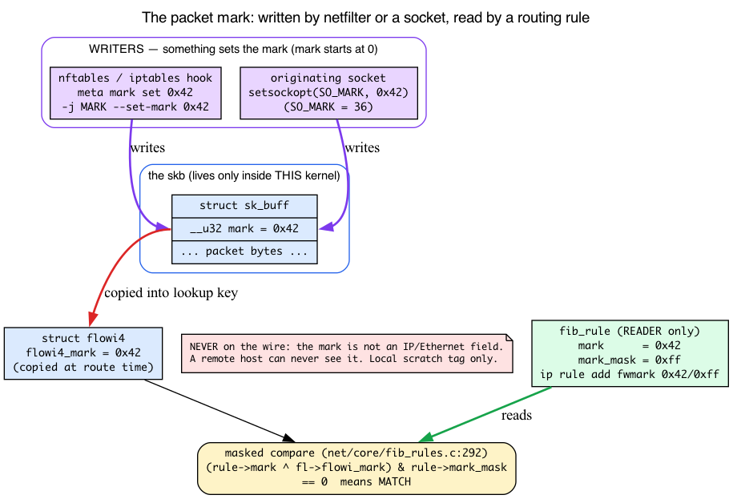
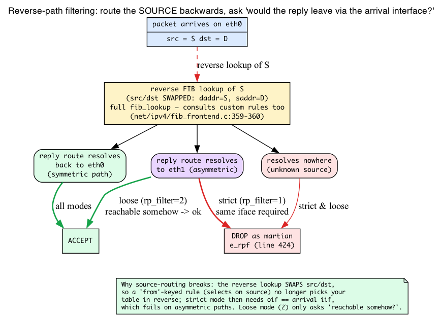
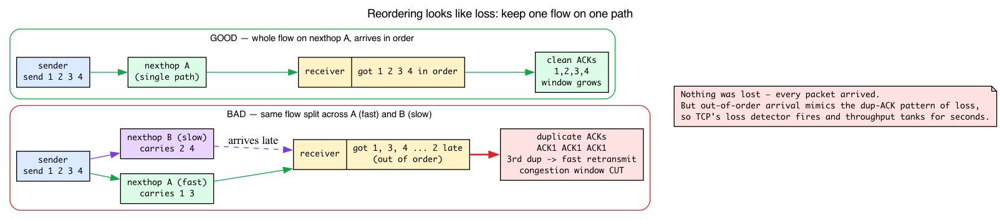
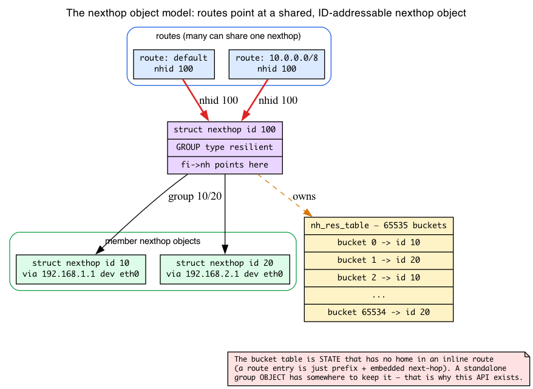

# Day 9 — Multipath, policy routing, source-based routing

> **Today's mission:** route packets based on something *other* than destination IP. Learn the four ideas the whole chapter leans on — packet marks, reverse-path filtering, why TCP hates reordering, and the nexthop object model — then use multiple FIB tables, policy rules, and ECMP with confidence. Budget ~130 minutes; if you already know fwmark, rp_filter, and DSCP, the four background boxes can be skimmed.

## When destination-based routing isn't enough

Yesterday's lookup (Day 8) was a function of one input: the destination IP. You fed a `struct flowi4` to `fib_table_lookup`, walked the LC-trie in the **main** table, and got back a `struct fib_result` with a next-hop. That's the simple model and it covers ~95% of real-world routing — your laptop, most servers, most embedded devices. But there are hard cases where you genuinely need more inputs to make the decision:

- **Source-based routing.** Two tenants share a router; tenant A's traffic must go through gateway A, tenant B through gateway B. The destination might be the same; the source IP is what differentiates.
- **Mark-based routing.** A firewall rule classified this packet as "VPN traffic" and stamped a *mark* on it. You want the route to follow that classification.
- **Multipath (ECMP).** You have two equal-cost paths to the same destination. Spread connections across them but keep each individual flow on a single path (so packets don't reorder).
- **Policy routing.** "Traffic from this UID, on this incoming interface, with this DSCP, goes to that table." The combinatorics of policy rules motivate multiple routing tables.

Linux solves all of these with the same machinery: **`fib_rules`** plus **multiple FIB tables**.

Four of these — the mark, reverse-path filter, DSCP byte, and flow-hash — lean on concepts you haven't formally met (plus the nexthop object model the resilient-hashing section needs). They're taught inline, intuition first, where the chapter first needs them — so every selector and every `ip` command reads as plain English when you reach it.

---

## Background 1: what a packet mark actually is

The bullet list above, the `fwmark` selector, the entire "mark-based routing" section, and today's Check question all hinge on "the mark." Netfilter — the firewall subsystem that *sets* marks — isn't taught until Day 20, so you've never formally met one. Let's fix that now, because the idea is simple and you'll lean on it all day.

**A mark is a u32 scratch field that lives on the skb itself.** Recall the `sk_buff` from Day 1: the universal packet container, a descriptor riding alongside the packet bytes. One of its fields is a 32-bit integer the kernel uses purely as an **internal classification tag** (`include/linux/skbuff.h:1069`):

```c
union {
    __u32  mark;
    __u32  reserved_tailroom;
};
```

Two things to absorb about that field:

1. **It travels with the packet *inside* the kernel and is never put on the wire.** It is not part of the IP header, not an Ethernet field, nothing a remote host can see. It exists only while the skb is alive in *your* kernel. Think of it as a sticky note some earlier subsystem slapped on the packet so a later subsystem can read it.
2. **Something must SET it before routing can match it.** The mark starts at 0. It gets a non-zero value from one of two places:
   - **An nftables/iptables rule** — `meta mark set 0x42` (nftables) or `-j MARK --set-mark 0x42` (iptables). This is a firewall hook stamping the packet as it passes through.
   - **The originating socket** — a process calls `setsockopt(fd, SOL_SOCKET, SO_MARK, ...)`, and every packet that socket sends is born with that mark. `SO_MARK` is option number 36 (`include/uapi/asm-generic/socket.h:56`):

     ```c
     #define SO_MARK    36
     ```

The `fwmark` *rule selector* you'll meet below only **reads** the mark. It never sets it. This is the single most common point of confusion, so say it out loud: **a routing rule reads the mark; netfilter or a socket writes it.**

### How the mark reaches the route lookup

Here's the connection back to Day 8. When the kernel is about to route a packet, it copies the skb's mark into the lookup key — specifically into `flowi4_mark`, a field you already saw listed in `struct flowi4` on Day 8. Now the rule engine has something to compare against. The generic rule matcher does exactly this (`net/core/fib_rules.c:292`):

```c
if ((rule->mark ^ fl->flowi_mark) & rule->mark_mask)
    goto out;   /* mismatch — this rule does not apply */
```

That's a **masked compare**, and it's why `fwmark` selectors take a `VALUE/MASK` form. The XOR `(rule->mark ^ fl->flowi_mark)` is zero exactly where the bits agree; the `& rule->mark_mask` ignores any bits you don't care about. So `fwmark 0x42` matches when the masked bits equal `0x42`, and `fwmark 0x42/0xff` says "only look at the low byte." When you create a rule, iproute2 stuffs your value into `rule->mark` (`net/core/fib_rules.c:622`):

```c
nlrule->mark = nla_get_u32(tb[FRA_FWMARK]);
```

**Forward-reference honestly:** *how* marks get set — the nftables/iptables rule syntax, which chain runs when, conntrack restoring a mark on reply traffic — is netfilter's job, covered on Day 20. For today, treat the mark as a label some earlier hook stamped on the packet, and focus on how routing *reacts* to it.



---

## fib_rules: which routing table to consult

`fib_rules` is a per-protocol decision pipeline. Each rule is a *predicate* (selectors that match packet attributes) plus a *target* (which routing table to look up in). At lookup time, the kernel walks rules in priority order and uses the first match. Implementation: `net/core/fib_rules.c:313` — `fib_rules_lookup`.


### The default rules

Run `ip rule show` on a clean system and you get exactly three rules:

```
0:      from all lookup local
32766:  from all lookup main
32767:  from all lookup default
```

- **Priority 0 → table 255 (local).** Holds the IPs of *this host's* interfaces. Kernel auto-populates as you `ip addr add`. Always tried first so packets to ourselves resolve correctly.
- **Priority 32766 → table 254 (main).** Default destination for `ip route add`. User-added routes land here.
- **Priority 32767 → table 253 (default).** Lowest priority; rarely populated. Historical compatibility.

The lower the priority number, the earlier the rule is consulted. Custom rules slot in between.

### Selectors: what each rule can match on

Each rule supports a set of selectors. The full list — see `include/net/fib_rules.h:20` `struct fib_rule` and the per-protocol extension `struct fib4_rule` — includes:

- **`from PREFIX`** (`src` field): match by source IP/prefix.
- **`to PREFIX`** (`dst` field): match by destination (rarely useful — that's what FIB lookup does anyway).
- **`iif IFNAME`**: match by *input* interface. Powerful for forwarding routers that need to apply different policy per arrival port.
- **`oif IFNAME`**: match by *output* interface. Less common; usually you want the route to *select* the OIF, not the other way around.
- **`tos VALUE`** / **`dsfield VALUE`**: match the **DSCP** class in the second byte of the IPv4 header (the top 6 bits — a QoS class set by applications or edge routers, "gold" vs "best-effort"; the low 2 bits are **ECN**, deliberately *excluded* from matching). You already saw `flowi4_dscp` listed in `struct flowi4` on Day 8; this selector connects that field to the wire byte, so you can steer gold traffic onto one table and bulk traffic onto another. The two spellings look at different widths: **`dsfield`** matches the full 6-bit DSCP (mask `0xfc` — `flowi4_dscp` is a `dscp_t` that already has the ECN bits cleared, so they never participate), while **`tos`** masks off the top three bits too and compares only the lower DSCP bits against `INET_DSCP_LEGACY_TOS_MASK` (`0x1c`) for backward compatibility — see `fib_dscp_masked_match` (`include/net/ip_fib.h:441`). At runtime it compiles to the same masked compare as the mark — `(r->dscp ^ fl4->flowi4_dscp) & r->dscp_mask` (`net/ipv4/fib_rules.c:197`).
- **`fwmark VALUE/MASK`**: match the packet mark (Background 1). Critical for firewall-driven policy.
- **`uidrange UID-UID`**: match by socket-owner UID. Lets you route a specific user's traffic differently (VPN-by-user).
- **`ipproto PROTO`**, **`sport`/`dport RANGE`**: match by L4. Layer-violating but powerful.

### Source-based routing — the canonical example

Two tenants: tenant A uses 10.99.0.0/24 and must egress via 192.168.99.1; tenant B uses 10.100.0.0/24 and goes through 192.168.100.1.

```bash
# Custom tables for each tenant:
sudo ip route add default via 192.168.99.1 table 100
sudo ip route add default via 192.168.100.1 table 200

# Rules:
sudo ip rule add from 10.99.0.0/24  lookup 100 priority 100
sudo ip rule add from 10.100.0.0/24 lookup 200 priority 200
```

Now any packet from a 10.99-prefix source consults table 100 first; from 10.100, table 200; everyone else falls through to main. The rule priorities (100 and 200) are **rule walk order**, not the table IDs — keep them straight.

**Gotcha:** Linux defaults to **strict reverse-path filtering** (`net.ipv4.conf.all.rp_filter = 1` on many systems), and strict reverse-path filtering will silently drop the traffic you just so carefully steered. To understand *why*, you need to know what reverse-path filtering actually does — which is Background 2, immediately below. The fix is to relax it (`rp_filter=2`, loose mode) on the relevant interface; the reason that fix works will be obvious in two paragraphs.

---

## Background 2: reverse-path filtering, the mechanism

Reverse-path filtering (rp_filter) is an **anti-spoofing check**. The intuition: when a packet shows up claiming to be *from* some source address, the kernel asks a skeptical question — *"if I had to send a reply back to this sender, would I even route it out the interface this packet just came in on?"* If the answer is no, the packet's source address is probably forged, and the kernel drops it as a **martian** (an impossible packet).

Here's the clever part: the kernel answers that question using **the exact same FIB lookup machinery you learned on Day 8** — just run *backwards*. It takes the packet's **source** address, treats it as if it were a **destination**, and does a routing lookup. The function is `fib_validate_source` (`net/ipv4/fib_frontend.c:429`), the entry point invoked on RX, which calls `__fib_validate_source` (`net/ipv4/fib_frontend.c:345`). That helper takes an `int rpf` argument selecting the mode, and the two modes diverge right here:

```c
if (rpf == 1)        /* strict: net/ipv4/fib_frontend.c:405 */
    goto e_rpf;
...
if (rpf)             /* loose: net/ipv4/fib_frontend.c:417 */
    goto e_rpf;
```

The `e_rpf:` label (`net/ipv4/fib_frontend.c:424`) is where the martian-source drop is signalled — `return -SKB_DROP_REASON_IP_RPFILTER;` on line 425. (Don't confuse this with the comment at line 447 in the separate `fib_validate_source` wrapper, whose "within the same container, it is regarded as a martian source" path returns `-SKB_DROP_REASON_IP_LOCAL_SOURCE` on line 451 — a different local-source check, not the rp_filter verdict.) The three modes:

- **Strict (1):** the reverse lookup must resolve back to the **same interface** the packet arrived on. Asymmetric paths are rejected.
- **Loose (2):** the source need only be reachable via **any** interface. Asymmetric paths survive.
- **Off (0):** no check at all.

### Why this breaks source-based routing

Now the gotcha from the previous section explains itself. The reverse-path check runs a full `fib_lookup` — and once you've added *any* `ip rule` (exactly the scenario here), `net->ipv4.fib_has_custom_rules` is true, so that lookup *does* walk your custom rules (`fib_lookup` only short-circuits straight to main when no custom rules exist; `include/net/ip_fib.h:374`). The reason it still drops your traffic is subtler: the reverse lookup is built with **source and destination swapped** — `fl4.daddr = src; fl4.saddr = dst` (`net/ipv4/fib_frontend.c:359-360`). Your `from <tenant-prefix>` rule selects on the *source* field, but in the reverse direction the tenant's source address is now the lookup's *destination*, so that rule no longer selects your custom table. And even when a route is found, strict mode demands its output interface equal the arrival interface (`if (rpf == 1) goto e_rpf`, `net/ipv4/fib_frontend.c:405`); under asymmetric/policy routing it doesn't, the kernel shouts "martian!", and your carefully-routed packet is dropped before it ever reaches your rule.

Relaxing to **loose mode (2)** fixes it because loose mode only asks "is this source reachable *somehow*?" — which it is — instead of demanding the path be symmetric. That's the whole reason the source-routing recipe tells you to set `rp_filter=2` on the relevant interface. See `Documentation/networking/ip-sysctl.rst` for the per-interface sysctl details (note: the effective value is the **max** of `conf.all.rp_filter` and `conf.<iface>.rp_filter`).



### Mark-based routing — pairs with netfilter

```bash
# Rule: marked traffic uses table 200
sudo ip rule add fwmark 0x42 lookup 200 priority 200
sudo ip route add default via 192.168.42.1 table 200

# Mark anything destined for example.com:
sudo nft add rule inet filter output ip daddr 93.184.216.34 meta mark set 0x42
```

That `meta mark set 0x42` is the netfilter side from Background 1 *writing* the mark; the `ip rule add fwmark 0x42` is the routing side *reading* it. This is how policy routers, VPN clients (`mwan3`), and per-application VPN configs work.

**Gotcha:** this is the ordering subtlety from the mark box, now concrete — mark in `OUTPUT` *after* the route was bound at `connect()`, and that connection's path is already fixed. To force re-routing on mark change, applications often combine `setsockopt(SO_MARK)` (Background 1 — the socket stamps every packet at birth, before routing) with route lookups, or use `ip rule add suppress_prefixlength 0` to skip the kernel's stickiness.

## Multiple FIB tables in detail

Routing table IDs are **32-bit values** in modern netlink (`RTA_TABLE`). The familiar 253/254/255 IDs are well-known defaults, and examples often use small numbers like 100 or 200, but the kernel is not capped at 256 tables. Each table is a self-contained FIB and exists as soon as you add a route to it. To list a specific table:

```bash
ip route show table 100
ip route show table all   # everything everywhere
```

You name tables in `/etc/iproute2/rt_tables` (the canonical path; on some distros — e.g. Azure Linux — the file ships at `/usr/share/iproute2/rt_tables` and you may need to create `/etc/iproute2/` first):

```
# echo "100  vpn"  >> /etc/iproute2/rt_tables
# now you can use 'vpn' as the table name
sudo ip route add default via 10.0.0.1 table vpn
```

---

## Background 3: why packet reordering wrecks TCP

The next section's central design driver — and the entire justification for resilient nexthop groups later — is the rule *"keep one flow on one path."* The chapter is about to claim that splitting a connection across two paths makes "TCP throughput tank for seconds." But TCP isn't taught until Day 13+, so you're being asked to accept the most important idea in the chapter on faith. Let's not do that. Here's just enough to make the rule self-evident.

**First, define a "flow."** A flow is the set of packets sharing the same **5-tuple**: source IP, destination IP, source port, destination port, and protocol. Every packet of a single TCP connection has the same 5-tuple. ECMP's job is to hash that 5-tuple so that **every packet of one connection lands on the same next-hop** — which is exactly what the multipath hasher does. You can see what "a flow" means to the kernel by reading `fib_multipath_hash` (`net/ipv4/route.c:2066`): in `case 0` it hashes only the v4 source and destination addresses; in `case 1` it adds the L4 ports. Those fields *are* the flow identity.

**Now, why keeping a flow together matters.** TCP has no direct "a packet was lost" signal — it **infers** loss from *ordering*. The receiver ACKs the highest in-order byte it has. If packets arrive out of order, the receiver keeps re-sending the same ACK number — **duplicate ACKs**. When the sender sees **three duplicate ACKs**, it concludes a packet was lost, triggers a **fast retransmit**, and **cuts its congestion window** (its sending rate). Throughput drops, then has to climb back up slowly.

Here's the trap: **nothing was actually lost.** If you spread one connection's packets across two paths of unequal latency, the packets *do* all arrive — just out of order, because the slow path delivers its share late. But out-of-order arrival generates exactly the duplicate-ACK pattern that *looks* like loss. TCP's loss detector fires, the window collapses, and throughput tanks for seconds. Repeat every time the paths reorder, and a "working" multipath setup delivers terrible performance.

So the rule **"same flow → same next-hop"** is not about *correctness* — the packets would arrive either way. It's about **not fooling TCP's loss detector.** This is precisely why ECMP hashes per-flow instead of per-packet, and why rehashing flows onto new paths (which the next section is all about) is so damaging.

(The full duplicate-ACK / fast-retransmit / congestion-window story is Day 16. For today: **reordering looks like loss to TCP, and looking like loss costs throughput.**)



## ECMP — multiple next-hops to one destination

When two paths to the same destination cost the same in routing-protocol terms, you want to use both. Linux's solution is **ECMP (Equal-Cost Multi-Path)**: a single route entry with multiple next-hops. The kernel hashes each flow's fixed field-tuple (the "flow" you just met in Background 3) to pick one next-hop and keep that connection on it — the diagram shows the shape; the mechanics follow.


Configure with the multi-line form of `ip route`:

```bash
sudo ip route add default \
    nexthop via 192.168.1.1 weight 1 \
    nexthop via 192.168.2.1 weight 1
```

### How the kernel picks one

For each new flow, the kernel computes a hash from packet fields and maps it onto the next-hops using the **hash-threshold** algorithm (RFC 2992), *not* a modulo. Each next-hop owns a contiguous slice of the `0..2^31-1` hash space sized by its weight: `fib_rebalance` (`net/ipv4/fib_semantics.c:824`) gives every next-hop a cumulative `upper_bound = DIV_ROUND_CLOSEST_ULL((u64)w << 31, total) - 1`, and `fib_select_multipath` (`net/ipv4/fib_semantics.c:2164`) picks the first next-hop whose `hash <= nh_upper_bound`. Because the hash is over the 5-tuple (Background 3), every packet of a connection produces the *same* hash and so lands in the *same* slice — that's how ECMP keeps a flow together.

The hash function is configurable via `net.ipv4.fib_multipath_hash_policy`:

- **0** — L3 only: hash `(src_ip, dst_ip)`. **Same source-destination pair always uses one nexthop**, even if it's many connections. Poor balance for client-server workloads with few clients.
- **1** — L4: hash `(src_ip, dst_ip, src_port, dst_port, proto)`. Different connections from the same client spread across nexthops. Useful when a few client/server pairs carry many connections, but it is an opt-in sysctl setting, not the kernel default.
- **2** — Inner L3: for tunneled traffic, hash on the *inner* IPs, not the outer. Used when a single tunnel carries many flows that should spread across paths.
- **3** — Custom: hash on a bitmask of fields you select via `net.ipv4.fib_multipath_hash_fields`. The mode itself is selected by `fib_multipath_hash_policy` (which accepts 0–3, `extra2 = SYSCTL_THREE`); when mode 3 is chosen, the field bitmask comes from `fib_multipath_hash_fields` (a mask, validated against `fib_multipath_hash_fields_all_mask`). Lets you cherry-pick exactly which L3/L4 fields enter the hash.

The kernel default is mode 0. Pick mode 1 when you want better balancing across many L4 flows between the same endpoints. Mode 2 is for overlay networks (VXLAN, GRE) where outer addresses are the same for many inner flows.

### The reordering trade-off

ECMP guarantees a connection's packets stay on the same path **as long as the nexthop set is unchanged**. The moment you add or remove a nexthop, `fib_rebalance` recomputes every slice boundary — so flows whose hash now falls in a *shifted* range jump to a different nexthop, mid-flight. (It's not literally *every* flow under hash-threshold — flows whose hash still lands in an unshifted range stay put — but the churn is significant, since the boundaries move.) Those reassigned flows get reordered or routed differently — and now you know exactly what that costs: Background 3's duplicate-ACK avalanche, fast-retransmit, and a window cut. TCP throughput tanks for seconds, not because anything was lost, but because reordering *looks* like loss.

---

## Background 4: the nexthop object model

The fix for that boundary-shift problem (resilient hashing, next section) is about to switch from the inline `nexthop via ...` syntax you just used to a completely different way of writing routes:

```bash
sudo ip nexthop add id 10 ...
sudo ip nexthop add id 100 group 10/20 ...
sudo ip route add default nhid 100
```

Day 8 only ever showed next-hops *embedded inline* in a route (the `fib_nh_common` inside a `fib_result`). You've never seen a next-hop as a **standalone, ID-addressable kernel object**. Here's the model.

**Modern Linux (5.3+) lets a next-hop be a first-class object with its own id.** Instead of baking the gateway/device into each route entry, you create the next-hop *once*, give it an `id`, and then point as many routes at it as you like via `nhid`. The object is `struct nexthop` (`include/net/nexthop.h:142`) — it carries an id and can be referenced by many routes.

**A nexthop object can be a single next-hop OR a group.** The `group 10/20` form makes a *group* object whose members are other nexthop objects (id 10 and id 20). A group has a type:

- **`mpath`** — classic hash-threshold ECMP (what plain inline multipath gives you): weighted slices of the hash space, recomputed when the set changes.
- **`resilient`** — the bucket-table scheme (next section).

**Why resilient hashing *needs* this API at all:** the bucket-to-nexthop mapping table is *state*, and it has to live somewhere. In the old inline route format there's no place to attach it — a route entry is just a prefix plus an embedded next-hop. A standalone group **object** has somewhere to keep that table. That's the whole reason the new syntax exists.

**Contrast cleanly with Day 8.** Day 8's `fib_result.nhc` was an *inline* next-hop pointer. With the object model, the route's `fib_info` instead has an `fi->nh` pointing at a shared `struct nexthop`. You can see the kernel branch on exactly that in `fib_select_multipath` (`net/ipv4/fib_semantics.c:2164`):

```c
struct fib_info *fi = res->fi;
...
if (unlikely(res->fi->nh)) {        /* a nexthop OBJECT, not an inline array */
    nexthop_path_fib_result(res, hash);
    return;
}
/* else: walk fi's inline nexthop array, the Day-8 form */
```

So `res->fi->nh` non-NULL means "this route points at a shared nexthop object"; NULL means "old-style inline next-hops." Same `fib_select_multipath`, two source shapes.



### Resilient nexthop groups (kernel 5.13+)

The fix for boundary-shift-on-change: **resilient hashing**. Plain ECMP recomputes the weighted hash-space slices whenever the set changes, so the boundaries move. Resilient instead inserts a fixed-size **bucket table** between the hash and the nexthops: `nexthop_select_path_res` indexes it with `bucket_index = hash % res_table->num_nh_buckets` (`net/ipv4/nexthop.c:1479`), and the bucket count (up to 65535) is **constant regardless of how many nexthops exist**. So the modulus never changes when you add or remove a nexthop — only the buckets that *pointed at* the removed nexthop get reassigned; every other bucket (and so every flow that wasn't on the removed path) is undisturbed, confining Background 3's penalty to just the affected flows.

```bash
sudo ip nexthop add id 10 via 192.168.1.1 dev eth0
sudo ip nexthop add id 20 via 192.168.2.1 dev eth0
sudo ip nexthop add id 100 group 10/20 type resilient buckets 65535 idle_timer 120
sudo ip route add default nhid 100
```

The three `ip nexthop` lines are the object model from Background 4: two member objects, then a `resilient` group object referencing them, then a route pointing at the group by `nhid`. The `buckets 65535` sizes the bucket table — `nexthop_res_table_alloc` (`net/ipv4/nexthop.c:561`) allocates it sized by `cfg->nh_grp_res_num_buckets` (the `buckets` keyword), and the per-bucket bookkeeping uses `struct nh_res_bucket` (`include/net/nexthop.h:74`) inside a `struct nh_res_table` (`include/net/nexthop.h:82`). The `idle_timer` is how long a bucket can be idle before the kernel can re-balance it; the default is 120 seconds (`net/ipv4/nexthop.c:20` — `#define NH_RES_DEFAULT_IDLE_TIMER (120 * HZ)`), which is the value cited above. `unbalanced_timer` is the soft deadline for forcing a rebalance.

Implementation: `net/ipv4/nexthop.c:563` and surrounding (the `num_nh_buckets`/`nh_res_table` machinery). The background worker `nh_res_table_upkeep` (`net/ipv4/nexthop.c:1841`) is what walks the bucket table and migrates only the buckets that must move.

**Use resilient hashing on production gateways with multiple uplinks.** Plain ECMP is fine for symmetric, stable topologies (rare in practice).

## Today's experiment

```bash
# Source-based test on local interfaces. Save cleanup first.
cleanup() {
  sudo ip rule del from 10.99.0.0/24 lookup 99 priority 99 2>/dev/null || true
  sudo ip route del default via 127.0.0.1 table 99 2>/dev/null || true
  sudo ip route del 10.99.0.0/24 dev lo 2>/dev/null || true
  sudo ip addr del 10.99.0.5/32 dev lo 2>/dev/null || true
}
trap cleanup EXIT

# 10.99.0.5 must be a real local address — `ping -I` binds the socket to it,
# and the kernel rejects the bind if the address isn't assigned to an interface.
sudo ip addr add 10.99.0.5/32 dev lo
sudo ip rule add from 10.99.0.0/24 lookup 99 priority 99
sudo ip route add default via 127.0.0.1 table 99

# Trace which table is consulted
sudo bpftrace -e '
fentry:fib_table_lookup { printf("table_id=%d\n", args->tb->tb_id); }
' &
tracer=$!
sleep 2   # let bpftrace attach its fentry probes before we send traffic

# Send packet from 10.99 source — should hit table 99
ping -I 10.99.0.5 -c 1 8.8.8.8

# And from default — should hit main (254)
ping -c 1 8.8.8.8

sudo kill "$tracer"
```

For each ping you'll first see one or more `table_id=255` lines — that's the always-first `local` table lookup (rule 0), which misses for an external destination like 8.8.8.8. The first ping then shows `table_id=99` — proof the `from 10.99.0.0/24` rule steered it into table 99 — while the second ping falls through to `table_id=254` (main). The leading 255 lines are normal: `fib_rules_lookup` walks rule 0 first on every lookup, so don't be surprised if 255 repeats.

Neither ping will actually get a reply from 8.8.8.8 — that's expected. Table 99's next-hop `127.0.0.1` is a deliberate dead-end used only to force a distinct table, and the route is loopback-bound. We only care about the `table_id=...` lines bpftrace prints, not the ping result.

## There are no Dumb Questions

> **Q: If the mark never goes on the wire, how does the *other* end of a connection route reply traffic by mark?**
>
> A: It doesn't see *your* mark. The mark is local to one kernel. On the reply side, that host's own netfilter (often via conntrack restoring a saved mark) stamps its own mark on the reply skb. Each kernel marks independently. Day 20 covers the conntrack "save/restore mark" pattern that makes the two sides *appear* coordinated.

> **Q: I set a mark in the OUTPUT chain but my connection still takes the old path. Bug?**
>
> A: No — it's the stickiness gotcha. The route was chosen when the socket bound, before your OUTPUT rule ran. The cleanest fix is to set the mark at the source via `setsockopt(SO_MARK)` (Background 1) so the packet is born marked, *before* routing. Marking later only affects connections routed after the mark exists.

> **Q: rp_filter dropped my traffic but there's nothing in the firewall logs. Where did it go?**
>
> A: rp_filter is not a firewall rule — it's the `fib_validate_source` martian check (Background 2), and it drops silently (you can count martians via `net.ipv4.conf.<iface>.log_martians=1` to get kernel log lines). If source-based routing "just doesn't work" with no visible drop, suspect strict `rp_filter` first and set it to `2` on the arrival interface.

> **Q: Why not just hash per-packet and get perfect balance?**
>
> A: Because of Background 3. Per-packet spraying gives ideal load balance but reorders every flow across paths of unequal latency, and TCP reads that reordering as loss — fast-retransmit, window cut, throughput collapse. Per-flow hashing trades a little balance for not lying to TCP's loss detector. It's the right trade for almost everyone.

## What to read in the kernel

- **`net/core/fib_rules.c:313`** — `fib_rules_lookup`. The rule-walking dispatcher used by all protocols (IPv4, IPv6). Read top to bottom (~50 lines for the function itself). Notice how it iterates `ops->rules_list` in priority order, calls `ops->match` for each rule's predicate, and `ops->action` once a match is found. The protocol-specific rule type plugs into this generic engine.

- **`net/ipv4/fib_rules.c`** — IPv4 specialization. The `match` callback `fib4_rule_match` checks src, dst, tos/dscp, fwmark, ipproto. Read it to see what each rule selector compiles to at runtime — it's just a chain of masked compares against `flowi4` fields (e.g. the `dscp` compare at line 197, the same form as the generic `mark` compare).

- **`net/ipv4/fib_frontend.c:429`** — `fib_validate_source` (and `__fib_validate_source` at line 345). This is reverse-path filtering. Watch the `rpf == 1` (strict, line 405) vs `rpf` (loose, line 417) split and the `e_rpf:` label (line 424) whose `return -SKB_DROP_REASON_IP_RPFILTER;` (line 425) is the martian drop. It's a reverse FIB lookup — Day 8's machinery run backwards on the source address (with src/dst swapped).

- **`net/ipv4/fib_semantics.c:2164`** — `fib_select_multipath`. Picks one nexthop given a precomputed hash. Note the `res->fi->nh` branch at the top (nexthop *object* vs inline array, Background 4), then the loop that walks `fib_info`'s next-hop array comparing `hash <= nh_upper_bound` — each nexthop owns a weighted slice of the hash space (the upper bounds set by `fib_rebalance` at line 824), no modulo involved.

- **`net/ipv4/route.c:2066`** — `fib_multipath_hash`. Read `case 0` (v4 src/dst only) and `case 1` (adds L4 ports) to see exactly what "a flow" means to the hasher (Background 3).

- **`include/net/ip_fib.h:556`** — `fib_multipath_hash_from_keys`. The hash function for `fib_multipath_hash_policy=0/1/2/3`. Notice how it folds the chosen fields into a `flow_keys` struct, then runs `flow_hash_from_keys_seed` — a keyed siphash (`net/core/flow_dissector.c:1803`, the `siphash()` call inside `__flow_hash_from_keys`). Reading this answers "which exact bytes does the kernel hash for ECMP?"

- **`net/ipv4/nexthop.c:563`** and surrounding — resilient nexthop groups. The `num_nh_buckets`/`nh_res_table` and bucket migration machinery. Look at `nh_res_table_upkeep` (line 1841) to see how the kernel decides which buckets to migrate when a nexthop is added/removed without disturbing others.

- **`include/net/fib_rules.h:20`** — `struct fib_rule`. The selectors are the fields. Quick read; gives you the complete vocabulary of what's matchable.

- **`Documentation/networking/ip-sysctl.rst`** — the official reference for the routing/rp_filter/multipath sysctls used here. One read; explains the knobs end-to-end.

## Bullet Points

- A **packet mark** is a `u32` scratch field on the skb (`sk_buff.mark`) that rides inside the kernel and **never goes on the wire**. Netfilter (`meta mark set`) or a socket (`setsockopt(SO_MARK)`) **writes** it; the `fwmark` rule selector only **reads** it, via a masked compare `(rule->mark ^ flowi_mark) & mark_mask`.
- **`fib_rules`** decide *which* routing table to consult. Default: local → main → default.
- Selectors: `from`, `iif`, `oif`, `tos`/`dsfield` (the IPv4 DSCP class → `flowi4_dscp`; ECN bits excluded), `fwmark`, `uidrange`, `ipproto`, `sport`/`dport`.
- **Routing table IDs are `u32`.** Custom tables via `ip route add … table N`. Names in `/etc/iproute2/rt_tables`.
- **Source-based routing** is the most common use case; **mark-based** for firewall integration.
- **Reverse-path filtering** (`fib_validate_source`) is an anti-spoofing reverse FIB lookup on the source address. **Strict (`rp_filter=1`)** demands the reply path return to the arrival interface and so **silently drops** asymmetric source-routed traffic; set **loose (`2`)** on the relevant interface.
- **ECMP**: multi-nexthop route, kernel hashes per-flow (the 5-tuple) to pick one. **Same flow → same nexthop**, because reordering a flow across paths looks like loss to TCP (dup-ACKs → fast-retransmit → window cut), not because packets would be lost.
- **Hash policy**: 0 (L3 — kernel default), 1 (L4, opt-in for better flow spread), 2 (inner L3 for tunnels), 3 (custom fields via `fib_multipath_hash_fields`).
- **Plain ECMP shifts the weighted hash-space boundaries when the nexthop set changes**, moving the flows whose hash falls in a shifted range. The **nexthop object model** (`ip nexthop add id …`, referenced by `nhid`) lets a next-hop be a standalone/grouped object — the home for the **resilient** bucket table, which uses a *fixed* `hash % num_buckets` modulus (independent of nexthop count) and re-maps only the buckets of a removed nexthop. Use it for stable production gateways.

## Check question

You add `ip rule add from 192.168.1.0/24 lookup 100 priority 50` and `ip rule add fwmark 0x42 lookup 200 priority 100`. A packet has src `192.168.1.5` AND fwmark `0x42`. Which table is consulted?

<details>
<summary>Click to reveal answer</summary>

**Answer:** Table 100. Rules are walked in priority order, lower number first. Priority 50 < 100, so the source-prefix rule is checked first. The packet matches (`192.168.1.5` is in `192.168.1.0/24`), so the lookup goes to table 100, and rule walking *stops* — `fib_rules_lookup` returns on the first matching rule. The mark rule never gets a chance, even though the mark `0x42` is present (recall the mark is just a `u32` tag some earlier hook stamped on the skb; the rule only *reads* it). To make mark take precedence, give it the lower priority (e.g., `priority 30`).

</details>

---

## Tomorrow

Day 10: IPv6 specifics — NDP, autoconfig, extension headers.
