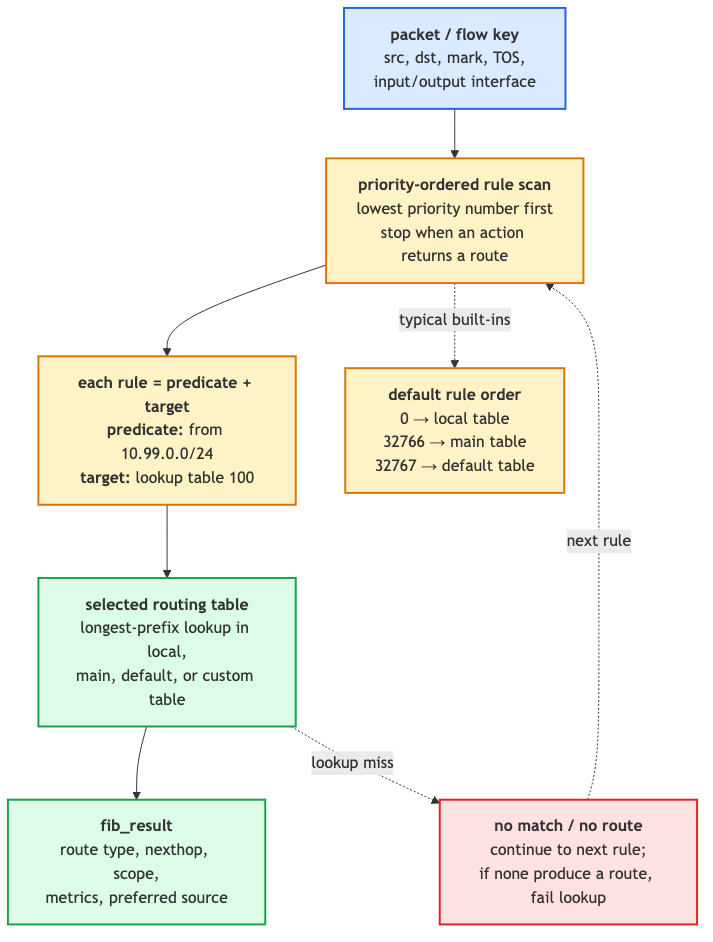
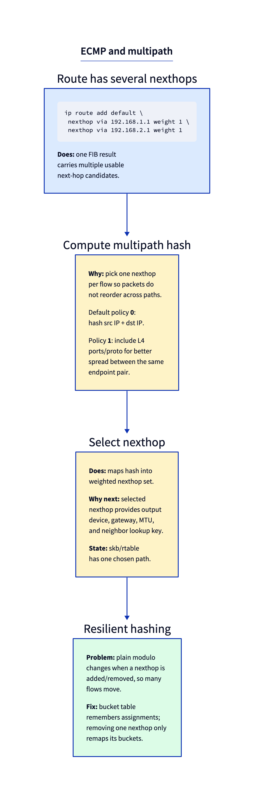

# Day 9 — Multipath, policy routing, source-based routing

> **Today's mission:** route packets based on something *other* than destination IP. Use multiple FIB tables. Configure ECMP. Total time: ~75 minutes.

## When destination-based routing isn't enough

Yesterday's lookup was a function of one input: the destination IP. The output was a route. That's the simple model and it covers ~95% of real-world routing — your laptop, most servers, most embedded devices. But there are hard cases where you genuinely need more inputs to make the decision:

- **Source-based routing.** Two tenants share a router; tenant A's traffic must go through gateway A, tenant B through gateway B. The destination might be the same; the source IP is what differentiates.
- **Mark-based routing.** A firewall rule classified this packet as "VPN traffic" and applied a fwmark. You want the route to follow that classification.
- **Multipath (ECMP).** You have two equal-cost paths to the same destination. Spread connections across them but keep each individual flow on a single path (so packets don't reorder).
- **Policy routing.** "Traffic from this UID, on this incoming interface, with this DSCP, goes to that table." The combinatorics of policy rules motivate multiple routing tables.

Linux solves all of these with the same machinery: **`fib_rules`** plus **multiple FIB tables**.

## fib_rules: which routing table to consult

`fib_rules` is a per-protocol decision pipeline. Each rule is a *predicate* (selectors that match packet attributes) plus a *target* (which routing table to look up in). At lookup time, the kernel walks rules in priority order and uses the first match. Implementation: `net/core/fib_rules.c:313` — `fib_rules_lookup`.



### The default rules

Run `ip rule show` on a clean system and you get exactly three rules:

```
0:      from all lookup local
32766:  from all lookup main
32767:  from all lookup default
```

- **Priority 0 → table 255 (local).** Holds the IPs of *this host's* interfaces. Kernel auto-populates as you `ip addr add`. Always tried first so packets to ourselves resolve correctly.
- **Priority 32766 → table 254 (main).** Default destination for `ip route add`. User-added routes land here.
- **Priority 32767 → table 253 (default).** Lowest priority; rarely populated. Historical compatibility.

The lower the priority number, the earlier the rule is consulted. Custom rules slot in between.

### Selectors: what each rule can match on

Each rule supports a set of selectors. The full list — see `include/net/fib_rules.h:20` `struct fib_rule` and the per-protocol extension `struct fib4_rule` — includes:

- **`from PREFIX`** (`src` field): match by source IP/prefix.
- **`to PREFIX`** (`dst` field): match by destination (rarely useful — that's what FIB lookup does anyway).
- **`iif IFNAME`**: match by *input* interface. Powerful for forwarding routers that need to apply different policy per arrival port.
- **`oif IFNAME`**: match by *output* interface. Less common; usually you want the route to *select* the OIF, not the other way around.
- **`tos VALUE`** / **`dsfield VALUE`**: match the DSCP/ECN byte.
- **`fwmark VALUE/MASK`**: match netfilter mark. Critical for firewall-driven policy.
- **`uidrange UID-UID`**: match by socket-owner UID. Lets you route a specific user's traffic differently (VPN-by-user).
- **`ipproto PROTO`**, **`sport`/`dport RANGE`**: match by L4. Layer-violating but powerful.

### Source-based routing — the canonical example

Two tenants: tenant A uses 10.99.0.0/24 and must egress via 192.168.99.1; tenant B uses 10.100.0.0/24 and goes through 192.168.100.1.

```bash
# Custom tables for each tenant:
sudo ip route add default via 192.168.99.1 table 100
sudo ip route add default via 192.168.100.1 table 200

# Rules:
sudo ip rule add from 10.99.0.0/24  lookup 100 priority 100
sudo ip rule add from 10.100.0.0/24 lookup 200 priority 200
```

Now any packet from a 10.99-prefix source consults table 100 first; from 10.100, table 200; everyone else falls through to main. The rule priorities (100 and 200) are **rule walk order**, not the table IDs — keep them straight.

**Gotcha:** Linux defaults to **strict reverse-path filtering** (`net.ipv4.conf.all.rp_filter = 1` on many systems). When the kernel does the reverse-path check it uses the *main* table, not your custom one. So traffic enters fine but the kernel may drop it as a "martian" because the reverse lookup doesn't match. Workaround: set `rp_filter=2` (loose mode) or `rp_filter=0` (off) on the relevant interface. See `Documentation/networking/ip-sysctl.rst`.

### Mark-based routing — pairs with netfilter

```bash
# Rule: marked traffic uses table 200
sudo ip rule add fwmark 0x42 lookup 200 priority 200
sudo ip route add default via 192.168.42.1 table 200

# Mark anything destined for example.com:
sudo nft add rule inet filter output ip daddr 93.184.216.34 meta mark set 0x42
```

This is how policy routers, VPN clients (`mwan3`), and per-application VPN configs work.

**Gotcha:** marks are evaluated *after* netfilter sets them. If you mark in `OUTPUT` chain and the route was already chosen at socket-bind time, the new mark won't change the path of *that* connection. To force re-routing on mark change, applications often combine `setsockopt(SO_MARK)` with route lookups, or use `ip rule add suppress_prefixlength 0` to skip the kernel's stickiness.

## Multiple FIB tables in detail

Routing table IDs are **32-bit values** in modern netlink (`RTA_TABLE`). The familiar 253/254/255 IDs are well-known defaults, and examples often use small numbers like 100 or 200, but the kernel is not capped at 256 tables. Each table is a self-contained FIB and exists as soon as you add a route to it. To list a specific table:

```bash
ip route show table 100
ip route show table all   # everything everywhere
```

You name tables in `/etc/iproute2/rt_tables`:

```
# echo "100  vpn"  >> /etc/iproute2/rt_tables
# now you can use 'vpn' as the table name
sudo ip route add default via 10.0.0.1 table vpn
```

## ECMP — multiple next-hops to one destination

When two paths to the same destination cost the same in routing-protocol terms, you want to use both. Linux's solution is **ECMP (Equal-Cost Multi-Path)**: a single route entry with multiple next-hops.



Configure with the multi-line form of `ip route`:

```bash
sudo ip route add default \
    nexthop via 192.168.1.1 weight 1 \
    nexthop via 192.168.2.1 weight 1
```

### How the kernel picks one

For each new flow, the kernel computes a hash from packet fields and modulo-N's it across the next-hops. Implementation: `net/ipv4/fib_semantics.c:2164` — `fib_select_multipath` — called from the route-lookup path with the hash already computed.

The hash function is configurable via `net.ipv4.fib_multipath_hash_policy`:

- **0** — L3 only: hash `(src_ip, dst_ip)`. **Same source-destination pair always uses one nexthop**, even if it's many connections. Poor balance for client-server workloads with few clients.
- **1** — L4: hash `(src_ip, dst_ip, src_port, dst_port, proto)`. Different connections from the same client spread across nexthops. Useful when a few client/server pairs carry many connections, but it is an opt-in sysctl setting, not the kernel default.
- **2** — Inner L3: for tunneled traffic, hash on the *inner* IPs, not the outer. Used when a single tunnel carries many flows that should spread across paths.
- **3** — Custom: hash on a bitmask of fields you select via `net.ipv4.fib_multipath_hash_fields`. The mode itself is selected by `fib_multipath_hash_policy` (which accepts 0–3, `extra2 = SYSCTL_THREE`); when mode 3 is chosen, the field bitmask comes from `fib_multipath_hash_fields` (a mask, validated against `fib_multipath_hash_fields_all_mask`). Lets you cherry-pick exactly which L3/L4 fields enter the hash.

The kernel default is mode 0. Pick mode 1 when you want better balancing across many L4 flows between the same endpoints. Mode 2 is for overlay networks (VXLAN, GRE) where outer addresses are the same for many inner flows.

### The reordering trade-off

ECMP guarantees a connection's packets stay on the same path **as long as the nexthop set is unchanged**. The moment you add or remove a nexthop, the modulo changes — *every* flow re-hashes. Connections that were on (say) nexthop A may suddenly hash to B, mid-flight. Their packets get reordered or routed differently, and TCP throughput tanks for seconds.

### Resilient nexthop groups (kernel 5.13+)

The fix: **resilient hashing**. Instead of `hash % N`, the kernel maintains an up-to-65535-bucket table mapping buckets to nexthops. Removing a nexthop only re-maps the buckets that pointed at it; everything else is undisturbed.

```bash
sudo ip nexthop add id 10 via 192.168.1.1 dev eth0
sudo ip nexthop add id 20 via 192.168.2.1 dev eth0
sudo ip nexthop add id 100 group 10/20 type resilient buckets 65535 idle_timer 120
sudo ip route add default nhid 100
```

Implementation: `net/ipv4/nexthop.c:563` and surrounding (`nh_res_table`). The `idle_timer` is how long a bucket can be idle before the kernel can re-balance; `unbalanced_timer` is the soft deadline for forcing rebalance.

**Use resilient hashing on production gateways with multiple uplinks.** Plain ECMP is fine for symmetric, stable topologies (rare in practice).

## Today's experiment

```bash
# Source-based test on local interfaces. Save cleanup first.
cleanup() {
  sudo ip rule del from 10.99.0.0/24 lookup 99 priority 99 2>/dev/null || true
  sudo ip route del default via 127.0.0.1 table 99 2>/dev/null || true
  sudo ip route del 10.99.0.0/24 dev lo 2>/dev/null || true
}
trap cleanup EXIT

sudo ip route add 10.99.0.0/24 dev lo
sudo ip rule add from 10.99.0.0/24 lookup 99 priority 99
sudo ip route add default via 127.0.0.1 table 99

# Trace which table is consulted
sudo bpftrace -e '
fentry:fib_rules_lookup { @rules = count(); }
fentry:fib_table_lookup { printf("table_id=%d\n", args->tb->tb_id); }
' &
tracer=$!

# Send packet from 10.99 source — should hit table 99
ping -I 10.99.0.5 -c 1 8.8.8.8

# And from default — should hit main (254)
ping -c 1 8.8.8.8

sudo kill "$tracer"
```

You'll see `table_id=99` for the first ping and `table_id=254` (main) for the second.

## What to read in the kernel

- **`net/core/fib_rules.c:313`** — `fib_rules_lookup`. The rule-walking dispatcher used by all protocols (IPv4, IPv6). Read top to bottom (~50 lines for the function itself). Notice how it iterates `ops->rules_list` in priority order, calls `ops->match` for each rule's predicate, and `ops->action` once a match is found. The protocol-specific rule type plugs into this generic engine.

- **`net/ipv4/fib_rules.c`** — IPv4 specialization. The `match` callback `fib4_rule_match` checks src, dst, tos, fwmark, ipproto. Read it to see what each rule selector compiles to at runtime — it's just a chain of compares against `flowi4` fields.

- **`net/ipv4/fib_semantics.c:2164`** — `fib_select_multipath`. Picks one nexthop given a precomputed hash. Note the loop that walks `fib_info`'s next-hop array, accumulating "weight credit" until the credit exceeds the modulo. This is how non-uniform weights work.

- **`include/net/ip_fib.h:556`** — `fib_multipath_hash_from_keys`. The hash function for `fib_multipath_hash_policy=0/1/2/3`. Notice how it folds the chosen fields into a `flow_keys` struct, then runs `flow_hash_from_keys` (siphash). Reading this answers "which exact bytes does the kernel hash for ECMP?"

- **`net/ipv4/nexthop.c:563`** and surrounding — resilient nexthop groups. The `nh_res_table` and bucket migration machinery. Look at `nh_res_table_upkeep` to see how the kernel decides which buckets to migrate when a nexthop is added/removed without disturbing others.

- **`include/net/fib_rules.h:20`** — `struct fib_rule`. The selectors are the fields. Quick read; gives you the complete vocabulary of what's matchable.

- **`Documentation/networking/ip-sysctl.rst`** — the official reference for the routing/rp_filter/multipath sysctls used here. One read; explains the knobs end-to-end.

## Bullet Points

- **`fib_rules`** decide *which* routing table to consult. Default: local → main → default.
- Selectors: `from`, `iif`, `oif`, `tos`, `fwmark`, `uidrange`, `ipproto`, `sport`/`dport`.
- **Routing table IDs are `u32`.** Custom tables via `ip route add … table N`. Names in `/etc/iproute2/rt_tables`.
- **Source-based routing** is the most common use case; **mark-based** for firewall integration.
- **`rp_filter=1`** can break source-based routing — set to `2` (loose) on relevant interfaces.
- **ECMP**: multi-nexthop route, kernel hashes per-flow to pick one. Same flow → same nexthop.
- **Hash policy**: 0 (L3 — kernel default), 1 (L4, opt-in for better flow spread), 2 (inner L3 for tunnels), 3 (custom fields via `fib_multipath_hash_fields`).
- **Plain ECMP rehashes everything when nexthops change.** Use **resilient nexthop groups** (`type resilient`) for stable production gateways.

## Check question

You add `ip rule add from 192.168.1.0/24 lookup 100 priority 50` and `ip rule add fwmark 0x42 lookup 200 priority 100`. A packet has src `192.168.1.5` AND fwmark `0x42`. Which table is consulted?

<details>
<summary>Click to reveal answer</summary>

**Answer:** Table 100. Rules are walked in priority order, lower number first. Priority 50 < 100, so the source-prefix rule is checked first. The packet matches (`192.168.1.5` is in `192.168.1.0/24`), so the lookup goes to table 100, and rule walking *stops* — `fib_rules_lookup` returns on the first matching rule. The mark rule never gets a chance. To make mark take precedence, give it the lower priority (e.g., `priority 30`).

</details>

---

## Tomorrow

Day 10: IPv6 specifics — NDP, autoconfig, extension headers.
