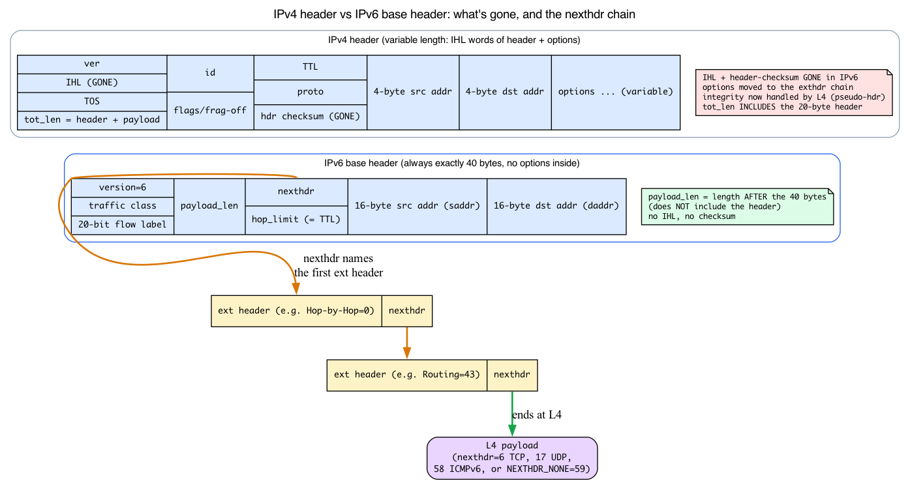
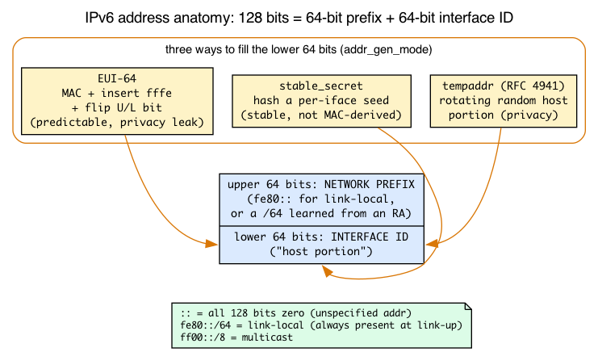
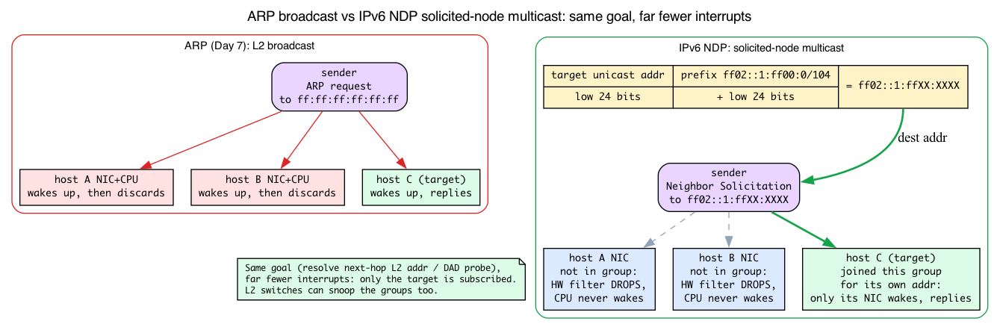

# Day 10 — IPv6 specifics: NDP, autoconfig, extension headers

> **Today's mission:** see what's genuinely different about IPv6 from the IPv4 you've traced for nine days — the 40-byte base header and its `nexthdr` chain, the 128-bit address with its prefix/host split, the autoconfig flow, the neighbor discovery protocol that replaces ARP, and the extension-header chain that's caused real CVEs. Total time: ~110 minutes.

## Why IPv6 deserves its own day

Most of the kernel network stack is shared between IPv4 and IPv6: the socket layer, the routing infrastructure, netfilter, the device queue, qdiscs. But IPv6 has structurally different features that can't be glossed over:

1. **A different base header and an extensible header chain.** Fixed 40 bytes, no options inside it, no checksum — and a `nexthdr` byte that can point at a *chain* of variable-length extension headers before you ever reach L4.
2. **128-bit addresses with built-in scope and a prefix/host split.** Not "IPv4 with bigger numbers" — the address *structure* drives autoconfiguration.
3. **Autoconfiguration.** IPv6 hosts self-configure their addresses without DHCP, by listening to Router Advertisements.
4. **NDP** replaces ARP. Same idea (resolve next-hop link-layer address) but built on ICMPv6 with richer semantics, and — crucially — *multicast* instead of broadcast.
5. **Extension headers.** Variable-length, chained between the base IPv6 header and the L4 protocol. Powerful, fragile, and the source of multiple CVEs over the years.

Everything you learned Days 1–9 was IPv4-only: the `sk_buff` from Day 1, the RX path and protocol demux from Day 2, the `neighbour`/ARP subsystem from Day 7. IPv6 reuses an enormous amount of that machinery — so this chapter leans on it hard and only teaches what is genuinely new. We'll build each new concept intuition-first, then point at the concrete v7.1 struct or function in your `~/code/linux` checkout (line numbers from kernel 7.1).

---

## The base header: 40 fixed bytes and a `nexthdr` byte

Everything today rests on one structure, so we open the struct before anything else. The natural point of contrast is the IPv4 header (`struct iphdr`, `include/uapi/linux/ip.h:87`), whose length *varied*: its 4-bit `ihl` field counted 32-bit words of header + options, so it could carry inline options. IPv6 throws that out. The base header is **always exactly 40 bytes** — no length field, no options inside it:

```c
/* include/uapi/linux/ipv6.h:118 — simplified: real struct uses endian
 * bitfield guards + __struct_group(addrs,...) wrapping saddr/daddr */
struct ipv6hdr {
        __u8    priority:4,
                version:4;          /* version == 6 */
        __u8    flow_lbl[3];        /* 8-bit traffic class is split: priority
                                       nibble + top 4 bits of flow_lbl;
                                       low 20 bits of flow_lbl = flow label */
        __be16  payload_len;        /* length of everything AFTER these 40 bytes */
        __u8    nexthdr;            /* what comes next: an L4 proto OR an ext header */
        __u8    hop_limit;          /* IPv6's name for IPv4's TTL */
        struct in6_addr saddr;      /* 16 bytes */
        struct in6_addr daddr;      /* 16 bytes */
};
```

Read it field by field:

- **`version` = 6**, plus a 4-bit `priority` nibble (the top half of the 8-bit Traffic Class; its lower half is the top 4 bits of `flow_lbl[3]`) and a 20-bit **flow label** that occupies the low 20 bits of `flow_lbl[3]`. The flow label lets a router hash a flow without parsing L4.
- **`payload_len`** — the single biggest gotcha if you're coming from IPv4. It is the length of *everything after the 40-byte header*, **not including the header**. IPv4's `tot_len` includes the 20-byte header; IPv6's `payload_len` does not. (This is why `ip6_rcv_core` trims the skb to `40 + payload_len`, not just `payload_len`.)
- **`nexthdr`** — the protocol selector. For plain TCP traffic it's just `6`. But it can also name an *extension header*, which carries its own `nexthdr`, forming a chain. We'll build that chain below.
- **`hop_limit`** — exactly TTL, renamed. Decremented per hop; packet dropped at zero.
- **`saddr` / `daddr`** — two 16-byte addresses (next section).

### Three structural differences to burn in

Compared to the IPv4 header (`struct iphdr`, the one Day 2's `ip_rcv_core` parsed), three things are gone or changed, and each one explains a design decision you'll meet later today:

1. **The header is fixed-length — there is no IHL field and no options inside the base header.** That's *exactly why* options had to move out into a separate extension-header chain. A fixed base header is cheap and predictable to parse; variable junk lives elsewhere.
2. **There is no header checksum field at all.** Grep proves it — `include/uapi/linux/ipv6.h` contains zero occurrences of the string `check`. IPv4 routers recompute the header checksum on every hop (because they decrement TTL); IPv6 routers don't, because there's nothing to recompute. Integrity is left to L4 checksums (which cover an IPv6 pseudo-header). The consequence: **walking the `nexthdr` chain is the only per-hop parsing cost** — there's no checksum verify/update on the fast path.
3. **`hop_limit` replaces TTL.** Same mechanic, new name.

### The `nexthdr` number space — the key to the whole chain

Here is the single insight that makes the extension-header "chain" make sense: **`nexthdr` uses one shared one-byte protocol-number space, used identically by the base header and by every extension header.** A value of `6` always means "TCP comes next," whether it's in the base header or seven extension headers deep. The kernel names them in `include/net/ipv6.h:32`:

```c
#define NEXTHDR_HOP        0   /* Hop-by-Hop options    */
#define NEXTHDR_TCP        6   /* TCP                   */
#define NEXTHDR_ROUTING    43  /* Routing header (SRv6) */
#define NEXTHDR_FRAGMENT   44  /* Fragment header       */
#define NEXTHDR_ESP        50  /* IPsec ESP             */
#define NEXTHDR_AUTH       51  /* IPsec Authentication  */
#define NEXTHDR_NONE       59  /* nothing follows       */
#define NEXTHDR_DEST       60  /* Destination options   */
#define NEXTHDR_MOBILITY   135 /* Mobile IPv6           */
```

So parsing IPv6 is a loop: read `nexthdr`; if it names an extension header, parse that header (which is self-describing in length and carries the *next* `nexthdr`), and repeat; if it names an L4 protocol (TCP, UDP, ICMPv6…), stop — you've reached the payload. `NEXTHDR_NONE` (59) means "the chain ends here, no payload follows."

`ip6_rcv_core` (`net/ipv6/ip6_input.c:188`) is the IPv6 twin of Day 2's `ip_rcv_core`: it validates `version == 6`, uses `payload_len` to trim the skb to the right length, and then leaves `nexthdr` to be resolved by the extension-header and L4 handlers. `ipv6_rcv` (`net/ipv6/ip6_input.c:344`) is the ~10-line wrapper that calls `ip6_rcv_core` and then runs the netfilter PRE_ROUTING hook — structurally identical to IPv4's `ip_rcv`.



---

## IPv6 address anatomy: 128 bits, scopes, and the /64 split

The autoconfig and NDP stories below toss around `fe80::/64`, `::`, `ff02::1`, "host portion," "prefix" — none of which mean anything until you know what a 128-bit address actually *is*. Days 1–9 only ever handled the 32-bit IPv4 dotted-quad (`__be32`). IPv6 is four times wider and structured.

### The struct: 16 bytes

```c
/* include/uapi/linux/in6.h:33 */
struct in6_addr {
        union {
                __u8    u6_addr8[16];   /* 16 bytes  = 128 bits */
                __be16  u6_addr16[8];   /* 8 groups of 16 bits  */
                __be32  u6_addr32[4];   /* 4 words of 32 bits   */
        } in6_u;
};
#define s6_addr   in6_u.u6_addr8        /* the byte view */
```

Contrast with the bare 4-byte `__be32` you've used everywhere up to Day 9. The union exists because different code wants different granularities — byte-at-a-time text formatting (`s6_addr[16]`), or word-at-a-time comparison (`s6_addr32[4]`); you'll see both today.

### Reading the text notation

Just enough to read the rest of the chapter. An address is **eight groups of 16 bits**, written in hex, colon-separated: `2001:0db8:0000:0000:0000:0000:0000:0001`. Two shorthands:

- **Drop leading zeros** in each group: `2001:db8:0:0:0:0:0:1`.
- **One `::` collapses a single run of all-zero groups** — and you may use it only once (otherwise it'd be ambiguous): `2001:db8::1`.

Now decode the chapter's own recurring examples:

- **`::`** — all 128 bits zero. This is the **unspecified address**, used as the *source* during Duplicate Address Detection ("I don't have an address yet").
- **`fe80::/64`** — the **link-local prefix** (`fe80::` followed by a 64-bit host portion).
- **`ff02::1`**, **`ff02::2`** — **link-local-scope multicast** addresses (all-nodes, all-routers). More on multicast in the NDP section.

### The /64 split — prefix half + host half

This is the structure the entire SLAAC/EUI-64 story depends on. A normal unicast IPv6 address is conceptually two 64-bit halves:

```
|<------ 64 bits: network prefix ------>|<------ 64 bits: interface ID ------>|
   fe80::  (link-local)  OR  from an RA       the "host portion" you keep hearing about
```

- The **upper 64 bits** are the **network prefix** — `fe80::` for a link-local address, or a globally-routable prefix learned from a Router Advertisement.
- The **lower 64 bits** are the **interface identifier**, a.k.a. the "host portion." EUI-64, `stable_secret`, and `tempaddr` (all in the autoconfig section) are simply **three different ways to fill in that lower 64 bits.**

### Scopes are first-class

In IPv4, "scope" was mostly convention. In IPv6 it's structural, and the chapter relies on it:

- **Link-local** (`fe80::/10`): never routed off the link. **Every interface always has one**, generated the moment the link comes up — before any router is heard from. This is what makes DAD and NDP possible *before* you have a global address.
- **Global** (routable): assigned from prefixes a router advertises.
- **Multicast** (`ff00::/8`): one-to-many; the substrate NDP runs on.

Because a link-local address exists immediately, the kernel can do neighbor discovery and address autoconfig over it from the very first millisecond of link-up.

### Where the code starts

`addrconf_addr_gen` (`net/ipv6/addrconf.c:3417`) is where concept meets code. It seeds the link-local base and then branches on the per-interface generation mode:

```c
/* paraphrased from addrconf_addr_gen() */
ipv6_addr_set(&addr, htonl(0xFE800000), 0, 0, 0);  /* fe80:: ... upper half */
switch (idev->cnf.addr_gen_mode) {                 /* ... then fill lower 64 bits */
case IN6_ADDR_GEN_MODE_EUI64:        /* from the MAC */
case IN6_ADDR_GEN_MODE_STABLE_PRIVACY:
case IN6_ADDR_GEN_MODE_RANDOM:
case IN6_ADDR_GEN_MODE_NONE:
}
```

The four modes are an enum (`include/uapi/linux/if_link.h:459`), and their values are exactly the `0/1/2/3` you set via sysctl:

```c
enum in6_addr_gen_mode {
        IN6_ADDR_GEN_MODE_EUI64,            /* 0 */
        IN6_ADDR_GEN_MODE_NONE,             /* 1 */
        IN6_ADDR_GEN_MODE_STABLE_PRIVACY,   /* 2 */
        IN6_ADDR_GEN_MODE_RANDOM,           /* 3 */
};
```



### There are no Dumb Questions

**Q: If a link-local address is auto-generated the instant the link comes up — before any router is heard from — why do I still need a Router Advertisement at all?**

A: Because link-local is *non-routable*. `fe80::/10` never leaves the link; a router will not forward it. It's enough to talk to neighbors on the same segment (and to run DAD and NDP), but to reach anything off-link you need a **globally-routable prefix**, and the only way a host learns one via autoconfig is from an RA. Link-local gets you bootstrapped; the RA gets you on the internet.

**Q: Why is the split always /64? Why not some other prefix/host boundary?**

A: Because SLAAC and EUI-64 assume a **64-bit interface identifier**. The whole "append the host portion to the prefix" trick — EUI-64 stuffing `fffe` into a 48-bit MAC, stable-privacy hashing into 64 bits — produces a 64-bit lower half by construction. A prefix longer than /64 wouldn't leave room for it, so SLAAC simply won't run on non-/64 prefixes. The /64 boundary is baked into the autoconfig machinery, not just a convention.

---

## Autoconfiguration

The first time you bring up an IPv6-enabled interface, the kernel runs through this sequence — most of it before any user-supplied configuration:


### Step 1: assign a link-local address

Every IPv6 interface gets at least a link-local address in `fe80::/64`. As we just saw, that's `fe80::` (upper 64 bits) plus a host portion (lower 64 bits) derived from one of:

- **EUI-64**: insert `fffe` between the two halves of the MAC address (and flip the U/L bit). For MAC `aa:bb:cc:dd:ee:ff` you get `fe80::a8bb:ccff:fedd:eeff`. Predictable but privacy-leaking — the MAC stays the same across networks.
- **`stable_privacy`** (RFC 7217, configured via the `stable_secret` sysctl): hash a per-interface seed with a cryptographic RNG. Different every fresh boot or interface reset. This is the same mechanism `addr_gen_mode=2` selects below.
- **`tempaddr`** (RFC 4941): privacy extensions; periodically rotate the host portion.

Sysctls that matter:
- `net.ipv6.conf.<dev>.addr_gen_mode`: 0 = EUI-64, 1 = none, 2 = stable_privacy, 3 = random (initializes a random secret, then generates via the stable_privacy algorithm).
- `net.ipv6.conf.<dev>.use_tempaddr`: 0 = no privacy addrs, 1 = use them but prefer stable, 2 = prefer privacy.

Implementation: `net/ipv6/addrconf.c:3417` `addrconf_addr_gen` — branches on `addr_gen_mode` and calls the right generator (the function we read above).

### Step 2: Duplicate Address Detection (DAD)

Before committing an address, the host sends an ICMPv6 **Neighbor Solicitation** for it — with src `::` (the unspecified address you now recognize), telling everyone "I'm tentatively claiming this." If anyone replies, the address is in use; the kernel marks it `dadfailed` and refuses to use it. If nobody replies after `dad_transmits` retries (default 1) at intervals of `RetransTimer` (default 1 s), the address moves from `tentative` to `preferred`.

Where does that NS get *sent*, though? Not to a broadcast — to the target's **solicited-node multicast address** (a per-address group derived from the address's low 24 bits, built in the NDP section below). That's the mechanism that makes DAD (and ARP-style lookup) cheap. For now:

```bash
ip -6 addr show dev eth0     # look for 'tentative' or 'dadfailed' flags
```

DAD is mandatory by spec; you can disable it with `net.ipv6.conf.<dev>.accept_dad=0` for niche cases (link with no neighbors yet) but never on a shared LAN.

### Step 3: Listen for Router Advertisements

ICMPv6 type 134 — emitted periodically by routers (the kernel itself doesn't originate RAs; that's a userspace daemon like `radvd`, whose `MaxRtrAdvInterval` defaults to 600 s — RFC 4861 permits 4 s–1800 s; unsolicited RAs are actually emitted at random intervals between `MinRtrAdvInterval` (~200 s by default) and `MaxRtrAdvInterval` (600 s)), or on demand in response to a **Router Solicitation** (type 133) from hosts that just came up. RAs carry, among other things:

- A list of **prefixes** with on-link/auto-config flags.
- Default route (the router itself).
- MTU.
- M flag ("Managed" — use DHCPv6 for addresses).
- A flag ("Autonomous" — do SLAAC from this prefix).
- O flag ("Other" — use DHCPv6 for non-address config like DNS).
- RDNSS option — recursive DNS server (RFC 8106).

If A=1 in a prefix, the host runs **SLAAC**: take the announced 64-bit prefix, append its 64-bit host portion (Step 1's interface identifier), run DAD on the result, and install the address. If M=1, the kernel kicks off a DHCPv6 client (handled by userspace — `dhclient -6`, `wpa_supplicant`, NetworkManager, etc.). Both can be true simultaneously.

### Step 4: NDP everywhere else

After address setup, NDP keeps neighbor state fresh. Same plumbing as Day 7's `neighbour` subsystem — there's a `struct neigh_table nd_tbl` at `net/ipv6/ndisc.c:109` that's structurally identical to `arp_tbl`. Same NUD states (REACHABLE, STALE, etc.), same gc thresholds, same `ip neigh show`. We do **not** re-teach the neighbour subsystem here — flip back to Day 7 for NUD and `nd_tbl` internals.

---

## NDP — Neighbor Discovery Protocol in detail

NDP runs over **ICMPv6**. Before the message table, two pieces of new background: *how* an ICMPv6 packet even reaches the NDP handlers, and *why* NDP's multicast is cheaper than ARP's broadcast.

### How an inbound packet reaches `ndisc_rcv` (ICMPv6 as NDP's carrier)

NDP messages aren't a new EtherType the way ARP was (Day 7). They are **ICMPv6 messages** — `IPPROTO_ICMPV6 = 58`, which sits at the *end* of the `nexthdr` chain like any other L4 protocol. So the extension-header walk from earlier must complete before NDP is even seen.

The dispatch *mechanism* is the IPv6 twin of Day 2's registered-handler demux, so we don't re-teach it: **`inet6_protos[]` is the IPv6 twin of Day 2's `inet_protos[]`** — an `RCU`-protected, `MAX_INET_PROTOS`-sized array of `struct inet6_protocol`, indexed by protocol number (`net/ipv6/protocol.c:25`). ICMPv6 registers itself at slot 58 (`net/ipv6/icmp.c:96`):

```c
static const struct inet6_protocol icmpv6_protocol = {
        .handler = icmpv6_rcv,        /* net/ipv6/icmp.c:1101 */
        ...
};
```

What *is* new is the second-level demux inside ICMPv6. Unlike IPv4's `icmp_rcv` (which carries only echo/error), ICMPv6 does double duty — it carries echo/error **and** the entire neighbor-discovery control plane **and** (separately) MLD. So `icmpv6_rcv` switches on the ICMPv6 *type byte*, and for the five NDP types (133–137) hands off to `ndisc_rcv` (`net/ipv6/icmp.c:1188`):

```c
/* icmpv6_rcv(), net/ipv6/icmp.c */
case NDISC_ROUTER_SOLICITATION:
case NDISC_ROUTER_ADVERTISEMENT:
case NDISC_NEIGHBOUR_SOLICITATION:
case NDISC_NEIGHBOUR_ADVERTISEMENT:
case NDISC_REDIRECT:
        reason = ndisc_rcv(skb);
```

`ndisc_rcv` (`net/ipv6/ndisc.c:1805`) then switches *again* on the type to reach the concrete handler — `ndisc_recv_ns` for a Neighbor Solicitation (`net/ipv6/ndisc.c:1831`), `ndisc_recv_na` for an advertisement (`net/ipv6/ndisc.c:1836`), and so on. That two-step switch is the missing link between "NDP runs over ICMPv6" and the handler names below. In IPv6 there is **no ARP EtherType and no separate ARP handler** — it all funnels through this one `inet6_protos` slot.

### The five message types

| Type | Name | Purpose |
|------|------|---------|
| 133 | Router Solicitation | "Any router on link?" — host on bring-up |
| 134 | Router Advertisement | Router announcing itself + prefixes |
| 135 | Neighbor Solicitation | "Who has this address?" (≈ ARP request); also DAD |
| 136 | Neighbor Advertisement | Reply to NS; also unsolicited (≈ gratuitous ARP) |
| 137 | Redirect | "Send packets for X via Y instead of me" |

(Type constants: `include/net/ndisc.h:9` — `133` RS, `134` RA, `135` NS, `136` NA, `137` Redirect.)

### Why NS is cheaper than an ARP broadcast: solicited-node multicast

Day 7's ARP resolves a neighbor by **broadcasting** at L2 — every NIC on the segment receives the frame, processes it, and (almost all) discard it. NDP does better with **multicast**, and this is the mechanism the comparison table's "multicast-based, saves bandwidth" line actually refers to.

Minimal multicast model:
- **`ff00::/8`** is the entire multicast address space. The **second nibble encodes scope** — `ff02::` is link-local scope (the only scope NDP needs).
- Two you meet immediately: **`ff02::1`** (all-nodes) and **`ff02::2`** (all-routers — where Router Solicitations go).

The clever bit is the **solicited-node multicast address**. For any target unicast address, you take its **low 24 bits** and append them to the well-known prefix `ff02::1:ff00:0/104`, producing `ff02::1:ffXX:XXXX`. A host **joins the solicited-node group for each of its own addresses.** So when you want to resolve (or DAD-probe) a specific address, you send the NS to *that address's* solicited-node group — and (almost always) **only the target is subscribed**, so only the target's NIC is interrupted. Every other host's hardware multicast filter drops the frame without waking the CPU. Same goal as an ARP broadcast, far fewer interrupts, and L2 switches can snoop the groups.

The kernel computes it with one helper (`include/net/addrconf.h:484`):

```c
static inline void addrconf_addr_solict_mult(const struct in6_addr *addr,
                                             struct in6_addr *solicited)
{
        ipv6_addr_set(solicited,
                      htonl(0xFF020000), 0,         /* ff02::         */
                      htonl(0x1),                   /* ...1:          */
                      htonl(0xFF000000) | addr->s6_addr32[3]); /* ff + low 24 bits */
}
```

This ties Steps 2 and 3 together mechanically. DAD (Step 2) sends an NS for the *tentative* address, from src `::`, **to that address's own solicited-node multicast group** — computed by exactly this helper. The NS senders call it: `net/ipv6/ndisc.c:382` and `net/ipv6/ndisc.c:395` both use `addrconf_addr_solict_mult` to pick the destination. And `ndisc_send_na` (`net/ipv6/ndisc.c:524`) carries the solicited/override/router flags the table references. The NA installs a neigh entry — same `nd_tbl`/NUD machinery as Day 7.



Implementation entry points:
- `ndisc_recv_ns` — incoming neighbor solicitation.
- `ndisc_recv_na` — incoming advertisement.
- `ndisc_send_na`, `ndisc_send_ns` — outgoing.

`net/ipv6/ndisc.c` is ~2000 lines but most of it is option parsing.

Compared to ARP, NDP is also richer in other ways:
- **Authenticated** with SEND (RFC 3971), though deployment is rare.
- **Detects unreachability** actively (bidirectional reachability checks, not just on-demand).
- **Carries options** for MTU, source link-layer address, prefix info, route info.

---

## Extension headers — power and pitfall

We met the `nexthdr` chain at the top of the day. Now we walk it. The base header is 40 bytes; its `nexthdr` may point at an *extension header*, which carries its own `nexthdr`, forming a chain that ends at an L4 protocol (or `NEXTHDR_NONE`):


### The headers in the chain

- **Hop-by-Hop Options (0)** — every router on the path must process. Used by Jumbograms (>64KB), MLD, RPL. Must be first if present.
- **Routing (43)** — Source Routing Header (SRH) for SRv6, RPL.
- **Fragment (44)** — IPv6 fragmentation (only by source; routers don't fragment).
- **Destination Options (60)** — end-host options.
- **Authentication Header (51)** / **ESP (50)** — IPsec.
- **Mobility (next-header 135 — distinct from the ICMPv6 message *type* 135, Neighbor Solicitation, above; different namespaces)** — Mobile IPv6.

Each extension is parsed by a per-protocol handler registered in `inet6_protos[]` (the same table ICMPv6 lives in). The Routing handler is `ipv6_rthdr_rcv` (`net/ipv6/exthdrs.c:658`), Destination is `ipv6_destopt_rcv` (`net/ipv6/exthdrs.c:299`), etc.

### How an option is encoded: the TLV format

The Hop-by-Hop and Destination Options headers don't carry fixed fields — they carry a list of **TLV** (Type-Length-Value) records, and you need this layout to understand both the Check question and the CVE class below.

Each option is three parts:

```
+--------+--------+--------------------------+
| Type   | Length | Value (Length bytes)     |
| 1 byte | 1 byte | <-- exactly Length -->   |
+--------+--------+--------------------------+
```

- **Type** (1 byte) — which option this is.
- **Length** (1 byte) — the length of the **Value** that follows.
- **Value** (`Length` bytes) — the option data.

A Hop-by-Hop or Destination Options header is just a chain of these TLVs, padded to 8-byte alignment with two special options: **Pad1** (a single zero byte) and **PadN** (a TLV whose value is N zero bytes). **This is the classic "length-prefixed-buffer parser" pattern** — and the Length byte is **attacker-controlled**, which is the seed of the whole CVE story.

### The two high bits of the Type byte: unknown-option actions

This is the exact mechanism the Check question hinges on. The **top 2 bits of the Type byte** tell a node what it **must** do when it doesn't recognize the option:

| Top 2 bits | Action on unknown option |
|-----------|--------------------------|
| `00` | **Skip** this option and continue parsing |
| `01` | **Discard** the packet, silently |
| `10` | **Discard** and **always** send an ICMPv6 Parameter Problem |
| `11` | **Discard**, and send a Parameter Problem **only if** the destination was *not* multicast |

(A third bit, `0x20`, separately flags whether the option may *change en route* — relevant to the Authentication Header.)

The kernel implements precisely this in `ip6_tlvopt_unknown` (`net/ipv6/exthdrs.c:65`), which `ip6_parse_tlv` (`net/ipv6/exthdrs.c:114`) calls for each unrecognized option. It dispatches on those two bits (switch at `net/ipv6/exthdrs.c:79`):

```c
switch ((skb_network_header(skb)[optoff] & 0xC0) >> 6) {
case 0: /* ignore */                 return true;   /* skip, keep parsing */
case 1: /* drop packet */            break;         /* silent drop        */
case 3: /* ICMP unless multicast */  ... fallthrough;
case 2: /* send ICMP, always drop */ icmpv6_param_prob_reason(...); return false;
}
```

`ip6_tlvopt_unknown` is invoked from `ip6_parse_tlv`'s option loop (`net/ipv6/exthdrs.c:195` and `:211`), which handles **Destination Options** via `ipv6_destopt_rcv` (`net/ipv6/exthdrs.c:329`) and **Hop-by-Hop** at `net/ipv6/exthdrs.c:1084`; a `hopbyhop` bool parameter distinguishes the two callers. The Jumbo Payload option's parser, `ipv6_hop_jumbo` (`net/ipv6/exthdrs.c:996`), is dispatched from the Hop-by-Hop option table — a tiny but instructive length-field parser, and historically a buggy one.

### Why this is dangerous

Extension-header parsers are length-prefixed-buffer parsers in C, deep in the network stack, fed an attacker-controlled Length byte per TLV. A parser that trusts that Length without bounding it against the header's own declared length is the recurring bug class. They've been a recurring source of CVEs:

- **2026 (kernel 7.1):** SRv6 RPL OOB write — `ipv6_rpl_srh_rcv` (`net/ipv6/exthdrs.c:491`) could push a recompressed SRH that exceeded headroom, causing `skb_mac_header_rebuild` (called at `net/ipv6/exthdrs.c:615`) to underflow `mac_header` to ~65530 and `memmove` to write 14 bytes ~64KiB past `skb->head`. Fix in commit `9e6bf146b559`.
- **2022:** SRv6 Segment Routing Header out-of-bounds read when setting HMAC data (CVE-2022-48687, "ipv6: sr: fix out-of-bounds read when setting HMAC data").
- Various jumbogram bugs in `ipv6_hop_jumbo` (`net/ipv6/exthdrs.c:996`).

The pattern: an attacker controls extension-header *lengths*, and a parser miscomputes how much memory to allocate or how many bytes are valid. (That 2026 SRv6 bug is a skb-geometry bug — `mac_header` underflowing, `memmove` past `skb->head`. That's the head/data/tail/end + headroom geometry from **Day 1's `sk_buff` chapter**; refer back there rather than re-deriving it.) If you write an extension header parser, treat it like a fuzzing target from day one.

### Skipping the chain

To get to L4, code calls `ipv6_skip_exthdr(skb, start, &nexthdr, &frag_off)` — walks the chain until reaching a non-extension `nexthdr` and returns the offset. The signature (`net/ipv6/exthdrs_core.c:72`):

```c
int ipv6_skip_exthdr(const struct sk_buff *skb, int start,
                     u8 *nexthdrp, __be16 *frag_offp);
```

Quirks:

- Some L4 lookups need to skip *all* extension headers; others (like conntrack) want to inspect specific ones.
- A malformed chain (loop, oversized) causes `ipv6_skip_exthdr` to return `-1`, and the kernel drops the packet.
- It takes `frag_off` because a Fragment header tells you the packet is part of a larger original — the caller may need to defer processing.

---

## Today's experiment

```bash
# See your IPv6 addresses and their states
ip -6 addr show
# Look for: 'global', 'mngtmpaddr', 'dynamic', 'tentative', 'deprecated'

# Watch DAD on bring-up
sudo bpftrace -e 'fentry:ndisc_send_ns {
  printf("NS sent target=%s\n", ntop(args->solicit->in6_u.u6_addr8));
}' &
sudo ip link set eth0 down && sleep 1 && sudo ip link set eth0 up

# Watch NDP traffic globally
sudo tcpdump -i eth0 -nn icmp6 and not host ::

# Inspect autoconfiguration sysctls for one interface
sysctl net.ipv6.conf.eth0 | grep -E "addr_gen_mode|accept_ra|use_tempaddr|dad_transmits"

# Trace extension-header parsing
sudo bpftrace -e 'fentry:ipv6_skip_exthdr { printf("skip nexthdr=%d start=%d\n", *args->nexthdrp, args->start); }'
```

## What to read in the kernel

- **`net/ipv6/ip6_input.c:188`** — `ip6_rcv_core`. The IPv6 receive core logic (~145 lines, ~80 of real logic). `ipv6_rcv` (line 344) is a ~10-line wrapper that calls `ip6_rcv_core`, then runs the netfilter PRE_ROUTING hook. Notice how it parses the base header, validates `version=6`, trims to `payload_len`, and dispatches via the registered `inet6_protos[]` table — same pattern as IPv4's `ip_rcv` but with the extension-header parser as the first handler.

- **`net/ipv6/addrconf.c`** — autoconf state machine. ~7600 lines but you only need a few entry points:
  - `addrconf_dad_start` (search for the function; no fixed line) — kicks off DAD.
  - `addrconf_rs_timer` — periodic RS solicitation when no router heard from.
  - `addrconf_prefix_rcv` — handle a prefix from RA: install address, run DAD on it.
  - `addrconf_addr_gen` (line 3417) — host-portion generation.

  Read the top of the file's comments first; the model is a state machine per `inet6_dev`.

- **`net/ipv6/ndisc.c:109`** — `nd_tbl`, the neighbour-table instance. The struct is identical to IPv4's `arp_tbl` — confirms how generic the neighbour subsystem is. Around it, `ndisc_recv_ns`, `ndisc_recv_na`, `ndisc_send_na`, `ndisc_send_ns` are the protocol handlers; `ndisc_rcv` (line 1805) is the type-switch they hang off.

- **`net/ipv6/exthdrs.c`** — extension-header parsers.
  - `ipv6_rthdr_rcv` (line 658): Routing header. Read this to understand SRv6 — the most actively-developed extension. Also where most CVEs have been.
  - `ipv6_destopt_rcv` (line 299): Destination Options. Simpler; good warm-up. Calls `ip6_parse_tlv`.
  - `ip6_parse_tlv` (line 114): the generic TLV walker, with the unknown-option action dispatch at line 79.
  - `ipv6_hop_jumbo` (line 996): the parser for the Jumbo Payload option in HOPOPT. Tiny but instructive.

- **`include/uapi/linux/in6.h`** and **`include/net/ipv6.h`** — the canonical structs (`struct ipv6hdr`, `struct in6_addr`, the `NEXTHDR_*` constants).

- **`Documentation/networking/ipv6.rst`** — overview. Light but has pointers to RFC numbers.

- **RFCs to skim**: 8200 (IPv6 spec), 4861 (NDP), 4862 (SLAAC), 4941 (privacy extensions), 7136 (modified EUI-64), 8754 (SRv6).

## Bullet Points

- The **base header is fixed at 40 bytes**: version=6, a `priority` nibble plus `flow_lbl[3]` (together holding the 8-bit traffic class — priority + top 4 bits of flow_lbl — and the 20-bit flow label in the low 20 bits of flow_lbl), `payload_len` (length **after** the header — unlike IPv4 `tot_len`), `nexthdr`, `hop_limit` (TTL renamed), two 16-byte addresses. **No IHL, no header checksum** — options moved to the extension-header chain.
- `nexthdr` is **one shared protocol-number space** (6=TCP, 0=HopByHop, 43=Routing, 44=Fragment, 59=None, 60=DestOpts): parse it as a loop until you hit an L4 protocol.
- An **IPv6 address is 128 bits** (`struct in6_addr`, 16 bytes), split into a **64-bit prefix + 64-bit host portion**. `::` = unspecified, `fe80::/64` = link-local (always present), `ff00::/8` = multicast.
- IPv6 hosts auto-configure: link-local (fe80::/64) immediately, global addresses from RAs.
- **Address generation modes** (`addr_gen_mode`): EUI-64 (0, kernel default), none (1), stable_privacy (2), random (3).
- **DAD** is mandatory: send NS for your tentative address to its **solicited-node multicast group** (`ff02::1:ffXX:XXXX`, low 24 bits of the target), from src `::`, wait, then commit.
- **Solicited-node multicast** is why NDP beats ARP: only the target host is subscribed, so only its NIC wakes — vs an ARP L2 broadcast every host processes.
- **ICMPv6 (proto 58) carries NDP.** `inet6_protos[]` (Day 2's `inet_protos[]` twin) → `icmpv6_rcv` → (type switch) → `ndisc_rcv` → `ndisc_recv_ns`/`_na`/…
- **NDP** = ICMPv6 messages 133–137: RS, RA, NS, NA, Redirect. Replaces ARP. The `neighbour` subsystem (`nd_tbl`) is structurally identical to IPv4's `arp_tbl` (Day 7).
- **Extension headers** chain between base IPv6 header and L4. Walked by `ipv6_skip_exthdr`. Important ones: HopByHop (0), Routing (43, SRv6), Fragment (44), DestOpts (60), AH/ESP (51/50).
- HopByHop/DestOpts options are **TLV-encoded** (Type, Length, Value). The **top 2 bits of Type** select the unknown-option action: skip / drop / drop+ICMP / drop+ICMP-unless-multicast (`ip6_parse_tlv`).
- Extension-header parsers trust an attacker-controlled Length byte — a recurring CVE source. Treat as a fuzz-prone area.

## Check question

A node receives an IPv6 packet whose first extension header is `nexthdr=0` (Hop-by-Hop Options). What action is the kernel obligated to take, even if the packet is for a peer (not for us)?

<details>
<summary>Click to reveal answer</summary>

**Answer:** Process the Hop-by-Hop options. HopByHop is special — every router on the path must inspect it, regardless of whether the packet's destination is local. (That's what "hop-by-hop" means.) The kernel parses the Hop-by-Hop options via the same `ip6_parse_tlv` walker you saw above (its `hopbyhop` caller), immediately after the base header. If an option is unknown and has the high bits in the option-type byte set to indicate "discard packet on unknown option," the packet is dropped (and possibly an ICMPv6 Parameter Problem returned). Other extensions like Destination Options are processed only at the destination — the kernel skips them on a forwarding path. The Hop-by-Hop processing requirement is also why this header **must** be the first extension if present; later positions are spec-illegal.

</details>

---

## Tomorrow

Day 11: the bridge subsystem. Linux as a software L2 switch.
