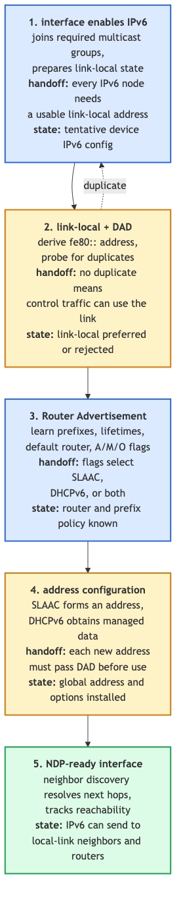
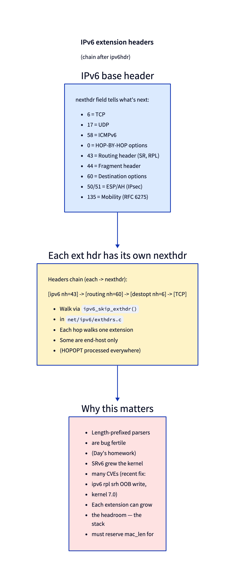

# Day 10 — IPv6 specifics: NDP, autoconfig, extension headers

> **Today's mission:** see what's different about IPv6 from IPv4 — the autoconfig flow, the neighbor discovery protocol, and the extension header chain that's caused real CVEs. Total time: ~75 minutes.

## Why IPv6 deserves its own day

Most of the kernel network stack is shared between IPv4 and IPv6: the socket layer, the routing infrastructure, netfilter, the device queue, qdiscs. But IPv6 has three structurally different features that can't be glossed over:

1. **Autoconfiguration.** IPv6 hosts self-configure their addresses without DHCP, by listening to Router Advertisements.
2. **NDP** replaces ARP. Same idea (resolve next-hop link-layer address) but built on ICMPv6 with richer semantics (neighbor unreachability detection, redirect, prefix discovery).
3. **Extension headers.** Variable-length, chained between the base IPv6 header and the L4 protocol. Powerful, fragile, and the source of multiple CVEs over the years.

If you only know IPv4, IPv6 looks "like IPv4 with bigger addresses." It isn't. These three pieces are where you'll trip.

## Autoconfiguration

The first time you bring up an IPv6-enabled interface, the kernel runs through this sequence — most of it before any user-supplied configuration:



### Step 1: assign a link-local address

Every IPv6 interface gets at least a link-local address in `fe80::/64`. The host portion is derived from one of:

- **EUI-64**: insert `fffe` between the two halves of the MAC address (and flip the U/L bit). For MAC `aa:bb:cc:dd:ee:ff` you get `fe80::a8bb:ccff:fedd:eeff`. Predictable but privacy-leaking — the MAC stays the same across networks.
- **`stable_secret`**: hash a per-interface seed with a cryptographic RNG. Different every fresh boot or interface reset.
- **`tempaddr`** (RFC 4941): privacy extensions; periodically rotate the host portion.

Sysctls that matter:
- `net.ipv6.conf.<dev>.addr_gen_mode`: 0 = EUI-64, 1 = none, 2 = stable_privacy, 3 = random (initializes a random secret, then generates via the stable_privacy algorithm).
- `net.ipv6.conf.<dev>.use_tempaddr`: 0 = no privacy addrs, 1 = use them but prefer stable, 2 = prefer privacy.

Implementation: `net/ipv6/addrconf.c:3415` `addrconf_addr_gen` — branches on `addr_gen_mode` and calls the right generator.

### Step 2: Duplicate Address Detection (DAD)

Before assigning an address, the host sends an ICMPv6 **Neighbor Solicitation** for it (with src `::`, the unspecified address — telling everyone "I'm tentatively claiming this"). If anyone replies, the address is in use; the kernel marks it `dadfailed` and refuses to use it. If nobody replies after `dad_transmits` retries (default 1) at intervals of `RetransTimer` (default 1 s), the address moves from `tentative` to `preferred`.

You can see this with:
```bash
ip -6 addr show dev eth0     # look for 'tentative' or 'dadfailed' flags
```

DAD is mandatory by spec; you can disable it with `net.ipv6.conf.<dev>.accept_dad=0` for niche cases (link with no neighbors yet) but never on a shared LAN.

### Step 3: Listen for Router Advertisements

ICMPv6 type 134 — emitted by routers either periodically (every 200 s by default) or in response to **Router Solicitation** (type 133) from hosts that just came up. RAs carry, among other things:

- A list of **prefixes** with on-link/auto-config flags.
- Default route (the router itself).
- MTU.
- M flag ("Managed" — use DHCPv6 for addresses).
- A flag ("Autonomous" — do SLAAC from this prefix).
- O flag ("Other" — use DHCPv6 for non-address config like DNS).
- RDNSS option — recursive DNS server (RFC 8106).

If A=1 in a prefix, the host runs **SLAAC**: append its host portion to the announced prefix, run DAD, install the address. If M=1, kernel kicks off a DHCPv6 client (handled by userspace — `dhclient -6`, `wpa_supplicant`, NetworkManager, etc.). Both can be true simultaneously.

### Step 4: NDP everywhere else

After address setup, NDP keeps neighbor state fresh. Same plumbing as Day 7's `neighbour` subsystem — there's a `struct neigh_table nd_tbl` at `net/ipv6/ndisc.c:109` that's structurally identical to `arp_tbl`. Same NUD states (REACHABLE, STALE, etc.), same gc thresholds, same `ip neigh show`.

## NDP — Neighbor Discovery Protocol in detail

NDP runs over ICMPv6. Five message types:

| Type | Name | Purpose |
|------|------|---------|
| 133 | Router Solicitation | "Any router on link?" — host on bring-up |
| 134 | Router Advertisement | Router announcing itself + prefixes |
| 135 | Neighbor Solicitation | "Who has this address?" (≈ ARP request); also DAD |
| 136 | Neighbor Advertisement | Reply to NS; also unsolicited (≈ gratuitous ARP) |
| 137 | Redirect | "Send packets for X via Y instead of me" |

Compared to ARP, NDP is richer:
- **Multicast-based** (well-known multicast addresses) instead of broadcast — saves bandwidth and lets switches snoop.
- **Authenticated** with SEND (RFC 3971), though deployment is rare.
- **Detects unreachability** actively (bidirectional reachability checks, not just on-demand).
- **Carries options** for MTU, source link-layer address, prefix info, route info.

Implementation entry points:
- `ndisc_recv_ns` — incoming neighbor solicitation.
- `ndisc_recv_na` — incoming advertisement.
- `ndisc_send_na`, `ndisc_send_ns` — outgoing.

`net/ipv6/ndisc.c` is ~2000 lines but most of it is option parsing.

## Extension headers — power and pitfall

IPv6 base header is fixed at 40 bytes. The `nexthdr` field tells what follows. For TCP traffic that's just `6` (TCP); but `nexthdr` can also point at an *extension header*, which itself has a `nexthdr` field, forming a chain:



### The headers in the chain

- **Hop-by-Hop Options (0)** — every router on the path must process. Used by Jumbograms (>64KB), MLD, RPL.
- **Routing (43)** — Source Routing Header (SRH) for SRv6, RPL.
- **Fragment (44)** — IPv6 fragmentation (only by source; routers don't fragment).
- **Destination Options (60)** — end-host options.
- **Authentication Header (51)** / **ESP (50)** — IPsec.
- **Mobility (135)** — Mobile IPv6.

Each extension is parsed by a per-protocol handler registered in `inet6_protos[]`. The Routing handler is `ipv6_rthdr_rcv` (`net/ipv6/exthdrs.c:654`), Destination is `ipv6_destopt_rcv` (`net/ipv6/exthdrs.c:295`), etc.

### Why this is dangerous

Extension-header parsers are length-prefixed-buffer parsers in C, deep in the network stack. They've been a recurring source of CVEs:

- **2026 (kernel 7.1):** SRv6 RPL OOB write — `ipv6_rpl_srh_rcv` could push a recompressed SRH that exceeded headroom, causing `skb_mac_header_rebuild` to underflow `mac_header` to ~65530 and `memmove` to write 14 bytes ~64KiB past `skb->head`. Fix in commit `9e6bf146b559`.
- **2018:** SegmentRoutingHeader processing flaw (CVE-2018-14633).
- Various jumbogram bugs in `ipv6_hop_jumbo` (`net/ipv6/exthdrs.c:996`).

The pattern: an attacker controls extension-header *lengths*, and a parser miscomputes how much memory to allocate or how many bytes are valid. If you write an extension header parser, treat it like a fuzzing target from day one.

### Skipping the chain

To get to L4, code calls `ipv6_skip_exthdr(skb, start, &nexthdr, &frag_off)` — walks the chain until reaching a non-extension `nexthdr` and returns the offset. Quirks:

- Some L4 lookups need to skip *all* extension headers; others (like conntrack) want to inspect specific ones.
- A malformed chain (loop, oversized) causes `ipv6_skip_exthdr` to return `-1`, and the kernel drops the packet.
- The function takes `frag_off` because a Fragment header tells you the packet is part of a larger original — caller may need to defer processing.

## Today's experiment

```bash
# See your IPv6 addresses and their states
ip -6 addr show
# Look for: 'global', 'mngtmpaddr', 'dynamic', 'tentative', 'deprecated'

# Watch DAD on bring-up
sudo bpftrace -e 'fentry:ndisc_send_ns {
  printf("NS sent target=%s\n", ntop(args->solicit->in6_u.u6_addr8));
}' &
sudo ip link set eth0 down && sleep 1 && sudo ip link set eth0 up

# Watch NDP traffic globally
sudo tcpdump -i eth0 -nn icmp6 and not host ::

# Inspect autoconfiguration sysctls for one interface
sysctl net.ipv6.conf.eth0 | grep -E "addr_gen_mode|accept_ra|use_tempaddr|dad_transmits"

# Trace extension-header parsing
sudo bpftrace -e 'fentry:ipv6_skip_exthdr { printf("skip nexthdr=%d start=%d\n", *args->nexthdrp, args->start); }'
```

## What to read in the kernel

- **`net/ipv6/ip6_input.c:188`** — `ip6_rcv_core`. The IPv6 receive core logic (~145 lines, ~80 of real logic). `ipv6_rcv` (line 344) is a ~10-line wrapper that calls `ip6_rcv_core`, then runs the netfilter PRE_ROUTING hook. Notice how it parses the base header, validates `version=6`, and dispatches via the registered `inet6_protos[]` table — same pattern as IPv4's `ip_rcv` but with the extension-header parser as the first handler.

- **`net/ipv6/addrconf.c`** — autoconf state machine. ~5000 lines but you only need a few entry points:
  - `addrconf_dad_start` (search for the function; no fixed line) — kicks off DAD.
  - `addrconf_rs_timer` — periodic RS solicitation when no router heard from.
  - `addrconf_prefix_rcv` — handle a prefix from RA: install address, run DAD on it.
  - `addrconf_addr_gen` (line 3415) — host-portion generation.

  Read the top of the file's comments first; the model is a state machine per `inet6_dev`.

- **`net/ipv6/ndisc.c:109`** — `nd_tbl`, the neighbour-table instance. The struct is identical to IPv4's `arp_tbl` — confirms how generic the neighbour subsystem is. Around it, `ndisc_recv_ns`, `ndisc_recv_na`, `ndisc_send_na`, `ndisc_send_ns` are the protocol handlers.

- **`net/ipv6/exthdrs.c`** — extension-header parsers.
  - `ipv6_rthdr_rcv` (line 654): Routing header. Read this to understand SRv6 — the most actively-developed extension. Also where most CVEs have been.
  - `ipv6_destopt_rcv` (line 295): Destination Options. Simpler; good warm-up.
  - `ipv6_hop_jumbo` (line 996): the parser for the Jumbo Payload option in HOPOPT. Tiny but instructive.

- **`include/uapi/linux/in6.h`** and **`include/net/ipv6.h`** — the canonical structs (`struct ipv6hdr`, `struct in6_addr`, the IPV6_NEXTHDR_* constants).

- **`Documentation/networking/ipv6.rst`** — overview. Light but has pointers to RFC numbers.

- **RFCs to skim**: 8200 (IPv6 spec), 4861 (NDP), 4862 (SLAAC), 4941 (privacy extensions), 7136 (modified EUI-64), 8754 (SRv6).

## Bullet Points

- IPv6 hosts auto-configure: link-local (fe80::/64) immediately, global addresses from RAs.
- **Address generation modes** (`addr_gen_mode`): EUI-64 (kernel default; many distros override to stable_privacy), stable_secret (hashed per-iface), random.
- **DAD** is mandatory: send NS to your tentative address, wait, then commit.
- **NDP** = ICMPv6 messages 133–137: RS, RA, NS, NA, Redirect. Replaces ARP.
- The `neighbour` subsystem (`nd_tbl`) is structurally identical to IPv4's `arp_tbl`.
- **Extension headers** chain between base IPv6 header and L4. Walked by `ipv6_skip_exthdr`.
- Important extensions: HopByHop (0), Routing (43, includes SRv6), Fragment (44), DestOpts (60), AH/ESP (51/50).
- Extension-header parsers have been a recurring CVE source. Treat as a fuzz-prone area.

## Check question

A node receives an IPv6 packet whose first extension header is `nexthdr=0` (Hop-by-Hop Options). What action is the kernel obligated to take, even if the packet is for a peer (not for us)?

<details>
<summary>Click to reveal answer</summary>

**Answer:** Process the Hop-by-Hop options. HopByHop is special — every router on the path must inspect it, regardless of whether the packet's destination is local. (That's what "hop-by-hop" means.) The kernel calls `ipv6_parse_hopopts` immediately after the base header. If an option is unknown and has the high bits in the option-type byte set to indicate "discard packet on unknown option," the packet is dropped (and possibly an ICMPv6 Parameter Problem returned). Other extensions like Destination Options are processed only at the destination — the kernel skips them on a forwarding path. The Hop-by-Hop processing requirement is also why this header **must** be the first extension if present; later positions are spec-illegal.

</details>

---

## Tomorrow

Day 11: the bridge subsystem. Linux as a software L2 switch.
