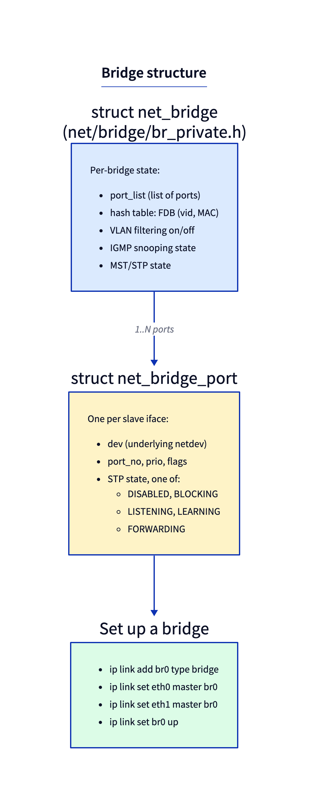
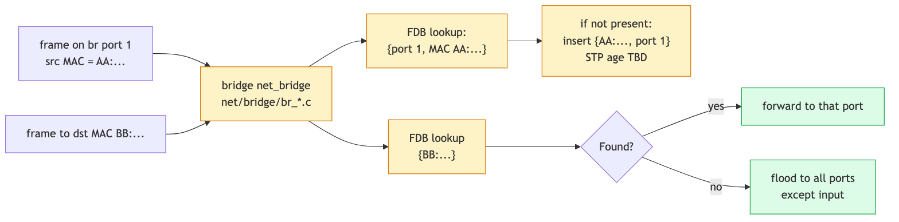

# Day 11 — The bridge subsystem

> **Today's mission:** create a software Linux bridge, attach two interfaces to it, watch the FDB learn MACs as traffic flows. See how VLAN-aware bridges enable real switch behavior. Total time: ~75 minutes.

## What a Linux bridge is, and why you have one

A Linux bridge is a software L2 switch. It looks like a netdev (you can give it an IP, ping it, configure routes through it) but its job is to forward Ethernet frames between member ports based on destination MAC. The implementation lives in `net/bridge/` (~28k lines of top-level `.c`).

You're using bridges constantly even if you've never explicitly created one:

- **Container runtimes.** Docker creates `docker0` by default; Podman creates `cni-podman0`; CNI plugins create `cni0`/`cbr0`. Each one is a Linux bridge that wires container veths to the host network.
- **VMs.** libvirt's "default" network is a bridge (`virbr0`); `bridge=br0` mode in qemu attaches the VM's TAP directly to a host bridge.
- **Multi-NIC servers acting as switches.** A box with multiple Ethernet NICs can bridge them with one `ip link add br0 type bridge` plus `ip link set <if> master br0` per port.

The bridge is the fastest L2-forwarding plane in the kernel — much faster than the IP routing path because it doesn't allocate routing-table entries, doesn't run netfilter (by default — see `br_netfilter`), and doesn't decapsulate.

## Anatomy



A bridge is two structs working together:

- **`struct net_bridge`** (`net/bridge/br_private.h:495`) — the bridge itself. Holds the FDB hash, port list, VLAN config, IGMP-snooping state, MST/STP state. One of these per `brN` netdev.
- **`struct net_bridge_port`** — one per slave interface. Holds the `dev` pointer (the underlying netdev), the port number, STP state (DISABLED, LEARNING, FORWARDING, ...), and per-port flags (BPDU guard, root guard, hairpin, etc.).

When you do `ip link set eth0 master br0`, the kernel attaches a `net_bridge_port` to `eth0`, registers `br_handle_frame` as `eth0`'s `rx_handler`, and the slave's frames now flow into bridge logic instead of the normal stack.

## The forwarding decision



For every frame that lands on a bridge port, the kernel runs the same compact decision tree:

1. **Drop or forward control frames.** STP BPDUs (destined to `01:80:c2:00:00:00`) get special handling; non-bridge multicast may be flooded or snooped.
2. **Learn the source.** Insert/refresh `(src MAC, vid, port)` in the FDB via `br_fdb_update` (`net/bridge/br_fdb.c:972`). Aging timers tick.
3. **Look up the destination.** `br_fdb_find_rcu` (`net/bridge/br_fdb.c:263`) walks the hash table.
4. **Decide:**
   - **Hit, same port** → drop (don't loop the frame back to where it came from).
   - **Hit, different port** → `br_forward` (`net/bridge/br_forward.c:144`) — send out that one port.
   - **Miss** → `br_flood` (`net/bridge/br_forward.c:201`) — send to every port except the input port.
   - **Broadcast/multicast** — flood, possibly filtered by IGMP/MLD snooping.

The "miss → flood" rule is what makes bridges *self-learning*. Initial frames flood; replies teach the FDB the source's port; subsequent frames are unicast.

The actual entry point is **`br_handle_frame`** (`net/bridge/br_input.c:339`), which is registered as the rx_handler when an interface joins a bridge. Following the path `br_handle_frame` → `br_handle_frame_finish` (`net/bridge/br_input.c:76`) gives you the full L2 forwarding code in ~250 lines.

## VLAN-aware bridges

By default a bridge ignores VLAN tags — it's just an L2 switch. Toggle VLAN-awareness:

```bash
sudo ip link set br0 type bridge vlan_filtering 1
```

Now the bridge implements proper 802.1Q switching:

- Each port has a list of allowed VLANs (egress: tagged or untagged) and a PVID (default VLAN for untagged ingress).
- Frames are forwarded only between ports that share a VLAN.
- The FDB is keyed on `(MAC, vid)` not just MAC — same MAC in different VLANs is two separate entries.

```bash
# Allow VLAN 100 on two ports, untagged on port A, tagged on port B:
sudo bridge vlan add dev v1p vid 100 pvid untagged
sudo bridge vlan add dev v2p vid 100 tagged
```

Now untagged frames from `v1p` are tagged with VID 100 internally, can be forwarded to `v2p` (which expects them tagged), and on egress the bridge tags them out.

This is the foundation of "VLAN-aware bridges" used in network namespaces and sophisticated container networking (Cilium, Calico's IPVLAN modes).

## STP — Spanning Tree (briefly)

Linux bridges support STP and RSTP. Enable:

```bash
sudo ip link set br0 type bridge stp_state 1
```

When STP is on, the bridge sends/processes BPDUs, computes a loop-free topology, and puts redundant ports in BLOCKING state. For container/VM scenarios where you control the topology, leave STP off — it adds startup latency.

## Bridge and netfilter

By default, bridge forwarding **does not** invoke netfilter (iptables/nftables) — the bridge layer is below IP. The optional **`br_netfilter`** kernel module changes that: it makes bridge forwarding traverse netfilter chains, so iptables rules apply to bridged traffic.

Enable:
```bash
sudo modprobe br_netfilter
```

Useful for: applying iptables to traffic between VMs that share a bridge, transparent proxying, host-as-firewall scenarios.

**Gotcha:** `br_netfilter` causes performance loss (every bridged frame goes through netfilter); it's also semantically tricky (a single packet may traverse iptables chains twice — once as bridge ingress, once as IP forward). For pure L2 forwarding without IP-level filtering, leave `br_netfilter` off.

## Today's experiment

Build a two-namespace bridged network:

```bash
sudo ip link add br0 type bridge
sudo ip link set br0 up

sudo ip link add v1 type veth peer name v1p
sudo ip link add v2 type veth peer name v2p
sudo ip link set v1p master br0
sudo ip link set v2p master br0
sudo ip link set v1p up
sudo ip link set v2p up

sudo ip netns add ns1
sudo ip netns add ns2
sudo ip link set v1 netns ns1
sudo ip link set v2 netns ns2

sudo ip netns exec ns1 ip addr add 10.0.0.1/24 dev v1
sudo ip netns exec ns1 ip link set v1 up
sudo ip netns exec ns2 ip addr add 10.0.0.2/24 dev v2
sudo ip netns exec ns2 ip link set v2 up

# Test
sudo ip netns exec ns1 ping -c 2 10.0.0.2
```

Inspect the FDB:
```bash
bridge fdb show dev v1p     # learned MAC of v1
bridge fdb show dev v2p     # learned MAC of v2
```

`bridge fdb show` prints several lines per port — don't expect just one:

```text
92:56:a0:eb:25:81 master br0                 # <- the learned entry (v1's MAC)
ee:72:dd:99:36:fa vlan 1 master br0 permanent
ee:72:dd:99:36:fa master br0 permanent
33:33:00:00:00:01 self permanent
01:00:5e:00:00:01 self permanent
```

The learned entry is the single line shown as `<mac> master br0` **without** a `permanent` flag — that is v1's MAC, learned from ns1's traffic, and it ages out after 300 s (the default `ageing_time`). The `... permanent` line is the port's own MAC; the `33:33:.../01:00:5e:... self permanent` lines are multicast-group memberships — none of those are learned traffic.

Trace the learning path. `br_fdb_update` runs on the per-frame learning path, so bound the probe with an `interval` exit and provoke traffic while it runs:

```bash
sudo bpftrace -e 'fentry:br_fdb_update {
  printf("learn vid=%d port=%s\n", args->vid, args->source->dev->name);
} interval:s:10 { exit(); }'
```

While that runs, in another terminal flush the FDB (so re-learning fires the probe) and ping:

```bash
sudo bridge fdb flush dev v1p master
sudo ip netns exec ns1 ping -c 5 10.0.0.2
```

`br_fdb_update` fires on **every** received frame on a learning port, so you'll see one `learn` line per packet per source port (a 5-packet ping prints ~5 lines for `v1p`) — not once per MAC. Each call refreshes the entry's `updated` timestamp, and that continuous refresh is exactly how an active entry avoids aging out. (`vid=0` appears here because `vlan_filtering` is still off; it becomes `100` only after you enable filtering below.) The probe auto-exits after 10 s.

Then turn on VLAN filtering:
```bash
sudo ip link set br0 type bridge vlan_filtering 1
sudo bridge vlan add dev v1p vid 100 pvid untagged
sudo bridge vlan add dev v2p vid 100 pvid untagged
sudo bridge vlan show

# After flushing FDB, traffic should still pass (both ports in VLAN 100).
# The `master` scope flushes the entries the bridge LEARNED on each port.
# Without it, iproute2 defaults to `self`, and a veth has no self-FDB delete
# handler, so the kernel returns "Operation not supported" and nothing flushes:
sudo bridge fdb flush dev v1p master
sudo bridge fdb flush dev v2p master
sudo ip netns exec ns1 ping -c 2 10.0.0.2

# Now move v2p to a different VLAN:
sudo bridge vlan del dev v2p vid 100
sudo bridge vlan add dev v2p vid 200 pvid untagged
# ping should now fail — v1p in VLAN 100, v2p in VLAN 200, frame dropped at egress:
sudo ip netns exec ns1 ping -c 2 -W 1 10.0.0.2   # 100% packet loss, exit code 1
```

## What to break

- **Set `stp_state 1` on a bridge with no loops.** To actually watch the state machine run, enable STP and then bounce a port — just setting `stp_state 1` on a bridge whose ports are already forwarding leaves them forwarding, because the `listening → learning` walk only happens when a port comes up under STP:
  ```bash
  sudo ip link set br0 type bridge stp_state 1
  sudo ip link set v1p down; sudo ip link set v1p up
  watch -n1 bridge link show dev v1p
  ```
  You'll see `state listening` → `learning` → `forwarding` over ~30 s (default forward delay is 15 s, applied once per stage). Containers usually don't tolerate this delay; leave STP off.
- **Enable `br_netfilter` and add an iptables DROP rule on the bridge.** Loading the module defaults `net.bridge.bridge-nf-call-iptables=1`, which is what routes bridged frames through iptables:
  ```bash
  sudo modprobe br_netfilter
  sudo iptables -A FORWARD -j DROP
  sudo ip netns exec ns1 ping -c2 -W1 10.0.0.2   # now fails — iptables sees bridged frames
  ```
  Clean up by **deleting the exact rule**. Note that `iptables -P FORWARD ACCEPT` only resets the chain *policy* — it will NOT remove an appended `-A` rule, so it leaves connectivity broken:
  ```bash
  sudo iptables -D FORWARD -j DROP
  sudo modprobe -r br_netfilter
  ```
- **Mix VLANs:** put `v1p` and `v2p` in different VLANs. FDB miss → flood, but flood respects VLAN membership, so frame is dropped. `bridge -s vlan show` reveals the rules.

## What to read in the kernel

- **`net/bridge/br_input.c:339`** — `br_handle_frame`. This is the rx_handler installed by `br_add_if`. Read top to bottom (~130 lines including the no-port early returns). Notice it dispatches BPDUs separately from data frames, applies VLAN filtering, and then either invokes the netfilter PREROUTING hook (if `br_netfilter` is loaded) or jumps directly to `br_handle_frame_finish`.

- **`net/bridge/br_input.c:76`** — `br_handle_frame_finish`. The actual switch logic. Walk through it: FDB lookup, multicast handling, forward vs flood decision. This is the function whose performance limits how fast a Linux bridge can switch — every cycle here is on the per-frame hot path.

- **`net/bridge/br_fdb.c:263`** — `br_fdb_find_rcu`. Hash lookup. Note the RCU-protected design — readers don't lock, writers update under `br->hash_lock`. The FDB is the kernel's `rhashtable` (`br_fdb_rht_params`), keyed on `{vlan_id, MAC}` and looked up via `rhashtable_lookup`.

- **`net/bridge/br_fdb.c:972`** — `br_fdb_update`. The learning path. Notice the "added_by_external_learn" flag — this is how SDN controllers push entries from userspace.

- **`net/bridge/br_forward.c:144`** — `br_forward`. Egress on a single port. Updates stats, applies `BR_HAIRPIN_MODE` (loops the frame back out the input port — used for some virtual networking patterns), then calls `br_forward_finish` which hands off to `dev_queue_xmit`.

- **`net/bridge/br_forward.c:201`** — `br_flood`. Iterate ports, skip the input port and any with `BR_FLOOD` cleared, send to each via `__br_forward`. Notice the optimization: clones are deferred until the second egress port (the original skb is consumed by the first port).

- **`net/bridge/br_vlan.c`** — VLAN-aware bridge logic. ~2350 lines. The two main functions are `br_allowed_ingress` (ingress filtering) and `br_handle_vlan` (egress tagging).

- **`net/bridge/br_stp_*.c`** — STP/RSTP implementation. Skim `br_stp_set_bridge_priority` and `br_become_root_bridge` for the high-level state machine.

- **`net/bridge/br_netfilter_hooks.c`** — bridge ↔ netfilter glue. The `br_nf_*` functions hook into PRE_ROUTING and POST_ROUTING for bridged traffic. Read this if you ever need to debug "iptables sees bridged frames" issues.

- **`Documentation/networking/bridge.rst`** — official guide. Brief but pointed.

## Bullet Points

- A Linux bridge = software L2 switch. `ip link add br0 type bridge` creates one.
- **Three operations per frame**: learn (FDB update with src), look up (dst), forward or flood.
- **`br_handle_frame`** is registered as rx_handler on slave ports — it intercepts before the normal stack.
- **FDB** is a hash keyed on `(vlan_id, MAC)`. Default 300 s aging; `bridge fdb` to inspect.
- **`vlan_filtering 1`** turns the bridge into a real 802.1Q switch with per-port VLAN config.
- **STP** is supported but adds ~30 s startup; usually off in container/VM scenarios.
- **`br_netfilter`** module makes iptables apply to bridged frames — useful but slows the data path.
- Hairpin mode loops a frame back out its input port; used in some SDN patterns.

## Check question

A bridge has 4 ports. A frame with destination MAC `aa:bb:cc:dd:ee:ff` arrives on port 1. The FDB has no entry for that MAC. What ports does the frame go out on, and why is it implemented as "everything except input"?

<details>
<summary>Click to reveal answer</summary>

**Answer:** Ports 2, 3, and 4 — the bridge floods to all forwarding ports *except* the input port (this is "split-horizon"). The input port is excluded because the kernel knows the source is on that port (it just learned it via `br_fdb_update`); sending the frame back out the same port would either be wasted (the source already has it) or, on a shared/hub-like medium, create a loop. Once a reply comes back from one of the flood-targets carrying `aa:bb:cc:dd:ee:ff` as its source MAC, the FDB learns and subsequent unicast frames go directly. Implementation: `br_flood` walks the port list and skips the input port via `if (p == src) continue`.

</details>

---

## Tomorrow

Day 12: tunnels — VXLAN, GRE, IPIP, WireGuard. End of Phase 2.
