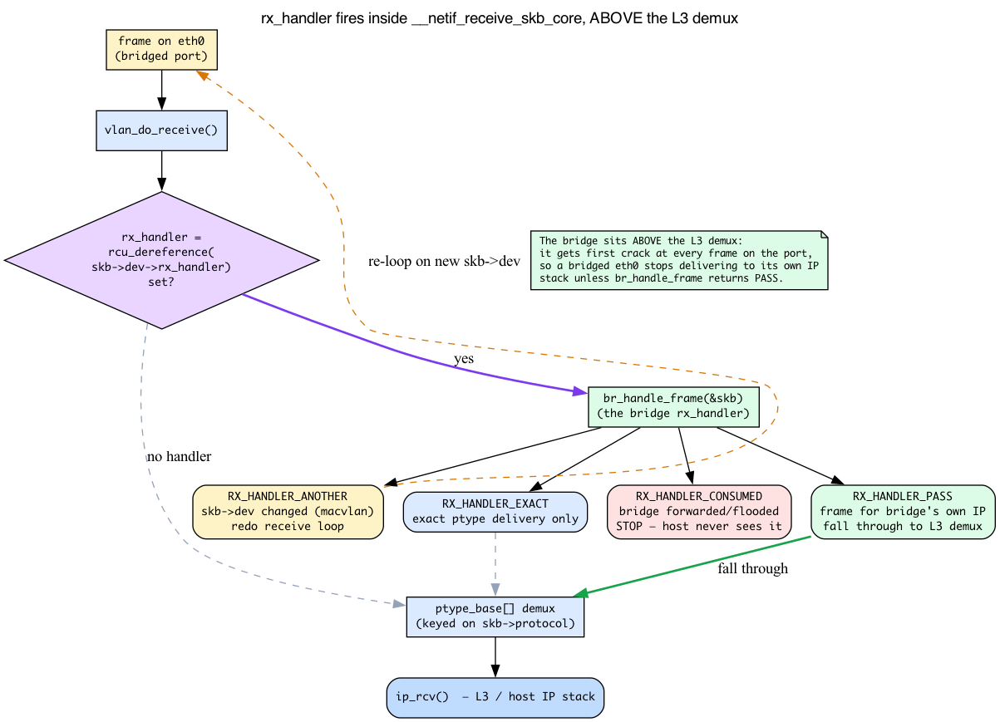
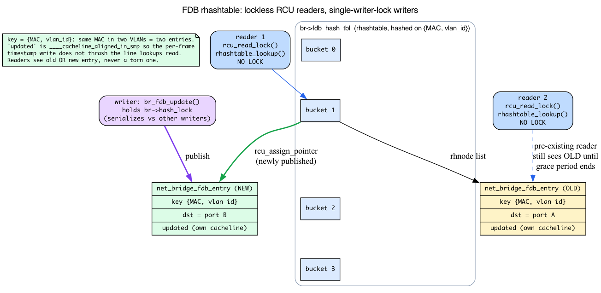
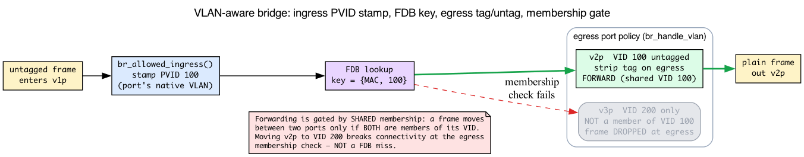
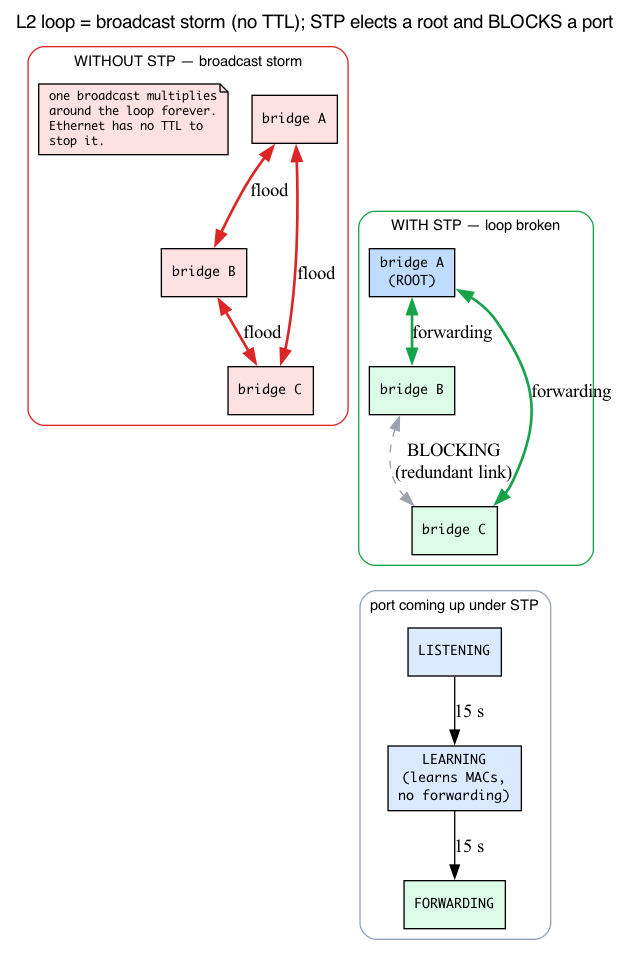

# Day 11 — The bridge subsystem

> **Today's mission:** create a software Linux bridge, attach two interfaces to it, and watch the FDB learn MACs as traffic flows. Along the way, learn the four mechanisms the bridge is built on — the `rx_handler` hook that hijacks a NIC's frames, why L2 loops are catastrophic (and what spanning tree does about it), how the forwarding database stays lock-free for readers, and how `br_netfilter` drags bridged frames through iptables. See how VLAN-aware bridges enable real switch behavior. Total time: ~110 minutes.

## What a Linux bridge is, and why you have one

A Linux bridge is a software L2 switch. It looks like a netdev (you can give it an IP, ping it, configure routes through it) but its job is to forward Ethernet frames between member ports based on destination MAC. Like any switch, it *learns* which MAC lives behind which port and stores that mapping in a table called the **FDB** (forwarding database). The implementation lives in `net/bridge/` (~29k lines of top-level `.c`).

You're using bridges constantly even if you've never explicitly created one:

- **Container runtimes.** Docker creates `docker0` by default; Podman creates `cni-podman0`; CNI plugins create `cni0`/`cbr0`. Each one is a Linux bridge that wires container veths to the host network.
- **VMs.** libvirt's "default" network is a bridge (`virbr0`); `bridge=br0` mode in qemu attaches the VM's TAP (a software NIC that hands frames to a userspace process like qemu) directly to a host bridge.
- **Multi-NIC servers acting as switches.** A box with multiple Ethernet NICs can bridge them with one `ip link add br0 type bridge` plus `ip link set <if> master br0` per port.

The bridge is the fastest L2-forwarding plane in the kernel — much faster than the IP routing path because, switching purely by destination MAC, it skips everything L3 does: no L3/FIB lookup, no TTL decrement and header-checksum rewrite, and (by default — see `br_netfilter`) no netfilter traversal or decapsulation.

This chapter leans on four pieces of machinery that no earlier day taught you: the **`rx_handler`** hook that diverts a slave NIC's frames into bridge code; the **broadcast-storm / spanning-tree** problem that explains why switches need STP at all; the **RCU-protected `rhashtable`** that backs the forwarding database; and the **netfilter chains** that `br_netfilter` exposes. We'll teach each one — intuition first, then the concrete v7.1 struct or function — right where the bridge depends on it.

> Two things from earlier days are load-bearing today and will **not** be re-taught:
> - **The RX path.** Recall from Day 2 — the NIC's NAPI poll builds an skb, then `__netif_receive_skb_core` walks the `ptype_base` hash to find the L3 handler (`ip_rcv` for IPv4). Today's whole story is about a hook that fires *before* that demux.
> - **The CPU cache line.** Recall from Day 1 — the CPU reads memory in 64-byte lines, so write-heavy fields are kept off read-mostly cache lines to avoid false sharing. We'll meet that idea once more, in the FDB entry.

## Anatomy


A bridge is two structs working together:

- **`struct net_bridge`** (`net/bridge/br_private.h:495`) — the bridge itself. Holds the FDB (forwarding database) — the MAC-address-to-port table that is the heart of any L2 switch — plus the port list, VLAN config, IGMP-snooping state, MST/STP state. One of these per `brN` netdev.
- **`struct net_bridge_port`** (`net/bridge/br_private.h:387`) — one per slave interface. Holds the `dev` pointer (the underlying netdev), the port number, STP state (DISABLED, LEARNING, FORWARDING, ...), and per-port flags (BPDU guard, root guard, hairpin, etc.).

When you do `ip link set eth0 master br0`, the kernel attaches a `net_bridge_port` to `eth0`, registers `br_handle_frame` as `eth0`'s `rx_handler`, and the slave's frames now flow into bridge logic instead of the normal stack. That sentence hides the single most important mechanism in the chapter — so let's open it up.

## Background 1: the `rx_handler` — how a slave NIC's frames get hijacked

Recall the RX path from Day 2: a frame is DMAed in, NAPI builds an skb, and `__netif_receive_skb_core` indexes `ptype_base` by `skb->protocol` to find the one L3 handler (`ip_rcv`, the IPv6 handler, ARP, ...). That's the "normal stack." A bridge has to get its hands on the frame *before* that L3 demux runs — otherwise a frame destined for some other host would be delivered to *this* host's IP stack instead of being switched out another port.

The kernel's hook for exactly this is the **`rx_handler`**.

### One function pointer per netdev

Every `struct net_device` carries a single, optional `rx_handler` slot (`include/linux/netdevice.h:2189`):

```c
rx_handler_func_t __rcu  *rx_handler;
void __rcu               *rx_handler_data;
```

When that pointer is set, `__netif_receive_skb_core` calls it **before** the `ptype_base` packet-type walk that Day 2 traced. So the rx_handler sits at the exact spot in the RX path where the L3 demux would otherwise run, and gets first refusal on the frame. There is only one rx_handler per device — registering a second returns `-EBUSY` (`include/linux/netdevice.h:461-477`). The bridge, bonding, macvlan, and OVS all compete for this same plug-in slot; a "join a master" device is one that has installed an rx_handler.

### Its return value decides the frame's fate

The handler tells the receive path what to do with the skb via an `enum rx_handler_result` (documented at `include/linux/netdevice.h:461-477`). The two that matter:

- **`RX_HANDLER_CONSUMED`** — "I took the skb; do not process it further." The frame never reaches `ptype_base`, never reaches `ip_rcv`. The bridge returns this for every frame it forwards or floods — which is *why* bridged traffic never climbs into the host's IP stack.
- **`RX_HANDLER_PASS`** — "Do nothing; proceed as if no handler ran." This is the escape hatch that lets a frame addressed to the bridge's *own* IP (you gave `br0` an address, remember) climb the normal stack.

(There are two more — `RX_HANDLER_ANOTHER`, re-loop because `skb->dev` changed, and `RX_HANDLER_EXACT`, force exact delivery — that the bridge doesn't lean on today.)

### Where the bridge installs it

Back in `br_add_if` (the code path behind `ip link set eth0 master br0`), the bridge registers its handler (`net/bridge/br_if.c:613`):

```c
err = netdev_rx_handler_register(dev, br_get_rx_handler(dev), p);
```

Three things happen in that one call:

1. `br_get_rx_handler(dev)` (`net/bridge/br_input.c:463`) returns **`br_handle_frame`** for an ordinary port (a special dummy is used for DSA switch ports).
2. `netdev_rx_handler_register` plants `br_handle_frame` into `dev->rx_handler`.
3. The third argument — `p`, the `net_bridge_port` — is stashed as `rx_handler_data`, so when a frame later arrives, `br_handle_frame` can recover *which port and which bridge* it belongs to.

`br_handle_frame` itself is at `net/bridge/br_input.c:339`:

```c
static rx_handler_result_t br_handle_frame(struct sk_buff **pskb)
```



So the picture is: a frame on a slave NIC reaches `__netif_receive_skb_core`, which checks `dev->rx_handler`. It's set, so `br_handle_frame` runs. If the bridge switches the frame (forward or flood), it returns `RX_HANDLER_CONSUMED` and the frame is gone from this host's perspective. Only `RX_HANDLER_PASS` lets the frame fall through to the `ptype_base` demux and on to `ip_rcv` — the Day-2 path.

## The forwarding decision


For every frame that lands on a bridge port, the kernel runs the same compact decision tree:

1. **Drop or forward control frames.** STP BPDUs (Bridge Protocol Data Units — Spanning Tree control frames, covered in Background 3; destined to `01:80:c2:00:00:00`) get special handling; non-bridge multicast may be flooded or snooped.
2. **Learn the source.** Insert/refresh `(src MAC, vid, port)` in the FDB via `br_fdb_update` (`net/bridge/br_fdb.c:972`). Aging timers tick.
3. **Look up the destination.** `br_fdb_find_rcu` (`net/bridge/br_fdb.c:263`) walks the hash table.
4. **Decide:**
   - **Hit, same port** → drop (don't loop the frame back to where it came from).
   - **Hit, different port** → `br_forward` (`net/bridge/br_forward.c:144`) — send out that one port.
   - **Miss** → `br_flood` (`net/bridge/br_forward.c:201`) — send to every port except the input port.
   - **Broadcast/multicast** — flood, possibly filtered by IGMP/MLD snooping.

The "miss → flood" rule is what makes bridges *self-learning*. Initial frames flood; replies teach the FDB the source's port; subsequent frames are unicast.

The actual entry point is **`br_handle_frame`** (`net/bridge/br_input.c:339`), which is registered as the rx_handler when an interface joins a bridge. Following the path `br_handle_frame` → `br_handle_frame_finish` (`net/bridge/br_input.c:76`) gives you the full L2 forwarding code in ~250 lines.

## Background 2: the FDB is an RCU-protected `rhashtable`

Steps 2 and 3 above both hit the FDB — one write, one read — on **every single frame**. At line rate that's millions of lookups per second, so the data structure underneath has to let readers run without ever blocking each other or the writers. Two kernel mechanisms make that possible, and neither was introduced earlier, so let's build them up.

### `rhashtable`: the kernel's resizable hash table

`rhashtable` is the kernel's generic, automatically-resizing hash table. The FDB configures one with a small parameter block (`net/bridge/br_fdb.c:27`):

```c
static const struct rhashtable_params br_fdb_rht_params = {
    .head_offset = offsetof(struct net_bridge_fdb_entry, rhnode),
    .key_offset  = offsetof(struct net_bridge_fdb_entry, key),
    .key_len     = sizeof(struct net_bridge_fdb_key),
    .automatic_shrinking = true,
};
```

The **key** is not just the MAC — it's the `{MAC, vlan_id}` pair (`net/bridge/br_private.h:286`):

```c
struct net_bridge_fdb_key {
    mac_addr addr;
    u16      vlan_id;
};
```

That single fact explains a behavior you'll see in the VLAN lab below: the *same* MAC address in two different VLANs is *two* separate FDB entries, because the VID is part of the key. A lookup is `rhashtable_lookup(tbl, &key, br_fdb_rht_params)` (`net/bridge/br_fdb.c:216`).

### RCU in one paragraph (it's new here)

**RCU (Read-Copy-Update)** is a synchronization scheme tuned for read-mostly data. Readers take **no lock at all**: they call `rcu_read_lock()`, walk the structure, and call `rcu_read_unlock()`. A writer that wants to delete an entry first unlinks it so new readers can't find it, then **defers actually freeing the memory until every reader that might still hold a pointer has finished** (the "grace period"). The payoff is enormous for the FDB: the per-frame forwarding hot path looks up destinations with zero lock contention, even while another CPU is busy learning new MACs.

This is what the **`_rcu` suffix** on `br_fdb_find_rcu` announces by convention: "you must call me inside an RCU read-side section, and the pointer I return is only valid until `rcu_read_unlock()`." So:

- **Readers** — the forwarding path — call `br_fdb_find_rcu` (`net/bridge/br_fdb.c:263`) → `rhashtable_lookup`, no lock per frame.
- **Writers** — the learning path — call `br_fdb_update` (`net/bridge/br_fdb.c:972`). Crucially, the common per-frame case (an *already-known* source) refreshes the entry's `updated`/`dst` fields **lock-free** via `WRITE_ONCE()` — no lock at all. `br->hash_lock` (`net/bridge/br_private.h:497`) is taken only on the slow path that *inserts* a brand-new entry (`fdb_create`) or deletes one.

### One callback to Day 1's cache line

That `updated` timestamp is touched on **every** learning frame — it's write-heavy. The FDB lookup fields (`key`, `dst`) are read-mostly. If they shared a 64-byte cache line, every aging-timestamp write would invalidate the line that lookups are reading — *false sharing* (recall Day 1). So the kernel deliberately puts `updated` on its own line (`net/bridge/br_private.h`):

```c
/* write-heavy members should not affect lookups */
unsigned long  updated ____cacheline_aligned_in_smp;
```

That `____cacheline_aligned_in_smp` is the same cache-line lesson from Day 1, applied to keep write-heavy aging off the read-mostly lookup path.



Put together: readers are lockless. A writer makes a new entry visible atomically through the `rhashtable` insert (`hlist_add_head_rcu`), and a deleted entry's memory is reclaimed only after an RCU grace period — so a concurrent reader mid-traversal always sees a consistent, whole entry, never a torn or freed one. The per-frame refresh of an existing source's `updated`/`dst` fields is a lock-free in-place `WRITE_ONCE()`, taking no lock and forcing no grace period. That's why FDB lookups scale.

## VLAN-aware bridges

By default a bridge ignores VLAN tags — it's just an L2 switch. Toggle VLAN-awareness:

```bash
sudo ip link set br0 type bridge vlan_filtering 1
```

Now the bridge implements proper 802.1Q switching:

- Each port has a list of allowed VLANs (egress: tagged or untagged) and a PVID (default VLAN for untagged ingress).
- Frames are forwarded only between ports that share a VLAN.
- The FDB is keyed on `(MAC, vid)` not just MAC — same MAC in different VLANs is two separate entries (that's the `net_bridge_fdb_key` from Background 2).

```bash
# Allow VLAN 100 on two ports, untagged on port A, tagged on port B:
sudo bridge vlan add dev v1p vid 100 pvid untagged
sudo bridge vlan add dev v2p vid 100 tagged
```

Now untagged frames from `v1p` are tagged with VID 100 internally, can be forwarded to `v2p` (which expects them tagged), and on egress the bridge tags them out.

This is the foundation of "VLAN-aware bridges" used in network namespaces (the netns you built in Day 5) and sophisticated container networking (Cilium, Calico's IPVLAN modes).



On ingress, an untagged frame is stamped with the port's PVID (`br_allowed_ingress`); the FDB lookup is keyed on `{MAC, vid}`; on egress each port applies its own tag/untag policy (`br_handle_vlan`). Forwarding is gated by **shared membership** — a frame moves between two ports only if both are members of its VID. That's why moving `v2p` to VID 200 breaks connectivity at the egress membership check, *not* at a FDB miss.

> ### There are no Dumb Questions
>
> **Q: Why doesn't the bridge just run netfilter (iptables) by default?**
>
> A: Because the bridge operates *below* IP — it switches frames by MAC and returns `RX_HANDLER_CONSUMED` long before any L3 routing decision, so iptables rules on the IP path never see bridged traffic. Subjecting every L2 frame to netfilter would also cost performance on the hot path. You opt in by loading `br_netfilter` (Background 4), which then drags bridged frames through the IP chains — at the price of a packet sometimes traversing iptables twice.
>
> **Q: Why is the input port excluded from flooding?**
>
> A: Split-horizon. The frame already arrived on that port, so resending it there is at best wasted and at worst loops on a shared medium. The exclusion is structural: `should_deliver()` returns false when `skb->dev == p->dev` (unless `BR_HAIRPIN_MODE`), independent of what the FDB has learned.
>
> **Q: Why are there two FDB entries for the same MAC under VLAN filtering?**
>
> A: The FDB key is `{MAC, vlan_id}`, not just the MAC (`struct net_bridge_fdb_key`). The same MAC seen in VLAN 100 and VLAN 200 hashes to two distinct keys, so it occupies two separate entries — which is exactly what keeps the VLANs isolated.

## Background 3: why L2 loops are catastrophic, and what STP does about it

The chapter is about to tell you to "enable STP and watch the port walk LISTENING → LEARNING → FORWARDING." But STP solves a problem you've never been shown, so it would be enabling a cure for an unnamed disease. Here is the disease.

### The broadcast storm

The bridge's own rule — **miss → flood, broadcast → flood** — sends a frame out *every* port except the one it came in on. That's perfectly safe in a tree-shaped topology. But suppose two bridges are wired together with **two** links (for redundancy), forming a physical loop. Now a single broadcast frame:

1. arrives at bridge A, which floods it out both links to bridge B;
2. bridge B floods *each* copy out its other ports — including back toward A on the *other* link;
3. A floods those again...

The frame circulates forever and **multiplies at every hop**. Within milliseconds the links are saturated with billions of copies of one frame — a **broadcast storm** that takes the segment down completely. And here's the killer detail: an Ethernet frame has **no TTL field**. Unlike an IP packet, which a router decrements and eventually drops, nothing in the frame itself ever stops the loop. The topology must be loop-free, or the network dies.

### STP: prune the graph to a tree

**STP (Spanning Tree Protocol, IEEE 802.1D)** is the fix. The bridges talk to each other, **elect a single root bridge**, and compute a loop-free spanning tree over the physical graph. Redundant links that would close a loop are put into a **BLOCKING** state — they carry no data frames, so exactly one active path exists between any two ports. If an active link fails, a blocked link is brought back up to restore connectivity. You get redundancy without the storm.

### The port states, grounded

The transitional states the lab makes you watch are a real kernel enum (`include/uapi/linux/if_bridge.h:49-53`):

```c
#define BR_STATE_DISABLED   0
#define BR_STATE_LISTENING  1
#define BR_STATE_LEARNING   2
#define BR_STATE_FORWARDING 3
#define BR_STATE_BLOCKING   4
```

A newly-up port under STP doesn't start forwarding immediately — it could create a transient loop before the tree has converged. So it walks **LISTENING → LEARNING → FORWARDING**, pausing one *forward delay* at each transitional stage to let the topology settle. The default forward delay is `15 * HZ` (15 seconds), set in `br_dev_setup` (`net/bridge/br_device.c:528`):

```c
br->bridge_forward_delay = br->forward_delay = 15 * HZ;
```

Two stages × 15 s ≈ the **~30 seconds** of startup latency the experiment observes — and exactly why containers and VMs, where you control the topology and know there's no loop, leave STP **off**. When STP is disabled (or forward delay is 0), the kernel skips the LISTENING/LEARNING walk entirely and jumps a port straight to FORWARDING (`net/bridge/br_stp.c:454`):

```c
if (br->stp_enabled == BR_NO_STP || br->forward_delay == 0) {
    br_set_state(p, BR_STATE_FORWARDING);
    ...
}
```

### BPDUs: the control frames STP exchanges

STP bridges talk via **BPDUs** (Bridge Protocol Data Units), destined to the reserved group MAC `01:80:c2:00:00:00`. These must never be forwarded like ordinary data — they're consumed and processed locally. `br_handle_frame` special-cases the whole link-local `01:80:c2:00:00:0X` range *before* data-frame forwarding by switching on the low byte of the destination (`net/bridge/br_input.c:382-408`):

```c
switch (dest[5]) {
case 0x00:  /* Bridge Group Address — STP BPDUs */
    ...
case 0x01:  /* IEEE MAC (Pause) */
    ...
case 0x0E:  /* 802.1AB LLDP */
    ...
}
```

So control frames branch off here; everything else continues into the learn/lookup/forward tree.



## Background 4: the bridge and netfilter (a forward reference)

The next section, and one of the "What to break" labs, talk about pushing bridged frames through "iptables", the "FORWARD chain", and "PREROUTING". You've only glimpsed netfilter once — `nf_hook_slow` flashing past in a Day-2 trace. Full coverage is a Phase 4 topic (Days 20–22). Here's just enough to follow today's bridge-specific twist, and no more.

**netfilter** is the kernel's packet-filtering framework. Tools like **iptables** and **nftables** install rules into named **chains** that are attached at fixed **hook points** along the IP path — `PREROUTING`, `FORWARD`, `POSTROUTING`, and others. A packet normally encounters these chains only when it is **routed at L3**.

Now the bridge-specific point this section is really about: **by default, bridged frames do not enter netfilter at all.** The bridge operates *below* IP — it switches frames by MAC and returns `RX_HANDLER_CONSUMED` long before any L3 routing decision. So an `iptables` rule in the `FORWARD` chain simply doesn't see bridged traffic.

Loading the optional **`br_netfilter`** module changes that. It sets `net.bridge.bridge-nf-call-iptables=1`, which pushes bridged frames *through the IP netfilter chains* anyway — which is exactly why, in the lab, a `FORWARD -j DROP` rule suddenly kills a ping that never left L2. The glue lives in `net/bridge/br_netfilter_hooks.c`: when `br_netfilter` is loaded, `br_handle_frame`'s finish path runs through the bridge PRE_ROUTING hook (`nf_hook_state_init(&state, NF_BR_PRE_ROUTING, NFPROTO_BRIDGE, ...)` dispatching toward `br_handle_frame_finish`, `net/bridge/br_input.c:288`) instead of jumping straight to `br_handle_frame_finish`.

> **Forward pointer:** netfilter, chains, conntrack, and hooks are covered in full on Days 20–22. For today you only need two facts: iptables rules live on the IP path, and `br_netfilter` is the switch that subjects bridged frames to them. We deliberately stop here — no pre-teaching the rest of Phase 4.

## STP and netfilter knobs (the operator's view)

With the *why* in hand, the operator-facing toggles are short.

**Enable STP:**
```bash
sudo ip link set br0 type bridge stp_state 1
```
When STP is on, the bridge sends/processes BPDUs, computes a loop-free topology, and puts redundant ports in BLOCKING. For container/VM scenarios where you control the topology, leave STP off — it adds the ~30 s startup latency from Background 3.

**Enable `br_netfilter`:**
```bash
sudo modprobe br_netfilter
```
Useful for: applying iptables to traffic between VMs that share a bridge, transparent proxying, host-as-firewall scenarios.

**Gotcha:** `br_netfilter` costs performance (every bridged frame now traverses netfilter); it's also semantically tricky (a single packet may traverse iptables chains twice — once as bridge ingress, once as IP forward). For pure L2 forwarding without IP-level filtering, leave `br_netfilter` off.

## Today's experiment

Build a two-namespace bridged network (the veth pairs and network namespaces are from Day 5):

```bash
sudo ip link add br0 type bridge
sudo ip link set br0 up

sudo ip link add v1 type veth peer name v1p
sudo ip link add v2 type veth peer name v2p
sudo ip link set v1p master br0
sudo ip link set v2p master br0
sudo ip link set v1p up
sudo ip link set v2p up

sudo ip netns add ns1
sudo ip netns add ns2
sudo ip link set v1 netns ns1
sudo ip link set v2 netns ns2

sudo ip netns exec ns1 ip addr add 10.0.0.1/24 dev v1
sudo ip netns exec ns1 ip link set v1 up
sudo ip netns exec ns2 ip addr add 10.0.0.2/24 dev v2
sudo ip netns exec ns2 ip link set v2 up

# Test
sudo ip netns exec ns1 ping -c 2 10.0.0.2
```

Inspect the FDB:
```bash
bridge fdb show dev v1p     # learned MAC of v1
bridge fdb show dev v2p     # learned MAC of v2
```

`bridge fdb show` prints several lines per port — don't expect just one:

```text
92:56:a0:eb:25:81 master br0                 # <- the learned entry (v1's MAC)
ee:72:dd:99:36:fa vlan 1 master br0 permanent
ee:72:dd:99:36:fa master br0 permanent
33:33:00:00:00:01 self permanent
01:00:5e:00:00:01 self permanent
```

The learned entry is the single line shown as `<mac> master br0` **without** a `permanent` flag — that is v1's MAC, learned from ns1's traffic, and it ages out after 300 s (the default `ageing_time`). The `... permanent` line is the port's own MAC; the `33:33:.../01:00:5e:... self permanent` lines are multicast-group memberships — none of those are learned traffic.

Trace the learning path. `br_fdb_update` (the FDB writer from Background 2) runs on the per-frame learning path, so bound the probe with an `interval` exit and provoke traffic while it runs:

```bash
sudo bpftrace -e 'fentry:br_fdb_update {
  printf("learn vid=%d port=%s\n", args->vid, args->source->dev->name);
} interval:s:10 { exit(); }'
```

(If you try to *list* the probe first with `bpftrace -l "fentry:br_fdb_update"` it comes back empty — `br_fdb_update` is a local symbol in the loadable `bridge` module, and listing module fentry probes needs the module qualifier: `fentry:bridge:br_fdb_update`. The unqualified *run* form above still attaches fine; you don't need the qualifier to probe it.)

While that runs, in another terminal flush the FDB (so re-learning fires the probe) and ping:

```bash
sudo bridge fdb flush dev v1p master
sudo ip netns exec ns1 ping -c 5 10.0.0.2
```

`br_fdb_update` fires on **every** received frame on a learning port, so you'll see one `learn` line per packet per source port (a 5-packet ping prints ~5 lines for `v1p`) — not once per MAC. For an already-known source each call refreshes the entry's `updated` timestamp (the write-heavy, cache-line-isolated field from Background 2) lock-free via `WRITE_ONCE()`, and that continuous refresh is exactly how an active entry avoids aging out. (`vid=0` appears here because `vlan_filtering` is still off; it becomes `100` only after you enable filtering below.) The probe auto-exits after 10 s.

Then turn on VLAN filtering:
```bash
sudo ip link set br0 type bridge vlan_filtering 1
sudo bridge vlan add dev v1p vid 100 pvid untagged
sudo bridge vlan add dev v2p vid 100 pvid untagged
sudo bridge vlan show

# After flushing FDB, traffic should still pass (both ports in VLAN 100).
# The `master` scope flushes the entries the bridge LEARNED on each port.
# Without it, iproute2 defaults to `self`, and a veth has no self-FDB delete
# handler, so the kernel returns "Operation not supported" and nothing flushes:
sudo bridge fdb flush dev v1p master
sudo bridge fdb flush dev v2p master
sudo ip netns exec ns1 ping -c 2 10.0.0.2

# Now move v2p to a different VLAN:
sudo bridge vlan del dev v2p vid 100
sudo bridge vlan add dev v2p vid 200 pvid untagged
# ping should now fail — v1p in VLAN 100, v2p in VLAN 200, frame dropped at egress:
sudo ip netns exec ns1 ping -c 2 -W 1 10.0.0.2   # 100% packet loss, exit code 1
```

## What to break

- **Set `stp_state 1` on a bridge with no loops.** To actually watch the state machine run, enable STP and then bounce a port — just setting `stp_state 1` on a bridge whose ports are already forwarding leaves them forwarding, because the `listening → learning` walk only happens when a port comes up under STP:
  ```bash
  sudo ip link set br0 type bridge stp_state 1
  sudo ip link set v1p down; sudo ip link set v1p up
  watch -n1 bridge link show dev v1p
  ```
  You'll see `state listening` → `learning` → `forwarding` over ~30 s (default forward delay is 15 s, applied once per stage — see Background 3). Containers usually don't tolerate this delay; leave STP off.
- **Enable `br_netfilter` and add an iptables DROP rule on the bridge.** Loading the module defaults `net.bridge.bridge-nf-call-iptables=1`, which is what routes bridged frames through iptables (Background 4):
  ```bash
  sudo modprobe br_netfilter
  sudo iptables -A FORWARD -j DROP
  sudo ip netns exec ns1 ping -c2 -W1 10.0.0.2   # now fails — iptables sees bridged frames
  ```
  Clean up by **deleting the exact rule**. Note that `iptables -P FORWARD ACCEPT` only resets the chain *policy* — it will NOT remove an appended `-A` rule, so it leaves connectivity broken:
  ```bash
  sudo iptables -D FORWARD -j DROP
  sudo modprobe -r br_netfilter
  ```
- **Mix VLANs:** put `v1p` and `v2p` in different VLANs. FDB miss → flood, but flood respects VLAN membership, so frame is dropped. `bridge -s vlan show` reveals the rules.

## What to read in the kernel

- **`net/bridge/br_input.c:339`** — `br_handle_frame`. This is the rx_handler installed by `br_add_if`. Read top to bottom (~110 lines including the no-port early returns). Notice it dispatches BPDUs separately from data frames (the `switch (dest[5])` at line 382), applies VLAN filtering, and then either invokes the netfilter PREROUTING hook (if `br_netfilter` is loaded) or jumps directly to `br_handle_frame_finish`.

- **`net/bridge/br_input.c:76`** — `br_handle_frame_finish`. The actual switch logic. Walk through it: FDB lookup, multicast handling, forward vs flood decision. This is the function whose performance limits how fast a Linux bridge can switch — every cycle here is on the per-frame hot path.

- **`net/bridge/br_fdb.c:263`** — `br_fdb_find_rcu`. Hash lookup. Note the RCU-protected design — readers don't lock, writers update an existing entry's fields lock-free and take `br->hash_lock` only to insert/delete. The FDB is the kernel's `rhashtable` (`br_fdb_rht_params`, line 27), keyed on `{MAC, vlan_id}` (`struct net_bridge_fdb_key`, `br_private.h:286`) and looked up via `rhashtable_lookup` (line 216).

- **`net/bridge/br_fdb.c:972`** — `br_fdb_update`. The learning path — the FDB *writer*. For a known source it refreshes the entry's `dst` and the cache-line-isolated `updated` field in place via `WRITE_ONCE()` (no lock); it takes `br->hash_lock` only to `fdb_create` a new entry. Notice the "added_by_external_learn" flag — this is how SDN controllers push entries from userspace.

- **`net/bridge/br_forward.c:144`** — `br_forward`. Egress on a single port. Updates stats, applies `BR_HAIRPIN_MODE` (loops the frame back out the input port — used for some virtual networking patterns), then calls `br_forward_finish` which hands off to `dev_queue_xmit`.

- **`net/bridge/br_forward.c:201`** — `br_flood`. Iterate ports, skip the input port and any with `BR_FLOOD` cleared, send to each via `__br_forward`. Notice the optimization: the original skb is consumed by the **last** egress port; every earlier port receives a `skb_clone()` (`deliver_clone()`). The deferral carries the previously-matched port in `prev` and only clones to it once a *subsequent* deliverable port appears, so exactly one clone is saved (the last port reuses the original).

- **`include/linux/netdevice.h:2189`** — the `rx_handler` field on `struct net_device`, and the `enum rx_handler_result` doc at `:461-477` (CONSUMED vs PASS, the single-handler / `-EBUSY` rule). `net/bridge/br_if.c:613` shows the `netdev_rx_handler_register` call that wires `br_handle_frame` in.

- **`net/bridge/br_vlan.c`** — VLAN-aware bridge logic. ~2350 lines. The two main functions are `br_allowed_ingress` (ingress filtering) and `br_handle_vlan` (egress tagging).

- **`net/bridge/br_stp_*.c`** — STP/RSTP implementation. Skim `br_stp_set_bridge_priority` and `br_become_root_bridge` for the high-level state machine; `br_stp.c:454` is the no-STP fast path that skips the listening/learning walk.

- **`net/bridge/br_netfilter_hooks.c`** — bridge ↔ netfilter glue. The `br_nf_*` functions hook into PRE_ROUTING and POST_ROUTING for bridged traffic. Read this if you ever need to debug "iptables sees bridged frames" issues. (Full netfilter coverage: Days 20–22.)

- **`Documentation/networking/bridge.rst`** — official guide. Brief but pointed.

## Bullet Points

- A Linux bridge = software L2 switch. `ip link add br0 type bridge` creates one.
- **Three operations per frame**: learn (FDB update with src), look up (dst), forward or flood.
- **`rx_handler`** is the per-netdev hook (`netdevice.h:2189`) that fires inside `__netif_receive_skb_core` *before* the Day-2 `ptype_base` demux. The bridge installs **`br_handle_frame`** there; it returns `RX_HANDLER_CONSUMED` for switched frames (so they never reach `ip_rcv`) and `RX_HANDLER_PASS` for frames addressed to the bridge's own IP. One handler per device — a second register returns `-EBUSY`.
- **FDB** is an RCU-protected **`rhashtable`** keyed on `{MAC, vlan_id}`. **Readers** (`br_fdb_find_rcu`) take no lock; **writers** (`br_fdb_update`) refresh a known source's fields lock-free via `WRITE_ONCE()` and take `br->hash_lock` only to insert/delete an entry. The write-heavy `updated` field is `____cacheline_aligned_in_smp` to avoid false sharing (recall Day 1). Default 300 s aging; `bridge fdb` to inspect.
- **`vlan_filtering 1`** turns the bridge into a real 802.1Q switch with per-port VLAN config; the `{MAC, vid}` key means the same MAC in two VLANs is two entries.
- **L2 loops are catastrophic** — Ethernet has no TTL, so a flooded frame multiplies around a loop forever (broadcast storm). **STP** elects a root bridge and BLOCKs redundant links to break the loop; a port walks LISTENING → LEARNING → FORWARDING at 15 s/stage (~30 s), which is why container/VM setups leave it off.
- **`br_netfilter`** module makes iptables apply to bridged frames (sets `bridge-nf-call-iptables=1`) — useful but slows the data path. (netfilter itself: Days 20–22.)
- Hairpin mode loops a frame back out its input port; used in some SDN patterns.

## Check question

A bridge has 4 ports. A frame with destination MAC `aa:bb:cc:dd:ee:ff` arrives on port 1. The FDB has no entry for that MAC. What ports does the frame go out on, and why is it implemented as "everything except input"?

<details>
<summary>Click to reveal answer</summary>

**Answer:** Ports 2, 3, and 4 — the bridge floods to all forwarding ports *except* the input port (this is "split-horizon"). The input port is excluded structurally: sending the frame back out the same port would either be wasted (the source already has it) or, on a shared/hub-like medium, create a loop. Once a reply comes back from one of the flood-targets carrying `aa:bb:cc:dd:ee:ff` as its source MAC, the FDB learns and subsequent unicast frames go directly. Implementation: `br_flood()` iterates the port list and calls `should_deliver()` for each port, which returns false when `skb->dev == p->dev` (unless `BR_HAIRPIN_MODE`), so the ingress port is skipped structurally — not via FDB learning.

</details>

---

## Tomorrow

Day 12: tunnels — VXLAN, GRE, IPIP, WireGuard. End of Phase 2.
