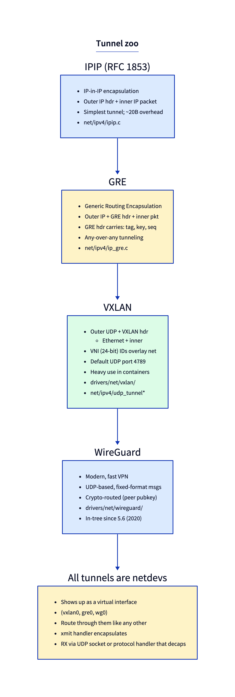
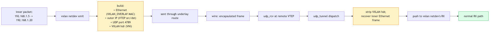
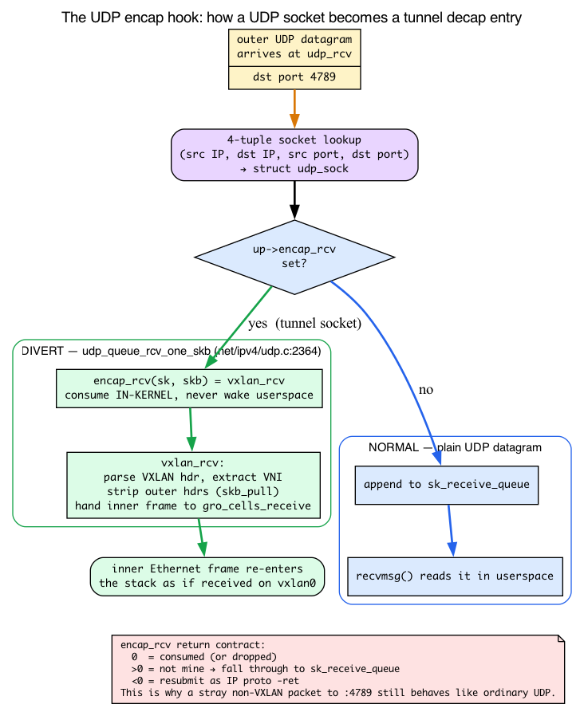
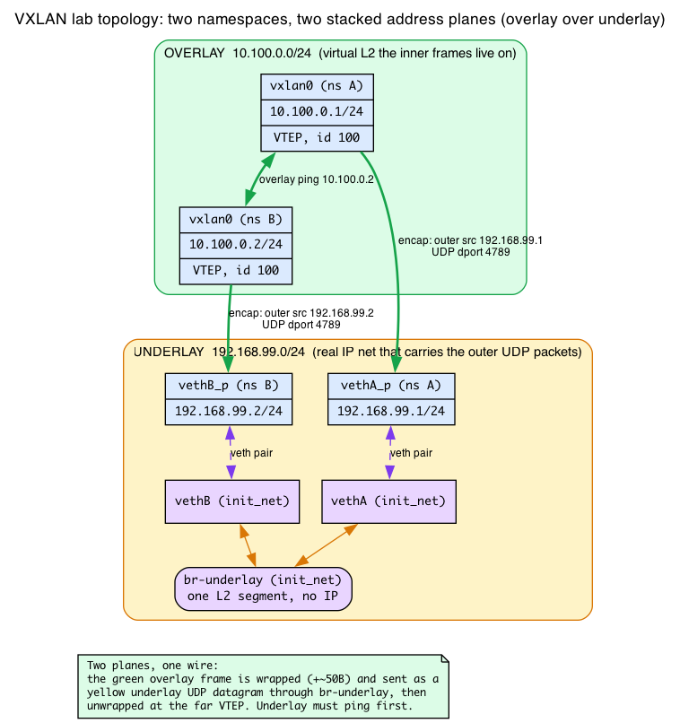
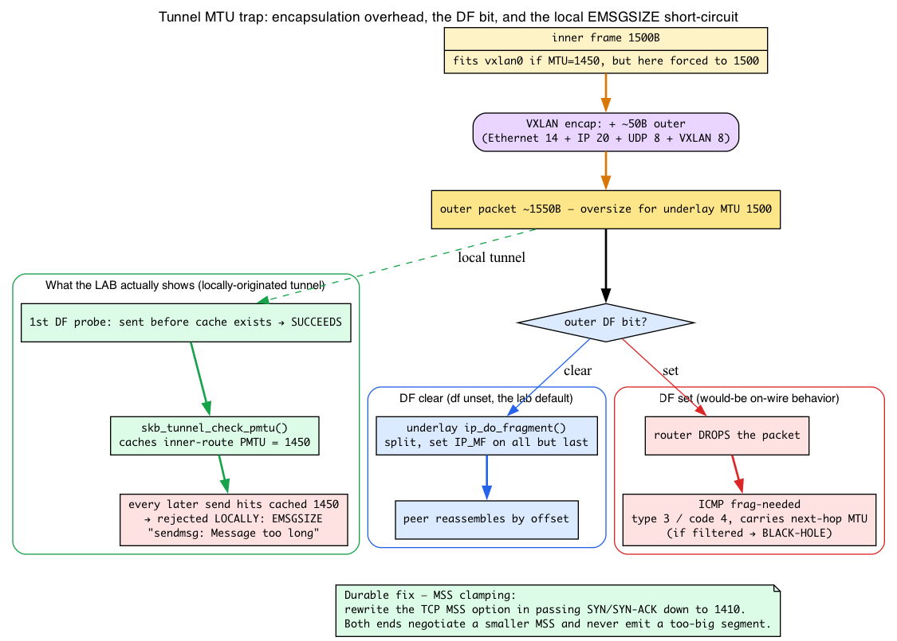

# Day 12 — Tunnels: VXLAN, GRE, IPIP, WireGuard

> **Today's mission:** build a VXLAN tunnel between two namespaces, and understand the encapsulation/decapsulation cycle that every tunnel implements — including the two demultiplexing tables a tunneled packet passes through and the MTU machinery that makes tunnels misbehave. End of Phase 2. Total time: ~110 minutes.

## What "tunneling" is, in one paragraph

A tunnel takes a packet (the *inner* packet) and wraps it in another header (the *outer* packet) so it can travel through a network that wouldn't otherwise carry it. The outer packet is delivered to a remote endpoint that strips the outer header and emits the inner packet on the other side. Different tunnel types differ in *what they wrap with* (IP, UDP, ESP) and *what extra metadata they carry* (VNI, GRE keys, sequence numbers).

In Linux, every tunnel is a **netdev** (`vxlan0`, `gre0`, `wg0`). You configure routes and bind sockets through it like any other interface. The tunneling magic lives in the netdev's `ndo_start_xmit` (encapsulation — Day 3 taught what `ndo_start_xmit` is) and a paired RX hook (decapsulation).

### Two networks: overlay and underlay

Before anything else, fix one pair of words that the rest of the chapter leans on constantly. A tunnel connects two distinct networks:

- The **underlay** is the *real* IP network that physically carries the outer packets between the tunnel endpoints. It routes the wrapped packets like any ordinary IP traffic.
- The **overlay** is the *virtual* L2/L3 network that the inner packets live on. It exists only because the endpoints agree to encapsulate and decapsulate.

A tunnel is exactly a mapping from overlay frames to underlay packets and back. In today's lab, the `br-underlay` bridge and the `192.168.99.0/24` addresses ARE the underlay; the `10.100.0.0/24` network on `vxlan0` IS the overlay. Keep the pair straight and every "outer" vs "inner" sentence below reads cleanly.

## Background: how a packet *reaches* the tunnel code — IP protocol demux

Day 2 traced a received packet from the wire up to `ip_rcv`, and showed the **L2 → L3 demux**: the core walks `ptype_base[]`, a table keyed by the 16-bit EtherType, to pick `ip_rcv` for `ETH_P_IP`. But that's where Day 2 stopped. A tunnel decap handler — `ipip_rcv`, `gre_rcv`, `vxlan_rcv` — sits *one layer deeper*. Something has to decide, once a packet is destined for this host, "this is a GRE packet, send it to the GRE code." That mechanism is the **L3 protocol demux**, and it is the exact analogue of Day 2's EtherType table, one layer up.

Here's the intuition. The IPv4 header has an 8-bit **Protocol** field that names what's inside: TCP=6, UDP=17, IPIP=4, IPv6-in-IPv4=41, GRE=47. After `ip_rcv` decides a packet is for the local host, it needs to hand the packet to whichever subsystem owns that protocol number. Day 2's L2 demux used a hash table keyed by EtherType; the L3 demux uses a **flat array indexed directly by the protocol byte**.

Follow the call chain. `ip_local_deliver` runs the local-delivery NF hook, then `ip_local_deliver_finish` (`net/ipv4/ip_input.c:229`) pulls the protocol byte straight out of the header and dispatches:

```c
/* net/ipv4/ip_input.c:241 */
ip_protocol_deliver_rcu(net, skb, ip_hdr(skb)->protocol);
```

Inside `ip_protocol_deliver_rcu` (`net/ipv4/ip_input.c:189`) the dispatch is a single array index plus an indirect call:

```c
ipprot = rcu_dereference(inet_protos[protocol]);          /* ip_input.c:197 */
...
ret = INDIRECT_CALL_2(ipprot->handler, tcp_v4_rcv, udp_rcv, skb);
```

`inet_protos[]` is the L3 mirror of `ptype_base[]`:

```c
/* net/ipv4/protocol.c:27 */
struct net_protocol __rcu *inet_protos[MAX_INET_PROTOS] __read_mostly;
```

`MAX_INET_PROTOS` is 256 — one slot for every possible value of the 8-bit field. Each slot holds a `struct net_protocol` whose `handler` is the receive entry (`include/net/protocol.h:37`):

```c
struct net_protocol {
    int (*handler)(struct sk_buff *skb);
    ...
};
```

A subsystem "plugs in" by calling `inet_add_protocol(&proto, N)` at init. The installer is just a compare-and-swap into the slot (`net/ipv4/protocol.c:32`):

```c
int inet_add_protocol(const struct net_protocol *prot, unsigned char protocol)
{
    return !cmpxchg(&inet_protos[protocol], NULL, prot) ? 0 : -1;
}
```

So slot-ownership in `inet_protos[]` is literal — but watch *who actually owns the slot*, because it isn't always the driver you'd guess:

- **GRE "is registered as proto=47"** and genuinely owns its slot directly: `gre_demux.c` installs a single handler at slot 47 (`net/ipv4/gre_demux.c:199`):

  ```c
  static const struct net_protocol net_gre_protocol = {
      .handler     = gre_rcv,
      .err_handler = gre_err,
  };
  ...
  inet_add_protocol(&net_gre_protocol, IPPROTO_GRE);   /* gre_demux.c:208 */
  ```

  That one `gre_rcv` then *sub-dispatches by GRE-header version* (v0 standard GRE, v1 PPTP). "Dispatches by GRE-header version" means: the protocol table got you to GRE; GRE's own header tells it which GRE variant you are.

- **IPIP "is proto=4"** in the sense that a proto-4 packet *ends up* at `ipip_rcv` — but slot 4 is **not** owned by `ipip.c`. `inet_protos[IPPROTO_IPIP=4]` is registered by `net/ipv4/tunnel4.c` via `inet_add_protocol(&tunnel4_protocol, IPPROTO_IPIP)` (`tunnel4.c:241`), whose handler is `tunnel4_rcv` (`tunnel4.c:218`, body at `:95`). `tunnel4_rcv` then walks a second-level list of `struct xfrm_tunnel` handlers, and `ipip.c` joins that list with `xfrm4_tunnel_register(&ipip_handler, AF_INET)` (`ipip.c:654`). So the real chain is `inet_protos[4] = tunnel4_rcv → tunnel4_handlers list → ipip_rcv`. There is an intermediate dispatcher — structurally the *same* shape as GRE's version branch, one layer below the protocol table.
- **6in4 "is proto=41"** the same way: `inet_protos[41]` is `tunnel64_protocol`/`tunnel64_rcv` (`tunnel4.c:244`), and `sit.c`'s `ipip6_rcv` hooks the `tunnel64_handlers` list via `xfrm4_tunnel_register(..., AF_INET6)`. Again a shared demux, not a direct slot grab.

**The lesson to keep:** owning a slot in `inet_protos[]` is literal, but only GRE here grabs its slot directly; IPIP and 6in4 reach their handlers through the shared `tunnel4`/`tunnel64` demux, which adds an intermediate dispatch step just like GRE's version branch. Don't assume `grep ipip_rcv` will turn up an `inet_add_protocol` call — it won't.

**The key organizing fact of this whole chapter:** IPIP and GRE are reached through `inet_protos[]` — they have their own IP-protocol number and branch *at (or just below) the IP-protocol table*. UDP-based tunnels (VXLAN, GENEVE, FoU/GUE) do **not** get a protocol slot at all — they ride inside UDP (proto 17), reach `udp_rcv` like any UDP packet, and are demuxed a *second* time, one layer deeper, at the UDP socket. That second demux is the next background section. Hold the two-table picture: IPIP/GRE branch at the protocol array (possibly with a small second hop to the exact handler); VXLAN/GENEVE branch at the UDP encap hook.

![L3 protocol demux: inet_protos[] indexed by the IPv4 Protocol byte](diagrams/day12_ip_proto_demux.png)

## The tunnel zoo

The five tunnels below differ only in what they wrap with and what metadata they carry — the diagram lines them up side by side so you can see the family resemblance before the prose enumerates each one.



### IPIP — IP-in-IP (RFC 2003)

The simplest tunnel: outer IPv4 header + inner IP packet. 20 bytes overhead. No extra metadata.

- **What:** prepends an outer IPv4 header with `proto=4` and carries an inner IP packet. (`net/ipv4/ipip.c` also carries MPLS-in-IPv4 the same way.) IPv6-in-IPv4 — `proto=41`, "6in4" — is a *sibling* encapsulation handled by the separate `sit` driver in `net/ipv6/sit.c`, not by `ipip.c`.
- **Why:** route IP packets across a network that can't see them directly (e.g., a private subnet across the public Internet).
- **When:** rarely chosen directly today. GRE or VXLAN usually wins.
- **Gotcha:** no peer authentication — anyone can spoof an IPIP packet. Combine with IPsec (transport mode) for security, or filter by source IP.
- **Where:** `net/ipv4/ipip.c`. RX entry `ipip_rcv` (line 266) → `ipip_tunnel_rcv` (line 215). TX `ipip_tunnel_xmit` (line 282).

### GRE — Generic Routing Encapsulation (RFC 2784)

Outer IP + 4-byte GRE header + inner packet. The GRE header is variable: optional 4-byte *key* (tag for tenant separation), 4-byte *sequence number*, 4-byte *checksum*. Carries any L3 protocol (IPv4, IPv6, MPLS, even Ethernet via NVGRE).

- **What:** generic L3-over-L3 tunneling with optional metadata (key, sequence).
- **Why:** carry any-protocol-over-any-protocol with optional flow tagging. Originally for Cisco router interconnect; today common in MPLS-over-IP, ERSPAN port mirroring, and some VPN setups.
- **When:** when you need lightweight tunneling with a tag (32-bit GRE key) and want point-to-point or point-to-multipoint. ERSPAN (Cisco port mirroring) builds on GRE.
- **Gotcha:** GRE keys aren't authentication — they're separation. Same caveats as IPIP for security; pair with IPsec for confidentiality.
- **Where:** `net/ipv4/ip_gre.c`. RX `gre_rcv` (line 440) → `__ipgre_rcv` (line 366). TX `ipgre_xmit` (line 652). ERSPAN variant has its own paths (line 267, 704).

### VXLAN — Virtual eXtensible LAN (RFC 7348)

The standard for datacenter overlays. Outer Ethernet + outer IP + outer UDP (port 4789) + 8-byte VXLAN header + inner Ethernet frame.

- **What:** Ethernet-in-UDP. The 24-bit VNI ("VXLAN Network Identifier") in the VXLAN header identifies the overlay — 16 million possible overlays per IP underlay.
- **Why:** scale beyond 4096 VLANs (the 802.1Q limit). Lets a single physical IP network carry many isolated L2 networks. Each VNI is its own broadcast domain.
- **When:** Kubernetes pod networking (Flannel, Calico in some modes, Cilium), datacenter SDN, multi-tenant cloud platforms. The dominant overlay today.
- **Gotcha:** **MTU.** Outer headers cost ~50 bytes. If the underlay MTU is 1500, the tunnel netdev should be MTU 1450. Otherwise inner 1500-byte packets won't fit; either path-MTU discovery saves you (if ICMP works) or you get black-holed connections. Solutions: (1) set tunnel MTU correctly; (2) **MSS-clamp TCP** via nftables (`tcp option maxseg size set 1410`) or iptables (`-j TCPMSS --set-mss 1410`) — rewrite the *Maximum Segment Size* (MSS) option in each TCP SYN so both ends agree to send segments small enough to fit after the ~50B tunnel overhead (we cover TCP MSS properly in Phase 3); (3) jumbo-frame underlay. The fragmentation section below makes this mechanism concrete. (Second deployment trap: 4789 is the IANA-assigned port, but the Linux module's *legacy default* is 8472 for backward compatibility — always set `dstport` explicitly, as the labs do.)
- **Where:** `drivers/net/vxlan/vxlan_core.c`. RX `vxlan_rcv` (line 1643) — registered as a UDP encap handler. TX `vxlan_xmit` (line 2722).

### GENEVE — successor to VXLAN

Same Ethernet-in-UDP idea, but think VXLAN with room to bolt extra typed fields onto the header: extensible TLV options. Designed to subsume VXLAN, NVGRE, and STT into one protocol with room to grow. UDP port 6081. Heavier in the option-parsing path, but production-deployed (some Kubernetes deployments, OVN). Like VXLAN, it has no `inet_protos[]` slot — it rides UDP and registers an encap handler. Code: `drivers/net/geneve.c`.

### WireGuard — modern VPN (in-tree since 5.6)

Outer UDP + WireGuard's own framing (handshake messages or transport messages with ChaCha20-Poly1305). It is **crypto-routed**: the kernel decides where a packet goes by which key signed it, not by a configured tunnel endpoint — peers are identified by Curve25519 public keys, not by IP.

- **What:** authenticated, encrypted L3 VPN over UDP.
- **Why:** the only modern in-kernel VPN with serious cryptographic and code review. Replaces OpenVPN (userspace, slow), IPsec (complex), and other options for most use cases.
- **When:** point-to-point or point-to-multipoint VPN. Roaming clients (mobile devices). Anywhere you'd reach for OpenVPN.
- **Gotcha:** **`AllowedIPs`** is both a routing rule *and* a source-address filter. A peer can only send packets *from* IPs in its `AllowedIPs`; a peer can only *receive* packets *to* IPs in its `AllowedIPs`. Misconfigure and you get silent drops with no diagnostic.
- **Where:** `drivers/net/wireguard/`. RX in `receive.c`, TX in `send.c`.

## VXLAN in detail (the canonical case)

A frame on the wire — 50 bytes of overhead total:

```
[outer Ethernet 14] [outer IP 20] [outer UDP 8] [VXLAN hdr 8] [inner Ethernet ...]
```

VXLAN header layout: Flags(1B) | Reserved(3B) | VNI(3B) | Reserved(1B). The Flags byte's "I" bit must be set; the VNI is 24 bits packed into the next three bytes. This matches the in-kernel struct exactly (`include/net/vxlan.h:25`):

```c
struct vxlanhdr {
    __be32 vx_flags;   /* the "I" bit is VXLAN_HF_VNI = cpu_to_be32(BIT(27)) */
    __be32 vx_vni;     /* 24-bit VNI in the high 3 bytes */
};
```



### Background: VTEP and the VXLAN forwarding database

One term used a dozen times below needs a one-line definition: a **VTEP** ("VXLAN Tunnel End Point") is the entity that does encap/decap — concretely, a `vxlan` netdev. Its *underlay* IP is the address that outer packets are sent to. A **remote VTEP** is the peer's underlay IP.

When a VXLAN netdev transmits an inner frame, it must answer: *which remote VTEP holds the destination MAC?* It answers with a **forwarding database (FDB)** — and you already know how an FDB works from Day 11. Recall from Day 11: the bridge FDB is a learning hash keyed on `(vlan, MAC)`, with the same aging and flood-on-miss behavior. **Do not re-learn the hashing or learning machinery** — it's identical here (the per-VXLAN FDB is the same kind of hash, `FDB_HASH_BITS = 8`, `include/net/vxlan.h:40`).

The one VXLAN twist worth stating: the Day 11 bridge FDB maps an inner MAC → a local egress *port*; the VXLAN FDB maps an inner MAC → a remote *underlay IP* (the VTEP to encapsulate toward), stored as `rdst->remote_ip` (`drivers/net/vxlan/vxlan_core.c:188`). Same data-structure role, different value. The TX-path lookup is `vxlan_find_mac_tx` (`vxlan_core.c:395`). On a miss, VXLAN floods exactly like the Day 11 bridge — but "flood" here means sending the *encapsulated* frame to the configured remote unicast IP (or a multicast underlay group), not to local ports. That's why the lab configures `remote 192.168.99.2`: it's the flood target for unknown unicast.

### Encap path

When a packet hits a VXLAN netdev's TX:

1. **Resolve the destination VTEP** — for unicast inner MAC, the bridge-style FDB (the forwarding database from the bridge chapter, Day 11; recapped above) tells which remote VTEP IP holds that MAC. For unknown unicast/multicast, send to the configured multicast underlay group (commonly `239.1.1.1` in examples) or to the configured remote unicast IP. *Because our lab sets a static `remote=`, it uses the simplest unicast form — no multicast group and no FDB flooding are exercised; the FDB/multicast path matters when one VTEP talks to many remotes.*
2. **Build outer headers** — Ethernet, IP, UDP, VXLAN. Source UDP port is hashed from the inner flow (gives ECMP-like — Equal-Cost Multi-Path, spreading flows across parallel underlay links — spread on the underlay).
3. **`udp_tunnel_xmit_skb`** — the generic UDP-tunnel send helper at `net/ipv4/udp_tunnel_core.c:174`. Routes the outer packet through the underlay's normal IP stack. All UDP-based tunnels (VXLAN, GENEVE, FoU, GUE) share it — it is the TX mirror of the encap hook you're about to meet.

### Background: the UDP encapsulation hook — how a UDP socket becomes a decap entry

The decap path below says the UDP socket at port 4789 is "special." Here's what *special* means concretely — and this is the second demux table the chapter promised.

First, a one-line forward-bridge to a path you haven't fully met yet (Day 14 covers normal UDP receive in full): an ordinary UDP datagram is matched to a socket by its `(src IP, dst IP, src port, dst port)` 4-tuple, and the skb is appended to that socket's **`sk_receive_queue`** for a `recvmsg()` call to read later. A tunnel needs the *opposite* of that: consume the datagram *inside the kernel* and re-inject the inner packet, never waking userspace.

A `struct udp_sock` carries an optional function pointer for exactly this (`include/linux/udp.h:79`):

```c
int (*encap_rcv)(struct sock *sk, struct sk_buff *skb);
```

When `encap_rcv` is set, the UDP receive path diverts the skb to it **before** the skb ever reaches `sk_receive_queue`. That single pointer is what "special socket" means. The divert lives in `udp_queue_rcv_one_skb` (`net/ipv4/udp.c:2349`), guarded so the check is free when no tunnels exist:

```c
if (static_branch_unlikely(&udp_encap_needed_key) &&
    READ_ONCE(up->encap_type)) {              /* net/ipv4/udp.c:2364 */
    ...
    encap_rcv = READ_ONCE(up->encap_rcv);     /* :2380 */
    if (encap_rcv) {
        int ret = encap_rcv(sk, skb);
        if (ret <= 0) { ...; return -ret; }   /* consumed */
    }
    /* FALLTHROUGH -- it's a normal UDP packet */
}
```

The installer is `setup_udp_tunnel_sock` (`net/ipv4/udp_tunnel_core.c:71`). It copies the config's handler into the socket and flips on the static key so the divert check above does real work:

```c
udp_sk(sk)->encap_type = cfg->encap_type;
udp_sk(sk)->encap_rcv  = cfg->encap_rcv;     /* udp_tunnel_core.c:85 */
...
udp_tunnel_encap_enable(sk);                 /* arms udp_encap_needed_key */
```

VXLAN passes `vxlan_rcv` as `cfg->encap_rcv` (`drivers/net/vxlan/vxlan_core.c:3612`). So the **two-stage demux completes**:

```
IP proto 17 → inet_protos[17] → udp_rcv → (encap_rcv set?) → vxlan_rcv
```

— the first stage at `inet_protos[]` (the section above), the second at the UDP socket. The `encap_rcv` **contract** is the three-way return value seen in the code: `0` = consumed (or dropped by the handler), `>0` = "not mine, resubmit as a normal UDP datagram" (it falls through to `sk_receive_queue`), `<0` = resubmit as IP proto `-ret`. VXLAN itself only ever uses the `0` path: `vxlan_rcv` returns `0` whether it successfully decaps and re-injects a frame *or* hits its `drop:` label (malformed header, missing VNI flag, unknown VNI, reserved bits set) — so a stray UDP packet to port 4789 that isn't valid VXLAN is **dropped**, not handed back to the socket queue. The `>0` "resubmit as ordinary UDP" path is real but used by *other* encap handlers (e.g. ESP-in-UDP), not VXLAN.



### Decap path

A frame arrives at the underlay, traverses `ip_rcv` (the RX path from Days 2–3), and lands at UDP. The UDP socket at port 4789 is special — it's a "tunnel socket" registered by `setup_udp_tunnel_sock` (`net/ipv4/udp_tunnel_core.c:71`). Instead of queueing on a normal `sk_receive_queue`, the kernel calls the registered encap handler — for VXLAN, **`vxlan_rcv`** at `drivers/net/vxlan/vxlan_core.c:1643` (the mechanism is the `encap_rcv` divert you just saw).

Inside `vxlan_rcv`:
1. Parse the 8-byte VXLAN header, extract the 24-bit VNI.
2. Find the right VXLAN netdev for that VNI in this netns via `vxlan_vs_find_vni` (`vxlan_core.c:1679`).
3. Strip the outer headers with `skb_pull` (recall `skb_pull` from Day 1 — it advances `data` past a header you've finished with).
4. Hand the inner Ethernet frame to the inner stack via `gro_cells_receive` (`vxlan_core.c:1799`).

That last step deserves one line. The inner frame must re-enter the stack *as if it were freshly received on `vxlan0`*. `gro_cells` is a thin per-netdev GRO+RPS wrapper that does exactly that re-injection — it queues to a percpu backlog and runs GRO on the inner flow. Recall GRO and the RX re-entry from Day 2 (`napi_gro_receive` / `netif_receive_skb`); `gro_cells_receive` (`net/core/gro_cells.c:14`) is just "Day 2's RX entry, invoked a second time for the inner packet." No new GRO theory needed — the inner frame now climbs the stack and looks like a normal frame arriving at `vxlan0`.

> **There are no Dumb Questions**
>
> **Q: Why does VXLAN ride UDP instead of getting its own IP protocol number like GRE?**
> A: Two practical wins. NAT and firewall traversal — middleboxes understand UDP and happily forward it, whereas a novel IP protocol number is often dropped. And **ECMP**: the source UDP port is set to the inner-flow hash, so underlay routers spreading by 5-tuple fan parallel flows across links automatically. GRE, with a fixed proto-47 header and no port, gets none of that for free.
>
> **Q: My lab uses `remote=` — where's the multicast group I keep reading about?**
> A: Nowhere, on purpose. A static `remote=` is the simplest point-to-point form: every unknown-unicast "flood" just goes to that one IP. The multicast underlay group (e.g. `239.1.1.1`) and real FDB learning only come into play when one VTEP serves many remotes and must discover which one holds a given MAC.

## Set up a VXLAN tunnel (lab)

Two namespaces (network namespaces, Day 5), both with VTEPs talking through the host (`init_net`, also Day 5) acting as the underlay:



```bash
sudo ip netns add A
sudo ip netns add B

# Underlay: bridge both host-side veths into one L2 segment (init_net is the underlay).
# Without the bridge, vethA and vethB are two separate L2 segments and ARP for the
# underlay peer never resolves — the tunnel can't carry a single packet.
sudo ip link add vethA type veth peer name vethA_p
sudo ip link add vethB type veth peer name vethB_p
sudo ip link set vethA_p netns A
sudo ip link set vethB_p netns B
sudo ip link add br-underlay type bridge
sudo ip link set vethA master br-underlay
sudo ip link set vethB master br-underlay
sudo ip link set vethA up
sudo ip link set vethB up
sudo ip link set br-underlay up
sudo ip netns exec A ip addr add 192.168.99.1/24 dev vethA_p
sudo ip netns exec B ip addr add 192.168.99.2/24 dev vethB_p
sudo ip netns exec A ip link set vethA_p up
sudo ip netns exec B ip link set vethB_p up

# The VTEP underlay addresses live only on the namespace ends; the bridge needs no IP.
# Confirm the underlay works *before* building the tunnel on top of it:
sudo ip netns exec A ping -c1 192.168.99.2   # underlay must work first

# VXLAN endpoints
sudo ip netns exec A ip link add vxlan0 type vxlan \
    id 100 local 192.168.99.1 remote 192.168.99.2 dstport 4789
sudo ip netns exec A ip addr add 10.100.0.1/24 dev vxlan0
sudo ip netns exec A ip link set vxlan0 up

sudo ip netns exec B ip link add vxlan0 type vxlan \
    id 100 local 192.168.99.2 remote 192.168.99.1 dstport 4789
sudo ip netns exec B ip addr add 10.100.0.2/24 dev vxlan0
sudo ip netns exec B ip link set vxlan0 up

# Test
sudo ip netns exec A ping -c 2 10.100.0.2
```

Notice the two networks at work: `192.168.99.0/24` is the **underlay** (the bridged veths), `10.100.0.0/24` is the **overlay** (on `vxlan0`). The `remote 192.168.99.2` is the remote VTEP — the flood target for unknown-unicast inner MACs.

Then watch the encapsulated traffic. Start the capture *before* generating
traffic — if you attach tcpdump after the pings have already exited you get an
empty capture. Bound the capture with `timeout` so it doesn't run forever:
```bash
sudo timeout 8 tcpdump -i br-underlay -nn 'udp port 4789' &
sleep 1
sudo ip netns exec A ping -c 5 10.100.0.2
wait
```

Each ICMP echo/reply appears as a UDP datagram to port 4789 between the two
underlay VTEPs (192.168.99.1 and 192.168.99.2) — the VXLAN-encapsulated ping.
tcpdump decodes the encapsulation and the source UDP port is the inner-flow hash,
so it varies:
```
IP 192.168.99.1.<hashed> > 192.168.99.2.4789: VXLAN, flags [I] (0x08), vni 100
IP 192.168.99.2.<hashed> > 192.168.99.1.4789: VXLAN, flags [I] (0x08), vni 100
```

## Background: fragmentation, the DF bit, and MSS clamping

Today's experiment and the Check question both turn on what happens when an encapsulated packet is too big for the underlay. That hinges on IP-layer machinery Day 4 only partly covered, so let's build it before breaking it.

**Refresher (Day 4 — one line, do not re-derive):** MTU is the largest L2 payload a link carries (1500 on Ethernet); MSS = MTU − IP − TCP; Path-MTU Discovery (PMTUD) shrinks a connection's MSS when the path can't carry full-size frames. All taught Day 4.

**NEW — the DF bit.** The IPv4 header's 16-bit `frag_off` field packs three flag bits plus a 13-bit fragment offset (`include/net/ip.h`):

```c
#define IP_DF     0x4000   /* ip.h:143  "Don't Fragment" */
#define IP_MF     0x2000   /* ip.h:144  "More Fragments" */
#define IP_OFFSET 0x1FFF   /* ip.h:145  the 13-bit offset */
```

With **DF clear**, a router that meets an oversize packet *splits* it with `ip_do_fragment` (`net/ipv4/ip_output.c:761`) and sets `IP_MF` on all but the last fragment; the receiver reassembles by offset. With **DF set**, the router must *not* fragment — it drops the packet and sends an error back instead.

**NEW — what "fragmentation needed" actually is.** That error is ICMP **type 3** (Destination Unreachable, `ICMP_DEST_UNREACH = 3`, `include/uapi/linux/icmp.h:27`) **code 4** (`ICMP_FRAG_NEEDED = 4`, `icmp.h:47`), and it carries the next-hop MTU. The source receives it and caches a lower PMTU for that destination, so future packets shrink to fit. **But** if a firewall drops these ICMP messages — extremely common — the source never learns, keeps sending oversize DF packets, and the connection **black-holes**: small packets work, big ones vanish. That is the precise mechanism behind today's Check question.

**NEW — the tunnel twist (why the lab shows `EMSGSIZE`, not on-wire ICMP).** For a *locally-originated* tunnel the kernel short-circuits PMTUD. `skb_tunnel_check_pmtu` (`net/ipv4/ip_tunnel_core.c:437`) computes the room left after the outer headers and, on an oversize inner frame, caches that lower PMTU on the *inner* route:

```c
u32 mtu = dst_mtu(encap_dst) - headroom;     /* ip_tunnel_core.c:440 */
...
skb_dst_update_pmtu_no_confirm(skb, mtu);    /* cache it on the inner dst */
```

`vxlan_xmit_one` calls this on the TX path (`drivers/net/vxlan/vxlan_core.c:2514` and `:2586`). The consequence: the *first* DF probe predates the cached PMTU, so it succeeds; every *later* DF send hits the cached lower PMTU and is rejected **locally** with `EMSGSIZE` ("sendmsg: Message too long") before any packet leaves the host. That's why the lab sees one success then errors, not a wire capture of ICMP.

**NEW — MSS clamping as the durable fix.** Because PMTUD-via-ICMP is unreliable, the robust fix rewrites the TCP **MSS option** in passing SYN/SYN-ACK packets down to a value that fits the tunnel (e.g. 1410). Both ends then negotiate a smaller MSS and *never* emit a segment too big to encapsulate. The `nft` rule in the Check answer does exactly this SYN-rewrite — it isn't magic, it's editing the MSS option as the handshake flies by.



## Today's experiment — break the MTU

```bash
# Default: vxlan0 MTU = 1500. Because this VXLAN dev is NOT bound to a lower dev
# (no `dev PHYS_DEV` on the `ip link add`), the kernel does NOT auto-subtract the
# ~50B overhead — the netdev keeps the 1500 default. But the effective path budget
# is still only ~1450, which is the bug we exploit below.
sudo ip netns exec A ip link show vxlan0

# The 1500 default is already too large for the 1450-effective path, so just send a
# 1500-byte DF packet that won't fit:
sudo ip netns exec A ping -M do -s 1472 -c 2 10.100.0.2   # don't fragment, 1500 total
# The first probe slips through; every later DF send is rejected locally — see below.

# The real fix: set a correct, fitting MTU that accounts for the overhead.
sudo ip netns exec A ip link set vxlan0 mtu 1450
```

What you actually see — and *why* it is not the on-wire ICMP you might expect:

```
PING 10.100.0.2 (10.100.0.2) 1472(1500) bytes of data.
1480 bytes from 10.100.0.2: icmp_seq=1 ttl=64 time=... ms
ping: sendmsg: Message too long

--- 10.100.0.2 ping statistics ---
2 packets transmitted, 1 received, +1 errors, 50% packet loss
```

This is the local `EMSGSIZE` short-circuit from the fragmentation Background above:
`skb_tunnel_check_pmtu` caches a lowered inner-route PMTU the first time it sees an
oversize frame, so the very first DF probe (sent before that cache exists) succeeds
at `icmp_seq=1`, and every later DF send hits the cached 1450 PMTU and is rejected
*locally* with `EMSGSIZE` — `ping: sendmsg: Message too long`. It is **not** an
on-wire ICMP "fragmentation needed" and **not** a silent drop. (Append `df set` to
the `ip link add ... type vxlan` lines to make it deterministic: then *every* packet
fails with `Message too long`, 100% loss, because the outer header now refuses to
fragment.)

This is the classic VXLAN deployment failure. Production datacenters either use jumbo frames on the underlay (MTU 9000) or rigorously MSS-clamp TCP.

## Cleanup

Tear down everything the lab created. Deleting the two namespaces removes their
veth ends and `vxlan0` automatically — a veth pair is deleted symmetrically, so
the init_net peers `vethA`/`vethB` disappear with their in-namespace ends. The
bridge lives in init_net and is *not* removed by deleting the namespaces, so
delete it explicitly:

```bash
sudo ip netns del A
sudo ip netns del B
sudo ip link del br-underlay
```

## What to read in the kernel

- **`drivers/net/vxlan/vxlan_core.c:1643`** — `vxlan_rcv`. The decap entry. Read end to end (~300 lines including option handling). Trace how the VNI is extracted, how the right VXLAN netdev is looked up via `vxlan_vs_find_vni`, and how the inner Ethernet frame is handed to `gro_cells_receive` for the inner stack.

- **`drivers/net/vxlan/vxlan_core.c:2722`** — `vxlan_xmit`. The encap entry. Notice the FDB lookup (per-VXLAN bridge-style FDB), the outer-header construction, and the call to `vxlan_xmit_one` which eventually invokes `udp_tunnel_xmit_skb`.

- **`net/ipv4/ip_input.c:189`** — `ip_protocol_deliver_rcu`. The L3 protocol demux: `inet_protos[protocol]->handler`. See how `ip_local_deliver_finish` (line 229) feeds it the IPv4 Protocol byte.

- **`net/ipv4/protocol.c:32`** — `inet_add_protocol`. How GRE (`gre_demux.c:208`) claims slot 47 in `inet_protos[]` directly. IPIP and 6in4 do *not* call this themselves: slots 4 and 41 are owned by `tunnel4.c`'s `tunnel4_rcv`/`tunnel64_rcv` (`tunnel4.c:241`, `:244`), which dispatch to `ipip_rcv`/`ipip6_rcv` via the second-level `xfrm_tunnel` list (`ipip.c:654`).

- **`net/ipv4/udp.c:2349`** — `udp_queue_rcv_one_skb`. The UDP encap divert (`encap_rcv` at line 2380) — the second demux that sends a VXLAN packet to `vxlan_rcv` instead of a socket queue.

- **`net/ipv4/udp_tunnel_core.c:71`** — `setup_udp_tunnel_sock`. How a tunnel registers itself as a UDP encap handler. Short function (~30 lines). Read the comments for what each `udp_tunnel_sock_cfg` field does.

- **`net/ipv4/udp_tunnel_core.c:174`** — `udp_tunnel_xmit_skb`. The generic outer-side TX. All UDP-based tunnels (VXLAN, GENEVE, FoU, GUE) use it. Notice the GSO (Generic Segmentation Offload, Day 4) interaction — the tunnel sets up gso_type so segmentation does the right thing on the outer packet.

- **`net/ipv4/ip_tunnel_core.c:437`** — `skb_tunnel_check_pmtu`. The tunnel PMTU check that caches a lower inner-route PMTU and produces the lab's `EMSGSIZE`.

- **`net/ipv4/ip_tunnel.c`** — generic IP-tunnel infrastructure used by IPIP and GRE. Search `ip_tunnel_xmit` for the common encap path. Useful comparison point with `vxlan_xmit`.

- **`net/ipv4/gre_demux.c:146`** — `gre_rcv`. *This* is the proto-47 entry, registered via `inet_add_protocol(&net_gre_protocol, IPPROTO_GRE)` (`gre_demux.c:208`). It reads the GRE-header version byte (`skb->data[1] & 0x7f`) and dispatches `gre_proto[ver]`: v0 (`GREPROTO_CISCO`) → `ip_gre.c`, v1 (`GREPROTO_PPTP`) → `drivers/net/ppp/pptp.c` (`include/net/gre.h`).

- **`net/ipv4/ip_gre.c:440`** — `gre_rcv`. The version-0 handler reached *after* the demux above (registered with `gre_add_protocol(&ipgre_protocol, GREPROTO_CISCO)`). It never sees v1/PPTP; what it dispatches is ERSPAN vs. normal GRE (checks `tpi.proto == ETH_P_ERSPAN`), then `ipgre_rcv` → `__ipgre_rcv`. For keys/sequence/checksum parsing, look at `gre_parse_header`.

- **`net/ipv4/ipip.c:266`** — `ipip_rcv`. The simplest tunnel decap. Read it as a reference; the others add features on top.

- **`drivers/net/wireguard/`** — WireGuard. Read `device.c` for the netdev integration, `receive.c` and `send.c` for the data path.

- **`Documentation/networking/vxlan.rst`** — official guide. Brief.

## Bullet Points

- All tunnels are netdevs; their `ndo_start_xmit` encapsulates, a paired RX hook decapsulates.
- **Two demux tables get a packet to a tunnel handler.** The L3 demux indexes `inet_protos[]` by the IPv4 Protocol byte (the L3 mirror of Day 2's EtherType `ptype_base[]`): proto 47 → `gre_rcv` (which owns its slot directly), proto 4 → `tunnel4_rcv` → `ipip_rcv`, proto 41 → `tunnel64_rcv` → 6in4 (these reach their handler via a shared second-level dispatch). UDP tunnels have **no** slot — they ride proto 17 → `udp_rcv` and branch a second time at the UDP `encap_rcv` hook.
- **`encap_rcv`** is the pointer that makes a UDP socket a tunnel ingress: `setup_udp_tunnel_sock` installs it, `udp_queue_rcv_one_skb` diverts to it before `sk_receive_queue`. Returns 0=consumed, >0=normal UDP, <0=resubmit.
- **Overlay vs underlay:** the underlay is the real IP network carrying outer packets; the overlay is the virtual network the inner packets live on. After decap, `gro_cells_receive` re-injects the inner frame (Day 2's RX entry, second time around).
- **VTEP** = the encap/decap endpoint (a `vxlan` netdev); the **VXLAN FDB** maps inner MAC → remote VTEP IP (Day 11's bridge FDB mapped MAC → local port).
- **IPIP**: 20-byte overhead, simplest. Rarely first choice today.
- **GRE**: optional 32-bit key, sequence, checksum. Used in ERSPAN and some MPLS-over-IP setups.
- **VXLAN**: Ethernet-in-UDP, 24-bit VNI, port 4789. The standard for container/cloud overlays.
- **GENEVE**: VXLAN's TLV-extensible successor. UDP 6081.
- **WireGuard**: modern UDP VPN, in-tree since 5.6. Crypto-routed via peer pubkey.
- **MTU is always the trap.** Tunnel netdev MTU = underlay MTU − overhead. The DF bit decides fragment-or-drop; a filtered ICMP frag-needed (type 3/code 4) black-holes the flow. Fix with jumbo frames or MSS-clamping.
- **Inspect with `ip -d link show`** to see tunnel parameters (VNI, remote, port).

## Check question

A VXLAN tunnel is set up between two hosts (underlay MTU 1500). A user complains: short pings work fine, but file transfers stall after a few KB. What's the most likely cause and what's the simplest fix?

<details>
<summary>Click to reveal answer</summary>

**Answer:** **Path-MTU issue.** Short ICMP pings fit in the encapsulated 1500-byte budget. File transfers (TCP) try to use the path's full MSS — TCP negotiated MSS based on the *interface* MTU, but the tunnel adds ~50 bytes of overhead, and the underlay drops oversize packets. With DF set on the segments, a router that can't fit them is supposed to return ICMP "fragmentation needed" (type 3, code 4) so the sender lowers its PMTU — but if that ICMP is being filtered (very common), the sender never learns to reduce MSS, and the connection black-holes. The simplest fix is **MSS clamping**: `nft add rule inet filter forward tcp flags syn / syn,rst tcp option maxseg size set 1410` — the kernel rewrites the SYN's MSS option as packets traverse, forcing both ends to use a smaller MSS that fits. Alternatives: set the tunnel MTU correctly (Linux derives 1450 for VXLAN over 1500 automatically *only* when the VXLAN device is bound to a lower device with `dev PHYS_DEV`; otherwise the netdev keeps the 1500 default and you must set it yourself), enable jumbo frames on the underlay (MTU 9000), or unblock ICMP "frag needed" so PMTUD works naturally.

</details>

---

## End of Phase 2

You can now read the L2/L3 layers of the kernel network stack. Ethernet parsing, VLANs, ARP/NDP, the FIB and routing rules, IPv6 specifics, bridges, tunnels.

Phase 3 (Days 13–19) goes up to L4: sockets, UDP, TCP state machine, congestion control, retransmission, sockopts, epoll/io_uring. Day 13 opens at the socket layer — the `struct sock` behind every connection — and works up to the TCP state machine.
