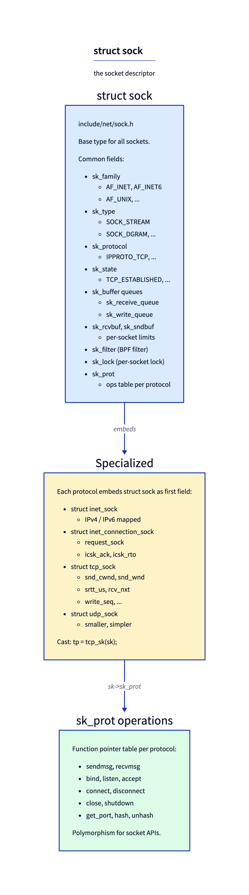
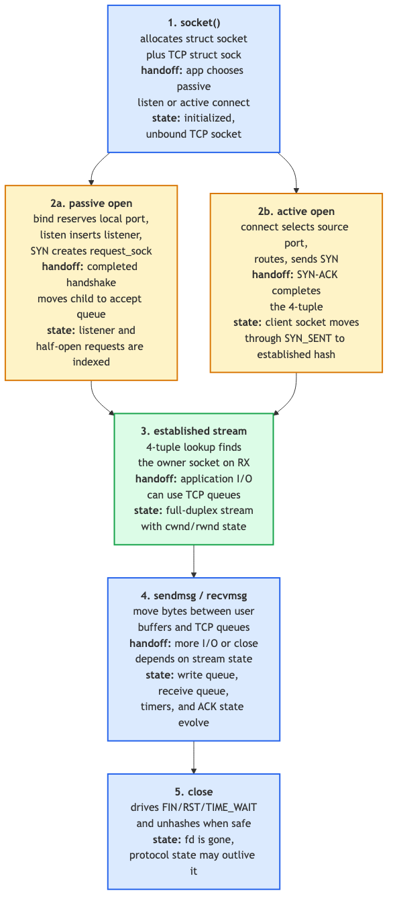

# Day 13 — The socket layer: `struct sock`

> **Today's mission:** understand the kernel side of `socket()`, `bind()`, `listen()`, `connect()`. See how `struct sock` sits underneath every networking syscall. Total time: ~75 minutes.

> **Phase 3 starts here.** Days 13–19 cover L4: sockets, UDP, TCP state machine, congestion control, retransmission, sockopts, epoll/io_uring.

## Two structs you must keep straight: `struct socket` and `struct sock`

The kernel has *two* "socket" structures, with confusingly similar names:

- **`struct socket`** (`include/linux/net.h`) — the BSD-API-level handle. One per file descriptor. Owns the protocol-independent stuff: the file pointer, the type (SOCK_STREAM/SOCK_DGRAM/...), the wait queue, a pointer to the `proto_ops` table.
- **`struct sock`** (`include/net/sock.h:365`) — the *protocol-level* state. Owns receive/send queues, the protocol's send/recv functions, the routing-table reference (`sk_dst`), the socket option storage, etc.

Each `struct socket` has a `struct sock *sk` pointing at its protocol state. They're separate because:
1. The same `struct socket` API works for AF_INET, AF_UNIX, AF_NETLINK, AF_PACKET, etc. — wildly different protocol stacks.
2. Some sockets are kernel-internal and don't have a userspace FD (e.g., the netlink socket the kernel uses for routing notifications).

When kernel code says "the socket" it usually means `struct sock`, not `struct socket`. The userspace API talks about FDs; the kernel networking code talks about `sk` pointers.

## `struct sock`: the polymorphic descriptor



`struct sock` is huge (~700 bytes on x86_64) and most of its fields are protocol-specific shadow state. The trick is **embedding**:

```c
struct sock { /* common base — at offset 0 */ ... };

struct inet_sock { struct sock sk; /* IPv4/IPv6-common stuff */ ... };
struct inet_connection_sock { struct inet_sock icsk_inet; /* + retransmit/RTO */ ... };
struct tcp_sock { struct inet_connection_sock inet_conn; /* + cwnd/snd_wnd/srtt/... */ ... };
struct udp_sock { struct inet_sock inet; /* + udp-specific */ ... };
```

A pointer to a `tcp_sock` is *also* a valid pointer to an `inet_connection_sock`, *also* a valid pointer to an `inet_sock`, *also* a valid `sock`. C's structural inheritance via "first field" embedding. Helper macros:

```c
struct tcp_sock *tp = tcp_sk(sk);     // cast sk to tcp_sock (inline check)
struct udp_sock *up = udp_sk(sk);
struct inet_sock *inet = inet_sk(sk);
```

The polymorphism lives in **`sk->sk_prot`** — a function pointer table per protocol:

```c
struct proto {
    void  (*close)(struct sock *sk, long timeout);
    int   (*connect)(struct sock *sk, struct sockaddr *uaddr, int addr_len);
    int   (*bind)(struct sock *sk, struct sockaddr *uaddr, int addr_len);
    int   (*sendmsg)(struct sock *sk, struct msghdr *msg, size_t len);
    int   (*recvmsg)(struct sock *sk, struct msghdr *msg, size_t len, ...);
    /* ... ~30 more callbacks ... */
};
```

When userspace calls `send(fd, ...)`, the kernel finds `sk` via the FD, then dispatches `sk->sk_prot->sendmsg(sk, msg, len)`. For TCP that's `tcp_sendmsg`; for UDP, `udp_sendmsg`. Same shape, different protocol logic — vtable dispatch in C.

### Key fields you'll see everywhere

```c
sk_family            // AF_INET, AF_INET6, AF_UNIX, AF_NETLINK, ...
sk_type              // SOCK_STREAM, SOCK_DGRAM, SOCK_RAW, ...
sk_protocol          // IPPROTO_TCP, IPPROTO_UDP, ...
sk_state             // TCP_ESTABLISHED, TCP_LISTEN, ... (TCP-specific
                     //   but reused by UDP for connected sockets)
sk_receive_queue     // skb_queue: incoming packets waiting to be read
sk_write_queue       // skb_queue: outgoing skbs not yet ACKed (TCP)
sk_rcvbuf, sk_sndbuf // per-socket buffer limits
sk_filter            // BPF socket filter (sk_filter_attach)
sk_lock              // per-socket lock (lock_sock / release_sock)
sk_prot              // the proto vtable
sk_dst               // refcounted route entry — see Day 8
sk_net               // pointer back to the netns
```

## Lifecycle



Walk through a TCP server's lifecycle, kernel-side:

### `socket(AF_INET, SOCK_STREAM, 0)`

1. Userspace calls the syscall — handled at `net/socket.c:1818` `SYSCALL_DEFINE3(socket, ...)`.
2. **`__sock_create`** (`net/socket.c:1593`) walks `net_families[AF_INET]` to find the protocol family's `create` callback.
3. For AF_INET that's **`inet_create`** (`net/ipv4/af_inet.c:259`). It:
   - Allocates a `struct socket`.
   - Allocates a `struct tcp_sock` (or `udp_sock` etc.) via the protocol's `prot->slab` cache.
   - Calls **`tcp_init_sock`** (`net/ipv4/tcp.c:424`) for TCP-specific initialization — sets up snd_cwnd, smoothed RTT, write queue, accept queue, etc.
   - Returns; the FD points at the socket which points at the sock.

### `bind(fd, ...)`

1. Looks up `struct socket` from FD.
2. Calls `sock->ops->bind` — for AF_INET TCP that's **`inet_bind`** (`net/ipv4/af_inet.c:472`).
3. `inet_bind` calls `sk->sk_prot->bind` if defined, else **`inet_csk_get_port`** (`net/ipv4/inet_connection_sock.c:500`) — reserves the port in the per-netns bind hash table (`tcp_hashinfo.bhash`).
4. The bind table is keyed by `(netns, port)` — that's why two netns can both bind `:80`.

### `listen(fd, backlog)`

Marks the sock as `TCP_LISTEN`. Allocates the **accept queue** (a hash of incomplete handshakes — half-open SYN_RCVD — and a list of completed connections waiting for `accept()`).

### `connect(fd, ...)` — client side

1. Looks up sock.
2. Calls `sk->sk_prot->connect` — for TCP **`tcp_v4_connect`** (`net/ipv4/tcp_ipv4.c:221`).
3. Picks a source port (ephemeral range), inserts into the established hash (`tcp_hashinfo.ehash`) keyed by 4-tuple.
4. Builds and sends SYN. Transitions sock state to `TCP_SYN_SENT`.
5. Returns `EINPROGRESS` (non-blocking) or sleeps until SYN-ACK arrives (blocking).

### `accept(fd, ...)` — server side

1. Pops a completed connection from the accept queue.
2. Allocates a new FD wrapping the new `sock`.
3. Returns the FD.

The original listening socket stays — accept just hands you a *new* socket for the connection.

## The two hash tables: `bhash` and `ehash`

`struct inet_hashinfo` (used by both TCP and UDP) holds two key data structures:

- **`bhash`** — the bind hash. Keyed by port number; each bucket holds a list of bound sockets (multiple if `SO_REUSEPORT`). Lookup on `bind()` and on incoming SYN to find listener.
- **`ehash`** — the established hash. Keyed by the 4-tuple `(saddr, sport, daddr, dport)`. Lookup on every incoming TCP packet to find the existing connection.

Per-netns. The bind hash also holds a parallel `lhash2` that's optimized for SO_REUSEPORT lookups (Day 24).

## Today's experiment

```bash
# Inspect socket state
ss -tan       # TCP all numeric
ss -ti        # TCP with internal info: rtt, cwnd, retrans

# Trace lifecycle of one connection
sudo bpftrace -e '
fentry:tcp_init_sock { printf("init %p\n", args->sk); }
fentry:inet_csk_get_port { printf("get_port port=%d\n", args->snum); }
fentry:tcp_v4_connect { printf("connect %p\n", args->sk); }
fentry:tcp_set_state { printf("set_state %p -> %d\n", args->sk, args->state); }
'

# In another terminal:
nc -l 9999 &
echo hi | nc -q 1 localhost 9999

# Stop tracer (Ctrl-C in the bpftrace shell)
```

You'll see init → get_port (server) → init (client) → connect → set_state through SYN_SENT → ESTABLISHED → CLOSE_WAIT → LAST_ACK → CLOSED.

### See the bind/established hashes

```bash
# Bound listening sockets:
sudo ss -tlnp

# All established TCP, with kernel sock pointer:
sudo ss -tap

# Memory accounting:
ss -tim
```

`ss` reads from `/proc/net/tcp` (and the netlink-based `INET_DIAG`). The numbers come straight from the per-sock state.

## What to read in the kernel

- **`include/net/sock.h:365`** — `struct sock`. Read all fields (~150 lines of struct). Note the comments grouping fields into hot/cold cache lines (`/* RX hot */`, `/* TX hot */`, etc.). This struct is one of the most cache-line-tuned in the kernel; respect the layout.

- **`include/net/inet_sock.h:218`** — `struct inet_sock`. Adds IPv4/IPv6 common fields: addresses, ports, ttl, mc_addr, sk_dst. Quick read.

- **`include/net/inet_connection_sock.h:81`** — `struct inet_connection_sock`. Adds retransmit timer, accept queue, ack delay timer. The "connection-oriented" base for TCP and DCCP.

- **`include/linux/tcp.h:197`** — `struct tcp_sock`. The full TCP state. ~150 fields covering snd_wnd, snd_cwnd, srtt_us, rcv_nxt, write_seq, sack info, RACK, retrans queue. Don't try to memorize; just know it's there and grep when you need a specific field.

- **`net/socket.c:1818`** — `SYSCALL_DEFINE3(socket, ...)`. The userspace entry. ~50 lines. Walk through to see how a syscall becomes a `struct socket`.

- **`net/socket.c:1593`** — `__sock_create`. The protocol-family dispatch. Reads `net_families[family]` and calls the registered create callback.

- **`net/ipv4/af_inet.c:259`** — `inet_create`. AF_INET's create. Allocates the sock from the protocol's slab cache, sets up inet_sk fields, calls protocol-specific init.

- **`net/ipv4/af_inet.c:472`** — `inet_bind`. The bind path. Validates addr_len, checks SO_REUSEADDR/REUSEPORT, dispatches to the protocol's bind. Useful to understand why `bind(0.0.0.0, port)` and `bind(127.0.0.1, port)` behave differently.

- **`net/ipv4/inet_connection_sock.c:500`** — `inet_csk_get_port`. Port reservation. Read this to understand SO_REUSEPORT (Day 24): the function walks bind hash buckets and decides whether collision is allowed based on the `reuse` flag and UID match.

- **`net/ipv4/tcp.c:424`** — `tcp_init_sock`. TCP per-socket init. Sets up cwnd, ssthresh, RTT estimators, write/accept queues. Read this once to see what state a fresh TCP socket starts with.

- **`net/ipv4/tcp_ipv4.c:221`** — `tcp_v4_connect`. The client connect path. Walk through: route lookup, source-port allocation, ehash insertion, SYN build/send.

- **`Documentation/networking/sockets.rst`** — overview of the socket framework. Brief.

## Bullet Points

- `struct socket` is the BSD-level descriptor (one per FD); `struct sock` is the protocol-level state. They're linked via `sock->sk`.
- **Polymorphism via embedding:** `tcp_sock` embeds `inet_connection_sock` embeds `inet_sock` embeds `sock`.
- **`sk->sk_prot`** is a function-pointer table per protocol (`tcp_prot`, `udp_prot`, ...). Userspace syscalls dispatch through it.
- Bind tables (`tcp_hashinfo.bhash`) and established tables (`ehash`) are **per-netns**.
- `accept()` returns a *new* `sock` taken from the listener's accept queue — the listener stays.
- Inspect with `ss`, especially `ss -tipsm` for full per-socket metadata.

## Check question

Why do `struct tcp_sock` and `struct udp_sock` both embed `struct inet_sock` as their first field, rather than `struct sock` directly?

<details>
<summary>Click to reveal answer</summary>

**Answer:** `inet_sock` adds IPv4/IPv6-common fields (rcv_saddr, daddr, sport, dport, ttl, etc.) that any IP-based protocol needs. By inheriting from `inet_sock`, TCP and UDP share these fields without duplication, and the helper `inet_sk(sk)` returns a meaningful pointer for both. Non-IP protocols like UNIX sockets (`struct unix_sock`) skip `inet_sock` and embed `sock` directly because they don't have IP semantics — there's no source/dest IP address. The hierarchy is essentially "protocol-family base classes": `sock` for everything, `inet_sock` for IP-based, `inet_connection_sock` for connection-oriented IP-based.

</details>

---

## Tomorrow

Day 14: UDP — the simpler protocol. From `sendmsg` to wire and back, with the per-port lookup that makes UDP receive cheap.
