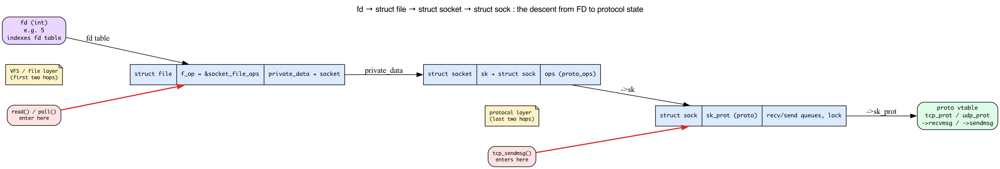
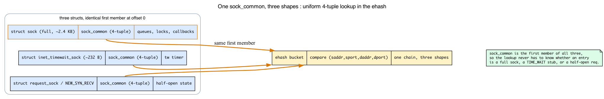
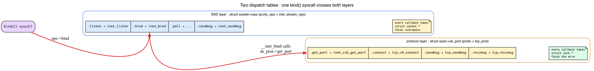
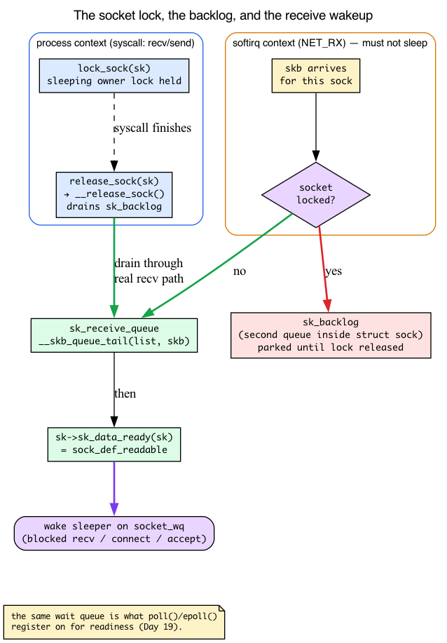
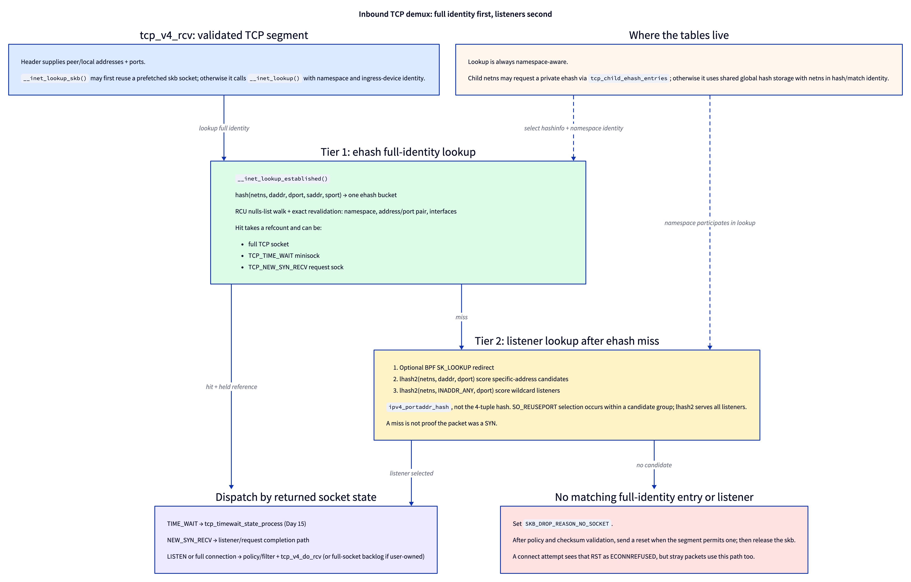

# Day 13 — The socket layer: `struct sock`

> **Today's mission:** understand the kernel side of `socket()`, `bind()`, `listen()`, `connect()`, `accept()`. See how `struct sock` sits underneath every networking syscall — and learn the machinery the socket layer is built on (the FD→socket bridge, `sock_common`, the two dispatch tables, the socket lock and receive-wakeup model, and the slab cache), taught as Backgrounds 1–5, so nothing in the lifecycle is hand-waved. Total time: ~120 minutes.

> **Phase 3 starts here.** Days 13–19 cover L4: sockets, UDP, TCP state machine, congestion control, retransmission, sockopts, epoll/io_uring.

Phase 1 (Days 1–5) walked a packet from the wire to `ip_rcv`. Phase 2 routed it. Now we arrive at the layer the application actually talks to: the **socket**. Every `socket()`, `bind()`, `connect()`, `send()`, `recv()` your program calls lands here. Today's job is to make `struct sock` — the kernel's per-connection state object — completely concrete, and to teach the five mechanisms that every remaining Phase-3 chapter leans on.

We anchor everything to a specific file/function in your `~/code/linux` checkout (line numbers from kernel 7.1).

## Two structs you must keep straight: `struct socket` and `struct sock`

The kernel has *two* "socket" structures, with confusingly similar names:

- **`struct socket`** (`include/linux/net.h`) — the BSD-API-level handle. One per file descriptor. Owns the protocol-independent stuff: the file pointer, the type (SOCK_STREAM/SOCK_DGRAM/...), the wait queue, a pointer to the `proto_ops` table.
- **`struct sock`** (`include/net/sock.h:365`) — the *protocol-level* state. Owns receive/send queues, the protocol's send/recv functions, the routing-table reference (`sk_dst_cache`), the socket option storage, etc.

Each `struct socket` has a `struct sock *sk` pointing at its protocol state. They're separate because:
1. The same `struct socket` API works for AF_INET, AF_UNIX, AF_NETLINK, AF_PACKET, etc. — wildly different protocol stacks.
2. Some sockets are kernel-internal and don't have a userspace FD (e.g., the netlink socket the kernel uses for routing notifications).

When kernel code says "the socket" it usually means `struct sock`, not `struct socket`. The userspace API talks about FDs; the kernel networking code talks about `sk` pointers.

## Background 1: how a file descriptor becomes a `struct socket`

Every lifecycle step below begins with the same sentence: *"looks up `struct socket` from the FD."* But how does a small integer — `fd = 5` — reach a C structure in the kernel? This is the very first thing every socket syscall does, so let's make it real before we walk the lifecycle.

### A socket FD is just a VFS file descriptor

When you call `socket(AF_INET, SOCK_STREAM, 0)`, the kernel returns an `int`. That integer is *the same kind of FD* you get from `open("/etc/passwd")`. It indexes into your process's file-descriptor table, where each slot points at a **`struct file`**. The reason `read()`, `write()`, `close()`, and `poll()` all work on a socket FD is precisely that a socket *is* a file as far as the VFS (Virtual File System) layer is concerned.

The trick is that a socket has no path on any real disk. So `socket()` creates an **anonymous inode** on a special, internal-only filesystem called **sockfs** — a filesystem that exists purely to give sockets a VFS identity. It then builds a `struct file` whose **`f_op`** points at `socket_file_ops` (the file-operations table that routes `read`/`write`/`poll` into the network stack) and whose **`private_data`** points at the `struct socket`.

### Recovering the socket from the file

So the chain to get from an FD back to protocol state is fixed and short. The kernel uses two helpers:

```c
/* net/socket.c:590 — given the struct file, return its socket */
struct socket *sock_from_file(struct file *file)
{
        if (likely(file->f_op == &socket_file_ops))
                return file->private_data;     /* set in sock_alloc_file */
        return NULL;
}

/* net/socket.c:612 — given the FD, fget() the file, then sock_from_file() */
struct socket *sockfd_lookup(int fd, int *err);
```

`sock_from_file` first *checks* `file->f_op == &socket_file_ops` — that's how it rejects a regular-file FD passed where a socket was expected (you get `-ENOTSOCK`). Once it knows the file is a socket, the `struct socket` is simply `file->private_data`. And `struct socket` carries both a back-pointer to the file and the `sk` (`include/linux/net.h:137`):

```c
struct socket {
        socket_state            state;
        short                   type;
        unsigned long           flags;
        struct file             *file;   /* back-pointer to the VFS file  */
        struct sock             *sk;     /* the protocol-level state      */
        const struct proto_ops  *ops;    /* the BSD-API vtable (Background 3) */
        struct socket_wq        wq;      /* wait queue (Background 4)      */
};
```

So the full descent is: **`fd` → `struct file` (via the fd table) → `file->private_data` = `struct socket` → `socket->sk` = `struct sock` → `sk->sk_prot` = the protocol vtable.** The first two hops are the **VFS / file layer**; the last two are the **protocol layer**. Calling `read()` on a TCP FD enters at `struct file` (through `socket_file_ops`), is routed to the socket, and ultimately lands in `sk->sk_prot->recvmsg`.



### Sockets with no FD

This two-layer split is also *why* kernel-internal sockets work. The netlink socket the kernel uses for routing notifications (mentioned above) has a `struct socket` and a `struct sock` but **no `struct file` and no FD** — it's created with **`sock_create_kern`** (`net/socket.c:1739`), which builds the protocol state but skips the sockfs file entirely. There's nothing for userspace to `read()`; the kernel just holds the `sk` pointer directly. The FD bridge is a separable layer that internal sockets simply don't bother with.

## `struct sock`: the polymorphic descriptor


`struct sock` is huge (config-dependent, ~800 bytes on x86_64 — 808 in this build) and most of its fields are protocol-specific shadow state. Two structural tricks make it manageable: a shared **first member** (`sock_common`, below) and **embedding** for the protocol-specific layers.

### Background 2: `struct sock_common`, the shared first member

Open `struct sock` and the first thing you see is *not* a normal field (`include/net/sock.h:365`):

```c
struct sock {
        /*
         * Now struct inet_timewait_sock also uses sock_common, so please
         * just don't add nothing before this first member (__sk_common) --acme
         */
        struct sock_common      __sk_common;
#define sk_family       __sk_common.skc_family
#define sk_state        __sk_common.skc_state
#define sk_daddr        __sk_common.skc_daddr
#define sk_rcv_saddr    __sk_common.skc_rcv_saddr
#define sk_dport        __sk_common.skc_dport
#define sk_prot         __sk_common.skc_prot
#define sk_net          __sk_common.skc_net
        /* ... ~30 more #defines, then the real fields ... */
};
```

Here's the part that trips people up: every "field" you'll see written as `sk->sk_state`, `sk->sk_family`, `sk->sk_daddr`, `sk->sk_dport`, `sk->sk_prot` is a **`#define` alias** onto `__sk_common.skc_*`. They are not direct members of `struct sock` at all — they live inside the embedded `sock_common` at offset 0. The aliases exist so the code reads naturally; the storage is shared.

Why does this matter? Because `sock_common` is *deliberately the first member of three different structs*:

- **full sockets** — `struct sock` (`__sk_common`, `include/net/sock.h:365`);
- **TIME_WAIT minisockets** — `struct inet_timewait_sock` (`__tw_common`, `include/net/inet_timewait_sock.h:38`);
- **the request-sock / half-open path** — `struct request_sock` (`__req_common`, `include/net/request_sock.h:51`), the `TCP_NEW_SYN_RECV` state.

Because all three begin with an identical `sock_common` block, the **established hash** (`ehash`, below) can store and compare *any* of them uniformly by the 4-tuple `(saddr, sport, daddr, dport)` — those fields live in `sock_common`, so the lookup never has to know whether a given hash entry is a full multi-kilobyte socket, a tiny TIME_WAIT stub, or a half-open request. One bucket, three shapes, one comparison. That's the entire reason a ~230-byte TIME_WAIT/request minisocket (`sock_common` itself is 136 bytes; `inet_timewait_sock` and `request_sock` are each 232) and a ~2.4 KB `tcp_sock` can sit side by side in the same hash chain.



### Embedding: the protocol-specific layers

The *same* first-field trick is applied one level up to build the protocol hierarchy. Each richer socket type embeds the simpler one as its first member:

```c
struct sock { struct sock_common __sk_common; /* + queues, locks, callbacks */ ... };

struct inet_sock { struct sock sk; /* IPv4/IPv6-common stuff */ ... };
struct inet_connection_sock { struct inet_sock icsk_inet; /* + retransmit/RTO */ ... };
struct tcp_sock { struct inet_connection_sock inet_conn; /* + cwnd/snd_wnd/srtt/... */ ... };
struct udp_sock { struct inet_sock inet; /* + udp-specific */ ... };
```

A pointer to a `tcp_sock` is *also* a valid pointer to an `inet_connection_sock`, *also* a valid pointer to an `inet_sock`, *also* a valid `sock` — they all start at the same address. C's structural inheritance via "first field" embedding. Helper macros do the cast:

```c
struct tcp_sock *tp = tcp_sk(sk);     // container_of: compile-time cast to tcp_sock
struct udp_sock *up = udp_sk(sk);
struct inet_sock *inet = inet_sk(sk);
```

These are `container_of` (`tcp_sk` is `container_of_const(ptr, struct tcp_sock, inet_conn.icsk_inet.sk)`, `include/linux/tcp.h:561`). For a first member, `container_of` computes "pointer minus `offsetof(member)`" where the offset is **0**, so it's a free, no-op pointer cast. (`tcp_sk`'s member chain `inet_conn.icsk_inet.sk` happens to be all first members — `inet_conn` at offset 0 of `tcp_sock`, `icsk_inet` at 0 of `inet_connection_sock`, `sk` at 0 of `inet_sock` — so its cumulative offset is still 0, a no-op. The same macro also works for genuinely *non*-first members, where it subtracts a non-zero offset.)

## Background 3: the two dispatch tables — `proto_ops` vs `proto`

The polymorphism — "the same syscall does different things for TCP vs UDP" — lives in **function-pointer tables (vtables)**. But there are **two** of them, at two different layers, and confusing them is the single most common way to get lost in this code. Let's name both.

### The BSD layer: `struct socket->ops` (a `proto_ops`)

`struct socket->ops` points at a **`struct proto_ops`** (`include/linux/net.h:181`) — the **BSD-API layer**. It is shared by *all* AF_INET stream sockets (the instance is `inet_stream_ops`, `net/ipv4/af_inet.c:1062`). Its job is protocol-*independent* glue: argument validation, then dispatch downward.

```c
struct proto_ops {
        int  family;
        int  (*release)(struct socket *sock);
        int  (*bind)   (struct socket *sock, struct sockaddr_unsized *, int);
        int  (*connect)(struct socket *sock, struct sockaddr_unsized *, int, int);
        int  (*accept) (struct socket *sock, struct socket *newsock, ...);
        __poll_t (*poll)(struct file *, struct socket *sock, ...);
        int  (*listen) (struct socket *sock, int len);
        int  (*sendmsg)(struct socket *sock, struct msghdr *, size_t);
        /* ... */
};
```

Note the signatures: everything takes a `struct socket *`. This is the table the VFS layer reaches through. `inet_stream_ops` wires `.listen = inet_listen`, `.bind = inet_bind`, `.sendmsg = inet_sendmsg`, etc. (`net/ipv4/af_inet.c:1062`).

### The protocol layer: `struct sock->sk_prot` (a `proto`)

`struct sock->sk_prot` points at a **`struct proto`** (`include/net/sock.h:1291`) — the **protocol layer**. The instance for TCP is `tcp_prot`; for UDP, `udp_prot`. Its job is the actual protocol logic.

```c
struct proto {
        void (*close)     (struct sock *sk, long timeout);
        int  (*connect)   (struct sock *sk, struct sockaddr_unsized *, int);
        struct sock *(*accept)(struct sock *sk, struct proto_accept_arg *arg);
        int  (*init)      (struct sock *sk);
        int  (*sendmsg)   (struct sock *sk, struct msghdr *, size_t);
        int  (*recvmsg)   (struct sock *sk, struct msghdr *, size_t, ...);
        int  (*bind)      (struct sock *sk, struct sockaddr_unsized *, int);
        int  (*hash)      (struct sock *sk);
        int  (*get_port)  (struct sock *sk, unsigned short snum);
        /* ... ~40 more callbacks ... */
        struct kmem_cache *slab;        /* per-protocol object cache (Background 5) */
        unsigned int       obj_size;
};
```

Note *these* signatures take a `struct sock *`. Same verb names sometimes appear in both tables (`connect`, `sendmsg`, `bind`) — that's exactly why they're easy to confuse.

### One syscall crosses both tables

The two layers are stacked: the BSD layer validates and dispatches down to the protocol layer. The cleanest example is `bind()`. The BSD-level `inet_bind` (`net/ipv4/af_inet.c:472`, a `proto_ops .bind`) does protocol-independent validation — address length, `SO_REUSEADDR`/`REUSEPORT` checks — and then calls down:

```c
/* inside __inet_bind, net/ipv4/af_inet.c:543 */
err = sk->sk_prot->get_port(sk, snum);   /* a *proto* op: TCP's inet_csk_get_port */
```

So a single `bind(2)` syscall touches **both** vtables: `socket->ops->bind` (the `proto_ops` `inet_bind`) → `sk->sk_prot->get_port` (the `proto` op `inet_csk_get_port`). Likewise `send()` crosses both: `socket->ops->sendmsg` (`inet_sendmsg`) → `sk->sk_prot->sendmsg` (`tcp_sendmsg`).

Some operations live mostly in one table. `listen()` has no `proto->listen` slot, so it dispatches only through `proto_ops` (`inet_listen`) — but `inet_listen` still reaches into `proto` ops (`get_port`, `hash`) and allocates the accept queue. `connect()`, `get_port`, and the real TCP logic are `proto` ops. And RAW sockets are the rare case that define `sk_prot->bind` directly (most protocols leave it NULL and rely on `inet_bind` → `get_port`).

The mental model: **`proto_ops` sits on `struct socket` and faces userspace; `proto` sits on `struct sock` and faces the wire.** So when the lifecycle below says a syscall "dispatches through `sk->sk_prot`," that's only the bottom half of the story — the top half went through `socket->ops` first.



> **There are no Dumb Questions**
>
> **Q: Why two structs — `struct socket` *and* `struct sock` — instead of one?**
>
> A: Because they serve two different audiences. `struct socket` is the BSD-API handle: one per FD, protocol-independent, the thing the VFS layer reaches through `proto_ops`. `struct sock` is the protocol state: queues, the `proto` vtable, the route cache — the thing the wire side touches. The split lets the *same* `struct socket` API drive AF_INET, AF_UNIX, AF_NETLINK, etc., and lets kernel-internal sockets exist with a `sock` but no FD-bearing `socket`/`file` at all (Background 1).
>
> **Q: Then why does `bind()` have to touch *two* vtables?**
>
> A: Because the work splits cleanly across the two layers. The protocol-independent half — validating the address length, honoring `SO_REUSEADDR`/`REUSEPORT` — lives in the BSD layer (`proto_ops->bind` = `inet_bind`). The protocol-specific half — actually reserving the port in TCP's bind hash — lives in the protocol layer (`proto->get_port` = `inet_csk_get_port`). One syscall, one descent through both tables.

### Key fields you'll see everywhere

```c
sk_family            // AF_INET, AF_INET6, AF_UNIX, AF_NETLINK, ...  (alias into sock_common)
sk_type              // SOCK_STREAM, SOCK_DGRAM, SOCK_RAW, ...
sk_protocol          // IPPROTO_TCP, IPPROTO_UDP, ...
sk_state             // TCP_ESTABLISHED, TCP_LISTEN, ... (alias into sock_common;
                     //   TCP-specific but reused by UDP for connected sockets)
sk_receive_queue     // skb_queue: incoming packets waiting to be read
sk_write_queue       // skb_queue: outgoing skbs not yet ACKed (TCP)
sk_backlog           // packets parked here while the socket lock is held (Background 4)
sk_rcvbuf, sk_sndbuf // per-socket buffer limits
sk_filter            // BPF socket filter (sk_attach_filter)
sk_lock              // the special socket lock (lock_sock / release_sock — Background 4)
sk_data_ready        // callback fired when data arrives (Background 4)
sk_prot              // the proto vtable (alias into sock_common)
sk_dst_cache         // refcounted route entry — see Day 8
sk_net               // pointer back to the netns (alias into sock_common)
```

## Background 4: the socket lock and the receive-wakeup model

The field list above mentions `sk_lock`, `sk_backlog`, `sk_receive_queue`, and `sk_data_ready`, and the lifecycle below will say `connect()`/`accept()` "sleep until something arrives." All of that is hand-waving until you understand three things: the *special* socket lock, the *backlog* queue, and how an arriving packet *wakes* a sleeping reader. These are load-bearing for every remaining Phase-3 chapter (UDP/TCP receive, and epoll on Day 19).

### `sk_lock` is not a plain spinlock

A socket is touched from two completely different contexts at once:

- **process context** — your `recv()`/`send()` syscall, running in a schedulable task that is *allowed to sleep*;
- **softirq context** — the NET_RX path from Day 2, delivering an arriving packet, which *must not sleep*.

A plain spinlock can't bridge those: process context may need to hold the socket across a sleep (e.g. waiting for buffer space), but you can't hold a spinlock across a sleep. So `sk_lock` is a hybrid **owner lock**. `lock_sock()` (`include/net/sock.h:1711`, which calls `lock_sock_nested` at `:1709`) takes a *sleeping* owner lock used by process context. While a syscall holds it, softirq-context delivery is **not allowed to touch the socket's receive queue**.

### The backlog: where packets wait out the lock

But packets keep arriving while your syscall holds the lock. They can't be dropped, and they can't go into `sk_receive_queue` (the lock owner might be mid-traversal). So they're parked on the **backlog** — a tiny second queue *inside* `struct sock` (`include/net/sock.h:420`):

```c
struct {
        atomic_t        rmem_alloc;
        int             len;
        struct sk_buff  *head;
        struct sk_buff  *tail;
} sk_backlog;
#define sk_rmem_alloc sk_backlog.rmem_alloc
```

This is *why* `struct sock` carries both `sk_receive_queue` and the `sk_backlog` sub-struct. The decision is: **if the socket is locked, push the skb onto `sk_backlog`; otherwise queue it normally.** When the syscall finishes, **`release_sock()`** (`net/core/sock.c:3819`) calls **`__release_sock()`** (`net/core/sock.c:3208`), which **drains the backlog** through the real receive path before dropping the lock. Nothing is lost; it's just deferred past the critical section.

### The wakeup: `sk_data_ready` and the wait queue

Now the other half — how does a *blocked* `recv()` wake up? When the stack queues a packet onto the receive queue, it calls the socket's data-ready callback (`net/core/sock.c:514`–`518`):

```c
        __skb_queue_tail(list, skb);
        ...
        sk->sk_data_ready(sk);
```

`sk_data_ready` (`include/net/sock.h:453`) is a function pointer. The default, wired up by `sock_init_data` (`net/core/sock.c:3779`, which sets `sk->sk_data_ready = sock_def_readable` at `:3734`), is **`sock_def_readable`** (`net/core/sock.c:3614`). It wakes any process sleeping on the socket's **wait queue**.

Where's the wait queue? It lives in `struct socket->wq` (a `socket_wq`), reached from the `sock` side via `sk->sk_wq` / `sk_sleep(sk)`. A blocking `accept()`/`recvmsg()` adds itself to that queue and schedules away; when data (or a completed connection) arrives, **`sk_data_ready`** (default `sock_def_readable`, `net/core/sock.c:3614`) runs and its wakeup callback pulls the sleeper back to runnable. A blocking `connect()` parks on the same queue but is woken differently: handshake completion (`tcp_finish_connect`) flips the state to `ESTABLISHED` and fires **`sk->sk_state_change(sk)`** (default `sock_def_wakeup`, `net/core/sock.c:3591`, wired at `:3733`), not `sk_data_ready`. Both callbacks wake the same `sk_wq->wait` queue, so "sleeps until the SYN-ACK arrives" resolves either way — but for `connect` the named mechanism is the state-change/`sock_def_wakeup` path, while `recvmsg`/`accept` ride `sk_data_ready`/`sock_def_readable`.

This same wait queue is what `poll()`/`epoll()` register on for readiness notifications — which is exactly how Day 19 builds epoll on top of it. And the limits that decide when these queues count as "full" are `sk_rcvbuf` / `sk_sndbuf` (in the field list) — the very numbers today's experiment inspects with `ss -tim`.



## Lifecycle


Now walk a TCP server's lifecycle, kernel-side, with every "looks up the socket from the FD" backed by Background 1 and every "dispatches" backed by Background 3.

### `socket(AF_INET, SOCK_STREAM, 0)`

1. Userspace calls the syscall — handled at `net/socket.c:1819` `SYSCALL_DEFINE3(socket, ...)`.
2. **`__sock_create`** (`net/socket.c:1594`) allocates the `struct socket` via `sock_alloc()`, then walks `net_families[AF_INET]` to find the protocol family's `create` callback and invokes it with that already-allocated socket.
3. For AF_INET that callback is **`inet_create`** (`net/ipv4/af_inet.c:259`). It:
   - Allocates the `struct sock` via **`sk_alloc`** (`net/ipv4/af_inet.c:333`), drawing a whole `tcp_sock` (or `udp_sock` etc.) from the protocol's `prot->slab` cache (Background 5). It does *not* allocate the `struct socket` (already done above) or the `struct file` (created later).
   - Calls **`sock_init_data`** (`net/ipv4/af_inet.c:362`) to wire the generic defaults — including `sk_data_ready = sock_def_readable` from Background 4 — *before* the protocol's `prot->init` runs.
   - Then calls the protocol's `prot->init` (`net/ipv4/af_inet.c:390`) — for TCP, **`tcp_init_sock`** (`net/ipv4/tcp.c:421`) — for TCP-specific initialization: snd_cwnd, ssthresh, smoothed RTT/RTO, the retransmit (write) queue, sndbuf/rcvbuf. (No accept queue here — that's a `listen()`-time allocation; see below.)
   - Returns. Back in `__sys_socket`, **`sock_map_fd`** → **`sock_alloc_file`** (`net/socket.c:1780`) now creates the sockfs `struct file` and installs the FD: the FD points at the file, the file's `private_data` points at the socket, the socket's `sk` points at the sock.

### Background 5: where the `sock` object comes from (slab — recall Day 1)

The allocation in step 3 is worth one line. Recall the **slab allocator** from Day 1: fixed-size object caches that make allocation an O(1) "pop a free slot." Each `struct proto` owns its **own** dedicated slab cache (`prot->slab`, with `prot->obj_size`, `include/net/sock.h:1382`), so allocating a `tcp_sock` is a fast fixed-size slab alloc, not a general `kmalloc`. The object size is the **full derived struct** — a whole `tcp_sock` (~2 KB), not just `struct sock` — which is exactly why `obj_size` is set per protocol. `inet_create` (`net/ipv4/af_inet.c:259`) allocates through this per-protocol cache.

### `bind(fd, ...)`

1. Looks up `struct socket` from the FD (Background 1: `fd` → `file` → `private_data`).
2. Calls `sock->ops->bind` — for AF_INET TCP that's **`inet_bind`** (`net/ipv4/af_inet.c:472`), a `proto_ops` op (Background 3).
3. `__inet_bind` validates, then calls **`sk->sk_prot->get_port(sk, snum)`** (`net/ipv4/af_inet.c:543`) — a `proto` op, crossing from the BSD table to the protocol table. For TCP that's **`inet_csk_get_port`** (`net/ipv4/inet_connection_sock.c:500`), which reserves the port in the per-netns bind hash table (`tcp_hashinfo.bhash`). (A separate `sk_prot->bind` hook exists too, but only RAW sockets define it.)
4. The bind table is keyed by `(netns, port)` — that's why two netns can both bind `:80`.

### `listen(fd, backlog)`

A pure `proto_ops` op (`inet_listen`, `net/ipv4/af_inet.c:237`). Marks the sock as `TCP_LISTEN`. Allocates the **accept queue**: a FIFO list of *completed* connections waiting for `accept()` (`request_sock_queue.rskq_accept_head`). Half-open handshakes (SYN_RECV) don't live here — they sit in the established hash as `TCP_NEW_SYN_RECV` request socks (those `sock_common`-fronted minisockets from Background 2) until the handshake finishes.

### `connect(fd, ...)` — client side

1. Looks up the sock from the FD.
2. Calls `sk->sk_prot->connect` — for TCP **`tcp_v4_connect`** (`net/ipv4/tcp_ipv4.c:221`), a `proto` op.
3. Sets sock state to `TCP_SYN_SENT`, then calls `inet_hash_connect` to pick a source port (ephemeral range) and insert into the established hash (`tcp_hashinfo.ehash`) keyed by 4-tuple.
4. Calls `tcp_connect` to build and send the SYN.
5. Returns `EINPROGRESS` (non-blocking) or **sleeps until the SYN-ACK arrives** (blocking) — that sleep is exactly Background 4: the task parks on the socket's wait queue, and handshake completion wakes it via the state transition to `ESTABLISHED` (`sk_state_change`/`sock_def_wakeup`), not `sk_data_ready`.

### `accept(fd, ...)` — server side

1. Pops a completed connection from the accept queue (blocking via the same wait-queue mechanism if the queue is empty).
2. Allocates a new FD wrapping the new `sock` (a fresh sockfs file, Background 1).
3. Returns the FD.

The original listening socket stays — accept just hands you a *new* socket for the connection.

## The two hash tables: `bhash` and `ehash`

`struct inet_hashinfo` (used by TCP — UDP has its own `struct udp_table`, see Day 14) holds two key data structures:

- **`bhash`** — the bind hash. Keyed by port number; each bucket holds a list of bound sockets (multiple if `SO_REUSEPORT`). Lookup on `bind()` and on incoming SYN to find listener.
- **`ehash`** — the established hash. Keyed by the 4-tuple `(saddr, sport, daddr, dport)`. Lookup on every incoming TCP packet to find the existing connection. This is the hash that holds full socks, TIME_WAIT minisocks, and `TCP_NEW_SYN_RECV` request socks side by side — possible only because all three share `sock_common` as their first member (Background 2).

Per-netns. Alongside `bhash`/`ehash`, `struct inet_hashinfo` carries a separate listener table, **`lhash2`**, hashed by `(local port, local address)`. It's a sibling of the bind and established tables, not part of `bhash`, and it speeds up finding the listening socket on an incoming SYN (it also carries the `SO_REUSEPORT` groups that listener lookup then selects from — Day 24).

### How an arriving segment finds its socket: the two-tier lookup

Here's the part the static field list above skips, and it's the whole reason these two tables exist. Every TCP segment that arrives off the wire is just bytes with a 4-tuple in its headers — `(saddr, sport, daddr, dport)`. Somewhere in the kernel there may be a `struct sock` that owns this conversation, or a listener willing to start one, or nobody at all. **Demultiplexing** is the act of turning that 4-tuple into the right `sk` pointer, and it happens on *every single inbound packet*. Get the mental model for this and the rest of L4 falls into place, because every later day (TCP state machine, congestion control, retransmission) assumes the segment has already been routed to its sock.



The entry point is `tcp_v4_rcv`, which calls `__inet_lookup_skb` → `__inet_lookup`. That helper searches in **two tiers, in a deliberate order**:

1. **Try the ehash first — entries with full identity.** `__inet_lookup_established` computes `inet_ehashfn(net, daddr, dport, saddr, sport)`, selects one bucket, and walks its nulls list under RCU. `inet_match` verifies namespace, exact address/port pair, and interface constraints. A hit can be a full connection, a TIME_WAIT minisock, or a `TCP_NEW_SYN_RECV` request sock; `tcp_v4_rcv` branches on those special states before normal full-socket processing. Day 15 follows the TIME_WAIT branch through the full-socket-to-minisock hand-off and eventual timer expiry.
2. **Only if ehash misses, try listener lookup.** `__inet_lookup_listener` first offers the segment to the BPF `SK_LOOKUP` hook when enabled. It then hashes `(netns, daddr, dport)` with `ipv4_portaddr_hash` and searches that `lhash2` bucket; if no specific-address listener wins, it repeats with `INADDR_ANY`. Candidate scoring accounts for namespace, address, and bound-device specificity. A reuseport candidate invokes `reuseport_select_sock`, but lhash2 is the normal listener table, not a reuseport-only structure.

An ehash miss is not proof that the segment is a SYN — stray ACKs and other unmatched segments take the same fallback. TCP state processing decides what a listener accepts. The ordering still optimizes the common data path: established traffic performs one full-identity bucket lookup, while wildcard/scored listener selection runs only after that misses.

Two consequences fall out of this:

- **An ehash hit takes a refcount.** `__inet_lookup_established` uses `refcount_inc_not_zero` and revalidates the match before returning, so an established/request/TIME_WAIT entry cannot vanish mid-RX. The listener path is RCU-protected and reports `refcounted = false`; its caller follows the appropriate listener lifetime rules.
- **Both tiers missing is the "no socket" path.** `tcp_v4_rcv` assigns `SKB_DROP_REASON_NO_SOCKET` and, after policy/checksum checks, sends a reset for a segment that permits one. A connect attempt observes that reset as `ECONNREFUSED`; not every no-socket packet corresponds to a userspace connect.

## Today's experiment

```bash
# Inspect socket state
ss -tan       # TCP all numeric
ss -ti        # TCP with internal info: rtt, cwnd, retrans

# Trace lifecycle of one connection
sudo bpftrace -e '
fentry:tcp_init_sock { printf("init %p\n", args->sk); }
fentry:inet_csk_get_port { printf("get_port port=%d\n", args->snum); }
fentry:tcp_v4_connect { printf("connect %p\n", args->sk); }
fentry:tcp_set_state { printf("set_state %p -> %d\n", args->sk, args->state); }
'

# In another terminal:
nc -l 9999 &
echo hi | nc -q 1 localhost 9999

# Stop tracer (Ctrl-C in the bpftrace shell)
```

You'll see init → get_port (server) → init (client) → connect → set_state through SYN_SENT → ESTABLISHED → CLOSE_WAIT → LAST_ACK → CLOSE.

`tcp_set_state` prints the *new* state as a raw integer, not a name — so a line like `set_state 0xffff... -> 2` means "this sock moved to SYN_SENT." The mapping (from `include/net/tcp_states.h`) is: `1`=ESTABLISHED, `2`=SYN_SENT, `3`=SYN_RECV, `4`=FIN_WAIT1, `5`=FIN_WAIT2, `6`=TIME_WAIT, `7`=CLOSE, `8`=CLOSE_WAIT, `9`=LAST_ACK, `10`=LISTEN, `11`=CLOSING. (There's also `TCP_NEW_SYN_RECV` in that enum — the half-open minisocket state from Background 2 — but `tcp_set_state` isn't the path that sets it.) The two distinct `%p` sock pointers tell the server listener apart from the client connection — each transitions through its own sequence. To read the states as names directly, decode them in a `BEGIN` block (so the map is populated once, not re-assigned on every hit):

```bash
sudo bpftrace -e '
BEGIN { @sn[1]="ESTABLISHED";@sn[2]="SYN_SENT";@sn[3]="SYN_RECV";@sn[4]="FIN_WAIT1";@sn[5]="FIN_WAIT2";@sn[6]="TIME_WAIT";@sn[7]="CLOSE";@sn[8]="CLOSE_WAIT";@sn[9]="LAST_ACK";@sn[10]="LISTEN";@sn[11]="CLOSING"; }
fentry:tcp_set_state { printf("set_state %p -> %s\n", args->sk, @sn[args->state]); }
END { clear(@sn); }
'
```

### See the bind/established hashes

```bash
# Bound listening sockets:
sudo ss -tlnp

# Only the established (ehash) entries, with owning process:
sudo ss -tnp state established

# (ss -tap would also include LISTEN sockets from the bhash above —
#  the `state established` filter isolates the ehash side of the contrast.)

# Memory accounting:
ss -tim
```

`ss` reads from `/proc/net/tcp` (and the netlink-based `INET_DIAG`). The numbers come straight from the per-sock state — including the `sk_rcvbuf`/`sk_sndbuf` limits and the receive-queue occupancy that Background 4 explained govern wakeups and "queue full" decisions.

## What to read in the kernel

- **`net/socket.c:590`** — `sock_from_file`. Three lines: the `f_op == &socket_file_ops` check, then `return file->private_data`. This *is* the FD→socket bridge.
- **`net/socket.c:612`** — `sockfd_lookup`. `fget(fd)` → `sock_from_file`. The whole "look up the socket from the FD" step every syscall starts with.
- **`include/linux/net.h:137`** — `struct socket`. Note `file`, `sk`, `ops`, `wq` living side by side.
- **`include/linux/net.h:181`** — `struct proto_ops`. The BSD/socket-level vtable (every callback takes `struct socket *`).

- **`include/net/sock.h:365`** — `struct sock`. Read all fields (~150 lines of struct). First note `struct sock_common __sk_common` at offset 0 and the long `#define sk_* __sk_common.skc_*` block right after it — those aliases are why `sk->sk_state` works. Then the `__cacheline_group_begin`/`__cacheline_group_end` macros grouping fields into hot/cold cache lines (`sock_write_rx`, `sock_read_rx`, etc.). This struct is one of the most cache-line-tuned in the kernel; respect the layout.

- **`include/net/sock.h:420`** — the `sk_backlog` sub-struct (with `#define sk_rmem_alloc`). The second receive queue used while the socket lock is held.
- **`include/net/sock.h:453`** — `sk_data_ready` (and the nearby callback pointers). The receive-wakeup hook.
- **`include/net/sock.h:1291`** — `struct proto`. The protocol/sock-level vtable (every callback takes `struct sock *`); note `hash`/`get_port` at `:1339`/`:1342` and `slab`/`obj_size` at `:1382`.
- **`include/net/sock.h:1711`** — `lock_sock` (and `lock_sock_nested` at `:1709`, `release_sock` declared at `:1717`). The special sleeping owner lock.
- **`net/core/sock.c:3208`** — `__release_sock`. Drains `sk_backlog` into the real receive path. `net/core/sock.c:3614` — `sock_def_readable`, the default `sk_data_ready` that wakes `sk_sleep(sk)`. `net/core/sock.c:3779` — `sock_init_data`, where the defaults get wired.

- **`include/net/inet_sock.h:218`** — `struct inet_sock`. Adds IPv4/IPv6 common fields: addresses, ports, ttl, mc_addr, sk_dst_cache. Quick read.
- **`include/net/inet_connection_sock.h:81`** — `struct inet_connection_sock`. Adds retransmit timer, accept queue, ack delay timer. The "connection-oriented" base for TCP and DCCP.
- **`include/linux/tcp.h:197`** — `struct tcp_sock`. The full TCP state. ~150 fields covering snd_wnd, snd_cwnd, srtt_us, rcv_nxt, write_seq, sack info, RACK, retrans queue. Don't try to memorize; just know it's there and grep when you need a specific field. (`tcp_sk` is `#define`d at `include/linux/tcp.h:561`.)

- **`net/socket.c:1819`** — `SYSCALL_DEFINE3(socket, ...)`. The userspace entry. ~50 lines. Walk through to see how a syscall becomes a `struct socket`.
- **`net/socket.c:1594`** — `__sock_create`. The protocol-family dispatch. Reads `net_families[family]` and calls the registered create callback. (`sock_create_kern` at `net/socket.c:1739` is the no-FD variant for kernel-internal sockets.)
- **`net/ipv4/af_inet.c:259`** — `inet_create`. AF_INET's create. Allocates the sock from the protocol's slab cache, sets up inet_sk fields, calls protocol-specific init.
- **`net/ipv4/af_inet.c:472`** — `inet_bind`. The bind path (a `proto_ops .bind`). Validates addr_len, checks SO_REUSEADDR/REUSEPORT, then at `net/ipv4/af_inet.c:543` dispatches to `sk->sk_prot->get_port`. Useful to understand why `bind(0.0.0.0, port)` and `bind(127.0.0.1, port)` behave differently.
- **`net/ipv4/inet_connection_sock.c:500`** — `inet_csk_get_port`. Port reservation. Read this to understand SO_REUSEPORT (Day 24): the function walks bind hash buckets and decides whether collision is allowed based on the `reuse` flag and UID match.
- **`net/ipv4/tcp.c:421`** — `tcp_init_sock`. TCP per-socket init. Sets up cwnd, ssthresh, RTT estimators, the retransmit (write) queue, sndbuf/rcvbuf. (Not the accept queue — that's allocated at `listen()` time by `inet_csk_listen_start`.) Read this once to see what state a fresh TCP socket starts with.
- **`net/ipv4/tcp_ipv4.c:221`** — `tcp_v4_connect`. The client connect path. Walk through: route lookup, source-port allocation, ehash insertion, SYN build/send.
- **`Documentation/networking/kapi.rst`** — the networking kernel API reference, including the socket/`struct sock` interfaces. Brief.

## Bullet Points

- An FD reaches the kernel socket through the **VFS layer**: `fd` → `struct file` → `file->private_data` = `struct socket` → `socket->sk` = `struct sock`. `sock_from_file`/`sockfd_lookup` (`net/socket.c:590`/`:612`) do the recovery; kernel-internal sockets (`sock_create_kern`) skip the FD entirely.
- `struct socket` is the BSD-level descriptor (one per FD); `struct sock` is the protocol-level state. They're linked via `sock->sk`.
- The first member of `struct sock` is **`struct sock_common __sk_common`**, and fields like `sk_state`/`sk_daddr`/`sk_prot` are `#define` aliases into it. `sock_common` is *also* the first member of `inet_timewait_sock` and `request_sock`, which is what lets the **ehash** compare full socks, TIME_WAIT minisocks, and `TCP_NEW_SYN_RECV` request socks uniformly by 4-tuple.
- **Polymorphism via embedding:** `tcp_sock` embeds `inet_connection_sock` embeds `inet_sock` embeds `sock`. The `tcp_sk()`/`udp_sk()`/`inet_sk()` helpers are `container_of` (offset-0 no-op casts here).
- **Two dispatch tables:** `struct socket->ops` is a **`proto_ops`** (BSD layer — `inet_stream_ops`: bind/listen/poll/sendmsg, all taking `struct socket *`); `struct sock->sk_prot` is a **`proto`** (protocol layer — `tcp_prot`: get_port/connect/sendmsg, all taking `struct sock *`). One syscall crosses both: `bind()` = `inet_bind` (proto_ops) → `get_port` (proto).
- The **socket lock** (`lock_sock`/`release_sock`) is a sleeping owner lock. While process context holds it, arriving packets are parked on **`sk_backlog`** instead of `sk_receive_queue`; `release_sock` drains the backlog. Arriving data calls **`sk_data_ready`** (default `sock_def_readable`), which wakes any task sleeping on the socket's wait queue — the mechanism behind blocking `recv()` and behind epoll (Day 19).
- Each `struct proto` owns a dedicated **slab cache** (`prot->slab`, `obj_size` = the full derived struct like `tcp_sock`) — the same slab allocator from Day 1.
- Bind tables (`tcp_hashinfo.bhash`) and established tables (`ehash`) are **per-netns**.
- `accept()` returns a *new* `sock` taken from the listener's accept queue — the listener stays.
- Inspect with `ss`, especially `ss -tipsm` for full per-socket metadata.

## Check question

Why do `struct tcp_sock` and `struct udp_sock` both embed `struct inet_sock` as their first field, rather than `struct sock` directly?

<details>
<summary>Click to reveal answer</summary>

**Answer:** `inet_sock` adds IPv4/IPv6-common fields (rcv_saddr, daddr, sport, dport, ttl, etc.) that any IP-based protocol needs. By inheriting from `inet_sock`, TCP and UDP share these fields without duplication, and the helper `inet_sk(sk)` returns a meaningful pointer for both. Non-IP protocols like UNIX sockets (`struct unix_sock`) skip `inet_sock` and embed `sock` directly because they don't have IP semantics — there's no source/dest IP address. The hierarchy is essentially "protocol-family base classes": `sock` for everything, `inet_sock` for IP-based, `inet_connection_sock` for connection-oriented IP-based. (And one level deeper, `sock` itself starts with `sock_common`, the base shared even by minisockets.)

</details>

---

## Tomorrow

Day 14: UDP — the simpler protocol. From `sendmsg` to wire and back, with the per-port lookup that makes UDP receive cheap — and the receive queue plus `sk_data_ready` wakeup you just learned put to work for real.
