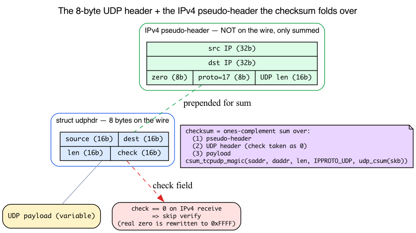
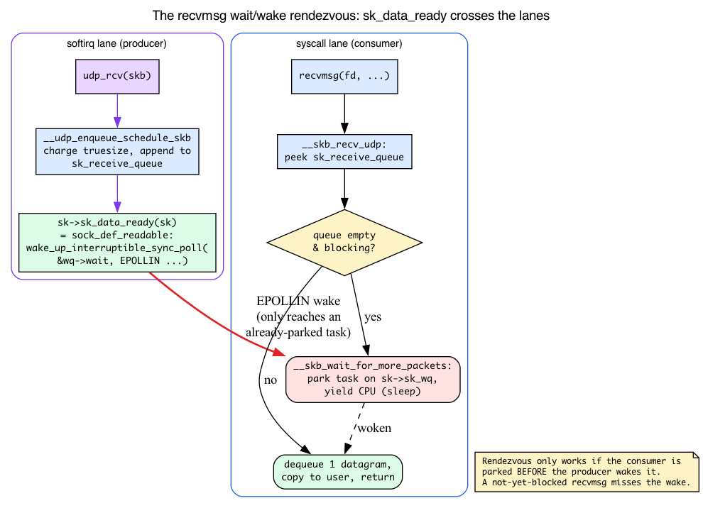
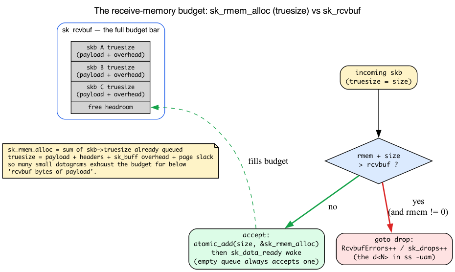
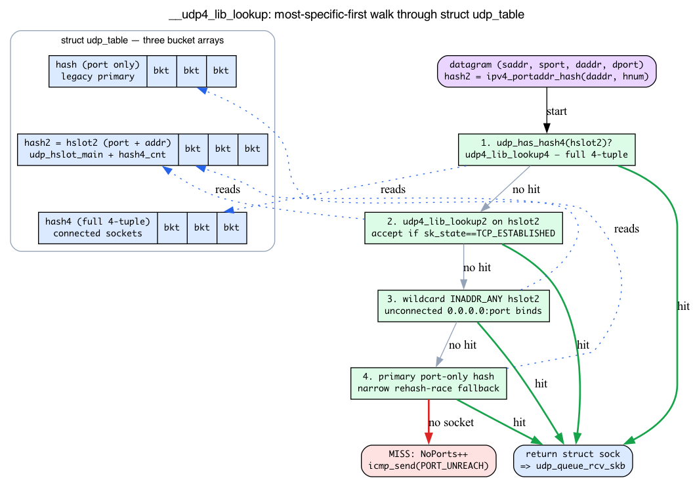

# Day 14 — UDP: the simple protocol

> **Today's mission:** trace a UDP packet end to end. See why "connectionless" simplifies the kernel-side code dramatically — and learn the four mechanisms the path leans on (the 8-byte wire header and its checksum, the sleep/wake rendezvous behind `recvmsg`, the receive-memory budget that decides who gets dropped, and the UDP hash table that finds your socket) so nothing along the way is a black box. Total time: ~130 minutes.

UDP looks trivial from userspace: `sendto`, `recvfrom`, done. But that simplicity rests on four pieces of kernel machinery this chapter repeatedly leans on. We teach each one intuition-first, then the concrete v7.1 struct or function, and only *then* walk the path, with every stage resting on something you already understand.

> Several things from earlier days are load-bearing today and will **not** be re-taught in full:
> - **`struct sock`, `sk_receive_queue`, `sk_prot` vtable dispatch** — Day 13. When userspace calls `sendto`, the kernel dispatches `sk->sk_prot->sendmsg`, which for UDP is `udp_sendmsg`.
> - **`bhash` (port-keyed) vs `ehash` (4-tuple-keyed)** — Day 13 taught TCP's two-table split in `struct inet_hashinfo`. UDP has the analogous split but in its **own** `struct udp_table`; Day 13 deferred the details to today, and we teach them below.
> - **The pseudo-header and the `CHECKSUM_PARTIAL` offload contract** — Day 4. The L4 checksum covers a pseudo-header built from the IP addresses; with `CHECKSUM_PARTIAL` the kernel fills in the pseudo-header sum and the NIC finishes the fold over the payload (`skbuff.h:248-251`). Today we apply that to UDP specifically.
> - **`skb->truesize`** — Day 3 introduced it on the TCP *send* side (`sk_wmem_queued`): an skb's true memory cost is payload **plus** headers **plus** per-skb struct overhead and page-fragment slack, not its on-wire length. Today we meet the same number on the *receive* side.
> - **`sk->sk_wq`, the socket wait queue** — Day 13 named it as a field of `struct socket`. Today we teach the wake path that actually uses it.
> - **The TX/IP output path** — Day 3. Once `udp_sendmsg` hands the datagram to `ip_send_skb`, it follows the same `ip_local_out → ip_output` road you already traced.

## Why UDP first

UDP has no state machine, no retransmissions, no congestion control. One `sendmsg` produces one wire packet (or one fragmented packet, if size > path MTU). One `recvmsg` returns one datagram. Everything else — packet loss recovery, in-order delivery, flow control — is the application's problem.

Understanding UDP gives you the *baseline* L4 path. TCP (Days 15–17) is "UDP plus a state machine plus retransmission plus congestion control" — knowing where the simple version ends helps you see where TCP's complexity goes.

## Background 1: the UDP wire header and what the checksum protects

Before we trace a `sendmsg`, look at what actually goes on the wire. The chapter later discusses UDP-Lite's "partial checksum," the `InCsumErrors` counter, and keeps saying "one `sendmsg` produces one wire packet" — none of which you can reason about without seeing the 8-byte header `udp_sendmsg` builds.

### The whole protocol is 8 bytes

The entire UDP wire header is four 16-bit big-endian fields (`include/uapi/linux/udp.h:23`):

```c
struct udphdr {
    __be16  source;   /* source port      */
    __be16  dest;     /* destination port */
    __be16  len;      /* UDP header + payload length, in bytes */
    __sum16 check;    /* checksum (see below) */
};
```

That is **the whole protocol on the wire** — 8 bytes. Contrast TCP's 20+ byte header carrying sequence numbers, acknowledgments, a window, and flags. There is no sequence number because UDP never reorders or retransmits; no window because it never flow-controls; no flags because there are no connection states to signal. This minimal header *is* "why UDP is simple." `udp_send_skb` (`net/ipv4/udp.c:1092`) fills these four fields in just before handing the skb to IP:

```c
uh = udp_hdr(skb);
uh->source = inet_sk(sk)->inet_sport;
uh->dest   = fl4->fl4_dport;
uh->len    = htons(len);
uh->check  = 0;                 /* finalised below */
```

### What the checksum folds over

UDP's `check` field is a ones-complement sum over three things, in order:

1. The **pseudo-header** — source IP, destination IP, a zero byte, the protocol number (`IPPROTO_UDP` = 17), and the UDP length. (Recall the pseudo-header from Day 4 — the same construction TCP uses.) Folding the IP addresses into an L4 checksum ties the datagram to its endpoints, so a packet *misdelivered* to the wrong host or protocol is caught even though L4 alone couldn't tell.
2. The **UDP header** (the 8 bytes above, with `check` taken as zero during computation).
3. The **payload**.

In v7.1 this is exactly the `csum_tcpudp_magic` call at the end of `udp_send_skb`:

```c
uh->check = csum_tcpudp_magic(fl4->saddr, fl4->daddr, len,
                              IPPROTO_UDP, udp_csum(skb));
if (uh->check == 0)
    uh->check = CSUM_MANGLED_0;
```

`csum_tcpudp_magic` adds the pseudo-header to `udp_csum(skb)` (the sum over header+payload). The `CHECKSUM_PARTIAL` offload branch (Day 4's contract) takes a different road — `udp4_hwcsum` seeds the pseudo-header sum and lets the NIC finish the fold over the payload — but the *coverage* is identical.

### Why a zero checksum means "skip" on IPv4

Notice the `if (uh->check == 0) uh->check = CSUM_MANGLED_0;` above. On **IPv4 the UDP checksum is optional**: a *received* datagram whose `check` field is literally zero means "the sender did not compute a checksum; do not verify." Because a genuinely-computed checksum can legitimately fold to zero, the sender rewrites that one value to the equivalent `0xFFFF` (`CSUM_MANGLED_0`) so that an on-the-wire zero unambiguously means "absent." The receive side honours this in `udp4_csum_init` (`net/ipv4/udp.c:2536`) via `skb_checksum_init_zero_check` — `uh->check == 0` short-circuits verification entirely.

Why is this allowed? Because IPv4 has its own header checksum, so a corrupted *address* is caught at L3 even if L4 skips. **IPv6 has no header checksum**, so there is nothing to fall back on, and the UDP checksum is therefore **mandatory** there — a zero `check` on IPv6 receive is an error.

This optional-but-rewritable rule is exactly what **UDP-Lite** tweaks. UDP-Lite keeps the checksum *mandatory* but lets the application shrink the *covered byte-range* (the `UDPLITE_SEND_CSCOV`/`UDPLITE_RECV_CSCOV` sockopts): cover only the first N bytes — typically the media frame header — so a partly-corrupt video payload still gets *delivered* instead of dropped. Same `udphdr` on the wire; only the meaning of `len`/coverage changes.

### Where a failed checksum shows up

When a *received* datagram's checksum does not fold to zero, the kernel increments `Udp: InCsumErrors`. The MIB enum order (`include/uapi/linux/snmp.h:158-162`) is the same order the columns appear in `/proc/net/snmp`:

```c
UDP_MIB_INDATAGRAMS,    /* InDatagrams  */
UDP_MIB_NOPORTS,        /* NoPorts      */
UDP_MIB_INERRORS,       /* InErrors     */
UDP_MIB_OUTDATAGRAMS,   /* OutDatagrams */
UDP_MIB_RCVBUFERRORS,   /* RcvbufErrors */
/* ... SndbufErrors, InCsumErrors, IgnoredMulti, MemErrors */
```

So `InCsumErrors` means "a datagram arrived but its checksum did not verify" — a *corruption* failure, distinct from **`NoPorts`** (a datagram arrived for a port with no listener) and **`RcvbufErrors`** (a datagram arrived but the receive queue had no room). The drops lab at the end of the chapter watches all three; now you know what each one means.



## The TX side


```c
sendmsg(fd, msg, flags)
  → sock_sendmsg
    → udp_sendmsg                       // net/ipv4/udp.c:1233
      → ip_make_skb / ip_append_data    // net/ipv4/ip_output.c:1553, 1359
      → udp_send_skb                     // net/ipv4/udp.c:1092 (builds the 8-byte header above)
        → ip_send_skb                    // net/ipv4/ip_output.c:1506
          → ip_local_out → ip_output → ... (Day 3's TX path)
```

`udp_sendmsg` is roughly **274 lines** of code — most of it option handling (MSG_CONFIRM, MSG_MORE, GSO_BY_FRAGS, control-message processing) and the route lookup for the destination. The actual datagram construction is a single call to `ip_make_skb` or, for cork mode, `ip_append_data`. The four-field header you just learned is stamped in by `udp_send_skb` right before `ip_send_skb`.

### Why two paths (`ip_make_skb` and `ip_append_data`)?

- **`ip_make_skb`**: build one skb directly from one userspace buffer. Fast path; one syscall, one packet.
- **`ip_append_data`** (corked): used when `MSG_MORE` or `UDP_CORK` is set. The kernel accumulates writes into a partial skb; the next `sendmsg` (or `UDP_CORK off`) finalizes it as one datagram. Useful when an application has multiple sources of data for one packet (header + payload built separately).

### No socket-level send queue

Unlike TCP, UDP doesn't keep an `sk_write_queue` of unsent skbs. As soon as `udp_sendmsg` builds the datagram, it's handed to IP and gone. Why? Because UDP has no notion of retransmission — there's no reason to keep the bytes around. The socket buffer (`sk_sndbuf`) only matters for back-pressure on `sendmsg` itself: if the IP stack can't accept the packet right now (e.g., qdisc is full), `sendmsg` blocks or returns `EAGAIN`.

## Background 2: the blocking/wake rendezvous behind `recvmsg`

A receive queue only earns its keep because two parties meet at it: the softirq *producer* drops a datagram in, and the syscall *consumer* picks it up. The whole point is the rendezvous when the consumer arrives **before** the producer — a blocking `recvmsg` on an empty queue must somehow *wait* and then *wake* the instant a packet lands. That machinery is invisible in the call chains, so let's teach it before tracing them.

### The problem: don't spin

A blocking `recvmsg` on an empty queue must not busy-loop burning a CPU. Instead it **parks** the calling task on the socket's wait queue and yields the CPU. Every `struct sock` has exactly such a wait queue, reached via `sk->sk_wq` (Day 13 named this field; here is where it earns its keep). A parked task sleeps until something explicitly wakes it.

### The wake: `sk_data_ready`

The single hook that turns "a packet landed in the queue" into "the application's `recvmsg` returns" is `sk->sk_data_ready`. Its default, installed for every socket in `sock_init_data` (`net/core/sock.c:3734`):

```c
sk->sk_data_ready = sock_def_readable;
```

`sock_def_readable` (`net/core/sock.c:3614`) is short and is the entire wake path:

```c
void sock_def_readable(struct sock *sk)
{
    struct socket_wq *wq;
    trace_sk_data_ready(sk);
    rcu_read_lock();
    wq = rcu_dereference(sk->sk_wq);
    if (skwq_has_sleeper(wq))
        wake_up_interruptible_sync_poll(&wq->wait, EPOLLIN | EPOLLPRI |
                                        EPOLLRDNORM | EPOLLRDBAND);
    sk_wake_async_rcu(sk, SOCK_WAKE_WAITD, POLL_IN);
    rcu_read_unlock();
}
```

Two things happen: any sleeper parked on `sk_wq` is woken with an `EPOLLIN` poll-mask wake (that is what unblocks a sleeping `recvmsg`), and `sk_wake_async_rcu` fires the async/SIGIO and epoll/io_uring notifications. So `sk_data_ready` is the one call that services *every* waiter style — blocking `recvmsg`, `select`/`poll`/`epoll`, and SIGIO — from a single producer-side hook.

### Wiring it together

The producer side calls this hook right after charging the datagram to the queue. In `__udp_enqueue_schedule_skb` (`net/ipv4/udp.c:1745`):

```c
INDIRECT_CALL_1(READ_ONCE(sk->sk_data_ready),
                sock_def_readable, sk);
```

`INDIRECT_CALL_1` is just the kernel's indirect-call wrapper — it calls `sk->sk_data_ready` (the function pointer) while hinting the compiler that the target is almost always `sock_def_readable`, so the common case avoids a retpoline. The effect is simply `sk->sk_data_ready(sk)`.

The consumer side loops in the dequeue path. `__skb_recv_udp` (`net/ipv4/udp.c:1923`) is the UDP dequeue entry the `recvmsg` path drives; it peeks/dequeues from `sk_receive_queue` (via its `reader_queue`), and if the queue is empty and the socket is blocking, **its own** dequeue loop calls `__skb_wait_for_more_packets` (`net/core/datagram.c:89`, invoked from `net/ipv4/udp.c:1984`) to sleep until `sk_data_ready` wakes it — or a timeout or signal fires. (UDP does **not** go through the generic `__skb_recv_datagram` loop at `net/core/datagram.c:305`; that path serves other datagram protocols. UDP carries its own loop so it can splice the producer-side queue and do its own memory accounting.)

This is also exactly why the experiment later insists you **attach probes before sending**: a wake only reaches a waiter that is *already parked*. The same reason a late-attached probe sees nothing, a not-yet-blocked `recvmsg` misses the wake — the rendezvous only works if the consumer is waiting when the producer arrives.



## Background 3: the receive-memory budget (`sk_rmem_alloc` vs `sk_rcvbuf`)

The drops story below rests entirely on "if the queue is full, the packet is dropped." But *full of what*? Not a count of datagrams, and not payload bytes — the answer is a memory budget, and getting it exactly right is what lets you predict when drops happen.

### The budget and the meter

Each socket's receive queue has a **memory budget**: `sk_rcvbuf`, initialised from `net.core.rmem_default` and raisable via `SO_RCVBUF` up to `net.core.rmem_max`. The **running charge** against it is `sk_rmem_alloc`, an atomic counter.

What gets charged is **`skb->truesize`** — recall from Day 3 (the send-side `sk_wmem_queued` accounting) that truesize is payload **plus** headers **plus** the `sk_buff` struct overhead **plus** page-fragment slack, *not* the on-wire length. The receive side uses the very same number. The consequence is sharp: many small datagrams, each in its own small skb, each carrying fixed per-skb overhead, can exhaust the budget **far below** "rcvbuf bytes of payload." A 20-byte datagram can easily cost several hundred bytes of truesize.

### The enqueue gate

`__udp_enqueue_schedule_skb` (`net/ipv4/udp.c:1655`) reads the meter and the budget, then applies the gate (`net/ipv4/udp.c:1679`):

```c
rmem   = atomic_read(&sk->sk_rmem_alloc);
rcvbuf = READ_ONCE(sk->sk_rcvbuf);
size   = skb->truesize;
/* ... */
if (rmem + size > rcvbuf) {
    if (rcvbuf > INT_MAX >> 1)
        goto drop;
    /* Accept the packet if queue is empty. */
    if (rmem)
        goto drop;
}
```

Read it literally: **if `rmem + truesize > rcvbuf`, drop** — with one humane nuance. If the queue is currently *empty* (`rmem` is zero), the packet is accepted anyway, so a single jumbo datagram larger than the whole budget is never starved to death. The `INT_MAX >> 1` guard handles the unsigned-cast boundary check. An over-budget drop is counted as `RcvbufErrors` / `sk_drops` — the `d<N>` token you'll read in `ss -uam` and the `RcvbufErrors` column the lab watches.

Just past the gate (`net/ipv4/udp.c:1695`), when the queue is more than half full (`rmem > rcvbuf >> 1`), the kernel calls `skb_condense(skb)` to shrink the skb's truesize — squeezing a linear copy to reclaim page-fragment slack — and stretch the budget. The charge is committed with `atomic_add(q_size, &sk->sk_rmem_alloc)` (`net/ipv4/udp.c:1736`) **before** the `sk_data_ready` wake, so a waking `recvmsg` always sees a consistent meter.

This is exactly why "tune `rmem_max` + `SO_RCVBUF`" is the fix for a flooded slow receiver: you are raising the truesize budget so transient bursts *fit* instead of being dropped before `recvmsg` can drain them.



## The RX side

```c
ip_rcv → ip_local_deliver → ip_local_deliver_finish
  → udp_rcv(skb)                         // net/ipv4/udp.c:2588
    → __udp4_lib_lookup                   // net/ipv4/udp.c:667 — find sock by 4-tuple
    → udp_queue_rcv_skb                  // net/ipv4/udp.c:2422
      → __udp_queue_rcv_skb               // net/ipv4/udp.c:2307
        → __udp_enqueue_schedule_skb      // the truesize gate from Background 3
        → sk->sk_data_ready(sk)           // the wake from Background 2
```

### Background 4: the UDP hash table and the most-specific-first lookup

Day 13 taught TCP's `bhash`/`ehash` split and said "UDP has its own `struct udp_table`, see Day 14." This is that section. When a datagram arrives with `(saddr, sport, daddr, dport)`, the kernel must turn it into a `struct sock`, and the table it walks is *not* TCP's `inet_hashinfo`.

**Two kinds of bind** drive the design:

- **Unconnected** (default): bound to `(local_addr, local_port)`. Receives datagrams to that port regardless of source.
- **Connected** (after `connect()` on a `SOCK_DGRAM`): bound to a specific 4-tuple. Receives only from the matching peer — and is marked `TCP_ESTABLISHED` (UDP reuses the TCP state constant).

**Three hash arrays.** `struct udp_table` (`include/net/udp.h:94`, per-netns via `net->ipv4.udp_table`) holds three, ordered most-general to most-specific:

```c
struct udp_table {
    struct udp_hslot      *hash;    /* keyed by local port only — legacy primary */
    struct udp_hslot_main *hash2;   /* keyed by (local port, local address) — the hslot2 */
    struct udp_hslot      *hash4;   /* keyed by full 4-tuple — connected (out under CONFIG_BASE_SMALL) */
    unsigned int mask;
    unsigned int log;
};
```

A bucket is a `struct udp_hslot` (`include/net/udp.h:57`) — a socket-list head + count + spinlock, cache-aligned (`__aligned(2 * sizeof(long))`):

```c
struct udp_hslot {
    union { struct hlist_head head; struct hlist_nulls_head nulls_head; };
    int       count;
    spinlock_t lock;
} __aligned(2 * sizeof(long));
```

The `hash2` buckets are a richer `struct udp_hslot_main` (`include/net/udp.h:76`) that embeds an `hslot` plus a `hash4_cnt` — the count of connected (`hash4`) sockets sharing that `(port, addr)`. That counter is what the `udp_has_hash4(hslot2)` fast-path test reads: it tells the lookup whether bothering with the connected 4-tuple table is worthwhile at all.

**The lookup is most-specific-first.** `__udp4_lib_lookup` (`net/ipv4/udp.c:667`) walks four steps:

```c
hash2  = ipv4_portaddr_hash(net, daddr, hnum);
hslot2 = udp_hashslot2(udptable, hash2);

if (udp_has_hash4(hslot2)) {                 /* 1. connected 4-tuple table first */
    result = udp4_lib_lookup4(net, saddr, sport, daddr, hnum, dif, sdif, udptable);
    if (result) return result;
}
/* 2. non-wildcard (daddr,dport) hslot2 — accept if it's a connected socket */
result = udp4_lib_lookup2(net, saddr, sport, daddr, hnum, dif, sdif, hslot2, skb);
if (!IS_ERR_OR_NULL(result) && result->sk_state == TCP_ESTABLISHED)
    goto done;
/* ... (BPF sk_lookup redirect omitted) ... */
if (result) goto done;
/* 3. wildcard INADDR_ANY hslot2 — unconnected binds to 0.0.0.0:port */
hash2  = ipv4_portaddr_hash(net, htonl(INADDR_ANY), hnum);
hslot2 = udp_hashslot2(udptable, hash2);
result = udp4_lib_lookup2(net, saddr, sport, htonl(INADDR_ANY), hnum, dif, sdif, hslot2, skb);
if (!IS_ERR_OR_NULL(result)) goto done;
/* 4. primary port-only hash as a race fallback */
result = udp4_lib_lookup1(net, saddr, sport, daddr, hnum, dif, sdif, udptable);
```

Read the ordering: (1) if any connected sockets exist for this `(port, addr)`, try the full 4-tuple table; (2) else look up the non-wildcard `hslot2` for `(daddr, dport)` and accept it only if it is `TCP_ESTABLISHED` (i.e. a connected socket); (3) fall back to the wildcard `INADDR_ANY` `hslot2` that holds unconnected `0.0.0.0:port` binds; (4) the primary port-only `hash` covers a narrow rehash race. This is precisely why **connected UDP wins over an unconnected bind** to the same port — and, as you'll see in the experiment, why a *second* `nc` with a fresh source port fails the connected 4-tuple match and is silently not delivered.

With `SO_REUSEPORT`, a group of sockets share a `hash2` slot and the kernel hashes the 4-tuple to pick one of the group (deferred to Day 24); that is the "multiple sockets share the bind slot" line, now grounded in which array holds them.

**On a miss**, the lookup returns no socket, and `udp_rcv` takes the no-listener path (`net/ipv4/udp.c:2662`):

```c
__UDP_INC_STATS(net, UDP_MIB_NOPORTS);
icmp_send(skb, ICMP_DEST_UNREACH, ICMP_PORT_UNREACH, 0);
```

That `UDP_MIB_NOPORTS` bump plus the ICMP port-unreachable is the exact path the drops lab triggers by spraying datagrams at a closed port.



> ### There are no Dumb Questions
>
> **Q: If UDP is connectionless, what does `connect()` on a `SOCK_DGRAM` even do?**
>
> A: It pins the socket to one 4-tuple and marks it `TCP_ESTABLISHED`, so the most-specific-first lookup above delivers only datagrams from that one peer — and lets the kernel skip the per-`sendmsg` route lookup, caching the destination instead. No packets are exchanged; it is a purely local binding.
>
> **Q: Why is the checksum mandatory on IPv6 but optional on IPv4?**
>
> A: IPv4 has its own L3 header checksum, so a corrupted *address* is caught at L3 even when L4 skips (Background 1). IPv6 dropped the header checksum to save per-hop work, so the UDP checksum is the only integrity check left — it cannot be optional.

### Queueing

`udp_queue_rcv_skb` appends the skb to the socket's `sk_receive_queue` — a doubly-linked list of skbs — via the `__udp_enqueue_schedule_skb` gate you met in Background 3. If that gate passes, the charge is committed and `sk_data_ready` fires the wake from Background 2; if the budget is exceeded, the datagram is dropped and `RcvbufErrors` climbs. UDP doesn't push back on the sender (no ACK mechanism), so an over-budget burst is simply lost.

## The recvmsg path

```c
recvmsg(fd, msg, flags)
  → sock_recvmsg
    → udp_recvmsg                         // net/ipv4/udp.c:2031
      → __skb_recv_udp                    // net/ipv4/udp.c:1923 — dequeue (or park on sk_wq if empty+blocking)
      → skb_copy_datagram_msg              // copy into user buffer
      → skb_consume_udp                    // free the skb (UDP-specific wrapper)
```

Each `recvmsg` returns *exactly one* datagram. If the user buffer is smaller than the datagram, the rest is silently truncated and `MSG_TRUNC` is set in `msg->msg_flags`. (TCP doesn't do this — TCP gives you bytes, UDP gives you packets.)

`MSG_PEEK` returns the data without dequeueing — useful for fixed-header protocols where you peek to learn the length, then read for real. Costs more CPU because the skb stays in the queue.

When the queue is empty and the socket is blocking, `__skb_recv_udp` is where the consumer parks on `sk_wq` (Background 2) until a producer's `sk_data_ready` wakes it.

## UDP-Lite, GSO, and other variations

- **UDP-Lite (RFC 3828)**: the optional-checksum tweak from Background 1 — mandatory checksum, but coverage shrunk to the first N bytes via `CSCOV`. Linux exposes it as `IPPROTO_UDPLITE`; the code path is the same `udp_sendmsg`/recv logic with a coverage flag.
- **UDP GSO** (`UDP_SEGMENT` sockopt): the application sends one large buffer, kernel fragments it into MTU-sized datagrams in software. This is how QUIC/HTTP3 implementations achieve high throughput from userspace — one syscall delivers many packets. (`udp_send_skb` also has a GSO path, guarded by `cork->gso_size`, that sets `SKB_GSO_UDP_L4` so the segmentation happens later in `udp_offload.c` — see the reading list.)
- **UDP-encap** (IPsec, VXLAN, GENEVE, FoU): UDP socket on a special port; instead of queueing on `sk_receive_queue`, calls a registered `encap_rcv` handler. Day 12 covered VXLAN's use of this.

## Today's experiment

Order matters: the probes must be **attached before** any datagram is sent, or the trace shows nothing. (This is Background 2 in action — a wake only reaches an already-parked waiter, and a probe only sees calls made after it attaches.) Use two terminals.

**Terminal 1** — start a UDP listener, then attach the trace and wait for `Attached 3 probes`:
```bash
nc -ul 9999 &

sudo bpftrace -e '
fentry:udp_sendmsg           { printf("send %d bytes from sk=%p\n", args->len, args->sk); }
fentry:udp_rcv               { printf("recv at sk-lookup\n"); }
fentry:udp_queue_rcv_one_skb { printf("queue to sk=%p\n", args->sk); }
'
```

**Terminal 2** — only once the trace prints `Attached 3 probes`, send two datagrams from a *single* client process so they share one source port:
```bash
{ echo hello; sleep 1; echo world; } | nc -u -q1 127.0.0.1 9999
```

`-q1` makes the client exit 1 s after EOF instead of hanging on the open UDP socket. Watch Terminal 1; you'll see one send → one rcv → one queue per datagram, then Ctrl-C the trace:
```text
Attached 3 probes
send 6 bytes from sk=0xffff8bf601ed5400
recv at sk-lookup
queue to sk=0xffff8bf61237f380
send 6 bytes from sk=0xffff8bf601ed5400
recv at sk-lookup
queue to sk=0xffff8bf61237f380
```

No state-machine churn — every datagram takes the identical, stateless three-step path.

When done, stop the listener: `kill %1`  # (or: `pkill nc`)

**Two pitfalls this layout avoids:**

- **Why one client process, not two `echo | nc`?** With the OpenBSD `nc` used here, an unconnected `nc -ul 9999` `connect()`s to the *first* sender's address after the first datagram. A second, separate `echo | nc` is a new process with a fresh ephemeral source port, so it fails the connected-socket 4-tuple match in `__udp4_lib_lookup` and is **not** delivered to the listener — you'd see its `recv` but no `queue` line. That is exactly the most-specific-first lookup from Background 4: once the listener is connected, step 1/2 demand the full 4-tuple, and a new source port no longer matches. Driving both writes from one process keeps the source port stable so both datagrams match. (Don't collapse them into `printf 'hello\nworld\n' | nc` — a single pipe read becomes one `sendto`, i.e. one datagram.)
- **Why `udp_queue_rcv_one_skb` and not `__udp_queue_rcv_skb`?** The static `__udp_queue_rcv_skb` (the symbol named in the RX diagram above) is inlined into `udp_queue_rcv_one_skb` on most builds — `grep __udp_queue_rcv_skb /proc/kallsyms` returns nothing, and `fentry:__udp_queue_rcv_skb` fails to attach, which makes bpftrace abort the *whole* program (you'd get zero output). The non-inlined wrapper `udp_queue_rcv_one_skb` is reliably attachable and carries the same `args->sk`. Verify with `bpftrace -l 'fentry:vmlinux:udp_queue_rcv_one_skb'` before running.

### Watch UDP drops

On an idle box every drop counter reads 0, so first **provoke a drop** to have something to watch. Sending to a closed UDP port bumps the `NoPorts` (NO_SOCKET) counter — the simplest reliably-demonstrable UDP delivery failure, and the exact `__udp4_lib_lookup` miss → `UDP_MIB_NOPORTS` + `icmp_send` path from Background 4:
```bash
# Baseline:
grep -E '^Udp:' /proc/net/snmp

# Trigger: 50 datagrams to a closed port (each is dropped with NO_SOCKET):
for i in $(seq 1 50); do echo x | nc -u -w0 127.0.0.1 1; done

# Read again — NoPorts climbs by ~50:
grep -E '^Udp:' /proc/net/snmp
nstat -az | grep -i '^Udp'

# Per-socket drops:
ss -uam   # u=UDP, a=all, m=memory
```

Expected — the `NoPorts` column (2nd value) jumps by exactly the 50 datagrams sent:
```text
Udp: InDatagrams NoPorts InErrors OutDatagrams RcvbufErrors SndbufErrors InCsumErrors IgnoredMulti MemErrors
Udp: 1547 88 0 1636 0 0 0 1 0      # before
Udp: 1547 138 0 1686 0 0 0 1 0     # after (NoPorts 88 → 138)
```

**Reading the output:**

- `grep -E '^Udp:' /proc/net/snmp` prints two rows: the first lists counter *names*, the second lists *values*; the Nth value belongs to the Nth name (this is the `UDP_MIB_*` enum order from Background 1). The `:` in `^Udp:` excludes the separate `UdpLite:` block. Watch **`NoPorts`** (no socket at the destination port — the case triggered above), **`InErrors`** (general receive errors), **`InCsumErrors`** (a datagram arrived but its checksum didn't verify — Background 1), and **`RcvbufErrors`** (`sk_rcvbuf` budget exceeded — Background 3).
- `nstat -az` shows the same counters by name (`UdpNoPorts`, `UdpInErrors`, `UdpRcvbufErrors`). Use `-az` — **`-a`** gives absolute (cumulative-since-boot) values and **`-z`** includes zero-valued counters; bare `nstat` prints only counters that *changed* since its last run and rewrites its history file, so a second run shows nothing.
- `ss -uam` reports per-socket drops as the `d<N>` token at the end of each `skmem:(...)` line; on an idle socket it reads `d0` (and `rb<bytes>` is that socket's `sk_rcvbuf` — the budget bar from Background 3), which is why the trigger matters.

`NoPorts` is a *delivery* failure (no listener) rather than a queue overflow; the `RcvbufErrors` case needs a slow receiver with a small `SO_RCVBUF` being flooded to provoke — i.e. driving `sk_rmem_alloc` past `sk_rcvbuf` faster than `recvmsg` drains it.

A common cause of UDP drops on busy servers: **too small sk_rcvbuf**. The default is `net.core.rmem_default` (often 212KB). For a high-throughput UDP receiver:
```bash
sudo sysctl -w net.core.rmem_max=33554432
# Then in app: setsockopt(fd, SOL_SOCKET, SO_RCVBUF, ..., 16MB)
```
Remember from Background 3 that you're raising the *truesize* budget, not a byte-count of payload — so size for the per-skb overhead, not just the data rate.

## What to read in the kernel

- **`net/ipv4/udp.c:1233`** — `udp_sendmsg`. The TX side. Read top to bottom (~274 lines). Notice three sections: control-message parsing (cmsg loop), route lookup, and skb construction (the `ip_make_skb` vs `ip_append_data` branch). If you ever wonder "what does MSG_CONFIRM do?" — search this file.

- **`net/ipv4/udp.c:1092`** — `udp_send_skb`. Where the 8-byte header from Background 1 is stamped and the checksum mode (`CHECKSUM_NONE` / `CHECKSUM_PARTIAL` / full `csum_tcpudp_magic`) is finalised before `ip_send_skb`.

- **`net/ipv4/udp.c:2588`** — `udp_rcv`. The RX entry. Short (~107 lines). Performs the basic checks (length, checksum via `udp4_csum_init`), looks up the destination socket via `__udp4_lib_lookup`, dispatches to multicast/unicast paths, and on a miss bumps `NoPorts` + sends ICMP port-unreach.

- **`net/ipv4/udp.c:667`** — `__udp4_lib_lookup`. The 4-tuple → socket lookup. Walk the most-specific-first ordering from Background 4: connected `hash4`, non-wildcard `hslot2` (accept if `TCP_ESTABLISHED`), wildcard `INADDR_ANY` `hslot2`, primary port-only `hash`. Reading this clarifies what "connected UDP" actually means kernel-side.

- **`include/net/udp.h:57,76,94`** — `struct udp_hslot`, `struct udp_hslot_main`, `struct udp_table`. The three-array structure (`hash` / `hash2` / `hash4`) and the `hash4_cnt` field that powers the `udp_has_hash4` fast path.

- **`net/ipv4/udp.c:1655`** — `__udp_enqueue_schedule_skb`. The receive-memory gate from Background 3: `rmem + truesize > rcvbuf` ⇒ drop (with the empty-queue acceptance), `skb_condense` under pressure, then the `atomic_add` charge and the `sk_data_ready` wake.

- **`net/ipv4/udp.c:2422`** — `udp_queue_rcv_skb`. The queueing path. It's a thin (~21-line) wrapper; the work — the SO_FILTER / sk_filter check (BPF socket filters), the multicast membership check, and the back-pressure handling — lives in the call chain it heads (`udp_queue_rcv_one_skb` → `__udp_queue_rcv_skb` → `__udp_enqueue_schedule_skb`), which runs ~200 lines total including that slow path.

- **`net/ipv4/udp.c:2031`** — `udp_recvmsg`. The dequeue side. Read the MSG_PEEK handling — it's surprisingly subtle (locks the socket, walks the queue without removing).

- **`net/core/sock.c:3614`** — `sock_def_readable`. The default `sk_data_ready` from Background 2: the `sk_wq` sleeper wake plus the async/epoll notification. Installed at `net/core/sock.c:3734`.

- **`net/core/datagram.c:89`** — `__skb_wait_for_more_packets`. How a blocking `recvmsg` actually sleeps; for UDP it is called from `__skb_recv_udp`'s own dequeue loop at `net/ipv4/udp.c:1984` (not the generic `__skb_recv_datagram` loop at `net/core/datagram.c:305`, which serves other datagram protocols).

- **`net/ipv4/ip_output.c:1553`** — `ip_make_skb`. How a single-shot UDP packet is built. Compare against the corked `ip_append_data` to understand the trade-off.

- **`net/ipv4/udp_offload.c`** — UDP GSO/GRO. Search `udp4_ufo_fragment` for the segmentation function and `udp_gro_receive` for the receive-side coalescing. Read this if you're pushing high-rate UDP (QUIC) and want to understand why GSO matters.

- **`net/ipv4/udp.c`** UDP_GRO / UDP_SEGMENT sockopt handlers — there is no dedicated `udp.rst`; UDP GSO/GRO and error queues are documented mainly in the code and the original commit logs. (`Documentation/networking/udplite.rst` covers the UDP-Lite variant.)

## Bullet Points

- The entire UDP wire header is **8 bytes** — `source, dest, len, check` (`udp.h:23`). No sequence/ack/window/flags; that minimal header *is* "why UDP is simple."
- The checksum covers **pseudo-header (src/dst IP, proto=17, UDP len) + UDP header + payload**. On **IPv4 it's optional** (`check==0` ⇒ skip verify; a real zero is rewritten to `0xFFFF`); on **IPv6 it's mandatory**. UDP-Lite keeps it mandatory but shrinks the covered byte-range. A verify failure bumps **`InCsumErrors`**.
- TX: `udp_sendmsg → ip_make_skb → udp_send_skb → ip_send_skb → ...`. **No send queue** — datagrams hand off to IP immediately (UDP never retransmits).
- RX: `udp_rcv → __udp4_lib_lookup → udp_queue_rcv_skb → enqueue + wake`.
- **Lookup** walks `struct udp_table`'s three arrays most-specific-first: connected `hash4` (4-tuple) → non-wildcard `hash2`/`hslot2` (accept if `TCP_ESTABLISHED`) → wildcard `INADDR_ANY` `hash2` → primary port-only `hash`. A miss bumps **`NoPorts`** and sends ICMP port-unreach.
- **Blocking `recvmsg`** parks the task on `sk->sk_wq`; the softirq's `sk->sk_data_ready` (`sock_def_readable`) issues an `EPOLLIN` wake. `__skb_wait_for_more_packets` is the sleep.
- **Drops** happen when `sk_rmem_alloc + skb->truesize > sk_rcvbuf` — a **truesize** budget (payload + overhead), not a payload-byte count. Empty queue always accepts one; over-budget bumps **`RcvbufErrors`** / `sk_drops`. Fix with `net.core.rmem_max` + `SO_RCVBUF`.
- **MSG_PEEK** reads without dequeueing; **MSG_TRUNC** flags truncated reads.
- **UDP GSO** (`UDP_SEGMENT` sockopt) gives one syscall → many MTU-sized datagrams. Used by QUIC.

## Check question

Why does UDP have a per-socket receive queue (`sk_receive_queue`) but no send queue?

<details>
<summary>Click to reveal answer</summary>

**Answer:** UDP doesn't *retransmit* — there are no ACKs, no reason to remember a sent datagram once it's handed to IP. The send path builds an skb in `udp_sendmsg` and immediately enters the IP output path; nothing is held back. TCP, by contrast, *must* keep sent skbs in `sk_write_queue` because it may need to retransmit them when ACKs don't arrive (Day 17). The receive queue *is* needed because the kernel arrives with a datagram before the application has called `recvmsg` to consume it; the queue holds it until the app shows up. Both protocols have receive queues; only TCP needs a send queue.

</details>

---

## Tomorrow

Day 15: TCP state machine — eleven states, ~7,700 lines of state-handling code in `tcp_input.c`.
