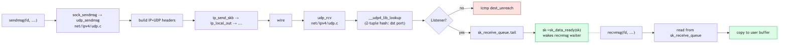

# Day 14 — UDP: the simple protocol

> **Today's mission:** trace a UDP packet from `sendmsg` to receiving app on the peer. Total time: ~60 minutes.

## Why UDP first

UDP is simpler than TCP — no state machine, no retransmissions, no congestion control. One sendmsg = one wire packet (or one fragmented packet). One recv = one datagram. Understanding UDP gives you the L4 baseline; TCP adds *everything else* on top.



## TX side

```c
udp_sendmsg(sk, msg, len)        // net/ipv4/udp.c
  → ip_make_skb / ip_append_data
  → udp_send_skb
  → ip_send_skb → ip_local_out → ...
```

If `MSG_CONFIRM` is set, neighbour confirmation is bumped (avoids ARP-revalidation churn). Otherwise it's just header build + IP output.

## RX side

```c
udp_rcv(skb)                      // ip dispatcher calls this
  → __udp4_lib_lookup → match destination port
  → udp_queue_rcv_skb
    → sock_queue_rcv_skb_reason — append to sk_receive_queue
    → sk->sk_data_ready(sk)       — wake recvmsg waiter
```

Lookup is keyed mostly by destination port (single-tuple, since UDP is connectionless). Connected UDP sockets (`connect()` on a SOCK_DGRAM) get 4-tuple matches.

## Today's experiment

```bash
# Server side:
nc -ul 9999 &

# Client side:
echo "hello" | nc -u 127.0.0.1 9999

# Trace
sudo bpftrace -e '
fentry:udp_sendmsg { printf("send %d bytes\n", args->len); }
fentry:udp_rcv     { printf("recv on %p\n", args->skb); }
'
```

## Bullet Points

- UDP code is in **`net/ipv4/udp.c`** (and `udp_input.c`, `udp_offload.c`).
- TX: `udp_sendmsg` → `ip_make_skb` → `ip_send_skb`.
- RX: `udp_rcv` → port lookup → enqueue on `sk_receive_queue` → wake.
- No state machine, no buffering between sends — each datagram is independent.
- Lookups: `__udp4_lib_lookup` for IPv4. Hash by dest port primarily.
- **`MSG_DONTWAIT`** for non-blocking; recv returns `EAGAIN` if queue empty.

## Check question

Why does UDP have a per-socket receive queue (`sk_receive_queue`) but no send queue?

<details>
<summary>Click to reveal answer</summary>

**Answer:** Because UDP doesn't buffer outbound — each `sendmsg` builds an skb and immediately enters the IP output path; nothing is held back at the socket. TCP holds skbs in `sk_write_queue` because it must retransmit them later. UDP can't retransmit (no ACKs), so there's no reason to keep the skb around once IP has it.

</details>

## Tomorrow

Day 15: TCP state machine.
