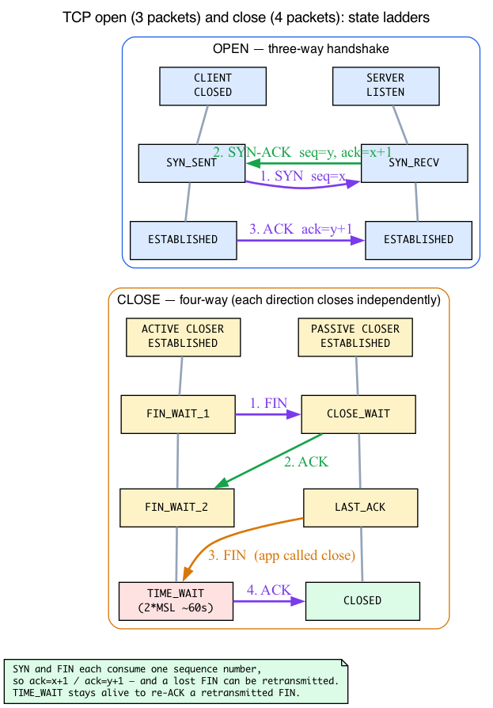

# Day 15 — TCP state machine

> **Today's mission:** trace a TCP connection through every state. First learn the *bytes* that drive the transitions — the TCP header and its control flags — then the three- and four-packet choreography that moves the states, then the TIME_WAIT minisock that explains the chapter's best puzzle. Understand why TIME_WAIT exists, why FIN_WAIT_2 sometimes hangs, and how the kernel implements every transition. Total time: ~110 minutes.

## What "state machine" really means here

TCP is a connection-oriented protocol — every connection has *state* that both ends maintain through its lifetime. The states encode "what's the next legal thing this connection can do?" The state transitions happen in response to:

- Application calls (`connect`, `listen`, `accept`, `close`).
- Received segments (SYN, SYN-ACK, ACK, FIN, RST).
- Timer events (RTO firing, 2MSL elapsed).

The whole apparatus is in `tcp_rcv_state_process` (`net/ipv4/tcp_input.c:7119`) for incoming-segment-driven transitions, and in `tcp_set_state` (`net/ipv4/tcp.c:2961`) for explicit state changes from anywhere. Reading those two functions teaches you 80% of TCP control flow.

But there's a gap in that bullet list that almost every TCP tutorial leaves open. The middle item — "received segments (SYN, SYN-ACK, ACK, FIN, RST)" — names five *events*, and the whole rest of this chapter is a machine driven by them. Yet what *is* a SYN? Where does it live? Is "SYN-ACK" one packet or two? Before we can talk about states, we have to talk about the bytes that trip the transitions. That's where we start.

## Background 1: The TCP segment and its control flags

Day 3 taught the socket side of TX — `sendmsg`, the write queue, `snd_nxt`. Today we look at what actually goes on the wire and, crucially, at the handful of bits in it that the state machine reacts to.

### Intuition first: flags are bits, not packet types

A TCP *segment* is just a TCP header followed by optional options and then payload bytes. The header is a fixed **20 bytes** (more if options are present). Buried in it is a set of **single-bit control flags**. The state machine doesn't react to "a SYN packet" the way you'd react to a differently-shaped envelope in the mail — it reacts to *which bits are set* in the one and only kind of TCP header.

This is the single most important thing to internalize today: **SYN, ACK, FIN, RST, PSH are independent bits.** They are not mutually-exclusive packet types. One segment can set several at once:

- **SYN-ACK** is not two packets — it's *one* segment with both the SYN bit and the ACK bit set.
- The final packet of the handshake is a **bare ACK** (only the ACK bit set).
- A FIN almost never travels alone — it rides with ACK, so on the wire you see **FIN+ACK**. (Every segment after the handshake sets ACK, because TCP piggybacks acknowledgements on everything.)

What each bit means to the state machine:

- **SYN** — "open." Synchronise sequence numbers; only seen during connection setup.
- **ACK** — "this segment acknowledges data I've received." Set on essentially everything after the first SYN.
- **FIN** — "I'm done sending; graceful close of my half."
- **RST** — "abort, immediately." No graceful dance, no acknowledgement expected.
- **PSH** — "push this to the application now"; doesn't drive states.
- **URG / ECE / CWR / AE** — urgent pointer and ECN/AccECN signalling; not relevant to the state machine.

### The concrete struct: `struct tcphdr`

Here is the actual on-the-wire header in v7.1 (`include/uapi/linux/tcp.h:25`, little-endian layout shown):

```c
struct tcphdr {
    __be16  source;
    __be16  dest;
    __be32  seq;        /* sequence number of the first payload byte    */
    __be32  ack_seq;    /* next byte I expect from you (set when ack=1)  */
    __u16   ae:1,
            res1:3,
            doff:4,     /* data offset: header length in 32-bit words    */
            fin:1,
            syn:1,
            rst:1,
            psh:1,
            ack:1,
            urg:1,
            ece:1,
            cwr:1;
    __be16  window;
    __sum16 check;
    __be16  urg_ptr;
};
```

The flags are literally those `:1` bitfields — `fin:1, syn:1, rst:1, psh:1, ack:1`. The two `__be32` fields above them, `seq` and `ack_seq`, are the heart of the protocol: `seq` numbers the bytes I'm sending, `ack_seq` tells you the next byte I expect from you.

![The 20-byte TCP header and its flags field (tcp[12-13])](diagrams/day15_tcp_header.png)

### Two ways the kernel reads the flags

The kernel touches these flags in two different ways, and you'll see both when you read the code:

1. **Straight off the wire bitfield.** Code with a `struct tcphdr *th` in hand reads `th->syn`, `th->fin`, `th->rst`, etc. directly. There's also a helper, `tcp_flags_ntohs(th)` (`include/net/tcp.h:1062`), that pulls all the flag bits out as one host-order value.

2. **Pre-extracted into the skb control block.** Recall the `cb[48]` scratchpad from Day 1 — the per-packet area each layer stashes state in. TCP overlays it with `struct tcp_skb_cb`, reached via the `TCP_SKB_CB(skb)` macro (`include/net/tcp.h:1149`). Early on the input path the flags byte is copied into `TCP_SKB_CB(skb)->tcp_flags` — a `__u16` commented "TCP header flags (tcp[12-13])" (`include/net/tcp.h:1115`) — so the rest of the input path can `switch` on flags cheaply without re-parsing the header.

Each named bit has a `BIT()` constant for masking (`include/net/tcp.h:1050-1054`):

```c
#define TCPHDR_FIN  BIT(0)
#define TCPHDR_SYN  BIT(1)
#define TCPHDR_RST  BIT(2)
#define TCPHDR_PSH  BIT(3)
#define TCPHDR_ACK  BIT(4)
```

### The fact the whole chapter silently leans on: SYN and FIN consume a sequence number

A pure ACK carries no payload and occupies no place in the byte stream — it just reports a number. But **SYN and FIN each consume one sequence number**, exactly as if they were a single phantom byte of data. This is not a quirk; it's the mechanism that makes graceful close *reliable*:

- Because a FIN sits at a real sequence slot, the peer can **acknowledge it specifically** (its ACK names the byte after the FIN).
- Because it's acknowledged, it can be **retransmitted** if the ACK is lost, just like any other byte (recall `snd_nxt` from Day 3 — the FIN advances it by one).

Hold onto this. It's *the* reason TIME_WAIT's "stay alive to ACK a retransmitted FIN" guarantee works later in the chapter.

### RST is the exception to all of it

`RST` is special: it carries **no payload**, occupies no sequence slot, and is **not acknowledged**. It doesn't participate in the graceful FIN dance at all — it tears the connection down on the spot. That's exactly why, when an application calls `close()` with unread data still in the receive queue, `__tcp_close` sends an **RST instead of a FIN** (you'll see this in "What to read"): there's no point gracefully draining a connection nobody is listening to.

## The eleven states


Defined in `include/net/tcp_states.h:13`:

```c
enum {
    TCP_ESTABLISHED = 1,
    TCP_SYN_SENT,
    TCP_SYN_RECV,
    TCP_FIN_WAIT1,
    TCP_FIN_WAIT2,
    TCP_TIME_WAIT,
    TCP_CLOSE,
    TCP_CLOSE_WAIT,
    TCP_LAST_ACK,
    TCP_LISTEN,
    TCP_CLOSING,
    TCP_NEW_SYN_RECV,
    TCP_BOUND_INACTIVE,
};
```

(The last two are internal sub-states — NEW_SYN_RECV is a half-open SYN entry on the listener; BOUND_INACTIVE is a recently-bound socket with no listen yet.)

The *order* of this enum is not cosmetic — it's the integer wire the bpftrace experiment decodes later: `TCP_ESTABLISHED=1`, `TCP_SYN_SENT=2`, `TCP_SYN_RECV=3`, and so on. Keep the numbers in view; you'll be reading them raw off a probe in a few sections.

### The connection-establishment states

- **CLOSED** — no connection. Initial and final state.
- **LISTEN** — passive open: the server's listening socket. Waits for incoming SYNs.
- **SYN_SENT** — active open: client sent SYN, waiting for SYN-ACK.
- **SYN_RECV** — server received SYN, sent SYN-ACK, waiting for the ACK that completes the 3-way handshake.
- **ESTABLISHED** — handshake complete, data flowing.

### Background 2: the three-way handshake, packet by packet

The chapter's state diagram drops you straight into `CLOSED → SYN_SENT → ESTABLISHED` and the server's `LISTEN → SYN_RECV → ESTABLISHED`, as if the open exchange were already obvious. It isn't — so here are the three packets that actually move those edges.

Day 13 already taught the **socket-side plumbing**: `connect()` sends the SYN and puts the client in SYN_SENT; `listen()` builds the accept queue; the half-open handshake lives in the ehash as a `TCP_NEW_SYN_RECV` request sock; and `accept()` pops a completed connection. That's the machinery — recall it from Day 13. What's new today is the **on-the-wire choreography**.

Open is **three packets**:

1. **Client → server: SYN**, `seq=x`. (Client enters SYN_SENT.)
2. **Server → client: SYN-ACK**, `seq=y, ack=x+1`. (Server creates the half-open entry and sends this; note `ack=x+1` because the SYN consumed sequence number `x`.)
3. **Client → server: ACK**, `ack=y+1`. (Server moves to ESTABLISHED on receiving it; client moved to ESTABLISHED the moment the SYN-ACK arrived.)

The real *purpose* of this dance is not politeness — it's that **each side learns the other's initial sequence number** (`x` and `y`). Without that exchange neither end knows where the other's byte stream begins.

Map each packet to a state edge:

| Packet | Who moves | Edge |
|--------|-----------|------|
| SYN sent | client | CLOSED → SYN_SENT |
| SYN received | server | LISTEN → (half-open) → sends SYN-ACK |
| SYN-ACK received | client | SYN_SENT → ESTABLISHED |
| final ACK received | server | SYN_RECV → ESTABLISHED |

That is the *left half* of the state diagram made concrete. The **close** mirrors it, but with FINs, and it takes **four** packets (FIN, ACK, FIN, ACK) rather than three — because each direction closes *independently*. That asymmetry is the whole reason the close half of the diagram is a messy diamond of states rather than a single edge; we get to it next.

In the kernel, `tcp_rcv_state_process` (`net/ipv4/tcp_input.c:7119`) dispatches on the connection's *current* state and only then inspects the flags. The `TCP_SYN_SENT` and `TCP_SYN_RECV` cases (the switch is at `tcp_input.c:7128`, with `case TCP_LISTEN` at `:7133`) are the bulk of the function precisely because handshake completion is the most intricate part of TCP control flow.



### The graceful-close states

TCP's connection close is *bidirectional*: each direction can shut down independently (a "half-close"). This produces the messy diamond of close states. It's a four-packet exchange — each side sends its own FIN and acknowledges the other's.

The side that calls `close()` first goes:

- **FIN_WAIT_1** — sent FIN, waiting for ACK or peer's FIN.
- **FIN_WAIT_2** — peer ACKed our FIN; waiting for peer's FIN.
- **TIME_WAIT** — peer's FIN received; ACKed; we wait 2\*MSL (twice the Maximum Segment Lifetime) before fully closing.

The side that receives the close goes:

- **CLOSE_WAIT** — received FIN; app hasn't called `close()` yet.
- **LAST_ACK** — app called `close()`; we sent our FIN; waiting for ACK.

If both sides close simultaneously, you can hit:

- **CLOSING** — sent FIN, peer's FIN arrived before our ACK; both sides are now closing.

## Drivers of state changes

### Application-initiated

| Call | Effect |
|------|--------|
| `socket()` + `listen()` | CLOSED → LISTEN |
| `connect()` | CLOSED → SYN_SENT (sends SYN) |
| `close()` from ESTABLISHED | ESTABLISHED → FIN_WAIT_1 (sends FIN) |
| `close()` from CLOSE_WAIT | CLOSE_WAIT → LAST_ACK (sends FIN) |
| `shutdown(SHUT_WR)` | half-close: same as close but socket stays open for reads |

### Segment-driven

The big function is `tcp_rcv_state_process` (`net/ipv4/tcp_input.c:7119`). It dispatches by current state, then handles flags (the very `th->syn`/`th->fin`/`TCP_SKB_CB(skb)->tcp_flags` bits from Background 1). Pseudocode:

```c
switch (sk->sk_state) {
case TCP_LISTEN:    handle SYN -> create child sock in NEW_SYN_RECV
case TCP_SYN_SENT:  handle SYN-ACK -> ESTABLISHED, send ACK
case TCP_SYN_RECV:  handle ACK -> ESTABLISHED
default:            handle FIN, RST, ACKs that drive close states
}
```

For non-trivial states (ESTABLISHED, FIN_WAIT_*) it falls through to `tcp_data_queue` for normal data delivery and runs the close-state transitions when a FIN arrives.

### Timer-driven

- **SYN-ACK retransmit timer**: in SYN_SENT and SYN_RECV, the SYN/SYN-ACK is retransmitted with exponential backoff if no progress.
- **Retransmit timer (RTO)**: in ESTABLISHED, fires when an ACK is overdue (Day 17).
- **TIME_WAIT timer (2*MSL)**: ~60s on Linux, hardcoded to `TCP_TIMEWAIT_LEN` (`60*HZ`, `include/net/tcp.h:140`) and not configurable. This is separate from `net.ipv4.tcp_fin_timeout`, which (despite its name) controls the FIN_WAIT_2 timeout, not TIME_WAIT.
- **Keepalive timer** (if `SO_KEEPALIVE`): probes idle connections.

## Why TIME_WAIT exists

TIME_WAIT is the most-asked-about TCP state. Two reasons:

1. **Make sure our last ACK reaches the peer.** If our final ACK is lost, the peer's `LAST_ACK` retransmits its FIN. We need to be in TIME_WAIT — still able to send an ACK — to handle that retransmit. If we'd already moved to CLOSED, we'd reply with RST, which the peer would interpret as an error. *(This is exactly where Background 1's "a FIN consumes a sequence number, so it can be individually acknowledged and retransmitted" pays off — the retransmitted FIN is a real, ACK-able segment.)*
2. **Prevent old packets from a previous incarnation of the 4-tuple from being delivered to a new connection.** Without TIME_WAIT, a freshly-opened connection on the same 4-tuple might receive late-arriving packets from the old connection. MSL (Maximum Segment Lifetime, ~30s) is the maximum lifetime of a single in-flight packet, bounded by IP TTL and router queueing. TIME_WAIT holds for **2\*MSL** (~60s on Linux) to cover a full round trip — the active closer's final ACK can take up to one MSL to reach the peer, and if it is lost the peer's retransmitted FIN takes up to another MSL to come back. After 2\*MSL, every old duplicate in both directions has certainly drained.

### There are no Dumb Questions

> **Q: Is SYN-ACK one packet or two?**
>
> A: One. It's a single TCP segment with *two* control bits set — the SYN bit and the ACK bit — in the one flags field every header carries (Background 1). "SYN-ACK" names a bit combination, not a packet type; there is no separate ACK packet in the handshake's middle step.
>
> **Q: `tcp_fin_timeout` sounds like it controls TIME_WAIT — why doesn't it?**
>
> A: The name is misleading. `net.ipv4.tcp_fin_timeout` bounds how long we sit in **FIN_WAIT_2** waiting for the peer's FIN. TIME_WAIT's duration is the hardcoded `TCP_TIMEWAIT_LEN` (`60*HZ`), not a sysctl — you cannot tune it without recompiling.
>
> **Q: Why 2\*MSL and not 1\*MSL?**
>
> A: Because the worst case is a full *round trip*, not a one-way trip. Our final ACK may take up to one MSL to reach the peer; if it's lost, the peer's retransmitted FIN takes up to another MSL to come back. Waiting 2\*MSL guarantees we're still around to re-ACK that FIN, and that every stray duplicate in both directions has expired.

### Background 3: the TIME_WAIT minisock

Here's a subtlety that the chapter's headline experiment hinges on, and it's worth its own section: **the socket that enters TIME_WAIT is not the socket you started with.**

When a connection enters TIME_WAIT, the kernel does **not** keep the full `struct sock` — with its send/receive queues, congestion state, and the rest — pinned in memory for 60 seconds. That would be enormously wasteful on a busy server. Instead it allocates a tiny, stripped-down object: a `struct inet_timewait_sock` (`include/net/inet_timewait_sock.h:33`), commonly called a **minisock**.

The minisock holds only what's needed to recognise and correctly ACK a retransmitted FIN:

- the connection's **4-tuple** (so the ehash lookup still finds it),
- the last **sequence/ack numbers** (`tw_rcv_nxt`, `tw_snd_nxt`),
- **timestamps** (for PAWS / `tcp_tw_reuse`),
- the **death-row timer** hook that fires after `TCP_TIMEWAIT_LEN`.

The conversion lives in `tcp_time_wait` (`net/ipv4/tcp_minisocks.c:326`). Read it and you'll see the shape exactly:

1. `tw = inet_twsk_alloc(...)` builds the minisock.
2. It copies `tcptw->tw_rcv_nxt = tp->rcv_nxt`, `tcptw->tw_snd_nxt = tp->snd_nxt`, the timestamps, etc.
3. For a true TIME_WAIT it sets `timeo = TCP_TIMEWAIT_LEN`.
4. `inet_twsk_hashdance_schedule(...)` hashes the minisock into the ehash **in place of** the original socket and arms its timer.
5. Finally — and this is the punchline — `tcp_done(sk)` finishes the *original* socket, setting it to **TCP_CLOSE** (state 7).

So after entering TIME_WAIT, two things are true at once: a **minisock** sits in the ehash in state `TCP_TIME_WAIT` (6), and the **original full socket** has been set to `TCP_CLOSE` (7) and is on its way to being freed. This is why today's `bpftrace` on the original socket's `tcp_set_state` shows `… → 5 → 7` and **never** `→ 6`: state 6 lives on a *different object* the probe isn't watching. Keep that in your pocket — it's the experiment's "aha."

This also gives the **cost** of TIME_WAIT a concrete shape: each TIME_WAIT consumes one small minisock plus one ehash slot. That's why a busy short-connection server (HTTP, microservices) accumulates tens of thousands of them, and why there's a cap — `tcp_max_tw_buckets` — on the total.

And there's a failure mode worth knowing: if `inet_twsk_alloc` **fails** (out of memory, or the bucket cap is hit), there is no minisock to retransmit-ACK with. The `else` branch in `tcp_time_wait` simply bumps `NET_INC_STATS(net, LINUX_MIB_TCPTIMEWAITOVERFLOW)` and falls through to `tcp_done(sk)` — the connection **skips TIME_WAIT entirely** and closes immediately, sending no RST. That counter is exactly what you'll hammer in the "What to break" lab.

### TIME_WAIT cost

Recall from Background 3 that each TIME_WAIT costs one small minisock plus one ehash slot — so a busy short-connection server (HTTP, microservices) can accumulate tens of thousands of them. The mitigations:

- **`SO_REUSEADDR`** lets a new socket bind even if a recent connection's TIME_WAIT entry occupies the 4-tuple.
- **`net.ipv4.tcp_max_tw_buckets`** caps the global TIME_WAIT count. Overflow follows the exact skip-TIME_WAIT path from Background 3 (no minisock, no RST; `TCPTimeWaitOverflow` increments). The default is `ehash_entries / 2`, so it scales with system memory (often tens to hundreds of thousands).
- **`net.ipv4.tcp_tw_reuse=1`** lets the kernel reuse TIME_WAIT sockets for new outgoing connections (uses TCP timestamps to ensure no overlap). Safe for client-side; doesn't affect listening sockets.
- (~~`tcp_tw_recycle`~~ was removed in 4.12 — was unsafe behind NAT.)

### FIN_WAIT_2 and the 60-second timeout

If a peer ACKs our FIN but never sends its own FIN (perhaps the application is hung), we sit in FIN_WAIT_2. To avoid leaking, the kernel times out after `net.ipv4.tcp_fin_timeout` seconds (default 60) and force-closes. This is why "broken peers" don't break us forever.

## Today's experiment

```bash
# Watch state in real time
watch -n 0.5 'ss -tan'

# In another terminal
nc -l 9999 &
sleep 0.5
nc localhost 9999      # both ends in ESTAB
# In each: Ctrl-D to close

# You'll see:
# initial:   LISTEN (server)
# connect:   ESTAB (both)
# nc client closes:  FIN_WAIT_2 (client) / CLOSE_WAIT (server) briefly
# nc server closes:  TIME_WAIT (client) / CLOSED (server)
# 60s later: TIME_WAIT entry expires
```

Trace state transitions. This probe fires for every socket system-wide but nothing drives it on an idle box, so **leave it running and, in another terminal, re-run the `nc -l 9999 &` / `echo q | nc -q 0 localhost 9999` listener+client pair from the [force-close block](#force-close-to-see-time_wait) below** to provoke transitions. The `interval:s:10` bound makes it exit cleanly after 10s:

```bash
sudo bpftrace -e '
fentry:tcp_set_state {
  printf("sk=%p state=%d -> %d\n", args->sk, args->sk->__sk_common.skc_state, args->state);
}
interval:s:10 { exit(); }'
```

The integers are the `tcp_states.h` enum values from above: `1`=ESTABLISHED, `2`=SYN_SENT, `3`=SYN_RECV, `4`=FIN_WAIT1, `5`=FIN_WAIT2, `6`=TIME_WAIT, `7`=CLOSE, `8`=CLOSE_WAIT, `9`=LAST_ACK. Because the probe is system-wide you'll see the client's and the server's transitions interleaved, each tagged with the kernel's `sk` pointer. A client connect/close prints roughly:

```
sk=0xffff…  state=7 -> 2    # CLOSE -> SYN_SENT       (client connect)
sk=0xffff…  state=2 -> 1    # SYN_SENT -> ESTABLISHED
sk=0xffff…  state=1 -> 4    # ESTABLISHED -> FIN_WAIT1  (active closer)
sk=0xffff…  state=4 -> 5    # FIN_WAIT1 -> FIN_WAIT2
sk=0xffff…  state=5 -> 7    # FIN_WAIT2 -> CLOSE
```

Note you will **not** see a transition into TIME_WAIT (state `6`) here — the chapter's headline state. This is Background 3 made visible: entering TIME_WAIT spins up a separate **minisock** and calls `tcp_done()`, which sets the *original* socket to TCP_CLOSE (`7`). So `tcp_set_state` on the full socket goes `… -> 5 -> 7`, never `-> 6` — state 6 lives on the minisock, a different object the probe isn't attached to. To watch TIME_WAIT itself, use `ss -tan` as below.

### Force-close to see TIME_WAIT

```bash
# Server accepts one connection then exits; client (nc -q 0) closes first -> client TIME_WAIT
nc -l 9999 &
sleep 0.1
echo q | nc -q 0 localhost 9999

# Immediately:
ss -tan | grep 9999
# tcp  TIME-WAIT  0  0  127.0.0.1:NNNN  127.0.0.1:9999   # Local = ephemeral client port, Peer = :9999
```

Observe: the client is the active closer (`nc -q 0` closes as soon as stdin hits EOF), so its ephemeral port sits in TIME_WAIT for ~60s — note `ss` prints `Local Address:Port` first, then `Peer Address:Port`, so the ephemeral port is `Local` and `:9999` is `Peer`. Plain `nc -l` accepts a single connection and exits when it closes, so only the client's TIME-WAIT remains (no LISTEN row). The server side returns to CLOSED immediately.

## What to break

- **Set `tcp_fin_timeout=5`**, then drive a connection into FIN_WAIT_2 — a state you reach only when the peer ACKs your FIN but never sends its own. A plain `nc` close won't do it (the peer reciprocates with its own FIN), so use a listener that accepts but never closes:

  ```bash
  sudo sysctl -w net.ipv4.tcp_fin_timeout=5

  # Listener that accepts but never closes (its kernel ACKs the FIN; the app sends none back):
  python3 -c 'import socket,time; s=socket.socket(); s.setsockopt(socket.SOL_SOCKET,socket.SO_REUSEADDR,1); s.bind(("127.0.0.1",9999)); s.listen(); c,_=s.accept(); time.sleep(600)' &
  sleep 0.3

  # Client connects then closes its write side -> FIN_WAIT_1, then FIN_WAIT_2 after the server's ACK:
  exec 3<>/dev/tcp/127.0.0.1/9999; exec 3>&-

  watch -n0.5 'ss -tan state fin-wait-2'   # the FIN_WAIT_2 row appears, then vanishes after ~5s

  sudo sysctl -w net.ipv4.tcp_fin_timeout=60   # restore the default
  ```

  Useful for diagnosing connection leaks.
- **Hammer `tcp_max_tw_buckets`**: cap the global TIME_WAIT count and watch the overflow counter climb. This is the `LINUX_MIB_TCPTIMEWAITOVERFLOW` path from Background 3 — once the cap is hit, `inet_twsk_alloc` is refused, no minisock is built, and the close skips TIME_WAIT. Capture the default first so you can restore it:

  ```bash
  orig=$(cat /proc/sys/net/ipv4/tcp_max_tw_buckets)
  sudo sysctl -w net.ipv4.tcp_max_tw_buckets=100

  nc -l -k 9999 &                              # persistent listener (OpenBSD nc -k)
  nstat -az TcpExtTCPTimeWaitOverflow          # baseline (-z shows zero-valued counters)
  for i in $(seq 1 500); do echo q | nc -q 0 localhost 9999; done
  nstat -az TcpExtTCPTimeWaitOverflow          # the count has risen (e.g. ~400)

  sudo sysctl -w net.ipv4.tcp_max_tw_buckets=$orig   # restore
  kill %1                                            # stop the listener
  ```

  Once the cap is hit, new closes skip TIME_WAIT and close immediately (no RST is sent), so `ss -tan | grep TIME-WAIT | wc -l` stays low — the rising `TCPTimeWaitOverflow` counter, not the visible TIME_WAIT count, is the reliable signal.
- **Try `tcp_tw_reuse=1`** for outgoing-only workloads: it lets the kernel reuse local TIME_WAIT slots for new *outgoing* connections (requires TCP timestamps), relieving bucket pressure for clients that connect frequently to the same server (test clients, benchmarking tools). Make it observable:

  ```bash
  sudo sysctl -w net.ipv4.tcp_tw_reuse=1
  nc -l -k 9999 &
  watch -n0.5 'ss -tan state time-wait | wc -l'   # in one terminal
  # in another, open many short outgoing connections to the same server:
  for i in $(seq 1 2000); do echo q | nc -q 0 localhost 9999; done
  # the TIME_WAIT count stays bounded as the kernel reuses slots for new connects
  sudo sysctl -w net.ipv4.tcp_tw_reuse=2          # restore the default
  ```

## What to read in the kernel

- **`include/uapi/linux/tcp.h:25`** — `struct tcphdr`. The on-the-wire header. See the `fin:1, syn:1, rst:1, psh:1, ack:1` bitfields and the `seq`/`ack_seq` `__be32`s above them. This is where the state machine's events physically live.

- **`include/net/tcp.h:1050`** — the `TCPHDR_*` `BIT()` flag constants, `tcp_flags_ntohs` (`:1062`), and `struct tcp_skb_cb`'s `tcp_flags` field (`:1115`) reached via `TCP_SKB_CB(skb)` (`:1149`). This is the pre-extracted-flags path the input code switches on.

- **`include/net/tcp_states.h:13`** — the state enum. Tiny file (~50 lines). Read it to know the canonical names and the integer order the bpftrace decode relies on.

- **`net/ipv4/tcp_input.c:7119`** — `tcp_rcv_state_process`. The big state-machine function (~300 lines including all branches). Read it once with the diagram open. Notice: it dispatches by current state (`switch (sk->sk_state)`) and handles each state's possible incoming events. The bulk is the SYN_SENT and SYN_RECV cases (handshake completion); the other states share a fall-through to data processing plus close-flag handling.

- **`net/ipv4/tcp.c:2961`** — `tcp_set_state`. The explicit state change function. Note the per-state SNMP counter increments (`TCP_INC_STATS`); this is how `nstat` reports `Tcp.CurrEstab`, etc. Also note the ehash insert/remove on transitions to/from ESTABLISHED.

- **`net/ipv4/tcp.c:3310`** — `tcp_close`. What happens when the application calls `close()`. This is a thin wrapper; read the substantive ~170-line implementation in `__tcp_close` (`net/ipv4/tcp.c:3138`) end-to-end. Notice the LINGER handling, the multi-step state transitions (ESTABLISHED → FIN_WAIT_1, etc.), and the inline receive-queue flush: it walks `skb_peek(&sk->sk_receive_queue)` freeing any unread skbs, and if data was still unread it sends an **RST** instead of a graceful FIN (`data_was_unread` → `tcp_send_active_reset`) — the RST-vs-FIN choice from Background 1.

- **`net/ipv4/tcp_ipv4.c:2068`** — `tcp_v4_rcv`. The IP-layer entry. Looks up the sock via the ehash (4-tuple match) and dispatches into the state machine. Read this to see how a packet arrives, gets associated with a sock, and proceeds.

- **`net/ipv4/tcp_minisocks.c:326`** — `tcp_time_wait`, the minisock conversion from Background 3. TIME_WAIT sockets are *reduced* sock objects (`struct inet_timewait_sock`, `include/net/inet_timewait_sock.h:33`) holding just enough to ACK retransmitted FINs. Watch it copy `tw_rcv_nxt`/`tw_snd_nxt`, hashdance the minisock into the ehash, bump `LINUX_MIB_TCPTIMEWAITOVERFLOW` on alloc failure, and finish the original sock with `tcp_done(sk)`.

- **`net/ipv4/tcp_timer.c`** — all TCP timers. `tcp_keepalive_timer`, `tcp_compressed_ack_kick`, etc. Useful when a state is stuck and you wonder which timer should be advancing it.

- **`Documentation/networking/ip-sysctl.rst`** (TCP section) and **`Documentation/networking/proc_net_tcp.rst`** — sysctl reference and the `/proc/net/tcp` format. Brief.

## Bullet Points

- A **TCP segment** is a 20-byte `struct tcphdr` (`include/uapi/linux/tcp.h:25`) + options + data. The state machine reacts to **independent single-bit flags** in it — `syn`, `ack`, `fin`, `rst`, `psh` — so **SYN-ACK is one segment with two bits set**, the final handshake packet is a bare ACK, and FIN rides as FIN+ACK.
- The kernel reads flags two ways: off the wire (`th->syn`, `tcp_flags_ntohs`) and pre-extracted in `TCP_SKB_CB(skb)->tcp_flags`. The `TCPHDR_*` `BIT()` constants name each bit (`include/net/tcp.h:1050`).
- **SYN and FIN each consume one sequence number** — that's what lets a FIN be individually ACKed and retransmitted, which underpins TIME_WAIT. **RST** consumes none, isn't ACKed, and aborts immediately.
- **Open = 3 packets** (SYN → SYN-ACK → ACK); **close = 4 packets** (FIN, ACK, FIN, ACK), because each direction closes independently — hence the diamond of close states.
- **11 TCP states** in `include/net/tcp_states.h`. ESTABLISHED is the steady state; rest are open or close transitions.
- **`tcp_rcv_state_process`** drives segment-driven transitions; **`tcp_set_state`** does explicit changes.
- **TIME_WAIT** runs on a **minisock** (`inet_timewait_sock`), not the original `struct sock`; the original is set to `TCP_CLOSE` via `tcp_done()`. Holds for `2*MSL` (~60 s, `TCP_TIMEWAIT_LEN`). Two purposes: (1) ACK retransmitted FIN, (2) prevent reincarnation overlap.
- **`tcp_fin_timeout`** controls FIN_WAIT_2 timeout (default 60), *not* TIME_WAIT.
- **`tcp_max_tw_buckets`** caps global TIME_WAIT count; overflow bumps `TCPTimeWaitOverflow` and skips TIME_WAIT (no minisock, no RST).
- **`tcp_tw_reuse=1`** lets clients reuse TIME_WAIT slots for new connects (safe).
- **Inspect** with `ss -tan`. Trace transitions with `bpftrace fentry:tcp_set_state` (remember: you won't see state 6 on the original sock).

## Check question

Why does TIME_WAIT exist? What problem does it solve, and why specifically 2*MSL seconds?

<details>
<summary>Click to reveal answer</summary>

**Answer:** Two distinct problems. **(1) Final-ACK reliability.** When we close, our final ACK might be lost; the peer (in LAST_ACK) will retransmit its FIN. To respond with another ACK we must still exist as a TCP entity — TIME_WAIT keeps us responsive. If we'd already moved to CLOSED, we'd send RST, which the peer would interpret as an error. (This works because a FIN consumes a sequence number, so it's a real, acknowledge-able, retransmittable segment.) **(2) Reincarnation safety.** A new connection on the same 4-tuple could be created shortly after the old one closes. If old packets are still in flight in the network, they could be misdelivered to the new connection. Here MSL ("Maximum Segment Lifetime", ~30s) is the worst-case time a *single* segment can survive in the network (bounded by IP TTL and router queueing). TIME_WAIT waits **2\*MSL** (~60s on Linux) — one full round trip — because the active closer's final ACK can take up to one MSL to arrive, and if it is lost the peer's retransmitted FIN takes up to another MSL to come back. After 2\*MSL, every old duplicate in both directions has certainly been discarded; the 4-tuple is safe to reuse.

</details>

---

## Tomorrow

Day 16: TCP congestion control. CUBIC, BBR, and the framework that lets you swap algorithms.
