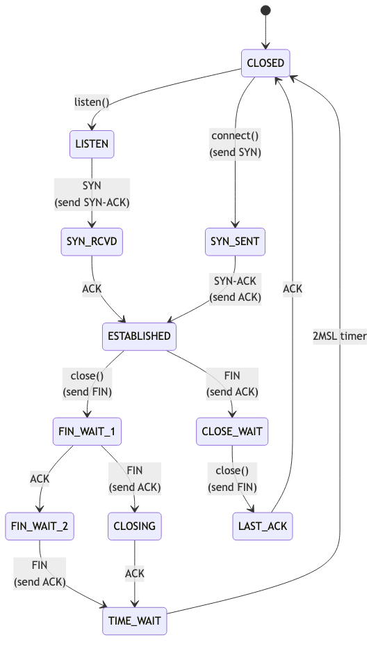

# Day 15 — TCP state machine

> **Today's mission:** trace a TCP connection through every state — open, data, close. Watch the state transitions live with `ss`. Total time: ~75 minutes.

## The states



Eleven states defined in `enum tcp_state` (`include/net/tcp_states.h`):

- **CLOSED** — no connection.
- **LISTEN** — server waiting for SYN.
- **SYN_SENT** — client sent SYN, waiting for SYN-ACK.
- **SYN_RCVD** — server received SYN, sent SYN-ACK, waiting for ACK.
- **ESTABLISHED** — connection up.
- **FIN_WAIT_1, FIN_WAIT_2** — graceful close, waiting for peer's FIN.
- **CLOSE_WAIT** — peer FIN received, waiting for app to close.
- **CLOSING** — simultaneous close.
- **LAST_ACK** — closing side waiting for final ACK.
- **TIME_WAIT** — wait 2MSL to be sure peer got the ACK.

## State transitions

Driven by `tcp_rcv_state_process` (`net/ipv4/tcp_input.c`). For each ACK/SYN/FIN/RST received, the function dispatches based on current state and segment flags. ESTABLISHED is the steady state; everything else is open or close transitions.

## Today's experiment

```bash
# Watch state in real time:
watch -n 0.5 'ss -tan'

# In another terminal:
nc -l 9999 &
nc localhost 9999
# you'll see LISTEN → SYN_RECV → ESTAB
# Ctrl-D both sides → FIN_WAIT, CLOSE_WAIT, TIME_WAIT
```

Trace state transitions:
```bash
sudo bpftrace -e 'fentry:tcp_set_state {
  printf("state %d\n", args->state);
}'
```

## What to read in the kernel

- **`net/ipv4/tcp_input.c`** — `tcp_rcv_state_process` (the state machine).
- **`net/ipv4/tcp.c`** — `tcp_set_state`, `tcp_close`.
- **`include/net/tcp_states.h`** — the enum.
- **`Documentation/networking/tcp.rst`** — official guide.

## Bullet Points

- 11 TCP states. ESTABLISHED is steady; rest are transitions.
- **TIME_WAIT** holds for 2*MSL (default 60s on Linux). Many short connections → many TIME_WAIT sockets.
- **`net.ipv4.tcp_fin_timeout`** controls FIN_WAIT_2 timeout (default 60s).
- **`net.ipv4.tcp_max_tw_buckets`** caps TIME_WAIT count.
- The state machine is `tcp_rcv_state_process` — read it once.

## Check question

Why does TIME_WAIT exist? What problem does it solve?

<details>
<summary>Click to reveal answer</summary>

**Answer:** Two: **(1)** Ensure the closing side's final ACK is received. If lost, peer retransmits FIN; you need to be in TIME_WAIT to ACK that retransmit (otherwise you'd send RST). **(2)** Prevent old packets from a previous incarnation of the (4-tuple) being delivered to a new connection. 2*MSL = ~1 minute is roughly the maximum lifetime of an in-flight IP packet; after that, old packets have certainly been discarded by routers.

</details>

## Tomorrow

Day 16: TCP congestion control.
