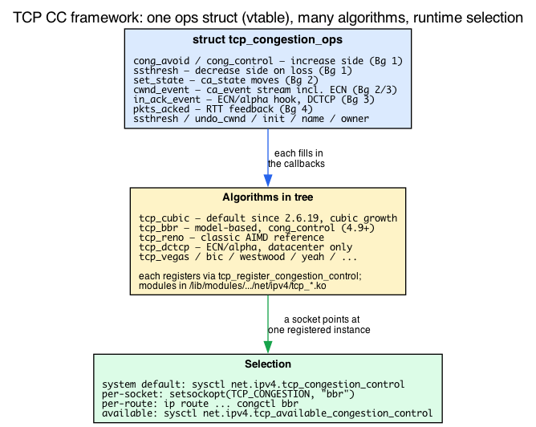

# Day 16 — TCP congestion control: CUBIC, BBR, the framework

> **Today's mission:** understand how a TCP connection decides "how much to send," see the in-tree algorithms compete on the same workload, and grasp the kernel's pluggable framework that lets you swap them at runtime. Total time: ~75 minutes.

## Why congestion control exists

A TCP sender has two limits on how much data it can have in flight at once:

1. **The receive window** (`rcv_wnd`) — how much the *receiver* says it can buffer. Communicated in every TCP header. Easy.
2. **The congestion window** (`snd_cwnd`) — how much the *network* between us and the receiver can absorb without dropping packets. Not communicated; the sender estimates from observed loss and RTT.

The congestion-control algorithm is what computes `snd_cwnd`. Send too little and you waste bandwidth. Send too much and you cause loss, which forces retransmits, wastes more bandwidth, and starves other flows. CC is the tradeoff.

## The framework: `struct tcp_congestion_ops`



Defined in `include/net/tcp.h` (search "tcp_congestion_ops"):

```c
struct tcp_congestion_ops {
    /* Initialize private state. Called when CC is selected for the sock. */
    void (*init)(struct sock *sk);

    /* Cleanup private state. */
    void (*release)(struct sock *sk);

    /* Compute slow-start threshold (used after loss). */
    u32 (*ssthresh)(struct sock *sk);

    /* The big one: called per ACK to update cwnd (classic CCs like CUBIC/Reno). */
    void (*cong_avoid)(struct sock *sk, u32 ack, u32 acked);

    /* Alternative to cong_avoid: full per-ACK control with a rate_sample.
     * A CC defines cong_avoid XOR cong_control. BBR uses this one
     * (.cong_control = bbr_main) to drive pacing + cwnd from its model. */
    void (*cong_control)(struct sock *sk, u32 ack, int flag,
                         const struct rate_sample *rs);

    /* Cleanup before/after congestion event. */
    void (*set_state)(struct sock *sk, u8 new_state);

    /* Notify of CA events: cwnd_restart, loss, fast retransmit, etc. */
    void (*cwnd_event)(struct sock *sk, enum tcp_ca_event ev);

    /* Per-ACK feedback (RTT, ECN). */
    void (*pkts_acked)(struct sock *sk, const struct ack_sample *sample);

    /* Override default cwnd-undo logic. */
    u32  (*undo_cwnd)(struct sock *sk);

    /* On every ACK event, regardless of new data. */
    void (*in_ack_event)(struct sock *sk, u32 flags);

    char name[TCP_CA_NAME_MAX];
    struct module *owner;
    struct list_head list;       /* registry */
    /* ... */
};
```

Each algorithm registers an instance via `tcp_register_congestion_control` (`net/ipv4/tcp_cong.c:93`). The kernel maintains a global list (`tcp_cong_list`); selection by name walks the list (`tcp_ca_find` at line 26).

## In-tree algorithms

### Reno — the original

`net/ipv4/tcp_cong.c:531` — the default fallback. AIMD: cwnd grows linearly per RTT in congestion avoidance, halves on loss. Slow start doubles cwnd per RTT. The classical TCP behavior; everything else is a variant.

### CUBIC

`net/ipv4/tcp_cubic.c:475` — the Linux default for ~15 years (and still the default in 7.1). Replaces Reno's linear growth with a cubic function: grows aggressively after a loss, then plateaus near the previous max, then slowly probes upward. Designed for high-BDP networks (long fat pipes) where Reno's linear growth was too slow.

- **What:** loss-based AIMD with a cubic growth curve.
- **Why:** Reno underutilizes long-RTT links; CUBIC fills them faster.
- **When:** general-purpose default. Still excellent for typical internet workloads.
- **Gotcha:** still loss-based — can be unfair against neighbors using BBR (which doesn't need loss to back off).

### BBR — Bottleneck Bandwidth and Round-trip propagation time

`net/ipv4/tcp_bbr.c:1144` — Google's algorithm (RFC draft, ~2016, in-tree since 4.9). Doesn't use loss as a signal; instead estimates the bottleneck bandwidth and round-trip time, and paces the sender at the estimated bandwidth.

- **What:** model-based — track recent max bandwidth and min RTT, send at the estimated BDP.
- **Why:** copes with bufferbloat (buffers that hide loss until they overflow) better than CUBIC. Achieves higher throughput on lossy paths.
- **When:** WAN, satellite, mobile, anywhere with high BDP and lossy paths. Used heavily by Google's CDN/services.
- **Gotcha:** can be unfair to neighbor CUBIC flows — BBR's "fair" bandwidth estimate doesn't react to loss the way CUBIC does, so BBR can take more share than fairness would dictate. Mitigated in BBR v2/v3 (in some kernels).
- **Pacing requirement:** BBR needs `fq` qdisc (or hardware pacing) to pace packets at the estimated rate. Without `fq`, BBR's behavior degrades.

### DCTCP — Data Center TCP

`net/ipv4/tcp_dctcp.c:255`. Uses ECN-CE marks (set by switches when their queue is non-empty) instead of loss as the congestion signal. Reduces queueing latency dramatically (sub-millisecond instead of tens of ms).

- **What:** ECN-driven; reacts proportionally to fraction of marked packets.
- **Why:** datacenter switches mark before they drop; DCTCP reads the marks directly.
- **When:** datacenter only — requires switches with ECN-marking and a homogeneous CC choice across all hosts.
- **Gotcha:** **must not** be used on the public Internet. Different congestion semantics from Reno/CUBIC; would behave aggressively against them.

### Others

Vegas, Westwood, YeAH, Veno, BIC, HSTCP, Highspeed, Hybla, LP, NV, etc. Each has a niche. Most have one or two papers and a few hundred lines of code. Read `net/ipv4/tcp_*.c` if you're curious.

## Selecting an algorithm

```bash
# What's available
sysctl net.ipv4.tcp_available_congestion_control
# Default: cubic reno
# After 'modprobe tcp_bbr': cubic reno bbr

# Default for new sockets (system-wide)
sysctl net.ipv4.tcp_congestion_control

# Set system-wide:
sudo sysctl -w net.ipv4.tcp_congestion_control=bbr

# Per-connection (in code):
const char cc[] = "bbr";
setsockopt(fd, IPPROTO_TCP, TCP_CONGESTION, cc, sizeof(cc));

# Per-route:
sudo ip route change 10.0.0.0/24 via 192.168.1.1 congctl bbr

# Per-cgroup (via BPF sockops — see eBPF book Day 19)
```

Some algorithms are kernel modules (`tcp_bbr.ko`, `tcp_dctcp.ko`); load with `modprobe tcp_bbr`. CUBIC is usually compiled-in.

## How it ties together at runtime

For each TCP connection:

1. **At socket creation**: `tcp_init_sock` calls `tcp_assign_congestion_control` which picks the algorithm (per-route, per-default, per-app sockopt).
2. **`init` callback** runs once. Allocates per-sock private state (in `icsk_ca_priv` — 104 bytes of scratch space inside the inet_connection_sock).
3. **Per ACK**: `tcp_ack` (`tcp_input.c`) calls `cong_avoid(sk, ack, acked)` for classic CCs (CUBIC/Reno). Algorithms that define `cong_control` instead (BBR) get `cong_control(sk, ack, flag, rs)` with a full `rate_sample`. Either way the algorithm updates `tp->snd_cwnd` based on its model.
4. **On loss/RTO**: kernel calls `set_state(sk, CA_Loss)` and `ssthresh(sk)`. The algorithm computes the new threshold and sets cwnd accordingly.
5. **On RTT sample**: kernel calls `pkts_acked(sk, sample)` with the latest RTT measurement. Pure feedback for the algorithm.

A typical CC algorithm is ~300 lines of C, 90% of which is `cong_avoid` and the loss/recovery handling.

## Today's experiment

```bash
# Load BBR (if not already)
sudo modprobe tcp_bbr

# iperf3 isn't installed by default on minimal images
sudo apt-get install -y iperf3

# Start an iperf3 server
iperf3 -s -p 5201 &

# Run with CUBIC
iperf3 -c 127.0.0.1 -p 5201 -C cubic -t 30 -J | jq '.end.streams[0].sender'

# Now BBR
iperf3 -c 127.0.0.1 -p 5201 -C bbr -t 30 -J | jq '.end.streams[0].sender'
```

On localhost the difference is small (no real bottleneck). For a more interesting test, add latency and loss with `tc netem`:

```bash
sudo tc qdisc add dev lo root netem delay 50ms loss 1%
iperf3 -c 127.0.0.1 -p 5201 -C cubic -t 30
iperf3 -c 127.0.0.1 -p 5201 -C bbr -t 30
sudo tc qdisc del dev lo root

# Stop the background iperf3 server when done
pkill iperf3   # or, in the same interactive shell: kill %1
```

CUBIC's loss-based response will give up bandwidth at every loss; BBR's bandwidth-model approach should hold up better.

Note: even though `lo`'s root qdisc is now `netem` and not `fq`, BBR still paces here. Since Linux 4.13 the TCP stack carries an internal pacing fallback (driven by `sk->sk_pacing_status`) that kicks in when the egress qdisc isn't `fq`. It's less precise than `fq`'s timestamp-based pacing, but functional — which is why this localhost test still demonstrates BBR's behavior. On a real NIC you'd front BBR with `fq` (or hardware pacing) for accurate per-packet pacing.

### Watch cwnd evolution

```bash
sudo bpftrace -e '
kprobe:tcp_write_xmit {
  $tp = (struct tcp_sock *)arg0;
  @cwnd = lhist($tp->snd_cwnd, 0, 1000, 50);
}
interval:s:10 { exit(); }'
```

`tcp_write_xmit` only fires while data is actually being sent, so on an idle box this histogram comes back empty. Give it traffic: in one terminal start a 30s transfer (the server is still running from the experiment above) with `iperf3 -c 127.0.0.1 -p 5201 -C cubic -t 30`, then in a second terminal run the bpftrace above — the 10s window captures `snd_cwnd` across the live transfer. Repeat with `-C bbr` to compare the two distributions.

### Per-socket TCP info

```bash
ss -tin
# Look for: the CC algo as a bare token (cubic / bbr), cwnd:N,
#           rtt:<srtt>/<rttvar>, retrans:X/Y (only appears after retransmissions)
```

To see a `bbr` socket with a live cwnd, run `ss -tin` while one of the transfers above is in flight (use `-t 30` and pin the algorithm with `-C bbr`). On an idle box `ss -tin` shows only your SSH session (cubic) and listeners stuck at `cwnd:10`. Real output for an established socket looks like:

```
ESTAB 0 0  10.0.0.4:22  ...:62372
	 bbr wscale:6,10 rto:219 rtt:18.897/2.546 ato:40 mss:1448 cwnd:37 ...
	 bbr:(bw:7349256bps,mrtt:10.98,pacing_gain:2.88672,cwnd_gain:2.88672) ...
```

Note the CC algorithm prints as a bare token (`bbr` / `cubic`), the smoothed RTT as `rtt:<srtt>/<rttvar>`, and retransmits as `retrans:X/Y` (present only once a retransmission has occurred).

`ss -tin` reads `tcp_get_info` (`net/ipv4/tcp.c`, search the function) which fills `struct tcp_info` from the live `tcp_sock` state.

## What to read in the kernel

- **`include/net/tcp.h`** — search `struct tcp_congestion_ops`. The vtable. Read each callback's docstring carefully — they're the API every algorithm implements against.

- **`net/ipv4/tcp_cong.c`** — registration framework. Read top to bottom (~600 lines). Key functions:
  - `tcp_register_congestion_control` (line 93): adds an algorithm to the global list.
  - `tcp_set_congestion_control` (line 412): switch a socket's CC.
  - `tcp_init_congestion_control` (line 236): per-sock init.
  - `tcp_cong_avoid_ai` (line 470): a generic AIMD-increment helper used by Reno-derived algorithms.

- **`net/ipv4/tcp_input.c`** — search `tcp_ack`. The function that calls `cong_avoid` per incoming ACK. Trace through it once to see how the kernel decides "this is a useful ACK" vs "duplicate ACK" before invoking the algorithm.

- **`net/ipv4/tcp_cubic.c:475`** — `cubictcp` instance + the implementation. Read the `cubictcp_cong_avoid` function and its helpers; the math is mostly in `bictcp_update`. Compare against the CUBIC paper if you want academic precision.

- **`net/ipv4/tcp_bbr.c:1144`** — BBR's full state machine. Long file (~1200 lines) but the structure is clear: `bbr_main` is the entry per ACK; it cycles through states (Startup, Drain, ProbeBW, ProbeRTT). Read the top-of-file comment; it's a textbook explanation.

- **`net/ipv4/tcp_dctcp.c:255`** — DCTCP. Short and instructive (~300 lines). Notice how it consumes ECN marks via `in_ack_event`.

- **`net/ipv4/tcp_cong.c:531`** — `tcp_reno`. The reference implementation; ~30 lines. Every other algorithm is "Reno plus extra cleverness."

- **`Documentation/networking/ip-sysctl.rst`** — the `tcp_congestion_control` sysctl and related knobs. See also `Documentation/networking/dctcp.rst` for DCTCP specifics.

## Bullet Points

- TCP CC computes `snd_cwnd` — how much the sender thinks the network can absorb.
- Pluggable framework: each algorithm is a `struct tcp_congestion_ops` registered via `tcp_register_congestion_control`.
- **CUBIC** — loss-based, cubic growth, longtime default. Good general-purpose.
- **BBR** — model-based (bandwidth + RTT). Better on lossy/high-BDP paths. Needs `fq` qdisc for pacing.
- **DCTCP** — ECN-based. Datacenter only. Order-of-magnitude lower latency than CUBIC.
- **Reno** — the reference implementation; ~30 lines. Everyone else "is Reno but...".
- Switch via sysctl, sockopt (`TCP_CONGESTION`), or per-route. BPF (`sock_ops`) can override per-cgroup.
- Per-connection state lives in `icsk_ca_priv` (104 bytes inside `inet_connection_sock`).

## Check question

Why doesn't the kernel just always use BBR (since it's newer and often performs better)?

<details>
<summary>Click to reveal answer</summary>

**Answer:** Three reasons. **(1) Fairness.** BBR is delay-based; it estimates path bandwidth and paces accordingly. On a network where the bottleneck is a buffer also serving CUBIC flows, BBR is unfriendly: it underestimates how much the buffer is doing, takes more share than fairness would dictate, and can starve neighbors. CUBIC remains the default because it's been validated across the public Internet for two decades and behaves predictably with other CUBIC flows. **(2) Pacing requirement.** BBR depends on accurate per-packet pacing, which requires the `fq` qdisc or hardware pacing. Without it, BBR's bandwidth estimate is corrupted by burstiness. Many systems don't run `fq` by default. **(3) Application sensitivity.** Some applications (real-time, low-latency request/response) are more sensitive to the *variance* of the algorithm than its peak throughput; CUBIC's behavior is more predictable in this dimension. So: BBR for WAN-throughput-critical workloads where you control both ends. CUBIC for the public Internet and most general-purpose servers.

</details>

---

## Tomorrow

Day 17: TCP retransmission and recovery — RTO, fast retransmit, RACK, the recovery state.
