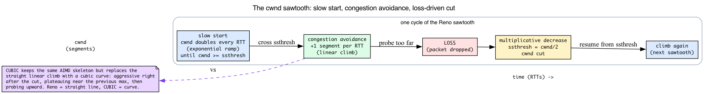
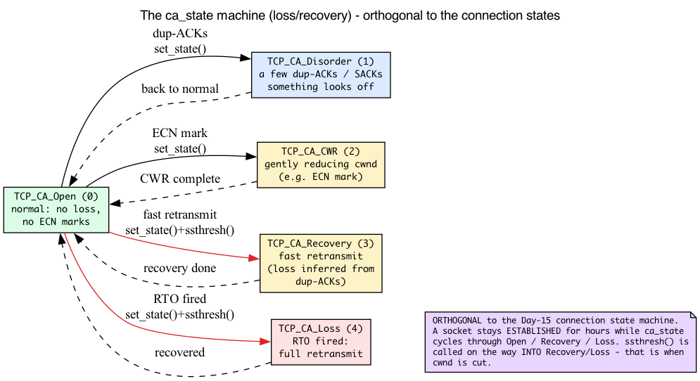
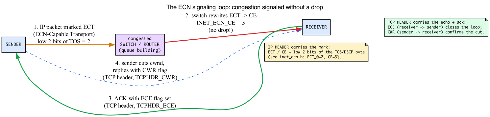
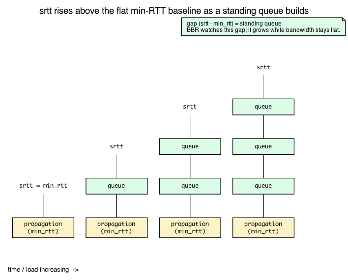
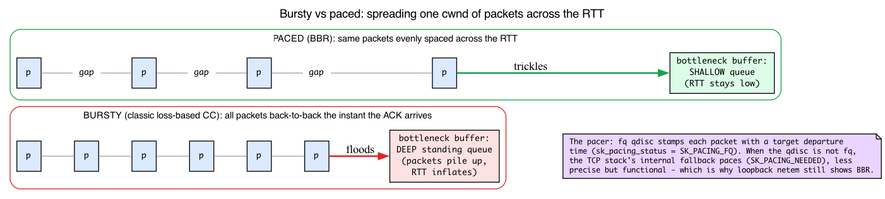

# Day 16 — TCP congestion control: CUBIC, BBR, the framework

> **Today's mission:** understand how a TCP connection decides "how much to send," learn the cwnd-dynamics machinery (slow start, AIMD, the sawtooth, ECN, pacing) that *every* algorithm is a variation on, see the in-tree algorithms compete on the same workload, and grasp the kernel's pluggable framework that lets you swap them at runtime. Total time: ~110 minutes.

## Why congestion control exists

A TCP sender has two limits on how much data it can have in flight at once:

1. **The receive window** (`snd_wnd` on the sender side) — how much the *receiver* says it can buffer, as recorded on the sender. Communicated in every TCP header. Easy. (The mirror field `rcv_wnd` is what *this* socket advertises to its peer for the reverse direction.)
2. **The congestion window** (`snd_cwnd`) — how much the *network* between us and the receiver can absorb without dropping packets. Not communicated; the sender estimates from observed loss and RTT.

The congestion-control algorithm is what computes `snd_cwnd`. Send too little and you waste bandwidth. Send too much and you cause loss, which forces retransmits, wastes more bandwidth, and starves other flows. CC is the tradeoff.

(All three fields are real: the peer-receiver's advertised window lives in `snd_wnd` — "the window we expect to receive" — at `include/linux/tcp.h:223`; this host's own advertised window is `rcv_wnd` at `:318`; and `snd_cwnd` at `:225`. The kernel gates new sends by `snd_wnd`: `tcp_wnd_end()` = `snd_una + snd_wnd` at `include/net/tcp.h:1569`.)

Back on Day 3 we deliberately deferred the *mechanics* of how `snd_cwnd` grows and collapses. Today we pay that debt. Before we can read the pluggable framework — the vtable of callbacks every algorithm fills in — we need the model those callbacks operate on. So the chapter front-loads five pieces of background, intuition first, then the concrete v7.1 struct or function:

1. How `cwnd` actually evolves: slow start, congestion avoidance, AIMD, the sawtooth.
2. The congestion-control state machine (`ca_state`) — *not* the connection state machine from Day 15.
3. ECN — how the network signals congestion *without* dropping a packet.
4. RTT estimation: the smoothed RTT (`srtt`) and its variance that `ss` prints.
5. Pacing and bufferbloat — the two ideas BBR is built on.

Only then do we open `struct tcp_congestion_ops`, and every field will already make sense.

## Background 1: how `cwnd` actually evolves — slow start, AIMD, the sawtooth

Here is the whole game in one picture. A connection has no idea how fast the path is, so it *probes*: start small, speed up until something breaks, back off, repeat. The "something breaks" signal for classic TCP is **packet loss**. Everything else — the exact ramp shape, what counts as "breaks," how far to back off — is a variation on this loop.



### cwnd is measured in packets, not bytes

One thing to get straight first: on Linux `snd_cwnd` is counted in **segments (packets)**, not bytes. A fresh connection starts at `TCP_INIT_CWND = 10` (`include/net/tcp.h:269`) — ten segments may be outstanding before the first ACK comes back. We made this point on Day 3; here we just lean on it: when we say "cwnd doubles," we mean the *packet* count doubles.

### Phase 1: slow start (which is exponential, despite the name)

A new connection enters **slow start**. The rule is simple: for every segment an ACK acknowledges, bump `cwnd` by one. Acknowledge ten segments, `cwnd` goes from 10 to 20; next round-trip it's 40, then 80… So "slow" is historical — the growth is actually **exponential, doubling every RTT.** The point of slow start is to find the path's capacity *quickly* without firing a huge burst on the very first RTT.

The kernel's helper is `tcp_slow_start` (`net/ipv4/tcp_cong.c:456`):

```c
__bpf_kfunc u32 tcp_slow_start(struct tcp_sock *tp, u32 acked)
{
    u32 cwnd = min(tcp_snd_cwnd(tp) + acked, tp->snd_ssthresh);

    acked -= cwnd - tcp_snd_cwnd(tp);          /* leftover ACKs */
    tcp_snd_cwnd_set(tp, min(cwnd, tp->snd_cwnd_clamp));
    return acked;                              /* spill into congestion avoidance */
}
```

It adds `acked` straight onto `cwnd` — but only up to `snd_ssthresh`, the **slow-start threshold** (`include/linux/tcp.h:248`). That ceiling is the boundary between the two phases.

### Phase 2: congestion avoidance (which is linear)

Once `cwnd` reaches `snd_ssthresh`, the connection switches to **congestion avoidance**, where growth becomes **linear: roughly +1 segment per RTT.** The test that picks the phase is exactly one comparison, `tcp_in_slow_start` (`include/net/tcp.h:1520`):

```c
static inline bool tcp_in_slow_start(const struct tcp_sock *tp)
{
    return tcp_snd_cwnd(tp) < tp->snd_ssthresh;
}
```

Below the threshold → slow start (exponential). At or above it → congestion avoidance (linear).

Linear "+1 per RTT" is trickier than it sounds, because the kernel processes one ACK at a time, not one RTT at a time. The generic helper `tcp_cong_avoid_ai` ("ai" = *additive increase*, `net/ipv4/tcp_cong.c:470`) implements it with a fractional accumulator, `snd_cwnd_cnt` ("Linear increase counter," `include/linux/tcp.h:425`):

```c
__bpf_kfunc void tcp_cong_avoid_ai(struct tcp_sock *tp, u32 w, u32 acked)
{
    ...
    tp->snd_cwnd_cnt += acked;
    if (tp->snd_cwnd_cnt >= w) {
        u32 delta = tp->snd_cwnd_cnt / w;
        tp->snd_cwnd_cnt -= delta * w;
        tcp_snd_cwnd_set(tp, tcp_snd_cwnd(tp) + delta);
    }
    ...
}
```

It takes `w` ACKs to bump `cwnd` by one. Pass `w = cwnd` and you get the classic "+1 per RTT": it takes a full window of ACKs to add one segment.

### AIMD: Additive Increase / Multiplicative Decrease

Put the two responses together and you have **AIMD**, the rule at the heart of classic TCP:

- **Increase (additive):** +1 segment per RTT in congestion avoidance — the slow, careful climb above.
- **Decrease (multiplicative):** on loss, *halve.* Reno's `ssthresh` callback computes the new threshold as `tcp_reno_ssthresh` (`net/ipv4/tcp_cong.c:515`):

  ```c
  __bpf_kfunc u32 tcp_reno_ssthresh(struct sock *sk)
  {
      const struct tcp_sock *tp = tcp_sk(sk);
      return max(tcp_snd_cwnd(tp) >> 1U, 2U);     /* cwnd/2, floor 2 */
  }
  ```

  `cwnd >> 1` is `cwnd / 2` — a multiplicative cut, with a floor of 2 so the connection never stalls completely.

This is the famous TCP **sawtooth**: climb linearly, halve on loss, climb again, halve again. You can see both halves wired together in the Reno reference, `tcp_reno_cong_avoid` (`net/ipv4/tcp_cong.c:496`) — slow-start if below threshold, else additive increase:

```c
__bpf_kfunc void tcp_reno_cong_avoid(struct sock *sk, u32 ack, u32 acked)
{
    struct tcp_sock *tp = tcp_sk(sk);
    if (!tcp_is_cwnd_limited(sk))
        return;
    if (tcp_in_slow_start(tp)) {                 /* exponential phase */
        acked = tcp_slow_start(tp, acked);
        if (!acked)
            return;
    }
    tcp_cong_avoid_ai(tp, tcp_snd_cwnd(tp), acked);  /* linear phase */
}
```

**This is what "everything else is a variant" actually means.** CUBIC keeps the AIMD skeleton but replaces the *linear climb* with a cubic curve (aggressive right after a loss, plateauing near the previous maximum, then probing upward). BBR throws out the loss-driven loop entirely and replaces it with a bandwidth model. But Reno is the shape to hold in your head.

And now the two most important callbacks in today's vtable already have meaning:

- **`cong_avoid`** runs the *increase* side — it decides slow-start-vs-avoidance and grows `cwnd`.
- **`ssthresh`** runs the *decrease* side — it computes the new threshold after a loss.

## Background 2: the congestion-control state machine (`ca_state`)

The vtable also has `set_state(sk, new_state)` and the runtime path says "on loss the kernel calls `set_state(sk, CA_Loss)`." That `CA_Loss` belongs to a state machine you have **not** met.

**It is not the Day-15 connection state machine.** A socket can sit in `ESTABLISHED` for hours; `ca_state` is a *separate, orthogonal* tracker for where the connection is in the **loss/recovery cycle**. The five values (`enum tcp_ca_state`, `include/uapi/linux/tcp.h:194`):

- **`TCP_CA_Open` (0)** — normal. No reordering, no loss, no ECN marks recently.
- **`TCP_CA_Disorder` (1)** — a few duplicate ACKs / SACKs. Something looks off, but not yet a confirmed loss.
- **`TCP_CA_CWR` (2)** — *Congestion Window Reduced.* The sender is gently reducing `cwnd`, e.g. in response to an ECN mark (Background 3).
- **`TCP_CA_Recovery` (3)** — fast retransmit / fast recovery in progress (a loss was inferred from dup-ACKs, not a timeout).
- **`TCP_CA_Loss` (4)** — a retransmit timeout (RTO) fired. The worst case: full retransmit.

The kernel calls **`set_state(sk, new_state)`** to tell the algorithm it has moved between these. Why does an algorithm care? Because entering `Recovery`/`Loss` is exactly *when* `ssthresh()` is called and `cwnd` is cut, and leaving it is when the algorithm may resume growth. This is the hook by which CUBIC remembers its pre-loss maximum (so it can plateau there) and BBR knows not to overreact to a single loss.



### `ca_event`: a finer-grained notification stream

Alongside whole state changes, the kernel emits **`ca_event`** notifications (`enum tcp_ca_event`, `include/net/tcp.h:1242`) through the `cwnd_event` callback:

```c
enum tcp_ca_event {
    CA_EVENT_TX_START,      /* first transmit when no packets in flight */
    CA_EVENT_CWND_RESTART,  /* congestion window restart */
    CA_EVENT_COMPLETE_CWR,  /* end of congestion recovery */
    CA_EVENT_LOSS,          /* loss timeout */
    CA_EVENT_ECN_NO_CE,     /* ECT set, but not CE marked */
    CA_EVENT_ECN_IS_CE,     /* received CE marked IP packet */
};
```

The last two — `CA_EVENT_ECN_NO_CE` / `CA_EVENT_ECN_IS_CE` — are the ECN events DCTCP lives on. Hold that thought; Background 3 explains the marks, and the DCTCP capsule later ties it together.

The deep dive — RTO timers, fast retransmit, RACK, the recovery machinery — is tomorrow (Day 17). Today you just need the vocabulary so the callbacks aren't opaque.

## Background 3: ECN — Explicit Congestion Notification

The DCTCP algorithm reacts to congestion **before any packet is dropped.** That sounds impossible — how does a sender learn the network is congested if nothing was lost? The answer is **ECN**, and it's the one mechanism in this chapter that crosses both the IP and TCP headers.

On Day 9 you saw that the low 2 bits of the IP TOS/DSCP byte are the ECN bits, deliberately excluded from rule matching. Here's what they *do*.

### Step 1: the sender marks the IP packet ECT

A sender that supports ECN sets those 2 bits to **ECT** (ECN-Capable Transport), advertising "I understand congestion marks — mark me instead of dropping me." The values live in `include/net/inet_ecn.h:14`:

```c
enum {
    INET_ECN_NOT_ECT = 0,
    INET_ECN_ECT_1   = 1,
    INET_ECN_ECT_0   = 2,
    INET_ECN_CE      = 3,
    INET_ECN_MASK    = 3,
};
```

### Step 2: a congested switch rewrites ECT → CE

When a router or switch's queue is building, instead of dropping an ECT packet it flips the bits to **`INET_ECN_CE`** — *Congestion Experienced* (`= 3`). The test is `INET_ECN_is_ce()` (`include/net/inet_ecn.h:23`):

```c
static inline int INET_ECN_is_ce(__u8 dsfield)
{
    return (dsfield & INET_ECN_MASK) == INET_ECN_CE;
}
```

**This is the key idea behind "reacts before loss":** congestion is signaled *without* a drop.

### Step 3: the receiver echoes it back with ECE; the sender confirms with CWR

A CE mark is in the *IP* header travelling *toward the receiver* — but it's the *sender* that needs to slow down. So the receiver echoes it back using a *TCP* header flag, **ECE** (ECN-Echo), and the sender acknowledges that it reduced its window with the **CWR** (Congestion Window Reduced) flag. Those flags (`include/net/tcp.h:1056`):

```c
#define TCPHDR_ECE  BIT(6)
#define TCPHDR_CWR  BIT(7)
```

That ECE ↔ CWR handshake is what turns a one-way IP mark into a closed-loop signal the sender can act on.



### Step 4: how it reaches the algorithm

There are two distinct paths into the algorithm, and it's worth keeping them apart:

- **ECE on an incoming ACK** (the sender side learning it should slow down). When an ACK carries the ECE bit, the kernel sets the **`CA_ACK_ECE`** flag (`net/ipv4/tcp_input.c:4154`; `enum tcp_ca_ack_event_flags`, `include/net/tcp.h:1255`) and passes it to the **`in_ack_event`** callback. DCTCP's handler, `dctcp_update_alpha` (`net/ipv4/tcp_dctcp.c:127`, wired as `.in_ack_event` at `:257`), recomputes **alpha** each RTT from `tp->delivered_ce`/`tp->delivered` — a running estimate of the *fraction* of packets that got marked — and scales its `cwnd` cut by that fraction. A little marking → a little cut; heavy marking → a big cut. That proportional response is *why* DCTCP hooks `in_ack_event` instead of `cong_avoid`.
- **Receiving a CE-marked IP packet** (the data-receive side, deciding whether to echo ECE). `tcp_ecn_check_ce()` fires **`CA_EVENT_ECN_IS_CE`** / **`CA_EVENT_ECN_NO_CE`** (`net/ipv4/tcp_input.c:362`/`:380`) through the **`cwnd_event`** callback, which DCTCP catches in `dctcp_cwnd_event` (`net/ipv4/tcp_dctcp.c:193`, wired as `.cwnd_event` at `:258`) to update its `ce_state`. This path is about echoing ECE, not about the alpha estimate.

So the alpha estimate that drives DCTCP's proportional cut comes from the `in_ack_event`/`delivered_ce` path, not from `CA_EVENT_ECN_IS_CE`.

And it's why DCTCP is **datacenter-only.** Classic Reno/CUBIC treat any congestion signal as a full multiplicative cut; DCTCP reacts proportionally. Mix the two on the same path and they share unfairly — which grounds the "must not be used on the public Internet" rule in the DCTCP capsule below.

## Background 4: RTT estimation — smoothed RTT and its variance

The `pkts_acked` callback hands the algorithm "the latest RTT measurement," and the `ss -tin` lab tells you to read `rtt:<srtt>/<rttvar>`. Two numbers — what are they?

**RTT** (round-trip time) is measured per ACK: the time from when a segment was sent to when it was acknowledged. That raw sample is what `pkts_acked` delivers, via `struct ack_sample` (`include/net/tcp.h:1283`):

```c
struct ack_sample {
    u32 pkts_acked;
    s32 rtt_us;        /* the raw RTT measurement, microseconds */
    u32 in_flight;
};
```

But the kernel does **not** act on raw samples — they're jittery. It keeps an exponentially-weighted moving average, **`srtt_us`** ("smoothed round trip time," `include/linux/tcp.h:307`), plus **`rttvar_us`**, the smoothed *deviation* (`:243`; the underlying mean-deviation accumulator is `mdev_us` at `:272`). `ss` prints these as `rtt:<srtt>/<rttvar>`.

One gotcha when you compare `ss` output to raw struct values: the comment says `srtt_us` is *"smoothed round trip time **<< 3** in usecs"* — it's stored left-shifted by 3 (i.e. ×8) for fixed-point precision. `ss` already divides it back out, so the number it prints is the real millisecond figure; the in-kernel field is 8× larger.

Why CC cares: the **minimum** RTT is the path's propagation delay with no queue. BBR maintains its own `min_rtt_us` (`net/ipv4/tcp_bbr.c:91`, a plain `u32`) with a time-windowed minimum in `bbr_update_min_rtt` (`net/ipv4/tcp_bbr.c:942`) over a ~10s window — seeded once from the core stack's `tcp_min_rtt(tp)` at init (`net/ipv4/tcp_bbr.c:1054`), then run as a separate filter. The generic `struct minmax rtt_min` (`include/linux/tcp.h:249`) is the *core stack's* windowed-minimum estimator, updated in `tcp_update_rtt_min` and read via `tcp_min_rtt()`. (The `struct minmax` inside BBR is `bbr->bw`, the bandwidth estimate — not min RTT.) When `srtt` rises *above* min RTT, that gap is a standing queue building up — the signal Background 5 is about.



The full RTO/timer math is Day 17; today we only need the smoothing and the two `ss` fields.

## Background 5: pacing and bufferbloat (the BBR prerequisites)

BBR "paces the sender at the estimated bandwidth" and "copes with bufferbloat." Two terms, neither yet defined.

### Pacing: spread the window out in time

When an ACK opens room in the window, a classic loss-based CC fires the newly-allowed packets **back-to-back, instantly** — a burst — and relies on the network to absorb it. **Pacing** instead spreads a window's worth of packets **evenly across the RTT.** BBR computes a target send *rate* (bytes/sec) from its bandwidth estimate, and the kernel spaces packets in time to match. This matters for BBR specifically: if BBR sent bursts, those bursts would themselves inflate the measured RTT and corrupt the very bandwidth estimate BBR depends on.



**Where pacing happens.** Recall the qdisc from Day 3 — the per-TX-queue software scheduler. The **`fq`** qdisc is the one that can stamp each packet with a target departure time and release it then. That's why BBR "needs `fq` (or hardware pacing)." Since Linux 4.13 there's also an internal fallback in the TCP stack, driven by `sk->sk_pacing_status` (`include/net/sock.h:506`), whose values are (`include/net/sock.h:612`):

```c
enum sk_pacing {
    SK_PACING_NONE   = 0,
    SK_PACING_NEEDED = 1,
    SK_PACING_FQ     = 2,
};
```

When the egress qdisc *is* `fq`, the status is `SK_PACING_FQ` and `fq` does the pacing. When it isn't, the TCP stack paces internally (less precise, but functional) — which is exactly why today's loopback `netem` experiment still demonstrates BBR even though `lo`'s qdisc isn't `fq`.

### Bufferbloat: buffers so big they hide the loss

A loss-based CC only backs off when a packet is **dropped**, and a packet is only dropped when a buffer **overflows.** So on a path with an oversized router/switch buffer, CUBIC keeps pushing — filling that buffer with tens of milliseconds of *standing queue* — and doesn't stop until the buffer finally overflows. The buffer is "bloated"; latency is terrible even though throughput looks fine. Loss-based CCs don't just tolerate bufferbloat, they actively *cause* it.

BBR's model sidesteps this. By tracking `min_rtt_us` (propagation delay) and max bandwidth separately, it watches for the tell: **RTT rising while bandwidth stays flat** means the queue is building. BBR backs off *then* — before the drop — instead of waiting for the overflow. That's the substance behind "copes with bufferbloat better than CUBIC." `bbr_max_bw()` (`net/ipv4/tcp_bbr.c:216`) and `min_rtt_us` are the two halves of that model; `bbr_main` (`net/ipv4/tcp_bbr.c:1028`, wired as `.cong_control` at `:1149`) drives it per ACK.

(BDP — the bandwidth-delay product — and the qdisc concept itself were covered on Day 3; we're not re-deriving them.)

## The framework: `struct tcp_congestion_ops`


Now the vtable is legible. **This is the same "ops struct = vtable" pattern you already know** — just like `struct Qdisc_ops` on Day 3 (the per-TX-queue qdisc interface) or the `*_ops` structs underlying sockets on Day 13: each algorithm provides an instance, registers it, and the core stack dispatches polymorphically through the function pointers. Swapping algorithms is swapping which struct a socket points at. We won't re-teach the pattern.

What *is* new to CC is one rule the v7.1 struct comment states explicitly: an algorithm provides **either `cong_avoid` XOR `cong_control`, never both.** Defined in `include/net/tcp.h:1316`:

```c
struct tcp_congestion_ops {
    /* A congestion control (CC) must provide one of either:
     *
     * (a) a cong_avoid function, if the CC wants the core TCP stack's
     *     default "classic" (Reno/CUBIC-style) loss response, ECN, pacing
     *     rate computations, etc.  ->  runs the Background-1 increase side.
     *
     * (b) a cong_control function, for custom behavior with complete
     *     control of all congestion-control behaviors.  BBR uses this.
     */
    void (*cong_avoid)(struct sock *sk, u32 ack, u32 acked);
    void (*cong_control)(struct sock *sk, u32 ack, int flag,
                         const struct rate_sample *rs);

    /* return slow start threshold (required) — the Background-1 decrease side. */
    u32 (*ssthresh)(struct sock *sk);

    /* call before changing ca_state (Background 2). */
    void (*set_state)(struct sock *sk, u8 new_state);

    /* call when a cwnd event occurs (Background 2's ca_event stream). */
    void (*cwnd_event)(struct sock *sk, enum tcp_ca_event ev);

    /* call on every ACK — DCTCP consumes ECN marks here (Background 3). */
    void (*in_ack_event)(struct sock *sk, u32 flags);

    /* per-ACK RTT/ECN feedback via struct ack_sample (Background 4). */
    void (*pkts_acked)(struct sock *sk, const struct ack_sample *sample);

    /* new value of cwnd after loss (required). */
    u32  (*undo_cwnd)(struct sock *sk);

    char name[TCP_CA_NAME_MAX];
    struct module *owner;
    struct list_head list;       /* registry */
    /* ... */
};
```

So the callback-to-phase mapping you built up is exactly the API surface: `cong_avoid` = increase side, `ssthresh` = decrease side, `set_state`/`cwnd_event` = the `ca_state`/`ca_event` machine, `in_ack_event` = the ECN hook, `pkts_acked` = the RTT feedback. A classic CC fills in `cong_avoid` + `ssthresh`; a model-based CC like BBR fills in `cong_control` instead and ignores the loss-response defaults.

Each algorithm registers an instance via `tcp_register_congestion_control` (`net/ipv4/tcp_cong.c:93`). The kernel maintains a global list; selection by name walks it via `tcp_ca_find` (`net/ipv4/tcp_cong.c:26`).

## In-tree algorithms

### Reno — the original

`net/ipv4/tcp_cong.c:531` — the reference and default fallback. Pure AIMD, exactly as Background 1 built it: slow start doubles `cwnd` per RTT, congestion avoidance adds +1 per RTT, loss halves it. The classical TCP behavior; everything else is a variant.

### CUBIC

`net/ipv4/tcp_cubic.c:475` — the Linux default for ~20 years (default since kernel 2.6.19 in 2006, and still the default in 7.1). Keeps AIMD's loss response but replaces Background 1's *linear* climb with a cubic function: it grows aggressively right after a loss, plateaus near the previous maximum (which it remembers across the `ca_state` transition), then slowly probes upward. Designed for high-BDP networks (long fat pipes) where Reno's linear growth was too slow.

- **What:** loss-based AIMD with a cubic growth curve.
- **Why:** Reno underutilizes long-RTT links; CUBIC fills them faster.
- **When:** general-purpose default. Still excellent for typical internet workloads.
- **Gotcha:** still loss-based — can be unfair against neighbors using BBR (which doesn't need loss to back off).

The math lives in `bictcp_update` (`net/ipv4/tcp_cubic.c:211`), called from `cubictcp_cong_avoid` (`net/ipv4/tcp_cubic.c:321`).

### BBR — Bottleneck Bandwidth and Round-trip propagation time

`net/ipv4/tcp_bbr.c:1144` — Google's algorithm (RFC draft, ~2016, in-tree since 4.9). Doesn't use loss as a signal at all; instead it estimates the bottleneck bandwidth and minimum RTT (Background 4) and paces the sender at that bandwidth (Background 5). It fills in `cong_control` (`bbr_main`), not `cong_avoid`.

- **What:** model-based — track recent max bandwidth and min RTT, send at the estimated BDP, paced.
- **Why:** copes with bufferbloat (Background 5) better than CUBIC; achieves higher throughput on lossy paths.
- **When:** WAN, satellite, mobile, anywhere with high BDP and lossy paths. Used heavily by Google's CDN/services.
- **Gotcha:** can be unfair to neighbor CUBIC flows — BBR's bandwidth estimate doesn't react to loss the way CUBIC does, so it can take more than its fair share. Mitigated in BBR v2/v3 (in some kernels).
- **Pacing requirement:** BBR needs `fq` qdisc (or hardware pacing) to pace packets at the estimated rate (Background 5). Without `fq`, the internal `sk_pacing_status` fallback applies, but precision drops.

### DCTCP — Data Center TCP

`net/ipv4/tcp_dctcp.c:255`. Uses ECN-CE marks (Background 3) instead of loss as the congestion signal — switches mark before they drop, and DCTCP reads the marks directly via `in_ack_event` (`dctcp_update_alpha`). Reduces queueing latency dramatically (sub-millisecond instead of tens of ms).

- **What:** ECN-driven; reacts *proportionally* to the fraction of marked packets (its `alpha`).
- **Why:** datacenter switches mark before they drop; DCTCP reads the marks directly.
- **When:** datacenter only — requires ECN-marking switches and a homogeneous CC choice across all hosts.
- **Gotcha:** **must not** be used on the public Internet. Its proportional response shares unfairly against the full-cut response of Reno/CUBIC (Background 3).

### Others

Vegas, Westwood, YeAH, Veno, BIC, HighSpeed (HSTCP), Hybla, LP, NV, etc. Each has a niche. Most have one or two papers and a few hundred lines of code. Read `net/ipv4/tcp_*.c` if you're curious.

## Selecting an algorithm

```bash
# What's available
sysctl net.ipv4.tcp_available_congestion_control
# Typically: cubic reno (order, and whether bbr already appears,
# depend on what's loaded — after 'modprobe tcp_bbr' bbr joins the list)

# Default for new sockets (system-wide)
sysctl net.ipv4.tcp_congestion_control

# Set system-wide:
sudo sysctl -w net.ipv4.tcp_congestion_control=bbr

# Per-connection (in code):
const char cc[] = "bbr";
setsockopt(fd, IPPROTO_TCP, TCP_CONGESTION, cc, sizeof(cc));

# Per-route:
sudo ip route change 10.0.0.0/24 via 192.168.1.1 congctl bbr

# Per-cgroup (via BPF sockops — see eBPF book Day 19)
```

Some algorithms are kernel modules (`tcp_bbr.ko`, `tcp_dctcp.ko`); load with `modprobe tcp_bbr`. CUBIC is usually compiled-in.

## How it ties together at runtime

For each TCP connection:

1. **At socket creation**: `tcp_init_sock` (`net/ipv4/tcp.c:421`) calls `tcp_assign_congestion_control` (`:463`) which picks the algorithm (per-route, per-default, per-app sockopt).
2. **`init` callback** runs once. Allocates per-sock private state in `icsk_ca_priv` — exactly **104 bytes** of scratch space inside the `inet_connection_sock` (`include/net/inet_connection_sock.h:141`).
3. **Per ACK**: `tcp_ack` (`tcp_input.c`) calls `cong_avoid(sk, ack, acked)` for classic CCs (CUBIC/Reno — the Background-1 increase side). Algorithms that define `cong_control` instead (BBR) get `cong_control(sk, ack, flag, rs)` with a full `rate_sample`. Either way the algorithm updates `tp->snd_cwnd` based on its model.
4. **On loss/RTO**: the kernel calls `set_state(sk, CA_Loss)` (Background 2) and `ssthresh(sk)` (the Background-1 decrease side). The algorithm computes the new threshold and `cwnd` drops toward it.
5. **On RTT sample**: the kernel calls `pkts_acked(sk, sample)` with the latest `struct ack_sample` (Background 4). Pure feedback for the algorithm.

A typical CC algorithm is ~300 lines of C, 90% of which is `cong_avoid` and the loss/recovery handling.

## Today's experiment

```bash
# Load BBR (if not already)
sudo modprobe tcp_bbr

# iperf3 isn't installed by default on minimal images
sudo apt-get install -y iperf3

# Start an iperf3 server
iperf3 -s -p 5201 &

# Run with CUBIC
iperf3 -c 127.0.0.1 -p 5201 -C cubic -t 30 -J | jq '.end.streams[0].sender'

# Now BBR
iperf3 -c 127.0.0.1 -p 5201 -C bbr -t 30 -J | jq '.end.streams[0].sender'
```

On localhost the difference is small (no real bottleneck). For a more interesting test, add latency and loss with `tc netem`:

```bash
sudo tc qdisc add dev lo root netem delay 50ms loss 1%
iperf3 -c 127.0.0.1 -p 5201 -C cubic -t 30
iperf3 -c 127.0.0.1 -p 5201 -C bbr -t 30
sudo tc qdisc del dev lo root

# Stop the background iperf3 server when done
pkill iperf3   # or, in the same interactive shell: kill %1
```

CUBIC's loss-based response will give up bandwidth at every loss (Background 1's multiplicative cut); BBR's bandwidth-model approach should hold up better on the lossy path.

Note: even though `lo`'s root qdisc is now `netem` and not `fq`, BBR still paces here. Since Linux 4.13 the TCP stack carries an internal pacing fallback (driven by `sk->sk_pacing_status`, Background 5) that kicks in when the egress qdisc isn't `fq`. It's less precise than `fq`'s timestamp-based pacing, but functional — which is why this localhost test still demonstrates BBR's behavior. On a real NIC you'd front BBR with `fq` (or hardware pacing) for accurate per-packet pacing.

### Watch cwnd evolution

```bash
sudo bpftrace -e '
kprobe:tcp_write_xmit {
  $tp = (struct tcp_sock *)arg0;
  @cwnd = lhist($tp->snd_cwnd, 0, 1000, 50);
}
interval:s:10 { exit(); }'
```

`tcp_write_xmit` (`net/ipv4/tcp_output.c:2963`) only fires while data is actually being sent, so on an idle box this histogram comes back empty. Give it traffic: in one terminal start a 30s transfer (the server is still running from the experiment above) with `iperf3 -c 127.0.0.1 -p 5201 -C cubic -t 30`, then in a second terminal run the bpftrace above — the 10s window captures `snd_cwnd` across the live transfer. Repeat with `-C bbr` to compare the two distributions. (You're watching the Background-1 sawtooth directly: under loss, CUBIC's histogram should spread lower than BBR's.)

### Per-socket TCP info

```bash
ss -tin
# Look for: the CC algo as a bare token (cubic / bbr), cwnd:N,
#           rtt:<srtt>/<rttvar>, retrans:X/Y (only appears after retransmissions)
```

To see a `bbr` socket with a live cwnd, run `ss -tin` while one of the transfers above is in flight (use `-t 30` and pin the algorithm with `-C bbr`). On an idle box `ss -tin` shows only your SSH session (using whatever the system default CC is — `cubic` or `bbr`) and listeners stuck at `cwnd:10` (there's `TCP_INIT_CWND` from Background 1). Real output for an established socket looks like:

```
ESTAB 0 0  10.0.0.4:22  ...:62372
	 bbr wscale:6,10 rto:219 rtt:18.897/2.546 ato:40 mss:1448 cwnd:37 ...
	 bbr:(bw:7349256bps,mrtt:10.98,pacing_gain:2.88672,cwnd_gain:2.88672) ...
```

Note the CC algorithm prints as a bare token (`bbr` / `cubic`), the smoothed RTT as `rtt:<srtt>/<rttvar>` (Background 4 — `srtt` already un-shifted from the kernel's `<<3` form), and retransmits as `retrans:X/Y` (present only once a retransmission has occurred). The `bbr:(bw:...,mrtt:...)` line is BBR's model state: `bw` is `bbr_max_bw`, `mrtt` is `min_rtt_us` in milliseconds (Background 5).

`ss -tin` reads `tcp_get_info` (`net/ipv4/tcp.c`, search the function) which fills `struct tcp_info` from the live `tcp_sock` state.

## There are no Dumb Questions

> **Q: Slow start is "exponential" but congestion avoidance is "linear." Which is the connection in right now?**
>
> A: Whichever side of `snd_ssthresh` `cwnd` is on. `tcp_in_slow_start(tp)` is literally `cwnd < ssthresh`: below the threshold the connection doubles `cwnd` per RTT (slow start); at or above it, it adds +1 per RTT (congestion avoidance). A loss resets `ssthresh` to `cwnd/2`, so the next climb starts in slow start but switches to linear much sooner.

> **Q: Is `CA_Loss` the same as the connection leaving `ESTABLISHED`?**
>
> A: No — completely orthogonal. The connection stays `ESTABLISHED` (Day 15's state machine). `ca_state` is a *second* state machine tracking the loss/recovery cycle: `Open → Disorder → Recovery` (fast retransmit) or `Open → Loss` (RTO). The kernel signals moves via `set_state()`; `ssthresh()` gets called on the way into Recovery/Loss.

> **Q: How can the network tell me to slow down without dropping a packet?**
>
> A: ECN. A congested switch rewrites the IP ECT bits to CE instead of dropping; the receiver echoes that back as the TCP ECE flag; the sender cuts `cwnd` and replies CWR. DCTCP reacts proportionally to *how many* packets were marked — which is why it achieves sub-millisecond datacenter latency, and why it can't be mixed with Reno/CUBIC on the open Internet.

## What to read in the kernel

- **`include/net/tcp.h`** — `struct tcp_congestion_ops` (line 1316). The vtable. Read the `(a) cong_avoid` XOR `(b) cong_control` comment — it's the one CC-specific rule. Also `enum tcp_ca_event` (line 1242) and `struct ack_sample` (line 1283).

- **`include/uapi/linux/tcp.h`** — `enum tcp_ca_state` (line 194). The five loss/recovery states.

- **`net/ipv4/tcp_cong.c`** — registration framework + the AIMD primitives. Key functions:
  - `tcp_register_congestion_control` (line 93): adds an algorithm to the global list.
  - `tcp_ca_find` (line 26): name → algorithm lookup.
  - `tcp_set_congestion_control` (line 412): switch a socket's CC.
  - `tcp_init_congestion_control` (line 236): per-sock init.
  - `tcp_slow_start` (line 456): the exponential phase.
  - `tcp_cong_avoid_ai` (line 470): the additive-increase (linear) helper.
  - `tcp_reno_cong_avoid` (line 496) / `tcp_reno_ssthresh` (line 515): the AIMD reference.
  - `tcp_reno` instance (line 531): every other algorithm is "Reno plus extra cleverness."

- **`net/ipv4/tcp_input.c`** — search `tcp_ack`. The function that calls `cong_avoid` per incoming ACK. Trace it once to see how the kernel decides "useful ACK" vs "duplicate ACK" before invoking the algorithm.

- **`net/ipv4/tcp_cubic.c:475`** — `cubictcp` instance. Read `cubictcp_cong_avoid` (line 321); the math is mostly in `bictcp_update` (line 211).

- **`net/ipv4/tcp_bbr.c:1144`** — `tcp_bbr_cong_ops`, with `.cong_control = bbr_main` (entry per ACK at line 1028). Long file (~1200 lines) but the structure is clear; read the top-of-file comment and note `min_rtt_us` (line 91) and `bbr_max_bw` (line 216).

- **`net/ipv4/tcp_dctcp.c:255`** — DCTCP. Short and instructive. Notice how `dctcp_update_alpha` (line 127) is wired as `.in_ack_event` (line 257) to consume ECN marks.

- **`include/net/inet_ecn.h`** — `INET_ECN_CE` and `INET_ECN_is_ce()` (lines 14–24). The IP-layer ECN marking.

- **`Documentation/networking/ip-sysctl.rst`** — the `tcp_congestion_control` sysctl and related knobs. See also `Documentation/networking/dctcp.rst` for DCTCP specifics.

## Bullet Points

- TCP CC computes `snd_cwnd` — how much the sender thinks the network can absorb (vs `rcv_wnd`, what the receiver can buffer).
- **cwnd is in packets.** A connection starts at `TCP_INIT_CWND = 10`, **doubles per RTT in slow start** (exponential, until `cwnd >= snd_ssthresh`), then grows **+1 per RTT in congestion avoidance** (linear, via `tcp_cong_avoid_ai`).
- **AIMD = Additive Increase / Multiplicative Decrease.** +1/RTT up, halve on loss (`ssthresh = cwnd/2`). That's the **sawtooth**. CUBIC replaces the linear climb with a cubic curve; BBR replaces the loss loop with a bandwidth model.
- **`ca_state`** (Open/Disorder/CWR/Recovery/Loss) is a *separate* state machine from the Day-15 connection states — it tracks loss/recovery. `set_state` signals moves; `cwnd_event` delivers the finer `ca_event` stream (including the ECN events).
- **ECN** signals congestion *without a drop*: a switch rewrites IP ECT → CE, the receiver echoes TCP ECE, the sender replies CWR. DCTCP reacts proportionally via `in_ack_event`.
- **srtt/rttvar:** the kernel smooths raw RTT samples (`ack_sample.rtt_us`) into `srtt_us` (stored `<<3`) and `rttvar_us`; `ss` prints `rtt:<srtt>/<rttvar>`. Rising srtt above min RTT = queue building.
- **Pacing** spreads a window across the RTT (needs `fq` qdisc or the `sk_pacing_status` fallback); **bufferbloat** is oversized buffers adding standing delay without dropping. BBR backs off on rising RTT *before* the drop; CUBIC waits for the overflow.
- Pluggable framework: each algorithm is a `struct tcp_congestion_ops` (a vtable, like Day 3's `Qdisc_ops`) registered via `tcp_register_congestion_control`. An algorithm provides `cong_avoid` **XOR** `cong_control`.
- **CUBIC** — loss-based, cubic growth, longtime default. **BBR** — model-based, needs `fq` for pacing. **DCTCP** — ECN-based, datacenter only. **Reno** — the ~30-line reference; everyone else "is Reno but…".
- Switch via sysctl, sockopt (`TCP_CONGESTION`), or per-route. BPF (`sock_ops`) can override per-cgroup. Per-connection state lives in `icsk_ca_priv` (104 bytes inside `inet_connection_sock`).

## Check question

Why doesn't the kernel just always use BBR (since it's newer and often performs better)?

<details>
<summary>Click to reveal answer</summary>

**Answer:** Three reasons. **(1) Fairness.** BBR is delay-based; it estimates path bandwidth and paces accordingly. On a network where the bottleneck is a buffer also serving CUBIC flows, BBR is unfriendly: it underestimates how much the buffer is doing, takes more share than fairness would dictate, and can starve neighbors. CUBIC remains the default because it's been validated across the public Internet for two decades and behaves predictably with other CUBIC flows. **(2) Pacing requirement.** BBR depends on accurate per-packet pacing, which requires the `fq` qdisc or hardware pacing. Without it, BBR's bandwidth estimate is corrupted by burstiness. Many systems don't run `fq` by default. **(3) Application sensitivity.** Some applications (real-time, low-latency request/response) are more sensitive to the *variance* of the algorithm than its peak throughput; CUBIC's behavior is more predictable in this dimension. So: BBR for WAN-throughput-critical workloads where you control both ends. CUBIC for the public Internet and most general-purpose servers.

</details>

---

## Tomorrow

Day 17: TCP retransmission and recovery — RTO, fast retransmit, RACK, the recovery state. This is where the `ca_state` machine from Background 2 gets its full treatment.
