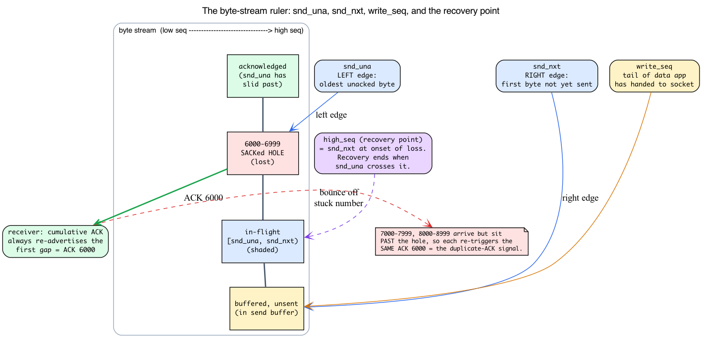
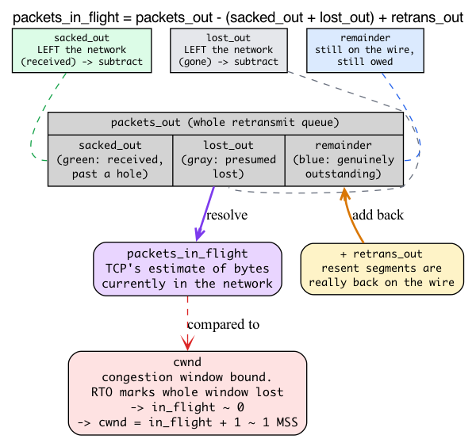
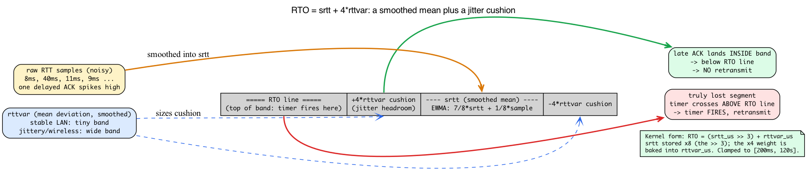

# Day 17 — TCP retransmission, RACK, recovery

> **Today's mission:** understand how TCP detects packet loss and recovers without breaking ordering. Three detection mechanisms, one recovery state, lots of timers — and the three pieces of TCP machinery they all secretly rest on (sequence numbers, in-flight accounting, and the RTT estimator). Total time: ~110 minutes.

## What "loss" means to TCP

TCP guarantees in-order, reliable delivery. The internet is neither in-order nor reliable. TCP's job is to detect loss/reorder and retransmit, while telling the application "all good, here's your bytes in order."

The sender keeps every transmitted-but-unacked segment in the **retransmit queue** (`tp->packets_out` segments, held in the `sk->tcp_rtx_queue` rbtree). It listens to ACKs to learn what got through. When it suspects a segment is lost, it sends another copy.

The hard part is *suspecting loss* without overreacting to mere reordering.

But before any of that makes sense, we have to make three things concrete that the rest of this chapter leans on constantly and that no earlier day taught in full:

1. **What a sequence number actually is**, and what `snd_una`/`snd_nxt` mean — because every loss signal in this chapter is ultimately a statement about *which bytes have been acknowledged*.
2. **How the kernel counts "packets in flight"** out of four separate counters — because the punitive RTO behavior (`cwnd = packets_in_flight + 1`) is meaningless until you know what that number is.
3. **How TCP builds a timeout out of a smoothed average plus a variance** — because the RTO formula is the first detection mechanism and it's just a bit-shift soup until you know *why* it's shaped that way.

Day 13 already pointed you at `struct tcp_sock`; today we give its retransmit-related fields meaning. Days 15 and 16 traced connection states and `cwnd` but never introduced the byte-stream/ACK model — so we start there.

---

## Background 1: sequence numbers, `snd_una`, `snd_nxt`, and cumulative ACKs

### TCP numbers bytes, not packets

Here's the foundational idea that everything else builds on: **TCP assigns a sequence number to every *byte* of the stream, not to every packet.** A segment's header carries the sequence number of its *first* byte. If a segment carries 1000 bytes starting at sequence 5000, it covers bytes 5000–5999, and the next segment will start at 6000.

The receiver doesn't ACK packets either. Its ACK carries the sequence number of the **next byte it expects** — that is, one past the last *contiguous* byte it has received. If the receiver has everything through byte 5999, it sends `ACK 6000`, meaning "I have all bytes up to and including 5999; give me 6000 next."

That word **contiguous** is the whole game. Read it twice.

### The sender's two edges: `snd_una` and `snd_nxt`

The sender tracks the in-flight window with two sequence numbers (both in `struct tcp_sock`):

- **`snd_una`** — "first byte we want an ack for." This is the **left edge** of the in-flight window: the oldest byte that has been sent but not yet acknowledged.
- **`snd_nxt`** — "next sequence we send." This is the **right edge**: the first byte not yet transmitted.

```c
/* include/linux/tcp.h */
u32     rcv_nxt;        /* What we want to receive next         (:303) */
u32     snd_nxt;        /* Next sequence we send                (:304) */
u32     snd_una;        /* First byte we want an ack for        (:305) */
u32     write_seq;      /* Tail(+1) of data held in tcp send buffer (:269) */
u32     packets_out;    /* Packets which are "in flight"        (:308) */
```

Everything in the half-open range **`[snd_una, snd_nxt)`** is transmitted-but-unacked — *that is exactly the retransmit queue this chapter centers on*. `packets_out` is the size of that range measured in segments. `write_seq` sits even further right: it's the tail of data the application has handed to the socket but TCP hasn't put on the wire yet.

The kernel splits these two ranges into two separate queues. On transmit, `tcp_event_new_data_sent` (`net/ipv4/tcp_output.c:88`) does `__skb_unlink(skb, &sk->sk_write_queue); tcp_rbtree_insert(&sk->tcp_rtx_queue, skb)` — so **`sk_write_queue` holds only the unsent range `[snd_nxt, write_seq)`**, while **`sk->tcp_rtx_queue` (a red-black tree) holds the sent-but-unacked range `[snd_una, snd_nxt)`** — the retransmit queue proper.

When an ACK arrives that acknowledges new data, the kernel slides `snd_una` to the right and frees the now-acknowledged segments from the retransmit queue. The window "opens" and new data can go out.



### Why a lost segment produces *duplicate* ACKs

ACKs are **cumulative**: an ACK for N means "I have *every* byte up to N−1," nothing more. The receiver cannot say "I have 5000–5999 and also 7000–7999" with a plain cumulative ACK — it can only re-advertise its highest *contiguous* point.

Now picture one segment lost in the middle of a burst. Bytes 6000–6999 vanish, but 7000–7999, 8000–8999, and so on keep arriving. The receiver still only has everything through byte 5999, so every one of those later arrivals triggers the **same** ACK: `ACK 6000`, again and again. The cumulative ACK number is *stuck* even though data keeps showing up.

**That stalled, repeated ACK number IS the duplicate-ACK signal** that feeds Fast Retransmit (mechanism 2 below). Duplicate ACKs aren't an error condition — they're the receiver politely screaming "I'm still missing byte 6000" the only way the cumulative-ACK protocol lets it.

### The recovery point: `high_seq`

When the sender finally detects loss and enters recovery, it snapshots the current `snd_nxt` into **`high_seq`** ("snd_nxt at onset of congestion"):

```c
/* include/linux/tcp.h:446 */
u32     high_seq;       /* snd_nxt at onset of congestion (the recovery point) */
```

This is the **recovery point**. Recovery is over precisely when `snd_una` crosses `high_seq` — i.e. once *everything that was outstanding at the moment loss began* has finally been acknowledged. Hold onto that: when later sections say "exit when `snd_una` reaches the recovery point," this is the field they mean.

The per-ACK machine that does all this dispatching, `tcp_fastretrans_alert`, takes a `prior_snd_una` argument — the value of `snd_una` *before* this ACK was processed — so it can tell whether the current ACK advanced the left edge (real new acknowledgment) or merely repeated the old number (a dupack):

```c
/* net/ipv4/tcp_input.c:3328 */
tcp_fastretrans_alert(struct sock *sk, const u32 prior_snd_una, ...)
```

> ### There are no Dumb Questions
>
> **Q: If TCP numbers every byte, doesn't the sequence number overflow fast?**
>
> A: It's a 32-bit number that wraps. The kernel never compares sequence numbers with plain `<`; it uses `before()`/`after()` helpers (in `include/net/tcp.h`) that do signed-difference comparisons so wraparound is handled correctly. For today, just think "monotonically increasing byte counter."
>
> **Q: Where does the first sequence number come from — is it zero?**
>
> A: No. Each direction picks a random **Initial Sequence Number** during the handshake (Day 15's SYN/SYN-ACK carried it). Starting from a predictable value would be a security hole. `snd_una`, `snd_nxt`, and friends are all offsets from that ISN.

---

## Background 2: counting "packets in flight"

The chapter is about to keep citing four counters and a derived quantity. Let's nail down how they relate, because the headline RTO behavior — `cwnd = packets_in_flight + 1` — is gibberish until you do.

### The four per-socket counters

Each lives in `struct tcp_sock` and measures segments in the retransmit queue:

```c
/* include/linux/tcp.h */
u32     lost_out;       /* Lost packets                         (:227) */
u32     sacked_out;     /* SACK'd packets                       (:228) */
u32     retrans_out;    /* Retransmitted packets out            (:244) */
u32     packets_out;    /* Packets which are "in flight"        (:308) */
```

- **`packets_out`** — segments transmitted but not yet *cumulatively* ACKed. This is the raw size of the retransmit queue in segments.
- **`sacked_out`** — segments the receiver told us — via SACK, a TCP option covered in full below that lets the receiver name byte-ranges it holds past a gap — it *did* receive, even though they're past a hole. Known-received; no longer on the wire.
- **`lost_out`** — segments TCP has *presumed* lost. Presumed-gone; also no longer occupying the bottleneck.
- **`retrans_out`** — segments we've *resent*. A resent segment is genuinely back on the wire.

### The accounting identity

The kernel never trusts `packets_out` alone for congestion decisions, because some of those segments it has *other evidence* about. It subtracts what it knows left the network and adds back what it put back on:

```c
/* include/net/tcp.h:1483 */
static inline unsigned int tcp_left_out(const struct tcp_sock *tp)
{
        return tp->sacked_out + tp->lost_out;
}

/* include/net/tcp.h:1502 */
static inline unsigned int tcp_packets_in_flight(const struct tcp_sock *tp)
{
        return tp->packets_out - tcp_left_out(tp) + tp->retrans_out;
}
```

Read it as the kernel's own comment does:

> "Packets sent once on transmission queue" MINUS "Packets left network, but not honestly ACKed yet" PLUS "Packets fast retransmitted."

SACKed and lost segments are both "left the network" — one received, one gone — so they come *out* of the count. Retransmits go *back in* because they're really loading the wire again. The result, **`packets_in_flight`**, is TCP's best estimate of bytes currently in the network, and it's the quantity congestion control compares against `cwnd`.

This is exactly why **an RTO that sets `cwnd = packets_in_flight + 1` collapses the sender to ~1 segment.** On a timeout the kernel marks the outstanding window lost — all but the most recently sent segments (`tcp_timeout_mark_lost` spares those sent within the last RTT) — so `packets_in_flight` collapses toward zero, and `cwnd = packets_in_flight + 1` falls to ~1 MSS in the typical case — back to slow start from scratch (recall slow start from Day 16). And it tells you what SACK *buys*: every segment SACK moves from "still owed" into `sacked_out` is a segment subtracted from in-flight, which frees window to send something new instead of stalling.



### The per-skb backing store

Those per-socket counters are summaries. The ground truth lives on each skb in the retransmit queue, in a bitfield inside its TCP control block:

```c
/* include/net/tcp.h */
TCPCB_SACKED_ACKED   = (1 << 0),   /* SKB ACK'd by a SACK block    (:1082) */
TCPCB_SACKED_RETRANS = (1 << 1),   /* SKB retransmitted            (:1083) */
TCPCB_LOST           = (1 << 2),   /* SKB is lost                  (:1084) */
...
__u8    sacked;                    /* State flags for SACK         (:1117) */
```

When SACK processing marks an skb `TCPCB_SACKED_ACKED`, it bumps `sacked_out`; when RACK marks one `TCPCB_LOST`, it bumps `lost_out`; and so on. The socket counters and the per-skb bits are kept in lockstep — `tcp_verify_left_out` even `WARN_ON(tcp_left_out(tp) > tp->packets_out)` to catch bookkeeping bugs.

---

## Background 3: the RTT estimator — srtt and rttvar as an EWMA

The first detection mechanism is the Retransmission Timeout. To build a timeout you need a target RTT — but **you cannot time out on a single RTT measurement, because RTT is noisy.** One sample might be 8 ms, the next 40 ms because an ACK got delayed behind a big packet. Time out on the raw sample and you'll declare loss constantly on a perfectly healthy path.

### Smoothing: the EWMA

TCP keeps a *running smoothed average* of RTT. Each new sample nudges the estimate a little instead of replacing it:

```
srtt = 7/8 · srtt + 1/8 · new_sample
```

This is an **EWMA** (exponentially-weighted moving average): recent samples weigh more, old ones decay exponentially. It's the kernel's `tcp_rtt_estimator`, lifted essentially verbatim from Jacobson's 1988 SIGCOMM paper. You can see the shifts directly:

```c
/* net/ipv4/tcp_input.c:1070  tcp_rtt_estimator() */
m -= (srtt >> 3);              /* m is now error in rtt est */
srtt += m;                     /* rtt = 7/8 rtt + 1/8 new   */
...
m -= (tp->mdev_us >> 2);       /* similar update on mdev    */
tp->mdev_us += m;              /* mdev = 3/4 mdev + 1/4 new */
```

### Variance: why a mean isn't enough

A smooth average tells you the *typical* RTT but not how much it *jitters*. So TCP also tracks the **mean deviation** (`mdev_us`), smoothed into **`rttvar_us`**. A stable path (a quiet LAN) has tiny `rttvar`; a congested or wireless path has large `rttvar`.

The timeout must clear the **jitter**, not just the average — otherwise a normally-late ACK on a jittery path gets mistaken for loss. That's why RFC 6298 sets:

```
RTO = srtt + 4 · rttvar
```

The `4·rttvar` is an adaptive safety cushion. With only `srtt` you'd be forced to choose one fixed margin: too tight on jittery paths (spurious retransmits and needless `cwnd` cuts) or too loose on stable ones (you sit idle for ages after a real loss). The variance term auto-sizes the cushion to the path.



### Now the scaling makes sense

```
RTO = (srtt_us >> 3) + rttvar_us    (clamped to [200ms, 120s])
```

This is the RFC 6298 form `RTO = srtt + 4·rttvar`: `srtt_us` is stored ×8 (hence `>> 3`), and `rttvar_us` is already maintained on a ×4 scale of the mean deviation — so the classic ×4 weight is *baked into* `rttvar_us` and the kernel just adds the two fields. (Don't multiply by 4 again.)

The kernel's `__tcp_set_rto` (`include/net/tcp.h:881`) is literally that:

```c
static inline u32 __tcp_set_rto(const struct tcp_sock *tp)
{
        return usecs_to_jiffies((tp->srtt_us >> 3) + tp->rttvar_us);
}
```

and `tcp_set_rto` (`net/ipv4/tcp_input.c:1175`) calls it and stores the result in `icsk_rto`. The relevant fields:

```c
/* include/linux/tcp.h */
u32     srtt_us;        /* smoothed round trip time << 3 in usecs (:307) */
u32     rttvar_us;      /* smoothed mdev_max                      (:243) */
u32     mdev_us;        /* medium deviation                       (:272) */
```

The result is clamped to **[200ms, 120s]** (`TCP_RTO_MIN = HZ/5`, `TCP_RTO_MAX = 120s` in `include/net/tcp.h`) so a tiny LAN RTT still yields a sane minimum and a broken path can't push RTO to infinity.

---

## Three detection mechanisms

With sequence numbers, in-flight accounting, and the RTT estimator in hand, the three loss-detection mechanisms read cleanly.


### 1. RTO — Retransmission Timeout

The classical mechanism, built directly on Background 3's RTO value. If no ACK arrives within RTO of the *first* unacked segment (the one at `snd_una`), the timer fires:

- The first unacked segment is retransmitted.
- The kernel enters CA_Loss state.
- `cwnd` is reset to `tcp_packets_in_flight(tp) + 1` — effectively ~1 MSS after a timeout (slow start from scratch, as Background 2 explained: most of the window is marked lost — all but the segments sent within the last RTT — so in-flight collapses toward ~0).
- RTO is doubled (exponential backoff).

Implementation: **`tcp_retransmit_timer`** at `net/ipv4/tcp_timer.c:535`. Read this once — it's the canonical loss-recovery entry point.

RTO is the most pessimistic detection: it waits hundreds of ms before declaring loss. Useful as a backstop but expensive in latency. The other two mechanisms react faster.

### 2. Duplicate ACKs / Fast Retransmit

If a segment is lost but later ones arrived, the receiver keeps ACKing the highest *contiguous* sequence — producing duplicate ACKs ("dupacks"). This is the stuck-cumulative-ACK signal from Background 1 — the receiver re-sending the same ACK number because it can't advance past the hole.

Classic Reno rule: **3 dupacks → fast retransmit**. The sender retransmits the missing segment immediately, without waiting for RTO.

This works for single-segment losses. For burst losses (multiple gaps), Reno needs SACK to keep going.

### 3. RACK — Recent ACK (the modern default since 4.4)

`net/ipv4/tcp_recovery.c`. RACK uses ACK *timing* instead of duplicate-ACK counts. The intuition:

> "If a segment Y was sent before X, and X has been acknowledged, then Y is probably lost."

Specifically: if some segment with a *later* send time has been SACKed, and the gap is >= reordering window, the unacked earlier segment is declared lost. This catches loss faster than Reno's 3-dupack rule, especially with reordering.

RACK is the current default (`net.ipv4.tcp_recovery=1`). If you ever set `tcp_recovery=0`, you fall back to legacy 3-dupack detection — slower and more conservative.

> **Historical note — FACK.** You'll still see "FACK" (Forward Acknowledgment) mentioned in old docs and in kernel comments (`tcp_recovery.c`, `tcp_vegas.c`). FACK was an older SACK-based loss heuristic; it was **removed from the kernel around 4.11** in favor of RACK, which generalizes the same idea using ACK timing. Only the comments survive — there's no FACK code path to read anymore.

## SACK — Selective Acknowledgments (RFC 2018)

By default, ACKs are cumulative: "I have everything up to seq N" (Background 1). This is enough for Reno but limits parallelism — the receiver can't tell the sender about data it holds *past* a hole. With **SACK**, ACKs include up to 4 ranges: "I have up to N, and also blocks A-B, C-D, E-F." The sender uses this to avoid retransmitting segments the receiver already has, and to move those segments into `sacked_out` (Background 2) so they stop counting against `cwnd`.

SACK is on by default. The state structures: `tcp_sock->sacked_out`, `tp->lost_out`, `tp->retrans_out` track per-segment status. Each skb in the retransmit queue has a `tcb->sacked` bitfield (`TCPCB_SACKED_ACKED`, `TCPCB_LOST`, `TCPCB_SACKED_RETRANS`) — the per-skb backing for those counters, exactly as Background 2 described.

## The recovery state

When loss is detected (any of the three mechanisms above), the kernel calls **`tcp_enter_recovery`** (`net/ipv4/tcp_input.c:3177`):

1. Sets `icsk->icsk_ca_state = TCP_CA_Recovery`.
2. Reduces `cwnd` toward `ssthresh` (PRR — Proportional Rate Reduction; reduces gracefully across the RTT). How far depends on the CC: the default CUBIC drops to ≈70% (β = 717/1024), classic Reno halves to 50%.
3. Calls the CC algorithm's `set_state(CA_Recovery)` — most algorithms record the loss event.

This is also where `high_seq` is set to the current `snd_nxt` — the recovery point from Background 1. While in Recovery, the kernel transmits new segments at the reduced rate and selectively retransmits the lost ones. Recovery ends when `snd_una` advances past `high_seq` (the "recovery point") — the kernel calls `tcp_end_cwnd_reduction` and returns to CA_Open.

For RTO-driven loss, the kernel uses **`tcp_enter_loss`** (`net/ipv4/tcp_input.c:2554`) instead — much more punitive (cwnd=1, slow start).

## The recovery state machine: `tcp_fastretrans_alert`

`net/ipv4/tcp_input.c:3328` — entered on every ACK that might require recovery action. It receives `prior_snd_una` (Background 1) so it can tell a real new acknowledgment from a dupack. This is the full version of the `ca_state` machine Day 16 sketched and deferred. Walks the state machine:

```
Open      → Disorder    (first dupack or SACK)
Disorder  → Recovery    (loss confirmed; start retransmits)
Recovery  → Open        (recovery point reached: snd_una crosses high_seq)
Open      → Loss        (RTO fired)
Loss      → Open        (after RTO recovery)
```

Each state has its own logic for what to send and how to count cwnd. ~114 lines; read it once.

## ACK clocking and PRR

When the sender enters Recovery, the question is "how fast should I retransmit?"

- Naïve answer: blast all the missing segments immediately. Bad — overshoots and causes more loss.
- PRR answer: pace retransmits at exactly the rate of returning ACKs, gradually working cwnd down toward the new `ssthresh` (the reduced target from the previous section).

PRR (RFC 6937) is the kernel's recovery rate-control strategy. The `prr_out`, `prr_delivered` fields in `tcp_sock` track its state.

## Today's experiment

Use `tc netem` to inject loss and watch recovery happen.

**Prereq:** install `iperf3` — `sudo apt-get install -y iperf3` (Debian/Ubuntu) or `sudo dnf install -y iperf3` (Fedora/RHEL); confirm with `iperf3 --version`. The `tc netem` step needs the `sch_netem` module, which auto-loads the moment you run `tc qdisc add ... netem` and is present in any stock kernel (no manual `modprobe`).

```bash
# Inject 5% loss on loopback
sudo tc qdisc add dev lo root netem loss 5%

# Start the server, then run the client in the BACKGROUND (&) so the shell
# stays free to inspect the socket while the 30s transfer is still live.
iperf3 -s -p 5201 &
sleep 1                 # give the server a moment to bind before connecting
iperf3 -c 127.0.0.1 -p 5201 -t 30 &

# A few seconds in — WHILE the transfer is still running — inspect the socket.
# ss must run during the transfer: once the client exits the iperf3 socket is
# gone and you'll only see unrelated connections (e.g. your SSH session).
ss -tin '( dport = :5201 or sport = :5201 )'

# nstat is cumulative, so it's fine to run this even after the transfer ends.
nstat | grep -i Retrans
```

While the transfer is live, `ss` lists the iperf3 socket with a reduced `cwnd` and a `retrans:A/B` field whose second number climbs as netem drops segments (the field is explained in *Per-connection retransmit info* below). `nstat | grep -i Retrans` then reports cumulative counters such as `TcpRetransSegs` and `TcpExtTCPSackRecovery`.

Trace recovery entry. This loops every 10s — press **Ctrl-C** to stop — and only counts while loss recovery is actually happening, so you need a lossy transfer running **concurrently**: keep the netem qdisc above active and, in a second terminal, run `iperf3 -c 127.0.0.1 -p 5201 -t 30`. Against an idle system every 10s window prints zeros.

```bash
sudo bpftrace -e '
fentry:tcp_enter_recovery { @rec = count(); }
fentry:tcp_enter_loss { @loss = count(); }
fentry:tcp_retransmit_skb { @retx = count(); }
interval:s:10 { print(@rec); print(@loss); print(@retx); clear(@rec); clear(@loss); clear(@retx); }'
```

Expect: many retransmits, several Recovery entries (each loss event), occasional Loss entries (when RTOs fire).

When you're done, remove the injected loss and stop the background server:

```bash
# Restore
sudo tc qdisc del dev lo root
kill %1 2>/dev/null   # stop the background iperf3 server (or: pkill -f 'iperf3 -s')
```

### Per-connection retransmit info

```bash
ss -tin | grep -A 1 ESTAB
# look for: cwnd:N retrans:OUTSTANDING/TOTAL
```

Real output from a connection on the box:

```
ESTAB 0 0  10.0.0.4:22  ...:53179
     cubic wscale:6,10 rto:219 ... cwnd:10 ssthresh:48 ... retrans:0/2 reord_seen:2 ... minrtt:10.33
```

`ss` prints `retrans:A/B` for the connection. `A` is the number of retransmissions currently **outstanding / in flight** (`tcpi_retrans` in `uapi/linux/tcp.h`) — this is `retrans_out` from Background 2 surfaced to userspace; `B` is the **cumulative total** retransmissions over the connection's life (`tcpi_total_retrans`). Above, `retrans:0/2` means 0 retransmits outstanding right now and 2 total so far. The two values are not direction-related — there are no `RX`/`TX` fields here. (Notice also the `rto:219` field — that's the RTO from Background 3, in milliseconds, clamped above the 200ms floor.)

## What to read in the kernel

- **`net/ipv4/tcp_input.c:3328`** — `tcp_fastretrans_alert`. The state-machine entry called per ACK. Read top to bottom. Notice how it uses `prior_snd_una` (the ACK before this one) to detect new acknowledgments and dispatch into the right action.

- **`net/ipv4/tcp_input.c:3177`** — `tcp_enter_recovery`. The "we're in trouble" entry point. ~25 lines. Walk through: cwnd reduction, calling `set_state` on the CC algorithm, setting up PRR.

- **`net/ipv4/tcp_input.c:2554`** — `tcp_enter_loss`. The RTO-driven recovery. Much more punitive than `tcp_enter_recovery` — used only for RTO. Notice cwnd resets to `tcp_packets_in_flight(tp) + 1` (≈1 MSS).

- **`net/ipv4/tcp_input.c:3602`** — `tcp_clean_rtx_queue`. The function that walks the `sk->tcp_rtx_queue` rbtree (via `skb_rb_first`) and removes ACKed segments (advancing `snd_una`). The complexity here is computing RTT samples for each ACKed segment (the very samples that feed `tcp_rtt_estimator`; many SACK edge cases).

- **`net/ipv4/tcp_recovery.c`** — RACK implementation. Short (~160 lines). Read all of it. The key function is `tcp_rack_detect_loss` — given the latest ACK time and SACK info, decide which earlier segments are now considered lost.

- **`net/ipv4/tcp_timer.c:535`** — `tcp_retransmit_timer`. The RTO-fires entry. Read top to bottom (~150 lines). Notice the "user timeout" handling (gives up after `TCP_USER_TIMEOUT` even if RTO would keep retrying), and the explicit congestion exit if too many retries.

- **`net/ipv4/tcp_output.c:3694`** — `tcp_retransmit_skb`. How a single skb gets resent. Notice the GSO/TSO splitting if the skb represents multiple segments — only the lost portion is retransmitted.

- **`net/ipv4/tcp_output.c:3724`** — `tcp_xmit_retransmit_queue`. Drives retransmits during recovery: walks the queue, picks segments marked LOST, sends them at the PRR-paced rate.

- **`include/linux/tcp.h:197`** — `struct tcp_sock`. The retransmit-related fields are clustered: `packets_out`, `lost_out`, `sacked_out`, `retrans_out`, `prr_out`, `prr_delivered`, `rack`. Skim them once to know what each tracks.

- **`include/net/tcp.h:1502`** — `tcp_packets_in_flight` and `tcp_left_out` (`:1483`). One-line functions, but they're the accounting identity from Background 2 — re-read them with the comment above them.

- **RFCs to skim if curious:** 5681 (Reno + congestion avoidance), 6675 (SACK-based recovery), 6937 (PRR), 8985 (RACK).

## Bullet Points

- **TCP numbers every byte**, not every packet. `snd_una` = first unacked byte (left edge), `snd_nxt` = next byte to send (right edge); `[snd_una, snd_nxt)` is the retransmit queue. ACKs are **cumulative** — a stuck ACK number on later arrivals is the duplicate-ACK loss signal.
- **`packets_in_flight = packets_out − (sacked_out + lost_out) + retrans_out`** — TCP's estimate of bytes on the wire, the thing `cwnd` bounds. An RTO marks most of the window lost (sparing segments sent within the last RTT), so in-flight → ~0 and `cwnd = in_flight + 1` ≈ 1 MSS.
- **RTO = (srtt_us >> 3) + rttvar_us**, an EWMA mean (`srtt = 7/8·srtt + 1/8·sample`) plus `4·rttvar` of jitter, clamped to [200ms, 120s]. The ×4 is baked into `rttvar_us`; don't multiply again.
- TCP keeps every unacked segment in the `sk->tcp_rtx_queue` rbtree until ACKed; unsent data waits in `sk_write_queue`.
- **Three loss-detection mechanisms**: RTO (slow, backstop), 3 dupacks (Reno), RACK (modern default).
- **`tcp_recovery=1`** enables RACK; the default since 4.4.
- **SACK** lets ACKs include non-contiguous ranges; on by default; moves segments into `sacked_out` so they stop counting against `cwnd`.
- **Recovery state**: cwnd reduced toward ssthresh (≈70% for CUBIC, 50% for Reno) via PRR, retransmit lost segments at ACK-paced rate, exit when `snd_una` reaches the recovery point (`high_seq`).
- **`tcp_retransmit_timer`** at `net/ipv4/tcp_timer.c:535` is the RTO entry.
- **`tcp_fastretrans_alert`** at `net/ipv4/tcp_input.c:3328` is the per-ACK recovery state machine.
- Inspect: `ss -tin` (cwnd, retrans, rto), `nstat` (TCPRetrans, TCPSackRecovery, etc.).
- **Use `tc netem loss N%`** to test loss recovery in a controlled environment.

## Check question

Why does losing 1% of packets on a 100 ms RTT path cause throughput to drop *much* more than 1%?

<details>
<summary>Click to reveal answer</summary>

**Answer:** Because each loss causes the CC algorithm to cut cwnd (CUBIC to ≈70%, Reno to 50%), and recovering that lost window takes many RTTs of growth. The Mathis formula approximates achievable throughput:

> throughput ≈ MSS / (RTT × √loss_rate)

Plug in (in bits): MSS=1448 B = 11584 bits, RTT=0.1 s, √0.01 = 0.1 → 11584 / (0.1 × 0.1) ≈ **1.16 Mbps**. Even on a 10 Gbps path, you cap near ~1 Mbps. CUBIC is loss-based — it interprets every loss as congestion and backs off. With one back-off per ~100 packets, cwnd never reaches what the path could actually support.

**BBR partially fixes this** because it doesn't use loss as the signal — it uses bandwidth and RTT directly. On the same lossy path, BBR can sustain throughput much closer to the path's actual capacity.

</details>

---

## Tomorrow

Day 18: socket options. The pile of per-socket tuning knobs and what each one actually does.
