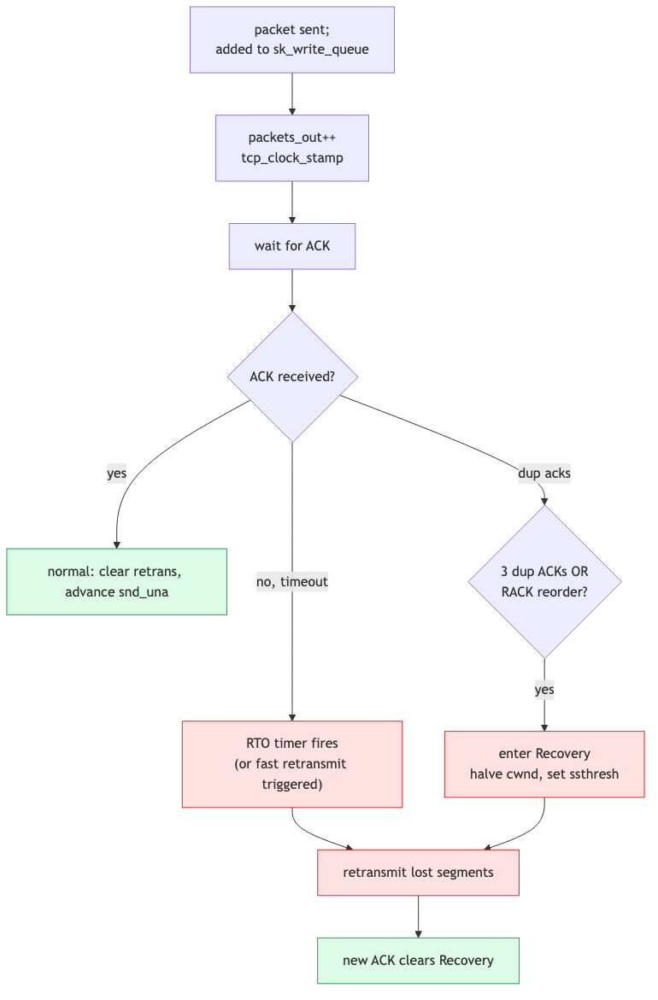

# Day 17 — TCP retransmission, RACK, recovery

> **Today's mission:** understand how TCP detects packet loss and recovers without breaking ordering. Three detection mechanisms, one recovery state, lots of timers. Total time: ~75 minutes.

## What "loss" means to TCP

TCP guarantees in-order, reliable delivery. The internet is neither in-order nor reliable. TCP's job is to detect loss/reorder and retransmit, while telling the application "all good, here's your bytes in order."

The sender keeps every transmitted-but-unacked segment in the **retransmit queue** (`tp->packets_out`, hanging off `sk_write_queue`). It listens to ACKs to learn what got through. When it suspects a segment is lost, it sends another copy.

The hard part is *suspecting loss* without overreacting to mere reordering.

## Three detection mechanisms



### 1. RTO — Retransmission Timeout

The classical mechanism. The sender maintains a smoothed RTT estimate (`srtt_us`) and an RTT variance (`rttvar_us`). The kernel's RTO calculation (`__tcp_set_rto`, `include/net/tcp.h`) is literally:

```
RTO = (srtt_us >> 3) + rttvar_us    (clamped to [200ms, 120s])
```

This is the RFC 6298 form `RTO = srtt + 4·rttvar`: `srtt_us` is stored ×8 (hence `>> 3`), and `rttvar_us` is already maintained on a ×4 scale of the mean deviation — so the classic ×4 weight is *baked into* `rttvar_us` and the kernel just adds the two fields. (Don't multiply by 4 again.)

If no ACK arrives within RTO of the *first* unacked segment, the timer fires:

- The first unacked segment is retransmitted.
- The kernel enters CA_Loss state.
- `cwnd` is reset to `tcp_packets_in_flight(tp) + 1` — effectively ~1 MSS after a timeout (slow start from scratch).
- RTO is doubled (exponential backoff).

Implementation: **`tcp_retransmit_timer`** at `net/ipv4/tcp_timer.c:535`. Read this once — it's the canonical loss-recovery entry point.

RTO is the most pessimistic detection: it waits hundreds of ms before declaring loss. Useful as a backstop but expensive in latency. The other two mechanisms react faster.

### 2. Duplicate ACKs / Fast Retransmit

If a segment is lost but later ones arrived, the receiver keeps ACKing the highest *contiguous* sequence — producing duplicate ACKs ("dupacks").

Classic Reno rule: **3 dupacks → fast retransmit**. The sender retransmits the missing segment immediately, without waiting for RTO.

This works for single-segment losses. For burst losses (multiple gaps), Reno needs SACK to keep going.

### 3. RACK — Recent ACK (the modern default since 4.4)

`net/ipv4/tcp_recovery.c`. RACK uses ACK *timing* instead of duplicate-ACK counts. The intuition:

> "If a segment Y was sent before X, and X has been acknowledged, then Y is probably lost."

Specifically: if some segment with a *later* send time has been SACKed, and the gap is >= reordering window, the unacked earlier segment is declared lost. This catches loss faster than Reno's 3-dupack rule, especially with reordering.

RACK is the current default (`net.ipv4.tcp_recovery=1`). If you ever set `tcp_recovery=0`, you fall back to legacy 3-dupack detection — slower and more conservative.

> **Historical note — FACK.** You'll still see "FACK" (Forward Acknowledgment) mentioned in old docs and in kernel comments (`tcp_recovery.c`, `tcp_vegas.c`). FACK was an older SACK-based loss heuristic; it was **removed from the kernel around 4.11** in favor of RACK, which generalizes the same idea using ACK timing. Only the comments survive — there's no FACK code path to read anymore.

## SACK — Selective Acknowledgments (RFC 2018)

By default, ACKs are cumulative: "I have everything up to seq N." This is enough for Reno but limits parallelism. With **SACK**, ACKs include up to 4 ranges: "I have up to N, and also blocks A-B, C-D, E-F." The sender uses this to avoid retransmitting segments the receiver already has.

SACK is on by default. The state structures: `tcp_sock->sacked_out`, `tp->lost_out`, `tp->retrans_out` track per-segment status. Each skb in the retransmit queue has a `tcb->sacked` bitfield (`TCPCB_SACKED_ACKED`, `TCPCB_LOST`, `TCPCB_SACKED_RETRANS`).

## The recovery state

When loss is detected (any of the three mechanisms above), the kernel calls **`tcp_enter_recovery`** (`net/ipv4/tcp_input.c:3177`):

1. Sets `icsk->icsk_ca_state = TCP_CA_Recovery`.
2. Reduces `cwnd` toward `ssthresh` (PRR — Proportional Rate Reduction; reduces gracefully across the RTT). How far depends on the CC: the default CUBIC drops to ≈70% (β = 717/1024), classic Reno halves to 50%.
3. Calls the CC algorithm's `set_state(CA_Recovery)` — most algorithms record the loss event.

While in Recovery, the kernel transmits new segments at the reduced rate and selectively retransmits the lost ones. Recovery ends when `snd_una` advances past where the loss was detected (the "recovery point") — the kernel calls `tcp_complete_cwr` and returns to CA_Open.

For RTO-driven loss, the kernel uses **`tcp_enter_loss`** (`net/ipv4/tcp_input.c:2554`) instead — much more punitive (cwnd=1, slow start).

## The recovery state machine: `tcp_fastretrans_alert`

`net/ipv4/tcp_input.c:3328` — entered on every ACK that might require recovery action. Walks the state machine:

```
Open      → Disorder    (first dupack or SACK)
Disorder  → Recovery    (loss confirmed; start retransmits)
Recovery  → Open        (recovery point reached)
Open      → Loss        (RTO fired)
Loss      → Open        (after RTO recovery)
```

Each state has its own logic for what to send and how to count cwnd. ~114 lines; read it once.

## ACK clocking and PRR

When the sender enters Recovery, the question is "how fast should I retransmit?"

- Naïve answer: blast all the missing segments immediately. Bad — overshoots and causes more loss.
- PRR answer: pace retransmits at exactly the rate of returning ACKs, gradually working cwnd down toward the new `ssthresh` (≈70% of cwnd for CUBIC, 50% for Reno).

PRR (RFC 6937) is the kernel's recovery rate-control strategy. The `prr_out`, `prr_delivered` fields in `tcp_sock` track its state.

## Today's experiment

Use `tc netem` to inject loss and watch recovery happen.

**Prereq:** install `iperf3` — `sudo apt-get install -y iperf3` (Debian/Ubuntu) or `sudo dnf install -y iperf3` (Fedora/RHEL); confirm with `iperf3 --version`. The `tc netem` step needs the `sch_netem` module, which auto-loads the moment you run `tc qdisc add ... netem` and is present in any stock kernel (no manual `modprobe`).

```bash
# Inject 5% loss on loopback
sudo tc qdisc add dev lo root netem loss 5%

# Start the server, then run the client in the BACKGROUND (&) so the shell
# stays free to inspect the socket while the 30s transfer is still live.
iperf3 -s -p 5201 &
iperf3 -c 127.0.0.1 -p 5201 -t 30 &

# A few seconds in — WHILE the transfer is still running — inspect the socket.
# ss must run during the transfer: once the client exits the iperf3 socket is
# gone and you'll only see unrelated connections (e.g. your SSH session).
ss -tin '( dport = :5201 or sport = :5201 )'

# nstat is cumulative, so it's fine to run this even after the transfer ends.
nstat | grep -i Retrans
```

While the transfer is live, `ss` lists the iperf3 socket with a reduced `cwnd` and a `retrans:A/B` field whose second number climbs as netem drops segments (the field is explained in *Per-connection retransmit info* below). `nstat | grep -i Retrans` then reports cumulative counters such as `TcpRetransSegs` and `TcpExtTCPSackRecovery`.

Trace recovery entry. This loops every 10s — press **Ctrl-C** to stop — and only counts while loss recovery is actually happening, so you need a lossy transfer running **concurrently**: keep the netem qdisc above active and, in a second terminal, run `iperf3 -c 127.0.0.1 -p 5201 -t 30`. Against an idle system every 10s window prints zeros.

```bash
sudo bpftrace -e '
fentry:tcp_enter_recovery { @rec = count(); }
fentry:tcp_enter_loss { @loss = count(); }
fentry:tcp_retransmit_skb { @retx = count(); }
interval:s:10 { print(@rec); print(@loss); print(@retx); clear(@rec); clear(@loss); clear(@retx); }'
```

Expect: many retransmits, several Recovery entries (each loss event), occasional Loss entries (when RTOs fire).

When you're done, remove the injected loss and stop the background server:

```bash
# Restore
sudo tc qdisc del dev lo root
kill %1 2>/dev/null   # stop the background iperf3 server (or: pkill -f 'iperf3 -s')
```

### Per-connection retransmit info

```bash
ss -tin | grep -A 1 ESTAB
# look for: cwnd:N retrans:OUTSTANDING/TOTAL
```

Real output from a connection on the box:

```
ESTAB 0 0  10.0.0.4:22  ...:53179
     cubic wscale:6,10 rto:219 ... cwnd:10 ssthresh:48 ... retrans:0/2 reord_seen:2 ... minrtt:10.33
```

`ss` prints `retrans:A/B` for the connection. `A` is the number of retransmissions currently **outstanding / in flight** (`tcpi_retrans` in `uapi/linux/tcp.h`); `B` is the **cumulative total** retransmissions over the connection's life (`tcpi_total_retrans`). Above, `retrans:0/2` means 0 retransmits outstanding right now and 2 total so far. The two values are not direction-related — there are no `RX`/`TX` fields here.

## What to read in the kernel

- **`net/ipv4/tcp_input.c:3328`** — `tcp_fastretrans_alert`. The state-machine entry called per ACK. Read top to bottom. Notice how it uses `prior_snd_una` (the ACK before this one) to detect new acknowledgments and dispatch into the right action.

- **`net/ipv4/tcp_input.c:3177`** — `tcp_enter_recovery`. The "we're in trouble" entry point. ~25 lines. Walk through: cwnd reduction, calling `set_state` on the CC algorithm, setting up PRR.

- **`net/ipv4/tcp_input.c:2554`** — `tcp_enter_loss`. The RTO-driven recovery. Much more punitive than `tcp_enter_recovery` — used only for RTO. Notice cwnd resets to `tcp_packets_in_flight(tp) + 1` (≈1 MSS).

- **`net/ipv4/tcp_input.c:3602`** — `tcp_clean_rtx_queue`. The function that walks `sk_write_queue` and removes ACKed segments. The complexity here is computing RTT samples for each ACKed segment (many SACK edge cases).

- **`net/ipv4/tcp_recovery.c`** — RACK implementation. Short (~160 lines). Read all of it. The key function is `tcp_rack_detect_loss` — given the latest ACK time and SACK info, decide which earlier segments are now considered lost.

- **`net/ipv4/tcp_timer.c:535`** — `tcp_retransmit_timer`. The RTO-fires entry. Read top to bottom (~150 lines). Notice the "user timeout" handling (gives up after `TCP_USER_TIMEOUT` even if RTO would keep retrying), and the explicit congestion exit if too many retries.

- **`net/ipv4/tcp_output.c:3694`** — `tcp_retransmit_skb`. How a single skb gets resent. Notice the GSO/TSO splitting if the skb represents multiple segments — only the lost portion is retransmitted.

- **`net/ipv4/tcp_output.c:3724`** — `tcp_xmit_retransmit_queue`. Drives retransmits during recovery: walks the queue, picks segments marked LOST, sends them at the PRR-paced rate.

- **`include/linux/tcp.h:197`** — `struct tcp_sock`. The retransmit-related fields are clustered: `packets_out`, `lost_out`, `sacked_out`, `retrans_out`, `prr_out`, `prr_delivered`, `rack`. Skim them once to know what each tracks.

- **RFCs to skim if curious:** 5681 (Reno + congestion avoidance), 6675 (SACK-based recovery), 6937 (PRR), 8985 (RACK).

## Bullet Points

- TCP keeps every unacked segment in `sk_write_queue` until ACKed.
- **Three loss-detection mechanisms**: RTO (slow, backstop), 3 dupacks (Reno), RACK (modern default).
- **`tcp_recovery=1`** enables RACK; the default since 4.4.
- **SACK** lets ACKs include non-contiguous ranges; on by default.
- **Recovery state**: cwnd reduced toward ssthresh (≈70% for CUBIC, 50% for Reno) via PRR, retransmit lost segments at ACK-paced rate, exit when `snd_una` reaches the recovery point.
- **`tcp_retransmit_timer`** at `net/ipv4/tcp_timer.c:535` is the RTO entry.
- **`tcp_fastretrans_alert`** at `net/ipv4/tcp_input.c:3328` is the per-ACK recovery state machine.
- Inspect: `ss -tin` (cwnd, retrans), `nstat` (TCPRetrans, TCPSackRecovery, etc.).
- **Use `tc netem loss N%`** to test loss recovery in a controlled environment.

## Check question

Why does losing 1% of packets on a 100 ms RTT path cause throughput to drop *much* more than 1%?

<details>
<summary>Click to reveal answer</summary>

**Answer:** Because each loss causes the CC algorithm to cut cwnd (CUBIC to ≈70%, Reno to 50%), and recovering that lost window takes many RTTs of growth. The Mathis formula approximates achievable throughput:

> throughput ≈ MSS / (RTT × √loss_rate)

Plug in (in bits): MSS=1448 B = 11584 bits, RTT=0.1 s, √0.01 = 0.1 → 11584 / (0.1 × 0.1) ≈ **1.16 Mbps**. Even on a 10 Gbps path, you cap near ~1 Mbps. CUBIC is loss-based — it interprets every loss as congestion and backs off. With one back-off per ~100 packets, cwnd never reaches what the path could actually support.

**BBR partially fixes this** because it doesn't use loss as the signal — it uses bandwidth and RTT directly. On the same lossy path, BBR can sustain throughput much closer to the path's actual capacity.

</details>

---

## Tomorrow

Day 18: socket options. The pile of per-socket tuning knobs and what each one actually does.
