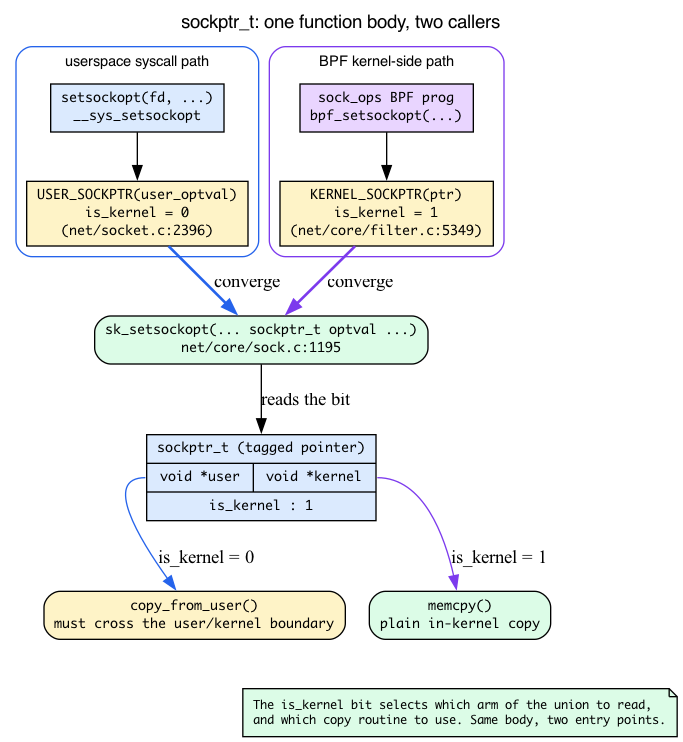
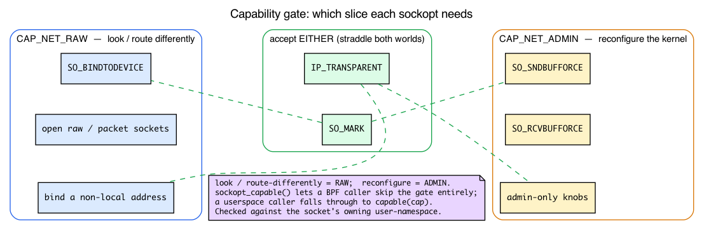
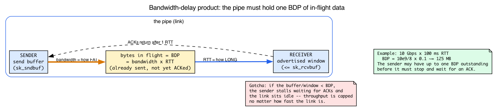
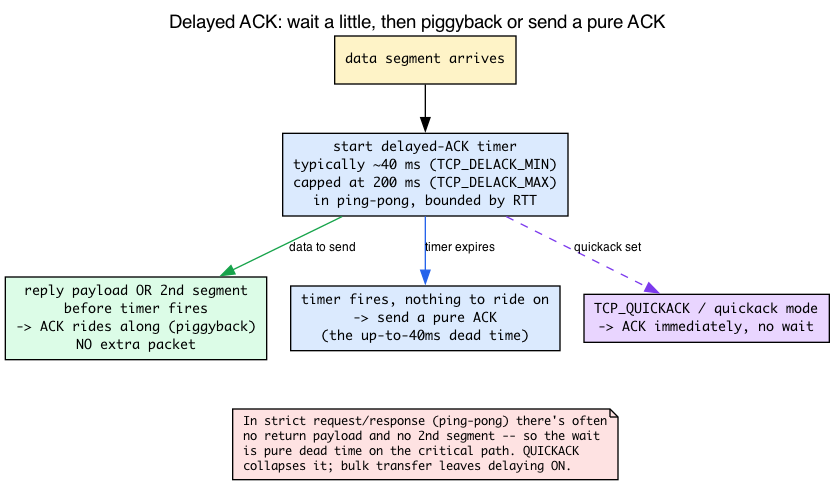

# Day 18 — Socket options: per-socket tuning

> **Today's mission:** know what each sockopt actually changes about a socket's behavior, when you'd reach for each, and where in the kernel the change takes effect. Along the way we'll fill in the four pieces of background the knobs lean on but the book never taught: the capability privilege gate, the `sockptr_t` unified-pointer ABI, receive/send buffer auto-tuning and the bandwidth-delay product, and the delayed-ACK timer that `TCP_QUICKACK` overrides. Total time: ~110 minutes.

## How sockopts work

A socket option is a per-socket knob set via:

```c
setsockopt(fd, level, optname, value, valuelen);
getsockopt(fd, level, optname, value, &valuelen);
```

The four parts of that call are a contract, and it's worth saying each one out loud because the rest of the day is just variations on it:

- **`level`** selects a *namespace* of options: `SOL_SOCKET` (generic, works on any socket), `SOL_IP` / `SOL_IPV6` (IP-layer), `SOL_TCP`, `SOL_UDP` (per-protocol). The same `optname` integer means different things under different levels, so the level disambiguates.
- **`optname`** picks the specific knob inside that namespace (`SO_RCVBUF`, `TCP_NODELAY`, …).
- **`optval`** is a pointer to a *typed* value — sometimes an `int`, sometimes a `struct linger`, sometimes a string like `"bbr"`. The kernel reinterprets the bytes according to `optname`.
- **`optlen`** is the size of that value.

For `getsockopt` there's one subtlety that trips up everyone the first time: **`optlen` is value-result.** You pass *in* the size of the buffer you're offering, and the kernel writes *back* how many bytes it actually filled. That's why today's experiment always passes `&gl` / `&cl` (the length) *by address* — the kernel needs to be able to update it. Forget the `&` and you either truncate the answer or get `EFAULT`.

### The kernel's dispatch path

When the syscall enters the kernel, the option has to find its way to the one `case` that implements it. The dispatch is mechanical:

1. The syscall lands in `do_sock_setsockopt` (`net/socket.c:2349`).
2. For `level == SOL_SOCKET` (generic), the kernel calls `sock_setsockopt` (`net/core/sock.c:1685`) — a thin wrapper that immediately calls **`sk_setsockopt`** (`net/core/sock.c:1195`), where the actual ~600-line option switch lives.
3. For other levels, it goes through `sk->sk_prot->setsockopt` (or, for AF_INET, `sock->ops->setsockopt`), which dispatches to per-protocol code: `tcp_setsockopt` (`net/ipv4/tcp.c:4175`), `udp_setsockopt`, `ip_setsockopt` (`net/ipv4/ip_sockglue.c:1409`), etc.

That `sk->sk_prot->setsockopt` in step 3 is the **`sk_prot` vtable from Day 13** — the per-protocol function table hanging off every `struct sock`. The same indirection that routes `sendmsg` to `tcp_sendmsg` vs `udp_sendmsg` routes setsockopt to the right protocol handler. (Recall the whole `struct sock`, its `sk_prot` dispatch, and its `sk_lock` from Day 13; we lean on all three today.)

Each option is a `case` in a giant switch statement. When you read `tcp_setsockopt`, you're reading the canonical "what does this knob change?" reference.


### One function body, two callers: `sockptr_t`

Look closely at `do_sock_setsockopt`'s signature in v7.1 and one parameter stands out:

```c
int do_sock_setsockopt(struct socket *sock, bool compat, int level,
		       int optname, sockptr_t optval, int optlen)   /* net/socket.c:2349 */
```

`optval` is not a `void *` and not a `void __user *` — it's a **`sockptr_t`**. This is the abstraction the "What to read" list tells you to *notice*, so let's actually explain it. A `sockptr_t` is a **tagged pointer**: a union of a kernel pointer and a userspace pointer plus a one-bit `is_kernel` flag (`include/linux/sockptr.h:14`):

```c
typedef struct {
	union {
		void		*kernel;
		void __user	*user;
	};
	bool		is_kernel : 1;
} sockptr_t;
```

Why bother? Because **the same option-setting code has two completely different callers:**

- **The syscall path.** `__sys_setsockopt` wraps the userspace buffer with `USER_SOCKPTR(user_optval)` (`net/socket.c:2396`), so `is_kernel = 0` and the kernel knows it must `copy_from_user` before touching the bytes.
- **The BPF path.** A `sock_ops` BPF program (the "BPF can override most of these" paragraph below) calls `bpf_setsockopt`, which reuses the very same `sk_setsockopt` by wrapping its argument with `KERNEL_SOCKPTR` (`net/core/filter.c:5349`), so `is_kernel = 1` and the bytes are copied as a plain in-kernel `memcpy`.

One function body, two entry points, the `is_kernel` bit selecting which arm of the union to read. That's the entire reason `sockptr_t` exists — and it's also why the capability-check helpers carry a `sockopt_` prefix (next section): a kernel-side BPF caller must be able to *skip* the privilege check that a userspace caller is held to.



### Who's allowed: the capability privilege gate

Four of today's options are gated behind a *capability* — you'll see "requires `CAP_NET_RAW`" or "requires `CAP_NET_ADMIN`" repeated below — so before the catalog, here's what a capability *is*.

Historically, a process was either **root** (uid 0, allowed to do anything) or not. That's too coarse: a packet-capture tool needs to open raw sockets but has no business rebooting the machine. **POSIX capabilities** slice root's omnipotence into ~40 independent privileges, each grantable on its own. A process can hold *just one slice* without being full root. Networking sockopts gate on two of these slices:

- **`CAP_NET_RAW`** — "look, or route differently": open raw/packet sockets, **re-bind an already device-bound socket to a *different* device** (binding an *unbound* socket to a device needs no capability), bind a *non-local* address.
- **`CAP_NET_ADMIN`** — "reconfigure kernel networking behavior": **force buffer sizes past the sysctl ceiling**, change admin-only knobs, set up transparent proxying.

The rule of thumb the chapter relies on: *raw access / "look but route my own way" = `CAP_NET_RAW`; "reconfigure the kernel" = `CAP_NET_ADMIN`.* So `SO_*BUFFORCE` (override the max) needs ADMIN; `SO_BINDTODEVICE` needs RAW; `IP_TRANSPARENT` and `SO_MARK` accept *either* (they straddle both worlds — a mark is "route differently," but it's also "reconfigure").

In the source the check is a one-liner. `sockopt_capable(CAP_NET_ADMIN)` returns `-EPERM` to the caller if the slice is missing — e.g. the `SO_SNDBUFFORCE` gate `if (!sockopt_capable(CAP_NET_ADMIN))` at `net/core/sock.c:1357`, and the matching `SO_RCVBUFFORCE` gate at `net/core/sock.c:1379`. The helper itself is tiny (`net/core/sock.c:1173`, declared at `include/net/sock.h:1780`):

```c
bool sockopt_capable(int cap)
{
	return has_current_bpf_ctx() || capable(cap);
}
```

There's the `sockopt_` prefix paying off: a BPF caller (`has_current_bpf_ctx()`) **skips the check entirely** — the kernel trusts its own programs. A userspace caller falls through to the real `capable(cap)`.

One more wrinkle that explains a real-world surprise: the mark check uses `sockopt_ns_capable(sock_net(sk)->user_ns, CAP_NET_X)`, and the device-bound check uses plain `ns_capable(net->user_ns, CAP_NET_RAW)` — both tested against the **socket's owning user-namespace**, not the global one. That's why an unprivileged container with its own user namespace can sometimes set a `SO_MARK` or re-bind to a device that looks like it should require root: inside its own userns it legitimately holds the slice. (The `SO_BINDTODEVICE` early branch is `if (sk->sk_bound_dev_if && !ns_capable(net->user_ns, CAP_NET_RAW))` at `net/core/sock.c:642` — note the leading `sk->sk_bound_dev_if &&`: the capability is only required to *change* the device once a socket is already bound; binding an unbound socket needs none. The `SO_MARK` gate accepts RAW-or-ADMIN at `net/core/sock.c:1527`.)



### The shape every case shares

You're about to read a catalog of options, but they all have the same skeleton — the one the "What to read" list calls out. Each `case` in `sk_setsockopt` (and its per-protocol cousins):

1. **copies `optval` in**, validating `optlen` (this is the `sockptr_t` copy from above);
2. **takes the socket lock** — `lock_sock` from Day 13, which serializes against the data path so a knob change can't race a concurrent `sendmsg`;
3. **mutates a field of `struct sock`** (or `struct tcp_sock`) — the same already-known struct from Day 13;
4. **releases the lock**.

So a sockopt is, mechanically, "lock the socket, write one field, unlock." Keep that in mind and the catalog reads as a tour of *which field each knob writes*.

## SOL_SOCKET — generic options

These work on any socket regardless of protocol family. Implementation: `sk_setsockopt` (`net/core/sock.c:1195`), reached via the thin `sock_setsockopt` wrapper (`net/core/sock.c:1685`).

### `SO_RCVBUF` / `SO_SNDBUF` — buffer sizes

- **What:** maximum bytes queued in the socket's receive (`sk_rcvbuf`) or send (`sk_sndbuf`) queue — the two `struct sock` fields you met on Day 13.
- **Why:** larger buffers absorb more burst traffic without dropping or back-pressuring. For high-BDP paths the default may be too small to keep the pipe full — see the BDP box below.
- **When:** any high-throughput TCP server. Default `tcp_rmem`/`tcp_wmem` triplets give a baseline; `SO_RCVBUF`/`SO_SNDBUF` override per-socket.
- **Gotcha:** the kernel **doubles the value you set** (one half is for kernel data structures); reads return the doubled value. This is in `sock_setsockopt` — the SO_SNDBUF case doubles at the `set_sndbuf` label (~line 1351). Also: setting these disables the kernel's automatic buffer auto-tuning (the BDP box explains exactly how).
- **Where:** `net/core/sock.c:1337` (SO_SNDBUF case) and `net/core/sock.c:1369` (SO_RCVBUF case).

> ### Background: BDP and buffer auto-tuning
>
> Two phrases in the section above — "high-BDP" and "auto-tuning" — are load-bearing and have never been defined. Here they are.
>
> **Bandwidth-delay product (BDP)** = bandwidth × round-trip time. It is the number of bytes that are "in flight" — already sent but not yet acknowledged — when a pipe is running full. Picture a hose: bandwidth is how fat the hose is, RTT is how long it is; BDP is how much water the hose holds. To keep a link *busy*, the sender must be allowed to have at least one BDP of unacknowledged data outstanding, which means the **send buffer** (and the peer's advertised **receive window**) must each be at least one BDP. A 10 Gbps link at 100 ms RTT has a BDP of `10e9/8 × 0.1 ≈ 125 MB` — vastly larger than any default buffer. *That* is why the "high-bandwidth × high-latency" phrasing matters: on a fat, long path a too-small buffer caps throughput no matter how fast the link is.
>
> **Auto-tuning** is how Linux copes without making you guess. By default (`tcp_moderate_rcvbuf = 1`) the kernel *grows* `sk_rcvbuf` on its own as it measures the connection's BDP rising, staying within the `tcp_rmem[min, default, max]` triplet. `tcp_wmem` is the send-side equivalent triplet. Left alone, a busy long-fat connection's buffers swell to fit the pipe automatically.
>
> **The gotcha mechanism, in three beats:**
>
> 1. **The userlock opts you out of auto-tuning.** Calling `setsockopt(SO_RCVBUF)` or `SO_SNDBUF` sets a "userlock" bit — `SOCK_RCVBUF_LOCK` / `SOCK_SNDBUF_LOCK`. You can see it in `__sock_set_rcvbuf` (`net/core/sock.c:967`): `sk->sk_userlocks |= SOCK_RCVBUF_LOCK;` at `:975`. After that the kernel never grows the buffer for you again.
> 2. **The arithmetic: clamp first, then double.** The value you ask for is *first* clamped to `sysctl_wmem_max` / `sysctl_rmem_max` (`net/core/sock.c:1343` clamps SO_SNDBUF; SO_RCVBUF clamps at `:1375`), and *then* doubled for kernel-data overhead — `sk_rcvbuf = max_t(int, val * 2, SOCK_MIN_RCVBUF)` (`:987`), with the comment spelling out why. So the stored buffer can be up to **twice** the sysctl ceiling (`2 * wmem_max` / `2 * rmem_max`). The SO_SNDBUF path is the mirror image at `net/core/sock.c:1343-1351`.
> 3. **The consequence — an explicit small value can hurt.** Because you turned off the autopilot, a value that's *too small* throttles throughput worse than the default would have: you set a low ceiling and then forbade the kernel from raising it. On a long-fat path, either don't set these at all, or set them generously.



### `SO_REUSEADDR` — bind on TIME_WAIT

- **What:** allow bind() to succeed even when a recent socket on the same port is in TIME_WAIT.
- **Why:** server restart shouldn't have to wait for TIME_WAITs to clear. (Recall TIME_WAIT from Day 15: the ~60 s wait the active closer sits in so late duplicate segments can't be mistaken for a new connection. Without `SO_REUSEADDR`, a restarting server's `bind()` fails with `EADDRINUSE` while old connections linger there.)
- **When:** every server. Set immediately after `socket()`.
- **Gotcha:** does **not** allow two sockets to bind the same port simultaneously — that's `SO_REUSEPORT`. The names are similar; the semantics are distinct.
- **Where:** `net/core/sock.c:1321`.

### `SO_REUSEPORT` — multiple sockets sharing one port

- **What:** lets N sockets (in the same UID and netns) bind the same `(addr, port)`. Kernel hashes incoming connections to spread across them.
- **Why:** scale a multi-process/multi-thread server across cores. Each worker has its own listening socket; no contention on the accept queue.
- **When:** any high-fanout server (nginx, envoy, custom Go/Rust servers). Day 24 covers it in detail.
- **Gotcha:** all sockets must set this *before* bind. UID match required (security: don't let user A snipe user B's port). The hash is per-flow, so a single client always lands on the same worker.
- **Where:** `net/core/sock.c:1324`. The dispatch logic is in `inet_csk_get_port` and `__inet_lookup_listener`.

### `SO_KEEPALIVE` — periodic liveness probes

- **What:** kernel sends periodic empty TCP segments to keep idle connections alive (and detect when the peer is gone).
- **Why:** detect dead peers (NAT box rebooted, peer crashed) without application-level heartbeats.
- **When:** long-lived connections behind NAT or load balancers (whose state may time out). Default off; specific applications turn it on.
- **Gotcha:** the keepalive intervals are *system-wide* sysctls (`net.ipv4.tcp_keepalive_time` = 7200s, `tcp_keepalive_intvl` = 75s, `tcp_keepalive_probes` = 9). For per-socket overrides, use `TCP_KEEPIDLE`, `TCP_KEEPINTVL`, `TCP_KEEPCNT` — see SOL_TCP.
- **Where:** `net/core/sock.c:1390`.

### `SO_LINGER` — block close() until data flushed (or RST)

- **What:** struct linger { l_onoff, l_linger }. If on, `close()` blocks until either pending data is sent or `l_linger` seconds elapse; in the latter case, RST is sent.
- **Why:** ensure the peer either gets the data or knows the connection abruptly ended.
- **When:** rare. Useful for testing (RST to force immediate close) or high-stakes data delivery (transactional protocols).
- **Gotcha:** with `l_onoff=1, l_linger=0`, `close()` immediately sends RST instead of FIN — useful for forced shutdowns but breaks graceful close. With `l_linger>0`, `close()` may block for up to `l_linger` seconds.
- **Where:** `net/core/sock.c:1404`.

### `SO_BINDTODEVICE` — restrict to one interface

- **What:** bind socket to a specific net_device (by name). Outbound packets go through that device only; inbound only matches if arrived on it.
- **Why:** multi-homed hosts where you want a daemon to use a specific path (e.g., always send through the management NIC).
- **When:** management daemons, VPN clients, custom multipath logic.
- **Gotcha:** binding an *unbound* socket to a device needs **no capability** at all (deliberately enabled for non-root users so unprivileged processes can use VRFs); **`CAP_NET_RAW`** is only required to *change* the device once a socket is already bound — the `sk->sk_bound_dev_if &&` guard at `net/core/sock.c:642`. Bypasses normal routing — be aware that you're disabling the kernel's path selection. The check is tested against the socket's *user-namespace*, so a container with its own userns may hold it.
- **Where:** `net/core/sock.c:1210` (a special early branch) and `net/core/sock.c:2045`.

### `SO_MARK` — set fwmark on outbound packets

- **What:** sets `skb->mark` for every packet sent on this socket. Pairs with `ip rule fwmark X lookup TABLE` for socket-driven policy routing.
- **Why:** route this app's traffic differently (VPN, custom gateway) without iptables tagging. (Recall Day 9: `skb->mark` is the `u32` scratch field on the sk_buff, and `ip rule fwmark … lookup TABLE` selects a non-default FIB table based on it — that's the policy-routing machinery this option feeds. We're just stamping the mark at the *socket* instead of in iptables.)
- **When:** VPN clients, multi-homed daemons, traffic-engineering tools.
- **Gotcha:** requires **`CAP_NET_RAW` or `CAP_NET_ADMIN`** (either suffices in v7.1 — a mark both "routes differently" and "reconfigures"). The mark is applied at *socket* level — packets generated by this socket carry it; received packets do not get it from this option.
- **Where:** `net/core/sock.c:1527`.

### `SO_PRIORITY` — qdisc priority class

- **What:** sets `skb->priority` for outbound packets. Used by qdiscs (notably `pfifo_fast`'s priority bands) for scheduling.
- **Why:** mark interactive traffic as higher priority.
- **When:** if you control the egress qdisc and want app-controlled scheduling. With modern `fq_codel` (default), this matters less.
- **Where:** `net/core/sock.c:1223` (SO_PRIORITY case in `sk_setsockopt`).

## SOL_IP / SOL_IPV6 — IP-layer options

Implementation: `do_ip_setsockopt` (`net/ipv4/ip_sockglue.c:892`).

### `IP_TOS` — set DSCP/ECN bits

- **What:** sets the IP header's TOS byte for outbound packets. The byte splits **6 + 2**: the top 6 bits are the **DSCP** field, the low 2 bits are **ECN**.
- **Why:** mark traffic for QoS classification (DSCP) or ECN-capable signaling. (Recall DSCP from Day 9's routing-selector boxes, and ECN from Day 16's DCTCP, which consumes ECN-CE marks. This option is just the userspace handle that writes those bits into the header.)
- **When:** QoS-aware applications. Check egress qdisc respects DSCP.
- **Gotcha:** the value you set must match what your qdisc expects — many networks rewrite or strip DSCP.
- **Where:** `net/ipv4/ip_sockglue.c:1057` (the case comment notes it "sets both TOS and Precedence").

### `IP_TTL` — outbound TTL

- **What:** override default TTL (usually 64) for outbound packets.
- **When:** traceroute (TTL=1), packet experiments. Most apps leave default.
- **Where:** `net/ipv4/ip_sockglue.c:1026`.

### `IP_PKTINFO` — receive auxiliary info per packet

- **What:** with `IP_PKTINFO=1`, `recvmsg` aux data includes the destination address the packet was sent to and the interface it arrived on.
- **Why:** UDP servers bound to `0.0.0.0` need to know which local IP a request was *destined to* (so the reply uses the same source). Without `IP_PKTINFO`, you'd have to bind one socket per IP.
- **When:** DHCP, DNS, SIP servers — any UDP service on a multi-homed host.
- **Where:** `net/ipv4/ip_sockglue.c:952`.

### `IP_TRANSPARENT` — bind to non-local addresses

- **What:** allows `bind()` to a non-local IP. Combined with iptables `TPROXY`, lets you intercept traffic destined elsewhere.
- **Why:** transparent proxies (squid, HAProxy with `transparent`, Envoy in some modes).
- **When:** L7 transparent proxies, packet capture tools that re-inject.
- **Gotcha:** requires **`CAP_NET_RAW` or `CAP_NET_ADMIN`** (either suffices — see the capability gate: binding a non-local address is "look/route differently," reconfiguring interception is "admin," so it straddles both), plus a corresponding TPROXY iptables rule + policy routing.
- **Where:** `net/ipv4/ip_sockglue.c:1010`.

### `IP_FREEBIND` — bind before address is configured

- **What:** allow `bind()` to an IP that doesn't currently exist on any local interface.
- **Why:** services that come up before networking is fully configured (failover daemons, daemons binding to floating IPs).
- **Where:** `net/ipv4/ip_sockglue.c:988`.

## SOL_TCP — TCP-specific options

Implementation: `do_tcp_setsockopt` (`net/ipv4/tcp.c:3840`).

### `TCP_NODELAY` — disable Nagle

- **What:** Nagle's algorithm batches small writes (waits for ACK or full segment before sending). `TCP_NODELAY=1` disables this — every write goes immediately.
- **Why:** latency-critical apps (interactive: SSH, X, gaming, real-time messaging) where waiting for a batch is unacceptable. (Recall Nagle from Day 3, the third gate in the TX path: *don't send a new small segment while a previous small one is still unacked — coalesce instead*, recorded in `tp->nonagle`. `TCP_NODELAY` flips `tp->nonagle` so the gate stops holding small writes.)
- **When:** request-response protocols where each request fits in <1 segment and latency matters. Most modern servers.
- **Gotcha:** if both NODELAY and CORK are off, default Nagle applies. NODELAY beats CORK for any individual `write`.
- **Where:** `net/ipv4/tcp.c:3970`.

### `TCP_CORK` — buffer until full or uncorked

- **What:** opposite of NODELAY. Hold writes until either an MSS-sized segment fills up or `TCP_CORK=0`. (It's a stronger, *deliberate* version of the Nagle batching from Day 3 — instead of "coalesce only while a small segment is unacked," it says "coalesce everything until I say go.")
- **Why:** an application building a multi-piece response (header + body) wants to ensure they go in one segment.
- **When:** static-file servers (`sendfile()` followed by uncork), HTTP servers building structured responses.
- **Gotcha:** corked sockets *will* eventually send (after ~200 ms) even without uncorking. But don't rely on that — explicitly uncork.
- **Where:** `net/ipv4/tcp.c:4043`.

### `TCP_QUICKACK` — disable delayed ACKs (one-shot)

- **What:** TCP normally delays ACKs by a short bounded time — typically ~40 ms (`TCP_DELACK_MIN`), capped at 200 ms (`TCP_DELACK_MAX`) in ping-pong mode — hoping to piggyback on outgoing data. `TCP_QUICKACK=1` forces an immediate ACK on the next received segment, then reverts to normal.
- **Why:** request-response patterns where you've just sent a request and the next segment is the response — you want to ACK fast so the server's CC algorithm sees it.
- **When:** rarely useful at the application level. The kernel already enters "quickack mode" automatically in some scenarios.
- **Gotcha:** it's a one-shot, not a persistent setting.
- **Where:** `net/ipv4/tcp.c:4062` (TCP_QUICKACK case in `do_tcp_setsockopt`).

> ### Background: what "delayed ACK" actually is
>
> `TCP_QUICKACK` overrides a mechanism the book hasn't introduced (Day 17 covered loss and retransmission, not this timer). **Delayed ACK:** after receiving data, TCP doesn't ACK immediately — it waits a short, bounded time (typically ~40 ms — `TCP_DELACK_MIN` = HZ/25, `include/net/tcp.h:154` — and capped at 200 ms — `TCP_DELACK_MAX` = HZ/5, `:150` — in ping-pong mode, further bounded by the connection's measured RTT) hoping that *either* a reply payload comes along so the ACK can ride on it (piggybacking), *or* a second data segment arrives so one ACK covers both. It trades a little latency for far fewer pure-ACK packets. The timer lives in the TCP output path — `tcp_send_delayed_ack` (`net/ipv4/tcp_output.c:4408`) uses the RTT estimate to bound the delay ("use it to bound delayed ack", `net/ipv4/tcp_output.c:4424`), and sending real data clears any pending delayed ACK ("Send it off, this clears delayed acks for us", `net/ipv4/tcp_output.c:4499`).
>
> Why it matters for the request/response case: in strict ping-pong traffic there's often *no* return payload to piggyback on and *no* second segment coming, so the wait (typically ~40 ms, up to 200 ms) is pure dead time on the critical path. `TCP_QUICKACK` (or the kernel's own quickack heuristics) cuts that delay. It reverts afterward because in steady bulk transfer delaying ACKs is the right default.



### `TCP_CONGESTION` — choose CC algorithm

- **What:** name string of CC algorithm (e.g., "cubic", "bbr"). Replaces the default for this socket.
- **Why:** different connections want different algorithms; per-socket override is the cleanest way. (Recall Day 16: the pluggable congestion-control framework and the per-socket `tcp_set_congestion_control`. This swaps the CC module for *one* socket — the congestion window `snd_cwnd` and the rest of the `struct tcp_sock` state from Day 13 are then driven by the new algorithm.)
- **When:** specialized workloads (intra-datacenter wants DCTCP; cross-WAN wants BBR).
- **Gotcha:** the algorithm must be loaded (`modprobe tcp_bbr`). Check `tcp_available_congestion_control`. Switching to some non-default algorithms requires `CAP_NET_ADMIN`.
- **Where:** `net/ipv4/tcp.c:3851`.

### `TCP_USER_TIMEOUT` — give up after milliseconds

- **What:** abort the connection if data has been unacked for the given time, regardless of RTO retries.
- **Why:** keep-alive isn't enough — you want hard "give up after 30 seconds" semantics.
- **When:** any application where stale connections are worse than aggressive aborts (RPC clients, request/response protocols with deadlines).
- **Gotcha:** in milliseconds (other timeouts are seconds — check the docs). 0 = use system default (which is roughly 15 min via RTO retry).
- **Where:** `net/ipv4/tcp.c:3922`.

### `TCP_FASTOPEN` — TCP Fast Open (TFO)

- **What:** server-side: queue up to N early-data connections (data carried in the SYN). Client-side: cookie-based optimistic data send.
- **Why:** save one RTT on connection establishment for repeated connections.
- **When:** services with frequent reconnects (CDN edges, mobile clients). 
- **Gotcha:** middleboxes often strip the TFO cookie. Sysctl `tcp_fastopen` configures support; bit 1 enables client, bit 2 enables server.
- **Where:** `net/ipv4/tcp.c:4101` (TCP_FASTOPEN case in `do_tcp_setsockopt`). The state machine is more complex than this option suggests.

### `TCP_INFO` — read tcp_info struct

- **What:** getsockopt-only. Returns `struct tcp_info` with rtt, cwnd, retrans count, state, etc.
- **Why:** observability without parsing `/proc/net/tcp`. (Recall Day 16: `tcp_get_info` fills this struct from the live `struct tcp_sock` — `snd_cwnd`, `srtt_us`, `ca_state`. This is the userspace handle on that state.)
- **When:** monitoring agents, performance debugging.
- **Where:** `net/ipv4/tcp.c` — search `tcp_get_info` (line 4213). Read this function: it's the source of truth for what `ss -tin` shows.

### `TCP_TX_DELAY` — artificial outbound delay (test/emulation only)

- **What:** delay outgoing packets by a fixed number of microseconds (optname 37). The kernel adds the delay to `skb->skb_mstamp_ns` and inflates the connection's `srtt_us`/`icsk_rto` so the rest of the stack behaves as if the path RTT were that much larger.
- **Why:** network *emulation* for testing — let a test on localhost (or a short path) behave like a high-latency WAN link without real distance or `tc netem`. Added in commit a842fe1425cb.
- **When:** test harnesses and benchmarks only. **Not** a production tuning knob.
- **Gotcha:** this has nothing to do with BBR or pacing. BBR paces via `sk_pacing_rate` + the `fq` qdisc, not this option; `TCP_TX_DELAY` only *adds* artificial latency.
- **Where:** `net/ipv4/tcp.c:4157` (TCP_TX_DELAY case in `do_tcp_setsockopt`).

## BPF can override most of these

A `sock_ops` BPF program (eBPF Day 19) can call `bpf_setsockopt()` to set sockopts kernel-side. The genuinely new capability this unlocks is **policy by cgroup or flow rather than by application**: a single BPF program can stamp a fleet-wide rule the apps never opted into — e.g. "every socket from the high-priority cgroup uses BBR" — overriding whatever each process set itself. (Mechanically it's exactly the *second caller* from the `sockptr_t` section: `KERNEL_SOCKPTR` into the same `sk_setsockopt`, `has_current_bpf_ctx()` sailing past the capability gate.) Day 19 builds one.

## There are no Dumb Questions

> **Q: Why does `getsockopt` take `optlen` by pointer when `setsockopt` takes it by value?**
>
> A: Because `getsockopt`'s `optlen` is *value-result*. On the way in it tells the kernel how big your buffer is (so the kernel won't overflow it); on the way out the kernel overwrites it with how many bytes it actually wrote. `setsockopt` only ever reads, so a plain value is enough. This is exactly why today's experiment passes `&gl` and `&cl` by address and re-initializes `cl = sizeof cc` before the *second* `TCP_CONGESTION` read — the first call shrank it to the length of `"cubic"`.

> **Q: I set `SO_RCVBUF` to a big number and throughput got *worse*. How?**
>
> A: You opted out of auto-tuning (the `SOCK_RCVBUF_LOCK` userlock) and, depending on the value, may have set a ceiling *below* what the kernel would have grown to on its own for your BDP. The autopilot was doing a better job. Either don't set it at all on a long-fat path, or set it generously (and remember the kernel doubles it, then clamps at `sysctl_rmem_max`).

> **Q: My container sets `SO_MARK` without being root. Is that a bug?**
>
> A: No. The check is `sockopt_ns_capable(sock_net(sk)->user_ns, …)` — it's against the socket's *user namespace*, not the global one. A container with its own user namespace can legitimately hold `CAP_NET_RAW`/`CAP_NET_ADMIN` inside that namespace, so marks that look privileged from the host's view are allowed from inside.

> **Q: How can one C function (`sk_setsockopt`) safely take a pointer that's sometimes userspace and sometimes kernel?**
>
> A: That's the whole job of `sockptr_t` — a union plus an `is_kernel` bit. Userspace callers wrap with `USER_SOCKPTR` (copy_from_user), BPF callers wrap with `KERNEL_SOCKPTR` (plain memcpy). The function reads the bit, not your intentions.

## Today's experiment

```bash
# See sockopts on live sockets
ss -tipsm | head -20    # m=memory accounting

# SET options and READ them back via getsockopt — exercises the day's core verb
cat << 'EOF' > /tmp/tcpinfo.c
#include <stdio.h>
#include <stdlib.h>
#include <sys/socket.h>
#include <netinet/in.h>
#include <netinet/tcp.h>
#include <arpa/inet.h>
#include <unistd.h>

int main(int argc, char **argv) {
  int s = socket(AF_INET, SOCK_STREAM, 0);

  /* (1) SET a buffer size and watch the kernel double it — no connection needed */
  int v = 65536, g; socklen_t gl = sizeof g;
  setsockopt(s, SOL_SOCKET, SO_RCVBUF, &v, sizeof v);
  getsockopt(s, SOL_SOCKET, SO_RCVBUF, &g, &gl);
  printf("SO_RCVBUF: set %d, got %d (kernel doubled it)\n", v, g);

  /* (2) SET congestion control for THIS socket only (no global sysctl) */
  char cc[32]; socklen_t cl = sizeof cc;
  getsockopt(s, IPPROTO_TCP, TCP_CONGESTION, cc, &cl);
  printf("cc before: %s\n", cc);
  setsockopt(s, IPPROTO_TCP, TCP_CONGESTION, "bbr", 3);

  /* (3) connect, then READ tcp_info + the now-active CC name */
  struct sockaddr_in a = { AF_INET, htons(argc > 2 ? atoi(argv[2]) : 80) };
  inet_aton(argc > 1 ? argv[1] : "8.8.8.8", &a.sin_addr);
  if (connect(s, (struct sockaddr*)&a, sizeof a) < 0) { perror("connect"); return 1; }

  struct tcp_info ti;
  socklen_t l = sizeof ti;
  getsockopt(s, IPPROTO_TCP, TCP_INFO, &ti, &l);
  cl = sizeof cc;
  getsockopt(s, IPPROTO_TCP, TCP_CONGESTION, cc, &cl);
  printf("rtt %u us, cwnd %u, rwnd %u, retrans %u, ca_state %u, cc %s\n",
         ti.tcpi_rtt, ti.tcpi_snd_cwnd, ti.tcpi_snd_wnd,
         ti.tcpi_total_retrans, ti.tcpi_ca_state, cc);
  return 0;
}
EOF
cc /tmp/tcpinfo.c -o /tmp/tcpinfo && /tmp/tcpinfo
```

The default target is `8.8.8.8:80`, so this needs outbound TCP/80 reachability. On an offline or egress-firewalled box, start a local listener and point the program at it instead (the program takes `host port` as args):

```bash
nc -l 127.0.0.1 18080 &     # any high port avoids needing root to bind :80
/tmp/tcpinfo 127.0.0.1 18080
kill %1                      # stop the listener
```

Expected output (numbers vary; loopback gives a tiny rtt):

```
SO_RCVBUF: set 65536, got 131072 (kernel doubled it)
cc before: cubic
rtt 37 us, cwnd 10, rwnd 65483, retrans 0, ca_state 0, cc bbr
```

What each line proves:

- **`set 65536, got 131072`** — the chapter's headline gotcha (the `__sock_set_rcvbuf` doubling). The kernel stored *twice* what you asked; the extra half is bookkeeping overhead. (The doubled value is clamped at `2 * net.core.rmem_max`, so very large sets get capped.) This `setsockopt` also silently set the `SOCK_RCVBUF_LOCK` userlock — this socket is now opted out of auto-tuning.
- **`cc before: cubic` → `cc bbr`** — the per-socket `setsockopt(TCP_CONGESTION)` took effect, and `getsockopt` reads it back. `cubic` is the typical kernel default, but if your box already defaults to `bbr` (check `sysctl net.ipv4.tcp_congestion_control`), `cc before` will read `bbr` and the override is a visual no-op — set the default to `cubic` first, or read the source line to confirm the per-socket write still happened. This changes *only this socket* — the system-wide default (`net.ipv4.tcp_congestion_control`) is never touched, so there is no global state to restore. `bbr` must be available (`modprobe tcp_bbr`; check `sysctl net.ipv4.tcp_available_congestion_control`). Note the program resets `cl = sizeof cc` before this second read — because the first `getsockopt` shrank `cl` to the value-result length of `"cubic"`.
- **`rtt`** is `tcpi_rtt` = `srtt_us >> 3` in microseconds; **`cwnd 10`** is the initial congestion window; **`ca_state 0`** is `TCP_CA_Open` (the normal, no-loss state).

## What to read in the kernel

- **`net/socket.c:2349`** — `do_sock_setsockopt`. The dispatcher. Read it to see how `(level, optname, value)` flows to the right protocol code. Notice the `sockptr_t` abstraction that lets BPF (kernel-space caller) and userspace use the same setsockopt path — `USER_SOCKPTR` wraps the syscall buffer at `:2396`.

- **`include/linux/sockptr.h:14`** — the `sockptr_t` union + `is_kernel` bit itself. Five lines; read them once and the BPF-vs-syscall convergence clicks.

- **`net/core/sock.c:1685`** — `sock_setsockopt`. The SOL_SOCKET entry — but it's just a thin wrapper. The real work is in **`sk_setsockopt`** (`net/core/sock.c:1195`): a long switch (~600 lines). Read the cases for the options you care about — each is its own micro-routine. Notice the consistent pattern: copy from user, validate, take socket lock (`lock_sock`, Day 13), update field, release lock. The capability one-liner `sockopt_capable` is at `:1173`.

- **`net/core/sock.c:967`** — `__sock_set_rcvbuf`. The `SOCK_RCVBUF_LOCK` userlock and the "double it for overhead" comment in one place — the mechanism behind both buffer gotchas.

- **`net/ipv4/tcp.c:4175`** — `tcp_setsockopt`. The TCP-specific dispatcher; passes through to `do_tcp_setsockopt` (line 3840). Read `do_tcp_setsockopt` end-to-end if you ever wonder "what does TCP_FOO actually do?" — every option has its case here.

- **`net/ipv4/tcp.c:3970`** — TCP_NODELAY case. ~10 lines. The simplest TCP option; useful as a starting reference.

- **`net/ipv4/tcp.c:4043`** — TCP_CORK case. Note the interaction with TCP_NODELAY (mutually exclusive in spirit but both can be set).

- **`net/ipv4/tcp.c:3851`** — TCP_CONGESTION case. Calls `tcp_set_congestion_control` (Day 16). Notice the `cap_net_admin` requirement for some non-default algorithms.

- **`net/ipv4/tcp.c:4213`** — `tcp_get_info`. Fills `struct tcp_info` for `TCP_INFO` getsockopt. Read this to know what fields are in `tcp_info` and where each comes from (rtt → `tp->srtt_us >> 3` at `:4300`, cwnd → `tcp_snd_cwnd(tp)` at `:4241`, etc.).

- **`net/ipv4/ip_sockglue.c:892`** — `do_ip_setsockopt`. The IP-level dispatcher. Read the cases for `IP_PKTINFO` (line 952), `IP_FREEBIND` (line 988), `IP_TRANSPARENT` (line 1010) — they're each illuminating examples of how a single line of userspace code unlocks a whole behavior.

- **`include/uapi/linux/tcp.h`** — TCP option constants. Skim to see the full list. There are ~50; you'll meet most over a career.

- **`include/uapi/asm-generic/socket.h`** — generic SO_* constants.

- **`Documentation/networking/ip-sysctl.rst`** — sysctls related to TCP/IP behavior (much of which interacts with sockopts).

## Bullet Points

- A sockopt is `(level, optname, optval, optlen)`. **`level`** names the namespace, **`optname`** the knob, **`optval`** a typed value, **`optlen`** its size — and on `getsockopt`, `optlen` is **value-result** (pass the buffer size in, get the filled size back).
- Dispatch: `do_sock_setsockopt` (`socket.c:2349`) → SOL_SOCKET via `sock_setsockopt` → `sk_setsockopt` (`sock.c:1195`); other levels via the **`sk_prot` vtable** (Day 13). Each case: copy in, `lock_sock`, write a `struct sock` field, unlock.
- **`sockptr_t`** is a union (kernel ptr / user ptr) + `is_kernel` bit, so one `sk_setsockopt` serves both the **syscall** path (`USER_SOCKPTR`) and **BPF** (`KERNEL_SOCKPTR`). The `sockopt_` prefix lets BPF skip the privilege check.
- **Capabilities** slice root's power: **`CAP_NET_RAW`** = raw/packet sockets, *re-bind* an already device-bound socket, non-local bind; **`CAP_NET_ADMIN`** = force buffers, admin knobs, transparent proxy. `SO_BINDTODEVICE`→nothing to bind an unbound socket, RAW only to *change* device; `SO_*BUFFORCE`→ADMIN, `SO_MARK`/`IP_TRANSPARENT`→either. Checked against the socket's **user-namespace**.
- **`SO_RCVBUF`/`SO_SNDBUF`** — buffers. The value is **clamped to `rmem_max`/`wmem_max` first, then doubled** (so the stored buffer can reach `2*rmem_max`/`2*wmem_max`); an explicit set trips the **userlock** and **disables auto-tuning**. **BDP** = bandwidth × RTT = bytes in flight; a too-small buffer caps throughput on high-bandwidth × high-latency paths.
- **`SO_REUSEADDR`** — bind over a port stuck in **TIME_WAIT** (Day 15). **`SO_REUSEPORT`** — multiple sockets, one port (Day 24).
- **`TCP_NODELAY`** — disable **Nagle** (Day 3; flips `tp->nonagle`). **`TCP_CORK`** — its opposite; batch until uncork.
- **`TCP_QUICKACK`** — one-shot override of **delayed ACK** (typically a ~40 ms wait to piggyback an ACK on return data, capped at 200 ms in ping-pong mode).
- **`TCP_CONGESTION`** — pick CC algorithm per-socket (Day 16). **`TCP_USER_TIMEOUT`** — hard deadline (ms) for unacked data. **`TCP_INFO`** (getsockopt) — full TCP stats from `tcp_get_info`; equivalent to `ss -tin`.
- **`IP_TOS`** — TOS byte = 6-bit **DSCP** (Day 9) + 2-bit **ECN** (Day 16). **`IP_PKTINFO`** — UDP servers learn which local IP a packet was sent to. **`IP_TRANSPARENT`** — bind to non-local IP for transparent proxies.
- BPF (`cgroup_sockops`) can override all of these from kernel-side via the same `sk_setsockopt`.

## Check question

Why might `TCP_NODELAY` and `TCP_CORK` look like opposites yet sometimes both be useful on the same socket at different times?

<details>
<summary>Click to reveal answer</summary>

**Answer:** They serve different needs at different points in the connection's lifecycle. A request/response server might **CORK** while building a multi-piece response (header + body — the application calls `write()` multiple times to compose), then *uncork* — the kernel sends one efficient large segment. Right after the response, the app might set **NODELAY** so any tail data (a small "200 OK" follow-up, a heartbeat) doesn't sit waiting for Nagle. Real apps mix both: cork for batching prepared output, nodelay for ad-hoc small writes between batches. The point: the application knows when batching helps (assembling a large response) and when latency matters more (everything else). Sockopts let it switch dynamically. (The kernel even confirms they coexist: `net/ipv4/tcp.c:3640` notes "TCP_CORK can be set together with TCP_NODELAY and it is stronger than TCP_NODELAY.")

</details>

---

## Tomorrow

Day 19: epoll and io_uring for sockets. The two ways modern userspace waits on many sockets efficiently.
