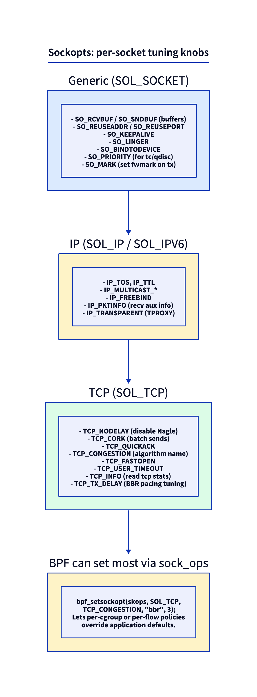

# Day 18 — Socket options: per-socket tuning

> **Today's mission:** know what each sockopt actually changes about a socket's behavior, when you'd reach for each, and where in the kernel the change takes effect. Total time: ~75 minutes.

## How sockopts work

A socket option is a per-socket knob set via:

```c
setsockopt(fd, level, optname, value, valuelen);
getsockopt(fd, level, optname, value, &valuelen);
```

The **`level`** picks a namespace: `SOL_SOCKET` (generic), `SOL_IP` / `SOL_IPV6`, `SOL_TCP`, `SOL_UDP`, etc. The **`optname`** picks the specific knob. The kernel dispatches:

1. The syscall lands in `do_sock_setsockopt` (`net/socket.c:2348`).
2. For `level == SOL_SOCKET` (generic), the kernel calls `sock_setsockopt` (`net/core/sock.c:1680`) — a thin wrapper that immediately calls **`sk_setsockopt`** (`net/core/sock.c:1195`), where the actual ~600-line option switch lives.
3. For other levels, it goes through `sk->sk_prot->setsockopt` (or, for AF_INET, `sock->ops->setsockopt`), which dispatches to per-protocol code: `tcp_setsockopt` (`net/ipv4/tcp.c:4175`), `udp_setsockopt`, `ip_setsockopt` (`net/ipv4/ip_sockglue.c:1409`), etc.

Each option is a `case` in a giant switch statement. When you read `tcp_setsockopt`, you're reading the canonical "what does this knob change?" reference.



## SOL_SOCKET — generic options

These work on any socket regardless of protocol family. Implementation: `sk_setsockopt` (`net/core/sock.c:1195`), reached via the thin `sock_setsockopt` wrapper (`net/core/sock.c:1680`).

### `SO_RCVBUF` / `SO_SNDBUF` — buffer sizes

- **What:** maximum bytes queued in the socket's receive (`sk_rcvbuf`) or send (`sk_sndbuf`) queue.
- **Why:** larger buffers absorb more burst traffic without dropping or back-pressuring. For high-BDP paths (high-bandwidth × high-latency), the default may be too small to keep the pipe full.
- **When:** any high-throughput TCP server. Default `tcp_rmem`/`tcp_wmem` triplets give a baseline; `SO_RCVBUF`/`SO_SNDBUF` override per-socket.
- **Gotcha:** the kernel **doubles the value you set** (one half is for kernel data structures); reads return the doubled value. This is in `sock_setsockopt` — the SO_SNDBUF case doubles at the `set_sndbuf` label (~line 1351). Also: setting these disables the kernel's automatic buffer auto-tuning (`tcp_moderate_rcvbuf=1` is the default; explicit setsockopt opts out).
- **Where:** `net/core/sock.c:1337` (SO_SNDBUF case) and `net/core/sock.c:1369` (SO_RCVBUF case).

### `SO_REUSEADDR` — bind on TIME_WAIT

- **What:** allow bind() to succeed even when a recent socket on the same port is in TIME_WAIT.
- **Why:** server restart shouldn't have to wait 60s for TIME_WAITs to clear.
- **When:** every server. Set immediately after `socket()`.
- **Gotcha:** does **not** allow two sockets to bind the same port simultaneously — that's `SO_REUSEPORT`. The names are similar; the semantics are distinct.
- **Where:** `net/core/sock.c:1321`.

### `SO_REUSEPORT` — multiple sockets sharing one port

- **What:** lets N sockets (in the same UID and netns) bind the same `(addr, port)`. Kernel hashes incoming connections to spread across them.
- **Why:** scale a multi-process/multi-thread server across cores. Each worker has its own listening socket; no contention on the accept queue.
- **When:** any high-fanout server (nginx, envoy, custom Go/Rust servers). Day 24 covers it in detail.
- **Gotcha:** all sockets must set this *before* bind. UID match required (security: don't let user A snipe user B's port). The hash is per-flow, so a single client always lands on the same worker.
- **Where:** `net/core/sock.c:1324`. The dispatch logic is in `inet_csk_get_port` and `__inet_lookup_listener`.

### `SO_KEEPALIVE` — periodic liveness probes

- **What:** kernel sends periodic empty TCP segments to keep idle connections alive (and detect when the peer is gone).
- **Why:** detect dead peers (NAT box rebooted, peer crashed) without application-level heartbeats.
- **When:** long-lived connections behind NAT or load balancers (whose state may time out). Default off; specific applications turn it on.
- **Gotcha:** the keepalive intervals are *system-wide* sysctls (`net.ipv4.tcp_keepalive_time` = 7200s, `tcp_keepalive_intvl` = 75s, `tcp_keepalive_probes` = 9). For per-socket overrides, use `TCP_KEEPIDLE`, `TCP_KEEPINTVL`, `TCP_KEEPCNT` — see SOL_TCP.
- **Where:** `net/core/sock.c:1390`.

### `SO_LINGER` — block close() until data flushed (or RST)

- **What:** struct linger { l_onoff, l_linger }. If on, `close()` blocks until either pending data is sent or `l_linger` seconds elapse; in the latter case, RST is sent.
- **Why:** ensure the peer either gets the data or knows the connection abruptly ended.
- **When:** rare. Useful for testing (RST to force immediate close) or high-stakes data delivery (transactional protocols).
- **Gotcha:** with `l_onoff=1, l_linger=0`, `close()` immediately sends RST instead of FIN — useful for forced shutdowns but breaks graceful close. With `l_linger>0`, `close()` may block for up to `l_linger` seconds.
- **Where:** `net/core/sock.c:1404`.

### `SO_BINDTODEVICE` — restrict to one interface

- **What:** bind socket to a specific net_device (by name). Outbound packets go through that device only; inbound only matches if arrived on it.
- **Why:** multi-homed hosts where you want a daemon to use a specific path (e.g., always send through the management NIC).
- **When:** management daemons, VPN clients, custom multipath logic.
- **Gotcha:** requires `CAP_NET_RAW`. Bypasses normal routing — be aware that you're disabling the kernel's path selection.
- **Where:** `net/core/sock.c:1210` (a special early branch) and `net/core/sock.c:2040`.

### `SO_MARK` — set fwmark on outbound packets

- **What:** sets `skb->mark` for every packet sent on this socket. Pairs with `ip rule fwmark X lookup TABLE` for socket-driven policy routing.
- **Why:** route this app's traffic differently (VPN, custom gateway) without iptables tagging.
- **When:** VPN clients, multi-homed daemons, traffic-engineering tools.
- **Gotcha:** requires `CAP_NET_ADMIN`. The mark is applied at *socket* level — packets generated by this socket carry it; received packets do not get it from this option.
- **Where:** `net/core/sock.c:1522`.

### `SO_PRIORITY` — qdisc priority class

- **What:** sets `skb->priority` for outbound packets. Used by qdiscs (notably `pfifo_fast`'s priority bands) for scheduling.
- **Why:** mark interactive traffic as higher priority.
- **When:** if you control the egress qdisc and want app-controlled scheduling. With modern `fq_codel` (default), this matters less.
- **Where:** `net/core/sock.c` (search `SO_PRIORITY`).

## SOL_IP / SOL_IPV6 — IP-layer options

Implementation: `do_ip_setsockopt` (`net/ipv4/ip_sockglue.c:892`).

### `IP_TOS` — set DSCP/ECN bits

- **What:** sets the IP header's TOS byte (top 6 bits = DSCP, low 2 = ECN) for outbound packets.
- **Why:** mark traffic for QoS classification or ECN-capable signaling.
- **When:** QoS-aware applications. Check egress qdisc respects DSCP.
- **Gotcha:** the value you set must match what your qdisc expects — many networks rewrite or strip DSCP.
- **Where:** `net/ipv4/ip_sockglue.c:1057`.

### `IP_TTL` — outbound TTL

- **What:** override default TTL (usually 64) for outbound packets.
- **When:** traceroute (TTL=1), packet experiments. Most apps leave default.
- **Where:** `net/ipv4/ip_sockglue.c:1026`.

### `IP_PKTINFO` — receive auxiliary info per packet

- **What:** with `IP_PKTINFO=1`, `recvmsg` aux data includes the destination address the packet was sent to and the interface it arrived on.
- **Why:** UDP servers bound to `0.0.0.0` need to know which local IP a request was *destined to* (so the reply uses the same source). Without `IP_PKTINFO`, you'd have to bind one socket per IP.
- **When:** DHCP, DNS, SIP servers — any UDP service on a multi-homed host.
- **Where:** `net/ipv4/ip_sockglue.c:952`.

### `IP_TRANSPARENT` — bind to non-local addresses

- **What:** allows `bind()` to a non-local IP. Combined with iptables `TPROXY`, lets you intercept traffic destined elsewhere.
- **Why:** transparent proxies (squid, HAProxy with `transparent`, Envoy in some modes).
- **When:** L7 transparent proxies, packet capture tools that re-inject.
- **Gotcha:** requires `CAP_NET_RAW` or `CAP_NET_ADMIN` (either suffices), plus a corresponding TPROXY iptables rule + policy routing.
- **Where:** `net/ipv4/ip_sockglue.c:1010`.

### `IP_FREEBIND` — bind before address is configured

- **What:** allow `bind()` to an IP that doesn't currently exist on any local interface.
- **Why:** services that come up before networking is fully configured (failover daemons, daemons binding to floating IPs).
- **Where:** `net/ipv4/ip_sockglue.c:988`.

## SOL_TCP — TCP-specific options

Implementation: `do_tcp_setsockopt` (`net/ipv4/tcp.c:3840`).

### `TCP_NODELAY` — disable Nagle

- **What:** Nagle's algorithm batches small writes (waits for ACK or full segment before sending). `TCP_NODELAY=1` disables this — every write goes immediately.
- **Why:** latency-critical apps (interactive: SSH, X, gaming, real-time messaging) where waiting for batch is unacceptable.
- **When:** request-response protocols where each request fits in <1 segment and latency matters. Most modern servers.
- **Gotcha:** if both NODELAY and CORK are off, default Nagle applies. NODELAY beats CORK for any individual `write`.
- **Where:** `net/ipv4/tcp.c:3970`.

### `TCP_CORK` — buffer until full or uncorked

- **What:** opposite of NODELAY. Hold writes until either an MSS-sized segment fills up or `TCP_CORK=0`.
- **Why:** an application building a multi-piece response (header + body) wants to ensure they go in one segment.
- **When:** static-file servers (`sendfile()` followed by uncork), HTTP servers building structured responses.
- **Gotcha:** corked sockets *will* eventually send (after ~200 ms) even without uncorking. But don't rely on that — explicitly uncork.
- **Where:** `net/ipv4/tcp.c:4043`.

### `TCP_QUICKACK` — disable delayed ACKs (one-shot)

- **What:** TCP normally delays ACKs by up to 40 ms hoping to piggyback on outgoing data. `TCP_QUICKACK=1` forces an immediate ACK on the next received segment, then reverts to normal.
- **Why:** request-response patterns where you've just sent a request and the next segment is the response — you want to ACK fast so the server's CC algorithm sees it.
- **When:** rarely useful at the application level. The kernel already enters "quickack mode" automatically in some scenarios.
- **Gotcha:** it's a one-shot, not a persistent setting.
- **Where:** search `TCP_QUICKACK` in `tcp.c`.

### `TCP_CONGESTION` — choose CC algorithm

- **What:** name string of CC algorithm (e.g., "cubic", "bbr"). Replaces the default for this socket.
- **Why:** different connections want different algorithms; per-socket override is the cleanest way.
- **When:** specialized workloads (intra-datacenter wants DCTCP; cross-WAN wants BBR).
- **Gotcha:** the algorithm must be loaded (`modprobe tcp_bbr`). Check `tcp_available_congestion_control`.
- **Where:** `net/ipv4/tcp.c:3851`.

### `TCP_USER_TIMEOUT` — give up after milliseconds

- **What:** abort the connection if data has been unacked for the given time, regardless of RTO retries.
- **Why:** keep-alive isn't enough — you want hard "give up after 30 seconds" semantics.
- **When:** any application where stale connections are worse than aggressive aborts (RPC clients, request/response protocols with deadlines).
- **Gotcha:** in milliseconds (other timeouts are seconds — check the docs). 0 = use system default (which is roughly 15 min via RTO retry).
- **Where:** `net/ipv4/tcp.c:3922`.

### `TCP_FASTOPEN` — TCP Fast Open (TFO)

- **What:** server-side: queue up to N early-data connections (data carried in the SYN). Client-side: cookie-based optimistic data send.
- **Why:** save one RTT on connection establishment for repeated connections.
- **When:** services with frequent reconnects (CDN edges, mobile clients). 
- **Gotcha:** middleboxes often strip the TFO cookie. Sysctl `tcp_fastopen` configures support; bit 1 enables client, bit 2 enables server.
- **Where:** search `TCP_FASTOPEN` in `tcp.c`. The state machine is more complex than this option suggests.

### `TCP_INFO` — read tcp_info struct

- **What:** getsockopt-only. Returns `struct tcp_info` with rtt, cwnd, retrans count, state, etc.
- **Why:** observability without parsing `/proc/net/tcp`.
- **When:** monitoring agents, performance debugging.
- **Where:** `net/ipv4/tcp.c` — search `tcp_get_info` (line 4213). Read this function: it's the source of truth for what `ss -tin` shows.

### `TCP_TX_DELAY` — artificial outbound delay (test/emulation only)

- **What:** delay outgoing packets by a fixed number of microseconds (optname 37). The kernel adds the delay to `skb->skb_mstamp_ns` and inflates the connection's `srtt_us`/`icsk_rto` so the rest of the stack behaves as if the path RTT were that much larger.
- **Why:** network *emulation* for testing — let a test on localhost (or a short path) behave like a high-latency WAN link without real distance or `tc netem`. Added in commit a842fe1425cb.
- **When:** test harnesses and benchmarks only. **Not** a production tuning knob.
- **Gotcha:** this has nothing to do with BBR or pacing. BBR paces via `sk_pacing_rate` + the `fq` qdisc, not this option; `TCP_TX_DELAY` only *adds* artificial latency.
- **Where:** search `TCP_TX_DELAY` in `tcp.c`.

## BPF can override most of these

A `sock_ops` BPF program (eBPF Day 19) can call `bpf_setsockopt()` to set sockopts kernel-side. This lets per-cgroup or per-flow policies override application defaults — e.g., "all sockets from the high-priority cgroup use BBR."

## Today's experiment

```bash
# See sockopts on live sockets
ss -tipsm | head -20    # m=memory accounting

# SET options and READ them back via getsockopt — exercises the day's core verb
cat << 'EOF' > /tmp/tcpinfo.c
#include <stdio.h>
#include <stdlib.h>
#include <sys/socket.h>
#include <netinet/in.h>
#include <netinet/tcp.h>
#include <arpa/inet.h>
#include <unistd.h>

int main(int argc, char **argv) {
  int s = socket(AF_INET, SOCK_STREAM, 0);

  /* (1) SET a buffer size and watch the kernel double it — no connection needed */
  int v = 65536, g; socklen_t gl = sizeof g;
  setsockopt(s, SOL_SOCKET, SO_RCVBUF, &v, sizeof v);
  getsockopt(s, SOL_SOCKET, SO_RCVBUF, &g, &gl);
  printf("SO_RCVBUF: set %d, got %d (kernel doubled it)\n", v, g);

  /* (2) SET congestion control for THIS socket only (no global sysctl) */
  char cc[32]; socklen_t cl = sizeof cc;
  getsockopt(s, IPPROTO_TCP, TCP_CONGESTION, cc, &cl);
  printf("cc before: %s\n", cc);
  setsockopt(s, IPPROTO_TCP, TCP_CONGESTION, "bbr", 3);

  /* (3) connect, then READ tcp_info + the now-active CC name */
  struct sockaddr_in a = { AF_INET, htons(argc > 2 ? atoi(argv[2]) : 80) };
  inet_aton(argc > 1 ? argv[1] : "8.8.8.8", &a.sin_addr);
  if (connect(s, (struct sockaddr*)&a, sizeof a) < 0) { perror("connect"); return 1; }

  struct tcp_info ti;
  socklen_t l = sizeof ti;
  getsockopt(s, IPPROTO_TCP, TCP_INFO, &ti, &l);
  cl = sizeof cc;
  getsockopt(s, IPPROTO_TCP, TCP_CONGESTION, cc, &cl);
  printf("rtt %u us, cwnd %u, rwnd %u, retrans %u, ca_state %u, cc %s\n",
         ti.tcpi_rtt, ti.tcpi_snd_cwnd, ti.tcpi_snd_wnd,
         ti.tcpi_total_retrans, ti.tcpi_ca_state, cc);
  return 0;
}
EOF
cc /tmp/tcpinfo.c -o /tmp/tcpinfo && /tmp/tcpinfo
```

The default target is `8.8.8.8:80`, so this needs outbound TCP/80 reachability. On an offline or egress-firewalled box, start a local listener and point the program at it instead (the program takes `host port` as args):

```bash
nc -l 127.0.0.1 18080 &     # any high port avoids needing root to bind :80
/tmp/tcpinfo 127.0.0.1 18080
kill %1                      # stop the listener
```

Expected output (numbers vary; loopback gives a tiny rtt):

```
SO_RCVBUF: set 65536, got 131072 (kernel doubled it)
cc before: cubic
rtt 37 us, cwnd 10, rwnd 65483, retrans 0, ca_state 0, cc bbr
```

What each line proves:

- **`set 65536, got 131072`** — the chapter's headline gotcha (line 33). The kernel stored *twice* what you asked; the extra half is bookkeeping overhead. (The doubled value is clamped at `2 * net.core.rmem_max`, so very large sets get capped.)
- **`cc before: cubic` → `cc bbr`** — the per-socket `setsockopt(TCP_CONGESTION)` took effect, and `getsockopt` reads it back. This changes *only this socket* — the system-wide default (`net.ipv4.tcp_congestion_control`) is never touched, so there is no global state to restore. `bbr` must be available (`modprobe tcp_bbr`; check `sysctl net.ipv4.tcp_available_congestion_control`).
- **`rtt`** is `tcpi_rtt` = `srtt_us >> 3` in microseconds; **`cwnd 10`** is the initial congestion window; **`ca_state 0`** is `TCP_CA_Open` (the normal, no-loss state).

## What to read in the kernel

- **`net/socket.c:2348`** — `do_sock_setsockopt`. The dispatcher. Read it to see how `(level, optname, value)` flows to the right protocol code. Notice the `sockptr_t` abstraction that lets BPF (kernel-space caller) and userspace use the same setsockopt path.

- **`net/core/sock.c:1680`** — `sock_setsockopt`. The SOL_SOCKET entry — but it's just a thin wrapper. The real work is in **`sk_setsockopt`** (`net/core/sock.c:1195`): a long switch (~600 lines). Read the cases for the options you care about — each is its own micro-routine. Notice the consistent pattern: copy from user, validate, take socket lock, update field, release lock.

- **`net/ipv4/tcp.c:4175`** — `tcp_setsockopt`. The TCP-specific dispatcher; passes through to `do_tcp_setsockopt` (line 3840). Read `do_tcp_setsockopt` end-to-end if you ever wonder "what does TCP_FOO actually do?" — every option has its case here.

- **`net/ipv4/tcp.c:3970`** — TCP_NODELAY case. ~10 lines. The simplest TCP option; useful as a starting reference.

- **`net/ipv4/tcp.c:4043`** — TCP_CORK case. Note the interaction with TCP_NODELAY (mutually exclusive in spirit but both can be set).

- **`net/ipv4/tcp.c:3851`** — TCP_CONGESTION case. Calls `tcp_set_congestion_control` (Day 16). Notice the `cap_net_admin` requirement for some non-default algorithms.

- **`net/ipv4/tcp.c:4213`** — `tcp_get_info`. Fills `struct tcp_info` for `TCP_INFO` getsockopt. Read this to know what fields are in `tcp_info` and where each comes from (rtt → `tp->srtt_us >> 3`, cwnd → `tp->snd_cwnd`, etc.).

- **`net/ipv4/ip_sockglue.c:892`** — `do_ip_setsockopt`. The IP-level dispatcher. Read the cases for `IP_PKTINFO` (line 952), `IP_FREEBIND` (line 988), `IP_TRANSPARENT` (line 1010) — they're each illuminating examples of how a single line of userspace code unlocks a whole behavior.

- **`include/uapi/linux/tcp.h`** — TCP option constants. Skim to see the full list. There are ~50; you'll meet most over a career.

- **`include/uapi/asm-generic/socket.h`** — generic SO_* constants.

- **`Documentation/networking/ip-sysctl.rst`** — sysctls related to TCP/IP behavior (much of which interacts with sockopts).

## Bullet Points

- Sockopts split: **`SOL_SOCKET`** (generic, `sock_setsockopt`), **`SOL_IP`/`SOL_IPV6`** (IP-layer), **`SOL_TCP`/`SOL_UDP`** (protocol).
- **`SO_RCVBUF`/`SO_SNDBUF`** — buffers. Kernel doubles the value; explicit set disables auto-tuning.
- **`SO_REUSEPORT`** — multiple sockets one port (Day 24).
- **`TCP_NODELAY`** — disable Nagle. Most modern interactive apps want it on.
- **`TCP_CORK`** — opposite of NODELAY; batch until uncork.
- **`TCP_CONGESTION`** — pick CC algorithm per-socket.
- **`TCP_USER_TIMEOUT`** — hard deadline (in ms) for unacked data.
- **`TCP_INFO`** (getsockopt) — full TCP stats; equivalent to `ss -tin`.
- **`IP_PKTINFO`** — UDP servers can know which local IP a packet was sent to.
- **`IP_TRANSPARENT`** — bind to non-local IP for transparent proxies.
- BPF (cgroup_sockops) can override all of these from kernel-side.

## Check question

Why might `TCP_NODELAY` and `TCP_CORK` look like opposites yet sometimes both be useful on the same socket at different times?

<details>
<summary>Click to reveal answer</summary>

**Answer:** They serve different needs at different points in the connection's lifecycle. A request/response server might **CORK** while building a multi-piece response (header + body — the application calls `write()` multiple times to compose), then *uncork* — the kernel sends one efficient large segment. Right after the response, the app might set **NODELAY** so any tail data (a small "200 OK" follow-up, a heartbeat) doesn't sit waiting for Nagle. Real apps mix both: cork for batching prepared output, nodelay for ad-hoc small writes between batches. The point: the application knows when batching helps (assembling a large response) and when latency matters more (everything else). Sockopts let it switch dynamically.

</details>

---

## Tomorrow

Day 19: epoll and io_uring for sockets. The two ways modern userspace waits on many sockets efficiently.
