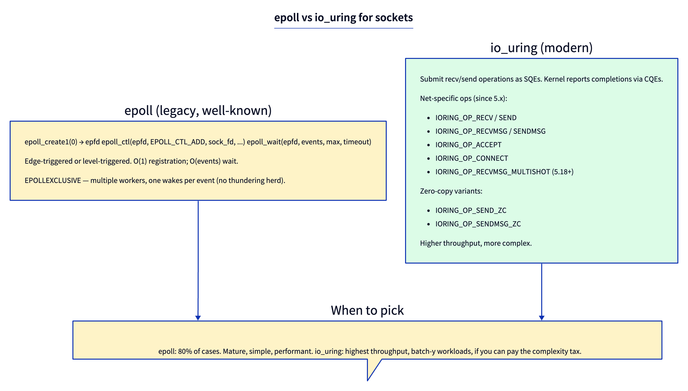
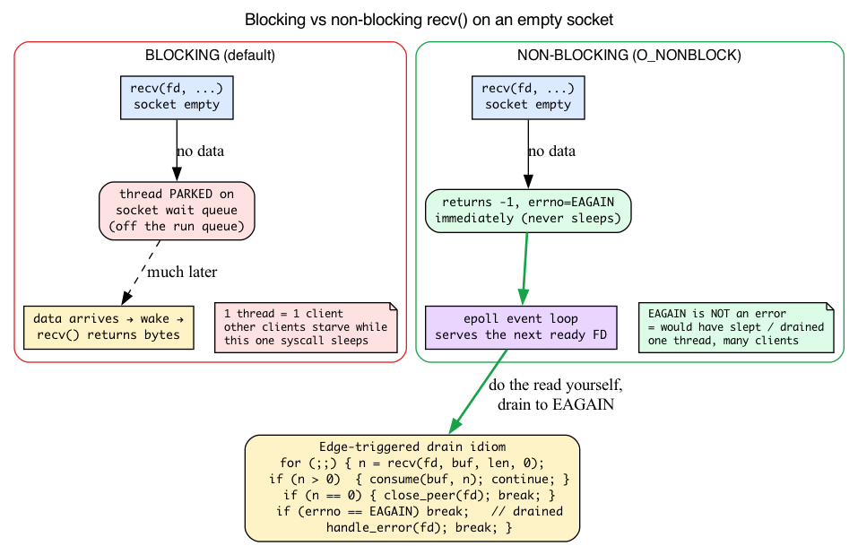
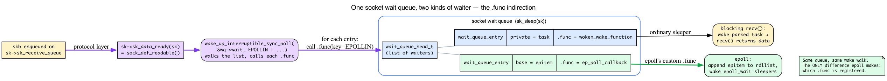
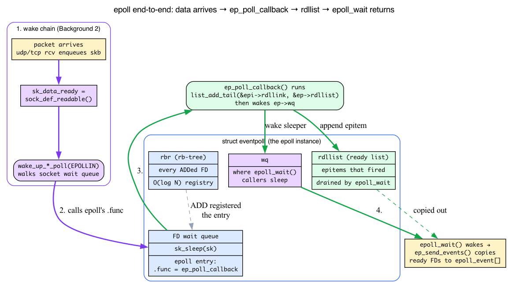

# Day 19 — epoll and io_uring for sockets

> **Today's mission:** understand how userspace efficiently waits on many sockets, and why io_uring is taking over from epoll for the highest-throughput servers. We'll first build the two pieces of machinery the whole chapter rests on — *blocking vs. non-blocking sockets* and *the kernel wait queue a socket sleeps on* — and only then open epoll, which is nothing more than a clever hook into that wait queue. Total time: ~110 minutes.

## The problem they solve

A naive blocking server handles one client at a time. To handle many, you can:

1. **Fork a process per client** (Apache prefork, ~early-2000s style). Heavy.
2. **Spawn a thread per client** (1:1 threading). Lighter than processes but still ~MB per client and lots of context switches.
3. **Use one thread for many clients with non-blocking I/O.** Read/write only when ready; never block on individual sockets. *Now you need to know which socket is ready.*

That last bullet is what `epoll` and `io_uring` solve — but with totally different mechanics.



But before any of that makes sense, we have to be precise about two words in bullet 3 that the rest of the chapter leans on constantly: **"block"** and **"ready."** What does it mean for `recv()` to *block*? What machine puts the thread to sleep, and what wakes it? And what does "ready" actually test? Those two questions are the same question, and answering it is the key that unlocks epoll's internals. So we'll teach that machinery first — intuition, then the v7.1 structs — and only then walk the epoll API.

---

## Background 1: blocking, non-blocking, and the `EAGAIN` contract

### A blocking `recv()` puts your thread to sleep

By default, a socket is **blocking**. Call `recv()` on a TCP socket that has no data waiting, and your thread does not spin, poll, or return an error — it **goes to sleep**. The kernel parks the task, schedules something else onto the CPU, and only wakes your task when data arrives. From userspace it looks like one long syscall that "took a while"; underneath, the thread was off the run queue entirely.

That is exactly why bullet 3's "many clients in one thread" is hard. If your one thread calls `recv()` on client A and A is quiet, the thread sleeps inside that syscall — and clients B, C, D get no service, even if *they* have data ready right now. One blocking thread serves one slow client. The whole readiness model only works if syscalls **never sleep**.

### `O_NONBLOCK` flips the switch: return instead of sleep

Setting **`O_NONBLOCK`** on a socket changes the contract. You set it with `fcntl(fd, F_SETFL, O_NONBLOCK)`, or get it atomically at creation with `SOCK_NONBLOCK` passed to `socket()` / `accept4()`. Now `recv`, `accept`, and `send` **return immediately**:

- If there's data (or a pending connection, or send-buffer room), they do the work and return normally.
- If there's **nothing to do**, instead of sleeping they return `-1` with `errno == EAGAIN`.

`EAGAIN` (spelled `EWOULDBLOCK` on Linux — same value) is **not an error**. It is the kernel saying *"not ready right now; there's nothing here for you, try again later."* It's the non-blocking world's version of "would have slept."

### Why epoll and non-blocking I/O are a matched pair

This is the missing half of the readiness model. `epoll_wait` (we meet it below) tells you *which* FDs are ready. You then do the syscall yourself — and **`EAGAIN` is the signal that you've drained this FD for now**, so you stop and move to the next ready FD.

Without `O_NONBLOCK`, the design breaks: even after `epoll_wait` says "FD is readable," a *blocking* `recv()` could still sleep — for instance if a checksum-failed segment got dropped between the readiness notification and your read, leaving the socket empty again. One stalled `recv()` and your whole event loop freezes. Non-blocking mode is what guarantees the loop keeps spinning. **epoll without `O_NONBLOCK` is a loaded footgun.**

### Edge-triggered mode makes `EAGAIN` mandatory

There are two ways epoll can report readiness (we'll formalize them later):

- **Level-triggered (default):** epoll re-reports an FD *for as long as* it still has data. If you read only half the bytes, the next `epoll_wait` happily tells you again. Forgiving.
- **Edge-triggered (`EPOLLET`):** epoll notifies you on **each new data arrival** (a fresh wake of the socket's wait queue), not continuously while data sits unread. It will not re-report unread bytes on its own — only a *new* wake fires it again.

So under edge-triggered mode you **must** loop:

```c
/* Edge-triggered drain: read until the kernel says EAGAIN */
for (;;) {
    ssize_t n = recv(fd, buf, sizeof buf, 0);
    if (n > 0)        { consume(buf, n); continue; }   /* more queued — keep going */
    if (n == 0)       { close_peer(fd);  break;    }   /* orderly shutdown */
    /* n < 0 */
    if (errno == EAGAIN) break;     /* drained: nothing left until next arrival */
    handle_error(fd); break;
}
```

If you stop early — say you read one buffer's worth and trust epoll to remind you — the leftover bytes just *sit there*. Edge-triggered already fired its one notification for that transition; the next `epoll_wait` stays silent until brand-new data triggers another edge. Your reader is wedged with data it never picked up. Draining to `EAGAIN` is the only correct edge-triggered idiom. Level-triggered forgives a partial read precisely because it re-reports while data remains.

The same loop shape shows up for *accepting* connections under `EPOLLEXCLUSIVE` (later in the chapter): a woken worker calls `accept4()` in a loop until `EAGAIN` to drain the listen backlog, then goes back to sleep.



---

## Background 2: wait queues — the sleep/wake machine under every socket

We just said a blocking `recv()` "goes to sleep" and "gets woken when data arrives." Time to make that literal, because **this exact mechanism is what epoll hooks into.** Get this and epoll's internals stop being magic.

### A wait queue is a list of sleepers plus a wake function

When a thread must wait for an event ("data on this socket"), the kernel needs somewhere to record *"this task is sleeping, and here's how to wake it."* That record-keeper is a **wait queue**: a `wait_queue_head_t` is just a list of waiters, and each waiter is a `struct wait_queue_entry` that points at a sleeping task plus a **wake callback function** to run when the event fires.

```c
/* include/linux/wait.h:15 */
typedef int (*wait_queue_func_t)(struct wait_queue_entry *wq_entry,
                                 unsigned mode, int flags, void *key);

/* include/linux/wait.h:28 */
struct wait_queue_entry {
    unsigned int            flags;
    void                    *private;     /* usually the task to wake */
    wait_queue_func_t       func;         /* the callback — remember this field */
    struct list_head        entry;
};
```

That `.func` field is the whole story of today's chapter. For an ordinary sleeper it's a generic "wake this task" routine. epoll, as we'll see, swaps in its *own* function — and that swap is the entire trick.

### Every socket carries a wait queue; `recv()` sleeps on it

A blocking `recv()` that finds the socket empty adds itself to the socket's wait queue and sleeps. You can see it plainly in `sk_wait_data` (`net/core/sock.c:3269`):

```c
int sk_wait_data(struct sock *sk, long *timeo, const struct sk_buff *skb)
{
    DEFINE_WAIT_FUNC(wait, woken_wake_function);
    int rc;

    add_wait_queue(sk_sleep(sk), &wait);                 /* park on the socket's queue */
    sk_set_bit(SOCKWQ_ASYNC_WAITDATA, sk);
    rc = sk_wait_event(sk, timeo,
                       skb_peek_tail(&sk->sk_receive_queue) != skb, &wait);
    /* ... woken: remove and return ... */
    remove_wait_queue(sk_sleep(sk), &wait);
    return rc;
}
```

`sk_sleep(sk)` is the socket's wait queue head. The thread links a `wait_queue_entry` onto it and blocks. **Hold onto that queue** — when the chapter later says epoll registers on *"the same wait queue `recvmsg` would block on,"* this `sk_sleep(sk)` queue is the one it means.

### The wake comes from `sk_data_ready` → `sock_def_readable`

So who *wakes* the sleeper? On the receive side, every socket has a callback pointer `sk->sk_data_ready`, fired whenever the protocol layer has just enqueued a packet for the socket. (Day 14 showed `__udp_enqueue_schedule_skb` calling `sk->sk_data_ready(sk)` (`net/ipv4/udp.c:1745`) to "wake any `recvmsg` waiters" — that one line *is* the wake. Here we explain the queue it kicks.)

The default `sk_data_ready` is `sock_def_readable`, installed at socket creation (`net/core/sock.c:3734`). Day 14 showed its full body; the one line that matters here is the wake itself (`net/core/sock.c:3614`):

```c
wake_up_interruptible_sync_poll(&wq->wait, EPOLLIN | EPOLLPRI |
                                EPOLLRDNORM | EPOLLRDBAND);
```

This walks the socket's wait queue and, for each waiter, **calls that waiter's `.func`**, passing `EPOLLIN` (and friends) as the `key` argument. For a blocking `recv()`, `.func` wakes the parked task and `recv()` returns with data. *Notice the kernel passes `EPOLLIN`* — the very same bit you'll put in your `epoll_event`. That's not a coincidence; it's the next idea.

### `->poll()`: one call that both registers *and* reports readiness

Every pollable file (sockets, pipes, eventfds, even other epoll FDs) exports a `->poll()` file operation. The kernel calls it through `vfs_poll(file, pt)` with a small helper called a **`poll_table`**, and `->poll()` does **two jobs in one shot**:

1. **Register** the caller on the file's wait queue (using the `poll_table`), so the caller will be woken on future readiness.
2. **Return a readiness bitmask** *right now* — `EPOLLIN` if there's data to read, `EPOLLOUT` if there's send-buffer room, etc.

This is the deep reason the `EPOLLIN` in your `epoll_event` is the same bit the kernel uses internally: readiness is **one bitmask** shared by `->poll()`, by `sock_def_readable`'s wake key, and by your userspace event struct. They are literally the same flags.

So an ordinary blocking wait threads through exactly this chain — `recv()` parks on `sk_sleep(sk)`, a packet's `sk_data_ready` walks the queue, your entry's `.func` wakes the task, `recv()` returns (the numbered flow below spells out each hop). **epoll changes exactly one thing in that chain: which `.func` gets registered.** That's the next section.



---

## epoll — the readiness model

The mental model: *"Tell me when this FD is ready for I/O. I'll do the syscall myself."*

```c
int epfd = epoll_create1(0);

struct epoll_event ev = { .events = EPOLLIN | EPOLLET, .data.fd = sock };
epoll_ctl(epfd, EPOLL_CTL_ADD, sock, &ev);

struct epoll_event events[64];
int n = epoll_wait(epfd, events, 64, 100);
for (int i = 0; i < n; i++) {
    /* events[i].data.fd is ready — go read/write it (non-blocking, drain to EAGAIN) */
}
```

Three syscalls:
- **`epoll_create1`** (`fs/eventpoll.c:2200`): create an epoll instance (a kernel object referenced by the returned FD).
- **`epoll_ctl`** (`fs/eventpoll.c:2385`): ADD, MOD, or DEL an FD from the instance.
- **`epoll_wait`** (`fs/eventpoll.c:2467`): block until one or more registered FDs become ready, or until the timeout.

And note `EPOLLIN | EPOLLET` and the "drain to EAGAIN" comment in the loop — that's Background 1 and Background 2 cashing out in the actual API.

### Internals

With wait queues in hand, the internals are short. The epoll instance is a `struct eventpoll` (`fs/eventpoll.c:172`), and four of its fields carry the whole design:

```c
struct eventpoll {
    /* ... mutex ... */
    wait_queue_head_t wq;          /* where epoll_wait() callers sleep         */
    wait_queue_head_t poll_wait;   /* for an epoll fd nested inside another epoll */
    struct list_head  rdllist;     /* the READY list: FDs that fired            */
    struct rb_root_cached rbr;     /* the registered FDs, an rb-tree            */
    /* ... */
};
```

Three lists/queues, and they map one-to-one to what epoll does:

- **`rbr`** — a **red-black tree** of every FD you've ADDed, keyed for O(log N) ADD/DEL/lookup. This is the registry. Each ADDed FD becomes a `struct epitem` — the per-FD record — stored in `rbr`; that epitem is what gets linked onto `rdllist` when the FD fires.
- **`rdllist`** — the **ready list**: FDs that have become ready and are waiting to be reported by `epoll_wait`.
- **`wq`** — the wait queue your `epoll_wait` call sleeps on when nothing is ready yet (the same wait-queue machinery from Background 2, but now it belongs to the epoll object, not a socket).

Now the wiring. When you **ADD** an FD, `ep_insert` (`fs/eventpoll.c:1566`) calls the FD's `->poll()` and hands it a special `poll_table` whose "register me" callback is `ep_ptable_queue_proc` (`fs/eventpoll.c:1360`). Here's the twist that makes epoll fast — instead of registering a generic "wake me" entry on the socket's wait queue, it installs a wait-queue entry whose `.func` is epoll's own `ep_poll_callback`:

```c
/* fs/eventpoll.c:1360, ep_ptable_queue_proc */
init_waitqueue_func_entry(&pwq->wait, ep_poll_callback);   /* custom .func! */
pwq->whead = whead;
pwq->base  = epi;
if (epi->event.events & EPOLLEXCLUSIVE)
    add_wait_queue_exclusive(whead, &pwq->wait);           /* see EPOLLEXCLUSIVE below */
/* else add_wait_queue(whead, &pwq->wait); */
```

That `whead` is exactly `sk_sleep(sk)` — the same socket wait queue a blocking `recv()` would park on (Background 2). epoll just hangs a different kind of waiter on it.

So follow the flow when data arrives, and every step is something you already know:

1. A packet lands; the protocol layer enqueues it on the socket and calls `sk->sk_data_ready` → `sock_def_readable` → `wake_up_interruptible_sync_poll(&wq->wait, EPOLLIN|...)` (Background 2).
2. That walks the socket's wait queue and calls each entry's `.func`. For epoll's entry, `.func` is **`ep_poll_callback`** (`fs/eventpoll.c:1249`).
3. `ep_poll_callback` runs, links this FD's `epitem` onto the eventpoll's **`rdllist`** (`list_add_tail(&epi->rdllink, &ep->rdllist)`, `fs/eventpoll.c:1294`), and **wakes anyone sleeping on `ep->wq`** — i.e. your `epoll_wait`.
4. `epoll_wait` wakes, `ep_send_events` (`fs/eventpoll.c:1765`) copies the ready FDs into your `epoll_event[]` array, and you get your `n`.

That callback-instead-of-plain-wakeup indirection is the entire "magic" — and it's nothing more than swapping the `.func` you learned about in Background 2. The same `->poll()` that registers the callback also returns the current readiness bitmask (via `ep_item_poll` → `vfs_poll(file, pt)`, `fs/eventpoll.c:1057`), which is how an FD that's *already* ready at ADD time lands on `rdllist` immediately.



### Level-triggered vs edge-triggered

We met these in Background 1; here's where they live in the code.

- **Level-triggered (LT, default):** epoll_wait reports the FD as long as it's ready. Read what you can, leave the rest; epoll_wait will report it again next time.
- **Edge-triggered (ET, `EPOLLET` flag):** epoll_wait reports the FD only when its readiness *changes* (e.g., went from "no data" to "data arrived"). You must drain the FD until you get `EAGAIN`, or you'll miss subsequent data.

ET is faster (fewer wake-ups) but more error-prone. LT is what you want unless you know exactly why ET helps.

The LT/ET difference is implemented in one branch of `ep_send_events`. `EPOLLET` is stored per-epitem (it's one of the private epoll bits: `EP_PRIVATE_BITS = (EPOLLWAKEUP | EPOLLONESHOT | EPOLLET | EPOLLEXCLUSIVE)`, `fs/eventpoll.c:86`) — it's never passed down to the FD's `->poll()`, which is why re-arming is purely an epoll-side decision. After copying an FD's events to userspace, `ep_send_events` does (`fs/eventpoll.c:1835`):

```c
} else if (!(epi->event.events & EPOLLET)) {
    /*
     * If this file has been added with Level Trigger mode, we need to
     * insert back inside the ready list, so that the next call to
     * epoll_wait() will check again the events availability.
     */
    list_add_tail(&epi->rdllink, &ep->rdllist);   /* fs/eventpoll.c:1847 */
    ep_pm_stay_awake(epi);
}
```

For **level-triggered**, the FD is re-added to `rdllist` so the *next* `epoll_wait` re-checks it — that's "LT re-reports while data remains." For **edge-triggered**, that branch is skipped: the FD leaves `rdllist` and won't come back until `ep_poll_callback` fires again on a fresh readiness transition. That single `if` is the entire LT-vs-ET behavior, and it's the source-level reason a partial read under ET strands your data.

### `EPOLLEXCLUSIVE` — solving thundering herd

Default semantics: when an event fires on an FD that has multiple `epoll_wait` waiters, *all* of them wake. For an `accept` socket shared by N workers, this means a newly completed connection (the final ACK lands, the connection joins the accept queue, and `tcp_child_process` calls the listener's `sk_data_ready`, `net/ipv4/tcp_minisocks.c:1005`) wakes all N — N-1 immediately call accept, get `EAGAIN` (Background 1 — non-blocking accept on an empty backlog), go back to sleep. Wasted wake-ups. (Note it's connection *completion*, not the SYN, that wakes the listener: the SYN path only queues the request and sends SYN-ACK.)

`EPOLLEXCLUSIVE` (added 4.5) tells epoll: wake only one waiter per event. The implementation is the `add_wait_queue_exclusive` branch we saw in `ep_ptable_queue_proc` (`fs/eventpoll.c:1360`) — an exclusive waiter tells the wait-queue walker to stop after waking the first responsive thread instead of waking the whole list. Modern multi-process servers should use it.

(Aside: `SO_REUSEPORT` — Day 24 — is a more powerful alternative. Each worker has its own listening socket; the kernel hashes incoming SYNs across them, so each worker's epoll only ever sees SYNs that were destined for *it*.)

## io_uring — the completion model (preview)

epoll's model is *readiness*: "tell me when this FD is ready; I'll do the syscall myself." io_uring inverts it to *completion*: **"do this network operation for me — tell me when it's done."** Instead of learning which FD is ready and then issuing `recv`/`send` yourself, you hand the kernel the whole operation through two memory-mapped ring buffers:

- **Submission Queue (SQ)**: userspace pushes Submission Queue Entries (SQEs) describing work to do.
- **Completion Queue (CQ)**: the kernel pushes Completion Queue Entries (CQEs) when the work finishes.

The practical contrast that matters today:

- **epoll: 2 syscalls per I/O** — `epoll_wait` to learn readiness, then `recv`/`send`.
- **io_uring: ~1 syscall per *batch*** (`io_uring_enter` carrying many SQEs at once), or *zero* in steady state with `IORING_SETUP_SQPOLL` (a kernel thread polls the SQ).

For sustained request rates above ~100k/sec per thread that saving is real; below that it's invisible, and epoll's smaller, battle-tested API is the right default (nginx, redis, node.js via libuv, and most Python/Go/Rust async runtimes all ride epoll). Hold onto the one distinction — **epoll signals readiness; io_uring signals completion** — and pick it up in depth on **Day 28**, which covers the full network op set, multishot recv, provided buffers, and zero-copy send.

## There are no Dumb Questions

> **Q: Is `EAGAIN` an error I should log and bail on?**
>
> A: No — it's the opposite. `EAGAIN` (== `EWOULDBLOCK` on Linux) on a non-blocking socket means "nothing here right now." On a freshly-reported FD it means "you've drained everything queued; stop reading and go handle the next ready FD." Logging it as an error would flood your logs on every event loop tick. The only `recv` returns that are real errors are `n < 0` with some *other* errno (e.g. `ECONNRESET`).

> **Q: If a blocking `recv()` sleeps on the socket's wait queue, and epoll also registers on that same queue, do they fight?**
>
> A: They don't, because they're different *kinds* of waiter on the same list. A blocking `recv()` adds an entry whose `.func` wakes the parked task; epoll adds an entry whose `.func` is `ep_poll_callback`. As the 4-step flow showed, when `sock_def_readable` walks the queue it calls each entry's `.func` in turn. You normally wouldn't do both on one FD, but structurally the wait queue happily holds both — that's the point of the `.func` indirection (Background 2).

> **Q: Why does `EPOLLET` require non-blocking sockets but `EPOLLIN` (level-triggered) seems to tolerate blocking ones?**
>
> A: Neither is truly safe with a blocking socket, but ET makes the bug unavoidable. ET fires *one* notification per readiness transition, so you must loop `recv` until `EAGAIN` to consume everything — and that loop *requires* `EAGAIN`, which only a non-blocking socket produces. A blocking socket's final `recv` in that loop would sleep forever instead of returning `EAGAIN`, freezing the thread. LT *seems* to tolerate blocking because it re-reports, so a one-read-per-event style mostly works — until the one read it permits blocks (e.g. data vanished after the notification), and the whole loop stalls. Always use `O_NONBLOCK` with epoll.

> **Q: Where does the `EPOLLIN` bit I pass actually go?**
>
> A: It's one shared bitmask across three places: your `epoll_event.events`, the FD's `->poll()` return value, and the `key` argument `sock_def_readable` passes to `wake_up_interruptible_sync_poll(&wq->wait, EPOLLIN|...)`. epoll stores your interest mask per-epitem, the wake passes the *fired* bits as the key, and `ep_poll_callback` checks the overlap before linking the epitem onto `rdllist`. Same flags, end to end.

## Today's experiment

### epoll wakeup tracking

**Setup.** We need an epoll-based server and a load generator. nginx fits (it uses the readiness model on every connection), and `ab` (ApacheBench) drives it. Install both, then start nginx — binding port 80 needs root, and nginx daemonizes itself, so no `&`:

```bash
sudo apt-get install -y nginx apache2-utils
sudo nginx
```

(Any already-running epoll-based server works too — the probe below is system-wide, so it captures every `epoll_wait` on the box, not just nginx's.)

**Terminal 1 — start the trace.** This runs in the foreground and blocks the terminal, so the load must come from a second terminal:

```bash
sudo bpftrace -e '
tracepoint:syscalls:sys_enter_epoll_wait,
tracepoint:syscalls:sys_enter_epoll_pwait,
tracepoint:syscalls:sys_enter_epoll_pwait2 { @waits = count(); }
tracepoint:syscalls:sys_exit_epoll_wait,
tracepoint:syscalls:sys_exit_epoll_pwait,
tracepoint:syscalls:sys_exit_epoll_pwait2 /args->ret >= 0/ { @returns = hist(args->ret); }
interval:s:5 { print(@waits); print(@returns); clear(@waits); clear(@returns) }'
```

Why all three syscalls? nginx on x86_64 issues the bare `epoll_wait`, but Go and Node/libuv use `epoll_pwait`, and on arm64/riscv glibc routes `epoll_wait()` through `epoll_pwait` — so a single-syscall probe leaves `@waits` empty and looks broken. `epoll_pwait2` exists on 5.11+. The `/args->ret >= 0/` filter drops the `-1` (EINTR) returns, which `hist()` would otherwise bin into a confusing negative bucket.

**Terminal 2 — generate load:**

```bash
ab -n 100000 -c 100 http://127.0.0.1/
```

**What you'll see.** Idle (nginx running but no traffic), `@returns` is dominated by the `[0]` bucket — every `epoll_wait` timed out with no FD ready, and `@waits` is small:

```
@waits: 8
@returns:
[0]    7 |@@@@@@@@@@@@@@@@@@@@@@@@@@@@@@@@@@@@@@@@@@@@@@@@@@@@|
```

Once `ab` runs, `@waits` climbs into the thousands per interval and the histogram fills the low positive buckets — each `epoll_wait` now returns one or more ready sockets:

```
@waits: 438
@returns:
[0]     176 |@@@@@@@@@@@@@@@@@@@@@@@@@@@@@@@@@@@@                |
[1]     252 |@@@@@@@@@@@@@@@@@@@@@@@@@@@@@@@@@@@@@@@@@@@@@@@@@@@@|
[2, 4)    8 |@                                                 |
```

That batching of several ready FDs into one return is exactly the readiness-model payoff: one `epoll_wait` syscall amortized over N sockets. A `[1]`-heavy histogram is the low-concurrency case; the buckets shift right as more sockets become ready between calls. And each of those returns is the tail end of the Background-2 chain firing: a completed connection or a data segment arrived, `sk_data_ready` walked the socket's wait queue, `ep_poll_callback` appended the FD to `rdllist` and woke `ep->wq`, and *this* is the `epoll_wait` waking up.

**Cleanup.** When you're done, stop the server:

```bash
sudo nginx -s stop
```

(For the io_uring side — an async accept loop plus tracing the kernel-side net ops — see Day 28's experiment.)

### Optional: watch the wakeup callback itself

To see the wait-queue callback from Background 2 / the internals section fire in real time, trace `ep_poll_callback` while load runs:

```bash
sudo bpftrace -e 'kprobe:ep_poll_callback { @[comm] = count(); } interval:s:5 { print(@); clear(@); }'
```

Each count is one FD-readiness transition that moved an epitem onto an `rdllist`. Under `ab` load you'll see it climb in lockstep with `@waits` above — that's the `sk_data_ready` → `ep_poll_callback` → `rdllist` → wake path you read in the code, made visible.

## What to read in the kernel

- **`fs/eventpoll.c:2200`** — `epoll_create1`. Tiny wrapper that allocates an `eventpoll` struct, gets an FD. Read the struct definition above this; that's the per-instance state (the `wq`, `rdllist`, `rbr` you just learned).

- **`fs/eventpoll.c:2385`** — `epoll_ctl`. The ADD/MOD/DEL dispatcher. Notice how `EPOLL_CTL_ADD` calls `ep_insert` which registers the wait-queue callback on the target FD. *That's where the magic happens* — once the callback is registered, the FD reports readiness to epoll automatically.

- **`fs/eventpoll.c:1360`** — `ep_ptable_queue_proc`. The `poll_table` callback that `->poll()` invokes to register the waiter. This is the exact line (`init_waitqueue_func_entry(&pwq->wait, ep_poll_callback)`) where epoll hooks its custom `.func` onto the socket's wait queue instead of a plain wakeup.

- **`fs/eventpoll.c:1938`** — `ep_poll`. The wait path. Read end to end (~120 lines). Notice how it handles spurious wakes, the busy-loop fast path for low-latency cases, and how it dequeues from the rdllist.

- **`fs/eventpoll.c:1765`** — `ep_send_events`. Copies the ready list to the user's `epoll_event` array. For LT, re-arms the FD if still ready (`list_add_tail(&epi->rdllink, &ep->rdllist)` at line 1847). For ET, doesn't.

- **`fs/eventpoll.c:1249`** — `ep_poll_callback`. The wait-queue callback that gets called when a registered FD becomes ready. Short (~100 lines). This is where readiness gets translated into an epoll event and the epitem is linked onto `rdllist`.

- **`net/core/sock.c:3614`** — `sock_def_readable`, the default `sk_data_ready` (installed at line 3734). The `wake_up_interruptible_sync_poll(&wq->wait, EPOLLIN|...)` here is what *fires* `ep_poll_callback`. Read it alongside `sk_wait_data` (line 3269) to see the blocking `recv()` side of the same queue.

- **io_uring** — for the `io_uring/net.c` and `io_uring/io_uring.c` entry points, the liburing examples, and the man pages, see Day 28's "What to read." Today, focus on the epoll path above.

## Bullet Points

- **Blocking `recv()` sleeps** by parking a `wait_queue_entry` on the socket's wait queue (`sk_sleep(sk)`, via `sk_wait_data`, `net/core/sock.c:3269`). One blocking thread serves one slow client — which is why the readiness model needs non-blocking I/O.
- **`O_NONBLOCK`** makes `recv`/`accept`/`send` return immediately; "nothing ready" comes back as `-1` / `EAGAIN` (== `EWOULDBLOCK`). `EAGAIN` is **not** an error — it's "not ready / drained for now." epoll + non-blocking sockets are a matched pair; **`EPOLLET` makes draining to `EAGAIN` mandatory.**
- **Wait queue** = a list of sleepers, each a `wait_queue_entry` with a `.func` callback (`include/linux/wait.h:28`). The wake on RX is `sk_data_ready` → `sock_def_readable` → `wake_up_interruptible_sync_poll(&wq->wait, EPOLLIN|...)` (`net/core/sock.c:3614`), which calls each waiter's `.func`.
- **`->poll()`** does two jobs at once: register the caller on the file's wait queue *and* return a readiness bitmask. The `EPOLLIN` in your `epoll_event`, in `->poll()`'s return, and in the wake key are the **same** flags.
- **epoll** = readiness model. "Tell me when ready, I'll syscall." It hooks a custom `.func` (`ep_poll_callback`) onto the socket's wait queue via `ep_ptable_queue_proc` (`fs/eventpoll.c:1360`); when it fires, the epitem is appended to `rdllist` and `epoll_wait` (sleeping on `ep->wq`) wakes. Three structures: `rbr` (registered FDs), `rdllist` (ready FDs), `wq` (epoll_wait sleepers).
- Three syscalls: `epoll_create1`, `epoll_ctl`, `epoll_wait`.
- **Level-triggered (default)** re-adds the epitem to `rdllist` in `ep_send_events` (`fs/eventpoll.c:1847`); **edge-triggered (`EPOLLET`)** skips that branch — ET requires draining to `EAGAIN`.
- **`EPOLLEXCLUSIVE`** — wake only one waiter per event (`add_wait_queue_exclusive`). Solves thundering herd.
- **io_uring** = completion model: submit ops, collect completions; ~1 syscall per batch (zero with `SQPOLL`). Covered in depth on **Day 28**.
- For most servers, epoll. For sustained > 100k ops/sec per thread or batched workloads, io_uring.

## Check question

Why is `EPOLLEXCLUSIVE` important for accepting connections in a multi-worker server, and what's a more powerful alternative?

<details>
<summary>Click to reveal answer</summary>

**Answer:** Without `EPOLLEXCLUSIVE`, when a connection completes its handshake and lands on the accept queue of a listening socket shared by N workers, *all* of them get woken from `epoll_wait`. (The wake fires on connection *completion* — `tcp_child_process` calling the listener's `sk_data_ready` after the final ACK — not on the SYN.) The first to call `accept()` succeeds; the rest immediately call `accept()`, get `EAGAIN` (non-blocking accept on a now-empty backlog), and go back to sleep. That's "thundering herd" — wasted CPU, wasted scheduler decisions, lost cache locality. `EPOLLEXCLUSIVE` (added 4.5) tells the kernel "wake only one waiter per event" — implemented as `add_wait_queue_exclusive` in `ep_ptable_queue_proc`, so the wait-queue walker stops after the first responsive thread — eliminating the wasted wake-ups.

**The more powerful alternative is `SO_REUSEPORT`** (Day 24). Instead of N workers sharing one listening socket, each worker creates its *own* listening socket bound to the same `(addr, port)`. The kernel hashes the incoming connection's 4-tuple and dispatches to one specific socket. Each worker's epoll only ever sees connections that *belong to it* — there's no shared FD, so no thundering herd is even possible. As a bonus, the kernel's 4-tuple hash spreads connections deterministically across workers (each connection's packets always reach the same worker — that's connection affinity, not per-client affinity, since the ephemeral source port is part of the hash), with `SO_ATTACH_REUSEPORT_[CE]BPF` available to customize the selection.

</details>

---

## End of Phase 3

You can now read the L4 layer: socket lifecycles, UDP, TCP states + congestion control + retransmission, sockopts, the modern wait APIs.

Phase 4 (Days 20–26) goes into the kernel's network subsystems: netfilter, nftables, conntrack, traffic control, `SO_REUSEPORT`, kTLS, MPTCP.

Next, Day 20 opens the packet-mangling machinery: netfilter's five hook points and how a packet traverses them.
