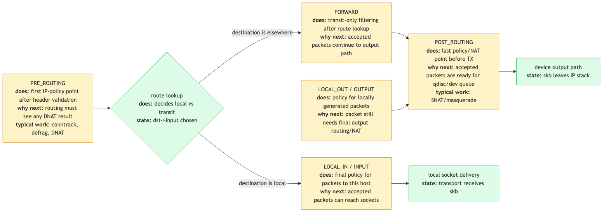

# Day 20 — Netfilter hooks

> **Today's mission:** see exactly where in the network stack iptables/nftables run, and the verdict pipeline. Total time: ~75 minutes.

> **Phase 4 starts here.** Days 20–26 cover the kernel's network subsystems: netfilter, nftables, conntrack, traffic control, kTLS, MPTCP.

## The five hooks



Netfilter is the kernel's packet-mangling framework. It defines five hook points along the packet path:

- **`NF_INET_PRE_ROUTING`** — after IP header is sanity-checked, before routing decision. Used for: DNAT, conntrack creation, mark-by-source.
- **`NF_INET_LOCAL_IN`** — packets routed to local sockets, just before delivery.
- **`NF_INET_FORWARD`** — packets routed to other interfaces (transit).
- **`NF_INET_LOCAL_OUT`** — locally-generated packets, just after IP header is built.
- **`NF_INET_POST_ROUTING`** — just before TX. Used for: SNAT, last-chance filtering.

Plus equivalents for IPv6, ARP, bridge.

## How hooks dispatch

`NF_HOOK(NFPROTO_IPV4, NF_INET_PRE_ROUTING, ..., okfn)` calls `nf_hook_slow` which iterates the registered hooks in priority order. Each returns a verdict:

- **`NF_ACCEPT`** — proceed.
- **`NF_DROP`** — discard.
- **`NF_QUEUE`** — to userspace via NFQUEUE.
- **`NF_STOLEN`** — hook took ownership; don't free.
- **`NF_REPEAT`** — re-run from the start.

If all hooks ACCEPT, `okfn` is called (next stage in the path).

## Today's experiment

```bash
# See registered hooks
sudo nft list ruleset
sudo nft list table inet filter

# Observe hook dispatch
sudo bpftrace -e 'fentry:nf_hook_slow {
  printf("hook %d, pf %d\n", args->state->hook, args->state->pf);
} interval:s:5 { exit }' &

# Generate traffic
ping -c 2 8.8.8.8
```

## What to read in the kernel

- **`net/netfilter/core.c`** — `nf_hook_slow`, `nf_hook_register`.
- **`include/linux/netfilter.h`** — hook constants, `NF_HOOK` macro.
- **`include/uapi/linux/netfilter.h`** — verdicts.
- **`net/ipv4/netfilter/ip_tables.c`** — legacy iptables backend.

## Bullet Points

- 5 IPv4 hooks: PREROUTING, LOCAL_IN, FORWARD, LOCAL_OUT, POSTROUTING.
- Each hook can register multiple callbacks at different priorities.
- Verdicts: ACCEPT, DROP, QUEUE, STOLEN, REPEAT.
- `nf_hook_slow` is the dispatcher.
- Both iptables and nftables hook into this same machinery.

## Check question

When you write `iptables -A INPUT ...`, which kernel hook does the rule attach to?

<details>
<summary>Click to reveal answer</summary>

**Answer:** `NF_INET_LOCAL_IN`. The `INPUT` chain in iptables/nftables corresponds to packets routed to local sockets after the routing decision. `OUTPUT` corresponds to `LOCAL_OUT`, `FORWARD` to `FORWARD`, `PREROUTING` to `PRE_ROUTING`, `POSTROUTING` to `POST_ROUTING`. The chain names are nearly 1:1 with the hook names.

</details>

## Tomorrow

Day 21: nftables vs iptables.
