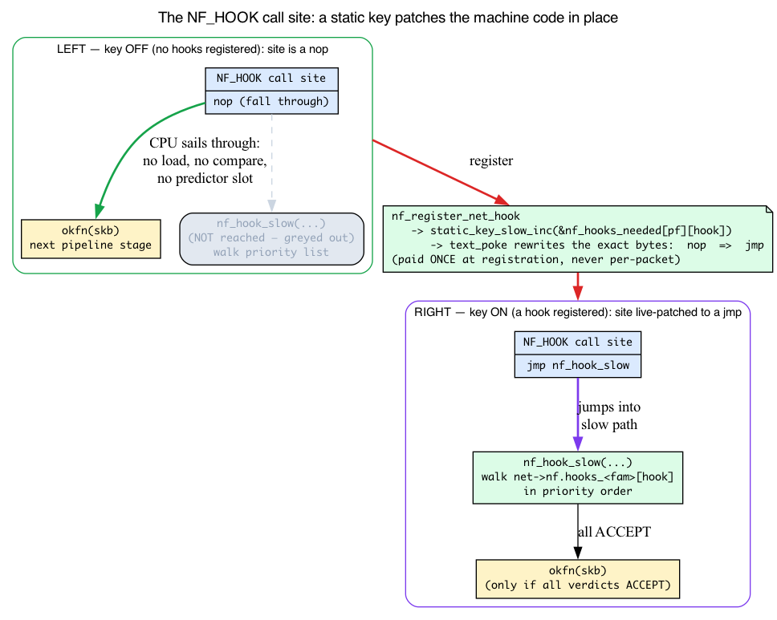
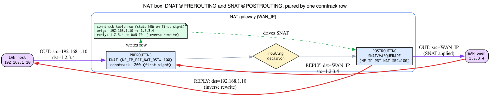
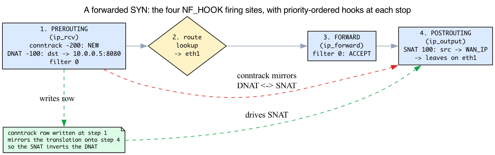

# Day 20 — Netfilter hooks

> **Today's mission:** see exactly where in the network stack `iptables`/`nftables` run, the verdict pipeline that turns a rule decision into a packet action, and the per-protocol/per-netns hook tables that make it all per-namespace. Along the way you'll learn the two mechanisms the chapter quietly leans on — *static keys* (why an idle firewall costs literally zero per packet) and *NAT* (what DNAT/SNAT/masquerade actually rewrite, and why conntrack must pair them). Total time: ~110 minutes.

> **Phase 4 starts here.** Days 20–26 cover the kernel's network subsystems: netfilter, nftables, conntrack, traffic control, `SO_REUSEPORT`, kTLS, MPTCP.

## What Netfilter is

Netfilter is the kernel's framework for **inspecting, modifying, and dropping packets** at well-defined points along the network stack. iptables, nftables, conntrack, IPVS, ebtables, and arptables all hook into this same framework. Understanding the hook layout means understanding *where* every firewall/NAT rule actually runs.

The framework is intentionally minimal: it's just a set of hook points, a registration API, and a verdict pipeline. Specific filtering logic (matching rules, computing actions) lives in the consumers (`nf_tables`, `ip_tables`, `nf_conntrack`).

We met netfilter once already, on Day 2: `ip_rcv` ends with `NF_HOOK(NFPROTO_IPV4, NF_INET_PRE_ROUTING, ...)` before routing. Today we open that macro up.

## The five hooks (per protocol family)


For IPv4 (`NFPROTO_IPV4`), defined at `include/uapi/linux/netfilter.h:42`:

```c
enum nf_inet_hooks {
    NF_INET_PRE_ROUTING,    // 0 — after IP header validation, before routing decision
    NF_INET_LOCAL_IN,       // 1 — packets routed to local sockets
    NF_INET_FORWARD,        // 2 — packets being routed through us
    NF_INET_LOCAL_OUT,      // 3 — packets we're generating
    NF_INET_POST_ROUTING,   // 4 — just before TX
    NF_INET_NUMHOOKS
};
```

(The real enum also carries a trailing `NF_INET_INGRESS = NF_INET_NUMHOOKS` (value 5) — a special-purpose inet ingress hook; the five entries above are the traditional hooks we focus on.)

The five hooks are positioned **around the routing decision** — two before it, the FORWARD/LOCAL_IN split right after it, and POSTROUTING after that. That's not arbitrary; the NAT primer below shows *why* the layout is forced to be exactly this shape.

### Where each one fires

- **PRE_ROUTING** runs in `ip_rcv` (`net/ipv4/ip_input.c`), right after `ip_rcv_core` validates the header, *before* the routing decision (this is the `NF_HOOK` you saw at the end of Day 2's `ip_rcv`). This is where you do **DNAT** (destination NAT — change where the packet is going) because the routing decision uses the post-rewrite destination.

- **LOCAL_IN** runs in `ip_local_deliver` after the routing decision determines the packet is for us. Last chance to drop before delivery to a socket. iptables' `INPUT` chain (a *chain* = the ordered list of rules a tool attaches at one hook; full treatment Day 21).

- **FORWARD** runs in `ip_forward` after routing determines the packet is *not* for us. iptables' `FORWARD` chain. It is the transit-only filter point, but a forwarded packet also passed through PREROUTING before the route lookup and will pass through POSTROUTING before TX.

- **LOCAL_OUT** runs in `__ip_local_out` for packets we're generating, immediately after the IP header is built. Note: by the time this fires the **initial route lookup has already run** (`ip_route_output_flow` precedes `ip_local_out`, so `skb_dst` is set). If a NAT rule here changes the destination, the original route no longer applies and the packet must be re-routed (`ip_route_me_harder`, `net/ipv4/netfilter.c:22`).

- **POST_ROUTING** runs in `ip_output` after all routing decisions, just before handing to the device. This is where you do **SNAT** (source NAT, including masquerading) because the new source IP doesn't change where the packet goes from here.

These five firing sites are the same ones Day 2 (RX) and Day 8 (routing) walked through; we lean on that routing decision here rather than re-teaching it.

### IPv6 has equivalents

Same enum, same five hooks, all with `NFPROTO_IPV6`. Plus `NFPROTO_BRIDGE` (a separate set: PREROUTING, LOCAL_IN, FORWARD, LOCAL_OUT, POSTROUTING for bridged frames) and `NFPROTO_ARP` (3 hooks for ARP packets).

## Per-netns, per-priority hook lists

Each `(net, protocol_family, hook_id)` triple has its own list of registered callbacks. Recall `struct net` from Day 5 — the network namespace. It holds these lists at `net->nf.hooks_ipv4[NF_INET_NUMHOOKS]` (`include/net/netns/netfilter.h:22`, reached via `net->nf` at `include/net/net_namespace.h:149`), `net->nf.hooks_ipv6[]`, etc. Registering a hook = appending to that list at a given priority. (We don't re-teach netns here; Day 5 owns it. Just remember each namespace gets its own independent hook tables.)

Priority determines order. Constants in `enum nf_ip_hook_priorities` (`include/uapi/linux/netfilter_ipv4.h`):

```c
NF_IP_PRI_CONNTRACK_DEFRAG = -400,    // conntrack defrag (earliest)
NF_IP_PRI_RAW              = -300,    // raw table
NF_IP_PRI_CONNTRACK        = -200,    // conntrack itself
NF_IP_PRI_MANGLE           = -150,    // mangle table
NF_IP_PRI_NAT_DST          = -100,    // dnat
NF_IP_PRI_FILTER           =    0,    // filter table
NF_IP_PRI_NAT_SRC          =  100,    // snat
NF_IP_PRI_LAST             =  INT_MAX,
```

Lower numbers run first. So at PRE_ROUTING, conntrack runs before NAT, which runs before user filter rules — because that's the order priorities give. Hold onto `NF_IP_PRI_NAT_DST = -100` and `NF_IP_PRI_NAT_SRC = 100`; the NAT primer explains why DNAT sits *before* the filter rules and SNAT sits *after*.

## Background: static keys — how an idle hook costs literally zero

The headline claim of this whole chapter is "netfilter on an idle box has no measurable per-packet cost." You'll see it stated again in *How a hook gets invoked* ("zero overhead") and in *What to read in the kernel* ("zero-cost-when-unused machinery"). But that claim leans on a mechanism the chapter never names: the **static key** (a.k.a. *jump label*). Let's make it real, because without it the zero-cost story is just a hand-wave.

### The problem with a normal `if`

The obvious way to make a feature optional is a global flag:

```c
if (netfilter_enabled)
    nf_hook_slow(...);   // slow path
okfn(skb);               // next pipeline stage
```

That `if` is *cheap* but not *free*. Every single packet — and the RX path is the hottest code in the kernel — must **load `netfilter_enabled` from memory, compare it, and let the branch predictor guess**. On an idle box with no firewall rules, that's pure waste: a load and a branch paid millions of times per second to discover "nope, still disabled." Worse, it consumes a branch-predictor slot on the hottest path in the kernel.

### The trick: patch the machine code, not test a variable

A **static key** is a runtime-toggleable branch whose cost-when-disabled is *literally zero*, because the kernel **patches the machine code at the branch site** instead of testing a variable. The idea:

- When the key is **off**, the branch site holds a `nop` (or an unconditional jump straight past the slow path). The CPU sails through — no load, no compare, no predictor pressure.
- When something flips the key **on**, the kernel **rewrites those exact bytes in place** (via the `text_poke` code-patching primitive) into a real jump into the slow path.

So the predicate is paid for **once, at registration time** — not on every packet. The cost moves entirely off the data path. This is the standard kernel idiom for "a feature that is usually off but must be free when off"; tracepoints use it too, and — connecting forward — so does the UDP-tunnel `encap_rcv` divert you saw on Day 12 (`static_branch_unlikely(&udp_encap_needed_key)`, `net/ipv4/udp.c:2364`). Day 12 *used* a static branch without ever defining it; this is the chapter that finally does.

The primitives live in `include/linux/jump_label.h` — `static_key_false()`, `DEFINE_STATIC_KEY_TRUE/FALSE` (lines ~19–24) — and the whole optimization is behind `CONFIG_JUMP_LABEL`. Without that config the code falls back to a plain `if`-on-a-variable branch.

### How netfilter uses it

Netfilter keeps one static key **per (family, hook) pair**:

```c
/* include/linux/netfilter.h:212 */
extern struct static_key nf_hooks_needed[NFPROTO_NUMPROTO][NF_MAX_HOOKS];
```

The guard at the top of `nf_hook()` (`include/linux/netfilter.h:227`, fast-out at lines 235–240) is:

```c
#ifdef CONFIG_JUMP_LABEL
    if (__builtin_constant_p(pf) &&
        __builtin_constant_p(hook) &&
        !static_key_false(&nf_hooks_needed[pf][hook]))
        return 1;          // "1" == ACCEPT: just run okfn, no hook walk
#endif
```

Two subtleties:

1. **Why `__builtin_constant_p`?** The compiler can only emit one patchable site per `(family, hook)` if `pf` and `hook` are *compile-time constants*. That's exactly why every caller passes literals like `NFPROTO_IPV4, NF_INET_PRE_ROUTING` rather than variables — so the compiler bakes in one `nf_hooks_needed[NFPROTO_IPV4][NF_INET_PRE_ROUTING]` site it can patch.

2. **Who flips it?** Registration. `__nf_register_net_hook` calls the wrapper `nf_static_key_inc()` (`net/netfilter/core.c:447`), which does `static_key_slow_inc(&nf_hooks_needed[pf][hooknum])` at `:370`; unregister goes through `nf_static_key_dec()` (`:508` → `static_key_slow_dec` at `:385`). So the *first* hook to register at a given `(family, hook)` patches that one site from `nop` to a live jump into `nf_hook_slow`; the *last* to leave patches it back. (One subtlety: for `NFPROTO_INET` + `NF_INET_INGRESS` the wrapper remaps the key to `nf_hooks_needed[NFPROTO_NETDEV][NF_NETDEV_INGRESS]` before incrementing.)

The payoff: with **no** hooks registered, `nf_hooks_needed[pf][hook]` is off, the `NF_HOOK` site is a `nop`, and `okfn(skb)` — the next pipeline stage — is reached with **no function call into `nf_hook_slow` at all**. Register one hook and the kernel live-patches that single `(pf, hook)` site. That is the concrete meaning of "zero overhead when no hooks."



## How a hook gets invoked

The kernel uses the macro `NF_HOOK(pf, hook, net, sk, skb, indev, outdev, okfn)`. With the static key you just learned: if no hooks are registered (the `nf_hooks_needed[pf][hook]` key is off), the patched-out site inlines `okfn(...)` directly — zero overhead. If hooks exist, the key has been flipped on and the macro calls `nf_hook_slow` (`net/netfilter/core.c:612`):

1. Walks the registered list at `net->nf.hooks_<family>[hook]` in priority order.
2. Calls each hook function with `nf_hook_state` (the context) and skb.
3. Each hook returns a *verdict*.
4. If all return ACCEPT, calls `okfn(skb)` — the next stage in the pipeline.

## The verdicts

```c
#define NF_DROP        0   // free skb, stop
#define NF_ACCEPT      1   // proceed
#define NF_STOLEN      2   // hook took ownership; don't free
#define NF_QUEUE       3   // queue to userspace via NFQUEUE
#define NF_REPEAT      4   // re-run from the start of this hook
#define NF_STOP        5   // accept, but don't continue to the next hook (rare)
```

- **`NF_ACCEPT`** is the common path: continue to the next hook, then to `okfn`.
- **`NF_DROP`** ends the journey; skb is freed (with a drop-reason if `kfree_skb_reason` is used — recall the `enum skb_drop_reason` from Day 1).
- **`NF_STOLEN`** is for hooks that take ownership and will free or forward the skb later (used by IPVS, conntrack defrag).
- **`NF_QUEUE`** sends the skb to a userspace process via the NFQUEUE protocol (`libnetfilter_queue`). Userspace returns a verdict via netlink.
- **`NF_REPEAT`** re-runs the same hook (used by some rule engines for re-evaluation after a state change).
- **`NF_STOP`** remains in the UAPI for compatibility but is deprecated; treat it as historical, not something new code should return.

The verdict can also pack additional data — for `NF_QUEUE`, the queue number; for `NF_DROP`, an errno. The high bits of the return value carry these: `NF_VERDICT_MASK = 0x000000ff` extracts the verdict (used by `nf_hook_slow`'s `verdict & NF_VERDICT_MASK`), while `NF_VERDICT_QMASK = 0xffff0000` holds the queue number / errno in the top 16 bits. Helpers `NF_QUEUE_NR(x)` and `NF_DROP_ERR(x)` pack those high bits; `NF_DROP_GETERR()` unpacks the errno.

## Who registers what

You can see all hooks in a netns via:

```bash
sudo nft list hooks
```

(Requires recent nftables.) Output looks like:

```
family ip {
    hook prerouting {
        -0000000400 ipv4_conntrack_defrag [nf_defrag_ipv4]
        -0000000200 ipv4_conntrack_in [nf_conntrack]
        -0000000100 nf_nat_ipv4_pre_routing [nf_nat]
         ...
    }
    hook input {
         ...
    }
}
```

Each line: priority, function name, owning module. You'll typically see conntrack at low priorities, the filter chains at 0, and SNAT/DNAT around ±100.

## Background: NAT — what DNAT, SNAT, and masquerade actually do

The chapter's concrete trace below is *entirely* NAT-driven, and its punchline ("the SNAT mirrors the DNAT so reply traffic comes back symmetrically") assumes you already understand address rewriting and the symmetric-reply problem. No earlier chapter teaches NAT — Day 5 only name-dropped it. So before the trace pays off, here's the primer.

### The core idea: rewriting addresses at the boundary

**NAT (Network Address Translation)** = rewriting the source or destination IP/port of a packet as it crosses the box, so a machine can speak to the outside world under a *different* address than its own. The classic case: a home/office LAN of `192.168.1.0/24` machines, none of which has a public IP, all reaching the internet through one gateway's single public WAN address.

There are two directions, and the names tell you which field gets rewritten:

- **DNAT (destination NAT)** rewrites where the packet is **GOING** — the destination IP/port. Used for port-forwarding: "traffic to my WAN IP:80 should actually go to the internal web server `10.0.0.5:8080`."
- **SNAT (source NAT)** rewrites where the packet appears to **come FROM** — the source IP/port. Used so a LAN machine's packets appear to originate from the gateway's WAN IP.
- **Masquerade** is just SNAT where the new source IP is **auto-picked as the outgoing interface's current address** — the right choice for a gateway whose WAN IP is dynamic (DHCP/PPP), so you don't have to hard-code it.

### Why the hook placement is forced, not arbitrary

Here's the part that makes the five-hook layout click. The placement of DNAT and SNAT is *dictated by the routing decision*, not chosen for convenience:

- **DNAT must run at PREROUTING** — *before* routing. The routing decision that follows reads the **destination** address to decide where the packet goes. If you rewrote the destination *after* routing, the packet would already be heading to the wrong place. So DNAT has to happen first, at PREROUTING (priority `NF_IP_PRI_NAT_DST = -100`, before the filter rules at 0).

- **SNAT must run at POSTROUTING** — *after* routing. By the time POSTROUTING fires, routing is done and the **source** address no longer affects where the packet goes. So it's safe (and correct) to rewrite the source only at the very end (priority `NF_IP_PRI_NAT_SRC = 100`, after the filter rules).

The kernel states this rule in its own words (`net/netfilter/nf_nat_core.c:682–684`):

```c
/* ... For NF_INET_POST_ROUTING, we change the source to map into the
 * range. For NF_INET_PRE_ROUTING and NF_INET_LOCAL_OUT, we change the
 * destination ... */
```

and the source-vs-destination decision keys off exactly that hook. `nf_nat_inet_fn` computes the manip type from the hook number (`net/netfilter/nf_nat_core.c:905`):

```c
/* maniptype == SRC for postrouting. */
enum nf_nat_manip_type maniptype = HOOK2MANIP(state->hook);
```

`HOOK2MANIP` is defined in `include/net/netfilter/nf_nat.h:19` as `((hooknum) != NF_INET_POST_ROUTING && (hooknum) != NF_INET_LOCAL_IN)` — its comment reads *"SRC manip occurs POST_ROUTING or LOCAL_IN"*. So SNAT (SRC manip) happens at POSTROUTING *or* LOCAL_IN, and everything else is DST manip.

*This is the concrete reason there are five hooks around the routing decision rather than one.* The routing decision sits in the middle, DNAT must be upstream of it, SNAT downstream.

### Why conntrack is mandatory for NAT

Now the symmetric-reply problem. Suppose the gateway rewrites an outbound packet `192.168.1.10 → 1.2.3.4` into `WAN_IP → 1.2.3.4` (SNAT). The reply comes back addressed to `WAN_IP` — because that's all the remote end ever saw. The gateway **must know to rewrite that reply back to `192.168.1.10`**, or the LAN machine never gets its answer.

How does it remember? It records the flow in the **conntrack table** the first time it sees the connection (state `NEW`), and applies the **inverse rewrite** to every reply packet of that flow. That's why:

- NAT rules are written as if they apply to a single packet, but they actually govern the **whole connection** — the rule fires on the first packet, conntrack mirrors the translation onto all the rest.
- Conntrack does its NEW-flow lookup at the two **"first sight"** hooks, **PREROUTING and LOCAL_OUT** (priority `NF_IP_PRI_CONNTRACK` = -200, i.e. *before* NAT's -100), so it sees every new flow before NAT does. You can see it plant at PREROUTING in `ipv4_conntrack_ops[]` (`net/netfilter/nf_conntrack_proto.c:233`): `.hooknum = NF_INET_PRE_ROUTING`, `.priority = NF_IP_PRI_CONNTRACK`. The same array also registers *confirm* hooks at POSTROUTING/LOCAL_IN (`:245`/`:251`, priority `NF_IP_PRI_CONNTRACK_CONFIRM`) that commit the entry — full story Day 22.

> **This is a forward dependency.** Conntrack gets its full chapter on **Day 22** — its table structure, states, and timeouts. Here you need exactly one fact: *conntrack records each flow once and mirrors the translation onto the reply.* Don't go looking for conntrack internals today.



## A concrete trace

Now the payoff. For a forwarded TCP SYN to port 80 going through a NAT box — read it with the primer above in hand:

1. **`ip_rcv`** is called. Calls `NF_HOOK(NFPROTO_IPV4, NF_INET_PRE_ROUTING, ...)`.
   - `nf_conntrack_in` (priority -200): create or look up conntrack entry. State = NEW. (This is the "first sight" that lets step 4 mirror the translation.)
   - `nf_nat_ipv4_pre_routing` (priority -100): apply DNAT rule if any. Maybe rewrites dst from `1.2.3.4:80` to `10.0.0.5:8080`. (DNAT *before* routing, exactly as the primer required.)
   - User filter at priority 0 (e.g., `nft add rule ip filter prerouting accept`).
   - All ACCEPT → `okfn = ip_rcv_finish`.
2. **`ip_rcv_finish`** does the routing lookup using the (now possibly rewritten) destination. Decides this packet goes to `10.0.0.5` via `eth1`.
3. **`ip_forward`** is called (since the packet is for someone else). `NF_HOOK(NFPROTO_IPV4, NF_INET_FORWARD, ...)`.
   - User filter at priority 0 (e.g., `iptables -A FORWARD -j ACCEPT`).
4. **`ip_output`** → `NF_HOOK(NFPROTO_IPV4, NF_INET_POST_ROUTING, ...)`.
   - `nf_nat_ipv4_out` (priority 100): apply SNAT/MASQUERADE if the NAT rule matched. Maybe rewrites src from `192.168.1.10` to the gateway's WAN IP. (SNAT *after* routing, again as required.)
   - All ACCEPT → packet leaves on `eth1`.

The conntrack entry created in step 1's PREROUTING is what links steps 1 and 4: the SNAT in step 4 mirrors the DNAT in step 1 so reply traffic comes back symmetrically. (And when the reply arrives, conntrack at *its* PREROUTING recognizes the flow and applies the inverse rewrites — the symmetric path from the NAT diagram.)



## There are no Dumb Questions

> **Q: If the static key makes a disabled hook a `nop`, how is that different from the branch predictor "predicting not-taken" every time?**
>
> A: Prediction is still *work*: the CPU fetches the flag, issues the compare, and occupies a predictor slot — and a misprediction (rare, but possible) costs a pipeline flush. A patched-out static key has **no branch instruction there at all** to predict; the bytes are a `nop` or fall-through. Nothing to load, nothing to mispredict, no predictor pressure on the kernel's hottest path. That's the whole reason netfilter chose static keys over a global flag.

> **Q: I added one `nft` rule. Did I just slow down *every* hook?**
>
> A: No — only the one `(family, hook)` site your rule attaches to. `static_key_slow_inc` flips exactly `nf_hooks_needed[pf][hooknum]` for that hook (e.g. just `LOCAL_IN` for an `input` chain). The other four hooks stay patched-out `nop`s. Per-hook keys are why a box with only an `input` filter pays nothing at PREROUTING/FORWARD/POSTROUTING.

> **Q: Why does NAT need conntrack, but a plain `drop` rule doesn't?**
>
> A: A `drop` decision is **stateless** — it looks at one packet and acts. NAT is **stateful**: it rewrites the outbound packet, and must apply the *inverse* rewrite to replies it hasn't seen yet. The only way to do that is to remember the flow. Conntrack is that memory (full story Day 22). That's also why conntrack registers at the lower priority (-200) — it must record the flow *before* NAT (-100) rewrites it.

> **Q: What's the difference between SNAT and masquerade, really?**
>
> A: Mechanically the same rewrite (source address), but SNAT uses a **fixed** address you specify, while masquerade **auto-picks the outgoing interface's current IP** at packet time. Use SNAT when the WAN IP is static (slightly cheaper, no per-packet interface lookup); use masquerade when it's dynamic (DHCP/PPP) so you never hard-code an address that might change.

## Today's experiment

```bash
# See registered hooks (modern nft only)
sudo nft list hooks ip

# Old way: per-table inspection
sudo iptables -L -n -v
sudo nft list ruleset

# Trace which hook fires when
sudo bpftrace -e 'fentry:nf_hook_slow {
  printf("hook %d pf %d\n", args->state->hook, args->state->pf);
}' &
sleep 2            # let the fentry probe finish attaching (compile+load+attach takes ~1-2s)
ping -c 3 8.8.8.8
sleep 1            # let the last packet's events flush
sudo killall bpftrace
```

(That `fentry:nf_hook_slow` only fires at all because some hook *is* registered on your box — the static key for that hook is on. On a truly hookless `(family, hook)` the site is a `nop` and `nf_hook_slow` is never entered, so the probe would stay silent for it.)

The output is raw integers, one line per hook traversed — decode them with the enum above (`hook` is `nf_hook_state.hook`, `pf` is `nf_hook_state.pf`; the struct is at `include/linux/netfilter.h:78`):

```
hook 3 pf 2     # LOCAL_OUT,   AF_INET — the outgoing echo request
hook 4 pf 2     # POSTROUTING — just before TX
hook 0 pf 2     # PREROUTING  — the echo reply arrives
hook 1 pf 2     # LOCAL_IN    — delivered to our socket
```

So `hook` decodes as `0=PREROUTING, 1=LOCAL_IN, 2=FORWARD, 3=LOCAL_OUT, 4=POSTROUTING`, and `pf 2 = AF_INET` (IPv4; `pf 10 = AF_INET6`). For the ICMP exchange you'll see LOCAL_OUT (3) and POSTROUTING (4) outbound, then PREROUTING (0) and LOCAL_IN (1) on the reply.

### Add a hook of your own (via nft)

```bash
sudo nft add table inet test
sudo nft 'add chain inet test myinput { type filter hook input priority 0 ; policy accept ; }'
sudo nft add rule inet test myinput meta nftrace set 1
# Now any packet going through input gets nftrace logged
sudo nft monitor trace &
ping -c 1 8.8.8.8
sudo pkill -f 'nft monitor'   # stop the backgrounded monitor once you've seen the trace
```

You see each rule evaluation with the verdict.

### Drop a specific port and see it work

```bash
sudo nft add rule inet test myinput tcp dport 12345 drop
nc -w 2 localhost 12345    # HANGS, then times out after ~2s — DROP silently blackholes the SYN (no RST/ICMP)
nc -w 2 localhost 22       # connects (different port, not matched by the rule)

# Contrast drop with reject: reject *replies* (RST/ICMP) instead of blackholing.
sudo nft add rule inet test myinput tcp dport 12346 reject
nc -w 2 localhost 12346    # instant 'Connection refused' — reject sends an RST, unlike drop

# Cleanup
sudo nft delete table inet test
```

## What to read in the kernel

- **`net/netfilter/core.c:612`** — `nf_hook_slow`. The dispatcher. Read it end to end (~33 lines). Notice how it walks the per-hook list, dispatches each hook, and handles each verdict. Its `switch` only handles `NF_ACCEPT`/`NF_DROP`/`NF_QUEUE`/`NF_STOLEN`; anything else (including `NF_REPEAT`/`NF_STOP`) falls to a `default: WARN_ON_ONCE(1)`. So if you go looking for `NF_REPEAT` handling here you won't find it — repeat is implemented inside the *consumers* (e.g. conntrack returns `-NF_REPEAT` to re-run itself), not in the dispatcher.

- **`net/netfilter/core.c:550`** — `nf_register_net_hook`. The registration function. How a module (nftables, conntrack, IPVS) plants its hook callback. Note the per-priority insertion (sorted insertion) — and the `static_key_slow_inc(&nf_hooks_needed[pf][hooknum])` at `:370` that flips the per-hook static key on, patching the `NF_HOOK` site live.

- **`include/linux/netfilter.h`** — `NF_HOOK` macro and friends, plus `nf_hook()` (line 227) with the static-key fast-out at lines 235–240, and the `nf_hooks_needed[][]` key array (line 212). `NF_HOOK` is conditional on the `nf_hooks_needed[pf][hook]` static key; if no hooks, it skips the call entirely. This is the zero-cost-when-unused machinery.

- **`include/linux/jump_label.h`** — the static-key/jump-label API itself: `static_key_false()`, `DEFINE_STATIC_KEY_TRUE/FALSE` (lines ~19–24). The code-patching primitive behind "zero cost when off." Read the big comment block at the top — it explains the patched-branch model.

- **`include/uapi/linux/netfilter.h`** — verdicts, hook IDs, and `enum nf_inet_hooks`. The vocabulary file.

- **`net/netfilter/nf_nat_core.c`** — NAT translation. The comment at `:682` states the DNAT-at-PREROUTING / SNAT-at-POSTROUTING rule; `nf_nat_inet_fn` picks SRC-vs-DST manip via `HOOK2MANIP(state->hook)` at `:905` (macro in `include/net/netfilter/nf_nat.h:19`). Conntrack mirrors these (Day 22).

- **`net/ipv4/netfilter.c:22`** — `ip_route_me_harder`, the re-route after a LOCAL_OUT DNAT changes a self-originated packet's destination.

- **`net/ipv4/netfilter/ip_tables.c`** — legacy iptables backend. Read the top to see how `xt_table_info` (the rule storage) is consulted; rules are linear, walked top-to-bottom per packet. Compare to nftables (next day), which evaluates compact expression sequences through `nft_do_chain`.

- **`net/netfilter/nf_tables_core.c`** — modern nftables runtime. The expression interpreter. Read this *after* tomorrow's nftables intro.

- **`net/netfilter/nf_conntrack_core.c`** — conntrack does its NEW-flow lookup at PRE_ROUTING and LOCAL_OUT (the two "first sight" hooks, priority -200) and registers separate confirm hooks at POSTROUTING/LOCAL_IN; see `ipv4_conntrack_ops[]` in `nf_conntrack_proto.c:233`. Day 22 covers this.

- **`Documentation/networking/netfilter-sysctl.rst`** — netfilter sysctl knobs (the closest in-tree netfilter doc; there is no hook-diagram text file). See also `nf_conntrack-sysctl.rst` and `nf_flowtable.rst`.

- **External: nftables wiki** at https://wiki.nftables.org — has nice diagrams of where each hook fires.

## Bullet Points

- **Five IPv4 hooks**: PRE_ROUTING, LOCAL_IN, FORWARD, LOCAL_OUT, POST_ROUTING — positioned *around* the routing decision. Same five for IPv6.
- **PREROUTING** = before routing (DNAT here, because routing reads the dst); **POSTROUTING** = after routing (SNAT here, because the src no longer affects routing). The placement is *forced* by the routing decision, not arbitrary.
- **NAT** rewrites addresses at the boundary: **DNAT** changes the destination, **SNAT** changes the source, **masquerade** is SNAT with the source auto-picked from the outgoing interface. NAT is *stateful* — **conntrack** records each flow once (at the PREROUTING/LOCAL_OUT "first sight" hooks) and mirrors the inverse rewrite onto replies (full story Day 22).
- A **static key** (jump label) makes a disabled hook cost *literally zero*: the kernel patches the call site to a `nop` and only rewrites it to a real jump when a hook registers (`static_key_slow_inc`). One key **per (family, hook)** — `nf_hooks_needed[pf][hook]`. This is *why* `NF_HOOK` is free on an idle box; same mechanism as Day 12's `udp_encap_needed_key`.
- Each hook has a per-netns list of callbacks ordered by priority (`net->nf.hooks_ipv4[]`, recall `struct net` from Day 5).
- Verdicts: **ACCEPT, DROP, STOLEN, QUEUE, REPEAT**; **STOP** is deprecated UAPI compatibility.
- `nf_hook_slow` is the dispatcher; `NF_HOOK` patches to zero overhead when no hooks registered.
- iptables, nftables, conntrack, IPVS — **all** plug into the same hook system at different priorities.
- Inspect with `nft list hooks` (modern) or `iptables -L -v` (legacy).

## Check question

When you write `iptables -A INPUT ...`, which kernel hook does the rule actually attach to, and at what priority?

<details>
<summary>Click to reveal answer</summary>

**Answer:** **`NF_INET_LOCAL_IN`**, priority **0** (`NF_IP_PRI_FILTER`). The `INPUT` chain in iptables/nftables corresponds 1:1 with `LOCAL_IN` — the kernel hook that fires after routing has determined the packet is for a local socket. The priority is `NF_IP_PRI_FILTER = 0`, which puts user filter rules *after* conntrack (`NF_IP_PRI_CONNTRACK = -200`) but *before* anything at higher priority. Other iptables chains map similarly: `OUTPUT` → `LOCAL_OUT`, `FORWARD` → `FORWARD`, `PREROUTING` → `PRE_ROUTING`, `POSTROUTING` → `POST_ROUTING`. The names line up almost identically with the kernel's hook IDs because iptables was *designed* to expose them.

</details>

---

## Tomorrow

Day 21: nftables vs iptables. Why nftables exists, what it does better, and how to convert legacy iptables rules.
