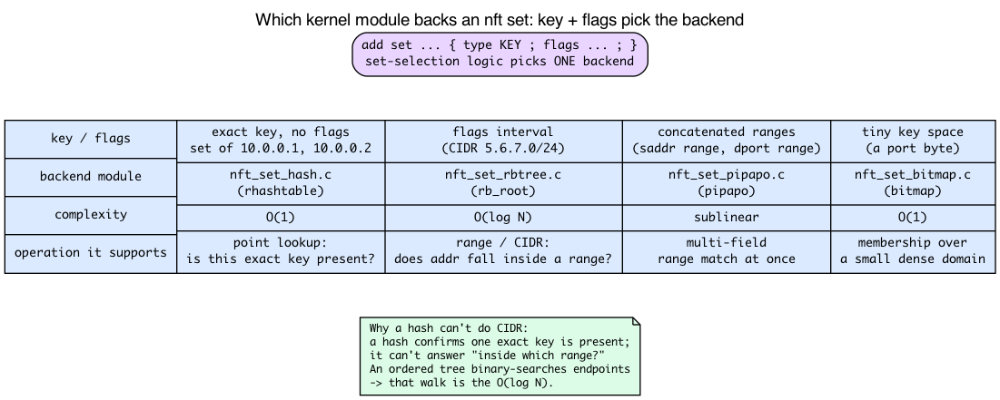
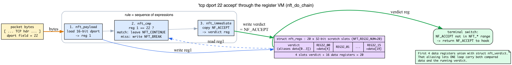
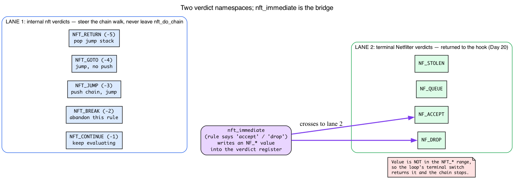
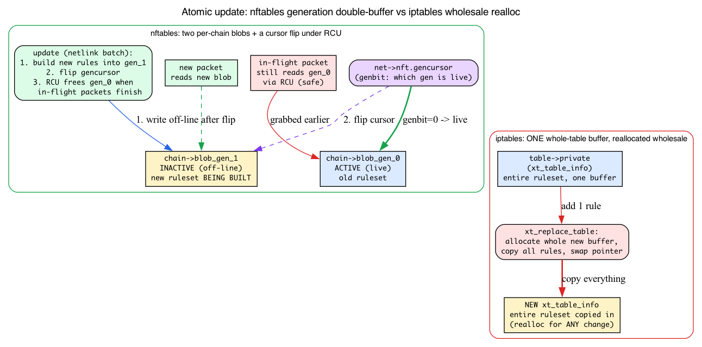

# Day 21 — nftables vs iptables

> **Today's mission:** see why nftables exists, write a real ruleset that does multiple useful things, and understand how the same hooks expose two completely different rule engines — including the tiny register-based VM, two verdict namespaces, three set backends, and the generation double-buffer that make the headline features real. Total time: ~110 minutes.


## Two generations of the same idea

Both iptables and nftables hook into the same Netfilter framework (Day 20). They differ in *how rules are stored, matched, and executed* — which has cascading effects on syntax, performance, and feature surface.

### iptables (legacy, 2001)

- **Per-protocol tools**: `iptables` (IPv4), `ip6tables` (IPv6), `arptables` (ARP), `ebtables` (bridged Ethernet). Four parallel binaries with similar but *not identical* syntax.
- **Linear matching**: rules in a chain are an array of fixed-shape entries (`struct ipt_entry` + match + target). For each packet, the kernel walks the array top-to-bottom evaluating each rule's matches. Match modules (`xt_*`) are kernel modules.
- **Implementation**: `ipt_do_table` (`net/ipv4/netfilter/ip_tables.c:223`). The "fast path" is a manually-unrolled loop over rule entries.
- **Storage**: `xt_table_info` arrays are large pre-allocated buffers; updates require allocating a whole new buffer and atomic swap. Adding one rule rewrites the entire table.

### nftables (modern, since 3.13 / 2014)

- **One tool**: `nft`. Single syntax for inet (IPv4+IPv6 unified), arp, bridge, netdev (per-iface).
- **Expression VM**: rules compile to compact expression sequences run by `nft_do_chain` (`net/netfilter/nf_tables_core.c:250`). Each rule is a sequence of `nft_expr` ops operating on a small register file; common expressions have fast paths, but this is not a BPF-style JIT. (We dissect this VM in detail below — it's the one idea that makes "rules compile to expressions" click.)
- **Native sets and maps**: hash sets, interval/range sets (red-black tree), concatenated-range sets (pipapo), key→value maps as first-class types. Membership tests are O(1) or O(log N) instead of O(N) linear walks. (These are three *separate* kernel modules — we'll see which one the kernel picks and why.)
- **Atomic updates**: changes are applied transactionally via netlink; no full-table rewrite for one rule add. (Backed by a generation double-buffer + RCU — covered below.)
- **Implementation**: `nft_do_chain` (`net/netfilter/nf_tables_core.c:250`). Reads the chain's expression list, runs each.

### Performance difference

For a simple "drop traffic from these 100 IPs" rule:

- **iptables**: a chain of 100 `-s IP -j DROP` rules. Each packet walks all 100 (until match or end). O(N) per packet.
- **nftables**: one rule using a set of exact IPs: `ip saddr @denylist drop`. That set is a hash table. O(1) per packet regardless of size.

For 100 IPs the difference is noticeable; for 100k IPs (e.g., a denylist), iptables is unusable, nftables is fine. The O(1) claim holds for a set of *exact* `/32` keys; a denylist of CIDR *ranges* instead uses the interval/rbtree backend at O(log N) — see the set-backends section for why a range can't be a hash. We'll see exactly which data structure backs that "hash table" claim later in the chapter.

## Basic nft ruleset

```bash
# Create an inet table (covers both IPv4 and IPv6)
sudo nft add table inet filter

# Add chains for the standard hook positions, with default policies.
# Run this only in a VM/netns lab: policy drop on host input can lock you out.
sudo nft 'add chain inet filter input   { type filter hook input   priority 0 ; policy drop ; }'
sudo nft 'add chain inet filter forward { type filter hook forward priority 0 ; policy drop ; }'
sudo nft 'add chain inet filter output  { type filter hook output  priority 0 ; policy accept ; }'

# Allow established + related (conntrack — black box today, explained just below / Day 22)
sudo nft add rule inet filter input ct state established,related accept

# Allow loopback
sudo nft add rule inet filter input iif lo accept

# Allow ICMP (so ping works)
sudo nft add rule inet filter input meta l4proto { icmp, icmpv6 } accept

# Allow specific TCP ports
sudo nft add rule inet filter input tcp dport { 22, 80, 443 } accept

# Drop the rest (covered by chain policy 'drop')

# Inspect
sudo nft list ruleset
```

The `inet` family is special — same chain matches both v4 and v6 traffic, so you don't write rules twice.

> **About `ct state established,related accept`.** That very first substantive rule leans on **conntrack**, the connection-tracking subsystem. `ct state` is a *stateful match*: it asks conntrack "have I seen this flow before, and in what state?" The states you'll meet are `new` (first packet of a flow), `established` (a flow conntrack already tracks), and `related` (a helper flow, like FTP data or an ICMP error tied to an existing connection) — the kernel names them `IP_CT_NEW`, `IP_CT_ESTABLISHED`, `IP_CT_RELATED` in `enum ip_conntrack_info` (`include/uapi/linux/netfilter/nf_conntrack_common.h`), and the `ct` expression's keys live in `enum nft_ct_keys` (`include/uapi/linux/netfilter/nf_tables.h:1159`). **Treat conntrack as a black box today** — we dissect the whole mechanism tomorrow (Day 22). All you need now: this rule lets reply traffic for connections you initiated back in without you having to write a matching reverse rule for every flow.

## Sets and maps

Native data structures, not afterthoughts.

### Anonymous set inline

```bash
sudo nft add rule inet filter input ip saddr { 10.0.0.1, 10.0.0.2, 10.0.0.3 } accept
```

The `{...}` creates an anonymous hash set, used by this rule only.

### Named set (mutable from CLI)

```bash
sudo nft add set inet filter blocked { type ipv4_addr \; flags interval \; }
sudo nft add element inet filter blocked { 1.2.3.4 }
sudo nft add element inet filter blocked { 5.6.7.0/24 }

sudo nft add rule inet filter input ip saddr @blocked drop
```

The set persists, can be added to/removed from at runtime, and the rule references it by name.

### Map (key → value)

```bash
sudo nft add map inet filter port_to_action { type inet_service : verdict \; }
sudo nft add element inet filter port_to_action { 22 : accept, 80 : accept, 443 : accept, 25 : drop }

sudo nft add rule inet filter input tcp dport vmap @port_to_action
```

`vmap` (verdict map) translates the matched value into a verdict via lookup. Replaces a chain of `if dport == X jump Y else...`.

### Interval sets (ranges)

```bash
sudo nft add set inet filter trusted_nets { type ipv4_addr \; flags interval \; }
sudo nft add element inet filter trusted_nets { 10.0.0.0/8, 192.168.0.0/16, 172.16.0.0/12 }
```

Backed by an interval/range tree, not a hash. Lookup is O(log N) but supports CIDR. (Next section explains *why* it can't be a hash.)

### What actually backs a set: three kernel modules, not one

The chapter keeps saying "hash set," "interval tree," "pipapo" and quoting O(1) / O(log N) — but those aren't hand-waving. They are **three distinct kernel modules**, and when you `add set ... { type ... ; flags ... ; }`, the kernel picks one based on the key type and flags. List them on the devbox:

```
net/netfilter/nft_set_hash.c      # exact-match sets
net/netfilter/nft_set_rbtree.c    # interval / range sets
net/netfilter/nft_set_pipapo.c    # concatenated-range sets
net/netfilter/nft_set_bitmap.c    # small key spaces, ≤ 2 bytes (e.g. a 16-bit port)
```

Ground each one:

- **Exact-match sets** (a plain `{ 10.0.0.1, 10.0.0.2 }`, no `flags interval`) use an **rhashtable** — the kernel's generic resizable hash table. Open `nft_set_hash.c` and you'll see `struct nft_rhash { struct rhashtable ht; ... }` (`net/netfilter/nft_set_hash.c:24-25`), with `#include <linux/rhashtable.h>` at the top. A hash answers exactly one question — *"is this exact key present?"* — in **O(1)**.

- **Interval sets** (`flags interval`, used above for CIDRs) use a **red-black tree** keyed on range endpoints: `struct nft_rbtree { struct rb_root root; ... }` (`net/netfilter/nft_set_rbtree.c:31`). Here's *why a hash can't do this job*: a CIDR like `5.6.7.0/24` must match a whole **range** of addresses, not one exact key. A hash can only confirm a single key is present; it can't answer "does this address fall *inside* one of my stored ranges?" An ordered structure can — you binary-search the endpoints. That ordered tree walk is exactly the **O(log N)** the chapter quotes, and it's why CIDR membership is a tree walk, not a hash probe. The bare complexity number now has a reason behind it.

- **Concatenated ranges** (matching on, say, *(saddr range, dport range)* at once) use **pipapo** — "PIle PAcket POlicies," whose header comment reads *"PIPAPO: PIle PAcket POlicies: set for arbitrary concatenations of ranges"* (`net/netfilter/nft_set_pipapo.c:3`). One sentence is enough today; if you're curious, that file's opening comment is one of the best-documented algorithm write-ups in the tree.

This is just general data-structure intuition (ordered tree → log-N range lookup, hash → O(1) point lookup) wearing kernel clothes — nothing exotic. The set-selection logic chooses the backend; you choose the *behavior* by picking `flags` and key types.



## Counters and quotas

```bash
sudo nft add rule inet filter input tcp dport 22 counter accept
# show stats
sudo nft list table inet filter
```

`counter` accumulates packets/bytes. Built-in; no separate "counter table" required.

You've now built a real `inet filter` table whose `input` chain has `policy drop`, plus several named sets and maps. When you're done experimenting, tear the whole thing down in one transaction so you don't leave a drop-policy firewall (and stray sets/maps) loaded — exactly the "you forgot the other ruleset is running" trap the check question warns about:

```bash
# Removes all chains, rules, named sets, and maps in this table at once
sudo nft delete table inet filter
```

That "in one transaction" is not marketing copy. To see why deleting a whole table mid-traffic is safe, we need to understand how nftables makes runtime updates atomic — coming up after the VM.

## How nft_do_chain works: a tiny register VM

`nft_do_chain` (`net/netfilter/nf_tables_core.c:250`) is the runtime entry. Before we read its loop, we need the one idea everything hinges on: **the register file.**

### What a register actually is

Think of how a CPU works: it has a handful of named scratch slots (registers), and instructions communicate by one instruction writing a register and a later one reading it. nftables borrows that idea in miniature. A **register is just a slot in a small per-packet scratch array.** Each expression in a rule is like a tiny instruction: it reads some registers, maybe writes one, and the *next* expression sees what the previous one left behind. That's the entire model — "rules compile to a sequence of expressions" means "rules compile to a sequence of tiny instructions that pass values through a shared register file."

In v7.1 that array is `struct nft_regs` (`include/net/netfilter/nf_tables.h:122`):

```c
#define NFT_REG32_NUM 20            /* include/net/netfilter/nf_tables.h:112 */

struct nft_regs {
    union {
        u32              data[NFT_REG32_NUM];   /* 20 × 32-bit scratch slots */
        struct nft_verdict verdict;             /* aliases the FIRST slots */
    };
};
```

Two things to notice, both load-bearing:

1. **The scratch array is 20 `u32` wide, but there are only 16 addressable data registers.** `struct nft_regs` holds `NFT_REG32_NUM = 20` u32 slots — but those are *not* 20 independent data registers. The first 4 slots (`data[0..3]`) are consumed by the verdict register that aliases them (see point 2), leaving **16 addressable 32-bit DATA registers**: `NFT_REG32_00`..`NFT_REG32_15`. The UAPI makes this explicit — `NFT_REG32_COUNT == 16` and the comment reads *"The data registers have been changed to 16 registers of size 4"* (`include/uapi/linux/netfilter/nf_tables.h:16-21,30-55`). So 16 is the right count of data registers; the array is 20 wide only because 4 + 16 = 20.
2. **The verdict register *overlaps* the first data registers.** It's a `union`: `data[NFT_REG32_NUM]` and a `struct nft_verdict` share the same storage. The kernel comment spells it out: *"The first four data registers alias to the verdict register"* (`include/net/netfilter/nf_tables.h:119-120`). `struct nft_verdict { u32 code; struct nft_chain *chain; }` (`:100`) is 16 bytes = 4 u32 slots wide, so it lays over `data[0..3]` and the 16 real data registers live at `data[4..19]`. **This aliasing is *why* a single loop can carry both the data being compared and the running verdict** — they live in the same register file, just viewed two different ways.



### Two kinds of verdict — don't confuse them

Day 20 taught the **Netfilter verdicts** a hook returns to the framework: `NF_ACCEPT`, `NF_DROP`, `NF_QUEUE`, `NF_STOLEN`. nftables adds a **second, internal verdict namespace** used *only* to steer the chain walk — these never escape `nft_do_chain` (`enum nft_verdicts`, `include/uapi/linux/netfilter/nf_tables.h:68-73`):

```c
enum nft_verdicts {
    NFT_CONTINUE = -1,   /* keep evaluating */
    NFT_BREAK    = -2,   /* abandon THIS rule, go to the next */
    NFT_JUMP     = -3,   /* push chain, jump to another */
    NFT_GOTO     = -4,   /* jump without pushing */
    NFT_RETURN   = -5,   /* pop the jump stack */
};
```

So there are **two lanes**:

- **Internal nft verdicts** (`NFT_CONTINUE/BREAK/JUMP/GOTO/RETURN`) — chain flow control, never returned to the hook.
- **Terminal Netfilter verdicts** (`NF_ACCEPT/NF_DROP/NF_QUEUE/NF_STOLEN`) — the values a hook hands back to Netfilter (Day 20).

The bridge between the lanes is `nft_immediate`: when a rule says `accept` or `drop`, the `nft_immediate` expression writes a **Netfilter** verdict into the verdict register. Because that value is *not* in the `NFT_*` range, the loop's terminal `switch` returns it and the chain stops.



### The real loop

Now `nft_do_chain`'s core reads cleanly. Here is the actual v7.1 loop, lightly trimmed (`net/netfilter/nf_tables_core.c:273-313`):

```c
next_rule:
    regs.verdict.code = NFT_CONTINUE;          /* :274 — seed each rule with CONTINUE */
    for (; !rule->is_last ; rule = nft_rule_next(rule)) {
        nft_rule_dp_for_each_expr(expr, last, rule) {
            /* fast-path dispatch for the common expressions ... */
            if (expr->ops == &nft_cmp_fast_ops)
                nft_cmp_fast_eval(expr, &regs);
            else if (expr->ops != &nft_payload_fast_ops ||
                     !nft_payload_fast_eval(expr, &regs, pkt))
                expr_call_ops_eval(expr, &regs, pkt);   /* generic: expr->ops->eval(...) */

            if (regs.verdict.code != NFT_CONTINUE)   /* :287 — an expr changed it */
                break;
        }
        switch (regs.verdict.code) {
        case NFT_BREAK:                          /* :291 — abandon this rule */
            regs.verdict.code = NFT_CONTINUE;
            continue;                            /* ...move to next rule */
        case NFT_CONTINUE:
            continue;
        }
        break;                                   /* anything else: leave the rule loop */
    }

    switch (regs.verdict.code & NF_VERDICT_MASK) {   /* :306 — terminal dispatch */
    case NF_ACCEPT:
    case NF_QUEUE:
    case NF_STOLEN:
        return regs.verdict.code;
    case NF_DROP:
        return NF_DROP_REASON(pkt->skb, SKB_DROP_REASON_NETFILTER_DROP, EPERM);
    }
    /* NFT_JUMP/GOTO/RETURN handled below ... */
```

Read it with the two namespaces in mind:

- Every rule is **seeded** with `regs.verdict.code = NFT_CONTINUE` (`:274`). If no expression touches the verdict, the rule "passes through" and evaluation continues to the next rule.
- Each expression runs; right after, `if (regs.verdict.code != NFT_CONTINUE) break;` (`:287`) bails out of the *expression* loop the instant anything wrote the verdict.
- The inner `switch` handles the **internal** verdicts: `NFT_BREAK` resets to `CONTINUE` and moves to the next rule; `NFT_CONTINUE` likewise. Anything *else* (a JUMP/GOTO/RETURN, or a terminal NF_ verdict) breaks out of the rule loop entirely.
- The final `switch (regs.verdict.code & NF_VERDICT_MASK)` (`:306`) is the **terminal** dispatch: `NF_ACCEPT/NF_QUEUE/NF_STOLEN` are returned to the hook, `NF_DROP` becomes a drop-with-reason. **This is the line that makes `accept` and `drop` terminal.**

**About the `if/else` ladder at the top:** don't let it spook you. `nft_cmp_fast_ops`, `nft_payload_fast_ops`, etc. are just **inlined fast paths** for the most common expressions. The fallback `expr_call_ops_eval(expr, &regs, pkt)` is the generic `expr->ops->eval(expr, regs, pkt)` call — the exact dispatch the simplified pseudocode shows. So the model "every expression is `expr->ops->eval(expr, regs, pkt)`" is faithful; the ladder is an optimization, not a different design.

### Walking `tcp dport 22 accept` through the real loop

Now the headline claim — "rules compile to a sequence of expressions" — becomes concrete. `tcp dport 22 accept` compiles to three expressions, each tied to one op:

1. **`nft_payload`** loads the 16-bit TCP destination-port field from the packet into a **data register** (say reg 1). (Implementation in `nft_payload.c`; the fast path is `nft_payload_fast_eval`.)
2. **`nft_cmp`** reads that register and compares it against the constant `22`. On a **match**, it leaves the verdict at `NFT_CONTINUE` (fall through to the next expression). On a **mismatch**, it writes `NFT_BREAK` into the **verdict register** — and because `verdict.code != NFT_CONTINUE`, the loop breaks out of this rule and moves on, never reaching the `accept`. (That's why a non-port-22 packet skips this rule cleanly.)
3. **`nft_immediate`** writes the terminal verdict. Its eval is one line: `nft_data_copy(&regs->data[priv->dreg], &priv->data, priv->dlen);` (`net/netfilter/nft_immediate.c:24`, inside `nft_immediate_eval` which begins at `:18`) — it copies `NF_ACCEPT` into the destination register, which (for a verdict) *is* the verdict register thanks to the aliasing. The terminal `switch` then returns `NF_ACCEPT`.

That spine — payload writes a reg, cmp reads it and may set BREAK, immediate sets the verdict — is the model behind the whole "~50 expression types" zoo. A few common ones:

- **`nft_payload`** — load packet bytes into a register.
- **`nft_meta`** — load skb metadata into a register.
- **`nft_cmp`** — compare a register against a constant (may write `NFT_BREAK`).
- **`nft_lookup`** — set membership test (uses the backends above).
- **`nft_immediate`** — write a value or a verdict into a register.
- **`nft_counter`** — bump packet/byte counts; leaves the verdict at `NFT_CONTINUE`.
- ...~50 more expression types.

### Why ordering matters: `counter` before the verdict

This control flow directly explains a rule everyone trips over: **a `counter` must come *before* the terminal verdict, not after.**

`counter` leaves `regs.verdict.code == NFT_CONTINUE`, so evaluation flows on to the next expression. `drop`/`accept` (via `nft_immediate`) set a terminal `NF_*` verdict, and the loop **returns immediately** — any expression *after* it is never reached. So:

- `tcp dport 22 counter accept` → counter bumps, then accept returns. ✅ counter fires.
- `tcp dport 22 accept counter` → accept returns; the trailing counter is dead code. ❌ counter never fires.

Newer `nft` versions reject the second form at *parse time* with **"Statement after terminal statement has no effect"** — the parser is encoding the exact control-flow fact you just read in the loop. Same reasoning explains why `meta nftrace set 1` (which also leaves the verdict at `NFT_CONTINUE`) must precede the `drop` in today's experiment.

### The generation double-buffer: what "atomic update" really means

One headline remains ungrounded: *"atomic transactional updates — adding one rule doesn't rewrite the whole table."* How does an in-flight packet see a *consistent* ruleset while you're editing it?

First, the refresher: the *config channel* is **netlink** — the `AF_NETLINK` socket interface we taught in Day 8 (rtnetlink). `nft` talks to the kernel over netlink to submit a batch of changes. We won't re-teach netlink; the genuinely new mechanism is what happens to the *runtime* ruleset during that batch.

Look back at the top of `nft_do_chain` (`net/netfilter/nf_tables_core.c:259-270`):

```c
bool genbit = READ_ONCE(net->nft.gencursor);   /* :259 — which generation is live? */
...
if (genbit)
    blob = rcu_dereference(chain->blob_gen_1);  /* :268 */
else
    blob = rcu_dereference(chain->blob_gen_0);  /* :270 */
```

Each chain keeps **two** compiled rule blobs: `blob_gen_0` and `blob_gen_1`. A per-net **generation cursor** (`net->nft.gencursor`) says which one is currently live. The packet path reads the cursor and dereferences the active blob *via RCU* (RCU — the read-mostly scheme from Day 11: readers take no lock; a writer defers freeing until every in-flight reader finishes its grace period). When you submit an update:

1. The kernel builds the **new** ruleset into the **inactive** generation's blob (the one packets aren't using).
2. It **flips** `net->nft.gencursor` — a single cursor write — so new packets start reading the new blob.
3. In-flight packets that already grabbed the old blob keep using it safely, because RCU won't free the old blob until they finish.

That double-buffer + RCU *is* "atomic, no full-table rewrite": no packet ever sees a half-applied ruleset, and adding one rule touches only the off-line generation, never the whole live table. Deleting a table mid-traffic (as the cleanup step does) is safe for the same reason.

Contrast iptables. `ipt_do_table` reads the whole-table buffer `table->private` (`READ_ONCE(table->private)`, `net/ipv4/netfilter/ip_tables.c:260`), a single `struct xt_table_info` (`include/linux/netfilter/x_tables.h:244`). To change *anything*, iptables must allocate a **whole new** `xt_table_info`, copy the entire ruleset into it, and atomically swap the pointer (`xt_replace_table`). One big buffer, reallocated wholesale for every change — versus nftables' two small per-chain blobs and a cursor flip.



Read `net/netfilter/nf_tables_core.c:250` for the actual loop — it's only ~100 lines, and you now know every moving part: the register file, the two verdict namespaces, and the generation cursor.

> ### There are no Dumb Questions
>
> **Q: If nftables is strictly better, why does iptables still exist?**
>
> A: Thirty years of muscle memory and shell scripts. Countless firewall configs, container runtimes, and cloud images emit `iptables` commands; you can't rewrite them all overnight. The `iptables-nft` shim bridges the gap — it parses legacy `iptables` syntax and programs nftables underneath, so old tooling keeps working while the real engine is the modern one.
>
> **Q: My anonymous set `{ 10.0.0.1, 10.0.0.2 }` — is that the hash backend or the tree?**
>
> A: The hash (`rhashtable`, O(1)). They're plain exact keys with no `flags interval`, so the set-selection logic picks `nft_set_hash.c`. You'd only get the rbtree backend by asking for ranges (`flags interval`, e.g. a CIDR) — exactly the backend-selection rule from the sets section.
>
> **Q: Can one rule mix a data register and the verdict if they alias?**
>
> A: Yes — that's precisely what the `union` buys. A rule freely writes data into registers `NFT_REG32_00..15` (which live at `data[4..19]`) while the verdict register occupies `data[0..3]`. They don't collide, so a single chain run carries both the values being compared and the running verdict in one register file.

## iptables compatibility

Modern systems ship `iptables-nft` — a compatibility shim that translates legacy iptables commands into nftables rules under the hood. The legacy `iptables-legacy` (which uses the `xt_tables` backend) still exists but is deprecated.

```bash
update-alternatives --display iptables    # shows which backend you have
```

If `iptables-nft` is the active alternative, your `iptables` commands populate nftables tables (visible via `nft list tables`). If `iptables-legacy`, they go to the old `ip_tables` backend.

## Today's experiment

```bash
# Inspect what's running
sudo nft list tables
sudo nft list ruleset

# Build a small ruleset
sudo nft add table inet test
sudo nft 'add chain inet test myinput { type filter hook input priority 0 ; }'
# nftrace/counter must precede the terminal drop (see "Why ordering matters" above):
# once drop fires, nft_do_chain returns and any later expression/rule never runs.
sudo nft add rule inet test myinput meta nftrace set 1
sudo nft add rule inet test myinput tcp dport 12345 counter drop

# In another terminal, monitor
sudo nft monitor trace &

# Test (connect-scan + 2s timeout so each command returns on its own — no Ctrl-C)
nc -z -w2 localhost 12345 ; echo "exit=$?"   # blocked: hangs ~2s then times out, exit!=0
nc -z -w2 localhost 22    ; echo "exit=$?"   # allowed: exit 0 if sshd is listening

# See counters — the dport 12345 rule's counter should show at least one packet
# per nc -z attempt (each SYN to the dropped port is counted before the verdict)
sudo nft list table inet test
#   ...
#   chain myinput {
#       type filter hook input priority filter; policy accept;
#       meta nftrace set 1
#       tcp dport 12345 counter packets 6 bytes 360 drop
#   }
# (packets/bytes scale with how many times you ran nc; 0 here would mean the
#  counter was placed after the verdict and never evaluated — see the note above.)

# Clean up — kill the background monitor too, then drop the table
sudo pkill -f 'nft monitor trace'
sudo nft delete table inet test
```

`nftrace` causes packets matching the rule to be logged via `nft monitor trace`. Because the nftrace rule runs *before* the terminal `drop`, the trace for `nc -z localhost 12345` shows the `tcp dport 12345` match followed by the `drop` verdict — the whole point of the experiment. (Had nftrace been added after the drop rule, the dropped packet would never reach it and only port-22 traffic would be traced.) This is the control flow from the VM section made visible: `meta nftrace set 1` leaves the verdict at `NFT_CONTINUE`, so evaluation continues to the `drop`, which sets `NF_DROP` and returns.

Note that nftables `drop` sends no RST, so a blocked connection shows up as a ~2-second hang (the `nc -w2` timeout) and a non-zero exit, **not** an instant "connection refused". Port 22 only succeeds if `sshd` is actually listening; if it isn't, start it first or expect a fast "refused".

### See iptables-nft conversion

```bash
# If iptables is the nft compat shim:
sudo iptables -A INPUT -p tcp --dport 12346 -j DROP
sudo nft list ruleset    # see the rule appear in an nft table named 'ip filter'

sudo iptables -D INPUT -p tcp --dport 12346 -j DROP   # clean up exactly this rule
```

## What to read in the kernel

- **`net/netfilter/nf_tables_core.c:250`** — `nft_do_chain`. The runtime VM. Read end to end (~100 lines). Notice the `nft_regs` structure — each chain run gets a fresh register file backed by a 20-`u32` scratch array (`NFT_REG32_NUM = 20`), whose first four slots alias the verdict register, leaving 16 addressable data registers (`NFT_REG32_00..15`, `NFT_REG32_COUNT == 16`). The generic dispatch pattern (`expr_call_ops_eval` → `expr->ops->eval(expr, regs, pkt)`) is how each kind of expression contributes; the `nft_cmp_fast_ops`/`nft_payload_fast_ops` ladder is just an inlined fast path for the common ones. The per-rule `regs.verdict.code = NFT_CONTINUE` seed (`:274`), the `if (regs.verdict.code != NFT_CONTINUE) break;` (`:287`), and the terminal `switch (... & NF_VERDICT_MASK)` (`:306`) are the whole control-flow story. The generation cursor (`net->nft.gencursor`, `:259`) selecting `blob_gen_0`/`blob_gen_1` (`:268-270`) is the atomic-update mechanism.

- **`include/net/netfilter/nf_tables.h`** — `struct nft_regs` (line 122), `#define NFT_REG32_NUM 20` (line 112, the scratch-array width), `struct nft_verdict` (line 100), and the kernel comment "The first four data registers alias to the verdict register" (lines 119–120). The 16 addressable data registers and `NFT_REG32_COUNT == 16` live in the UAPI header (`include/uapi/linux/netfilter/nf_tables.h:30-55`).

- **`net/netfilter/nf_tables_api.c`** — netlink interface for adding/removing rules. ~12000 lines. Don't read straight; key entries: `nf_tables_newrule`, `nf_tables_delrule`, `nf_tables_dump_chains`. This is where the transactional, generation-flipping updates are processed.

- **`net/netfilter/nft_*.c`** — individual expression implementations. Pick a few short ones to read:
  - `nft_immediate.c` — sets a register value or a verdict (`nft_immediate_eval` at line 18 is a one-liner).
  - `nft_payload.c` — loads packet bytes into a register.
  - `nft_cmp.c` — compares a register against a constant.
  - `nft_lookup.c` — set membership test.
  - `nft_meta.c` — loads skb metadata.

  Sizes vary (`nft_lookup.c` ~290 lines; `nft_payload.c` and `nft_meta.c` over 1000), but each is self-contained; reading 2-3 teaches you the expression model.

- **`net/netfilter/nft_set_hash.c` / `nft_set_rbtree.c` / `nft_set_pipapo.c`** — the three set backends. `nft_set_hash.c` wraps an `rhashtable` (line 25); `nft_set_rbtree.c` wraps an `rb_root` (line 31); `nft_set_pipapo.c`'s header comment (line 3) documents the concatenated-range algorithm beautifully. Reading the first few lines of each shows the O(1)/O(log N) claims are literally different data structures.

- **`include/uapi/linux/netfilter/nf_tables.h`** — UAPI definitions. `enum nft_verdicts` (lines 68–73: `NFT_CONTINUE/BREAK/JUMP/GOTO/RETURN`), `enum nft_ct_keys` (line 1159), expression IDs, etc.

- **`net/ipv4/netfilter/ip_tables.c:223`** — `ipt_do_table`. The legacy iptables runtime. Compare against `nft_do_chain`. Notice it has its own micro-loop with `xt_match` and `xt_target` plugging in, and that it reads the whole-table `table->private` buffer (`:260`) — the single `xt_table_info` (`include/linux/netfilter/x_tables.h:244`) that any change must reallocate wholesale. ~140 lines for the hot path.

- **`man nft`** — comprehensive but dense. Use the **nftables wiki** (https://wiki.nftables.org) for examples.

- **`Documentation/networking/`** doesn't have a dedicated nftables doc; the wiki is canonical.

## Bullet Points

- **nftables = modern** (since 3.13); **iptables = legacy** (still works via `iptables-nft` shim).
- Single tool `nft`; one syntax for v4, v6, ARP, bridge, netdev.
- **Expression VM** (`nft_do_chain`) replaces the fixed-shape linear rule walk of `ipt_do_table`. Each expression is a tiny instruction over a register file backed by a **20-`u32` scratch array** (`struct nft_regs`, `NFT_REG32_NUM = 20`); the first four slots **alias the verdict register**, leaving **16 addressable data registers** (`NFT_REG32_COUNT == 16`). That aliasing is how one loop carries both compared data and the running verdict.
- **Two verdict namespaces:** internal nft verdicts (`NFT_CONTINUE/BREAK/JUMP/GOTO/RETURN`) steer the chain walk and never leave `nft_do_chain`; terminal Netfilter verdicts (`NF_ACCEPT/DROP/QUEUE/STOLEN`) are returned to the hook. `nft_immediate` is the bridge. This is why `drop`/`accept` are terminal and `counter`/`nftrace` are not — and why a `counter` must precede the verdict.
- **Native sets and maps** are real, distinct kernel modules: exact keys → `rhashtable` (O(1)); `flags interval` → red-black tree (O(log N), because a CIDR is a *range* a hash can't answer); concatenated ranges → pipapo.
- **Atomic transactional updates** = a per-chain **generation double-buffer** (`blob_gen_0`/`blob_gen_1`) selected by `net->nft.gencursor`, flipped under RCU. Adding one rule builds the off-line generation and flips a cursor — never the whole-table reallocation iptables' `xt_table_info` requires.
- `ct state established,related` is a **stateful conntrack match** — a black box today, dissected Day 22.
- The same Netfilter hooks (Day 20); different rule engines.
- `nft list ruleset` to inspect; `nft monitor trace` to debug rule evaluation.

## Check question

You write `nft add rule inet filter input tcp dport 22 accept` and `iptables -A INPUT -p tcp --dport 22 -j ACCEPT` on the same system. Do they conflict? Do they behave the same?

<details>
<summary>Click to reveal answer</summary>

**Answer:** Depends on which `iptables` is installed. If it's `iptables-nft` (the compatibility shim, default on modern distros), both commands ultimately add rules to nftables tables — but to *different* tables (`iptables-nft` uses its own table named `filter` in family `ip`; your `nft` command added to `inet filter`). They coexist and both fire — the same packet is evaluated by both rule sets at the LOCAL_IN hook. Whichever has the lower priority (or comes first if same priority) runs first. If both ACCEPT, the packet proceeds; if either DROPs, the packet dies.

If `iptables` is the legacy binary (`iptables-legacy`), it uses the entirely separate `ip_tables` backend (`ipt_do_table`). Both fire at the same LOCAL_IN hook with priority 0 (filter); both are evaluated. Functionally still coexisting.

To **avoid surprises**: pick one. Don't have both your firewall config and your nftables ruleset loaded — debugging "why isn't my rule working?" gets very hard when you forgot the other one is also running.

</details>

---

## Tomorrow

Day 22: conntrack — the stateful firewall machinery that lets `ct state established,related accept` work.
