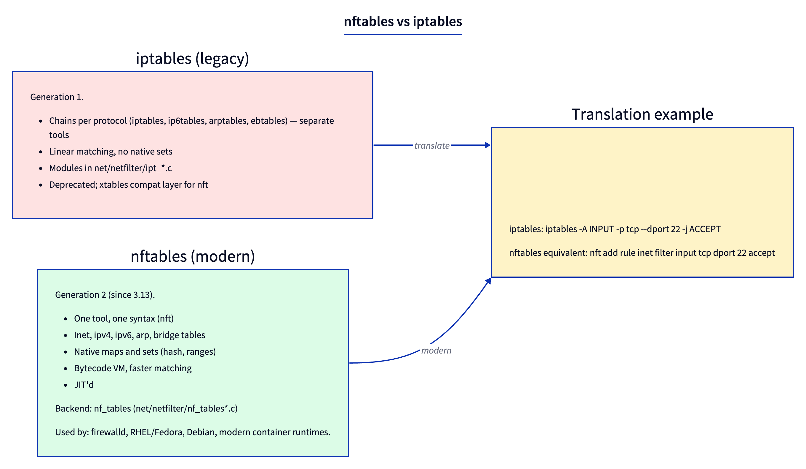

# Day 21 — nftables vs iptables

> **Today's mission:** see why nftables exists, write a real ruleset that does multiple useful things, and understand how the same hooks expose two completely different rule engines. Total time: ~75 minutes.



## Two generations of the same idea

Both iptables and nftables hook into the same Netfilter framework (Day 20). They differ in *how rules are stored, matched, and executed* — which has cascading effects on syntax, performance, and feature surface.

### iptables (legacy, 2001)

- **Per-protocol tools**: `iptables` (IPv4), `ip6tables` (IPv6), `arptables` (ARP), `ebtables` (bridged Ethernet). Four parallel binaries with similar but *not identical* syntax.
- **Linear matching**: rules in a chain are an array of fixed-shape entries (`struct ipt_entry` + match + target). For each packet, the kernel walks the array top-to-bottom evaluating each rule's matches. Match modules (`xt_*`) are kernel modules.
- **Implementation**: `ipt_do_table` (`net/ipv4/netfilter/ip_tables.c:223`). The "fast path" is a manually-unrolled loop over rule entries.
- **Storage**: `xt_table_info` arrays are large pre-allocated buffers; updates require allocating a whole new buffer and atomic swap. Adding one rule rewrites the entire table.

### nftables (modern, since 3.13 / 2014)

- **One tool**: `nft`. Single syntax for inet (IPv4+IPv6 unified), arp, bridge, netdev (per-iface).
- **Bytecode VM**: rules compile to a small instruction set evaluated by `nft_do_chain` (`net/netfilter/nf_tables_core.c:250`). Each rule is a sequence of expressions; each expression is a small `nft_expr` op. The VM is JIT-compiled on x86_64 for hot paths.
- **Native sets and maps**: hash sets, range sets, IP-prefix tries, key→value maps as first-class types. Membership tests are O(1) instead of O(N) linear walks.
- **Atomic updates**: changes are applied transactionally via netlink; no full-table rewrite for one rule add.
- **Implementation**: `nft_do_chain` (`net/netfilter/nf_tables_core.c:250`). Reads the chain's expression list, evaluates each.

### Performance difference

For a simple "drop traffic from these 100 IPs" rule:

- **iptables**: a chain of 100 `-s IP -j DROP` rules. Each packet walks all 100 (until match or end). O(N) per packet.
- **nftables**: one rule using a set: `ip saddr @blocked drop`. Set is a hash table. O(1) per packet regardless of size.

For 100 IPs the difference is noticeable; for 100k IPs (e.g., a denylist), iptables is unusable, nftables is fine.

## Basic nft ruleset

```bash
# Create an inet table (covers both IPv4 and IPv6)
sudo nft add table inet filter

# Add chains for the standard hook positions, with default policies
sudo nft 'add chain inet filter input   { type filter hook input   priority 0 ; policy drop ; }'
sudo nft 'add chain inet filter forward { type filter hook forward priority 0 ; policy drop ; }'
sudo nft 'add chain inet filter output  { type filter hook output  priority 0 ; policy accept ; }'

# Allow established + related (conntrack-aware) — saves us from listing every reverse flow
sudo nft add rule inet filter input ct state established,related accept

# Allow loopback
sudo nft add rule inet filter input iif lo accept

# Allow ICMP (so ping works)
sudo nft add rule inet filter input meta l4proto { icmp, icmpv6 } accept

# Allow specific TCP ports
sudo nft add rule inet filter input tcp dport { 22, 80, 443 } accept

# Drop the rest (covered by chain policy 'drop')

# Inspect
sudo nft list ruleset
```

The `inet` family is special — same chain matches both v4 and v6 traffic, so you don't write rules twice.

## Sets and maps

Native data structures, not afterthoughts.

### Anonymous set inline

```bash
sudo nft add rule inet filter input ip saddr { 10.0.0.1, 10.0.0.2, 10.0.0.3 } accept
```

The `{...}` creates an anonymous hash set, used by this rule only.

### Named set (mutable from CLI)

```bash
sudo nft add set inet filter blocked { type ipv4_addr \; }
sudo nft add element inet filter blocked { 1.2.3.4 }
sudo nft add element inet filter blocked { 5.6.7.0/24 }    # range elements (with 'flags interval')

sudo nft add rule inet filter input ip saddr @blocked drop
```

The set persists, can be added to/removed from at runtime, and the rule references it by name.

### Map (key → value)

```bash
sudo nft add map inet filter port_to_action { type inet_service : verdict \; }
sudo nft add element inet filter port_to_action { 22 : accept, 80 : accept, 443 : accept, 25 : drop }

sudo nft add rule inet filter input tcp dport vmap @port_to_action
```

`vmap` (verdict map) translates the matched value into a verdict via lookup. Replaces a chain of `if dport == X jump Y else...`.

### Interval sets (ranges)

```bash
sudo nft add set inet filter trusted_nets { type ipv4_addr \; flags interval \; }
sudo nft add element inet filter trusted_nets { 10.0.0.0/8, 192.168.0.0/16, 172.16.0.0/12 }
```

Backed by an interval/range tree, not a hash. Lookup is O(log N) but supports CIDR.

## Counters and quotas

```bash
sudo nft add rule inet filter input tcp dport 22 counter accept
# show stats
sudo nft list table inet filter
```

`counter` accumulates packets/bytes. Built-in; no separate "counter table" required.

## How nft_do_chain works (briefly)

`nft_do_chain` (`net/netfilter/nf_tables_core.c:250`) is the runtime entry. Pseudocode of its core loop:

```c
list_for_each_entry(rule, &chain->rules, list) {
    for_each_expr_in(rule) {
        expr->ops->eval(expr, regs, pkt);
        if (regs->verdict.code != NFT_CONTINUE) {
            /* matched a verdict expression — return it */
            switch (regs->verdict.code) { ... }
        }
    }
}
```

Each expression operates on a register file (`struct nft_regs`) — like a tiny VM with 16 32-bit registers. Expressions:
- **`nft_payload`** (load packet bytes into reg)
- **`nft_meta`** (load skb metadata)
- **`nft_cmp`** (compare reg against constant)
- **`nft_lookup`** (set membership test)
- **`nft_immediate`** (set a verdict)
- **`nft_counter`** (bump packet/byte count)
- ~50 more expression types

When you write `tcp dport 22 accept`, nft compiles it into:
1. `nft_payload load tcp dport into r0`
2. `nft_cmp r0 == 22`
3. `nft_immediate verdict = ACCEPT`

Read `net/netfilter/nf_tables_core.c:250` for the actual loop.

## iptables compatibility

Modern systems ship `iptables-nft` — a compatibility shim that translates legacy iptables commands into nftables rules under the hood. The legacy `iptables-legacy` (which uses the `xt_tables` backend) still exists but is deprecated.

```bash
update-alternatives --display iptables    # shows which backend you have
```

If `iptables-nft` is the active alternative, your `iptables` commands populate nftables tables (visible via `nft list tables`). If `iptables-legacy`, they go to the old `ip_tables` backend.

## Today's experiment

```bash
# Inspect what's running
sudo nft list tables
sudo nft list ruleset

# Build a small ruleset
sudo nft add table inet test
sudo nft 'add chain inet test myinput { type filter hook input priority 0 ; }'
sudo nft add rule inet test myinput tcp dport 12345 drop counter
sudo nft add rule inet test myinput meta nftrace set 1

# In another terminal, monitor
sudo nft monitor trace &

# Test
nc localhost 12345     # blocked
nc localhost 22        # allowed (different port)

# See counters
sudo nft list table inet test

# Clean up
sudo nft delete table inet test
```

`nftrace` causes packets matching the rule to be logged via `nft monitor trace`. The output shows each rule that matched and the verdict.

### See iptables-nft conversion

```bash
# If iptables is the nft compat shim:
sudo iptables -A INPUT -p tcp --dport 12346 -j DROP
sudo nft list ruleset    # see the rule appear in an nft table named 'ip filter'

sudo iptables -F        # clean up
```

## What to read in the kernel

- **`net/netfilter/nf_tables_core.c:250`** — `nft_do_chain`. The runtime VM. Read end to end (~100 lines). Notice the `nft_regs` structure — each chain run gets a fresh 16-register file. The expression eval pattern (`expr->ops->eval(expr, regs, pkt)`) is how each kind of expression contributes.

- **`net/netfilter/nf_tables_api.c`** — netlink interface for adding/removing rules. ~10000 lines. Don't read straight; key entries: `nf_tables_newrule`, `nf_tables_delrule`, `nf_tables_dump_chain`. This is where transactional updates are processed.

- **`net/netfilter/nft_*.c`** — individual expression implementations. Pick a few short ones to read:
  - `nft_immediate.c` — sets a register value or a verdict.
  - `nft_payload.c` — loads packet bytes into a register.
  - `nft_cmp.c` — compares a register against a constant.
  - `nft_lookup.c` — set membership test.
  - `nft_meta.c` — loads skb metadata.

  Each is short (~100–300 lines) and self-contained; reading 2-3 teaches you the expression model.

- **`include/uapi/linux/netfilter/nf_tables.h`** — UAPI definitions. `enum nft_verdicts`, expression IDs, etc.

- **`net/ipv4/netfilter/ip_tables.c:223`** — `ipt_do_table`. The legacy iptables runtime. Compare against `nft_do_chain`. Notice it has its own micro-loop with `xt_match` and `xt_target` plugging in. ~250 lines for the hot path.

- **`man nft`** — comprehensive but dense. Use the **nftables wiki** (https://wiki.nftables.org) for examples.

- **`Documentation/networking/`** doesn't have a dedicated nftables doc; the wiki is canonical.

## Bullet Points

- **nftables = modern** (since 3.13); **iptables = legacy** (still works via `iptables-nft` shim).
- Single tool `nft`; one syntax for v4, v6, ARP, bridge, netdev.
- **Bytecode VM** (`nft_do_chain`) replaces the linear rule walk of `ipt_do_table`. JIT'd on x86_64.
- **Native sets and maps** make denylists / port maps O(1) instead of O(N).
- **Atomic transactional updates** — adding one rule doesn't rewrite the whole table.
- The same Netfilter hooks (Day 20); different rule engines.
- `nft list ruleset` to inspect; `nft monitor trace` to debug rule evaluation.

## Check question

You write `nft add rule inet filter input tcp dport 22 accept` and `iptables -A INPUT -p tcp --dport 22 -j ACCEPT` on the same system. Do they conflict? Do they behave the same?

<details>
<summary>Click to reveal answer</summary>

**Answer:** Depends on which `iptables` is installed. If it's `iptables-nft` (the compatibility shim, default on modern distros), both commands ultimately add rules to nftables tables — but to *different* tables (`iptables-nft` uses its own table named `filter` in family `ip`; your `nft` command added to `inet filter`). They coexist and both fire — the same packet is evaluated by both rule sets at the LOCAL_IN hook. Whichever has the lower priority (or comes first if same priority) runs first. If both ACCEPT, the packet proceeds; if either DROPs, the packet dies.

If `iptables` is the legacy binary (`iptables-legacy`), it uses the entirely separate `ip_tables` backend (`ipt_do_table`). Both fire at the same LOCAL_IN hook with priority 0 (filter); both are evaluated. Functionally still coexisting.

To **avoid surprises**: pick one. Don't have both your firewall config and your nftables ruleset loaded — debugging "why isn't my rule working?" gets very hard when you forgot the other one is also running.

</details>

---

## Tomorrow

Day 22: conntrack — the stateful firewall machinery that lets `ct state established,related accept` work.
