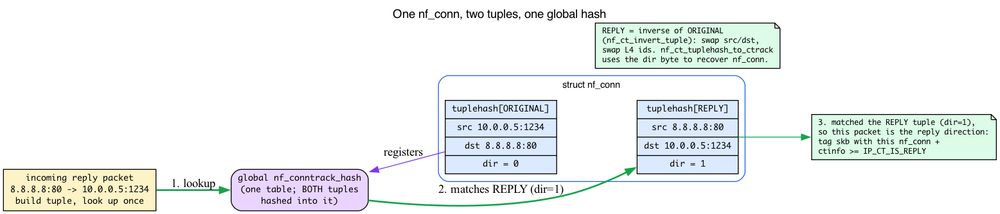
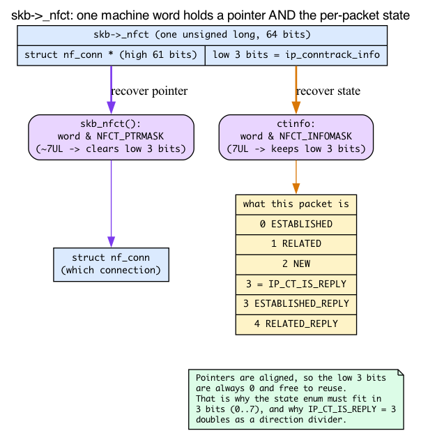
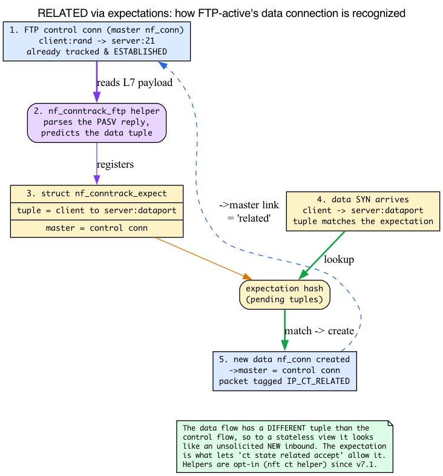
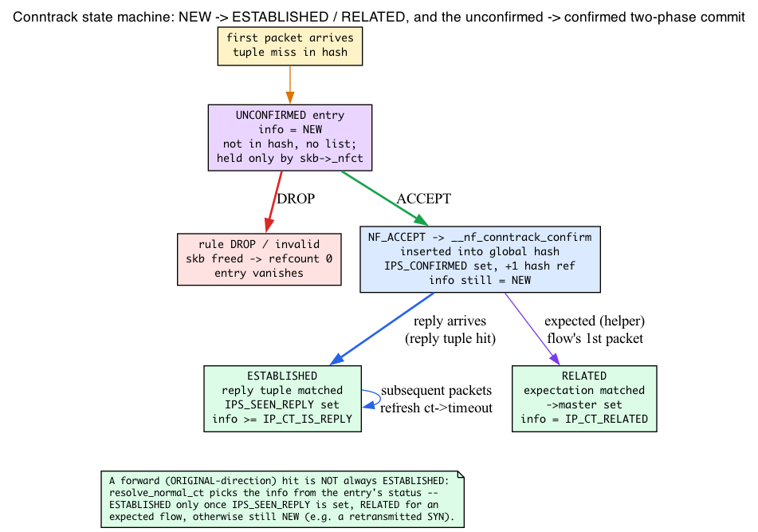
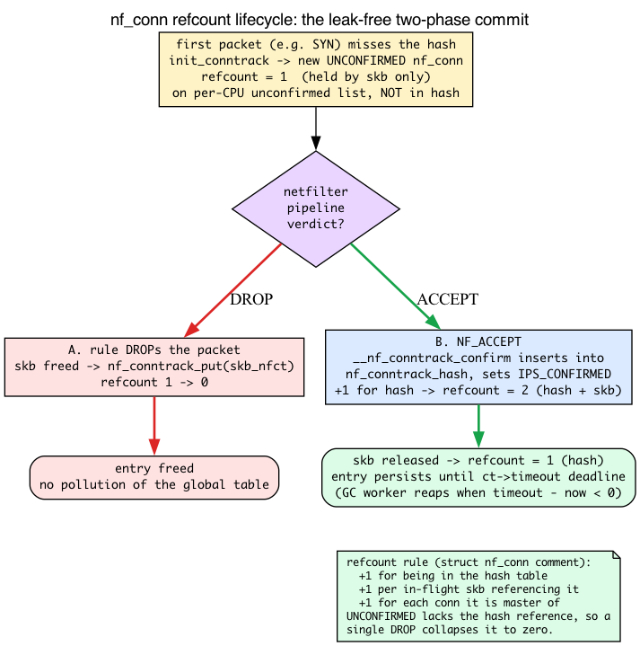
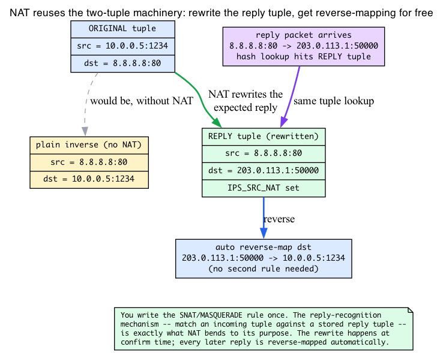

# Day 22 — Conntrack: stateful firewalls

> **Today's mission:** see how the kernel tracks per-connection state, why "established,related accept" is the most-used firewall rule in the world, and how NAT is built on top of conntrack. Total time: ~110 minutes.

## What conntrack does

Along the way we'll open up the four pieces of machinery the whole subsystem leans on:

1. the **conntrack tuple** and how a reply is recognized,
2. the packed **`skb->_nfct`** word that ties a packet to its connection,
3. the **expectation** mechanism behind RELATED, and
4. the **refcount-plus-timeout** model that makes entry confirmation and aging concrete.

A **stateful firewall** decides whether to allow a packet based not just on the packet itself, but on **which connection it belongs to**. "Allow inbound responses to outbound connections, drop unsolicited inbound" is the canonical use case — it requires the kernel to *remember* outgoing connections so it can recognize the replies.

The Linux kernel's connection tracker is **conntrack** (`netfilter/nf_conntrack`). For every packet it inspects, conntrack:

1. Computes a **tuple key** from the packet's L3 + L4 headers.
2. Looks up an existing tracked connection (`struct nf_conn`).
3. If found, updates the connection state and tags the skb with an `nf_conn` pointer and an `IP_CT_*` info value.
4. If not found, creates a NEW entry (provisional — confirmed only on ACCEPT).

Subsequent rules can reference state via `ct state established,related,new,invalid` matchers — those are the `ct state` matchers from Day 21. NAT rules use conntrack to remember mappings so reply traffic can be reverse-mapped automatically.


Three ideas show up over and over in this chapter, and they all turn out to be the *same* idea wearing different hats: "looks up an existing tracked connection," "matches the entry by the reverse 5-tuple," and "tag the skb with the connection." Before we walk the state machine, let's build those ideas properly — because once you see the **tuple** and the packed **`_nfct`** word, the rest of conntrack is mostly bookkeeping.

## The conntrack tuple: how a reply is recognized

Recall from Day 13 that the TCP stack stores established sockets in the `ehash`, keyed by the 4-tuple `(saddr, sport, daddr, dport)`. Conntrack has a richer, bidirectional cousin of that key called the **tuple**, and understanding it is the spine of everything below.

A conntrack tuple is **not** the same thing as the TCP 4-tuple. The TCP key identifies one socket in one direction. A conntrack tuple identifies *one direction of one flow for any protocol* — and crucially, conntrack stores **two** of them per connection so it can recognize traffic going *either* way.

Here is the actual struct (`include/net/netfilter/nf_conntrack_tuple.h:37`):

```c
struct nf_conntrack_tuple {
    struct nf_conntrack_man src;       /* source addr + an L4 "id" (port/icmp-id/key) */

    struct {
        union nf_inet_addr u3;         /* destination address (v4 or v6) */
        union {
            __be16 all;
            struct { __be16 port; } tcp;
            struct { __be16 port; } udp;
            struct { u_int8_t type, code; } icmp;   /* <-- not a port! */
            struct { __be16 port; } dccp;
            struct { __be16 port; } sctp;
            struct { __be16 key;  } gre;            /* <-- a GRE key */
        } u;
        u_int8_t protonum;             /* L3 protocol number (TCP=6, UDP=17, ...) */
        u_int8_t dir;                  /* which direction this tuple is */
    } dst;
};
```

Read the union slowly, because it's the whole point. The "L4 id" is **not always a port**. TCP/UDP/DCCP/SCTP use a 16-bit port; **ICMP uses `{type, code}`**; **GRE uses a key**. That is *why a ping is a trackable "connection"* even though ICMP has no ports: the echo's identifier is the tuple's L4 id, so conntrack can pair an echo-request with its echo-reply. The `src` half (`struct nf_conntrack_man`) carries the source address plus the matching source-side id in its own `union nf_conntrack_man_proto`.

### Two tuples per connection, and the reverse is the inverse

Every `nf_conn` stores **two** tuples in an array — this is the `tuplehash[2]` you'll see named in the struct:

```c
struct nf_conntrack_tuple_hash tuplehash[IP_CT_DIR_MAX];   /* [ORIGINAL] and [REPLY] */
```

The direction enum is just three values (`include/uapi/linux/netfilter/nf_conntrack_tuple_common.h:12`):

```c
enum ip_conntrack_dir {
    IP_CT_DIR_ORIGINAL,   /* 0 — the way the connection was opened */
    IP_CT_DIR_REPLY,      /* 1 — the way replies come back */
    IP_CT_DIR_MAX         /* 2 — array size */
};
```

The **reply tuple is the inverse of the original**: swap source and destination addresses, swap the source/destination L4 ids (ports), and for ICMP map the echo-request *type* to the echo-reply *type*. The kernel builds it with `nf_ct_invert_tuple` (`net/netfilter/nf_conntrack_core.c:429`, `EXPORT_SYMBOL_GPL` at `:466`). When a brand-new connection is created, `init_conntrack` (`:1763`) computes the reply tuple by inverting the original:

```c
/* net/netfilter/nf_conntrack_core.c:1780, inside init_conntrack() */
if (!nf_ct_invert_tuple(&repl_tuple, tuple))
    return NULL;
```

Both tuples are hashed into the **same** global table (`nf_conntrack_hash`). When a packet arrives, conntrack computes *its* tuple and looks it up:

- If it matches a stored **ORIGINAL** tuple → this packet is going the **forward** direction.
- If it matches a stored **REPLY** tuple → this packet is a **reply**.

That single mechanism — two tuples, one table — is what lets *one* entry recognize traffic in *both* directions. And it is exactly the same machinery NAT reuses for reverse-mapping replies (we'll get there).

To recover the `nf_conn` from whichever tuple matched, the kernel uses the `dir` byte baked into the tuple:

```c
/* include/net/netfilter/nf_conntrack.h */
static inline struct nf_conn *
nf_ct_tuplehash_to_ctrack(const struct nf_conntrack_tuple_hash *hash)
{
    return container_of(hash, struct nf_conn,
                        tuplehash[hash->tuple.dst.dir]);   /* dir picks the slot */
}
```



### Direction is folded into the state value

Here's the elegant part. The per-packet *state* (NEW/ESTABLISHED/...) and the *direction* (forward/reply) are not stored separately — the direction is folded into the state value itself. The macro that decodes it (`include/uapi/linux/netfilter/nf_conntrack_tuple_common.h:44`):

```c
#define CTINFO2DIR(ctinfo) ((ctinfo) >= IP_CT_IS_REPLY ? IP_CT_DIR_REPLY : IP_CT_DIR_ORIGINAL)
```

Any `ctinfo` value **≥ `IP_CT_IS_REPLY`** means "this is the reply direction." That is the *structural* reason the state enum is ordered the way it is — `IP_CT_IS_REPLY` is the threshold value `3`, and the reply variants are exactly `forward_state + IP_CT_IS_REPLY`. The state value does double duty as a direction flag, which is why it can live in just a few bits. Which brings us to where that value actually lives.

## How an skb carries its conntrack: the packed `skb->_nfct` word

The chapter keeps saying "tag the skb with the connection." Recall from Day 1 that the `sk_buff` carries a pile of metadata pointers alongside the packet bytes. Conntrack adds one more such field — but it pulls a packing trick worth understanding, because that trick is *why* the state enum is only 3 bits wide.

The field is a single `unsigned long` (`include/linux/skbuff.h:933`, documented at `:822` as "*Associated connection, if any (with nfctinfo bits)*"):

```c
unsigned long _nfct;
```

One machine word holds **two things at once**:

- the **high bits** are a `struct nf_conn *` pointer, and
- the **low 3 bits** hold the `ip_conntrack_info` value (the per-packet state).

A pointer to a heap object is always aligned, so its low bits are guaranteed zero and free for reuse. The masks (`include/linux/netfilter/nf_conntrack_common.h:24`):

```c
#define NFCT_INFOMASK   7UL                 /* low 3 bits */
#define NFCT_PTRMASK    ~(NFCT_INFOMASK)    /* everything else = the pointer */
```

Two accessors unpack the word (`include/linux/skbuff.h:4987` and `:5005`):

```c
static inline struct nf_conntrack *skb_nfct(const struct sk_buff *skb)
{
    return (void *)(skb->_nfct & NFCT_PTRMASK);   /* mask off low bits -> the pointer */
}

static inline void skb_set_nfct(struct sk_buff *skb, unsigned long nfct)
{
    skb->slow_gro |= !!nfct;
    skb->_nfct = nfct;                            /* pointer | ctinfo, packed together */
}
```

So a conntrack-tagged skb answers **two** questions with **one** field: *which* connection (the `nf_conn` you get from `skb_nfct()`), and *what this packet is* to that connection (the low bits — NEW / ESTABLISHED / ... possibly +REPLY). The nftables `ct state` matcher from Day 21 reads exactly these low bits.

This packing is the reason `enum ip_conntrack_info` **must** fit in 3 bits (values 0..7), and the reason `IP_CT_IS_REPLY = 3` works as a direction divider: the enum was *designed* to be stuffed into a pointer's spare low bits.



Clearing conntrack off an skb is just the inverse: drop the reference and zero the word. That's `nf_reset_ct` (`include/linux/skbuff.h:5140`):

```c
nf_conntrack_put(skb_nfct(skb));   /* drop our reference to the nf_conn */
skb->_nfct = 0;                    /* pointer AND state cleared in one store */
```

Keep that two-line teardown in mind — it ties directly into the refcount cleanup we cover at the end of the chapter.

## The states

`enum ip_conntrack_info` (`include/uapi/linux/netfilter/nf_conntrack_common.h:7`):

```c
IP_CT_ESTABLISHED        // 0: packet is part of an existing connection
IP_CT_RELATED            // 1: related to an existing connection (e.g., FTP data, ICMP error)
IP_CT_NEW                // 2: first packet of a new connection (the SYN, in TCP)
IP_CT_IS_REPLY           // 3: flag/threshold: >= this means the reply direction
IP_CT_ESTABLISHED_REPLY  // 3: ESTABLISHED in the reply direction (= ESTABLISHED + IS_REPLY)
IP_CT_RELATED_REPLY      // 4: RELATED in the reply direction
// (there is no NEW in the reply direction; IP_CT_NEW_REPLY exists only as a
//  userspace-compatibility alias. In the kernel value 7 is IP_CT_UNTRACKED.)
```

Notice how the reply variants are literally `forward + IP_CT_IS_REPLY` — the very arithmetic `CTINFO2DIR` exploits. There is no `IP_CT_INVALID` enumerator — malformed or out-of-state packets (e.g., a TCP segment that isn't part of any known sequence) simply get no conntrack entry. The INVALID classification that surfaces to userspace is the bitmask `NF_CT_STATE_INVALID_BIT` (bit 0, in the same header), not an `ip_conntrack_info` value.

### How NEW becomes ESTABLISHED

For TCP:

1. Outbound SYN — conntrack creates entry, marks NEW. The reply tuple is computed by inverting the SYN's tuple (`nf_ct_invert_tuple`), so the entry already *knows* what a reply will look like.
2. Inbound SYN-ACK — conntrack matches the **reply** tuple, marks ESTABLISHED (in the reply direction, so the info value is `≥ IP_CT_IS_REPLY`).
3. All subsequent packets in either direction — ESTABLISHED.

For UDP:

1. Outbound packet — NEW.
2. Inbound reply (matching the inverted reply tuple) — ESTABLISHED.
3. Subsequent packets in either direction — ESTABLISHED.

For ICMP echo (ping):

1. Outbound echo request — NEW. The tuple's L4 id is the ICMP `id`, and the reply tuple maps echo-request type → echo-reply type.
2. Echo reply matching that inverted tuple — ESTABLISHED.

This is the payoff of the tuple section: "matches the reverse 5-tuple" is not hand-waving — it's a literal hash lookup of the packet's tuple against the entry's pre-computed, inverted reply tuple.

### What "RELATED" means: conntrack expectations

RELATED is one of the three headline states, but its mechanism is the most-skipped. The machinery behind it is called an **expectation**.

Some protocols negotiate *auxiliary* connections in their control stream. FTP-active opens a *separate* data connection from server to client; SIP negotiates RTP media streams; PPTP sets up a GRE tunnel. The data/media flow has a **completely different tuple** than the control flow, so to a stateless view it would look like an unsolicited NEW inbound connection — and a default-drop firewall would kill it.

A **conntrack helper** solves this. A helper is a per-protocol module that parses the L7 control stream (e.g. the FTP `PORT`/`PASV` command), figures out the tuple of the connection it predicts will *soon* appear, and pre-registers an **expectation** — a `struct nf_conntrack_expect` (`include/net/netfilter/nf_conntrack_expect.h:18`):

```c
struct nf_conntrack_expect {
    struct hlist_node lnode, hnode;
    possible_net_t net;
    struct nf_conntrack_tuple tuple;        /* the tuple we expect to see */
    struct nf_conntrack_tuple_mask mask;
    refcount_t use;
    unsigned int flags;
    /* ... and a link back to the master connection ... */
};
```

When a later packet's tuple matches a pending expectation, conntrack creates the new entry, sets its `->master` pointer to the original (control) connection, and tags the packet **`IP_CT_RELATED`** instead of `IP_CT_NEW`. That `master` link *is* the literal meaning of "related" (`include/net/netfilter/nf_conntrack.h`, in `struct nf_conn` at `:74`):

```c
/* If we were expected by an expectation, this will be it */
struct nf_conn *master;
```

That is why `ct state related accept` is needed for FTP-active, SIP/RTP, and PPTP/GRE: the second flow has a different tuple and would otherwise look like a NEW unsolicited connection.

**ICMP errors are the other RELATED source.** An ICMP Destination-Unreachable or Time-Exceeded message *embeds the original offending packet's headers* in its payload. Conntrack reads those embedded headers, reconstructs the original tuple, finds the connection it belongs to, and marks the error RELATED (`IP_CT_RELATED` is documented in the enum as "*Like NEW, but related to an existing connection, or ICMP error*"). That is exactly why **traceroute and PMTUD survive a default-drop firewall** — the ICMP errors they depend on come back tagged RELATED.

Expectations are also why helpers are now **opt-in** — see the *Conntrack helpers* section below for the security rationale.



## The state machine



For every incoming packet, the conntrack machinery in **`nf_conntrack_in`** (`net/netfilter/nf_conntrack_core.c:2013`):

1. **Build a tuple** from the packet's L3 + L4 headers (`nf_ct_get_tuple`).
2. **Look up the tuple** in the global conntrack hash (`__nf_conntrack_find_get`). The hash is the global `nf_conntrack_hash` (the netns is part of the key, not a separate per-netns table). Both the ORIGINAL and REPLY tuples of every entry live in this one table.
3. **Three outcomes:**
   - **Hit (forward direction)** — the packet's tuple matched a stored ORIGINAL tuple. The info value depends on the entry's `status`: once `IPS_SEEN_REPLY` is set (traffic seen both ways) it's `ESTABLISHED`; an expected (helper-predicted) flow is `RELATED`; otherwise — e.g. a retransmitted SYN before any reply — it's still `NEW`.
   - **Hit (reverse direction)** — the packet's tuple matched a stored REPLY tuple: tag with the entry, set `info = ESTABLISHED + IS_REPLY` (i.e. an info value `≥ IP_CT_IS_REPLY`, so `CTINFO2DIR` reports reply).
   - **Miss** — create a new entry via `init_conntrack` and `__nf_conntrack_alloc`. The reply tuple is computed up front by inverting the original. Mark `info = NEW`. The entry is **unconfirmed** at this point.

The unconfirmed entry is *not* in the global hash yet, and (in modern kernels, including the 7.1 target) it is not parked on any list either — it is held alive **solely by the in-flight skb's reference** (`skb->_nfct`). It's confirmed only when the packet completes the netfilter pipeline with `NF_ACCEPT`; the confirm callback (`__nf_conntrack_confirm`) inserts the entry into the global hash. If the packet is dropped, the unconfirmed entry is freed, so port-scanning probes don't fill the table. (Older kernels kept a per-CPU "unconfirmed" list; commit `8a75a2c17410` removed it — the skb reference is all that holds an unconfirmed entry now.)

This two-phase commit is critical for performance and security:
- Performance: scans of closed ports don't blow up the conntrack table.
- Security: an unconfirmed entry survives only as long as its skb, so a bogus-NEW flood can pin at most one entry per in-flight packet; durable (confirmed) entries are capped by `nf_conntrack_max`.

We'll make "the unconfirmed entry is freed" exact once we have the refcount model, just below.

## The refcount and timeout model

The two-phase commit and the aging behavior both rest on two fields of `nf_conn`: an embedded refcount and a `timeout`. Day 1 introduced the idea of refcounting an skb-adjacent object (recall `skb->users` / `dataref`); `nf_conn` has its own specific counting rule. And Day 7 taught the `jiffies`/`HZ` clock and the `time_after` deadline pattern for neighbour aging — `timeout` is the same idea.

### The refcount rule

`nf_conn` is refcounted through its embedded `ct_general` (a `struct nf_conntrack`). The rule is stated in the struct's own comment (`include/net/netfilter/nf_conntrack.h:74`):

```c
struct nf_conn {
    /* Usage count in here is 1 for hash table, 1 per skb,
     * plus 1 for any connection(s) we are `master' for
     */
    struct nf_conntrack ct_general;

    spinlock_t lock;
    /* jiffies32 when this ct is considered dead */
    u32 timeout;
    /* ... */
    struct nf_conntrack_tuple_hash tuplehash[IP_CT_DIR_MAX];
    unsigned long status;
    /* ... */
    struct nf_conn *master;     /* the expectation link from the RELATED section */
    struct nf_ct_ext *ext;      /* extensions: NAT info, helper data, ... */
};
```

So the count is: **+1 for being in the hash table, +1 per in-flight skb currently referencing it, +1 for each connection it is `master` of.** `nf_ct_put` drops one reference; the entry is freed when the count hits zero.

### Why the two-phase commit is leak-free

Now "the unconfirmed entry is freed on DROP" is exact:

- An **UNCONFIRMED** entry is *not* in the hash, so it lacks the `+1 for hash table` reference. It is held alive **only** by the in-flight skb's reference (`+1 per skb`).
- If a rule **DROPs** the packet, the skb is freed; freeing it runs the `nf_reset_ct`-style teardown (`nf_conntrack_put(skb_nfct(skb))`) we saw earlier, dropping that one reference. The count hits **zero**, and the entry vanishes — no pollution of the global table.
- **CONFIRM** is the moment the entry earns its durable hash reference. `__nf_conntrack_confirm` (`net/netfilter/nf_conntrack_core.c:1207`, `EXPORT_SYMBOL_GPL` at `:1352`, registered as the `.confirm` callback at `:2733`) inserts the entry into `nf_conntrack_hash`. At that instant the entry sets its `IPS_CONFIRMED` status bit (`IPS_CONFIRMED_BIT = 3`, `include/uapi/linux/netfilter/nf_conntrack_common.h`) and takes the `+1 for hash table` reference.



### `timeout` is a deadline, not a duration

`ct->timeout` is **not** "seconds remaining." It is an *absolute future timestamp in jiffies* — the moment the entry is considered dead. When an entry is confirmed, the per-proto timeout is *added to the current time* (`net/netfilter/nf_conntrack_core.c:1304`):

```c
ct->timeout += nfct_time_stamp;   /* relative timeout -> absolute jiffies deadline */
```

"Is this entry dead?" is then the same jiffy comparison Day 7 used for neighbours — compute the remaining time and check its sign (`:657`):

```c
s32 timeout = READ_ONCE(ct->timeout) - nfct_time_stamp;   /* <= 0 means expired */
```

Two mechanisms act on that deadline:

- The **GC worker** periodically scans hash buckets and reaps expired entries. It's a delayed work item (`struct conntrack_gc_work` at `:66`, `gc_worker` at `:1517`), and `nf_ct_gc_expired` (`:719`) is what tears down an entry it finds past its deadline.
- **`early_drop`** evicts an LRU-ish entry when the table is full, so a flood can't wedge the box.

Every accepted packet **refreshes the deadline** by rewriting `ct->timeout` to a new future jiffies value (the per-proto timeout again). That is why an idle flow ages out only after the full proto-specific timeout elapses with *no* traffic — exactly the behavior the force-expire lab demonstrates below. The `IPS_SEEN_REPLY_BIT = 1` status bit (set once traffic is seen both ways) and `IPS_CONFIRMED_BIT = 3` are part of the same `status` bitfield the entry carries.

## Hash table sizing

```bash
sysctl net.netfilter.nf_conntrack_max         # capacity (entries)
sysctl net.netfilter.nf_conntrack_buckets     # hash table size (rounded to power of 2)
```

Rule of thumb: **buckets = max / 4 to max / 8**. Defaults are conservative; busy gateways set both higher (millions of entries on big NAT boxes).

When `nf_conntrack_max` is reached, new connections fail to track, and depending on the policy (`nf_conntrack_tcp_loose`, etc.) may also be dropped. The per-CPU counters including `drop` and `early_drop` (early eviction of LRU when full — the same `early_drop` from the timeout section) are reported by `conntrack -S`. They are *also* exposed in **`/proc/net/stat/nf_conntrack`**, but only when the kernel is built with `CONFIG_NF_CONNTRACK_PROCFS=y` — that procfs view is deprecated and off on many modern kernels (including the 7.1 target), so prefer `conntrack -S`.

## Conntrack helpers

Each L7 protocol with auxiliary connections has a helper module. As we saw in the expectation section, a helper parses the control stream and registers `nf_conntrack_expect` entries so the predicted data flow gets tagged RELATED instead of NEW:

- **`nf_conntrack_ftp`**: parses FTP control commands (PORT, PASV) and creates expectation entries for data connections.
- **`nf_conntrack_sip`**: same for SIP (creates RTP stream expectations).
- **`nf_conntrack_pptp`**: PPTP control + GRE tunnel expectations.
- **`nf_conntrack_irc`**: DCC.
- ...and many more.

Helpers are no longer auto-loaded by default (security: ALG-style helpers were a CVE source — the spoofing risk from the expectation section). You explicitly enable them per-rule in nftables:

```bash
sudo nft add table inet ct_lab
sudo nft 'add chain inet ct_lab prerouting { type filter hook prerouting priority 0 ; }'
sudo nft 'add ct helper inet ct_lab ftp { type "ftp" protocol tcp ; }'
sudo nft 'add rule inet ct_lab prerouting tcp dport 21 ct helper set "ftp"'
# cleanup
sudo nft delete table inet ct_lab
```

That `ct helper set "ftp"` is the explicit opt-in binding: only flows matching this rule get the FTP helper, so an attacker can't trigger expectation creation on arbitrary ports.

## NAT is built on conntrack

When you write `iptables -t nat -A POSTROUTING -s 10.0.0.0/8 -j MASQUERADE`, the actual mechanics reuse the two-tuple machinery directly:

1. Outbound packet hits PRE_ROUTING. Conntrack creates NEW entry with original tuple `{src=10.0.0.5:1234, dst=8.8.8.8:80}`.
2. POST_ROUTING runs. NAT rule matches; kernel picks an available source IP+port from the egress interface (e.g., `203.0.113.1:50000`).
3. Conntrack **stores the NAT mapping** by *rewriting the reply tuple*: instead of the plain inverse, the "expected reply" tuple becomes `{src=8.8.8.8:80, dst=203.0.113.1:50000}`. The `IPS_SRC_NAT` status bit records that this entry needs source-NAT.
4. When the reply arrives at PRE_ROUTING, conntrack finds the entry by that **reply tuple** (same hash lookup as always) and *automatically reverse-maps* the destination back to `10.0.0.5:1234`.

This is why you only write the SNAT rule once. The reply-recognition mechanism you already understand — match an incoming packet's tuple against a stored reply tuple — is precisely what NAT bends to its purpose. The conntrack runs at PRE_ROUTING / LOCAL_OUT priority `NF_IP_PRI_CONNTRACK = -200` (before the NAT and filter hooks from Day 20), which is why the entry exists by the time the NAT rule needs it.



## Today's experiment

> **Required setup:** the userspace `conntrack` tool is *not* part of a default install. Every `conntrack ...` command in this chapter (this experiment and the "Force entries to expire" section below) needs it:
>
> ```bash
> sudo apt-get install -y conntrack        # Debian/Ubuntu
> # Fedora/RHEL:  sudo dnf install -y conntrack-tools
> ```
>
> The force-expire section also uses `nc` (netcat); install it with `sudo apt-get install -y netcat-openbsd` if `which nc` comes up empty.

```bash
# Inspect entries
sudo conntrack -L | head

# Live event monitoring
sudo conntrack -E &

# Generate flows
ping -c 3 8.8.8.8 &
curl -sI https://example.com > /dev/null

# Stats (per-CPU drop / early_drop counters)
sudo conntrack -S
# Same counters via procfs, only if CONFIG_NF_CONNTRACK_PROCFS=y (often off):
[ -r /proc/net/stat/nf_conntrack ] && head -5 /proc/net/stat/nf_conntrack \
  || echo "(no procfs view; needs CONFIG_NF_CONNTRACK_PROCFS=y — use 'conntrack -S')"

# Per-state count — only TCP has a state column ($4 is the state for tcp rows;
# for udp/icmp $4 is 'src=...', which would pollute the histogram), so filter -p tcp:
sudo conntrack -L -p tcp 2>/dev/null | awk '{print $4}' | sort | uniq -c | sort -rn

sudo killall conntrack    # stop the -E monitor
```

In the `conntrack -L` output, each entry prints **both** tuples back to back — you are literally looking at `tuplehash[ORIGINAL]` followed by `tuplehash[REPLY]`. On a NAT box the reply half shows the rewritten address; on a plain host it's the clean inverse.

On a busy host the per-state histogram is dominated by `ESTABLISHED`, with a handful of `SYN_SENT`/`TIME_WAIT`/`CLOSE_WAIT`:

```
     42 ESTABLISHED
      3 TIME_WAIT
      1 SYN_SENT
```

(`udp` and `icmp` flows have no state column — only a timeout — which is exactly why we filter to `-p tcp`.)

Watch the table fill and entries age out. Default UDP timeout is 30s; TCP ESTABLISHED is 5 days (yes, days — long-lived connections shouldn't get garbage-collected). Remember those numbers are the *relative* timeout that gets added to `nfct_time_stamp` to form the absolute `ct->timeout` deadline.

### Trace conntrack in BPF

```bash
sudo bpftrace -e '
fentry:nf_conntrack_in {
  printf("ct_in skb=%p hook=%d pf=%d\n",
         args->skb, args->state->hook, args->state->pf);
}
fentry:__nf_conntrack_confirm {
  printf("confirm skb=%p\n", args->skb);
}'
```

You'll see one `nf_conntrack_in` per packet (ct lookup happens early at PRE_ROUTING and LOCAL_OUT) and one `__nf_conntrack_confirm` per *accepted* packet (at the end of the pipeline). The gap between those two counts is the two-phase commit in action: every packet gets a lookup, but only survivors get confirmed into the hash.

> `nf_conntrack` is a module, so `bpftrace -l "fentry:nf_conntrack_in"` lists nothing unqualified — use the module form `fentry:nf_conntrack:nf_conntrack_in` / `fentry:nf_conntrack:__nf_conntrack_confirm` to list them, or the `kprobe:nf_conntrack_in` / `kprobe:__nf_conntrack_confirm` equivalents. The `-e` run-form above attaches fine either way because bpftrace resolves the module at attach time.

### Force entries to expire

```bash
# Lower TCP ESTABLISHED timeout temporarily (default 432000s / 5 days)
old_timeout=$(cat /proc/sys/net/netfilter/nf_conntrack_tcp_timeout_established)
trap 'sudo sysctl -w net.netfilter.nf_conntrack_tcp_timeout_established=$old_timeout; kill $srv $cli 2>/dev/null || true' EXIT
sudo sysctl -w net.netfilter.nf_conntrack_tcp_timeout_established=60

# Open a connection, leave idle
nc -l 9999 & srv=$!
nc localhost 9999 & cli=$!
sudo conntrack -L | grep 9999     # see the entry

# The entry only ages out after the (lowered) idle timeout, so actually wait:
echo "waiting ~65s for the idle entry to age out..."; sleep 65
sudo conntrack -L | grep 9999     # now gone (no output)
```

What you are watching: with no traffic on the idle connection, nothing refreshes `ct->timeout`, so the GC worker's `READ_ONCE(ct->timeout) - nfct_time_stamp` eventually goes negative and `nf_ct_gc_expired` reaps the entry. Always restore the timeout. It is global state, and lowering it can break legitimate long-lived idle connections on the host.

## What to read in the kernel

- **`net/netfilter/nf_conntrack_core.c:2013`** — `nf_conntrack_in`. The main entry point, registered as a Netfilter hook at PRE_ROUTING and LOCAL_OUT priority `NF_IP_PRI_CONNTRACK = -200`. Read top to bottom (~80 lines for the function plus its helpers). Trace: tuple → lookup → either tag-existing or alloc-new → usually return ACCEPT. Conntrack can still drop invalid or stressed packets; filter rules are just the common place where policy drops happen.

- **`include/net/netfilter/nf_conntrack.h:74`** — `struct nf_conn`. The per-connection record. Read the refcount-rule comment at the very top ("1 for hash table, 1 per skb, plus 1 for any connection we are master for"). Only ~10-14 direct fields (a handful gated on config options like zones, NAT, and marks). Important: `ct_general` (the embedded refcount), `timeout` (absolute jiffies deadline), `tuplehash[2]` (forward and reverse tuples), `status` (bitfield with `IPS_CONFIRMED`, `IPS_SEEN_REPLY`, `IPS_SRC_NAT`/`IPS_DST_NAT`), `master` (the expectation link), and `ext` (a pointer to dynamically-allocated extensions for NAT info, helper data, etc.).

- **`include/net/netfilter/nf_conntrack_tuple.h:37`** — `struct nf_conntrack_tuple`. The tuple key. Note the union over L3 (IPv4 vs IPv6 addresses) and L4 (port pairs vs ICMP `{type,code}` vs GRE key). See also `nf_ct_invert_tuple` (`net/netfilter/nf_conntrack_core.c:429`) for how the reply tuple is built by inversion.

- **`include/uapi/linux/netfilter/nf_conntrack_tuple_common.h:12` / `:44`** — `enum ip_conntrack_dir` and the `CTINFO2DIR` macro. The two-line read that explains why direction is folded into the state value.

- **`include/uapi/linux/netfilter/nf_conntrack_common.h:7`** — `enum ip_conntrack_info`. The states. Quick read; note the reply variants are `forward + IP_CT_IS_REPLY`, and the `IPS_*` status bits below the enum.

- **`include/linux/skbuff.h:933`** — `unsigned long _nfct`, plus `skb_nfct()` (`:4987`) and `skb_set_nfct()` (`:5005`). The pointer+state packing trick; `NFCT_PTRMASK`/`NFCT_INFOMASK` live at `include/linux/netfilter/nf_conntrack_common.h:24`.

- **`include/net/netfilter/nf_conntrack_expect.h:18`** — `struct nf_conntrack_expect`. The expectation record behind RELATED.

- **`net/netfilter/nf_conntrack_proto_tcp.c`** — TCP-specific state tracking. Implements the proper TCP state machine: SYN, SYN-ACK, ACK, FIN, etc., with sequence-number windowing checks. Read the comments at the top — it's a paper.

- **`net/netfilter/nf_conntrack_proto_udp.c`** — UDP-specific (much simpler — just timestamps).

- **`net/netfilter/nf_conntrack_helper.c`** — helper registration. The plumbing for FTP, SIP, etc.

- **`net/netfilter/nf_nat_core.c`** — NAT built on conntrack. Reads conntrack entries, applies translations.

- **`Documentation/networking/nf_conntrack-sysctl.rst`** — every conntrack sysctl explained.

- **External:** `man conntrack` and `conntrack-tools` package — userspace inspection and manipulation.

## There are no Dumb Questions

> **Q: If a ping has no ports, how is it a "connection"?**
>
> A: The conntrack tuple's L4 id is a union, not always a port. For ICMP the id is `{type, code}` plus the echo identifier carried in `src`. The reply tuple maps echo-request type → echo-reply type, so the echo and its reply hash to a matched pair just like a TCP SYN/SYN-ACK do. That's why `conntrack -L` lists `icmp` flows.
>
> **Q: How does one entry recognize traffic in both directions if the hash key is one tuple?**
>
> A: Every `nf_conn` registers *two* tuples into the same global hash — `tuplehash[ORIGINAL]` and `tuplehash[REPLY]`, where the reply is `nf_ct_invert_tuple()` of the original. An incoming packet's tuple is looked up once; whichever stored tuple it matches tells you both the connection (`nf_ct_tuplehash_to_ctrack`) and the direction (the `dst.dir` byte).
>
> **Q: Where does the state (NEW/ESTABLISHED) actually live — in the entry or on the packet?**
>
> A: The *entry* holds long-lived state in its `status` bitfield. The *per-packet* classification lives in the low 3 bits of `skb->_nfct`, packed alongside the `nf_conn` pointer. `skb_nfct()` masks off those bits to get the pointer; the bits themselves are the `ip_conntrack_info` value the `ct state` matcher reads.

## Bullet Points

- **Conntrack** tracks per-connection state in a global hash. The key is a **tuple** (`struct nf_conntrack_tuple`): src+dst addresses, an L4 id that is a **port for TCP/UDP but `{type,code}` for ICMP and a key for GRE**, and a protocol number.
- Every `nf_conn` stores **two** tuples — `tuplehash[ORIGINAL]` and `tuplehash[REPLY]`, the reply being the inverse (`nf_ct_invert_tuple`). Both go in the **same** table; matching the reply tuple is how a response is recognized (and how NAT reverse-maps).
- An skb carries its connection in one packed word, **`skb->_nfct`**: high bits = `nf_conn *`, low 3 bits = `ip_conntrack_info`. That packing is why the state enum fits in 3 bits and why `IP_CT_IS_REPLY = 3` doubles as a direction divider (`CTINFO2DIR`).
- States: **NEW, ESTABLISHED, RELATED**, plus reply-direction variants (`= forward + IP_CT_IS_REPLY`) — and **INVALID** (a matcher classification via `NF_CT_STATE_INVALID_BIT`, not an `ip_conntrack_info` enum value).
- **RELATED** is implemented by **expectations** (`struct nf_conntrack_expect`): a helper parses the control stream, pre-registers the predicted tuple, and the matching flow is born with `->master` set. ICMP errors are RELATED too (they embed the offending packet). Helpers are opt-in via nft `ct helper`.
- Hooked at **PRE_ROUTING** (priority -200) and **LOCAL_OUT** to capture both received and locally-generated traffic.
- **Two-phase commit:** an entry is created **unconfirmed** on the first packet, held alive only by the skb's reference (refcount rule: 1 for hash + 1 per skb + 1 per master). On `NF_ACCEPT`, `__nf_conntrack_confirm` inserts it into the hash and takes the durable reference; on DROP the skb frees, refcount hits zero, the entry vanishes. Bogus packets don't fill the table.
- **`ct->timeout` is an absolute jiffies deadline**, not a duration. Each accepted packet refreshes it; the GC worker reaps entries whose `timeout - now` goes negative; `early_drop` evicts when full.
- **`nf_conntrack_max`** caps total entries; **`nf_conntrack_buckets`** sizes the hash.
- **NAT** is built on conntrack — it rewrites the entry's reply tuple, so reply reverse-mapping happens automatically via the normal tuple lookup.
- Inspect: `conntrack -L`, `conntrack -E` (events), `conntrack -S` (stats).

## Check question

A SYN packet arrives. Conntrack creates a NEW entry. Then a netfilter rule decides DROP. What happens to the conntrack entry?

<details>
<summary>Click to reveal answer</summary>

**Answer:** The unconfirmed entry is **freed**, not added to the global table. Conntrack entries created in PRE_ROUTING (or LOCAL_OUT) are *unconfirmed* — they are not in the hash while the rest of the netfilter pipeline runs, so they lack the "+1 for hash table" reference from the `nf_conn` refcount rule. The entry is held alive by **exactly one** reference: the in-flight skb's. When a rule DROPs the packet, the skb is freed, which drops that reference (`nf_conntrack_put(skb_nfct(skb))` — the same teardown `nf_reset_ct` does); the refcount hits **zero** and the entry is freed. Only when a packet is **ACCEPTED at the end** does `__nf_conntrack_confirm` insert the entry into the global hash and take the durable reference (setting `IPS_CONFIRMED`). This is what prevents a port-scanning attacker from filling your conntrack table with NEW entries that never see a reply: scans of closed ports don't leave permanent state. Bulk teardown of unconfirmed entries is `nf_ct_iterate_destroy`.

</details>

---

## Tomorrow

Day 23: traffic control. The qdisc subsystem that controls packet pacing on egress.
