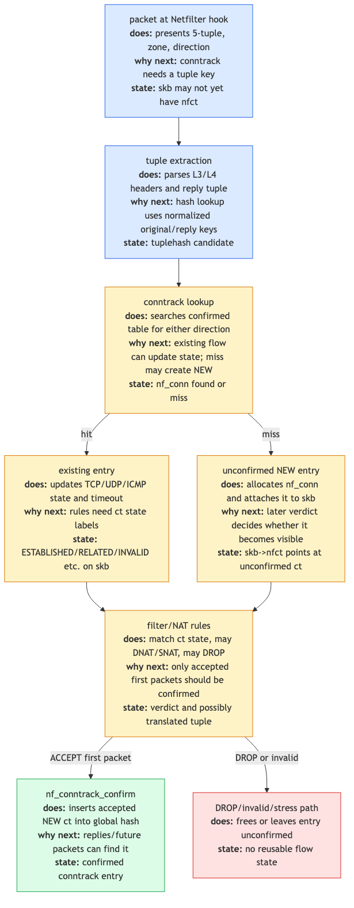

# Day 22 — Conntrack: stateful firewalls

> **Today's mission:** see how the kernel tracks per-connection state, why "established,related accept" is the most-used firewall rule in the world, and how NAT is built on top of conntrack. Total time: ~75 minutes.

## What conntrack does

A **stateful firewall** decides whether to allow a packet based not just on the packet itself, but on **which connection it belongs to**. "Allow inbound responses to outbound connections, drop unsolicited inbound" is the canonical use case — it requires the kernel to *remember* outgoing connections so it can recognize the replies.

The Linux kernel's connection tracker is **conntrack** (`netfilter/nf_conntrack`). For every packet it inspects, conntrack:

1. Computes a **5-tuple key** (proto, src, dst, sport, dport).
2. Looks up an existing tracked connection (`struct nf_conn`).
3. If found, updates the connection state and tags the skb with `nf_ct` pointer and `IP_CT_*` info.
4. If not found, creates a NEW entry (provisional — confirmed only on ACCEPT).

Subsequent rules can reference state via `ct state established,related,new,invalid` matchers. NAT rules use conntrack to remember mappings so reply traffic can be reverse-mapped automatically.



## The states

`enum ip_conntrack_info` (`include/uapi/linux/netfilter/nf_conntrack_common.h:7`):

```c
IP_CT_ESTABLISHED        // packet is part of an existing connection
IP_CT_RELATED            // packet is related to an existing connection (e.g., FTP data, ICMP error)
IP_CT_NEW                // first packet of a new connection (the SYN, in TCP)
IP_CT_IS_REPLY           // flag: this packet is a reply (the response direction)
IP_CT_ESTABLISHED_REPLY  // ESTABLISHED in the reply direction
IP_CT_NEW_REPLY          // unusual: NEW in reply direction (for non-symmetric protocols)
```

Plus an internal **`IP_CT_INVALID`** for malformed or out-of-state packets that the kernel refuses to track (e.g., a TCP segment that isn't part of any known sequence).

### How NEW becomes ESTABLISHED

For TCP:

1. Outbound SYN — conntrack creates entry, marks NEW.
2. Inbound SYN-ACK — conntrack matches the entry (reverse 5-tuple), marks ESTABLISHED (in the reply direction).
3. All subsequent packets in either direction — ESTABLISHED.

For UDP:

1. Outbound packet — NEW.
2. Inbound reply (matching reverse 5-tuple) — ESTABLISHED.
3. Subsequent packets in either direction — ESTABLISHED.

For ICMP echo (ping):

1. Outbound echo request — NEW.
2. Echo reply matching the request's id/seq — ESTABLISHED.

### What "RELATED" means

Some protocols spawn auxiliary connections. FTP-ACTIVE opens a separate data connection from server to client; SIP creates RTP streams. Conntrack helpers (per-protocol modules in `net/netfilter/nf_conntrack_*.c`) recognize these relationships and tag the related connections with `IP_CT_RELATED`.

ICMP errors (Destination Unreachable, Time Exceeded) referencing an existing connection are also marked RELATED — that's why `ct state related accept` should be in your firewall, so traceroute and PMTUD work.

## The state machine


For every incoming packet, the conntrack machinery in **`nf_conntrack_in`** (`net/netfilter/nf_conntrack_core.c:2003`):

1. **Build a tuple** from the packet's L3 + L4 headers (`nf_ct_get_tuple`).
2. **Look up the tuple** in the per-netns hash (`__nf_conntrack_find_get`). The hash is `net->ct.htable`.
3. **Three outcomes:**
   - **Hit (forward direction)**: tag skb with the existing entry, set `info = ESTABLISHED`.
   - **Hit (reverse direction)**: tag with the entry, set `info = ESTABLISHED + IS_REPLY`.
   - **Miss**: create a new entry via `init_conntrack` and `__nf_conntrack_alloc`. Mark `info = NEW`. The entry is **unconfirmed** at this point.

The unconfirmed entry sits in a per-CPU "unconfirmed" list, *not* yet in the global hash. It's confirmed only when the packet completes the netfilter pipeline with `NF_ACCEPT`. The confirm callback (`__nf_conntrack_confirm`) inserts the entry into the global hash. **If the packet is dropped (filter or NAT rule rejects it), the unconfirmed entry is freed** — port-scanning probes don't fill the table.

This two-phase commit is critical for performance and security:
- Performance: scans of closed ports don't blow up the conntrack table.
- Security: a flooded bogus-NEW table-fill DoS is bounded by per-CPU memory.

## Hash table sizing

```bash
sysctl net.netfilter.nf_conntrack_max         # capacity (entries)
sysctl net.netfilter.nf_conntrack_buckets     # hash table size (rounded to power of 2)
```

Rule of thumb: **buckets = max / 4 to max / 8**. Defaults are conservative; busy gateways set both higher (millions of entries on big NAT boxes).

When `nf_conntrack_max` is reached, new connections fail to track, and depending on the policy (`nf_conntrack_tcp_loose`, etc.) may also be dropped. **`/proc/net/stat/nf_conntrack`** shows per-CPU counters including `drop` and `early_drop` (early eviction of LRU when full).

## Conntrack helpers

Each L7 protocol with auxiliary connections has a helper module:

- **`nf_conntrack_ftp`**: parses FTP control commands (PORT, PASV) and creates expectation entries for data connections.
- **`nf_conntrack_sip`**: same for SIP (creates RTP stream expectations).
- **`nf_conntrack_pptp`**: PPTP control + GRE tunnel expectations.
- **`nf_conntrack_irc`**: DCC.
- ...and many more.

Helpers are no longer auto-loaded by default (security: ALG-style helpers were a CVE source). You explicitly enable them per-rule in nftables:

```bash
sudo nft add ct helper inet filter ftp { type "ftp" protocol tcp \; }
sudo nft add rule inet filter prerouting tcp dport 21 ct helper set "ftp"
```

## NAT is built on conntrack

When you write `iptables -t nat -A POSTROUTING -s 10.0.0.0/8 -j MASQUERADE`, the actual mechanics:

1. Outbound packet hits PRE_ROUTING. Conntrack creates NEW entry `{src=10.0.0.5:1234, dst=8.8.8.8:80}`.
2. POST_ROUTING runs. NAT rule matches; kernel picks an available source IP+port from the egress interface (e.g., `203.0.113.1:50000`).
3. Conntrack **stores the NAT mapping** alongside the entry: the "expected reply" tuple is `{src=8.8.8.8:80, dst=203.0.113.1:50000}` instead of the original.
4. When reply arrives at PRE_ROUTING, conntrack finds the entry by the reply tuple and *automatically reverse-maps* the destination back to `10.0.0.5:1234`.

This is why you only write the SNAT rule once. Conntrack remembers the mapping and reverses everything for you.

## Today's experiment

```bash
# Inspect entries
sudo conntrack -L | head

# Live event monitoring
sudo conntrack -E &

# Generate flows
ping -c 3 8.8.8.8 &
curl -sI https://example.com > /dev/null

# Stats
sudo conntrack -S
cat /proc/net/stat/nf_conntrack | head -5

# Per-state count
sudo conntrack -L | awk '{print $1, $4}' | sort | uniq -c | sort -rn

sudo killall conntrack    # stop the -E monitor
```

Watch the table fill and entries age out. Default UDP timeout is 30s; TCP ESTABLISHED is 5 days (yes, days — long-lived connections shouldn't get garbage-collected).

### Trace conntrack in BPF

```bash
sudo bpftrace -e '
fentry:nf_conntrack_in {
  printf("ct_in skb=%p hook=%d pf=%d\n",
         args->skb, args->state->hook, args->state->pf);
}
fentry:__nf_conntrack_confirm {
  printf("confirm skb=%p\n", args->skb);
}'
```

You'll see one `nf_conntrack_in` per packet (ct lookup happens early at PRE_ROUTING and LOCAL_OUT) and one `__nf_conntrack_confirm` per accepted packet (at the end of the pipeline).

### Force entries to expire

```bash
# Lower TCP ESTABLISHED timeout (default 432000s / 5 days)
sudo sysctl -w net.netfilter.nf_conntrack_tcp_timeout_established=60

# Open a connection, leave idle
nc -l 9999 &
nc localhost 9999 &
sudo conntrack -L | grep 9999     # see the entry

# After 60s of idle:
sudo conntrack -L | grep 9999     # gone
```

## What to read in the kernel

- **`net/netfilter/nf_conntrack_core.c:2003`** — `nf_conntrack_in`. The main entry point, registered as a Netfilter hook at PRE_ROUTING and LOCAL_OUT priority `NF_IP_PRI_CONNTRACK = -200`. Read top to bottom (~80 lines for the function plus its helpers). Trace: tuple → lookup → either tag-existing or alloc-new → return ACCEPT (the conntrack hook never drops; that's for filter rules).

- **`include/net/netfilter/nf_conntrack.h:74`** — `struct nf_conn`. The per-connection record. ~80 fields. Important: `tuplehash[2]` (forward and reverse tuples), `status` (bitfield with bits like `IPS_CONFIRMED`, `IPS_NAT`), `timeout` (jiffies until expiry), and `ext` (extensible header for NAT info, helper data, etc.).

- **`include/net/netfilter/nf_conntrack_tuple.h:37`** — `struct nf_conntrack_tuple`. The 5-tuple key. Note the union over L3 (IPv4 vs IPv6 addresses) and L4 (port pairs vs ICMP id/seq).

- **`include/uapi/linux/netfilter/nf_conntrack_common.h:7`** — `enum ip_conntrack_info`. The states. Quick read.

- **`net/netfilter/nf_conntrack_proto_tcp.c`** — TCP-specific state tracking. Implements the proper TCP state machine: SYN, SYN-ACK, ACK, FIN, etc., with sequence-number windowing checks. Read the comments at the top — it's a paper.

- **`net/netfilter/nf_conntrack_proto_udp.c`** — UDP-specific (much simpler — just timestamps).

- **`net/netfilter/nf_conntrack_helper.c`** — helper registration. The plumbing for FTP, SIP, etc.

- **`net/netfilter/nf_nat_core.c`** — NAT built on conntrack. Reads conntrack entries, applies translations.

- **`Documentation/networking/nf_conntrack-sysctl.rst`** — every conntrack sysctl explained.

- **External:** `man conntrack` and `conntrack-tools` package — userspace inspection and manipulation.

## Bullet Points

- **Conntrack** tracks per-connection state in a hash keyed by 5-tuple, per-netns.
- States: **NEW, ESTABLISHED, RELATED, INVALID**, plus reply-direction variants.
- Hooked at **PRE_ROUTING** (priority -200) and **LOCAL_OUT** to capture both received and locally-generated traffic.
- **Two-phase commit:** entry created on first packet, confirmed only on `NF_ACCEPT`. Bogus packets don't fill the table.
- **`nf_conntrack_max`** caps total entries; **`nf_conntrack_buckets`** sizes the hash.
- **Helpers** (FTP, SIP, etc.) recognize protocol-specific auxiliary connections; opt-in via nft `ct helper`.
- **NAT** is built on conntrack — the reverse mapping for replies happens automatically once the entry has the NAT info.
- Inspect: `conntrack -L`, `conntrack -E` (events), `conntrack -S` (stats).

## Check question

A SYN packet arrives. Conntrack creates a NEW entry. Then a netfilter rule decides DROP. What happens to the conntrack entry?

<details>
<summary>Click to reveal answer</summary>

**Answer:** The unconfirmed entry is **freed**, not added to the global table. Conntrack entries created in PRE_ROUTING (or LOCAL_OUT) are *unconfirmed* — they live on a per-CPU "unconfirmed" list while the rest of the netfilter pipeline runs. Only when the packet is **ACCEPTED at the end** does `__nf_conntrack_confirm` insert the entry into the global hash. If any intermediate rule drops the packet, the unconfirmed entry is dropped along with the skb. This is what prevents a port-scanning attacker from filling your conntrack table with NEW entries that never see a reply: scans of closed ports don't leave permanent state. Implementation: see `nf_confirm` and the unconfirmed-list freeing in `nf_ct_destroy_unconfirmed`.

</details>

---

## Tomorrow

Day 23: traffic control. The qdisc subsystem that controls packet pacing on egress.
