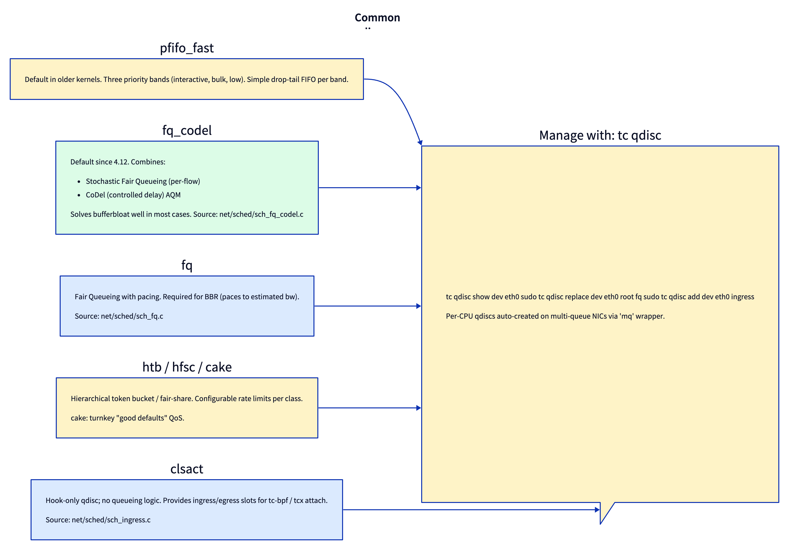

# Day 23 — Traffic control: qdiscs, classes, fq_codel

> **Today's mission:** understand what sits between IP and the driver, why bufferbloat exists, and how to inspect/configure egress queueing. Total time: ~75 minutes.

## What a qdisc is

When IP wants to transmit a packet via `dev_queue_xmit` (Day 3), the packet doesn't go straight to the driver. It goes to the device's **qdisc** — a queueing discipline. The qdisc decides:

- Which packet leaves next (priority, fairness, scheduling).
- When (rate limiting, pacing).
- Whether to drop a packet (full queue, deliberate AQM).
- How to spread packets across multiple flows (per-flow fairness).

Conceptually a qdisc is a function pair:

```c
int  enqueue(struct sk_buff *skb, struct Qdisc *q, struct sk_buff **to_free);
struct sk_buff *dequeue(struct Qdisc *q);
```

Plus management functions (init, destroy, stats, change-config). Per-qdisc-type implementations are in `net/sched/sch_*.c`.



## How qdiscs are driven

Day 3 introduced `__dev_queue_xmit` and `__qdisc_run`. The full picture for egress:

1. **`__dev_queue_xmit`** (`net/core/dev.c`) picks a TX queue, finds the root qdisc, and calls `enqueue`.
2. **`__qdisc_run`** (`net/sched/sch_generic.c:440`) is the "pump" — it dequeues and transmits. While there are packets and the qdisc is unlocked, it loops: `dequeue` → `sch_direct_xmit` (`net/sched/sch_generic.c:344`) → `netdev_start_xmit` (driver).
3. If `__qdisc_run` runs too long, it defers the rest to `NET_TX_SOFTIRQ` to avoid hogging the CPU.

The pump is invoked from two places:
- The xmit path (after a successful enqueue, while still in process context).
- The TX softirq (when the device frees skbs and signals "more room").

## The default: `fq_codel`

Default since 4.12 (and a sensible default for almost all workloads). `net/sched/sch_fq_codel.c`. Combines two ideas:

### SFQ — Stochastic Fair Queueing

Hash each flow's 5-tuple into one of N buckets (default 1024). Each bucket has its own FIFO. Dequeue rotates round-robin between non-empty buckets.

Result: no flow can starve others. A single greedy bulk transfer can't push out everyone else; each gets ~1/N of the bandwidth.

### CoDel — Controlled Delay (RFC 8289)

An **AQM** (Active Queue Management): instead of waiting for the queue to fill before dropping (drop-tail), drop packets earlier — when the *queueing latency* exceeds a target. Default target: 5 ms. If a packet has been queued > 5 ms when it's dequeued, the next packet is dropped (and CoDel enters drop mode).

Why drop early? **Bufferbloat.** Big buffers + drop-tail = packets queue forever, latency for interactive traffic explodes. CoDel's early drops keep latency bounded; TCP responds to drops by reducing cwnd; the buffer drains.

### Combined

`fq_codel` runs SFQ as the per-flow scheduling, with CoDel as the AQM inside each bucket. You get fairness *and* latency control. Inspect:

```bash
tc qdisc show dev eth0
# qdisc fq_codel 0: root refcnt 2 limit 10240p flows 1024 quantum 1518 target 5ms ce_threshold 4ms
```

`limit` = max packets across all flows; `flows` = number of buckets; `quantum` = round-robin credit; `target` = CoDel latency target.

## fq — for BBR pacing

`net/sched/sch_fq.c`. Different from `fq_codel`. Per-flow pacing: each packet has a "send time" computed from the socket's pacing rate (set by BBR via `sk_pacing_rate`). The qdisc holds packets back so they emit at exactly that rate.

**BBR requires `fq` (or hardware pacing).** Without it, BBR's bandwidth estimate is corrupted by burstiness. If you `sysctl tcp_congestion_control=bbr`, also `tc qdisc replace dev <dev> root fq`.

## Hierarchical: HTB (Hierarchical Token Bucket)

`net/sched/sch_htb.c`. Lets you divide bandwidth among classes hierarchically. The classic example: "give SSH 30 Mbps reserved, mail 50 Mbps, everything else 20 Mbps; allow each class to burst into unused capacity."

```bash
sudo tc qdisc add dev eth0 root handle 1: htb default 30
sudo tc class add dev eth0 parent 1: classid 1:1 htb rate 100mbit
sudo tc class add dev eth0 parent 1:1 classid 1:10 htb rate 30mbit ceil 100mbit
sudo tc class add dev eth0 parent 1:1 classid 1:20 htb rate 50mbit ceil 100mbit
sudo tc class add dev eth0 parent 1:1 classid 1:30 htb rate 20mbit ceil 100mbit
sudo tc filter add dev eth0 parent 1: protocol ip prio 1 u32 \
    match ip dport 22 0xffff flowid 1:10
```

`rate` = guaranteed minimum; `ceil` = max if there's spare capacity. Filters classify packets into classes. Powerful but complex; for most users `fq_codel` is simpler and as effective.

## clsact — the BPF hook scaffold

`net/sched/sch_ingress.c`. A special qdisc that has no queueing logic — it just exposes ingress and egress hook points where tc-bpf programs (`SEC("tc")`) can attach. Day 16/17 of the eBPF book covered tc-bpf and the modern tcx replacement.

```bash
sudo tc qdisc add dev eth0 clsact
sudo tc filter add dev eth0 ingress bpf da obj prog.o sec tc
```

Modern code uses **tcx** (`bpf link`-based) instead, which doesn't need `clsact` setup.

## Bufferbloat — the problem fq_codel solves

Without AQM, big buffers hide loss until they overflow. TCP keeps probing for more bandwidth; the buffer fills; latency explodes; only then does TCP see drops and back off. By the time TCP reacts, every packet in the queue has been delayed.

Test it:

```bash
# Default: fq_codel
ping -c 5 8.8.8.8                  # baseline RTT, say 30ms
iperf3 -c some-server -t 60 &      # saturate uplink
ping -c 5 8.8.8.8                  # should stay close to 30ms — fq_codel keeps queue short

# Force pfifo_fast (drop-tail, no AQM)
sudo tc qdisc replace dev eth0 root pfifo_fast
iperf3 -c some-server -t 60 &
ping -c 5 8.8.8.8                  # may shoot up to seconds

# Restore
sudo tc qdisc replace dev eth0 root fq_codel
```

The contrast is stark on home networks with cable modems. Better routers ship `fq_codel` (or its variant `cake`) by default precisely to fix this.

## Today's experiment

```bash
# Inspect current qdiscs
tc qdisc show
tc -s qdisc show dev eth0     # with stats

# Trace qdisc enqueue/dequeue
sudo bpftrace -e '
fentry:__qdisc_run { @ = count(); }
interval:s:5 { print(@); clear(@) }'

# Add a token-bucket rate limit (lab on lo)
sudo tc qdisc replace dev lo root tbf rate 1mbit burst 32kbit latency 50ms

# Test: should be slow
iperf3 -s -p 5201 &
iperf3 -c 127.0.0.1 -p 5201 -t 5
# ~1 Mbit/s

# Watch the qdisc backlog grow
tc -s qdisc show dev lo
# (look for backlog: NNNNb XXp)

# Restore
sudo tc qdisc replace dev lo root fq_codel
```

### Switch CC to BBR; observe with default qdisc vs fq

```bash
sudo modprobe tcp_bbr
sudo sysctl -w net.ipv4.tcp_congestion_control=bbr

# With default fq_codel, BBR's pacing is approximate
# With fq, BBR's pacing is honored:
sudo tc qdisc replace dev lo root fq

iperf3 -c 127.0.0.1 -p 5201 -t 5
ss -tin       # look for 'ca:bbr' and check cwnd

sudo tc qdisc replace dev lo root fq_codel    # restore
```

## What to read in the kernel

- **`net/sched/sch_generic.c:440`** — `__qdisc_run`. The pump. Read end to end (~70 lines). Notice the `qdisc_restart` loop with budget tracking and the deferred-to-softirq path.

- **`net/sched/sch_generic.c:344`** — `sch_direct_xmit`. The "actually push to driver" call. Handles the requeue case when the driver returns BUSY.

- **`net/sched/sch_fq_codel.c:185`** — `fq_codel_enqueue`. Hash the flow, find the bucket, append. Good warm-up: simple SFQ logic.

- **`net/sched/sch_fq_codel.c:282`** — `fq_codel_dequeue`. The interesting one — runs CoDel AQM logic in the dequeue path. Walk through to see how the latency-target check decides drops.

- **`net/sched/sch_fq.c`** — `fq` for BBR. Read the per-flow pacing logic. Notice `q->time_next_packet` per flow tracks "earliest send time" to honor pacing rate.

- **`net/sched/sch_htb.c`** — HTB. Long file (~2000 lines) but the core is clear: classful tree, per-class token buckets, dequeue picks the highest-priority class with tokens.

- **`net/sched/sch_ingress.c`** — clsact. ~150 lines; mostly registration. The actual BPF dispatch is via `tcx` (modern) or via the tc-bpf classifier in `cls_bpf.c`.

- **`include/net/sch_generic.h`** — `struct Qdisc`, `struct Qdisc_ops`. The vtable each qdisc implements.

- **`Documentation/networking/sch_*.rst`** — per-qdisc docs. `sch_fq_codel.txt` is short and clear.

- **External**: bufferbloat.net has the canonical writeup of the problem fq_codel solves.

## Bullet Points

- **qdiscs** sit between IP and driver; control queueing, pacing, dropping on egress.
- Default since 4.12: **`fq_codel`** = SFQ (per-flow fairness) + CoDel (early-drop AQM).
- **`fq`**: per-flow pacing; required for BBR's bandwidth estimate to work.
- **HTB / HFSC**: hierarchical bandwidth division for classful QoS.
- **`clsact`** is a hook scaffold for tc-bpf (no queueing logic).
- The dispatch loop is **`__qdisc_run`** (`net/sched/sch_generic.c:440`), driven from xmit and from `NET_TX_SOFTIRQ`.
- Inspect with `tc -s qdisc show dev DEV`. Modify with `tc qdisc replace dev DEV root <type>`.
- **Bufferbloat** is the problem AQMs (CoDel, FQ_PIE, CAKE) solve.

## Check question

You set `tc qdisc replace dev eth0 root pfifo_fast` and saturate the uplink. SSH becomes unresponsive. Why?

<details>
<summary>Click to reveal answer</summary>

**Answer:** `pfifo_fast` is drop-tail with three priority bands and no AQM. Bulk transfer fills the buffer (say 1000 packets); SSH packets queue *behind* the bulk, waiting for it to drain. With ms-per-packet drain rate at typical uplinks, latency goes from ms to seconds. The buffer hides loss from TCP — TCP keeps pushing more bytes because it sees no drops. Only when the buffer overflows does TCP get a signal, and by then the queue has been steady-state full for a long time.

`fq_codel` solves both halves:
1. **Per-flow fairness (SFQ):** SSH and bulk go in different buckets, dequeued round-robin. Bulk can't starve SSH even if it wants to.
2. **Early drop (CoDel):** when packet latency exceeds 5 ms target, CoDel drops packets early. TCP sees the drops and backs off; the buffer drains.

Restore with `tc qdisc replace dev eth0 root fq_codel`.

</details>

---

## Tomorrow

Day 24: SO_REUSEPORT and socket steering. Multi-process servers without thundering herd.
