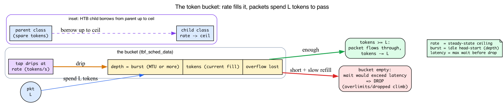
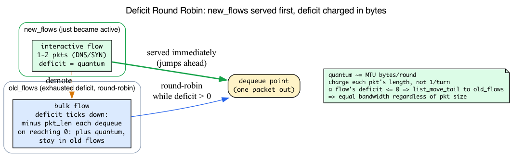
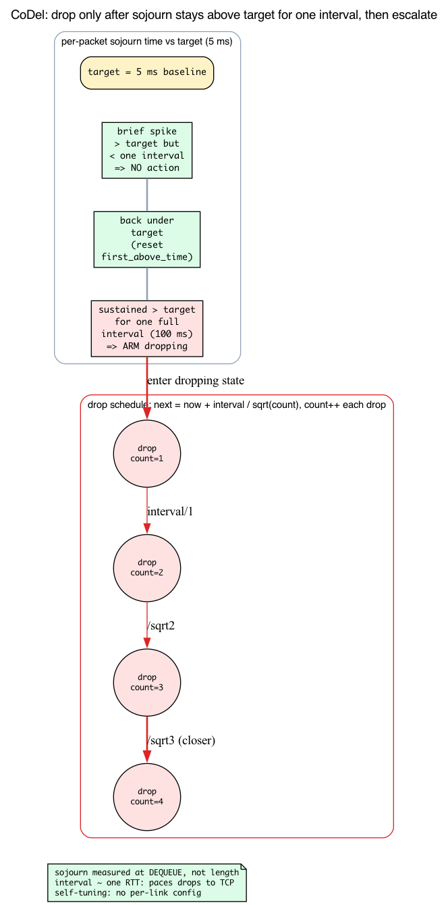
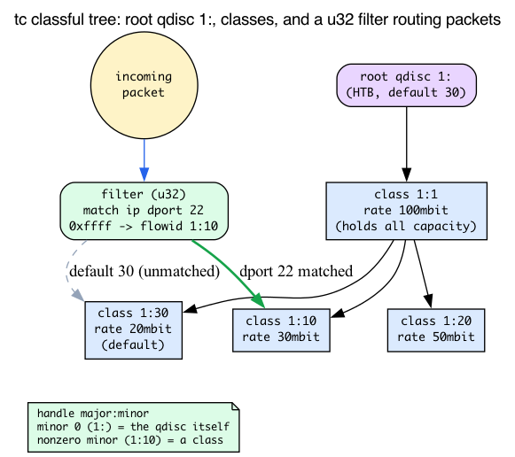

# Day 23 — Traffic control: qdiscs, classes, fq_codel

> **Today's mission:** understand what sits between IP and the driver, why bufferbloat exists, and how to inspect/configure egress queueing. Along the way you'll learn the four algorithms the whole subsystem rests on — the **token bucket** (rate limiting), **deficit round robin** (fair queueing), **CoDel's control law** (latency-bounded dropping), and **tc's classful handle tree** (how `1:10`-style names and filters work) — plus HTB, which is just two token buckets stacked — so every `tc` command in the labs reads like a sentence, not a spell. Total time: ~120 minutes.

## What a qdisc is

When IP wants to transmit a packet via `dev_queue_xmit` (Day 3), the packet doesn't go straight to the driver. It goes to the device's **qdisc** — a queueing discipline. The qdisc decides:

- Which packet leaves next (priority, fairness, scheduling).
- When (rate limiting, pacing).
- Whether to drop a packet (full queue, deliberate AQM — active queue management, see Background 3).
- How to spread packets across multiple flows (per-flow fairness).

Conceptually a qdisc is a function pair:

```c
int  enqueue(struct sk_buff *skb, struct Qdisc *q, struct sk_buff **to_free);
struct sk_buff *dequeue(struct Qdisc *q);
```

Plus management functions (init, destroy, stats, change-config). Per-qdisc-type implementations are in `net/sched/sch_*.c`.


## How qdiscs are driven

Day 3 introduced `__dev_queue_xmit` and `__qdisc_run`. The full picture for egress:

1. **`__dev_queue_xmit`** (`net/core/dev.c`) picks a TX queue, finds the root qdisc, and calls `enqueue`.
2. **`__qdisc_run`** (`net/sched/sch_generic.c:440`) is the "pump" — it dequeues and transmits. While there are packets and the qdisc is unlocked, it loops: `dequeue` → `sch_direct_xmit` (`net/sched/sch_generic.c:344`) → `netdev_start_xmit` (driver).
3. If `__qdisc_run` runs too long, it defers the rest to `NET_TX_SOFTIRQ` to avoid hogging the CPU.

The pump is invoked from two places:
- The xmit path (after a successful enqueue, while still in process context).
- The TX softirq (when the device frees skbs and signals "more room").

That's the recap. Everything below is the *policy* layer: the `dequeue` function gets to be clever, and the cleverness is built from a small handful of algorithms. We'll teach each one before the lab that leans on it.

---

## Background 1: The token bucket — how rate limiting actually works

Most of today's labs revolve around one idea, and the word for it appears in the name of two qdiscs (`tbf` = **t**oken **b**ucket **f**ilter; HTB = **H**ierarchical **T**oken **B**ucket) — yet it's never defined. Let's fix that first, because once you have it, `rate`, `burst`, `ceil`, and "why does it *drop* instead of queue?" all become obvious.

### The intuition: a bucket of permission slips

Imagine a bucket that a tap drips coins into at a **constant rate** — say 1 million coins per second. The bucket has a **maximum depth**: once full, extra coins overflow and are lost. To send a packet of length `L` bytes, you must **spend `L` coins** from the bucket. If the bucket holds at least `L`, the packet goes out immediately and `L` coins are removed. If it doesn't, the packet has to **wait** until enough coins have dripped in.

Those coins are called **tokens**. This gives you three knobs:

- **`rate`** — how fast the tap drips. This is the **long-run steady-state ceiling**: averaged over time, you can't send faster than the tap fills the bucket.
- **`burst`** (a.k.a. `buffer`, the bucket *depth*) — how many *unused* tokens can pile up while you're idle. After a quiet period the bucket is full, so you can send a **short burst faster than `rate`** — exactly as fast as you can drain a full bucket — before settling back to the drip rate.
- **`latency`** — an iproute2-only knob (there is *no* `latency` field in the kernel struct). At configuration time `tc` converts it into a backlog byte limit (roughly `rate * latency + burst`) and hands the kernel that `limit`, which sizes a bounded inner FIFO. A token-short packet is *queued* in that FIFO, not dropped; a tight `latency` just makes the FIFO shallow.

Two consequences fall right out of this picture:

1. **`burst` must be ≥ one MTU.** A bucket too shallow to ever hold a single packet's worth of tokens can *never* send that packet — there's no amount of waiting that fills a bucket past its own depth. The kernel comment says so literally.
2. **A shallow bucket + tight latency drops *sooner* under sustained overload.** A tight `latency` yields a small `limit`, hence a shallow inner FIFO. Token-short packets are backlogged there and drained as tokens accrue; but once that shallow FIFO fills, further arrivals are dropped at enqueue. So a tight `latency` doesn't drop "instead of" queuing — it gives you a *small* queue that overflows quickly. This is *the* behavior you'll observe in today's `tbf` lab.



### The concrete struct: `tbf` in v7.1

Open `net/sched/sch_tbf.c`. The per-qdisc state is exactly the bucket model:

```c
struct tbf_sched_data {
    u32  limit;
    u32  max_size;
    s64  buffer;     /* Token bucket depth/rate: MUST BE >= MTU/B   (sch_tbf.c:102) */
    s64  mtu;
    struct psched_ratecfg rate;
    struct psched_ratecfg peak;
    /* Variables */
    s64  tokens;     /* Current number of B tokens                  (sch_tbf.c:108) */
    s64  ptokens;    /* Current number of P tokens                  (sch_tbf.c:109) */
    s64  t_c;        /* Time check-point */
    ...
};
```

`buffer` is the bucket depth (`burst`), `tokens` is the current fill level. (There's a *second* bucket — `ptokens`/`peak` — used when you configure a `peakrate`, an optional second, faster ceiling. Ignore it for the basic case.)

Now read the dequeue path (`sch_tbf.c:285` onward). It's the bucket model in code:

```c
s64 toks;
s64 ptoks = 0;
...
now  = ktime_get_ns();
toks = min_t(s64, now - q->t_c, q->buffer);   /* drip: add tokens for elapsed time, cap at depth */
toks += q->tokens;
if (toks > q->buffer)
    toks = q->buffer;                          /* overflow: can't exceed bucket depth */
toks -= (s64) psched_l2t_ns(&q->rate, len);    /* spend: this packet costs `len` worth of tokens */

if ((toks|ptoks) >= 0) {                        /* enough tokens? send it. */
    ...
    q->tokens = toks;                           /* commit the spend */
    return skb;
}
qdisc_watchdog_schedule_ns(&q->watchdog, now + max_t(long, -toks, -ptoks));  /* else: wait */
```

Tokens are accounted in **time units** here (nanoseconds of rate), which is just a unit change from "bytes" — `psched_l2t_ns` converts a packet length to "how long the rate takes to earn that many tokens." When `toks` goes negative, the qdisc schedules a watchdog timer for when enough tokens *will* have accrued and returns NULL; the packet stays **backlogged** in the inner FIFO until then. It is dropped only at *enqueue* — when it exceeds `max_size`/`burst` (`sch_tbf.c:253`) or when the inner FIFO is already full (`sch_tbf.c:261`, `qdisc_qstats_drop`). Note `overlimits` (bumped at `sch_tbf.c:331` on every token-short dequeue) counts *deferred* dequeues — rate-limiting events — which is distinct from `dropped`. On a tight `tbf` you see all three of `Sent`/`overlimits`/`dropped` climb: `overlimits` because nearly every dequeue is rate-limited, `dropped` once the shallow FIFO overflows.

---

## The default: `fq_codel`

The de-facto default on most Linux distros (systemd sets `net.core.default_qdisc=fq_codel`; the upstream kernel default is still `pfifo_fast`, `sch_generic.c:37`), and a sensible default for almost all workloads. `net/sched/sch_fq_codel.c`. Combines two ideas — **fair queueing** and **CoDel** — each of which is its own algorithm. Let's teach both before reading the combined qdisc.

### Background 2: Deficit Round Robin — fairness measured in bytes

`fq_codel` hashes each flow's 5-tuple into one of N buckets (default 1024), each with its own FIFO. The hard part is the *scheduler*: when N buckets all have packets waiting, whose packet leaves next? "Round robin — one packet from each, in turn" sounds fair but **isn't**.

#### Why plain round-robin is unfair

Suppose flow A sends 1500-byte packets and flow B sends 60-byte packets, both as fast as they can. Plain round-robin gives each one packet per turn — so over 1000 turns, A sends 1,500,000 bytes and B sends 60,000 bytes. A got **25× the bandwidth** despite "equal turns." Round-robin is only fair if every packet is the same size, which on a real link they never are.

The fix is to schedule in **bytes, not packets**. That algorithm is **Deficit Round Robin (DRR)**.

#### The deficit counter

Each flow carries a credit called its **`deficit`**. The scheduler walks the flows; when it visits a flow it **adds `quantum` bytes** to that flow's deficit, then dequeues packets while `deficit > 0`, **subtracting each packet's length** from the deficit. When the deficit goes ≤ 0, the flow has spent its allowance for this round; it yields its turn and waits to be topped up next time around.

Over many rounds, every backlogged flow gets approximately `quantum` bytes per round — **equal bandwidth, independent of packet size.** The big-packet flow simply gets fewer packets per round to stay within the same byte budget. The default `quantum` is the device MTU, so a flow sends roughly one MTU worth of bytes per round.

#### The new/old split — the latency trick

DRR alone is fair but not *snappy*. `fq_codel` adds a second idea: it keeps **two** flow lists. A flow that *just became active* is appended to **`new_flows`** and served first; a flow that has exhausted its deficit drops down to **`old_flows`** and round-robins there. So a single DNS query, or a TCP SYN, or one HTTP request — a flow with one or two packets — lands in `new_flows` and **jumps ahead** of a long-running bulk transfer parked in `old_flows`. A forced pass back through `old_flows` prevents the bulk flows from ever starving.



#### The concrete struct: `fq_codel` in v7.1

In `net/sched/sch_fq_codel.c`, each flow holds:

```c
struct fq_codel_flow {
    ...
    int  deficit;    /* per-flow credit                     (sch_fq_codel.c:46) */
    ...
};
```

and the qdisc holds:

```c
u32  quantum;        /* psched_mtu(qdisc_dev(sch));          (sch_fq_codel.c:56) */
struct list_head new_flows;  /* list of new flows           (sch_fq_codel.c:66) */
struct list_head old_flows;  /* list of old flows           (sch_fq_codel.c:67) */
```

On activation a flow is credited (`sch_fq_codel.c:213`):

```c
WRITE_ONCE(flow->deficit, q->quantum);
```

and the dequeue loop is the DRR algorithm verbatim (`sch_fq_codel.c:290-319`, `begin:` label through the deficit charge):

```c
begin:
    head = &q->new_flows;          /* serve new flows first */
    if (list_empty(head)) {
        head = &q->old_flows;      /* then old flows */
        ...
    }
    flow = list_first_entry(head, struct fq_codel_flow, flowchain);

    if (flow->deficit <= 0) {                              /* out of credit? */
        WRITE_ONCE(flow->deficit, flow->deficit + q->quantum);  /* top up */
        list_move_tail(&flow->flowchain, &q->old_flows);   /* demote new -> old */
        goto begin;
    }
    skb = codel_dequeue(...);                              /* CoDel runs HERE — see below */
    if (!skb) {
        /* force a pass through old_flows to prevent starvation */
        if ((head == &q->new_flows) && !list_empty(&q->old_flows))
            list_move_tail(&flow->flowchain, &q->old_flows);
        ...
        goto begin;
    }
    WRITE_ONCE(flow->deficit, flow->deficit - qdisc_pkt_len(skb)); /* charge the bytes */
```

`q->quantum` is set to the device MTU at init (`sch_fq_codel.c:481`: `q->quantum = psched_mtu(qdisc_dev(sch));`).

### Background 3: CoDel's control law — latency-bounded dropping

Notice the `codel_dequeue(...)` call buried in that loop. That's the **AQM** — Active Queue Management — running *inside* each flow's bucket. Where DRR decides *which flow* sends, CoDel decides *whether to drop* to keep latency down.

> **Recall bufferbloat from Day 16** (Day 16, Background 5): oversized buffers add standing delay because loss-based TCP only backs off when the buffer *overflows* — so a too-big buffer fills, stays full, and every packet inherits the full queueing delay. CoDel is the answer to that. We won't re-teach bufferbloat; we'll teach the control law that fixes it, which is new.

#### Sojourn time, not queue length

The naive AQM watches *queue length* and drops when it's "too long." CoDel instead measures each packet's **sojourn time** — how long it *actually sat* in the queue — computed at **dequeue** time. Length is a poor proxy (a long queue draining fast is fine); the time a packet waited is the thing you actually care about.

#### The two numbers: `target` and `interval`

CoDel has exactly two parameters, and they're set once for all links (`include/net/codel_impl.h:56-57`):

```c
params->interval = MS2TIME(100);   /* 100 ms */
params->target   = MS2TIME(5);     /*   5 ms */
```

- **`target` (5 ms)** is the standing-queue delay CoDel tries to bound. A *momentary* spike above 5 ms is fine — bursts happen.
- **`interval` (100 ms)** is the patience. CoDel only acts once sojourn time stays above `target` **continuously for one `interval`**. That's the `first_above_time` test (`include/net/codel.h:124` / field `:134`): on the first crossing above target the field is set to a **deadline** = (the moment sojourn first exceeded target) + one `interval` (`codel_impl.h:139`); dropping arms only once `now` passes that deadline (`codel_impl.h:140`). `interval` is roughly one worst-case RTT, giving TCP time to react to each drop before the next.

#### The escalation: drops that get closer together

Once CoDel enters dropping state, it does **not** drop everything. It drops on a **schedule that escalates**. The next drop time is

```c
/* codel_control_law: next drop at t + interval/sqrt(count)   (codel_impl.h:97-102) */
return t + reciprocal_scale(interval, rec_inv_sqrt << REC_INV_SQRT_SHIFT);
```

i.e. `next = t + interval / sqrt(count)`. `count` increments per drop (`codel_impl.h:186`: `WRITE_ONCE(vars->count, vars->count + 1);`). Crucially, for each escalating drop `t` is the *previous* `drop_next` (`codel_impl.h:191-194`, `:210-213`), not the current time — only the very first drop after arming is measured from `now` (`codel_impl.h:253`). Re-basing each drop on the previous scheduled time is what keeps the spacing steady at `interval/sqrt(count)` instead of drifting. So the **more** drops it takes to bring latency back under target, the **faster** the subsequent drops come — a gentle nudge that ramps into firmer pressure. The kernel avoids an actual `sqrt`/divide by maintaining `1/sqrt(count)` with a Newton-step approximation (`codel_Newton_step`, `codel_impl.h:80`, called right after the increment at `:187`).

This `target + interval` pair is why CoDel is **self-tuning** — no per-link configuration. `target` bounds the standing queue; `interval` ≈ one RTT paces the drops to TCP's reaction time. And it **complements DRR**: DRR isolates flows from each other; CoDel keeps each flow's own bucket shallow. `fq_codel` wires the defaults in at `sch_fq_codel.c:484` (`codel_params_init(&q->cparams);`).



### Combined

`fq_codel` runs DRR-based fair queueing (the "FQ") as the per-flow scheduling — with new/old-flow prioritization for latency — and CoDel as the AQM inside each bucket. You get fairness *and* latency control. Inspect:

```bash
tc qdisc show dev eth0
# qdisc fq_codel 0: root refcnt 2 limit 10240p flows 1024 quantum 1514 target 5ms
```

`limit` = max packets across all flows; `flows` = number of buckets; `quantum` = the DRR round-robin credit (≈ MTU); `target` = CoDel's 5 ms latency target.

## fq — for BBR pacing

`net/sched/sch_fq.c`. Different from `fq_codel`. Per-flow pacing: each packet has a "send time" computed from the socket's pacing rate (set by BBR via `sk_pacing_rate`). The qdisc holds packets back so they emit at exactly that rate.

**BBR requires `fq` (or hardware pacing).** Without it, BBR's bandwidth estimate is corrupted by burstiness. If you `sysctl tcp_congestion_control=bbr`, also `tc qdisc replace dev <dev> root fq`. (Pacing and the bufferbloat motivation were taught in Day 16 Background 5 — we lean on them here, not re-teach.)

---

## Background 4: tc's classful tree — handles, classes, and filters

The HTB and clsact labs below hand you a dense thicket of colon-numbered names — `handle 1:`, `classid 1:1`, `parent 1:1 classid 1:10`, `default 30`, `flowid 1:10` — plus a cryptic `u32 match ip dport 22`. None of it is hard once you know the naming scheme. Here it is.

### Handles: `major:minor`

Every qdisc and class on a device is named by a 32-bit **handle**, written `major:minor`. Both halves are 16-bit (`include/uapi/linux/pkt_sched.h:68-72`):

```c
#define TC_H_MAJ_MASK (0xFFFF0000U)
#define TC_H_MIN_MASK (0x0000FFFFU)
#define TC_H_MAJ(h) ((h)&TC_H_MAJ_MASK)
#define TC_H_MIN(h) ((h)&TC_H_MIN_MASK)
#define TC_H_MAKE(maj,min) (((maj)&TC_H_MAJ_MASK)|((min)&TC_H_MIN_MASK))
```

The convention:
- The **major** number identifies the qdisc.
- **Minor 0** (written `1:`) is **the qdisc itself**.
- A **nonzero minor** (`1:10`) is a **class** living inside that qdisc.
- `root` is the special reserved handle `TC_H_ROOT` = `0xFFFFFFFF` (`pkt_sched.h:75`).

### Classless vs classful

A **classless** qdisc (`pfifo_fast`, `fq_codel`, `tbf`) is a single black box: packets in, packets out, no internal structure you can name. A **classful** qdisc (HTB) is a **tree**: the root qdisc holds classes, and each class can hold child classes or a leaf qdisc. The `tc` syntax mirrors the tree:

- `parent 1: classid 1:1` — "create class `1:1` directly under the root qdisc `1:`."
- `parent 1:1 classid 1:10` — "create class `1:10` under parent class `1:1`."
- `default 30` — "any packet that no filter classifies lands in class `1:30`."

### Filters: who decides which class a packet enters?

A class doesn't grab packets by itself — a **filter** (classifier) routes them. `tc filter ... u32 match ip dport 22 0xffff flowid 1:10` reads: "packets whose TCP destination port is 22 → send to class `1:10`." `u32` is a classifier that matches **raw header bytes by offset and mask** — fast and general. The BPF-based classifier is `cls_bpf` / `tcx` (that's what the clsact lab's `bpf da obj prog.o` invokes).



### Background 5: HTB — two token buckets per class, plus borrowing

Now HTB makes sense. `net/sched/sch_htb.c`. It divides bandwidth among classes hierarchically. The classic example: "give SSH 30 Mbps reserved, mail 50 Mbps, everything else 20 Mbps; allow each class to burst into unused capacity."

That "burst into unused capacity" is the whole point, and it's built from the token bucket you already learned — except HTB gives each class **two** buckets (`sch_htb.c:97-98, 120`):

```c
struct psched_ratecfg rate;
struct psched_ratecfg ceil;                          /* sch_htb.c:97 */
s64 buffer, cbuffer;   /* token bucket depth/rate     (sch_htb.c:98) */
...
s64 tokens, ctokens;   /* current number of tokens    (sch_htb.c:120) */
```

- `rate` + `tokens`/`buffer` — the **guaranteed** rate bucket.
- `ceil` + `ctokens`/`cbuffer` — the **ceiling** bucket, the absolute max.

A class is always in one of three **modes** (`sch_htb.c:70-71`, field `cmode` at `:136`):

```c
enum htb_cmode {
    HTB_CANT_SEND,    /* class can't send and can't borrow */
    HTB_MAY_BORROW,
    HTB_CAN_SEND,
};
```

A class first sends from its own `rate` tokens (`HTB_CAN_SEND`). When those run out but the `ceil` bucket still has room, it enters `HTB_MAY_BORROW` and **borrows unused tokens from its parent**, up to `ceil`. That borrow-up-to-`ceil` is exactly the "burst into spare capacity" the example promises — a class with light siblings can climb from its guaranteed `rate` all the way to `ceil`, because the parent has tokens to lend.

```bash
# Use a lab interface, not your real uplink.
sudo ip link add tc-lab type dummy
sudo ip link set tc-lab up
sudo tc qdisc add dev tc-lab root handle 1: htb default 30
sudo tc class add dev tc-lab parent 1: classid 1:1 htb rate 100mbit
sudo tc class add dev tc-lab parent 1:1 classid 1:10 htb rate 30mbit ceil 100mbit
sudo tc class add dev tc-lab parent 1:1 classid 1:20 htb rate 50mbit ceil 100mbit
sudo tc class add dev tc-lab parent 1:1 classid 1:30 htb rate 20mbit ceil 100mbit
sudo tc filter add dev tc-lab parent 1: protocol ip prio 1 u32 \
    match ip dport 22 0xffff flowid 1:10
# cleanup
sudo ip link del tc-lab
```

Reading it with the four backgrounds in hand: `handle 1:` is the root HTB qdisc; `1:1` is a 100mbit parent class holding all the capacity; `1:10`/`1:20`/`1:30` are leaf classes with guaranteed `rate`s that may each borrow up to `ceil 100mbit`; the `u32` filter steers SSH (dport 22) into `1:10`; everything unmatched falls to `default 30` → class `1:30`. `rate` = guaranteed minimum; `ceil` = max if there's spare capacity. Powerful but complex; for most users `fq_codel` is simpler and as effective.

## clsact — the BPF hook scaffold

`net/sched/sch_ingress.c` (~376 lines, mostly registration). A special qdisc that has **no queueing logic** — it reuses the classful filter machinery from Background 4 but does no scheduling. All it does is expose the reserved **ingress and egress hook minors** so tc-bpf classifier programs can attach to **both** directions of a device. Those reserved minors are (`pkt_sched.h:80-81`):

```c
#define TC_H_MIN_INGRESS  0xFFF2U
#define TC_H_MIN_EGRESS   0xFFF3U
```

Day 16/17 of the eBPF book covered classic tc-bpf section names such as `SEC("tc_ingress")` and the modern tcx replacement.

```bash
sudo ip link add tc-lab type dummy
sudo ip link set tc-lab up
sudo tc qdisc add dev tc-lab clsact
sudo tc filter add dev tc-lab ingress bpf da obj prog.o sec tc_ingress
# cleanup
sudo ip link del tc-lab
```

Modern code uses **tcx** (`bpf link`-based) instead, which doesn't need `clsact` setup.

## Bufferbloat — the problem fq_codel solves

The experiment below makes bufferbloat visible: saturate the uplink and watch ping RTT under `fq_codel` versus `pfifo_fast`. The mechanism (loss-based TCP fills an oversized buffer and every packet inherits the standing delay) was taught in Day 16 Background 5; CoDel's control law in Background 3 above is the per-flow cure.

Test it (needs `iperf3`: `sudo apt install -y iperf3`; replace `some-server` with a host you can saturate):

```bash
# Capture the current qdisc so we can put it back exactly.
orig=$(tc qdisc show dev eth0 | head -1); echo "was: $orig"

# Default: fq_codel
ping -c 5 8.8.8.8                  # baseline RTT, say 30ms
iperf3 -c some-server -t 60 &      # saturate uplink
ping -c 5 8.8.8.8                  # should stay close to 30ms — fq_codel keeps queue short
pkill -f 'iperf3 -c'               # stop this saturator BEFORE changing qdiscs (clean contrast)

# Force pfifo_fast (drop-tail, no AQM)
sudo tc qdisc replace dev eth0 root pfifo_fast
iperf3 -c some-server -t 60 &
ping -c 5 8.8.8.8                  # may shoot up to seconds
pkill -f 'iperf3 -c'               # stop the saturator

# Restore the qdisc your interface had before this test (commonly fq_codel).
sudo tc qdisc replace dev eth0 root fq_codel
```

The contrast is stark on home networks with cable modems. Better routers ship `fq_codel` (or its variant `cake`) by default precisely to fix this.

## There are no Dumb Questions

> **Q: If `burst` lets me send faster than `rate`, can I just set a huge `burst` to never be limited?**
>
> A: No — `burst` only buys you a *one-time* head start equal to the bucket depth, accumulated while idle. Once you're sending steadily, the bucket drains as fast as the tap fills it, so your sustained rate is pinned to `rate` regardless of `burst`. A huge `burst` just means a longer initial spike before you settle. (It also costs latency: a deep bucket can hold a deep backlog.)
>
> **Q: DRR gives every flow `quantum` bytes per round. Doesn't a flow sending tiny packets get cheated, since it can't fill a whole quantum?**
>
> A: It carries the leftover forward — that's the *deficit*. A flow that under-spends its quantum this round starts next round with the unspent credit still on the books, so over time it gets its full byte share. The deficit is precisely the memory that makes "bytes per round" fair even when packets don't divide evenly.
>
> **Q: Why does CoDel measure sojourn time at *dequeue* and not when the packet arrives?**
>
> A: Because the thing that hurts is how long the packet *actually waited*, which you only know when it leaves. Measuring at enqueue would tell you the queue's length, not its delay — and a long-but-fast-draining queue has low delay. CoDel deliberately ignores length and acts on realized latency.
>
> **Q: `fq_codel` is fair *and* low-latency. Why would anyone use HTB?**
>
> A: When you need *policy*, not just fairness. `fq_codel` shares bandwidth equally among active flows; it can't express "SSH is guaranteed 30 Mbps even when the bulk transfer wants everything." HTB's classes and `rate`/`ceil` encode that contract. Many setups use both: HTB to carve guarantees, with `fq_codel` as the leaf qdisc inside each class.

## Today's experiment

```bash
# Inspect current qdiscs
tc qdisc show
tc -s qdisc show dev eth0     # with stats

# Count qdisc pump invocations (the dequeue/transmit loop, __qdisc_run).
# __qdisc_run is the DEQUEUE side, not enqueue — enqueue is the qdisc's
# ->enqueue op called from __dev_xmit_skb, which this probe does not count.
# Your own SSH egress keeps it firing, so expect a small non-zero count every
# 5s (~6-40 on an idle box). Generate traffic (ping -f, iperf3) to watch it
# climb. Runs until you press Ctrl-C.
sudo bpftrace -e '
fentry:__qdisc_run { @ = count(); }
interval:s:5 { print(@); clear(@) }'

# Add a token-bucket rate limit (lab on lo). lo's default qdisc is `noqueue`,
# so that is what we restore to.
trap 'sudo tc qdisc replace dev lo root noqueue 2>/dev/null || true; pkill -f "iperf3 -s" 2>/dev/null || true' EXIT
sudo tc qdisc replace dev lo root tbf rate 1mbit burst 32kbit latency 50ms

# Test: should be slow (~1 Mbit/s). Needs iperf3: `sudo apt install -y iperf3`.
iperf3 -s -p 5201 &
sleep 0.5                                   # let the server start listening
iperf3 -c 127.0.0.1 -p 5201 -t 30 &         # run long enough to sample the queue

# While it runs, sample the qdisc. This tbf (1mbit / 32kbit burst / 50ms) is
# tight enough that its shallow inner FIFO overflows under load, so the reliable
# observables are the CUMULATIVE counters, not the instantaneous backlog.
# (Background 1 explains WHY: latency 50ms sizes a small byte `limit`, so the
# inner FIFO is shallow; token-short packets queue there briefly, and once it
# fills, further arrivals are dropped at enqueue. `overlimits` climbs on every
# rate-limited dequeue — a deferral, distinct from a drop.)
tc -s qdisc show dev lo
# qdisc tbf 8001: root refcnt 2 rate 1Mbit burst ... lat 50ms
#  Sent <bytes> bytes <pkt> pkt (dropped <N>, overlimits <N> requeues 0)
#  backlog 0b 0p requeues 0
# `dropped`/`overlimits`/`Sent` all climb as the tbf rate-limits and SURVIVE
# after the transfer ends (`overlimits` counts deferred dequeues, `dropped`
# counts FIFO overflows at enqueue — distinct signals); `backlog` is
# instantaneous and drains back to `0b 0p` once the client stops, so don't
# expect to "watch it grow" on this tight limit.

wait                                        # let the client finish
pkill -f 'iperf3 -s'                        # stop the background server

# Restore loopback's usual noqueue qdisc
sudo tc qdisc replace dev lo root noqueue
```

### Switch CC to BBR and confirm `fq` pacing is active

```bash
old_cc=$(cat /proc/sys/net/ipv4/tcp_congestion_control)
trap 'sudo sysctl -w net.ipv4.tcp_congestion_control=$old_cc; sudo tc qdisc replace dev lo root noqueue 2>/dev/null || true; pkill -f "iperf3 -s" 2>/dev/null || true' EXIT
sudo modprobe tcp_bbr
sudo sysctl -w net.ipv4.tcp_congestion_control=bbr

# BBR needs fq (or hardware pacing) for its sk_pacing_rate to be honored.
sudo tc qdisc replace dev lo root fq

# Self-contained server for this block (needs iperf3: `sudo apt install -y iperf3`).
iperf3 -s -p 5201 &
sleep 0.5
iperf3 -c 127.0.0.1 -p 5201 -t 20 &        # background it so we can sample mid-flight
sleep 2

# Congestion control must be sampled WHILE the transfer is in flight.
# ss prints the cc as a BARE token (`bbr`), NOT `ca:bbr`; cwnd and pacing_rate
# are on the same per-socket info line:
ss -tin dst 127.0.0.1:5201 | grep -E 'bbr|cwnd'
# Example (from a real bbr socket):
#   bbr wscale:6,10 ... cwnd:37 ... bbr:(bw:...,pacing_gain:2.88672,cwnd_gain:2.88672) pacing_rate 21003088bps
wait
pkill -f 'iperf3 -s' 2>/dev/null || true

# NOTE: loopback has no bandwidth bottleneck, so this confirms BBR is *active*
# (the `bbr` token + a live pacing_rate) and that `fq` is installed — but you
# cannot measure an fq-vs-fq_codel pacing *difference* here. For a real contrast
# you need an actual NIC or a veth+netem bottleneck (see Day 16).

sudo sysctl -w net.ipv4.tcp_congestion_control=$old_cc
sudo tc qdisc replace dev lo root noqueue    # restore
```

## What to read in the kernel

- **`net/sched/sch_generic.c:440`** — `__qdisc_run`. The pump. Compact (~17 lines): a `qdisc_restart` loop with budget tracking and the deferred-to-softirq path. Read the helpers it drives (`qdisc_restart`, `sch_direct_xmit`) for the full picture.

- **`net/sched/sch_generic.c:344`** — `sch_direct_xmit`. The "actually push to driver" call. Handles the requeue case when the driver returns BUSY.

- **`net/sched/sch_tbf.c:285`** — the `tbf` dequeue path. The token-bucket model in code: drip (`now - q->t_c`), cap at `q->buffer`, spend `psched_l2t_ns(&q->rate, len)`, send if `toks >= 0` else schedule the watchdog. The bucket depth is `buffer` (`:102`), the fill level `tokens` (`:108`).

- **`net/sched/sch_fq_codel.c:185`** — `fq_codel_enqueue`. Hash the flow, find the bucket, append (and link the flow into `new_flows` if it just became active). Good warm-up before the DRR dequeue logic.

- **`net/sched/sch_fq_codel.c:283`** — `fq_codel_dequeue`. The interesting one — the DRR new/old-flow loop (`:299-318`) with the per-flow `deficit` accounting, wrapped around `codel_dequeue` which runs CoDel's AQM. Walk through to see fairness and latency control in one function.

- **`include/net/codel_impl.h`** — CoDel's control law. `codel_params_init` sets `interval = 100 ms`, `target = 5 ms` (`:56-57`); `codel_control_law` returns `t + interval/sqrt(count)` (`:97-102`); the escalation is `count + 1` at `:186` plus `codel_Newton_step` (`:80`) avoiding the divide.

- **`net/sched/sch_fq.c`** — `fq` for BBR. Read the per-flow pacing logic. Notice `f->time_next_packet` (`sch_fq.c:94`) per flow tracks "earliest send time" to honor the pacing rate; the qdisc-wide field is `q->time_next_delayed_flow`.

- **`net/sched/sch_htb.c`** — HTB. Long file (~2000 lines) but the core is clear: classful tree (`htb_classify` at `:219`, `htb_lookup_leaf` at `:815`), per-class **two** token buckets (`tokens`/`buffer` for `rate`, `ctokens`/`cbuffer` for `ceil`, `:98`/`:120`), three-mode borrowing (`enum htb_cmode` at `:70`), dequeue picks the highest-priority class with tokens.

- **`net/sched/sch_ingress.c`** — clsact. ~376 lines; mostly registration. It exposes the reserved ingress/egress hook minors (`TC_H_MIN_INGRESS`/`TC_H_MIN_EGRESS`, `include/uapi/linux/pkt_sched.h:80-81`). The actual BPF dispatch is via `tcx` (modern) or the tc-bpf classifier in `cls_bpf.c`.

- **`include/uapi/linux/pkt_sched.h:68-75`** — the handle macros (`TC_H_MAJ`/`TC_H_MIN`/`TC_H_MAKE`) and `TC_H_ROOT`. This is the `major:minor` naming scheme behind every `1:10`-style id.

- **`include/net/sch_generic.h`** — `struct Qdisc`, `struct Qdisc_ops`. The vtable each qdisc implements.

- **Source comments** in `net/sched/sch_fq_codel.c` and `include/net/codel*.h` are short and clear; for background see RFC 8289 and bufferbloat.net (the per-qdisc `Documentation/networking/sch_*.txt` files no longer exist in the tree).

- **External**: bufferbloat.net has the canonical writeup of the problem fq_codel solves.

## Bullet Points

- **qdiscs** sit between IP and driver; control queueing, pacing, dropping on egress.
- A **token bucket** refills `tokens` at `rate` up to depth `burst`; a packet spends its length in tokens and waits (backlogged in a bounded inner FIFO) if short. `burst` must be ≥ MTU. The `latency` knob is iproute2-only — `tc` converts it to that FIFO's byte `limit` (≈ `rate*latency + burst`); a packet is dropped at enqueue only when it exceeds `burst`/`max_size` or the FIFO is full. This is `tbf` (`sch_tbf.c:102/108`) and the heart of HTB.
- De-facto distro default (via systemd; upstream kernel default is `pfifo_fast`): **`fq_codel`** = DRR fair queueing + CoDel early-drop AQM.
- **DRR** schedules in *bytes*: each flow gets `quantum` (≈MTU) credit per round and is charged each packet's length, so packet size doesn't skew fairness. The `new_flows`/`old_flows` split lets sparse interactive flows jump ahead (`sch_fq_codel.c:46/66/299`).
- **CoDel** measures per-packet *sojourn time*, drops only once it stays above `target` (5 ms) for one `interval` (100 ms), then escalates drops at `interval/sqrt(count)` (`codel_impl.h:56/97/186`). Self-tuning, no per-link config.
- **`fq`**: per-flow pacing; required for BBR's bandwidth estimate to work.
- **Handles** are `major:minor`: minor 0 = the qdisc, nonzero = a class; `root` = `TC_H_ROOT` (`pkt_sched.h:68-75`). **Classful** qdiscs (HTB) form a tree; **filters** (u32, cls_bpf) classify packets into classes.
- **HTB**: per-class *two* token buckets (`rate` and `ceil`); classes borrow up from `rate` toward `ceil` via `HTB_MAY_BORROW` (`sch_htb.c:70/98/120`). Hierarchical bandwidth division for classful QoS.
- **`clsact`** is a hook scaffold for tc-bpf (no queueing logic); exposes ingress/egress hook minors (`pkt_sched.h:80-81`).
- The dispatch loop is **`__qdisc_run`** (`net/sched/sch_generic.c:440`), driven from xmit and from `NET_TX_SOFTIRQ`.
- Inspect with `tc -s qdisc show dev DEV`. Modify with `tc qdisc replace dev DEV root <type>`.
- **Bufferbloat** is the problem AQMs (CoDel, FQ_PIE, CAKE) solve.

## Check question

You set `tc qdisc replace dev eth0 root pfifo_fast` and saturate the uplink. SSH becomes unresponsive. Why?

<details>
<summary>Click to reveal answer</summary>

**Answer:** `pfifo_fast` is drop-tail with three priority bands and no AQM. Bulk transfer fills the buffer (say 1000 packets); SSH packets queue *behind* the bulk, waiting for it to drain. With ms-per-packet drain rate at typical uplinks, latency goes from ms to seconds. The buffer hides loss from TCP — TCP keeps pushing more bytes because it sees no drops. Only when the buffer overflows does TCP get a signal, and by then the queue has been steady-state full for a long time.

`fq_codel` solves both halves:
1. **Per-flow fairness (DRR):** SSH and bulk hash into different buckets, dequeued by deficit round robin in *bytes* — and SSH, being sparse, sits in `new_flows` and is served first. Bulk can't starve SSH even if it wants to.
2. **Early drop (CoDel):** when a packet's sojourn time stays above the 5 ms target for one 100 ms interval, CoDel drops, escalating at `interval/sqrt(count)`. TCP sees the drops and backs off; the buffer drains.

Restore with `tc qdisc replace dev eth0 root fq_codel`.

</details>

---

## Tomorrow

Day 24: SO_REUSEPORT and socket steering. Multi-process servers without thundering herd.
