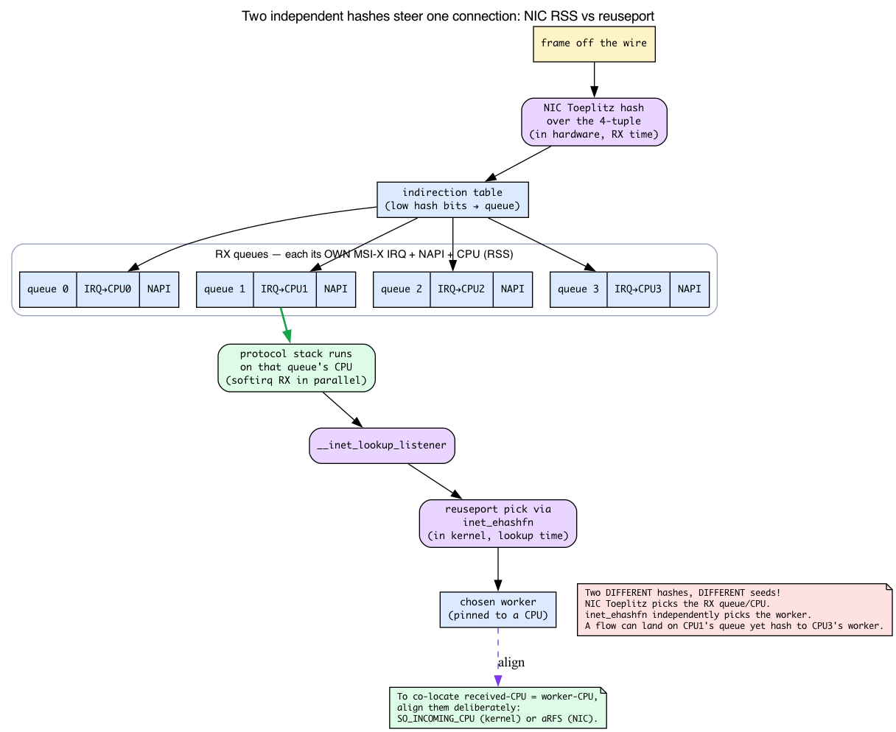
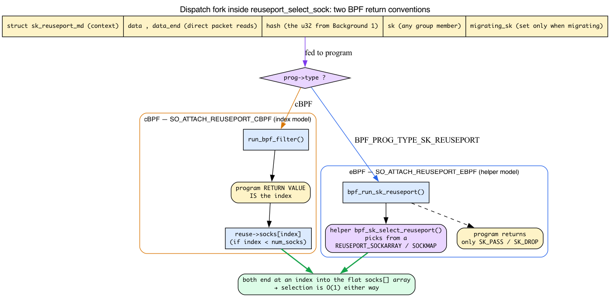
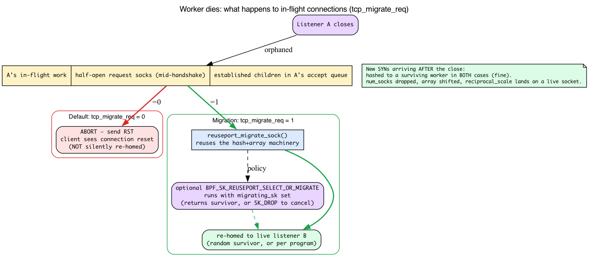

# Day 24 — SO_REUSEPORT and socket steering

> **Today's mission:** see how multiple worker processes can share a single listening port without contention, *exactly* how the kernel decides which worker gets each connection, and how BPF can override that decision for custom load balancing. Along the way we'll teach the four things the steering story actually rests on — the per-flow hash that drives the pick, the NIC hardware that distributes packets across cores, the BPF program model that lets you take over, and what really happens to in-flight connections when a worker dies. Total time: ~110 minutes.


## The single-listener problem

A pre-`SO_REUSEPORT` multi-worker server typically went one of two ways:

1. **Single listening socket, shared via `accept()`.** Workers all call `accept()` on the same FD. A *blocking* `accept()` has been wake-one since ~2.4 (2000): `inet_csk_wait_for_connect` queues waiters with `prepare_to_wait_exclusive` (`net/ipv4/inet_connection_sock.c:622`), whose comment reads "True wake-one mechanism for incoming connections: only one process gets woken up, not the whole herd." So a blocking-`accept()` design does **not** suffer a thundering herd. The herd that survived into the 2010s was different: workers waiting on the shared listening FD via `epoll_wait`/`select`/`poll`. A new connection makes that FD readable and wakes *all* epoll waiters, only one of which then wins `accept()`. `EPOLLEXCLUSIVE` (Linux 4.5, 2016) — a flag on **epoll**, not on `accept()` — fixed that case by waking only one waiter. But either way there's still a single accept queue behind one socket, guarded by one socket lock — the real bottleneck.

2. **One listener process, push connections to workers via fd-passing or socketpair.** Adds a hop (the listener has to accept, then pass), adds complexity (worker management).

Both leave the listener as a bottleneck.

## What `SO_REUSEPORT` does

Linux 3.9 (2013) added the option. `setsockopt(fd, SOL_SOCKET, SO_REUSEPORT, &one, sizeof(one))`. Set on each worker's socket *before* `bind()`, with the same UID and the same `(addr, port)`. The kernel allows N sockets to bind the same `(addr, port)` simultaneously — but only if all of them have `SO_REUSEPORT` set.

```c
int sock = socket(AF_INET, SOCK_STREAM, 0);
int opt = 1;
setsockopt(sock, SOL_SOCKET, SO_REUSEPORT, &opt, sizeof(opt));
struct sockaddr_in addr = { AF_INET, htons(80), INADDR_ANY };
bind(sock, (struct sockaddr*)&addr, sizeof(addr));
listen(sock, 128);
/* Each of N workers does this independently, with their own FD */
```

Each worker now has its own listening socket and its own accept queue. No shared state in the hot path.

### Background 0: the group is a flat array, not a list

All the sockets that bound the same `(addr, port)` with `SO_REUSEPORT` are gathered into one kernel object: **`struct sock_reuseport`** (`include/net/sock_reuseport.h:13`). The important thing about it is its shape — it is a **flat array of socket pointers**, not a linked list:

```c
struct sock_reuseport {
    struct rcu_head     rcu;
    u16                 max_socks;          /* length of socks[] */
    u16                 num_socks;          /* live elements */
    u16                 num_closed_socks;
    u16                 incoming_cpu;
    /* ... */
    struct bpf_prog __rcu *prog;            /* optional BPF sock selector */
    struct sock         *socks[] __counted_by(max_socks);
};
```

Two fields drive everything today. **`socks[]`** is the flat array of the group's listening sockets, and **`num_socks`** (a `u16`, so up to 65535 workers) is how many are live. Because it's an array, "pick a worker" is a single **O(1) index** — `socks[i]` — not a list walk. And the optional `prog` is a single BPF program, held under RCU, that can take over the picking. Keep this array picture in your head: *every* selection mechanism in this chapter ends in "compute an index `i`, return `socks[i]`."

### How the kernel picks one

When a SYN arrives, the kernel does a lookup in **`__inet_lookup_listener`** (`net/ipv4/inet_hashtables.c:467`). It finds the `lhash2` listener bucket (the per-`(addr, port)` hash bucket of listening sockets) for `(addr, port)`. If multiple sockets share that slot via `SO_REUSEPORT`, the lookup funnels through a small wrapper, **`inet_lookup_reuseport`** (`net/ipv4/inet_hashtables.c:392`), which computes a per-flow hash and then calls **`reuseport_select_sock`** (`net/core/sock_reuseport.c:568`) to choose the index.

The one-sentence version everyone repeats is "it hashes the 4-tuple modulo N." That's *almost* right, and almost-right is exactly what trips people up when they try to reason about affinity, reboots, and CPU pinning. So let's make the hash real before we lean on it.

## Background 1: the flow hash that actually drives the pick

The whole "same client → same worker" story rests on one `u32`. The probe in today's lab prints it as `arg1` of `reuseport_select_sock`. Where does that number come from, and what does "modulo N" really mean?

### The hash is the *same* hash that keys the connection table

`reuseport_select_sock` does **not** compute the hash itself — it's handed in. The caller, `inet_lookup_reuseport`, computes it from the SYN's 4-tuple (`net/ipv4/inet_hashtables.c:402`):

```c
if (sk->sk_reuseport) {
    phash = INDIRECT_CALL_2(ehashfn, udp_ehashfn, inet_ehashfn,
                            net, daddr, hnum, saddr, sport);
    reuse_sk = reuseport_select_sock(sk, phash, skb, doff);
}
```

For TCP, `ehashfn` is **`inet_ehashfn`** — the *same family of hash that keys the established-connection table* (the `ehash` you met on Day 13). The reuseport selector isn't inventing a new hash; it's recomputing the connection hash for the incoming SYN's 4-tuple. That's why the affinity is "per flow": the same 4-tuple always produces the same `phash`.

### The hash is seeded by a per-boot random secret

Here's the nuance the "modulo a 4-tuple" framing hides. `inet_ehashfn` is **not** a pure function of the 4-tuple (`net/ipv4/inet_hashtables.c:40`):

```c
u32 inet_ehashfn(const struct net *net, const __be32 laddr,
                 const __u16 lport, const __be32 faddr, const __be16 fport)
{
    return lport + __inet_ehashfn(laddr, 0, faddr, fport,
                                  inet_ehash_secret + net_hash_mix(net));
}
```

It mixes in **`inet_ehash_secret`** — a random value generated *once per boot* — plus `net_hash_mix(net)`, a per-network-namespace salt. The consequence is precise and worth stating loudly:

> **Affinity ("same client → same worker") holds for the life of one boot, in one network namespace.** Across a reboot the secret is regenerated, so the *whole mapping reshuffles* — a client that hit worker 2 yesterday may hit worker 0 today. Two different netns also map the same 4-tuple differently.

Today's AFFINITY lab — connect twice from the same source port and watch the same worker answer — works *because the secret is fixed while the box stays up*, not because the 4-tuple alone determines the worker. That's an important caveat for anyone building "sticky" per-worker caches on top of this.

### "modulo N" is really a multiply-shift

`reuseport_select_sock` reduces the `u32` hash to an array index in `reuseport_select_sock_by_hash` (`net/core/sock_reuseport.c:527`):

```c
i = j = reciprocal_scale(hash, num_socks);
```

and `reciprocal_scale` (`include/linux/math.h:194`) is **not** an arithmetic modulo:

```c
static inline u32 reciprocal_scale(u32 val, u32 ep_ro)
{
    return (u32)(((u64) val * ep_ro) >> 32);
}
```

It multiplies the hash by `num_socks` as a 64-bit product and takes the **top** 32 bits — a "multiply-shift" that maps any `u32` into `[0, num_socks)`. The statistical spread is the same as `hash % N`, which is why the prose can keep saying "fans out evenly," but the *exact index a given hash lands on is different* from what `%` would give. So: say "scaled into `[0, N)`," not "modulo N," whenever you actually try to predict an index. The kernel's own comment on the function admits it's "sort of a modulus, only that the result isn't that of modulo."

![Flow-hash pipeline from 4-tuple through inet_ehashfn and reciprocal_scale to a socks[] index](diagrams/day24_hash_pipeline.png)

### A second steering knob: SO_INCOMING_CPU

The "pure 4-tuple hash" picture has one more wrinkle. Look back at `reuseport_select_sock_by_hash` (`net/core/sock_reuseport.c:539`): after computing the starting index it checks `READ_ONCE(reuse->incoming_cpu)` (the `sk_incoming_cpu == raw_smp_processor_id()` compare is at `:544`). Note this preference is evaluated only in the listener (non-`TCP_ESTABLISHED`) branch of `reuseport_select_sock_by_hash`. If *any* socket in the group set **`SO_INCOMING_CPU`** (`SO_INCOMING_CPU = 49`, `include/uapi/asm-generic/socket.h:80`), the selector *prefers a socket whose `sk_incoming_cpu == raw_smp_processor_id()`* — i.e. it steers the connection to the worker already running on the CPU that processed the packet, overriding the pure-hash pick. The CPU-pinning lab below leans on hash-only distribution; just know that `SO_INCOMING_CPU` exists as an *alternative* steering policy that ties worker choice to the receiving CPU rather than the flow hash. We'll see in Background 2 why that knob is the bridge to hardware RX steering.

## Background 2: NIC RSS — distributing packets across cores in hardware

The closing payoff of today's CPU-pinning lab is "combined with NIC RSS you get end-to-end multi-core scaling." RSS is the *other half* of that claim, and nothing earlier in this book has defined it — Day 1 taught a **single** RX descriptor ring; RSS is what happens when there are many.

### RSS = many RX rings, each with its own IRQ, NAPI, and CPU

Recall from Day 1 the RX descriptor ring: a circular array of descriptors, each naming a DMA buffer the NIC fills, with the driver's NAPI poll (Day 2) draining the done ones. A real multi-queue NIC has **N of those rings** — one per hardware queue. Crucially, each queue has:

- its **own MSI-X interrupt**, so different queues can interrupt different CPUs, and
- its **own NAPI context** (`struct napi_struct` from Day 2), so different CPUs run softirq RX for different queues *in parallel*.

This is **RSS — Receive Side Scaling** (`Documentation/networking/scaling.rst:33`). One CPU is no longer the choke point for receive: the protocol stack for flow A can run on CPU 0 while flow B runs on CPU 3, at the same time.

### How the NIC decides which queue

The NIC hashes each incoming frame — typically a **Toeplitz hash over the 4-tuple** — and uses the low bits of that hash to index an **indirection table**; the table entry names the RX queue (`scaling.rst:42`). That is the *hardware analogue* of the software hash from Background 1: both spread the same flow space, one in silicon at RX time, one in the kernel at listener-lookup time.

### Why RSS and SO_REUSEPORT compose — and why it isn't automatic

The two mechanisms answer different questions:

- **RSS decides which CPU runs the protocol stack** for a packet (which RX queue → which softirq → which core).
- **SO_REUSEPORT decides which listening socket** (hence which accept queue, hence which worker) gets the completed connection.

If worker N is pinned to CPU N *and* RSS happens to land that flow's softirq on CPU N too, then the SYN is processed, the connection is accepted, and the worker reads it **all on the same core** — no cross-core cache bouncing of the socket and its data.

But watch the catch: **this co-location is not automatic.** The NIC's Toeplitz hash and the kernel's `inet_ehashfn` use *different algorithms and different seeds*, so the RSS queue and the reuseport index are **independent** — a flow can easily land on CPU 1's RX queue yet hash to the worker on CPU 3. To actually pin "received on CPU N → accepted by worker on CPU N," you align them deliberately: `SO_INCOMING_CPU` (Background 1) makes reuseport prefer the socket on the receiving CPU, and **aRFS** (accelerated Receive Flow Steering) pushes the NIC to steer a flow to the queue whose CPU owns the socket.

When the NIC *lacks* RSS, the kernel offers software fallbacks that re-distribute received packets across CPUs after the fact: **RPS** (Receive Packet Steering) and **RFS** (Receive Flow Steering) (`scaling.rst:17`). One sentence is enough here — just know the cross-reference exists if your NIC is single-queue.



## BPF-controlled selection

The default hash is sometimes wrong. Examples:
- Sticky sessions by URL hash (need to look at L7).
- Routing by application-defined session ID.
- Forcing connections from a specific source range to a specific worker.

You can attach a BPF program to control selection:

```c
int prog_fd = bpf_program_load(...);
setsockopt(sock, SOL_SOCKET, SO_ATTACH_REUSEPORT_EBPF, &prog_fd, sizeof(prog_fd));
```

`reuseport_attach_prog` (`net/core/sock_reuseport.c:683`) is the kernel-side handler; it stores the program in `struct sock_reuseport->prog` under RCU.

But "the program returns the chosen socket index" — the way this is usually described — is the *old* convention, and conflating it with the modern one makes `test_select_reuseport_kern.c` unreadable. There are genuinely two selection models. Background 3 untangles them.

## Background 3: the SK_REUSEPORT program, its context, and two return conventions

You already know from Day 2 what an eBPF program *is*: verified, kernel-runnable code attached at a hook (Day 2's example was XDP at the driver). Here only two things are new — the **context struct** this hook hands the program, and the fact that there are **two different conventions** for how the program names a winner.

### The program type fixes the context

A *program type* fixes (a) what context struct the program receives and (b) what its result means. For reuseport the type is **`BPF_PROG_TYPE_SK_REUSEPORT`** (`include/uapi/linux/bpf.h:1082`), and the context is **`struct sk_reuseport_md`** (`include/uapi/linux/bpf.h:6620`):

```c
struct sk_reuseport_md {
    void *data;          /* L4 header onward — for direct packet reads */
    void *data_end;      /* one past the directly-readable bytes */
    __u32 len;           /* total length from the L4 header */
    __u32 eth_protocol;
    __u32 ip_protocol;
    __u32 bind_inany;
    __u32 hash;          /* the same 4-tuple flow hash from Background 1 */
    __bpf_md_ptr(struct bpf_sock *, sk);            /* any group member */
    __bpf_md_ptr(struct bpf_sock *, migrating_sk);  /* set only when migrating */
};
```

So the program can read the flow `hash` (the very `u32` from Background 1), peek at protocol fields, learn the local IP/port via `sk`, and — for payload-based routing — read packet bytes directly between `data` and `data_end`. To reach bytes **beyond** `data_end` (e.g. an L7 URL to hash on), it calls the helper **`bpf_skb_load_bytes_relative`**; that helper is the bridge between "metadata only" and "look at the payload."

### Two conventions, one dispatch fork

The conflated part is the *return convention*. The dispatch lives right inside `reuseport_select_sock` (`net/core/sock_reuseport.c:594`):

```c
if (prog->type == BPF_PROG_TYPE_SK_REUSEPORT)
    sk2 = bpf_run_sk_reuseport(reuse, sk, prog, skb, NULL, hash);  /* eBPF: helper model */
else
    sk2 = run_bpf_filter(reuse, socks, prog, skb, hdr_len);        /* cBPF: index model */
```

**(1) Classic cBPF** — attached via `SO_ATTACH_REUSEPORT_CBPF` (`= 51`, `socket.h:85`). The program **returns an integer index**. `run_bpf_filter` (`net/core/sock_reuseport.c:497`) takes that return value and does:

```c
index = bpf_prog_run_save_cb(prog, skb);
if (index >= socks)
    return NULL;
return reuse->socks[index];
```

So "the program returns the chosen socket index" is the **cBPF** story — a direct index into `socks[]`.

**(2) Modern eBPF** — attached via `SO_ATTACH_REUSEPORT_EBPF` (`= 52`, `socket.h:86`). This program does **not** pick by return value. Its return code is just **`SK_PASS`/`SK_DROP`**; the actual selection happens through a helper, **`bpf_sk_select_reuseport(reuse_md, &map, &key, flags)`** (`include/uapi/linux/bpf.h:3750`), which selects a socket out of a `REUSEPORT_SOCKARRAY`/`SOCKMAP` the program looks up by key. That's the model `test_select_reuseport_kern.c` uses.

Both conventions end where Background 0 said they would: at an index into the flat `socks[]` array. The flat array is *why* selection is O(1) regardless of which convention you use.



## Per-worker accept queues — concrete benefits

- **No accept-queue contention.** Each worker drains its own queue.
- **Connection affinity.** Same client → same worker via the flow hash. Cache locality, session stickiness — *within a boot* (Background 1).
- **Easy worker scaling.** Spin up a worker, it joins the group's array; spin one down, it's removed.
- **CPU pinning.** Pin worker N to CPU N; the kernel scales new connections across all workers, and worker N's CPU handles its share — composing with NIC RSS (Background 2).

## Caveats

- **All sockets must set `SO_REUSEPORT` before bind.** Mid-stream changes don't work.
- **UID match required.** All sockets in the group must be owned by the same user. Prevents user A from sniping user B's port.
- **When a worker exits**, `num_socks` drops and the surviving sockets shift in the array — so the `reciprocal_scale(hash, num_socks)` mapping changes. Already-accepted connections are unaffected (they're no longer in the listener lookup). But **in-flight handshakes bound to the dead listener are not silently re-routed by default** — see Background 4; this is the single most commonly mis-stated part of `SO_REUSEPORT`.
- **`SO_REUSEPORT` ≠ `SO_REUSEADDR`.** `REUSEADDR` lets you re-bind a port that's in TIME_WAIT; `REUSEPORT` lets multiple sockets bind simultaneously. The names are similar; the semantics are different.

## Background 4: what really happens to in-flight connections when a worker closes

A SYN doesn't float freely until accept — at SYN time the kernel creates a **request sock** that is bound to **one specific listening socket**. The half-open handshake, and later the established-but-not-yet-accepted child, live *under that listener*. So the natural question is: when that listener closes, what happens to its in-flight request socks and its accept-queue children?

### The default is to abort them

By default (**`net.ipv4.tcp_migrate_req = 0`**, `net/ipv4/sysctl_net_ipv4.c:1048`), the kernel **aborts** them. The documentation is blunt (`Documentation/networking/ip-sysctl.rst:990`): "When a listener is closed, in-flight request sockets during the handshake and established sockets in the accept queue are aborted." The client gets a **reset**. Only brand-new SYNs arriving *after* the close get hashed to a surviving worker.

This is exactly where the old "they re-route automatically, functionally see no difference" answer was wrong. It's true for arrivals **strictly after** the close. It is **not** true for connections already in flight at close time — by default those are RST, not re-homed.

### Migration: tcp_migrate_req = 1 and SELECT_OR_MIGRATE

Setting `tcp_migrate_req = 1` enables **migrating** those orphaned request socks / accept-queue children to another live listener in the same group instead of aborting them. The kernel does this through **`reuseport_migrate_sock`** (`net/core/sock_reuseport.c:620`), which reuses the *same* hash-and-array machinery as ordinary selection — it picks a survivor from `socks[]`.

For *policy control* over which survivor, there's a distinct eBPF expected-attach-type, **`BPF_SK_REUSEPORT_SELECT_OR_MIGRATE`** (`include/uapi/linux/bpf.h:1138`). The same `SK_REUSEPORT` program runs, but now with **`reuse->migrating_sk` set** to the socket that needs a new home (which may be a full established sock *or* a half-open request sock). The program returns the chosen survivor — or `SK_DROP` to cancel migration. Without such a program, with `tcp_migrate_req = 1`, the kernel just **randomly picks an alive listener** (`reuseport_migrate_sock` falls into `select_by_hash`).

So the corrected mental model is:

| Situation | `tcp_migrate_req=0` (default) | `tcp_migrate_req=1` |
|---|---|---|
| SYN arrives **after** close | hashed to a survivor (fine) | hashed to a survivor (fine) |
| In-flight reqsk / accept-queue child of the dead listener | **RST — client sees reset** | migrated to a survivor (random, or per a `SELECT_OR_MIGRATE` program) |
| Connection already `accept()`ed by the dead worker | RST (worker's FD closed) | RST (worker's FD closed) |



## Today's experiment

A trivial reuseport server:

```bash
cat << 'EOF' > /tmp/reuseport_srv.py
import socket, os, sys
s = socket.socket(socket.AF_INET, socket.SOCK_STREAM)
s.setsockopt(socket.SOL_SOCKET, socket.SO_REUSEPORT, 1)
s.bind(("0.0.0.0", 8080))
s.listen(64)
print(f"worker {os.getpid()} listening", flush=True)
while True:
    c, addr = s.accept()
    c.send(f"hello from {os.getpid()}\n".encode())
    c.close()
EOF

# Spawn 3 workers
python3 /tmp/reuseport_srv.py &
python3 /tmp/reuseport_srv.py &
python3 /tmp/reuseport_srv.py &

# Wait until the listener is actually up. Python startup + bind()/listen() is
# racy against the first connect, so without this the first several nc attempts
# hit "Connection refused" before any worker has finished binding.
until nc -z localhost 8080 2>/dev/null; do sleep 0.1; done

# Watch the kernel selector itself fire. arg1 of reuseport_select_sock is the
# per-flow hash from Background 1 — the u32 that reciprocal_scale turns into an
# index: reuseport_select_sock(sk, u32 hash, ...).
sudo bpftrace -e 'kprobe:reuseport_select_sock { printf("reuseport_select_sock hash=%u\n", arg1); }' &
sleep 2

# Hit it 20 times, see different PIDs respond. The </dev/null is required: this
# box ships OpenBSD netcat, whose -q N only quits N seconds after *stdin EOF* —
# in a scripted loop stdin is the terminal and never reaches EOF, so without the
# redirect nc blocks forever even after the worker closes its side.
for i in $(seq 1 20); do echo -n "$i: "; nc -q 1 localhost 8080 </dev/null; done
# Roughly 1/3 of responses from each worker. Each connect uses a fresh ephemeral
# source port, so each is a distinct 4-tuple -> distinct hash -> the picks fan out.

sudo pkill -f bpftrace

# Inspect the bind hash
sudo ss -tlnp | grep :8080
# 3 listeners, all on 0.0.0.0:8080
```

You should see the three workers spread the load, with one kprobe line per connect:

```
worker 12345 listening
worker 12346 listening
worker 12347 listening
Attaching 1 probe...
1: hello from 12345
2: hello from 12347
3: hello from 12346
...
reuseport_select_sock hash=2847561234
reuseport_select_sock hash=901233517
reuseport_select_sock hash=3310928844
...
```

The hash bpftrace prints is `inet_ehashfn` over `(saddr, sport, daddr, dport)` (Background 1) — mixed with the per-boot secret. Since each `nc` here gets a new ephemeral source port, every hash differs and the responding PIDs vary. (The exact hash values and PIDs will differ on your box — and will differ again after a reboot, because the secret is regenerated.)

Verify the kernel-level hash is per-4-tuple — and that an *identical* tuple is deterministic (the "same client → same worker" affinity, true *within this boot*):

```bash
# Re-attach the selector probe so we can read the hash for each connect:
sudo bpftrace -e 'kprobe:reuseport_select_sock { printf("hash=%u\n", arg1); }' &
sleep 2

# (1) SPREAD: same source IP, different source ports -> different 4-tuple ->
#     different hash -> connections fan out across workers.
for p in 50000 50001 50002 50003 50004; do
  echo -n "port $p: "
  nc -q 1 -p $p localhost 8080 </dev/null || true
done
# Different PIDs respond, and bpftrace prints a different hash for each port.

# (2) AFFINITY: a *fixed* 4-tuple yields a FIXED hash, hence the same worker.
nc -q 1 -p 51000 localhost 8080 </dev/null   # note the hash and the responding PID
sleep 61                             # let TIME_WAIT on :51000 drain before reuse
nc -q 1 -p 51000 localhost 8080 </dev/null   # SAME hash, SAME PID -> affinity confirmed

sudo pkill -f bpftrace
```

The five fixed source ports produce five distinct hashes (spread); the two
connects from the *same* `-p 51000` produce the **same** hash and hit the **same**
PID. That determinism is the connection-affinity property — useful for per-worker
caches. (Don't try to show this with plain repeated `nc` without `-p`: the
ephemeral source port changes each time, so the hash changes too.) And remember
Background 1's caveat: the determinism is anchored by the *per-boot* secret, so
this exact hash-to-PID mapping is **not** stable across a reboot.

### Pin workers to CPUs

```bash
# Kill the 3 unpinned workers first — otherwise they stay in the reuseport group
# and absorb part of the hash, muddying the cross-core distribution below.
pkill -f reuseport_srv.py

taskset -c 0 python3 /tmp/reuseport_srv.py &
taskset -c 1 python3 /tmp/reuseport_srv.py &
taskset -c 2 python3 /tmp/reuseport_srv.py &
taskset -c 3 python3 /tmp/reuseport_srv.py &
until nc -z localhost 8080 2>/dev/null; do sleep 0.1; done

# Confirm each worker really is pinned to a distinct CPU:
pgrep -f reuseport_srv.py | while read p; do taskset -cp $p; done

# Drive load and watch the per-CPU spread:
( for i in $(seq 1 2000); do nc -q 0 localhost 8080 </dev/null >/dev/null; done ) &
mpstat -P ALL 1 5
```

Each worker should report a single, distinct CPU in 0-3, and under load the
user/softirq time spreads across those four cores:

```
pid 12345's current affinity list: 0
pid 12346's current affinity list: 1
pid 12347's current affinity list: 2
pid 12348's current affinity list: 3

Linux 7.1.0 (host)   06/12/26   _x86_64_   (4 CPU)

00:24:24     CPU    %usr   %nice    %sys   %soft   %idle
00:24:25       0    3.00    0.00    9.00    4.00   84.00
00:24:25       1    2.97    0.00    8.91    3.96   84.16
00:24:25       2    3.06    0.00    9.18    4.08   83.67
00:24:25       3    2.94    0.00    8.82    3.92   84.31
```

(Exact percentages and PIDs vary; the point is all four cores show activity
rather than one core carrying everything.)

Now incoming connections are scaled across cores 0-3 by the flow hash. Combined with **NIC RSS** (Background 2 — the NIC's own Toeplitz hash RX-distributes flows across queues/cores in hardware) you get end-to-end multi-core scaling without any explicit dispatch logic. Just remember the two hashes are independent (Background 2): for *true* same-core co-location you'd add `SO_INCOMING_CPU` or aRFS.

### Clean up

The workers loop forever (`while True: s.accept()`), so they keep holding
`:8080` until you stop them — leaving them running blocks any re-run of this lab
or any later TCP lab on port 8080.

```bash
sudo pkill -f reuseport_srv.py
rm -f /tmp/reuseport_srv.py
# Confirm the port is free — this should print nothing:
ss -tlnp | grep :8080
```

## There are no Dumb Questions

> **Q: The prose keeps saying "modulo N," but the code says `reciprocal_scale`. Does it matter which I believe?**
>
> A: For *spread*, no — `reciprocal_scale(hash, N) = (u64)hash * N >> 32` distributes as evenly as `hash % N`. For *prediction*, yes: the actual index a given hash lands on is the top-32-bits-of-a-multiply, not a remainder, so don't compute `hash % N` by hand and expect the kernel's index. Say "scaled into `[0, N)`."

> **Q: If affinity is just a 4-tuple hash, why would the same client hit a different worker after I reboot?**
>
> A: Because the hash isn't purely the 4-tuple — `inet_ehashfn` mixes in `inet_ehash_secret`, generated once per boot (and `net_hash_mix(net)` per namespace). Same boot, same netns → same mapping. New boot → new secret → reshuffled mapping. Build sticky caches accordingly.

> **Q: A worker died mid-handshake. The old answer said clients "see no difference" — is that right?**
>
> A: Only for SYNs that arrive *after* the close. By default (`tcp_migrate_req=0`) the dead listener's in-flight request socks and accept-queue children are **aborted with RST**. Set `tcp_migrate_req=1` (ideally plus a `BPF_SK_REUSEPORT_SELECT_OR_MIGRATE` program) to migrate them to a survivor instead. See Background 4.

> **Q: I pinned workers to CPUs and enabled RSS, but flows still bounce between cores. Why?**
>
> A: RSS's Toeplitz hash and the kernel's `inet_ehashfn` are *different hashes with different seeds* (Background 2). RSS picks the RX-queue/CPU; reuseport independently picks the worker. They only co-locate if you align them — via `SO_INCOMING_CPU` on the sockets or aRFS on the NIC.

## What to read in the kernel

- **`net/core/sock_reuseport.c:320`** — `reuseport_add_sock`. How a new socket joins an existing reuseport group. ~47 lines. Note the array of socks (the group is a flat array, not a linked list — selection indexes it with `reciprocal_scale(hash, num_socks)`).

- **`net/core/sock_reuseport.c:568`** — `reuseport_select_sock`. The selector. The `prog->type` dispatch fork is here: `BPF_PROG_TYPE_SK_REUSEPORT` → `bpf_run_sk_reuseport` (helper model), else `run_bpf_filter` (cBPF index model), else fall back to `reuseport_select_sock_by_hash`. Read it alongside `run_bpf_filter` (`:497`) and `reuseport_select_sock_by_hash` (`:527`).

- **`net/core/sock_reuseport.c:683`** — `reuseport_attach_prog`. How a BPF program gets associated with a reuseport group. The program is held in `struct sock_reuseport->prog` under RCU.

- **`net/ipv4/inet_hashtables.c:467`** — `__inet_lookup_listener`. The TCP-side listener lookup. When `SO_REUSEPORT` is set it goes through `inet_lookup_reuseport` (`:392`), which computes `phash` via `inet_ehashfn` (`:40`) and calls `reuseport_select_sock`; otherwise it returns the single listener.

- **`tools/testing/selftests/bpf/progs/test_select_reuseport_kern.c`** — example SK_REUSEPORT BPF program. ~183 lines; shows the modern helper model (`bpf_sk_select_reuseport` into a sockarray), not the cBPF index return.

- **`Documentation/networking/scaling.rst`** — RSS / RPS / RFS, the hardware-vs-software RX-steering trio (Background 2).

- **`Documentation/networking/ip-sysctl.rst`** — search `tcp_migrate_req` for the abort-vs-migrate behavior (Background 4).

## Bullet Points

- **`SO_REUSEPORT`** lets N sockets bind the same `(addr, port)`; they live in one `struct sock_reuseport` as a **flat `socks[]` array** (O(1) index, not a list walk).
- Each worker has its own accept queue → no contention.
- **Default selection**: `inet_ehashfn` over the 4-tuple → `u32` hash → `reciprocal_scale(hash, N)` (a multiply-shift into `[0, N)`, *not* arithmetic `% N`). Same client → same worker — but only **within one boot/netns**, because the hash is seeded by a per-boot `inet_ehash_secret`.
- **`SO_INCOMING_CPU`** is an alternative steering knob: prefer the worker on the receiving CPU instead of the pure hash.
- **`SO_ATTACH_REUSEPORT_EBPF`** lets a BPF program (`BPF_PROG_TYPE_SK_REUSEPORT`, context `struct sk_reuseport_md`) override selection — via the helper **`bpf_sk_select_reuseport`** returning `SK_PASS/SK_DROP`, *not* by returning an index. (The index-return convention is the older **cBPF** `SO_ATTACH_REUSEPORT_CBPF` model.)
- All sockets must set `REUSEPORT` *before* bind, with same UID.
- **NIC RSS** (Background 2) spreads flows across RX queues/CPUs in hardware via a Toeplitz hash; it composes with `SO_REUSEPORT` but uses a *different seed*, so co-location needs `SO_INCOMING_CPU`/aRFS. **RPS/RFS** are the software fallbacks.
- **Worker death**: by default (`tcp_migrate_req=0`) the dead listener's in-flight reqsks and accept-queue children are **RST**; `tcp_migrate_req=1` (+ optional `BPF_SK_REUSEPORT_SELECT_OR_MIGRATE`) migrates them instead.
- Used by **nginx**, **envoy**, modern Go/Rust frameworks for multi-process scaling. Combine with **CPU pinning** + **NIC RSS** for end-to-end multi-core scaling.

## Check question

If a worker process exits while in-flight SYNs were already hashed to it, what happens to those new connections?

<details>
<summary>Click to reveal answer</summary>

**Answer:** It depends on `net.ipv4.tcp_migrate_req`, and the common "they re-route, no difference" answer is wrong by default.

- **SYNs arriving *after* the close** are hashed to a surviving worker — they genuinely see no difference.
- **In-flight request socks and accept-queue children of the dead listener** are, **by default (`tcp_migrate_req=0`), aborted with RST** (`Documentation/networking/ip-sysctl.rst:990`); set `tcp_migrate_req=1` (optionally with a `BPF_SK_REUSEPORT_SELECT_OR_MIGRATE` program) to migrate them to a survivor instead.
- **Connections already `accept()`ed** by the dead worker die with its FDs regardless of `tcp_migrate_req`.

See Background 4 for the full mechanism.

</details>

---

## Tomorrow

Day 25: kTLS — encrypting TCP transport in the kernel.
