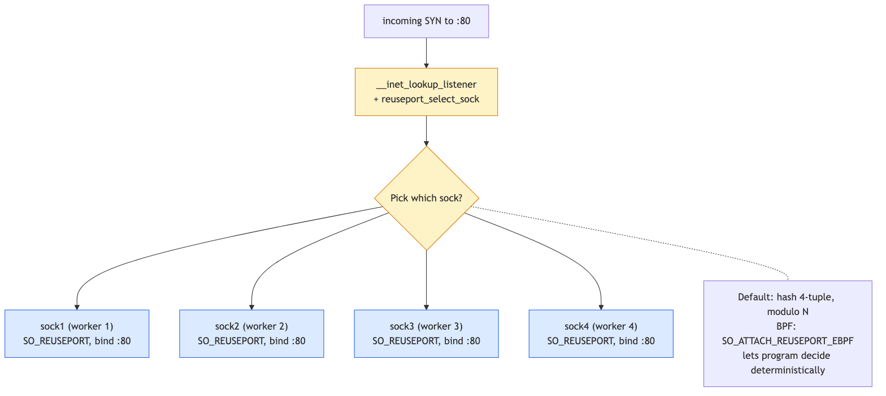

# Day 24 — SO_REUSEPORT and socket steering

> **Today's mission:** see how multiple worker processes can share a single listening port without contention, how the kernel hashes incoming connections to specific workers, and how BPF can override that hashing for custom load balancing. Total time: ~75 minutes.



## The single-listener problem

A pre-`SO_REUSEPORT` multi-worker server typically went one of two ways:

1. **Single listening socket, shared via `accept()`.** Workers all call `accept()` on the same FD. Pre-Linux-4.5, when a SYN arrived, *all* workers blocked on `accept()` would wake — only one got the connection; the rest had to recheck and re-block. Wasted CPU, scheduling churn, scattered cache lines. Even with `EPOLLEXCLUSIVE` (4.5+), there's still a single accept queue under heavy contention from one socket lock.

2. **One listener process, push connections to workers via fd-passing or socketpair.** Adds a hop (the listener has to accept, then pass), adds complexity (worker management).

Both leave the listener as a bottleneck.

## What `SO_REUSEPORT` does

Linux 3.9 (2013) added the option. `setsockopt(fd, SOL_SOCKET, SO_REUSEPORT, &one, sizeof(one))`. Set on each worker's socket *before* `bind()`, with the same UID and the same `(addr, port)`. The kernel allows N sockets to bind the same `(addr, port)` simultaneously — but only if all of them have `SO_REUSEPORT` set.

```c
int sock = socket(AF_INET, SOCK_STREAM, 0);
int opt = 1;
setsockopt(sock, SOL_SOCKET, SO_REUSEPORT, &opt, sizeof(opt));
struct sockaddr_in addr = { AF_INET, htons(80), INADDR_ANY };
bind(sock, (struct sockaddr*)&addr, sizeof(addr));
listen(sock, 128);
/* Each of N workers does this independently, with their own FD */
```

Each worker now has its own listening socket and its own accept queue. No shared state in the hot path.

### How the kernel picks one

When a SYN arrives, the kernel does a lookup in **`__inet_lookup_listener`** (`net/ipv4/inet_hashtables.c:467`). It finds the bind hash bucket for `(addr, port)`. If multiple sockets share that slot via `SO_REUSEPORT`, the kernel calls **`reuseport_select_sock`** (`net/core/sock_reuseport.c:568`).

The default selector hashes the 4-tuple (`(saddr, sport, daddr, dport)`) modulo N. Same client always lands on the same worker — connection affinity, useful for per-worker caches.

UDP is the same path with `__udp4_lib_lookup`.

## BPF-controlled selection

The default hash is sometimes wrong. Examples:
- Sticky sessions by URL hash (need to look at L7).
- Routing by application-defined session ID.
- Forcing connections from a specific source range to a specific worker.

You can attach a BPF program to control selection:

```c
int prog_fd = bpf_program_load(...);
setsockopt(sock, SOL_SOCKET, SO_ATTACH_REUSEPORT_EBPF, &prog_fd, sizeof(prog_fd));
```

The program type is `SK_REUSEPORT`. It receives the SYN's metadata (4-tuple, optional packet bytes via `bpf_skb_load_bytes_relative`) and returns the chosen socket index in the reuseport group.

`reuseport_attach_prog` (`net/core/sock_reuseport.c:683`) is the kernel-side handler.

There's also a classic `SO_ATTACH_REUSEPORT_CBPF` for cBPF (BPF v1, before eBPF) — used by older code. Modern systems use `SO_ATTACH_REUSEPORT_EBPF`.

## Per-worker accept queues — concrete benefits

- **No accept-queue contention.** Each worker drains its own queue.
- **Connection affinity.** Same client → same worker via 4-tuple hash. Cache locality, session stickiness.
- **Easy worker scaling.** Spin up a worker, it joins the group; spin one down, removed gracefully.
- **CPU pinning.** Pin worker N to CPU N; the kernel hashes new connections to all workers, and the worker N's CPU handles its share.

## Caveats

- **All sockets must set `SO_REUSEPORT` before bind.** Mid-stream changes don't work.
- **UID match required.** All sockets in the group must be owned by the same user. Prevents user A from sniping user B's port.
- **When a worker exits**, the surviving sockets' hash bucket count changes — the modulo-N changes — and existing connections that completed `accept()` are unaffected (already accepted; not in the hash anymore), but in-flight SYNs that were "destined" for the dead worker (per the old hash) may re-hash to a survivor. New arrivals work fine; mid-flight handshakes have a brief disrupted window.
- **`SO_REUSEPORT` ≠ `SO_REUSEADDR`.** `REUSEADDR` lets you re-bind a port that's in TIME_WAIT; `REUSEPORT` lets multiple sockets bind simultaneously. The names are similar; the semantics are different.

## Today's experiment

A trivial reuseport server:

```bash
cat << 'EOF' > /tmp/reuseport_srv.py
import socket, os, sys
s = socket.socket(socket.AF_INET, socket.SOCK_STREAM)
s.setsockopt(socket.SOL_SOCKET, socket.SO_REUSEPORT, 1)
s.bind(("0.0.0.0", 8080))
s.listen(64)
print(f"worker {os.getpid()} listening", flush=True)
while True:
    c, addr = s.accept()
    c.send(f"hello from {os.getpid()}\n".encode())
    c.close()
EOF

# Spawn 3 workers
python3 /tmp/reuseport_srv.py &
python3 /tmp/reuseport_srv.py &
python3 /tmp/reuseport_srv.py &

# Hit it 20 times, see different PIDs respond
for i in $(seq 1 20); do echo -n "$i: "; nc -q 1 localhost 8080; done
# Roughly 1/3 of responses from each worker

# Inspect the bind hash
sudo ss -tlnp | grep :8080
# 3 listeners, all on 0.0.0.0:8080
```

Verify the kernel-level hash is per-4-tuple:

```bash
# Same source IP, different source ports should spread:
for p in 50000 50001 50002 50003 50004; do
  echo -n "port $p: "
  nc -q 1 -p $p localhost 8080 || true
done
# Different PIDs respond — different source ports hash to different workers.
```

### Pin workers to CPUs

```bash
taskset -c 0 python3 /tmp/reuseport_srv.py &
taskset -c 1 python3 /tmp/reuseport_srv.py &
taskset -c 2 python3 /tmp/reuseport_srv.py &
taskset -c 3 python3 /tmp/reuseport_srv.py &
```

Now incoming connections are hashed across cores 0-3. Combined with NIC RSS (which RX-distributes across cores via hardware) you get end-to-end multi-core scaling without any explicit dispatch logic.

## What to read in the kernel

- **`net/core/sock_reuseport.c:320`** — `reuseport_add_sock`. How a new socket joins an existing reuseport group. ~70 lines. Note the array of socks (the group is a flat array, not a linked list — the array is indexed by hash modulo size).

- **`net/core/sock_reuseport.c:568`** — `reuseport_select_sock`. The selector. Default: hash the 4-tuple, return the indexed socket. With BPF: invoke the BPF program. Read the BPF dispatch path to see how the program type is wired.

- **`net/core/sock_reuseport.c:683`** — `reuseport_attach_prog`. How a BPF program gets associated with a reuseport group. The program is held in `struct sock_reuseport->prog`.

- **`net/ipv4/inet_hashtables.c:467`** — `__inet_lookup_listener`. The TCP-side listener lookup. When `SO_REUSEPORT` is set, falls into `reuseport_select_sock`; otherwise returns the single listener. Read this to see how the lookup combines `lhash2` (the per-port-hash table) with reuseport handling.

- **`net/ipv4/udp.c`** — search for `reuseport_select_sock` to find UDP's analogous path.

- **`tools/testing/selftests/bpf/progs/test_select_reuseport_kern.c`** — example SK_REUSEPORT BPF program. ~100 lines, shows how to write the selector.

- **`Documentation/networking/`** — search for SO_REUSEPORT writeups; mostly in the man page for socket(7).

## Bullet Points

- **`SO_REUSEPORT`** lets N sockets bind the same `(addr, port)`; kernel hashes incoming connections per-flow.
- Each worker has its own accept queue → no contention.
- **Default hash**: 4-tuple modulo N. Same client → same worker.
- **`SO_ATTACH_REUSEPORT_EBPF`** lets a BPF program override selection for custom logic (URL hashing, application-specific routing).
- All sockets must set `REUSEPORT` *before* bind, with same UID.
- Used by **nginx**, **envoy**, modern Go/Rust frameworks for multi-process scaling.
- Combine with **CPU pinning** + **NIC RSS** for end-to-end multi-core scaling.

## Check question

If a worker process exits while in-flight SYNs were already hashed to it, what happens to those new connections?

<details>
<summary>Click to reveal answer</summary>

**Answer:** They re-route to surviving workers automatically. When a socket leaves the reuseport group (worker exit), the kernel updates the group's array — the hash modulo N changes. New arrivals are immediately routed to surviving workers via the new hash. SYNs that were *partially through* the listening-socket lookup (a tiny race window) might also re-hash, but functionally see no difference.

What about connections that had completed `accept()` on the dying worker but weren't fully closed? Those are owned by the worker's accepted-sock FD; when the worker dies, the kernel sends RST on each (closing FDs implicitly closes their sockets). The client sees connection-reset; the next client request to the same VIP gets routed to a survivor. So worker death is transparent for *new* connections, but breaks *existing* connections owned by the dead worker — same as any process death.

</details>

---

## Tomorrow

Day 25: kTLS — encrypting TCP transport in the kernel.
